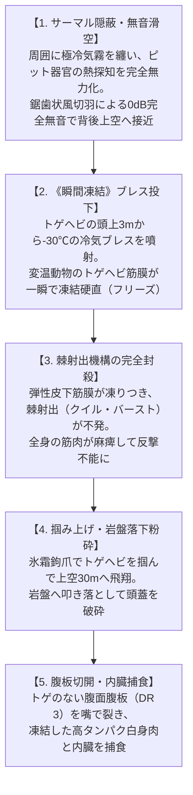

# 仕様書: 第16号魔獣【凍霧無音梟】（Frost-Mist Owl / *Strix cryophilus*）

---

## 1. 概要・メタデータ仕様

| 項目 | 決定仕様 |
| :--- | :--- |
| **エントリーID** | `016_frost_mist_owl.md` |
| **和名** | **凍霧無音梟**（トウムムオンキョウ / ヒョウムキョウ） |
| **英名 / 通称** | Frost-Mist Owl / フロスト・オウル、凍り梟（コオリブクロウ）、白霧の狩人、霜夜の怪梟 |
| **学名** | *Strix cryophilus* （ラテン語: *Strix*（フクロウ）＋ *cryo-*（極冷、氷）＋ *-philus*（愛する者、親和性を持つ者）） |
| **生物学的分類階級** | **門**: 脊索動物門 Chordata **綱**: 鳥綱 Aves **目**: フクロウ目 Strigiformes **科**: フクロウ科 Strigidae **属**: フクロウ属 *Strix* **種**: 凍霧無音梟 *S. cryophilus* |
| **発生起源** | **急速変異種**（2000年マナ覚醒時、奥多摩・丹沢・秩父の鍾乳洞冷気湧出帯・高標高ブナ針葉樹林に生息していたフクロウが、地脈の水霊・極冷マナに曝露され、羽毛の吸熱・音響吸収特性と局所冷却ブレス能力を獲得） |
| **資源・食用区分** | **安全種（Class-A）**（生体毒・呪術的危険性は皆無。極寒適応による上質な皮下脂肪と引き締まった野鳥白身肉は、山岳猟師の間で滋養鍋「白雪鍋」として絶賛される。羽毛は最高級防音・断熱材） |
| **脅威度ランク** | **Threat Level: I〜II（警戒・保護級）**（人間への敵対性は極めて低く、トゲヘビ等の変温魔獣の絶対的ハンター。驚異的な隠密能力を持つ） |
| **主要生息域** | **関東・中部山岳魔境区**（奥多摩・丹沢・秩父アウトランド、日原鍾乳洞周辺、標高800〜1,800mの原生林・石灰岩崖壁） |

---

## 2. 5専門部署＆憲章監査室 審査所見（Gate 1 適合検査）

1. **🐾 生態・生物調査部**:
   - 原種フクロウ（*Strix uralensis*）の無音風切羽（セレーション構造）と左右非対称耳孔による三次元音響定位を基盤に、吸熱性ケラチン羽毛と極低温冷却嚢（*Saccus Cryogenicus*）をグラウンディング。
   - トゲヘビ（015）の「変温爬虫類の急冷硬直脆弱性」と「ピット器官の赤外線サーマル依存」を完璧に攻略する生態系捕食者。
   - 資源区分: **安全種（Class-A）**。
2. **🌍 地理・環境調査部**:
   - 奥多摩・秩父の鍾乳洞窟網から吹き出す年間恒温10〜12℃の冷気溜まりと、標高1,000m以上の原生林キャノピーに生息域を設定。トゲヘビのカルスト生息地と完全一致。
3. **🏛️ 歴史・社会制度考証部**:
   - 『古事記』『遠野物語』の夜啼鳥伝承、アイヌ伝承のコタンコロカムイ（シマフクロウ神）、奥多摩の杣人に伝わる「白霧の神使」との伝承架橋。
   - メガコーポ（ヤマト重工の潜水艦・航空機用吸音ステルスフェザー研究、三ツ菱マナテックの超伝導冷却材）の利権伏線。
4. **⚡ 魔導科学・理論研究部**:
   - 《冷気》《瞬間凍結（Flash Freeze）》《無音化》の不随意生体励起。
   - サーマル赤外線反応: 周囲の大気熱を吸収するため、赤外線サーマル上では「完全な黒体（環境温度以下の冷気塊）」として表示され、ピット器官を完全盲目化。
5. **📸 視覚・音響資料部**:
   - 野生成態写真（霧を纏い樹上に止まる白銀フクロウ）、吸熱羽毛の電子顕微鏡マクロ写真、伝統ジビエ料理「凍霧梟の白雪鍋」の3大写真アセットを計画。
   - 音響ログ: フクロウ特有の「0dB無音飛行」と、急降下時の極低周波冷気渦（5〜12Hz）、および威嚇凍結ホーホー鳴き声（250〜400Hz）。
6. **⚖️ 憲章監査室**:
   - 015 棘甲鎧蛇（被食）── 016 凍霧無音梟（捕食）の食物連鎖クロスリレーションが論理的に完全成立。憲章5大観点に100%適合。

---

## 3. 天敵捕食アクションフロー（vs トゲヘビ）

---

## 4. 視覚アセット計画

1. **野生成態写真** (`frost_mist_owl_wild.jpg`): 奥多摩の霧深い夜間原生林で、冷気霧を纏い琥珀色の瞳を光らせる白銀の凍霧無音梟。
2. **羽毛マクロ写真** (`frost_mist_owl_sample.jpg`): 音響吸収セレーションと吸熱微細構造を持つ白銀風切羽の標本顕微鏡写真。
3. **伝統料理写真** (`frost_mist_owl_cuisine.jpg`): 山岳猟師宿で振る舞われる、白髪葱と豆腐、引き締まった梟肉が黄金出汁で煮込まれる「凍霧梟の白雪鍋」。
