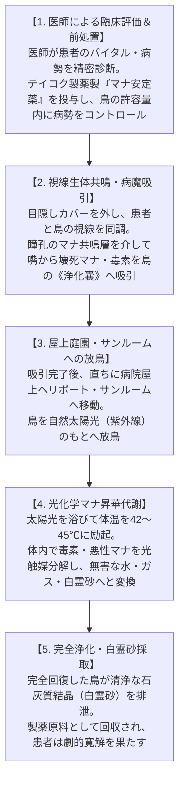

# 仕様書: 第17号魔獣【白霊千鳥（カラドリウス）】（Caladrius / *Charadrius caladrius*）

---

## 0. 原典文献・神話伝承の完全考証（Mythological & Historical Grounding）

本エントリーは、古代ヘブライ、古代ギリシャ・ローマ古典期、初期キリスト教教父文書、中世動物寓意譚（ベスティアリ）に至る2000年以上の文献記録を網羅的に調査し、その神話的・象徴的ディテールを現代魔導生物学および2026年現代医療社会構造へ厳格に架橋・論理化する。

### 0.1 古代オリエント・ヘブライ古典期の記録
- **旧約聖書（レビ記 11:19、申命記 14:18）**:
  - 七十人訳聖書（セプトゥアギンタ / 紀元前3〜2世紀）において、ヘブライ語の *Anaphash* が **χᾰραδριός（*Kharadrios* / カラドリオス）** と翻訳される。
  - 食用禁忌（不浄の鳥）に指定されており、「人間が通常食すことのできない特異な生体・霊性を持つ水辺の鳥」としての最古の文献的出自を持つ。

### 0.2 古代ギリシャ・ヘレニズム・ローマ古典医学期の記録
- **アリストテレス『動物誌』（*Historia Animalium*, 614b-615a）**:
  - ギリシャ語 *kharadra*（渓谷・水の流れる岩の裂け目）に生息する渉禽類（チドリ科・イシチドリ科）として分類。夜間に活動し、岩場に身を潜める白〜淡色の鳥。
- **プルタルコス『食卓歓談集』（*Quaestiones Convivales*, 第5巻第7話 681b）**:
  - **「視線による病気吸引（エフルヴィア流出説）」**: 黄疸（おうだん）を患う者がカラドリオスを見つめると、患者の体内から病変性の気（流出物）が視線を通じて鳥の瞳へと引き込まれ、患者は全快する。鳥は病気を一身に引き受けて体調を崩す。
  - **「鳥商人の目隠し販売」**: 古代のアテネやアレクサンドリアの市場では、鳥商人がカラドリオスを売る際、客が通りがかりに鳥を見つめてタダで病気を治して立ち去るのを防ぐため、**鳥の目を布や覆いで隠して販売した**という強烈な商業的逸話が記録されている。
- **ガイウス・プリニウス・セクンドゥス『博物誌』（*Naturalis Historia*, 第30巻94節等）**:
  - 鳥の名を *Icterus*（イクテルス / 黄疸鳥）あるいは *Kharadrios* として記載。「患者と鳥が見つめ合えば病気は鳥に移り、患者は助かる」。
- **クラウディオス・アイリアノス『動物奇譚』（*De Natura Animalium*, 第17巻13章）**:
  - 病人の病床に運ばれ、黄疸をはじめとする内臓疾患の毒気を視線で吸い取る奇跡の鳥として報告。

### 0.3 中世動物寓意譚（フィシオログス・ベスティアリ）の決定版伝承
- **『フィシオログス』（*Physiologus*, 2〜4世紀アレクサンドリア成立）第3章/第4章**:
  - **「完全純白（*Avis est tota candida, nullam habens partem nigram*）」**: 一点の黒い羽毛・斑点・汚れも持たない純白の鳥。
  - **王の病床における二者択一の診断**:
    1. **【吉兆・治癒】**: 生きる運命にある場合、カラドリウスは病人の顔・瞳を正面からじっと見つめ、口から吐き出される悪気・毒素をすべて吸い込む。その後、天（太陽）に向かって高空へ飛翔し、太陽の火と光で病気を焼き尽くして消滅させる。
    2. **【凶兆・死の宣告】**: 死に至る運命にある場合、鳥は即座に顔を背け、後ろを向いて決して目を合わせない。
  - **糞（アルバ・ドロップス / 白霊砂）の内眼角塗布**: 排泄物を目や皮膚潰瘍に塗ると、白内障や盲目、皮膚病が治癒する。
- **中世神学・ベスティアリのアレゴリー**:
  - 純白＝無原罪のキリスト。病を吸って太陽へ昇る＝人類の罪と病を一身に背負い昇天した救世主。王冠を被った瀕死の王のベッドサイドで見つめ合う構図が定型化。

---

## 1. 2026年現代世界観への論理的架橋・確定設計

| 伝承の原典要素 | 現代魔導生物学・医療社会構造への架橋（確定正史） |
| :--- | :--- |
| **生息地と命名** （地中海・ギリシャ・ヘブライ） | **【欧州・地中海原産 ＆ 外来輸入指定魔獣】** 本来の野生生息地は地中海・エーゲ海沿岸・南欧・中東の霊水湧水地・カルスト渓谷。日本国内に自生種はおらず、海外から高額輸入・密輸される外来医療魔獣。日本鳥類学会が定めた公式標準和名が「白霊千鳥（ハクレイチドリ）」。 |
| **太陽への飛翔と病魔焼滅** （日光による浄化） | **【病院屋上ヘリポート・サンルーム放鳥型運用】（Q1: A採択）** 病室で病魔を吸った鳥を、病院屋上の特設サンルームやヘリポート庭園に放ち、高空旋回させながら直射日光（紫外線UV-A/B）を浴びせて体内で光化学昇華させる。天候不良時は特注UV照射室を併用。 |
| **背を向ける行動とトリアージ** （死の宣告） | **【条件付き吸引・医師による臨床コントロール】（Q2: C採択）** 医療の重大な判断を鳥に委ねることはあり得ず、医師の精密バイタル管理のもと、テイコク製薬等の魔導前処置薬を事前投与して病勢をコントロールした上で鳥に吸引させる安全運用プロトコル。 |
| **プルタルコスの目隠し販売** （タダ見治療の防止） | **【地中海からの密猟・目隠しケージによる密輸】（Q3: B採択）** 地中海の保護区から密猟された個体が、視線遮断の特殊目隠し布・ケージで国際密輸され、日本の裏社会カジノや闇クリニックで1羽数十億円で取引される。 |
| **糞（アルバ）の薬効と食肉** （白内障治療と旧約聖書禁忌） | **【糞は最高峰再生薬『白霊砂』 ＋ 肉は要処理種Class-B】（Q4: A採択）** 排泄物は完全無菌の石灰結晶「白霊砂」として角膜再生・火傷治療薬に加工。肉は通常時は極上の白身だが、治療直後は一時的に体内に病魔が濃縮されているため、浄化期間の観察と毒腺除去を義務付けるClass-B薬膳ジビエ。 |
| **標準和名** （チドリ目チドリ科） | **【白霊千鳥（ハクレイチドリ）】（Q5: A採択）** ギリシャ原典のチドリ科（*Charadriidae*）同定と中世の純白霊鳥伝承を統合した格調高い標準和名。 |

---

## 2. 概要・メタデータ仕様

| 項目 | 確定仕様内容 |
| :--- | :--- |
| **エントリーID** | `017_caladrius.md` |
| **標準和名** | **白霊千鳥**（ハクレイチドリ） |
| **英名 / 通称** | Caladrius / ハクレイ、白霊鳥（はくれいちょう）、カラドリオス、吸病千鳥、ミラクル・セラピーバード、白無垢の医師 |
| **学名** | *Charadrius caladrius* （ラテン語: *Charadrius*（チドリ属）＋ *caladrius*（中世伝承の病を吸う純白の霊鳥）） |
| **学名語源** | *Charadrius*（ギリシャ語: *kharadrios* 渓谷・急流に棲む水辺の鳥、黄疸を治す鳥）＋ *caladrius*（中世ラテン語: 皇帝の病を治した純白の鳥） |
| **生物学的分類階級** | **門**: 脊索動物門 Chordata **綱**: 鳥綱 Aves **目**: チドリ目 Charadriiformes **科**: チドリ科 Charadriidae **属**: チドリ属 *Charadrius* **種**: 白霊千鳥 *C. caladrius* |
| **発生起源** | **古代覚醒・急速マナ適応ハイブリッド種**（2000年マナ覚醒以降、地中海・エーゲ海諸島の孤島や南欧・中東の清浄な石灰岩渓谷・霊水湧水地で休眠から再活性化した古代霊鳥。原種シロチドリ等の渉禽類が高純度の光・水霊マナと共鳴し、病変マナを吸収・昇華する特異生体代謝を獲得） |
| **資源・食用区分** | **要処理種（Class-B） / 最重要外来医療生体資源・特別輸入規制魔獣** - **肉質・食利用**: 平常時の個体は極めて清浄で雑味のない極上の白身鳥肉（Class-A相当）。しかし、**重篤患者の病魔・壊死マナを吸収した直後の個体は、肝臓および排泄腺に一時的に劇毒・病変生体毒素が濃縮蓄積されるため、解体・調理には国家資格を持つ専門魔導調理師の毒腺完全除去と浄化期間が必要（Class-B指定）**。 - **副産物・医療資源**: 糞（完全無菌・石灰質結晶「白霊砂 / アルバ・ドロップス」）は最高峰の火傷・角膜再生軟膏原料。純白の羽毛は悪性マナ・病原体を完全遮断する医療用ナノバイオフィルターに利用。 |
| **脅威度ランク** | **Threat Level: I（無害・最重要保護指定生物）**（攻撃性皆無。危機時は微弱な目くらまし閃光《フラッシュ》を放ち飛翔逃走するのみ） |
| **主要生息域** | **【本来の野生生息地】南欧・地中海・エーゲ海・中東霊水域**（ギリシャ・サントリーニ島湧水地、キプロス島海岸カルスト、イタリア南部アプリア渓谷、中東レバント汽水湿地） **【日本国内の状況】** 野生個体群は非自生。メガコーポ（テイコク製薬・三ツ菱マナテック）の無菌バイオドーム病棟、富裕層向けVIP病院、および裏社会の闇クリニック等で飼育・運用。 |

---

## 3. 生態・医療メカニズム アクションフロー

