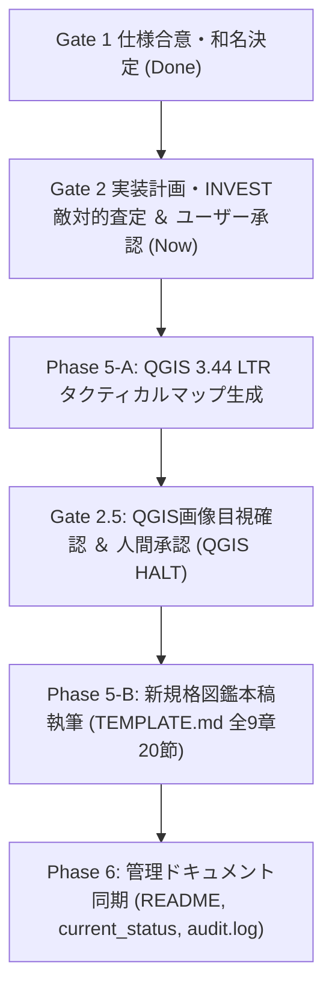

# タスクリスト: 第009号 鍾乳石灰粘塊 カルサイト・ケイブ・スライム 再構築タスク (.tasks.md)

**対象エントリー**: `creatures/009_calcite_cave_slime.md`  
**担当チーム**: 5専門部署合同タスクフォース ＆ 憲章監査室  
**起草日**: 2026-09-19  

---

## 1. タスク一覧と依存関係

---

## 2. 詳細タスク定義

- [x] **Task 1: 仕様策定とGate 1バリデーション (Phase 0)**
  - [x] 古典文献考証（アリストテレス、プリニウス、パラケルスス）の抽出
  - [x] 一次野生生息地（ディナル・アルプスカルスト帯）と日本国内分布の特定
  - [x] 標準和名候補の提示とユーザー合意（ショウニュウセッカイネンカイ［鍾乳石灰粘塊］）
  - [x] `verify_gate1.py` 100% PASS確認
  - [x] `009_calcite_cave_slime_gate1.json` 発行

- [x] **Task 2: 実装計画策定とINVEST敵対的ペルソナ査定 (Phase 2 & Gate 2 HALT)**
  - [x] `009_calcite_cave_slime.plan.md` の作成（全9章20節チェックリスト）
  - [x] GURPS公式呪文（《酸作成》《土変化》《石を土》《土作成》）のGrep実在突合
  - [x] 上位存在真名『スリュ・ズル・オゥ（Slyu-Zurl-Oh）』および音素由来の策定
  - [x] `verify_gate2.py` 100% PASS確認
  - [x] 6専門部署ペルソナによるINVEST準拠敵対的査定の開示
  - [x] 詳細設計の確認質問（Q1/Q2: A/B/C/X）の提示
  - [x] ユーザーからの計画着工承認（Proceed）受領待ち停止（HALT）
  - [x] `009_calcite_cave_slime_gate2.json` 発行

- [x] **Task 3: QGISタクティカルマップ生成 (Phase 5-A)**
  - [x] `fetch_map_tiles.py` による地形タイル取得（BypassSandbox: true）
  - [x] `assert_network_isolated.py` による完全遮断検証（BypassSandbox: false）
  - [x] `generate_tactical_map.py` によるオフライン描画（Panel A: ポストイナ / Panel B: 関東奥多摩要塞線）
  - [x] `verify_qgis_map.py` 100% PASS確認

- [x] **Task 4: Gate 2.5 QGIS画像目視確認 (Gate 2.5 HALT)**
  - [x] 生成マップ画像の提示とユーザー目視確認
  - [x] ユーザー承認（Proceed）受領
  - [x] `009_calcite_cave_slime_qgis.json` 発行

- [x] **Task 5: 図鑑記事本稿執筆 (Phase 5-B)**
  - [x] `creatures/009_calcite_cave_slime.md` の全9章20節完全執筆
  - [x] Mermaid生体解剖図・生態系流通図の高コントラスト化（`color:#ffffff`）
  - [x] GURPS 4th Stat Blockの完全記述
  - [x] 6ペルソナ査定メモ・現場小話（`## 脚注・専門部署査定メモ`）の配備

- [x] **Task 6: 正史監査・ドキュメント同期 (Phase 6)**
  - [x] `doc/questions_and_answers.md`（Q48）の更新
  - [x] `doc/current_status.md` の更新
  - [x] `doc/audit.log`（エントリ84）への記録
  - [x] `README.md` の更新
