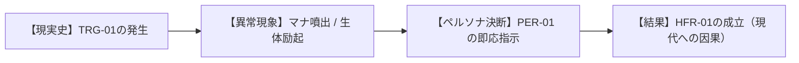
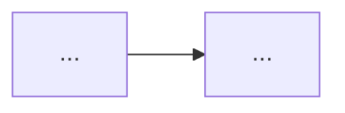

# 【歴史ユーザーストーリー集】HIST-STO-[年代]-[識別子]: [テーマ名]

> **主管**: 歴史・社会制度考証部（V・シュルツ 特命調査員）  
> **準拠規格**: AWS AIDLC Inception Phase (Stage 3: User Stories & Acceptance Criteria)  
> **参照要件書**: `requirements.md` (HFR-01〜, HNFR-01〜)  
> **参照ペルソナ書**: `personas.md` (PER-01〜)  
> **ステータス**: DRAFT / UNDER_REVIEW / APPROVED  

---

## 1. ストーリー要件トレーサビリティ・マトリックス（Traceability Matrix）

| ストーリーID | 担当ペルソナ | 対応要件ID | 対応トリガーID | INVEST判定 |
| :--- | :--- | :--- | :--- | :--- |
| **STO-01** | PER-01 [肩書] | HFR-01, HNFR-02 | TRG-01 | **PASS** |
| **STO-02** | PER-02 [肩書] | HFR-02, HNFR-03 | TRG-01 | **PASS** |
| **STO-03** | PER-03 [肩書] | HFR-03, HNFR-04 | TRG-02 | **PASS** |

---

## 2. 歴史ユーザーストーリー詳細

### ストーリー 1: STO-01 [ストーリータイトル]

```markdown
As a [PER-01: 肩書・役割]
When [TRG-01: 現実の公式歴史事件が裏でマナ現象を誘発したとき]
I had to [歴史的行動・超法規的措置・極秘決断]
So that [後世（2026年現代）に続く制度・防衛線・社会構造が成立した]
```

#### ① 歴史因果・状態遷移図（Mermaid Journey）


#### ② 受け入れ基準（Acceptance Criteria: Given-When-Then）
```gherkin
Scenario: [シナリオ名: 制度または防衛線の成立検証]
  Given 2000年マナ覚醒から[経過期間]であり、[前提状況]であること
  When 現実の[TRG-01: 事件名]が発生した際、裏で[マナ現象・魔獣災害]が生起すること
  Then 憲章 1.2（生体媒介原則: 電子機器非干渉）を100%遵守し、[検証可能な事実・制度]が確立すること
```

#### ③ 歴史考証エピソード本文（Detailed Narrative）
[2〜3段落の詳細な学術的・臨場感ある歴史記録テキスト]

---

### ストーリー 2: STO-02 [ストーリータイトル]

```markdown
As a [PER-02: 肩書・役割]
When [TRG-01: ...]
I had to [...]
So that [...]
```

#### ① 歴史因果・状態遷移図（Mermaid Journey）


#### ② 受け入れ基準（Acceptance Criteria: Given-When-Then）
```gherkin
Scenario: [...]
  Given [...]
  When [...]
  Then [...]
```

#### ③ 歴史考証エピソード本文（Detailed Narrative）
[...]

---

## 3. INVEST適合性自己評価（INVEST Self-Assessment）

AIDLC `user-stories-assessment.md` 規格に基づく品質セルフチェック：

- [x] **Independent（独立性）**: 各ストーリーが他のエピソードに過度に従属せず、単体で歴史記録として成立しているか。
- [x] **Negotiable（交渉可能性）**: 歴史的解釈や現場ディテールにおいて、後続のレビューで改定可能な余白があるか。
- [x] **Valuable（価値創出）**: 2026年現代の図鑑世界観の根幹（法制度、防衛壁、メガコーポ、新人類差別）に直結する価値があるか。
- [x] **Estimable（見積可能性）**: 時代設定や関与組織の規模が歴史的・軍事的に妥当か。
- [x] **Small（適切な粒度）**: 1つのストーリーが1つの明確な事件・決断にフォーカスしているか。
- [x] **Testable（テスト可能性）**: Given-When-Then の受け入れ基準によって、最上位憲章との無矛盾性を機械的検証できるか。
