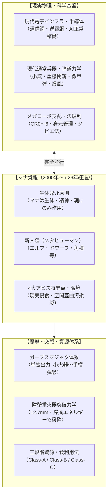

# 現代魔獣・幻獣生態図鑑プロジェクト (Modern Mana Bestiary Project)

西暦2000年の「マナ覚醒（ミレニアム・アウェイクニング）」によって変貌を遂げた現代世界（2026年現在）を舞台に、都市・廃墟・秘境・アビス特異点に生息する魔獣・幻獣の生態、脅威度、解剖構造、科学的解釈、交戦マニュアル、および資源利用法を体系化した**総合世界観構築＆学術型生態図鑑リポジトリ**です。

---

## 1. 世界観の根幹法則（コア・ロー）

本プロジェクトは、現実世界の科学・物理・法制度・銃火器弾道学と、GURPS第4版基準の精密な魔導力学を高度に融合させたハードなリアリズムに基づいています。



- **マナ覚醒（時間軸）**: 2000年1月1日に世界規模でマナが復活。現代（2026年）は覚醒から**26年**が経過した社会。
- **生体媒介原則（完全並行）**: マナは電子機器や送電網などの物理現象とは干渉しない。電脳魔術は「術士の生体電位・脳神経系」を介した同調技術に限定される。
- **軍事バランス**: 知恵のない通常魔獣は通常兵器で駆逐可能。魔術障壁は12.7mm徹甲弾や爆風等の物理運動エネルギーで突破可能。非物理の霊体には専門魔法部隊が出動。
- **地理構造（多層同心円要塞網）**: 皇居・山手線内側の「コア・セーフゾーン」から、外環防護壁、国道16号/圏央道前線基地、そして壁外の「アウトランド（奥多摩・秩父魔境・東京湾アビス）」へと同心円状に展開。
- **三段階資源分類法**:
  - **Class-A（安全種）**: 生体毒がなく、家畜養殖・一般流通が認可された種。
  - **Class-B（要処理種）**: 国家資格を持つ専門調理師による毒腺切除や特殊下処理を要するジビエ種。
  - **Class-C（汚染種）**: 食用完全禁止・劇物・バイオハザード指定種。

---

## 2. リポジトリ構成 (Repository Structure)

```
world-building/
├── README.md                      # プロジェクト概要・総合目次（本ドキュメント）
├── AGENTS.md                      # 世界観最上位憲章（シングル・ソース・オブ・トゥルース）
├── GEMINI.md                      # SDD AI行動規範・品質ゲート・HALTプロトコル
├── TEMPLATE.md                    # 魔獣図鑑エントリーの標準マークダウンテンプレート
│
├── .specify/                      # 仕様書駆動開発 (SDD) コア資産
│   ├── memory/constitution.md     # SDD最上位開発憲章
│   ├── templates/                 # spec, plan, tasks, clarify テンプレート一式
│   ├── specs/                     # 魔獣・機能の仕様書アーカイブ
│   ├── plans/                     # 実装計画書アーカイブ
│   └── tasks/                     # タスク進捗リストアーカイブ
│
├── .agents/                       # Antigravity エージェント基盤
│   ├── rules/                     # SDDルール定義 (sdd-rules.md 等)
│   ├── workflows/                 # SDD 6大ワークフロー (/sdd.specify, /sdd.clarify 等)
│   └── skills/                    # ドメイン知識スキル (creature-design, thaumaturgy-engine)
│
├── world/                         # 正史世界観設定資料
│   ├── geography.md               # 4大アビス特異点 ＆ 首都圏多層同心円要塞網
│   ├── history.md                 # 2000〜2026年表・メガコーポ・新人類差別史
│   ├── magic_theory.md            # ガープス基準魔術理論・生体媒介原則
│   └── magic/                     # 魔導科学・呪文アーカイブ
│       ├── index.md               # 魔導総合インデックス・全系統前提ツリー
│       ├── rules/                 # GURPS 4th 魔導・戦闘・社会全34ルール
│       └── spells/                # 四大元素・技術・死霊・知識等 全16系統呪文
│
├── creatures/                     # 個別魔獣・幻獣図鑑エントリー（第1号〜第16号）
│   ├── 001_crag_boar.md           # 剛毛巌猪（クラッグ・ボア / Class-B）
│   ├── 002_thunder_gryphon.md     # 迅雷鷲獅子（サンダー・グリフォン / Class-A）
│   ├── 003_urban_street_spirit.md # 辻神・都市霊（アーバン・スピリット / 霊体種）
│   ├── 004_magma_salamander.md    # 溶岩火蜥蜴（マグマ・サラマンダー / Class-B）
│   ├── 005_dew_sprite.md          # 朝露小精霊（デュー・スプライト / Class-A）
│   ├── 006_carbuncle.md           # 紅玉小獣（カーバンクル / Class-A）
│   ├── 007_pyro_pride_lion.md     # 陽炎巨鬣獅（パイロ・プライド・ライオン / Class-B）
│   ├── 008_astral_nebula_jelly.md # 幽光星海月（アストラル・ネビュラ・ジェリー / Class-B）
│   ├── 009_calcite_cave_slime.md  # 鍾乳石灰粘塊（カルサイト・スライム / Class-B）
│   ├── 010_titanoroc_arabicus.md  # 砂嵐巨怪鳥（ロック / アル・ルフ / Class-C）
│   ├── 011_abyss_polyp.md         # 千眼触手星雲（アビス・ポリプ / Class-C）
│   ├── 012_wood_bowtruckle.md     # 樹皮小人（ボウトラックル / Class-B）
│   ├── 013_morpho_phantasma.md    # 幻光モルフォ（モルフォ・ファントマ / Class-B）
│   ├── 014_kamaitachi.md          # 旋風鎌鼬（カマイタチ / Class-B）
│   ├── 015_spined_armored_viper.md # 棘甲鎧蛇（トゲヨロイヘビ / Class-B）
│   └── 016_shirakiri_owl.md       # 白霧梟（シラキリフクロウ / Class-A）
│
├── assets/                        # マルチメディア資料アーカイブ
│   ├── images/                    # 地図・作戦マップ画像
│   └── creatures/                 # 魔獣別高精細写真（標本マクロ・野生写真・料理写真）
│
└── doc/                           # プロジェクト管理・正史監査ログ
    ├── current_status.md          # 現在の成果物・タスク進捗サマリー
    ├── questions_and_answers.md   # 世界観Q&A（Q1〜Q28 決定事項正史エビデンス）
    └── audit.log                  # 対話経緯・すり合わせ変更履歴ログ
```

---

## 3. 収録魔獣・幻獣図鑑一覧

現在、第1号から第16号までの魔獣エントリーが完全構築されています。各記事には**GURPS 4th準拠の戦闘データ**、**Mermaid生体解剖図**、**音響周波数データ（Acoustic Logs）**、および**高精細視覚資料**が完備されています。

| No. | 和名 / 学名 | 脅威度 | 資源区分 | 主生息域 / 特徴 |
| :---: | :--- | :---: | :---: | :--- |
| **001** | [**剛毛巌猪** (クラッグ・ボア)](creatures/001_crag_boar.md)<br>*Sus scrofa petrosus* | TL II | Class-B | 奥多摩山岳魔境。シリカ結晶装甲剛毛（DR 14/7）と時速54km/h突進。 |
| **002** | [**迅雷鷲獅子** (サンダー・グリフォン)](creatures/002_thunder_gryphon.md)<br>*Gryphus fulgurans* | TL IV | Class-A | 北米カスケード山脈。生体雷管（ライデン腺）と20mm対空砲迎撃空域。 |
| **003** | [**辻神・都市霊** (アーバン・スピリット)](creatures/003_urban_street_spirit.md)<br>*Genius loci urbanus* | TL II | Class-C | シアトル・メトロプレックス。アスファルト・ネオン管・煤煙の具現霊体。 |
| **004** | [**溶岩火蜥蜴** (マグマ・サラマンダー)](creatures/004_magma_salamander.md)<br>*Salamandra vulcanica* | TL III | Class-B | 南欧・エトナ火山。玄武黒曜外殻（DR 12）とヒートショック急冷戦術。 |
| **005** | [**朝露小精霊** (デュー・スプライト)](creatures/005_dew_sprite.md)<br>*Faylla rorifica* | TL I | Class-A | 独シュヴァルツヴァルト。浮遊水滴球と半透明小人の非好戦的治癒精霊。 |
| **006** | [**紅玉小獣** (カーバンクル)](creatures/006_carbuncle.md)<br>*Carbunculus gemmifer* | TL I | Class-A | 高尾山マナ保護林。額の生体ルビー結晶による《屈折障壁》《精神沈静》。 |
| **007** | [**陽炎巨鬣獅** (パイロ・ライオン)](creatures/007_pyro_pride_lion.md)<br>*Leo solaris* | TL III | Class-B | 東アフリカ・サバンナ。耐熱ケラチン鬣による蜃気楼迷彩とプライド包囲狩猟。 |
| **008** | [**幽光星海月** (アストラル・ジェリー)](creatures/008_astral_nebula_jelly.md)<br>*Aurelia astronebula* | TL II | Class-B | 太平洋アビス〜東京湾。青紫燐光の星核嚢と新月夜間の海面上空中浮遊。 |
| **009** | [**鍾乳石灰粘塊** (カルサイト・スライム)](creatures/009_calcite_cave_slime.md)<br>*Calcislimus spelunca* | TL II | Class-B | 日原鍾乳洞。方解石懸濁ゲルによる鍾乳石擬態・落下捕食・銃撃無効。 |
| **010** | [**砂嵐巨怪鳥** (ロック / アル・ルフ)](creatures/010_titanoroc_arabicus.md)<br>*Titanoroc arabicus* | TL IV | Class-C | 中東ハジャル山脈。翼開長30m超・ハニカム骨格・局所砂嵐を操る天災怪鳥。 |
| **011** | [**千眼触手星雲** (アビス・ポリプ)](creatures/011_abyss_polyp.md)<br>*Abyssanima polyposa* | TL IV | Class-C | 青木ヶ原異界汚染域。虹色虚眼球による視覚精神汚染（SAN値崩壊）と位相転移。 |
| **012** | [**樹皮小人** (ボウトラックル)](creatures/012_wood_bowtruckle.md)<br>*Dendrophasma britannicum* | TL I | Class-B | 英国古代樹林。植物節足キメラ構造・超精密木質棘爪による樹木相利共生。 |
| **013** | [**幻光モルフォ** (モルフォ・ファントマ)](creatures/013_morpho_phantasma.md)<br>*Morpho phantasma* | TL II | Class-B | アマゾン林冠層。棚状多層結晶による光屈折不可視化・残像投影・幻覚性燐粉。 |
| **014** | [**旋風鎌鼬** (カマイタチ)](creatures/014_kamaitachi.md)<br>*Mustela itatsi falcata* | TL II | Class-B | 信越・飛騨山岳魔境。3頭協調狩猟（転ばし・鎌爪切断・無痛麻痺）と局所真空刃。 |
| **015** | [**棘甲鎧蛇** (トゲヨロイヘビ)](creatures/015_spined_armored_viper.md)<br>*Acanthoserpens echinatus* | TL II | Class-B | 奥多摩・丹沢カルスト岩石林。チタンケイ素逆棘装甲（DR 7）・棘射出・薬膳鍋。 |
| **016** | [**白霧梟** (シラキリフクロウ)](creatures/016_shirakiri_owl.md)<br>*Strix cryophilus* | TL I | Class-A | 奥多摩鍾乳洞冷気林。0dB無音滑空・サーマル隠蔽・《瞬間凍結》トゲヘビ天敵・炭火串焼き。 |
| **017** | [**白霊千鳥** (カラドリウス)](creatures/017_caladrius.md)<br>*Charadrius caladrius* | TL I | Class-B | 地中海サントリーニ島等（外来輸入）。病魔吸引・太陽光昇華代謝・白霊砂再生薬・薬膳澄まし仕立て。 |


---


## 4. 仕様書駆動開発 (SDD) ガバナンス体制

本プロジェクトは、Google Codelabs の仕様書駆動開発（Specification-Driven Development）に準拠した厳格な品質ゲートを設けています。

```
[Phase 0: Specify] ── 外部科学リサーチ（骨格/咬合力/弾道学/法規）と仕様起草
       ▼
【Gate 1: 専門部署審査＆選択式すり合わせ (HALT)】 ★ここで停止しユーザー合意
  ├ ① 5専門部署・憲章監査室による審査所見の開示
  ├ ② 方向性・生態特性の選択肢（A/B/C/X）の提示
  └ ③ 回答結果の正史エビデンス化 (doc/questions_and_answers.md)
       ▼（合意後）
[Phase 2: Plan]    ── 実装計画書 (.specify/plans/*.plan.md)
[Phase 3: Tasks]   ── 独立検証可能なタスク一覧 (.specify/tasks/*.tasks.md)
       ▼
【Gate 2: 計画承認】 ★ここで停止しユーザーの進行合意を確認
       ▼（合意後）
[Phase 5: Implement] ── 図鑑記事執筆・画像生成・Mermaid構造図作成
       ▼
[Phase 6: Audit]   ── 進捗・監査ログの更新 (doc/current_status.md, audit.log)
```

### 5専門部署・憲章監査室の役割
1. **🐾 生態・生物調査部**: 原種生物学、解剖学、咬合力、感染症、三段階ジビエ分類。
2. **🌍 地理・環境調査部**: 結界都市多層防衛網、アウトランド、4大アビス特異点。
3. **🏛️ 歴史・社会制度考証部**: 26年時間軸、メガコーポ支配、新人類（メタヒューマン）差別。
4. **⚡ 魔導科学・理論研究部**: 生体媒介原則、ガープスマジック出力限界、障壁弾道力学。
5. **📸 視覚・音響資料部**: 学術画像プロンプト生成、音響周波数ログ、Mermaid構造図規格統制。
6. **⚖️ 憲章監査室**: `AGENTS.md` 最上位憲章および過去Q&Aとの無矛盾性監査。

---

## 5. ライセンス・著作権表記

- **本プロジェクト**: 現代魔獣・幻獣生態図鑑プロジェクト (Modern Mana Bestiary Project)
- **設定・世界観管理**: 仕様書駆動開発 (SDD) オーケストレーション基盤
- **魔導・戦闘体系参照**: GURPS 4th Edition / GURPS Magic (Steve Jackson Games) 準拠ローカライズ
