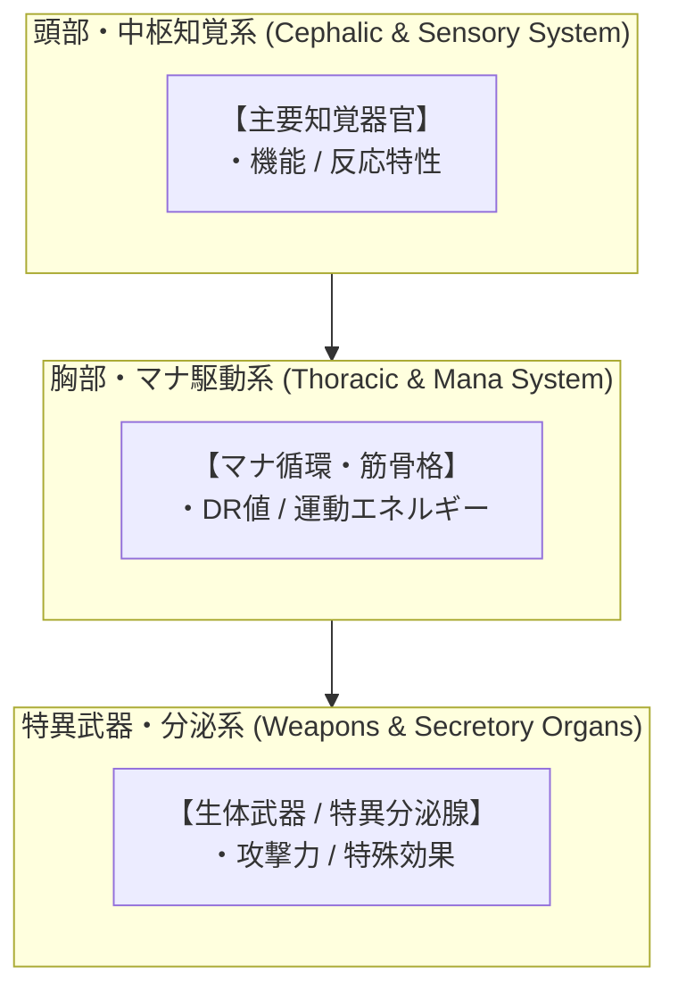
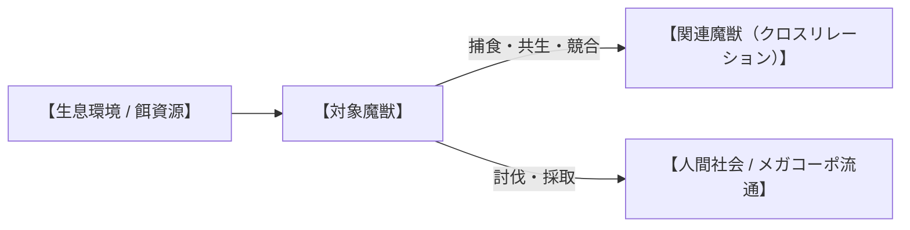

# 【和名（漢字＋ルビ）】（英名／*学名*／通称）

---

## 1. 基本分類・早わかり（Basic Classification & Fast Facts）

| 項目 | 内容 |
| :--- | :--- |
| **和名** | （例：白霧梟 / シラキリフクロウ） |
| **和名命名規約** | **【形態型 / 環境型 / 季節型 / 伝承型】**（例: 形態・環境型）<br>※命名根拠: （例: 全身を覆う純白羽毛と、夜間山岳の霧を発生させる生態環境に基づく） |
| **英名 / 通称** | （例：White-Mist Owl / 白霧、凍夜の静寂鳥） |
| **学名** | *（例：Strix cryophilus）* |
| **学名語源** | （例：*Strix*（ラテン語: フクロウ）＋ *cryophilus*（ギリシャ語: 寒冷を好む者）） |
| **生物学的分類** | **門**: （例: 脊索動物門 Chordata）<br>**綱**: （例: 鳥綱 Aves）<br>**目**: （例: フクロウ目 Strigiformes）<br>**科**: （例: フクロウ科 Strigidae）<br>**属**: （例: フクロウ属 *Strix*）<br>**種**: （例: 白霧梟 *S. cryophilus*）<br>**変異亜種**: （例: 奥多摩局地変異型 *S. c. okutamaensis*） |
| **発生起源** | **急速変異種** / **古代覚醒種** / **異界流入種（アビス種）** |
| **資源・管理区分** | **安全種（Class-A）** / **要処理種（Class-B）** / **汚染種（Class-C）**<br>※管理ステータス: （例: 狩猟認可種 / 駆除対象害獣 / 国際希少野生動植物保護指定種） |
| **食性** | （例: 肉食・冷気マナ食 / 小型哺乳類、トゲヨロイヘビ、山岳昆虫） |
| **寿命** | （例: 野生 8〜12年 / 飼育下 15〜20年） |
| **サイズ・重量** | （例: 体長 45〜55cm / 翼開長 110〜125cm / 体重 850〜1,200g） |
| **直感的サイズ比較** | **【成人男性（180cm）/ 路線バス（10m）/ ティーカップ との比較】**<br>※（例: 小型猛禽類サイズ。翼を広げると成人男性の腕を広げた幅の約3分の2に相当） |
| **脅威度ランク** | **Threat Level: I〜V**（自警団・警察・自衛隊通常部隊・特殊魔法部隊・不可侵天災級） |
| **主要生息域** | **【一次生息地】** （例: 欧州アルプス山岳霊峰、標高1,500〜2,800m）<br>**【国内出現・回遊】** （例: 奥多摩・秩父山岳魔境区、第3同心円要塞線外縁） |

---

### 生息・分布マップ（Distribution & Habitat Range Map）


> **【生息分布データ】**:
> - **一次野生生息地（原産地・特異点）**: （例: マリアナ海溝・太平洋アビス大断層 水深1,000〜3,000m）
> - **回遊・出現警戒エリア**: （例: 東京湾口（浦賀水道要塞線外縁）〜房総・相模湾沖、新月期湧昇流）
> - **環境耐性・生息限界**: （例: 水温 2〜15℃ / マナ濃度 40〜120 mU/m³）


---

### 視覚資料アーカイブ（Visual Archive）

| 生態観測写真（野生環境） | 採取標本・組織マクロ写真 | 伝統料理・ジビエ写真（可食種のみ） |
| :---: | :---: | :---: |
|  |  |  |
| *（撮影地・観測年などのキャプション）* | *（提供元・標本番号などのキャプション）* | *（料理名・提供店舗などのキャプション）* |

---

## 2. 伝承考証とマナ覚醒の架橋（Lore & Historical Bridge）

### 2.1 原典・民俗伝承の記録
- **発祥地域・原典文献**: （例: 越後七不思議、大プリニウス『博物誌』、中世ベスティアリ等）
- **古来の目撃伝承**: （例: 伝承に記された外見、行動、人々に与えた畏怖・崇拝の記述）

### 2.2 2000年マナ覚醒による生体科学的架橋
- （古来の伝承がいかにして2000年のマナ覚醒によって現代の魔導生体力学として実体化したか、あるいはマナ希薄期に小型化・休眠していた古代種がどのように再活性化したかを科学的・論理的に紐解く）

---

## 3. 生物学的特徴・ライフステージ（Biological Traits & Anatomy）

### 3.1 外見・解剖学的身体構造
- **体躯・骨格・筋肉系（DR値）**: （骨格強度、ケラチン装甲、筋肉密度）
- **歯・顎・消化器官（捕食・摂食の機能美）**: （肉を切り裂く裂肉歯、丸呑み機構、特殊キレート消化液、マナ吸収器官）
- **感覚器官・特異マナ受容器**: （ピット器官、散在神経環、マナ共振洞）



### 3.2 ライフステージと繁殖・育児ドラマ
1. **幼体・若齢期（Juvenile）**: （外見、孵化/出産数、母獣による保護、ヘルパー若鳥による給餌手伝い等の育児習性、脅威度 Threat Level I 等）
2. **成熟個体（Adult）**: （標準的な成体スペック、縄張り行動、オス同士のディスプレイ・角突き合わせ競争、群れの順位階級）
3. **主級・変異個体（Alpha / Elder）**: （長寿個体やアビス高濃度マナ曝露個体のスペック、体躯倍率、群れの統率力、脅威度 +1〜+2）

---

## 4. 生態・食物連鎖・人間社会との摩擦（Ecology & Human Conflict）

### 4.1 食性・捕食行動
- **主食・栄養源**: （主食生物、必要カロリー・マナ補給量）
- **狩猟・捕食戦術**: （高所急降下、待ち伏せ、集団挟み撃ち、丸呑み等の詳細ディテール）



### 4.2 魔獣間クロス・リレーション（相互作用）
- **他魔獣との捕食・被食関係**: （例: 剛毛巌猪の幼体を狙うが、成体のシリカ装甲は貫通できない等）
- **共生・競合・生息域の住み分け**: （該当する相互作用がある場合のみ記述）

### 4.3 人間社会との摩擦・利用・保護史（Human-Creature Interactions）
- **防護インフラ・境界フェンス**: （例: 要塞防護壁、ディンゴ・フェンス的害獣侵入防止柵、忌避ソナーブイ網の敷設史）
- **都市適応・害獣化・ゴミあさり**: （例: 人間の生ごみや漏洩電脳マナを漁る都市部での被害実態）
- **伝統的狩猟・原住民文化**: （例: 先住民族やマタギによる持続可能な伝統狩猟・儀礼利用）
- **メガコーポ乱獲と保護法規**: （例: 素材目当ての密猟と国際保護条約、養殖管理体制）

---

## 5. 魔導科学・上位神性・背景ロア（Thaumaturgical Theory & Lore）

### 5.1 魔力現象と発現メカニズム
- **励起生体呪文・属性力学**: （生体媒介原則に基づくGURPS突合呪文力学）
- **物理・科学・電磁的相互作用**: （電子機器非干渉、赤外線・サーマル反応、ソナー反射特性）

### 5.2 音響・周波数・生体通信特性（Acoustic & Resonance Analysis）
- **基本発声・運動周波数**: （例: 8Hz〜14Hz）
- **警戒音・咆哮・超音波パルス**: （例: 38kHz〜50kHz / 音圧 45dB〜85dB）
- **マナ共鳴音**: （例: 432Hz / 音圧 25〜40dB）

### 5.3 上位存在・アビス因果・メガコーポ伏線
- **アストラル原型（動物王・精霊王・神格）**: （上位次元の原型存在との関係性）
- **アビス特異点との因果関係**: （4大アビス特異点からのマナ波長影響）
- **メガコーポの極秘研究・特許利権**: （ヤマト重工、テイコク製薬、三ツ菱マナテック等の兵器・新薬・素材特許）

---

## 6. 交戦マニュアル・都市防災コラム（Combat Manual & Civil Defense）

### 6.1 GURPS 4th Stat Block（戦闘データ）

#### 【通常成体（Standard Adult）】
```yaml
Name: （和名／学名／通称）
Archetype: （魔獣アーキタイプ）
Point Total: ○○ pt
Threat Level: II (警戒対象)

Attributes:
  ST: ○ [○]       HP: ○ [○]
  DX: ○ [○]       WILL: ○ [○]
  IQ: ○ [○]       PER: ○ [○]
  HT: ○ [○]       FP: ○ [○]

Basic Parameters:
  Basic Speed: ○ [○]
  Basic Move: ○ [○]
  Size Modifier (SM): ○ (体長 ○m, 体重 ○kg)
  Dodge: ○

Damage:
  Melee Attack: ○d [ダメージ種別]

DR (防護点) & 防御特性:
  - 胴体: DR ○
  - 特異部位: DR ○
  - 特殊防御特性: （例: Injury Tolerance等）

Traits & Advantages:
  - 特徴1 / Advantage 1 [CP]
  - 特徴2 / Advantage 2 [CP]

Disadvantages & Quirks:
  - 弱点1 / Disadvantage 1 [CP]
  - 弱点2 / Disadvantage 2 [CP]

Innate Spells (生体励起魔術 - マナ消費はFP):
  - 《呪文名 / Spell Name》: Skill ○○ (FP ○消費 / 効果概要)
```

#### 【主級・変異個体（Alpha / Pack）】
- **能力値修正**: （ST/HP/SM等の強化ステータス）
- **追加特性・連携異能**: （群れ連携ボーナス、上位呪文、指揮フェロモン等）

### 6.2 推奨火器・防護装備
- **有効火器・弾薬**: （散弾銃、12.7mm重機関銃、徹甲弾など）
- **必須防護具・センサー**: （サーマルゴーグル、密閉マスク、ケブラー防具など）

### 6.3 市民防災メモ ＆ 専門家の知恵袋

> [!IMPORTANT]
> **【市民向け防災メモ：○○遭遇時の避難手順】**
> （民間人向けハンドブック、警報発令時の退避プロトコル）  
> —— *○○警察庁 / 自衛隊要塞司令部 防災指針*

> [!TIP]
> **【現場専門家・ベテランハンターの知恵袋】**
> *「（現場での実践的な回避・対処アドバイス）」*  
> —— **所属・肩書・氏名**

---

## 7. 解体・ジビエ食文化・料理レシピ（Harvesting & Cuisine）

### 7.1 解体プロトコルと市場相場（Class-A / B）
- **必須下処理・除染手順**: （臭腺切除、毒嚢摘出、放血等）
- **市場取引相場**: 豊洲新中央市場・八王子前線基地におけるキロ単価（円）

### 7.2 伝統料理・メガコーポスペシャリテ（本格レシピ）

```
【料理名】（例: 越後名物・鎌鼬と雪嶺根菜の酒粕山神鍋）
- 分類: （郷土猟師料理 / スラム屋台B級グルメ / メガコーポ迎賓館スペシャリテ）
- 主材料: （魔獣肉部位、副食材、調味料）
- 調理手順:
  1. 【下処理・漬け込み】: 
  2. 【火入れ・煮込み】: 
  3. 【仕上げ・盛り付け】: 
- テイスティングノート: （食感、風味、マナ摂取による生体反応、価格目安）
```

### 7.3 産業素材・医療利用

| 採取部位 | 工業・魔導用途 | 経済価値・取引相場 |
| :--- | :--- | :--- |
| **部位1（爪・牙・角等）** | 先端装甲、超精密工具、魔導触媒 | 1個体分: ○○万円 |
| **部位2（皮・ゲル・体液等）** | メタヒューマン医療パッチ、耐熱繊維、生薬 | 100g: ○○万円 |

---

## 8. 現場記録・通信ログ（Field Logs & Transcripts）

```
【緊急魔獣速報（J-ALERT）または特科無線交信ログ】
発信: （発信元）
対象地域: （対象エリア）
内容: （交信記録または警報テキスト）
```

> *「（調査員、討伐ハンター、または軍関係者による生々しい手記）」*  
> —— **所属・階級・氏名**（観測年）

---

## 9. 参考文献・典拠資料（References）

1. **民俗学・原典文献**: （例: 『越後七不思議考』『絵本百物語』など）
2. **生物学・解剖学資料**: （例: 原種生物の骨格・咬合力・毒性論文）
3. **法規・軍事・地理資料**: （例: 防衛省結界管理令、豊洲魔獣肉衛生基準）
