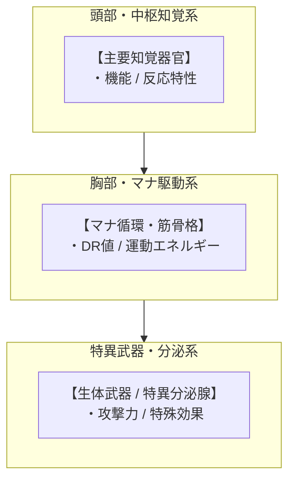
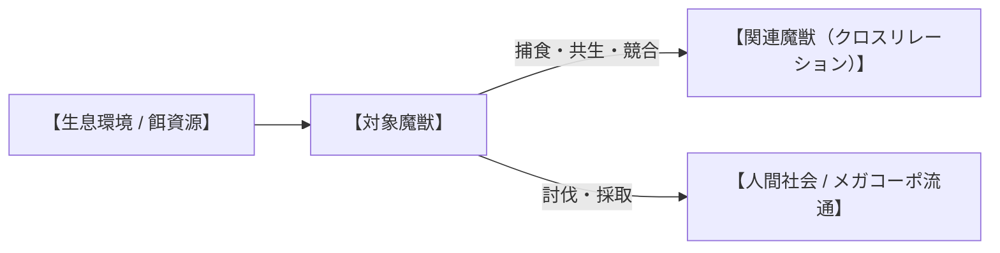

# 【和名（漢字＋ルビ）】（英名／*学名*／通称）

---

## 1. 基本分類・メタデータ

| 項目 | 内容 |
| :--- | :--- |
| **和名** | （例：旋風鎌鼬 / ツムジカマイタチ） |
| **英名 / 通称** | （例：Whirlwind Kamaitachi / 風鎌、雪嶺の切り裂き魔） |
| **学名** | *（例：Mustela itatsi falcata）* |
| **学名語源** | （例：*Mustela*（ラテン語: イタチ）＋ *itatsi*（日本語: イタチ）＋ *falcata*（ラテン語: 鎌状の、鎌を備えた）） |
| **生物学的分類** | **門**: （例: 脊索動物門 Chordata）<br>**綱**: （例: 哺乳綱 Mammalia）<br>**目**: （例: 食肉目 Carnivora）<br>**科**: （例: イタチ科 Mustelidae）<br>**属**: （例: イタチ属 *Mustela*）<br>**種**: （例: ニホンイタチ *M. itatsi*）<br>**亜種（変異種）**: （例: *M. i. falcata*） |
| **発生起源** | **急速変異種** / **古代覚醒種** / **異界流入種（アビス種）** |
| **資源・食用区分** | **安全種（Class-A）** / **要処理種（Class-B）** / **汚染種（Class-C）** |
| **脅威度ランク** | **Threat Level: I〜V**（自警団・警察・自衛隊通常部隊・特殊魔法部隊・不可侵天災級） |
| **主要生息域** | （例：信越・飛騨・北陸山岳魔境区、標高1,000〜2,000m尾根筋） |

### 視覚資料アーカイブ（Visual Archive）

| 生態観測写真（野生環境） | 採取標本・組織マクロ写真 | 伝統料理・ジビエ写真（可食種のみ） |
| :---: | :---: | :---: |
|  |  |  |
| *（撮影地・観測年などのキャプション）* | *（提供元・標本番号などのキャプション）* | *（料理名・提供店舗などのキャプション）* |

---

## 2. 伝承考証とマナ覚醒の架橋（Lore & Historical Bridge）

### 2.1 原典・民俗伝承の記録
- **発祥地域・原典文献**: （例: 越後七不思議、飛騨・美濃の山岳民間伝承、『絵本百物語』等）
- **古来の目撃伝承**: （例: 旋風とともに現れ、1人が転ばせ、1人が切り、1人が薬を塗るという3人組の神/妖怪の記録）

### 2.2 2000年マナ覚醒による生体科学的架橋
- （古来の伝承がいかにして2000年のマナ覚醒によって現代の魔導生体力学として実体化したか、あるいはマナ希薄期に小型化・休眠していた古代種がどのように再活性化したかを科学的・論理的に紐解く）

---

## 3. 生物学的特徴・ライフステージ

### 3.1 外見・身体構造
- **体長 / 翼開長 / 体高 / 体重**: 
- **骨格・筋肉系・外皮（DR値）**: 
- **感覚器官・特異マナ器官**: 



### 3.2 ライフステージと個体変異
1. **幼体・若齢期（Juvenile）**: （外見、母獣による保護、脅威度 Threat Level I 等）
2. **成熟個体（Adult）**: （標準的な成体スペック、縄張り行動）
3. **主級・変異個体（Alpha / Elder）**: （長寿個体やアビス高濃度マナ曝露個体のスペック、体躯倍率、脅威度 +1〜+2）

---

## 4. 生態・食物連鎖・相互作用

### 4.1 食性・捕食行動
- **主食・栄養源**: 
- **狩猟・捕食戦術**: 



### 4.2 魔獣間クロス・リレーション（相互作用）
- **他魔獣との捕食・被食関係**: （例: 剛毛巌猪の幼体を狙うが、成体のシリカ装甲は貫通できない等）
- **共生・競合・生息域の住み分け**: （該当する相互作用がある場合のみ記述）

### 4.3 縄張り・社会性・繁殖
- **群れの構造・縄張りシグナル**: 
- **繁殖期・産卵/出産数・寿命**: 

---

## 5. 魔導科学・上位神性・背景ロア

### 5.1 魔力現象と発現メカニズム
- **励起生体呪文・属性力学**: （生体媒介原則に基づく魔導力学）
- **物理・科学・電磁的相互作用**: （電子機器非干渉、赤外線・サーマル反応）

### 5.2 音響・周波数・生体通信特性（Acoustic & Resonance Analysis）
- **基本発声・羽ばたき周波数**: （例: 8Hz〜14Hz）
- **生体超音波パルス・警戒音**: （例: 38kHz〜50kHz / 音圧 45dB〜85dB）
- **共鳴・風切り音**: （例: 6kHz〜12kHz）

### 5.3 上位存在・アビス因果・メガコーポ伏線
- **アストラル原型（動物王・精霊王・神格）**: （上位次元の原型存在との関係性）
- **アビス特異点との因果関係**: （4大アビス特異点からのマナ波長影響）
- **メガコーポの極秘研究・キメラ兵器伏線**: （アズテクノロジーやテイコク製薬の実験・治験等の裏設定）

---

## 6. 交戦マニュアル・都市防災コラム

### 6.1 GURPS 4th Stat Block（戦闘データ）

#### 【通常成体（Standard Adult）】
- **能力値**: ST ○, DX ○, IQ ○, HT ○
- **副能力値**: HP ○, FP ○, 基本速度 ○, 移動力 ○ (SM ○ / 体重 ○kg)
- **能動防御**: よけ ○
- **防護点（DR）**: 胴体 DR ○, 特異部位 DR ○
- **近接/射撃攻撃**: `○d [ダメージ種別]`（装甲除数等の修正）
- **生体呪文 / 異能**: 《呪文名-目標値》

#### 【主級・変異個体（Alpha / Pack）】
- （群れ連携ボーナス、またはAlpha個体の強化ステータス）

### 6.2 推奨火器・防護装備
- **有効火器・弾薬**: （散弾銃、12.7mm重機関銃、徹甲弾など）
- **必須防護具・センサー**: （サーマルゴーグル、密閉マスク、ケブラー防具など）

### 6.3 市民防災メモ ＆ 専門家の知恵袋

> [!IMPORTANT]
> **【市民向け防災メモ：○○遭遇時の避難手順】**
> （民間人向けハンドブック、警報発令時の退避プロトコル）  
> —— *○○警察庁 / 自衛隊要塞司令部 防災指針*

> [!TIP]
> **【現場専門家・ベテランハンターの知恵袋】**
> *「（現場での実践的な回避・対処アドバイス）」*  
> —— **所属・肩書・氏名**

---

## 7. 解体・ジビエ食文化・料理レシピ

### 7.1 解体プロトコルと市場相場（Class-A / B）
- **必須下処理・除染手順**: （臭腺切除、毒嚢摘出、放血等）
- **市場取引相場**: 豊洲新中央市場・八王子前線基地におけるキロ単価（円）

### 7.2 伝統料理・メガコーポスペシャリテ（本格レシピ）

```
【料理名】（例: 越後名物・鎌鼬と雪嶺根菜の酒粕山神鍋）
- 分類: （郷土猟師料理 / スラム屋台B級グルメ / メガコーポ迎賓館スペシャリテ）
- 主材料: （魔獣肉部位、副食材、調味料）
- 調理手順:
  1. （下処理・漬け込み）
  2. （火入れ・煮込み）
  3. （仕上げ・薬味）
- テイスティングノート: （食感、風味、マナ摂取による生体反応）
```

### 7.3 産業素材・医療利用
- **採取可能部位**: （爪、牙、外殻、分泌液等）
- **産業・先端医療用途**: （メガコーポ製品、生薬原料、高機能素材）

---

## 8. 現場記録・通信ログ

```
【緊急魔獣速報（J-ALERT）または特科無線交信ログ】
発信: （発信元）
対象地域: （対象エリア）
内容: （交信記録または警報テキスト）
```

> *「（調査員、討伐ハンター、または軍関係者による生々しい手記）」*  
> —— **所属・階級・氏名**（観測年）

---

## 9. 参考文献・典拠資料（References）

1. **民俗学・原典文献**: （例: 『越後七不思議考』『絵本百物語』など）
2. **生物学・解剖学資料**: （例: 原種生物の骨格・咬合力・毒性論文）
3. **法規・軍事・地理資料**: （例: 防衛省結界管理令、豊洲魔獣肉衛生基準）
