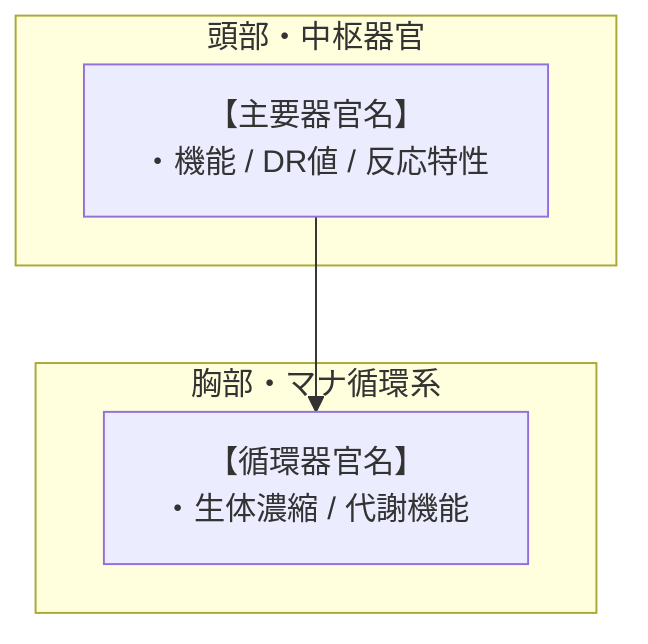

# 【魔獣・幻獣名】（和名／学名／英名）

---

## 1. 基本分類・メタデータ

| 項目 | 内容 |
| :--- | :--- |
| **和名** | （例：○○○） |
| **学名** | *（例：Genus species）* |
| **英名 / 通称** | （例：Common Name / 別名・通称） |
| **発生起源** | **急速変異種** / **古代覚醒種** / **異界流入種（アビス種）** |
| **資源・食用区分** | **安全種（Class-A）** / **要処理種（Class-B）** / **汚染種（Class-C）** |
| **脅威度ランク** | **Threat Level: I〜V**（自警団・警察・自衛隊通常部隊・特殊魔法部隊・不可侵天災級） |
| **主要生息域** | （例：アウトランド第○区、旧市街廃墟、マナ汚染指定区域、地下水路等） |

### 視覚資料アーカイブ（Visual Archive）
- **生態写真 / 観測記録**: ``
- **素材 / 標本マクロ写真**: ``

---

## 2. 生物学的特徴・形態

### 2.1 外見・身体構造
- **体長 / 体高 / 体重**: 
- **骨格・外皮**: 
- **感覚器官・特異器官**: 

### 2.2 変異・覚醒の経緯
- （2000年のマナ覚醒以降、どのような原種から変異したか、またはどのような古代環境・異界から出現したかの記録）

---

## 3. 生態・行動パターン

### 3.1 食性・捕食行動
- （主食、狩猟方法、マナ摂取の有無など）

### 3.2 縄張り・社会性
- （単独行動、群れの規模、巣の形成、活動周期など）

### 3.3 繁殖・ライフサイクル
- （繁殖期、産卵・出産形態、幼体から成体への成長速度、寿命など）

---

## 4. 魔導科学・生物学的考察

### 4.1 魔力現象と発現メカニズム
- （魔術障壁の有無、属性ブレス、身体強化、感覚共有などの現象と、それを支える生体器官の仮説）

### 4.2 科学的・電磁的相互作用
- （電子機器への影響の有無、電磁波や赤外線センサーに対する反応、物理法則との整合性）

### 4.3 音響・周波数・生体通信特性（Acoustic & Resonance Analysis）
- **鳴き声・発声周波数**: （例：基本周波数帯 35kHz〜42kHz、可聴域 800Hz〜1.2kHz）
- **音圧・指向性**: （例：最大 110dB、正面狭角指向性）
- **通信・共鳴メカニズム**: （超音波エコロケーション、微弱電位・共感波パルス等）

---

## 5. 交戦マニュアル・防衛対策

### 5.1 有効な現代兵器・戦術
- **推奨火器・口径**: （例：5.56mm小銃弾で有効、12.7mm重機関銃推奨、対戦車誘導弾が必要など）
- **障壁・耐久性への対処**: （障壁の有無と、重火器・運動エネルギーによる突破手順）
- **専門魔法部隊の要否**: （霊体要素の有無、魔術的対抗手段の必要性）

### 5.2 弱点・回避行動
- （弱点部位、嫌う音・光・化学物質、遭遇時の退避プロトコル）

---

## 6. 解体・食利用・素材採取

### 6.1 食用利用と調理法（Class-A / B の場合）
- **可食部位と肉質**: 
- **下処理・調理プロトコル**: （※Class-Bの場合は免許保有者による毒抜き・寄生虫処理・伝統的手順）
- **風味・食感の記録**: 

### 6.2 素材採取と工業・医療利用
- **採取可能部位**: （角、外殻、牙、腺分泌液、毛皮など）
- **用途**: （防弾素材、耐熱複合材、医療用抽出液、研究用サンプル等）
- **バイオハザード・衛生上の注意**: （血液毒、腐敗時の有害ガス、変異胞子の飛散防止等）

---

## 7. 現場記録・調査員ログ

> *「（調査員、討伐ハンター、軍関係者、または魔獣料理人による生々しい現場の証言・手記）」*  
> —— **所属・階級・氏名**（202X年 観測記録より）
