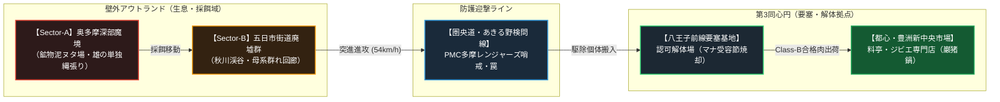
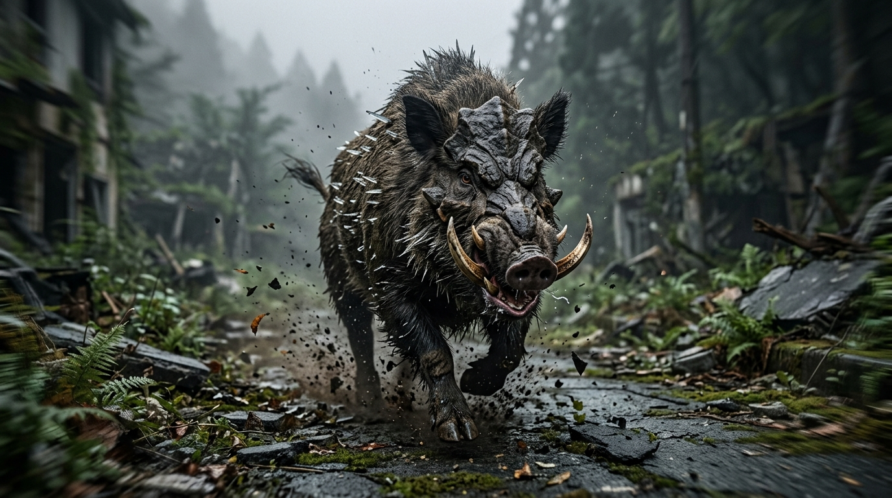
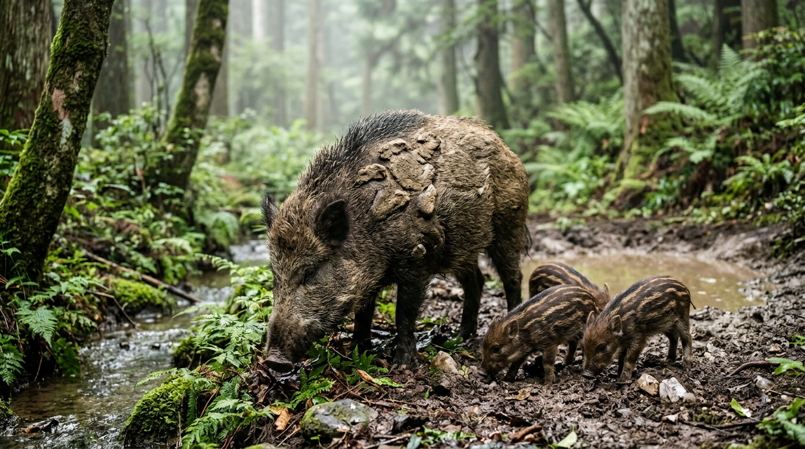

# 【剛毛巌猪】（ゴウモウガンチョ／*Sus scrofa petramorphus*／Crag Boar）

---

## 1. 基本分類・メタデータ

| 項目 | 内容 |
| :--- | :--- |
| **和名** | 剛毛巌猪（ゴウモウガンチョ） |
| **学名** | *Sus scrofa petramorphus* |
| **英名 / 通称** | Crag Boar / クラッグ・ボア、巌猪（がんちょ）、鎧イノシシ |
| **発生起源** | **急速変異種**（原種：ニホンイノシシ *Sus scrofa leucomystax*） |
| **資源・食用区分** | **要処理種（Class-B）**（認可魔獣調理師による特定部位除去および完全加熱必須） |
| **脅威度ランク** | **Threat Level: II（中脅威度 / 地方自警団・警察PMC・自衛隊普通科対応）** |
| **主要生息域** | 関東防護圏 国道16号壁外アウトランド第1〜第2区（奥多摩・秩父山岳魔境区、丹沢外縁、旧五日市街道廃墟群） |

```
【図鑑外観標本 / Field Specimen Illustration】
```


```
【野生生態写真 / Field Wildlife Documentary Photo】
奥多摩山岳魔境区（第2アウトランド）の原生林において、鉱物混じりの泥土を掘り起こして採餌を行う成熟した雄個体。鼻骨のクラニアル・シールドと背部に生える結晶化シリカ剛毛、湿潤な樹林の光景が記録されている。
```


```
【関東西部アウトランド・剛毛巌猪（Crag Boar）生息戦術作戦図 / Habitat Sector Tactical Map】

[標高 1,500m〜2,000m: 雲取山・秩父深部魔境] (高濃度マナ湧出源 / 未踏査域)
       │
       ▼
┌─────────────────────────────────────────────────────────────┐
│ 【Sector-A: 奥多摩原生魔境区】(第1アウトランド / 標高 800-1,400m)     │
│  - 特徴: 高密度マナ土壌、石英・ケイ素鉱物露頭、広大な泥浴び場（ヌタ場）    │
│  - 生息状況: 成熟雄個体（単独・縄張り主）の常時生息域 (Threat Level II)   │
│  - 危険要因: 鉱物摂取直後の凶暴化、落石・地滑り誘発突進                   │
└──────────────────────┬──────────────────────────────────────┘
                       │ [秋川・多摩川上流水系 / 旧青梅街道]
                       ▼
┌─────────────────────────────────────────────────────────────┐
│ 【Sector-B: 旧五日市・秋川渓谷廃墟群】(第2アウトランド / 標高 300-800m)  │
│  - 特徴: 崩壊した旧市街・コンクリート廃墟・変異植生が繁茂                 │
│  - 生息状況: 母系群れ（雌5〜10頭＋ウリ坊）の採餌・移動回廊              │
│  - 危険要因: 廃墟物陰からの突発的突進、コンクリート建造物の破壊・採掘      │
└──────────────────────┬──────────────────────────────────────┘
                       │ [旧五日市街道・秋川街道突進回廊 (速度 54km/h)]
                       ▼
═══════════════════════════════════════════════════════════════
【防衛境界線: 圏央道・あきる野前線検問ゲート / PMC多摩レンジャーズ哨戒線】
═══════════════════════════════════════════════════════════════
                       │ (突破個体の迎撃・駆除ライン)
                       ▼
┌─────────────────────────────────────────────────────────────┐
│ 【Sector-C: 八王子前線要塞都市】(第3同心円 / 国道16号バッファーゾーン)    │
│  - 拠点: 陸上自衛隊八王子駐屯地、八王子前線魔獣解体場、認可PMC出撃基地   │
│  - 防衛兵装: 12.7mm重機関銃タレット、対魔導コンクリート防護壁            │
│  - 物流: 解体・安全検査後の食肉を「豊洲新中央魔獣市場」へ高速保冷輸送    │
└─────────────────────────────────────────────────────────────┘
```



---

## 2. 生物学的特徴・形態

### 2.1 外見・身体構造
- **体長 / 体高 / 体重**: 体長 1.8m〜2.4m / 体高 1.1m〜1.4m / 体重 250kg〜420kg（原種の約2〜3倍に大型化、サイズ修正: **SM +1**）
- **骨格・外皮**: 
  - 前頭骨および鼻骨が異常肥厚し、厚さ50mm〜80mmに達する強固な湾曲骨板（クラニアル・シールド）を形成。
  - 体毛（剛毛）は高濃度の生体ケイ素（シリカ）およびマナ変異タンパク質で結晶化しており、針状の硬質ニードルアーマーとして背部から臀部を覆う。
- **感覚器官・生体特異器官**: 
  - 嗅覚は原種の約4倍に鋭敏化しており、地下3mの根茎や数キロ先の血痕、金属腐食臭を感知。
  - 下顎の犬歯（牙）は上方へ湾曲して長さ30cm〜45cmに達し、先端には微細な鋸歯状構造を持つ。
  - **第二胃マナ受容節（霊的胃腺）**: 摂取した鉱物を生体触媒的に分解・代謝還元する生体マナ器官。
  - **項部マナ神経束（頚椎基部）**: 突進衝突時に生体電位を介して不随意衝撃緩和力場を励起する制御神経節。

### 2.2 変異・覚醒の経緯
2000年のミレニアム・アウェイクニング以降、関東山地（奥多摩・秩父）の旧土壌に堆積した鉱物資源と湧出マナに晒されたニホンイノシシが急速に変異。わずか数世代の短期間で骨格の大型化と外皮の石化変異が定着した。

```
[原種: ニホンイノシシ (約80-120kg)]
       │
       ▼ (2000年: 奥多摩山地での高濃度マナ被曝・鉱物泥浴び)
[骨格肥大・ケイ素結合タンパク質の異常沈着・第二胃マナ受容節の形成]
       │
       ▼ (約10世代の淘汰・定着)
[剛毛巌猪 (Sus scrofa petramorphus: 250-420kg / SM +1)]
```

---

## 3. 生態・行動パターン

### 3.1 食性・突進捕食行動
- **雑食性・土壌鉱物摂取**: 
  - 根茎、堅果類、腐肉、小型変異齧歯類に加え、石英やケイ酸塩鉱物を好んで摂取・咀嚼する。砂嚢状に特殊化した第二胃で鉱物を破砕し、体毛の結晶化骨格へと代謝還元する。
- **突進捕食**: 
  - 最高時速 **54km/h（BM 15）** で一直線に突進。300kg以上の質量と運動エネルギーで障害物を粉砕し、獲物を跳ね飛ばして捕食する。

```
【決定的瞬間記録: 旧五日市街道廃墟群における高速突進 / High-Speed Charge Action Shot】
旧市街の崩壊したアスファルトを粉砕しながら時速50km超で直進する成熟雄個体。前頭骨クラニアル・シールドとシリカ剛毛が夕暮れの霧中で鋭く光り、猛烈な運動エネルギーを伴う土煙が記録されている。
```


### 3.2 縄張り・母系群れと育成
- **小規模マトリフィリア（母系群れ）**: 
  - 成熟した雌と幼体（ウリ坊）による5〜10頭の群れを形成。成熟した雄は単独で広大な縄張りを持ち、繁殖期（11月〜1月）にのみ群れに合流する。
  - 泥浴び場（ヌタ場）にマナ結晶鉱物を混ぜ込んだ特殊な泥壁を構築し、縄張りの標識とする。
- **繁殖・ライフサイクル**:
  - 年1回、春期に4〜8頭を出産。幼体（ウリ坊期）は通常の猪縞模様に微細な鉱物結晶の輝きが混じり、生後6ヶ月で剛毛の硬質化が開始。2年で完全な成体（Threat Level: II）へと達する。寿命は約15年〜20年。

```
【野生群れ生態記録: 奥多摩深部ヌタ場での母系群れ採餌 / Sounder & Piglets Foraging Scene】
奥多摩深部の渓流沿いヌタ場において、鉱物泥を掘り起こして採餌を行う雌個体と3頭の幼体（ウリ坊）。幼体期から土壌中の石英・ケイ酸塩を好んで摂取する様子が捉えられている。
```


---

## 4. 魔導科学・生物学的考察

### 4.1 魔力現象と発現メカニズム（魔導理論分析）
- **生体ケイ素硬化と地霊系生体励起**: 
  - **理論魔導学派（ハーメチック・メイジ）の分析**: 本種は能動的な魔術詠唱を行わないが、体内のマナ受容細胞が筋肉収縮および神経電位と連動し、ガープスマジックにおける**地霊系（Earth College）呪文《土から石へ (Earth to Stone)》《土変化 (Shape Earth)》** に類似した生体内触媒作用を不随意に励起している。これにより、第二胃内でケイ素化合物を瞬時に結晶骨格へと還元・再構成している。
  - **不随意衝撃緩和力場（Kinetic Dampener）**: 突進衝突の瞬間、項部マナ神経束から微小な生体力場が全身のシリカ剛毛へ伝播し、衝突の自己脳震盪を防ぎつつ衝撃を全身へ分散させている。
  - **伝統・儀式学派（マタギ・山伏）の伝承**: 古くから奥多摩・秩父山中で「荒ぶる山の主の分霊」として畏怖され、狩猟時には山の神への鎮魂儀礼（解体前の刃物清め）が経験則として受け継がれている。

### 4.2 ガープス準拠 生体パラメータ（GURPS Stat Block）

| 能力値・項目 | 規格数値 | 生物学的・力学的解釈 |
| :--- | :--- | :--- |
| **ST（体力）** | **24** | 基礎荷重値 BL $\approx 52.3 \text{ kg}$。軽トラックに匹敵する突進質量と筋力。 |
| **DX（敏捷力）** | **11** | 四足歩行の安定した走破性（急旋回は不得手）。 |
| **IQ（知力）** | **4** | 獣的知能。危険察知・突進本能（意志力 Will 10、知覚 Per 12）。 |
| **HT（生命力）** | **13** | 高い代謝能力と強靭な生命維持力。 |
| **HP / FP** | **HP 26 / FP 13** | 骨肉の物理的耐久力。 |
| **移動力 / 速度** | **BM 15（時速 54.0 km/h）** | 加速時の直線突進速度（BS 6.0 $\times$ 移動倍率）。 |
| **サイズ修正 (SM)** | **+1** | 最長体長 2.4m、体重 350kg超の大型四足獣。 |
| **防護点 (DR)** | ・頭部前頭骨：**DR 14**<br>・背部剛毛：**DR 7**<br>・腹部・頚部：**DR 3** | 正面頭部は5.56mm NATO通常弾を完全跳弾・無効化。背部は防刃・防破片。 |
| **生まれつきの攻撃** | **結晶牙突進（Tusk Gore）** | 致傷力 `突き 2d+2 (刺)` ＋ **装甲半減 [AD(2)]**（シリカ鋸歯と突進慣性による貫通）。 |
| **生得的防御特徴** | **激突反動抵抗 [DR 8]** | 突進自爆時の頭部反動ダメージ限定の相殺力場。 |

### 4.3 科学的・電磁的相互作用
- **電磁波・シリコン非干渉**: マナ覚醒の絶対法則通り、電子機器や通信機器への電磁的干渉は一切ない。赤外線暗視スコープおよびミリ波レーダーによる探知が極めて有効に機能する。

---

## 5. 交戦マニュアル・防衛対策

### 5.1 有効な現代兵器・弾道力学

```
【正面からの小銃射撃は危険】
 5.56×45mm NATO通常弾（5d / 平均17点）──> [前頭骨シールド (DR 14 ＋ 傾斜)] ──> 弾道偏向・跳弾（無効）
 
【有効射撃ポイント】
 7.62×51mm NATO徹甲弾 [AP: DR半減] ───> [耳孔下部・側面肋骨隙間（心肺部: DR 3）] ──> 致命貫通
 12.7×99mm 重機関銃（13d+1 / 平均46点）──> [頭部正面でも骨板ごと粉砕・即死]
```

- **推奨火器**:
  - **小口径小銃（5.56mm NATO / 89式・20式小銃等）**: 正面からの射撃は前頭骨シールドで跳弾する危険性が極めて高い。側面からの眼窩・耳孔狙撃に限定。
  - **推奨標準火器**: **12ゲージ散弾銃（非鉛硬質スラッグ弾）**、または **7.62×51mm NATO徹甲弾（64式・SCAR-H等）**。
  - **重火器**: 要塞線車載 **12.7mm重機関銃（M2）** または 40mm自動擲弾銃。正面からの一撃で骨板ごと粉砕・無力化可能。
- **専門魔法部隊の出動**: **不要**。物理的実体を持つ通常変異種であり、自衛隊普通科・警察・認可PMC（多摩レンジャーズ等）の現代通常火器で100%制圧可能。

### 5.2 弱点・回避行動
- **急所**: 耳孔直下の頚椎部、前脚後方の脇下（DR 3と薄く心肺部に直結）。
- **回避戦術**: 直線突進速度は速いが、骨格の重量化により急旋回ができない。突進軸から直角に3m横移動することで回避可能。

### 5.3 魔術的捕獲・無力化プロトコル（術士連携戦術）
術士が同行する調査隊や捕獲班においては、以下の呪文行使が極めて有効である：
- **動物系呪文《動物沈静 (Beast Soothe)》**: 獣的知能（IQ 4 / 意志力 10）のため、術士の精神干渉呪文に対する抵抗力が低い。突進前の威嚇段階で沈静化・行動停止が可能。
- **移動系呪文《足止め (Glue)》《油化 (Grease)》**: 突進経路上に摩擦喪失面を展開することで、超重量突進のグリップ力を奪い、転倒・自滅を誘発。
- **地霊系呪文《石から土へ (Stone to Earth)》**: 突進進路の舗装路・岩盤を瞬時に泥濘化させ、突進速度を強制減速（BM 15 $\rightarrow$ BM 3）。

---

## 6. 解体・食利用・流通市場

### 6.1 食用利用と調理法（Class-B / 要処理種）
- **可食部位と肉質**: 
  - ロースおよびバラ肉は極上のサシが入った濃厚な赤身肉。ナッツや鉱物性土壌の芳醇な香りを持つ。
- **下処理・調理プロトコル**: 
  - **マナ変異型E型肝炎および特定線虫リスク**: 生食・レア調理は厳禁。
  - **処理基準**: 八王子前線解体場や大宮解体センター等の認可魔獣解体施設において、**「第二胃マナ受容節」** および内臓（特に肝臓・胆嚢・脾臓）を肉に接触させず摘出・焼却。中心温度 **85℃以上で15分間以上の加熱調理**（煮込み、または長時間のロースト）が義務付けられている。
- **市場流通**: 
  - 解体・安全検査を受けた肉塊は、**「豊洲・新中央魔獣市場」**を通じて結界都市内の高級料亭やジビエ専門店へ合法出荷される。看板料理「巌猪鍋（ガンチョ鍋）」は1人前8,000円〜15,000円の高値で取引される。

### 6.2 素材採取と工業利用
- **採取可能素材**:
  1. **巌猪の剛毛（シリカ・ニードル）**: 高強度・軽量な防刃・防破片繊維として民間PMC用防弾ベストの織込素材に利用（1kgあたり市場価格 約8万円）。
  2. **頭骨湾曲板（クラニアル・シールド）**: 破砕して対魔獣防護壁用の耐熱セラミックス複合材骨材に転用。
  3. **牙**: 工芸品、ナイフの柄、高級印鑑素材。
- **バイオハザード注意点**: 解体時の血液接触感染防止のため、作業者はレベル2バイオハザード防護手袋およびゴーグルの着用が義務付けられている。

---

## 7. 現場記録・調査員ログ

> *「新米のハンターがよくやるミスが、国道16号の外で正面から5.56mmのフルオートを頭に叩き込むことだ。火花が散って跳弾し、逆上した300キロの岩塊が時速50キロで突っ込んでくる。  
> 奴を仕留めたけりゃ、横に跳んで脇腹に12番スラッグを叩き込むか、八王子要塞基地からブローニング（12.7mm）を積んだテクニカルを持ってくるこった。  
> だがな、苦労して八王子の解体所に持ち込んで合格スタンプを貰った後のバラ肉を、味噌仕立てで煮込んだ『巌猪鍋』は……外環ウォールの外に出る命がけの仕事をすべて忘れさせてくれる味だよ」*  
> —— **関東防護圏公認 害獣駆除PMC「多摩レンジャーズ」隊長・陣内 剛造**（2025年 駆除報告書より）
