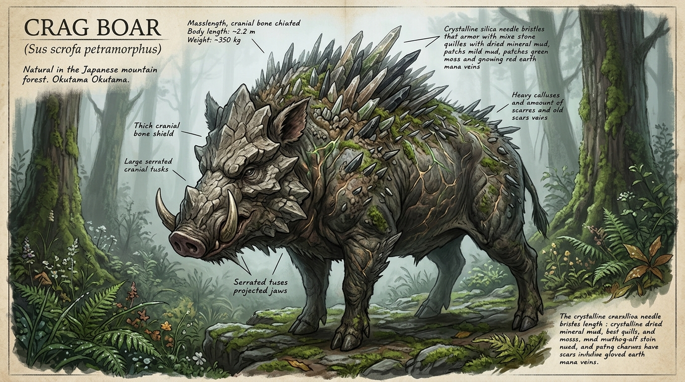

# 【剛毛巌猪】（ゴウモウガンチョ／*Sus scrofa petramorphus*／Crag Boar）

---

## 1. 基本分類・メタデータ

| 項目 | 内容 |
| :--- | :--- |
| **和名** | 剛毛巌猪（ゴウモウガンチョ） |
| **学名** | *Sus scrofa petramorphus* |
| **英名 / 通称** | Crag Boar / クラッグ・ボア、巌猪（がんちょ）、鎧イノシシ |
| **発生起源** | **急速変異種**（原種：ニホンイノシシ *Sus scrofa leucomystax*） |
| **資源・食用区分** | **要処理種（Class-B）**（認可魔獣調理師による特定部位除去および完全加熱必須） |
| **脅威度ランク** | **Threat Level: II（中脅威度 / 地方自警団・警察PMC・自衛隊普通科対応）** |
| **主要生息域** | 関東防護圏 国道16号壁外アウトランド第1〜第2区（奥多摩・秩父山岳魔境区、丹沢外縁、旧五日市街道廃墟群） |

```
【図鑑外観標本 / Field Specimen Illustration】
```


---

## 2. 生物学的特徴・形態

### 2.1 外見・身体構造
- **体長 / 体高 / 体重**: 体長 1.8m〜2.4m / 体高 1.1m〜1.4m / 体重 250kg〜420kg（原種の約2〜3倍に大型化）
- **骨格・外皮**: 
  - 前頭骨および鼻骨が異常肥厚し、厚さ50mm〜80mmに達する強固な湾曲骨板（クラニアル・シールド）を形成。
  - 体毛（剛毛）は高濃度の生体ケイ素（シリカ）およびマナ変異タンパク質で結晶化しており、針状の硬質ニードルアーマーとして背部から臀部を覆う。
- **感覚器官・特異器官**: 
  - 嗅覚は原種の約4倍に鋭敏化しており、地下3mの根茎や数キロ先の血痕、金属腐食臭を感知。
  - 下顎の犬歯（牙）は上方へ湾曲して長さ30cm〜45cmに達し、先端には微細な鋸歯状構造を持つ。

### 2.2 変異・覚醒の経緯
2000年のミレニアム・アウェイクニング以降、関東山地（奥多摩・秩父）の旧土壌に堆積した鉱物資源と湧出マナに晒されたニホンイノシシが急速に変異。わずか数世代の短期間で骨格の大型化と外皮の石化変異が定着した。

```
[原種: ニホンイノシシ (約80-120kg)]
       │
       ▼ (2000年: 奥多摩山地での高濃度マナ被曝・鉱物泥浴び)
[骨格肥大・ケイ素結合タンパク質の異常沈着]
       │
       ▼ (約10世代の淘汰・定着)
[剛毛巌猪 (Sus scrofa petramorphus: 250-420kg)]
```

---

## 3. 生態・行動パターン

### 3.1 食性・捕食行動
- **雑食性・土壌鉱物摂取**: 
  - 根茎、堅果類、腐肉、小型変異齧歯類に加え、石英やケイ酸塩鉱物を好んで摂取・咀嚼する。砂嚢状に特殊化した第二胃で鉱物を破砕し、体毛の結晶化骨格へと代謝還元する。
- **突進捕食**: 
  - 最高時速 **55km/h** で一直線に突進。250kg以上の運動エネルギーで障害物を粉砕し、獲物を跳ね飛ばして捕食する。

### 3.2 縄張り・社会性
- **小規模マトリフィリア（母系群れ）**: 
  - 成熟した雌と幼体（ウリ坊）による5〜10頭の群れを形成。成熟した雄は単独で広大な縄張りを持ち、繁殖期（11月〜1月）にのみ群れに合流する。
  - 泥浴び場（ヌタ場）にマナ結晶鉱物を混ぜ込んだ特殊な泥壁を構築し、縄張りの標識とする。

### 3.3 繁殖・ライフサイクル
- 年1回、春期に4〜8頭を出産。
- 幼体（ウリ坊期）は通常の猪縞模様だが、生後6ヶ月で剛毛の硬質化が始まり、2年で完全な成体（Threat Level: II）へと達する。寿命は約15年〜20年。

---

## 4. 魔導科学・生物学的考察

### 4.1 魔力現象と発現メカニズム（魔導理論分析）
- **生体ケイ素硬化と不随意反発力場**: 
  - **理論魔導学（メイジ）の分析**: 本種は能動的な魔術詠唱を行わないが、体内のマナ受容細胞が筋肉収縮と連動し、ガープスマジックにおける「地霊系（Earth College）／物体操作系」に類する微小な生体力場（パッシブ・キネティック・ダンパー）を不随意に励起している。これにより、突進衝突時の自己脳震盪を防ぎ、外部衝撃を全身の針毛へ分散させている。
  - **伝統・儀式学派（マタギ・山伏）の伝承**: 古くから奥多摩・秩父山中で「荒ぶる山の主の分霊」として畏怖され、狩猟時には山の神への鎮魂儀礼（解体前の刃物清め）が経験則として受け継がれている。

### 4.2 科学的・電磁的相互作用
- **電磁波・シリコン非干渉**: 電子機器や通信への影響は一切ない。赤外線暗視スコープおよびミリ波レーダーによる探知が極めて有効に機能する。

---

## 5. 交戦マニュアル・防衛対策

### 5.1 有効な現代兵器・戦術

```
【正面からの小銃射撃は危険】
 5.56×45mm NATO弾 ──> [前頭骨シールド (厚さ80mm)] ──> 弾道偏向・跳弾（無効）
 
【有効射撃ポイント】
 7.62×51mm NATO徹甲弾 / 12Gスラッグ弾 ──> [耳孔下部・側面肋骨隙間（心肺部）] ──> 有効貫通
 12.7×99mm 重機関銃 / 対物ライフル ────> [頭部正面でも骨板ごと粉砕・即死]
```

- **推奨火器**:
  - **小口径小銃（5.56mm NATO / 89式・20式小銃等）**: 正面からの射撃は前頭骨シールドで跳弾する危険性が高い。側面からの眼窩・頚部狙撃に限定。
  - **推奨標準火器**: **12ゲージ散弾銃（非鉛硬質スラッグ弾）**、または **7.62×51mm NATO弾（64式・SCAR-H等）**。
  - **重火器**: 要塞線車載 **12.7mm重機関銃（M2）** または 40mm自動擲弾銃。正面からの一撃で骨板ごと粉砕・無力化可能。
- **専門魔法部隊の出動**: **不要**。物理的実体を持つ通常変異種であり、自衛隊普通科・警察・認可PMC（多摩レンジャーズ等）の現代通常火器で100%制圧可能。

### 5.2 弱点・回避行動
- **急所**: 耳孔直下の頚椎部、前脚後方の脇下（皮膚が薄く心肺部に直結）。
- **回避戦術**: 直線突進速度は速いが、骨格の重量化により急旋回ができない。突進軸から直角に3m横移動することで回避可能。

---

## 6. 解体・食利用・流通市場

### 6.1 食用利用と調理法（Class-B / 要処理種）
- **可食部位と肉質**: 
  - ロースおよびバラ肉は極上のサシが入った濃厚な赤身肉。ナッツや鉱物性土壌の芳醇な香りを持つ。
- **下処理・調理プロトコル**: 
  - **マナ変異型E型肝炎および特定線虫リスク**: 生食・レア調理は厳禁。
  - **処理基準**: 八王子前線解体場や大宮解体センター等の認可魔獣解体施設において、内臓（特に肝臓・胆嚢・脾臓）を肉に接触させず摘出・焼却。中心温度 **85℃以上で15分間以上の加熱調理**（煮込み、または長時間のロースト）が義務付けられている。
- **市場流通**: 
  - 解体・安全検査を受けた肉塊は、**「豊洲・新中央魔獣市場」**を通じて結界都市内の高級料亭やジビエ専門店へ合法出荷される。看板料理「巌猪鍋（ガンチョ鍋）」は1人前8,000円〜15,000円の高値で取引される。

### 6.2 素材採取と工業利用
- **採取可能素材**:
  1. **巌猪の剛毛（シリカ・ニードル）**: 高強度・軽量な防刃・防破片繊維として民間PMC用防弾ベストの織込素材に利用（1kgあたり市場価格 約8万円）。
  2. **頭骨湾曲板（クラニアル・シールド）**: 破砕して対魔獣防護壁用の耐熱セラミックス複合材骨材に転用。
  3. **牙**: 工芸品、ナイフの柄、高級印鑑素材。
- **バイオハザード注意点**: 解体時の血液接触感染防止のため、作業者はレベル2バイオハザード防護手袋およびゴーグルの着用が義務付けられている。

---

## 7. 現場記録・調査員ログ

> *「新米のハンターがよくやるミスが、国道16号の外で正面から5.56mmのフルオートを頭に叩き込むことだ。火花が散って跳弾し、逆上した300キロの岩塊が時速50キロで突っ込んでくる。  
> 奴を仕留めたけりゃ、横に跳んで脇腹に12番スラッグを叩き込むか、八王子要塞基地からブローニング（12.7mm）を積んだテクニカルを持ってくるこった。  
> だがな、苦労して八王子の解体所に持ち込んで合格スタンプを貰った後のバラ肉を、味噌仕立てで煮込んだ『巌猪鍋』は……外環ウォールの外に出る命がけの仕事をすべて忘れさせてくれる味だよ」*  
> —— **関東防護圏公認 害獣駆除PMC「多摩レンジャーズ」隊長・陣内 剛造**（2025年 駆除報告書より）
