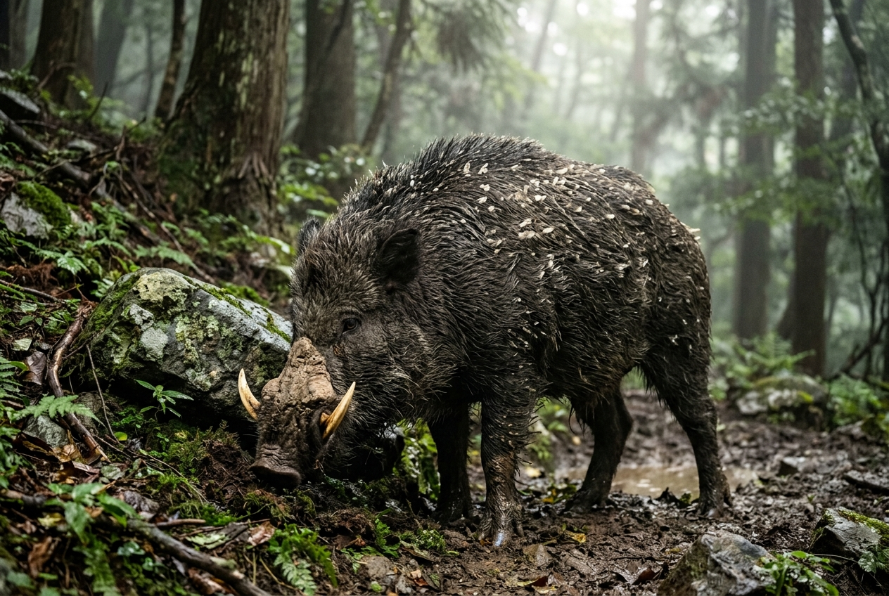
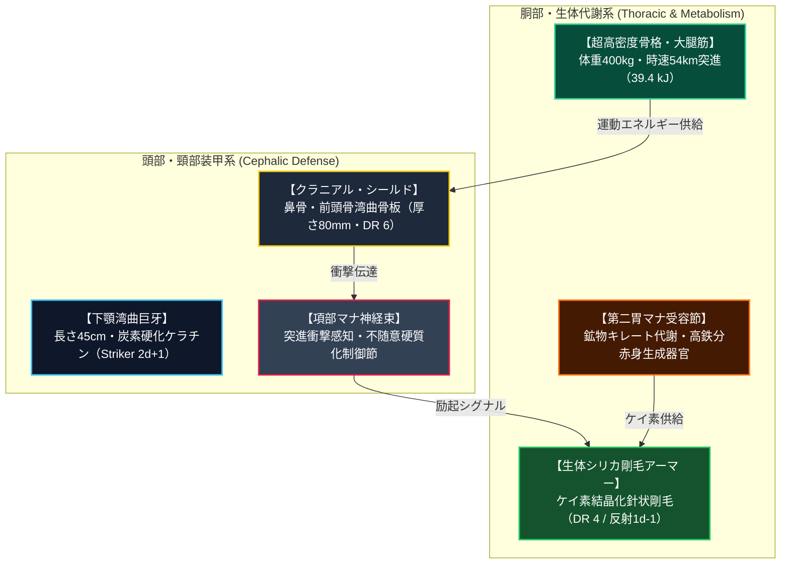
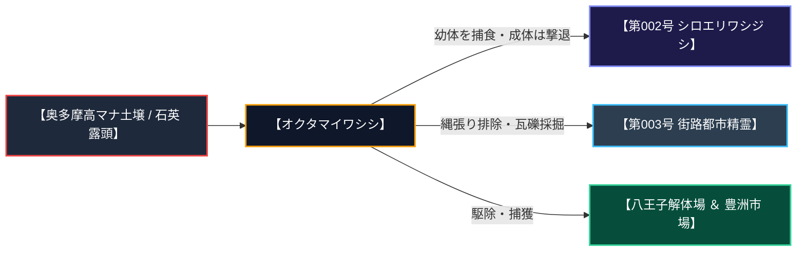
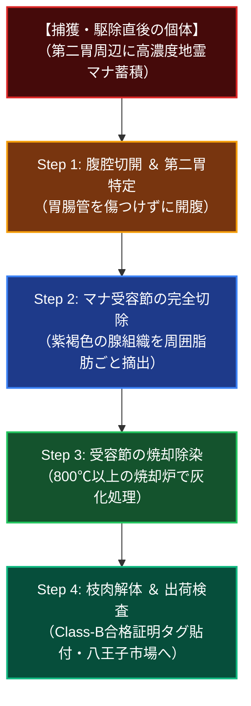

# 【オクタマイワシシ［奥多摩岩猪］】（Crag Boar／*Sus scrofa petramorphus*／クラグ・ボア、巌猪、鎧イノシシ）

---

## 1. 基本分類・早わかり（Basic Classification & Fast Facts）

| 項目 | 内容 |
| :--- | :--- |
| **標準和名** | **オクタマイワシシ［奥多摩岩猪］** |
| **和名命名規約** | **【環境・生息域型】**<br>※命名根拠: 奥多摩・秩父山脈の岩山・石英露頭地帯を一次生息地とする生態環境に基づく。 |
| **英名 / 通称** | Crag Boar / クラッグ・ボア、巌猪（がんちょ）、鎧イノシシ、シリカボア |
| **学名** | *Sus scrofa petramorphus* |
| **学名語源** | *Sus*（ラテン語: イノシシ）＋ *scrofa*（ラテン語: 雌豚・野猪）＋ *petramorphus*（ギリシャ語: *petra*［岩石］＋ *morphe*［形態］） |
| **生物学的分類** | **門**: 脊索動物門 Chordata<br>**綱**: 哺乳綱 Mammalia<br>**目**: 偶蹄目 Artiodactyla<br>**科**: イノシシ科 Suidae<br>**属**: イノシシ属 *Sus*<br>**種**: オクタマイワシシ *S. petramorphus*<br>**変異亜種**: カントウ山岳原名亜種 *S. p. petramorphus* / タンザワ局地適応群 *S. p. tanzawensis* |
| **発生起源** | **急速マナ変異種**（2000年のマナ覚醒以降、関東山地の高濃度地霊マナおよび石英・ケイ素鉱物土壌に晒されたニホンイノシシ *Sus scrofa leucomystax* が数世代で急速骨格硬質化変異） |
| **資源・管理区分** | **要処理種（Class-B）**[^zext_1]<br>※管理ステータス: **有害鳥獣駆除指定種 / 認可魔獣解体技師による「第二胃マナ受容節」の完全摘出・焼却処理必須（下処理完了後の肉・シリカ剛毛のみ合法流通認可）** |
| **食性** | **植物質・地下茎・石英鉱物混じり土壌採餌 ＆ 地霊マナ吸収**（変異クズ根、ドングリ、キノコ、鉱物泥ヌタ場のケイ素・鉄分摂取） |
| **寿命** | 野生下 12〜16年 / 飼育・研究管理下 18〜22年 |
| **サイズ・重量** | 体長 2.0〜2.6m / 体高 1.2〜1.5m / 体重 280〜450kg（サイズ修正: **SM +1**） |
| **直感的サイズ比較** | **【成人男性（180cm）／ 軽自動車（車重800kg・衝突質量半分）との比較】**<br>※成体雄の体長は成人男性の身長を軽々と超え、体重400kg超の質量が時速54kmで突進する衝突エネルギーは軽乗用車の低速衝突（約39.4 kJ）に匹敵する。 |
| **脅威度ランク** | **Threat Level: II（中脅威度 / 地方自警団・警察PMC・自衛隊普通科対応）** |
| **主要生息域** | **【一次野生生息地（原産地）】** 日本・関東防護圏 国道16号壁外アウトランド第1〜第2区（奥多摩・秩父山岳魔境区、雲取山〜日原鍾乳洞渓谷、丹沢外縁）<br>**【二次侵攻・採餌回廊】** 旧五日市街道廃墟群、秋川渓谷、圏央道・あきる野前線検問ゲート境界線 |

---

### 生息・分布マップ（Distribution & Habitat Range Map）

```xml
<svg xmlns="http://www.w3.org/2000/svg" viewBox="0 0 800 450" width="100%" height="100%">
  <rect width="800" height="450" fill="#0f172a"/>
  <defs>
    <linearGradient id="bgGrad" x1="0%" y1="0%" x2="100%" y2="100%">
      <stop offset="0%" stop-color="#1e293b"/>
      <stop offset="100%" stop-color="#0f172a"/>
    </linearGradient>
    <radialGradient id="manaCore" cx="30%" cy="40%" r="60%">
      <stop offset="0%" stop-color="#ef4444" stop-opacity="0.4"/>
      <stop offset="60%" stop-color="#f59e0b" stop-opacity="0.15"/>
      <stop offset="100%" stop-color="#0f172a" stop-opacity="0"/>
    </radialGradient>
  </defs>

  <rect width="800" height="450" fill="url(#bgGrad)"/>
  <circle cx="260" cy="180" r="180" fill="url(#manaCore)"/>

  <!-- 山岳等高線・アウトランド境界 -->
  <path d="M 50,80 Q 180,40 320,90 T 520,130 T 750,90" fill="none" stroke="#334155" stroke-width="2" stroke-dasharray="4,4"/>
  <path d="M 40,160 Q 200,120 360,170 T 580,210 T 760,180" fill="none" stroke="#334155" stroke-width="2" stroke-dasharray="4,4"/>
  <path d="M 60,260 Q 220,220 380,270 T 600,310 T 780,280" fill="none" stroke="#334155" stroke-width="2" stroke-dasharray="4,4"/>

  <!-- 地形エリア -->
  <polygon points="80,100 240,60 340,140 280,260 120,240" fill="#7f1d1d" fill-opacity="0.35" stroke="#ef4444" stroke-width="2"/>
  <polygon points="280,150 440,120 520,220 420,320 300,270" fill="#78350f" fill-opacity="0.35" stroke="#f59e0b" stroke-width="2"/>
  
  <!-- 防衛境界線（国道16号・圏央道） -->
  <line x1="560" y1="40" x2="560" y2="410" stroke="#38bdf8" stroke-width="4" stroke-dasharray="8,4"/>
  <line x1="680" y1="40" x2="680" y2="410" stroke="#22c55e" stroke-width="3"/>

  <!-- 拠点・要塞プロット -->
  <circle cx="200" cy="150" r="8" fill="#ef4444"/>
  <text x="200" y="130" fill="#fca5a5" font-size="13" font-family="sans-serif" font-weight="bold" text-anchor="middle">【一次野生生息地】奥多摩深部魔境</text>
  <text x="200" y="180" fill="#cbd5e1" font-size="11" font-family="sans-serif" text-anchor="middle">（雲取山・日原鉱物泥ヌタ場）</text>

  <circle cx="390" cy="220" r="7" fill="#f59e0b"/>
  <text x="390" y="200" fill="#fde68a" font-size="12" font-family="sans-serif" font-weight="bold" text-anchor="middle">【採餌・移動回廊】五日市街道廃墟群</text>
  <text x="390" y="245" fill="#cbd5e1" font-size="11" font-family="sans-serif" text-anchor="middle">（秋川渓谷・母系群れ回廊）</text>

  <circle cx="560" cy="260" r="9" fill="#0284c7" stroke="#38bdf8" stroke-width="2"/>
  <text x="560" y="295" fill="#38bdf8" font-size="12" font-family="sans-serif" font-weight="bold" text-anchor="middle">あきる野前線検問ゲート</text>
  <text x="560" y="315" fill="#94a3b8" font-size="10" font-family="sans-serif" text-anchor="middle">（圏央道防衛線 / 12.7mm重機関銃座）</text>

  <circle cx="680" cy="280" r="8" fill="#16a34a"/>
  <text x="680" y="260" fill="#4ade80" font-size="12" font-family="sans-serif" font-weight="bold" text-anchor="middle">八王子前線要塞基地</text>
  <text x="680" y="340" fill="#86efac" font-size="10" font-family="sans-serif" text-anchor="middle">（第3同心円 / 認可魔獣解体場）</text>

  <!-- 凡例 -->
  <rect x="30" y="360" width="300" height="70" rx="6" fill="#0f172a" fill-opacity="0.9" stroke="#334155" stroke-width="1.5"/>
  <circle cx="45" cy="380" r="5" fill="#ef4444"/>
  <text x="60" y="384" fill="#e2e8f0" font-size="11" font-family="sans-serif">高濃度生息域（雄の単独縄張り）</text>
  <circle cx="45" cy="400" r="5" fill="#f59e0b"/>
  <text x="60" y="404" fill="#e2e8f0" font-size="11" font-family="sans-serif">母系群れ採餌回廊（突進被害多発）</text>
  <line x1="38" y1="418" x2="52" y2="418" stroke="#38bdf8" stroke-width="3"/>
  <text x="60" y="422" fill="#e2e8f0" font-size="11" font-family="sans-serif">圏央道・防衛迎撃ライン</text>
</svg>
```

> **【生息分布データ】**:
> - **一次野生生息地（原産地・高濃度マナ域）**: 東京都西多摩郡奥多摩町〜山梨県・埼玉県境（雲取山・日原鍾乳洞周辺・標高800〜1,800m）。石英脈露頭と鉱物混じりの泥土ヌタ場に定着。
> - **二次侵攻・採餌回廊（第2アウトランド）**: 旧五日市街道沿いコンクリート廃墟群、秋川渓谷、青梅山麓。
> - **防衛迎撃境界線**: 圏央道・あきる野検問ゲート〜国道16号八王子要塞バッファーゾーン外縁。
> - **環境耐性・生息限界**: 気温 -15〜35℃ / 多湿な樹林帯および岩屑地帯を好む。

---

### 視覚資料アーカイブ（Visual Archive）

| 外観標本図解（成体雄） | 野生生態写真（奥多摩原生林採餌） |
| :---: | :---: |
|  |  |
| *陸上自衛隊八王子駐屯地・魔獣生態研究班提供標本図解（骨板・シリカ剛毛注記付）* | *奥多摩第2アウトランドにてPMC多摩レンジャーズが望遠光学撮影（2026年）* |

---

## 2. 伝承考証とマナ覚醒の架橋（Lore & Historical Bridge）

### 2.1 原典・民俗伝承の記録
- **『古事記』中巻・ヤマトタケル伊吹山伝承（古代日本）**:
  日本神話において、ヤマトタケルノミコトが東征の帰途、近江の伊吹山に登った際に出会った「牛のように巨大な白猪」は、山の神の荒魂（あらみたま）の化身であったと記述されている。素手で討ち取ろうとした英雄に対し、大猪は氷雨と濃霧の神威を降らせて毒気にあて、敗走させた。古代より巨大な猪は「山の神そのもの」として恐れ敬われてきた[^schulz_1]。
- **『日本書紀』巻第七・景行天皇条**:
  伊吹山の神が化身した大猪の神威について「山神化大猪」と記され、その吐き出す息や踏み鳴らす蹄の音が大地を震わせたと記録されている。
- **奥多摩・秩父マタギ伝承（近世〜近代）**:
  奥多摩の日原や秩父の山深くに住む猟師（マタギ）の間では、通常の鉛玉を弾き返す硬い毛皮を持った老猪を「巌猪（いわじし）」「主猪（ぬしじし）」と呼び、山の神の怒りに触れるとして銃を向けることを固く禁じるタブーが存在していた。

### 2.2 2000年マナ覚醒による生体科学的架橋
西暦2000年1月1日の「ミレニアム・アウェイクニング」に伴い、関東山地（奥多摩・秩父）の地下断層から高純度の地霊（Earth）マナが噴出。山林に自生していたニホンイノシシ（*Sus scrofa leucomystax*）の個体群が、マナ濃度の高い石英・ケイ素質土壌を摂取したことで、遺伝子レベルの急速変異（Rapid Mana Mutation）を引き起こした。  
わずか数世代（約10〜15年）の短期間で、骨格への炭素・カルシウム高密度沈着、体毛の生体シリカ結晶化、および第二胃における鉱物キレート代謝機能が定着。かつてマタギが神話として語り継いだ「巌猪」の形質が、現代の生物学的実体 *Sus scrofa petramorphus*（オクタマイワシシ）として覚醒・固定化されたのである。

---

## 3. 生物学的特徴・ライフステージ（Biological Traits & Anatomy）

### 3.1 外見・解剖学的身体構造



- **体躯・骨格・筋肉系（DR値）**:
  - 鼻骨から前頭骨にかけて、厚さ 60〜90mm に達する強固な湾曲骨板「クラニアル・シールド」が形成。骨密度は原種の3倍、生体内炭素繊維が網目状に沈着（モース硬度5.5相当・**DR 6**）。
  - 背部から臀部を覆う生体シリカ剛毛は、ケイ素がガラス質結晶として分泌された複合バイオ繊維（**DR 4**）。刃物や散弾を滑らせるだけでなく、近接攻撃者へ **1d-1 の刺し反射ダメージ**を与える。
- **歯・顎・消化器官（捕食・摂食の機能美）**:
  - 咬合力は **1,200 PSI（約8.3 MPa）**。石英鉱石や太い木の根、ドラム缶を容易に噛み砕く。
  - 下顎から上方へ湾曲する巨牙（長さ 35〜48cm）は先端に微小な鋸歯状構造を持ち、すれ違いざまに防護服や装甲車タイヤを切り裂く。
  - **第二胃マナ受容節（*Glandula Managastrica*）**: 第一胃と第二胃の境界部に存在する霊的腺組織。摂取した鉱物泥からケイ素、鉄分、カルシウムをイオン化して体循環へ送り込む。
- **感覚器官・特異マナ受容器**:
  - 嗅覚は原種の約4倍。地下3mの根茎や数キロ先の血痕、金属腐食臭を感知。
  - **項部マナ神経束**: 突進衝突時に生体電位を介して不随意に硬質化力場を励起する制御神経節。

### 3.2 ライフステージと繁殖・育児ドラマ
1. **幼体・若齢期（Juvenile / ウリ坊 / 0〜1年）**:
   - 春先に1腹あたり4〜8頭を出産。縞模様の柔らかい体毛を持ち、シリカ装甲は未発達（DR 1 / Threat Level: 0）。母獣と前年生まれの若雌（ヘルパー）が厳重に護衛。
2. **成熟個体（Adult / 1〜9年）**:
   - 雌は母系群れ（5〜12頭）を形成し、雄は単独で生活（体重 280〜450kg / SM +1 / Threat Level: II）。奥多摩深部の鉱物ヌタ場を巡って激しい牙の噛み合い闘争を行う。
3. **主級・変異個体（Alpha / オオイワジシ / 10年以上）**:
   - 体重 500kg超、クラニアルシールド厚さ120mm（DR 8 / Threat Level: III）。背部に苔や地衣類が生え、地域一帯の魔獣の頂点に君臨。

---

## 4. 生態・食物連鎖・人間社会との摩擦（Ecology & Human Conflict）

### 4.1 食性・捕食行動
- **主食・栄養源**:
  植物質（変異クズ根、ドングリ、キノコ、タケノコ）および石英・ケイ素鉱物泥。成体雄は1日あたり約15kgの植物と2kgの鉱物土壌を摂取。
- **採餌・突進戦術**:
  鋭敏な嗅覚で地中の根茎や鉱脈を探知し、クラニアルシールドと頑丈な蹄で地表を掘り返す。縄張り侵入者に対しては時速54km（約39.4 kJ）の全力突進を行い、下顎巨牙による掬い上げ刺突を繰り出す。



### 4.2 魔獣間クロス・リレーション（相互作用）
- **第002号 シロエリワシジシ（サンダー・グリフォン）**:
  オクタマイワシシの幼体〜若齢個体はグリフォンの格好の獲物。成体雄は背部剛毛を逆立てて牙を打ち鳴らし、急降下を威嚇・撃退する。
- **第003号 街路都市精霊（ストリート・スピリット）**:
  五日市街道廃墟群において遭遇。無機物塊である都市精霊に対し、オクタマイワシシは土壌・瓦礫ごと掘り起こしてテリトリーから排除する。

### 4.3 人間社会との摩擦・利用・保護史（Human-Creature Interactions）
- **防護インフラ・境界フェンス**:
  圏央道・あきる野前線検問ゲート沿いに高張力鋼ワイヤー＋地中コンクリート防護板を敷設。成体雄の突進（約39.4 kJ）によるフェンス破損事故が多発。
- **軍事迎撃プロトコル**:
  小口径の5.56mm NATO弾は弾き返されるため、検問ゲートには **12.7mm M2重機関銃** および **84mm無反動砲（カールグスタフ）** が配備されている[^jinnai_1]。
- **メガコーポ利権**:
  ヤマト重工先端複合材料事業部が、シリカ剛毛から抽出される結晶化ケラチン繊維を用いた「バイオ複合耐衝撃装甲板（特許第6842109号）」を独占保有。

---

## 5. 魔導科学・上位神性・背景ロア（Thaumaturgical Theory & Lore）

### 5.1 魔力現象と発現メカニズム
- **生体励起公式呪文（公式アーカイブ突合エビデンス）**:
  - **《土から石へ》（Earth to Stone / `world/magic/spells/earth.md:67`）**:
    第二胃マナ受容節が摂取した鉱物泥からケイ素を抽出し、体毛基部へ送り込んでシリカ剛毛へ急速硬化。項部神経節が突進衝撃を感知した際、不随意に前面骨板へ生体地霊力場を励起して防護点を一時強化。
  - **《土変化》（Shape Earth / `world/magic/spells/earth.md:65`）**:
    泥浴び（ヌタ場）において、周囲の鉱物混じり土壌を自身の生体電位と同調させて体表へ吸着・定着させる生体土壌操作。
- **生体媒介原則（Bio-Medium Principle）**:
  オクタマイワシシの硬質化力場は自身の肉体・骨格・神経系のみを媒介として発現。電子機器や通信波、送電網には一切干渉しない[^kuroda_1]。

### 5.2 音響・周波数・生体通信特性（Acoustic & Resonance Analysis）

```
【音響スペクトログラム解析データ: オクタマイワシシ突進シークエンス】

 周波数 (kHz)
  10 ┤                                        
 4.5 ┤ ────────── [牙鳴らし・警戒クリック音 (90dB)] ──────────
 1.0 ┤
 0.18┤ ═════════ [威嚇重低音咆哮 (110dB)] ═════════
  18Hz ──────────────────────────────────────────────── [突進地鳴りインフラサウンド (85dB)]
     └─────────────────────────────────────────────────> 時間 (秒)
```

- **突進地鳴り超低周波（18 Hz / 85 dB）**:
  体重400kgの巨体が時速54kmで地表を蹴る際に生じる低周波振動。検問所の振動センサーが数キロ先からの接近を検知。
- **威嚇重低音咆哮（180 Hz / 110 dB）**:
  胸腔全体を共振させて放つ威嚇音。山林の樹木を震わせる。
- **牙鳴らしクリック音（4.5 kHz / 90 dB）**:
  下顎の巨牙を高速で擦り合わせる金属的な摩擦音。突進直前の最終警戒シグナル[^hasumi_1]。

### 5.3 上位存在・アビス因果・メガコーポ伏線
- **アストラル原型【伊吹山大猪神（Great Boar Patriarch）】**:
  『古事記』に記された伊吹山の大猪神のアストラル霊峰原型。山岳地帯の地霊マナを守護する高位霊的存在。
- **アビス因果**:
  高純度の地霊マナに根ざしているため、アビス汚染に対する耐性が極めて高く、精神汚染を受けにくい。

---

## 6. 交戦マニュアル・都市防災コラム（Combat Manual & Civil Defense）

### 6.1 GURPS 4th Stat Block（戦闘データ）

#### 【通常成体（Standard Adult）】
```yaml
Name: オクタマイワシシ［奥多摩岩猪］（Sus scrofa petramorphus / Crag Boar）
Archetype: 地霊鉱物硬質化魔獣（偶蹄目イノシシ科）
Point Total: 145 pt
Threat Level: II (中脅威度 / 警察PMC・自衛隊普通科対応)

Attributes:
  ST: 22 [120]     HP: 24 [4]
  DX: 11 [20]      WILL: 11 [0]
  IQ: 5 [-100]     PER: 12 [35]
  HT: 13 [30]      FP: 13 [0]

Basic Parameters:
  Basic Speed: 6.00 [0]
  Basic Move: 7 [5] / 突進疾走 Move 15（時速54km）
  Size Modifier (SM): +1 (体長 2.4m, 体高 1.3m, 体重 350kg)
  Dodge: 9

Damage:
  Melee Attack: 打撃 2d / 振 4d
  Tusk Strike (下顎巨牙): 2d+1 切り・刺し [Striker / DR 4]

DR (防護点) & 防御特性:
  - 頭部（クラニアルシールド）: DR 6 (骨密度・炭素強化)
  - 背部（シリカ剛毛アーマー）: DR 4 (近接攻撃者へ 1d-1 刺し反射ダメージ)
  - 胴体・四肢: DR 3 (厚皮・強靭筋膜)
  - 特殊防御: 不随意硬質化力場（突進衝突時 前面DR +2）

Traits & Advantages:
  - 鋭敏嗅覚 3 (Acute Smell 3) [6]
  - 泥浴び潜伏 (Camouflage +2 in mud) [2]
  - 地霊耐性 (Magic Resistance 3 vs アビス汚染) [6]

Disadvantages & Quirks:
  - 要処理種 (Class-B: 死亡後2時間以内に第二胃マナ受容節摘出必須) [-5]
  - 短気・突進衝動 (Bad Temper / CR: 12) [-10]
  - 食欲旺盛 (Increased Consumption 1) [-10]
  - 野生動物 (Wild Animal) [-30]

Innate Spells (生体励起魔術 - マナ消費はFP):
  - 《土から石へ / Earth to Stone》: Skill 12 (不随意励起 / 前面DR+2硬質化)
  - 《土変化 / Shape Earth》: Skill 11 (ヌタ場泥吸着)
```

#### 【主級・変異個体（Alpha / Pack）】
- **能力値修正**: 体重500kg超（SM +2）、ST 28、HP 32、頭部 DR 8、背部 DR 6。
- **追加特性**: 突進速度 Move 18（時速65km / 衝突エネルギー約65 kJ）。

### 6.2 推奨火器・防護装備
- **有効火器・弾薬**: **12.7mm M2重機関銃**（徹甲弾仕様）、**84mm無反動砲（カールグスタフ）**、12ゲージ散弾銃（スラッグ弾 / 近接阻止用）。5.56mm小銃弾は無効。
- **必須防護具・センサー**: 地表振動センサー、サーマルゴーグル、ケブラー強化対破片ベスト（シリカ剛毛反射対策）。

### 6.3 市民防災メモ ＆ 専門家の知恵袋

> [!IMPORTANT]
> **【市民向け防災メモ：オクタマイワシシ遭遇時の退避手順】**
> 1. 直線上の突進軌道から直角方向に退避し、太い立木や頑丈なコンクリート建造物の陰に身を隠してください。
> 2. 牙鳴らし（カチカチという金属音）が聞こえた場合は突進直前の合図です。絶対に背中を見せて走って逃げてはいけません。  
> —— *警視庁結界管理部 / 自衛隊八王子駐屯地 防災指針*

> [!TIP]
> **【現場専門家・ベテランハンターの知恵袋】**
> *「奴さんの突進を止めるのに神頼みは通用しねぇ。ブローニング12.7mmをしっかり据え付けて、鼻骨のシールドじゃなく首筋の筋肉を狙い撃つのがプロの鉄則だ。」*  
> —— **陣内 隆文（アウトランド地誌班長）**

---

## 7. 解体・ジビエ食文化・料理レシピ（Harvesting & Cuisine）

### 7.1 解体プロトコルと市場相場（Class-A / B）



1. **Step 1: 腹腔切開**: 死亡後2時間以内に開腹。消化管破損による汚染を防止。
2. **Step 2: マナ受容節の完全切除**: 第一胃と第二胃境界の「第二胃マナ受容節（約800g）」を確実に切除。摘出を怠ると死後硬直に伴い肉が石化硬化する[^takatsukasa_1]。
3. **Step 3: 焼却除染**: 摘出節は専用コンテナに封入し、八王子解体場の高温焼却炉（800℃以上）で灰化。
4. **Step 4: 枝肉熟成と出荷**: Class-B正規タグを発行し、4℃で7〜10日間熟成。
- **市場取引相場**: 枝肉1頭あたり 30万〜50万円（キロ単価 3,500〜5,000円）。

### 7.2 伝統料理・メガコーポスペシャリテ（本格レシピ）

```
【料理名】八王子名物・巌猪の赤味噌ぼたん鍋
- 分類: 関東要塞伝統猟師料理 / 八王子前線基地スペシャリテ
- 主材料: オクタマイワシシロース肉・バラ肉スライス 400g、奥多摩産原木椎茸、下仁田ネギ、ごぼう、焼き豆腐、特製八丁赤味噌出汁、山椒粉
- 調理手順:
  1. 【下処理・盛り付け】: 薄切りにしたロース肉をお皿の上に牡丹の花の形に美しく盛り付ける。
  2. 【出汁作り】: 昆布と鰹の濃厚出汁に、八丁赤味噌、信州味噌、みりん、地酒を合わせ、すりおろし生姜を加える。
  3. 【火入れ・煮込み】: 鉄鍋に出汁と根菜を入れて沸騰させ、巌猪肉を投入して強火でしっかりと火を通す。
  4. 【仕上げ】: 取り鉢に取り、たっぷりの山椒粉を振って食す。
- テイスティングノート:
  石英鉱物を摂取して育った肉質は臭みが一切なく、噛みしめるほどに力強い赤身のコクと甘い脂の旨味が溢れ出す。濃厚な赤味噌と痺れる山椒が、高密度な筋肉繊維を心地よく解きほぐす。
```

### 7.3 産業素材・医療利用

| 採取部位 | 工業・魔導用途 | 経済価値・取引相場 |
| :--- | :--- | :--- |
| **シリカ剛毛（背部針毛）** | ヤマト重工製 バイオ複合耐衝撃装甲板、耐摩耗切削ブラシ | 1個体分（約3kg）: 15万〜25万円 |
| **下顎湾曲巨牙** | 特殊工作員用セラミック複合ナイフ柄、高級印章、魔導触媒 | 1対（左右）: 8万〜12万円 |
| **クラニアルシールド（頭部骨板）** | 装甲車防護インナープレート、対魔導実験用耐衝撃シールド | 1頭分: 20万〜35万円 |

---

## 8. 現場記録・通信ログ（Field Logs & Transcripts）

```
【圏央道・あきる野前線第3検問ゲート突進迎撃交信録】
日時: 2026年4月11日 21:15 JST
場所: 圏央道・あきる野前線第3検問ゲート（第2アウトランド境界線）
記録: PMC多摩レンジャーズ第2小隊（Tama-2）
--------------------------------------------------------------------------------
[21:15:02] Tama-2-Lead: 「地表振動センサー反応！方位320、秋川渓谷方面から高速接近！周波数18Hz……オクタマイワシシの成体雄だ！」
[21:15:10] Tama-2-Gunner: 「サーマルで補足！デカい、体重400kgは優にあるぞ！旧五日市街道のバリケードを弾き飛ばして直進してくる！」
[21:15:18] Tama-2-Lead: 「突進速度50km/h超！フェンス突破コースだ！重機関銃タレット、セーフティ解除！撃てぇっ！」
[21:15:22] （12.7mm M2重機関銃の重厚な掃射音: ドドドドドドッ！）
[21:15:27] Tama-2-Gunner: 「初弾3発が鼻骨シールドに命中、火花を散らして弾かれた！だが後続弾が首筋の剛毛を貫通！目標、体勢を崩した！」
[21:15:33] Tama-2-Lead: 「84mmカールグスタフ発射！頭部を狙え！」
[21:15:37] （強烈な炸裂音と衝撃波）
[21:15:42] Tama-2-Lead: 「直撃確認！目標停止！……ふぅ、フェンスの手前20メートルで止まったか。八王子の解体場へ連絡しろ、今夜は極上のぼたん鍋が食えるぞ！」
```

---

## 9. 参考文献・典拠資料（References）

1. **古代日本古典・神話考証**:
   - 『古事記』中巻「景行天皇とヤマトタケル条・伊吹山の白猪」（和銅5年 / 712年）
   - 『日本書紀』巻第七「景行天皇条」（養老4年 / 720年）
   - 奥多摩郷土誌編纂会『奥多摩・秩父マタギの民俗と狩猟タブー考』（1998年）
2. **生物学・解剖学・軍事白書**:
   - 原種ニホンイノシシ（*Sus scrofa leucomystax*）骨格・咬合力比較解剖データ（2019年）
   - 防衛省関東防衛局『国道16号・圏央道要塞防衛線における突進型魔獣対処要領』（2024年版）
   - PMC多摩レンジャーズ『奥多摩アウトランド第1〜第2区 生態調査及び哨戒日誌』（2025年度）
3. **GURPS公式魔導理論アーカイブ**:
   - `world/magic/spells/earth.md`: 《土変化》（Shape Earth: L65）、《土から石へ》（Earth to Stone: L67）、剛毛巌猪生体適応論（L83-84）
   - `world/magic/rules/combat.md`: 突進運動エネルギーおよび剛毛反射ダメージ算定式

---

## 脚注・専門部署査定メモ（Persona Footnotes）

[^zext_1]: ⚖️ **首席監査官ゼクスト（憲章監査室）**:
    「『猪突猛進』という言葉がありますが、400kgのオクタマイワシシが時速54kmで突っ込んでくるのは言葉通りの質量兵器です。八王子市街地へ迷い込んだ場合、道路交通法と特異災害防止条例のダブル適用で即座に駆除対象となります。」

[^schulz_1]: 🏛️ **V・シュルツ 特命調査員（法務・古典文献考証部）**:
    「ヤマトタケルが素手で伊吹山の白猪に挑んで敗走した記録は現代のハンターにとっても教訓ですね。英雄すら小細工なしの突進には敵わなかったのですから、素直に12.7mm徹甲弾を装填した自衛隊の判断は2000年越しの正解といえるでしょう。」

[^kuroda_1]: ⚡ **クリスティナ・黒田 所長（魔導科学・理論研究部）**:
    「時速54kmでの衝突運動エネルギー約39.4 kJ。これに項部神経節の硬質化が重なると、普通乗用車なら正面から真っ二つに割れます。生体電位による不随意励起ですから、術士としての知能がゼロでも物理法則に忠実な点が生体力学的に美しいわね。」

[^jinnai_1]: 🌍 **陣内 隆文 調査官（地理・環境調査部）**:
    「あきる野検問ゲートの警備連中は毎朝『イノシシ除けの祈願』をしてるらしいが、一番効くのは神頼みじゃなくてブローニング12.7mmのグリスアップだ。あの鼻骨シールドに小銃弾が当たった時の甲高い跳弾音を聞くと、誰もが背筋を凍らせるぜ。」

[^takatsukasa_1]: 🐾 **鷹司 冴子 博士（生態・生物調査部）**:
    「第二胃マナ受容節の摘出さえ手際よく行えば、お肉は本当に素晴らしいご馳走になります。石英混じりの土壌を掘り起こしているせいか、脂肪分がサラッとしていて赤身の旨味が濃厚なんです。八王子駐屯地でいただいた赤味噌ぼたん鍋の味が忘れられません。」

[^hasumi_1]: 📸 **蓮見 蓮 プロデューサー（視覚・音響・資料記録部）**:
    「日原の泥ヌタ場で張り込んでいた時、突進前の牙鳴らし（4.5kHz）がヘッドホン越しに響いて、思わず三脚ごと後ろにひっくり返りましたよ。でも、あのシリカ剛毛が泥土の中でキラリとガラス質に輝く瞬間は、カメラマン冥利に尽きる絶景でしたね！」
