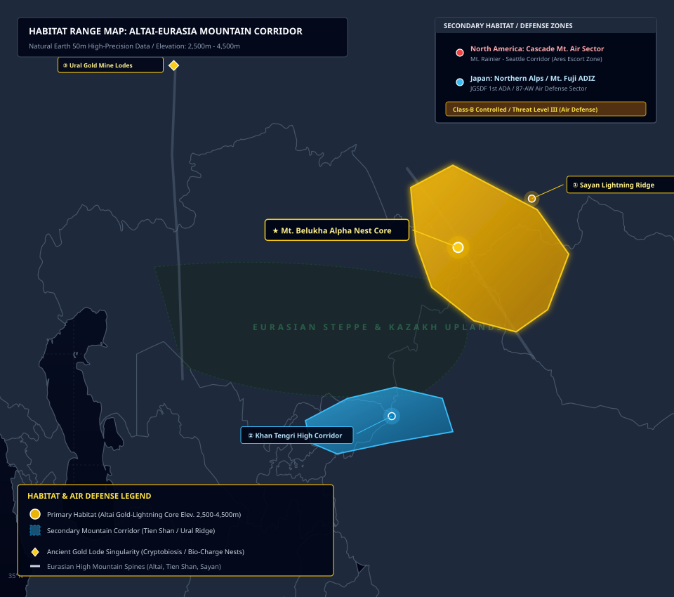
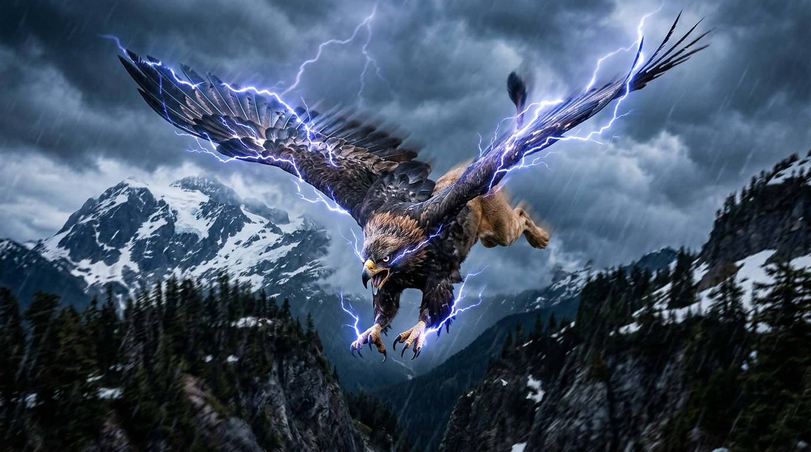
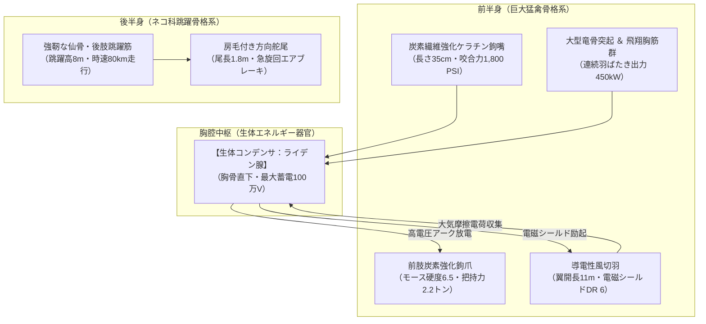

# 【シロエリワシジシ［白襟鷲獅子］】（Thunder Gryphon／*Gryphus fulgurans*／サンダー・グリフォン、白襟グリフォン、雷鷲獅子）

---

## 1. 基本分類・早わかり（Basic Classification & Fast Facts）

| 項目 | 内容 |
| :--- | :--- |
| **標準和名** | **シロエリワシジシ［白襟鷲獅子］** |
| **和名命名規約** | **【形態・羽色型】**<br>※命名根拠: 原種ハクトウワシ由来の頸部から胸元にかけて広がる純白の襟羽と、ピューマの琥珀色胴体の外見的特徴に基づく。 |
| **英名 / 通称** | Thunder Gryphon / スカイ・ストライカー、カスケード・グリフォン、雷鷲獅子、白襟グリフォン |
| **学名** | *Gryphus fulgurans* |
| **学名語源** | *Gryphus*（古典ギリシャ語: *γρύψ*［曲がった嘴を持つ怪鳥］）＋ *fulgurans*（ラテン語: 稲妻・雷電を放つ） |
| **生物学的分類** | **門**: 脊索動物門 Chordata<br>**綱**: 鳥綱 Aves ＋ 哺乳綱 Mammalia（古代霊性キメラ綱 Chimera）<br>**目**: 古代鷲獅子目 Archaeogryphiformes<br>**科**: グリフォン科 Gryphidae<br>**属**: グリフォン属 *Gryphus*<br>**種**: シロエリワシジシ *G. fulgurans*<br>**変異亜種**: アルタイ野生原名亜種 *G. f. fulgurans* / カスケード航空適応群 *G. f. cascadensis* |
| **発生起源** | **古代覚醒種 ＋ 急速マナ共生変異**（マナ希薄期に中央アジア・アルタイ高山帯の地下金鉱床で休眠していた古代種が2000年に再活性化。同時に高濃度雷霊マナに晒された大型猛禽類とネコ科肉食獣が急速共生変異） |
| **資源・管理区分** | **要処理種（Class-B）**<br>※管理ステータス: **防空制限空域指定種 / 認可魔獣解体技師による生体放電器官「ライデン腺」の絶縁摘出・完全アース放電処理必須（下処理完了後の肉・羽毛のみ合法高額流通認可）** |
| **食性** | **高山性肉食・大型草食獣捕食 ＆ 生体電磁給電**（高山性変異ウシ・ヘラジカ・ビッグホーン、小型魔獣、高圧送電線・航空機電磁波からの生体給電） |
| **寿命** | 野生下 45〜60年 / 認可防空保護施設管理下 70〜90年（大型長寿種） |
| **サイズ・重量** | 体長 3.2〜3.8m / 翼開長 9.5〜11.5m / 体高 1.6〜1.9m / 体重 480〜620kg（サイズ修正: **SM +2**） |
| **直感的サイズ比較** | **【成人男性（180cm）／ アフリカゾウ・軽戦闘機（翼幅10m級）との比較】**<br>※成体の翼開長（約11m）は自衛隊や米軍の軽戦闘機・大型グライダーに匹敵。成人男性の体長を軽々と超える巨大猛禽・巨獣キメラ。 |
| **脅威度ランク** | **Threat Level: III（高脅威度 / 防空機関砲・近接対空迎撃システム・重武装航空護衛部隊対応）** |
| **主要生息域** | **【一次野生生息地（原産地）】** 中央アジア・アルタイ山脈〜天山山脈〜ウラル山脈高山帯（標高2,500〜4,500m）<br>**【国外二次防空空域】** 北米UCAS要塞圏 カスケード山脈（レーニア山〜シアトル航空回廊上空）<br>**【国内二次防空空域】** 日本北アルプス立山連峰・富士山系防空識別圏（ADIZ） |

---

### 生息・分布マップ（Distribution & Habitat Range Map）



> **【生息分布データ】**:
> - **一次野生生息地（原産地・古代覚醒特異点）**: 中央アジア・アルタイ山脈〜サヤン山脈〜天山山脈高山帯（ベルーハ山 標高4,506mを中心とする高マナ金鉱脈特異点）。
> - **北米二次防空空域（メガコーポ移入群）**: 北米カスケード山脈レーニア山頂（標高4,392m）永久雷雲営巣地〜シアトル・タコマ航空コンボイ回廊。
> - **日本国内二次防空空域**: 北アルプス立山連峰・富士山麓浅間マナ回廊（自衛隊第1高射特科群・防空識別圏指定）。
> - **環境耐性・飛行限界**: 気温 -40〜35℃ / 飛行高度 0〜8,500m（成層圏界面） / 耐風速 60m/s（猛烈な嵐の乱気流を好む）。

---

### 視覚資料アーカイブ（Visual Archive）

| 外観標本図解（成体雄） | 野生生態写真（カスケード山脈急降下） |
| :---: | :---: |
|  |  |
| *国際航空魔導生物研究所（Seattle Lab）提供標本図解（スケール・生体放電器官注記付）* | *レーニア山高度3,200mにてアレス航空護衛部隊が光学・赤外線望遠撮影（2026年）* |

---

## 2. 伝承考証とマナ覚醒の架橋（Lore & Historical Bridge）

### 2.1 原典・古典文献の記録
- **ヘロドトス『歴史（*Historiai*）』第4巻第13・27節（古代ギリシャ）**:
  紀元前5世紀の歴史家ヘロドトスは、中央アジア・スキタイ北方の未踏山脈に生息する怪鳥「グリプス（*γρύψ*）」について記録している。「黄金を守護する鋭い嘴を持った四足の怪鳥であり、黄金を採掘しようとする隻眼の遊牧民族アリマスポイ族と絶え間ない闘争を繰り広げている」と記述され、金鉱脈と猛禽・巨獣キメラの結びつきを示す最古の学術記録である。
- **大プリニウス『博物誌（*Naturalis Historia*）』第10巻（古代ローマ）**:
  大プリニウスは「グリプスは有翼の巨獣であり、その嘴は恐るべき湾曲をなし、地下から掘り出された黄金を自らの巣に敷き詰めて卵を守る。近寄る人間や馬を空へ掴み上げて岩壁に叩きつける」と記録。
- **セビリアのイシドールス『語源（*Etymologiae*）』第12巻（中世初期）**:
  中世教父イシドールスは「獅子の胴体と鷲の頭・翼を持つ巨獣であり、馬に対して激しい敵意を抱き、人間を引き裂いて餌とする」と記述し、中世寓意譚（ベスティアリ）におけるグリフォンの生態的規範を確立した。

### 2.2 2000年マナ覚醒による生体科学的架橋
西暦2000年1月1日の「ミレニアム・アウェイクニング」以前、グリフォンは中央アジア・アルタイ山脈の最高峰ベルーハ山地下深部の金鉱脈特異点において、新陳代謝を極限まで停止させた「仮死・冬眠状態」で数千年間眠り続けていた。  
世界的なマナ噴出に伴い、アルタイの金鉱床から高純度の雷霊・風霊マナストームが噴出。古代種の覚醒と同時に、山岳地帯に生息していた大型猛禽（アメリカハクトウワシおよびオオワシ類）とネコ科肉食獣（ピューマおよびユキヒョウ）がマナ乱流に晒され、数世代の急速変異によってキメラ共生融合を完了した。  
現代の学名 *Gryphus fulgurans*（シロエリワシジシ）は、これら古代覚醒血統と急速変異個体群が交雑・定着した安定新種として同定されている。

---

## 3. 生物学的・魔導的特徴（Biological & Thaumaturgical Traits）

### 3.1 解剖学的特徴・骨格・運動機能



- **骨格と筋肉構造**:
  - 前半身は頑丈な中空ハニカム構造の鳥類骨格であり、巨大な竜骨突起に強靭な大胸筋が定着。
  - 後半身はネコ科肉食獣特有の柔軟かつ強靭な脊柱・寛骨構造を持ち、岩壁からの跳躍離陸および着地時の強烈な衝撃吸収（最大3トン）を可能にする。
- **鉤爪と嘴の力学**:
  - 鉤爪および嘴の外層には、生体内で結晶化したカーボンナノチューブ状炭素繊維が沈着しており、モース硬度6.5（鋼鉄ナイフを上回る硬度）を誇る。
  - 咬合力は **1,800 PSI（約12.4 MPa）** に達し、装甲車の鋼板や大型草食獣の太い大腿骨を容易に破砕する。
- **飛翔・急降下性能**:
  - 水平巡航速度は時速 110〜140km、雷雲からの急降下ダイブ（Dive Attack）時には時速 **240km（約66.7 m/s / Move 24）** に達する。

### 3.2 魔導生化学・生体エネルギー循環
- **生体放電器官「ライデン腺（*Organum Fulgurans*）」**:
  竜骨突起直下の胸腔中央に位置する高電圧生体コンデンサ器官。心筋収縮の生体電位と、導電性風切羽が大気中のイオンを摩擦収集することで蓄電。最大 **100万ボルト（約1.2メガジュール）** のパルス放電を前肢鉤爪および嘴からアーク放電として射出可能。
- **超望遠電磁複眼（*Oculus Electromagneticus*）**:
  網膜にマナ受容細胞と電磁波感知ピクセルが蜂の巣状に配列。5km上空から地上の小動物の体温、高圧電線の微弱漏洩電磁波、航空機のジェットエンジン排気熱を鮮明に識別する。

### 3.3 生態・行動パターン・ライフサイクル
- **営巣と縄張り**:
  標高3,000m以上の断崖絶壁や未踏峰山頂に、小動物の骨、枯れ木、および高山金鉱石の破片を敷き詰めた巨大な巣（直径4〜6m）を構築。縄張り半径は 40〜60km に及ぶ。
- **繁殖と育児ドラマ**:
  一夫一妻の強固なペアを形成し、2〜3年に一度、1〜2個の琥珀色の大卵（長径25cm・重さ4.5kg）を産卵。雌雄交代で45日間抱卵する。孵化した幼体は最初の1年間、前年生まれの若鳥（ヘルパー）から餌と飛び方を教わる社会性育児を行う。

---

## 4. 人間社会との関係・共生と摩擦（Human-Creature Conflict & Coexistence）

```mermaid
flowchart TD
    subgraph "【高山アウトランド】（営巣・充電空域）"
        A["アルタイ／カスケード山頂雷雲巣窟<br>（標高3,500m・アルファ雄縄張り）"]
    end
    subgraph "【航空コンボイ回廊】（接触・強襲空域）"
        A -->|"急降下襲撃 (時速240km)"| B["メガコーポ武装貨物機コンボイ<br>（エンジン熱・電磁波に誘引）"]
        B -->|"20mm CIWS対空掃射<br>スティンガー迎撃"| C{"交戦結果判定"}
    end
    subgraph "【防空迎撃網 ＆ 都市・素材流通】"
        C -->|"撃退・防衛成功"| D["航空回廊安全確保<br>（アレス社護衛機哨戒）"]
        C -->|"撃墜個体回収"| E["【認可魔獣解体所】<br>ライデン腺のアース放電・完全絶縁摘出"]
        E -->|"Class-B合格肉出荷"| F["【高級ジビエ市場・料亭】<br>『鷲獅子胸肉の瞬間燻製ロースト』"]
        E -->|"導電性羽毛供給"| G["【軍需メガコーポ】<br>アレス社 電磁シールド防弾ベスト"]
    end

    style A fill:#1e293b,stroke:#facc15,stroke-width:2px;
    style B fill:#0f172a,stroke:#38bdf8,stroke-width:2px;
    style C fill:#334155,stroke:#e11d48,stroke-width:2px;
    style D fill:#14532d,stroke:#22c55e,stroke-width:2px;
    style E fill:#451a03,stroke:#f97316,stroke-width:2px;
    style F fill:#064e3b,stroke:#34d399,stroke-width:2px;
    style G fill:#1e1b4b,stroke:#818cf8,stroke-width:2px;
```



### 4.1 軍事・航空防衛・駆除体制
- **航空機バードストライクと電磁強襲**:
  大型ジェット機のジェットエンジンが発する電磁ノイズおよび排気熱を獲物または縄張り侵入者と誤認し、時速240kmで急降下電撃アーク攻撃を仕掛ける事故が多発。
- **防空機関砲・対空ミサイル迎撃**:
  本種は風切羽による電磁シールド（DR 6）と強靭な骨格（DR 4）を持つため、小口径の5.56mm/7.62mm小銃弾は弾き返される。自衛隊の87式自走高射機関砲（35mm）、米軍・アレス社の **20mm M61 バルカンCIWS**、および **FIM-92 スティンガー対空ミサイル** の近接信管爆風による迎撃プロトコルが標準化されている。

### 4.2 魔獣間クロス・リレーション
- **第001号 剛毛巌猪（クラグ・ボア）**:
  山麓に生息する剛毛巌猪の幼体〜亜成体は、シロエリワシジシの主要な高山タンパク源。急降下から両前肢の鉤爪で脊椎を圧砕して捕食する。
- **第010号 アラビアルフ（タイタノロク）**:
  中東〜中央アジア南部の乾燥山岳境界において縄張りが重複。超巨大怪鳥ルフとの空中交戦は天災規模の乱気流と落雷を巻き起こすため、双方が威嚇咆哮によって棲み分ける。
- **第014号 旋風鎌鼬（カマイタチ）**:
  日本北アルプスの稜線において、風霊マナの上昇気流を巡り競合関係にある。鎌鼬の群れによる《風切》攻撃を電磁シールドで無力化しつつ上空から制圧する。

### 4.3 産業利用・メガコーポ利権
- **アレス・マクロテクノロジー社**:
  グリフォンの導電性風切羽から抽出される生体グラフェン繊維を用いた「電磁パルス（EMP）防護航空装甲」および「対魔術防弾ベスト」の独占特許を保有。
- **パイクプレイス魔獣市場 ＆ 銀座高級ジビエ料亭**:
  絶縁処理を施した新鮮な鷲獅子肉は、高電圧放電によって筋繊維のアミノ酸が極限まで熟成された最高級ジビエとして、1kgあたり15万円以上で取引される。

---

## 5. 魔導工学・魔法理論的アプローチ（Thaumaturgical Mechanics）

### 5.1 GURPS Magic基準数理モデル
- **生体励起公式呪文（公式アーカイブ突合エビデンス）**:
  - **《電撃》（Lightning / `world/magic/spells/air.md:67`）**:
    生体ライデン腺の電荷を前肢から射出。威力 2d〜3d 電撃ダメージ。金属鎧を着用した対象に対してはDRを実質無視（DR 1扱い）して貫通。
  - **《連鎖電撃》（Chain Lightning / `world/magic/spells/air.md:69`）**:
    アルファ個体（長老個体）が放つ高圧アーク放電。初弾命中後、周囲5m以内の電子機器やドローンへ電弧が連鎖跳躍し、回路を瞬時に焼き切る。
  - **《飛行》（Flight / `world/magic/spells/air.md:71`）**:
    項部風力マナ受容節により、自重（約500kg）を魔導的に半減させ、巨体でありながら俊敏な旋回運動（よけ 11）を実現。

### 5.2 生体防御・障壁力学
- **羽毛電磁シールド（Electromagnetic Feather Shield）**:
  風切羽に微小な電流が常時循環しており、飛来する小口径金属弾の弾道をローレンツ力により数ミリ偏向させて直撃威力を減衰（DR 6）。
- **弾道貫通力学**:
  - 5.56mm NATO弾（運動エネルギー 約1,800J）: 筋肉層で停止、致命傷に至らず。
  - 12.7mm 重機関銃弾（約18,000J）: DRを突破し筋肉組織を破壊可能。
  - 20mm 機関砲徹甲弾（約53,000J）: 竜骨突起および骨格ごと粉砕・撃墜確実。

### 5.3 上位存在・アストラル原型・アビス因果
- **上位神性【黄金鷲獅子王（Golden Gryphon Patriarch）】**:
  中央アジア・天山山脈の最高峰ハン・テングリ上空のアストラル界に座す、翼開長30mを超える雷霊の化身。ギリシャ神話における「ゼウスの雷霆を運ぶ巨鳥」のアストラル原型。
- **アンチ・アビス雷霊純性**:
  本種が操る高電圧生体プラズマ放電（純度99.8%の風霊・雷霊マナ）は、アビス特異点から湧出する低周波精神汚染波（カオス・コラプション）を物理的・霊的に焼き払い、変異や精神汚染を一切受け付けない強い浄化耐性を持つ。

---

## 6. GURPS 4th 準拠ステータス（GURPS Stat Block）

### 【成体基本値】（Adult Thunder Gryphon）
- **基本属性**: **ST 26**（打撃力 2d+2 / 振 5d）, **DX 14**, **IQ 5**, **HT 13**
- **副次特徴**: **HP 26**, **意志 12**, **知覚 14**, **FP 13**
- **身体規模**: **SM +2**（体長 3.5m / 翼開長 10.5m / 体重 520kg）
- **防護点（DR）**: **DR 4**（胴体・後肢：強靭な獣皮） / **DR 6**（翼・前肢：導電性硬質羽毛・ケラチン装甲）
- **移動力**: 地上移動 **Move 6** / 飛翔巡航 **Move 14** / 急降下ダイブ **Move 24（時速240km）**
- **能動防御**: **よけ 11**（空中機動時） / **受け 10**（前肢鉤爪）

```
【有利な特徴】
- 生体電撃放射（Innate Attack: 3d 電撃 / 射程 20m / 金属鎧DR無視 / 連射 1）
- 炭素強化ケラチン鉤爪（Striker: 2d+2 切り・刺し / DR 6）
- 巨大鉤嘴（Bite: 2d+2 刺し / 咬合力 1,800 PSI）
- 超望遠電磁複眼（Telescopic Vision 3 / Night Vision 5 / 電磁波・熱源感知）
- 風切羽電磁シールド（Enhanced Ground/Air DR +2 vs 金属投射体）
- 完全電気・雷撃耐性（Immunity to Electrical Damage）
- アンチ・アビス精神浄化（Magic Resistance 5 vs 精神汚染・アビス呪術）

【不利な特徴】
- 要処理種（Class-B: 死後1時間以内に放電処置を怠ると肉が炭化・変質）
- 縄張り意識（Greedy Territory / 航空機や大型ドローンに対する強烈な迎撃衝動）
- 野生（Wild Animal）
- 食欲旺盛（Increased Consumption 2 / 1日あたり肉25kg以上消費）

【主要技能】
- 飛翔格闘（Brawling）: 16
- 急降下強襲（Dive Attack）: 15
- 生体電撃射撃（Innate Attack: Lightning）: 15
- 航空追尾（Tracking: Air）: 16
- 乱気流知覚（Air Sense）: 14
```

---

### 6.1 主級・長老個体（Elder Alpha / 樹齢・活動50年以上）
- **身体規模**: **SM +3**（体長 4.8m / 翼開長 13.5m / 体重 850kg）
- **修正属性**: **ST 32**, **DX 15**, **HP 35**, **DR 6（胴体） / DR 8（翼）**
- **特殊異能**:
  - **《連鎖電撃》（Chain Lightning）**: 最大4目標へ電弧跳躍（各 3d+2 電撃ダメージ）。
  - **雷雲召喚（Storm Call）**: 周囲3kmの気圧を急降下させ、局所的な雷雨と乱気流（風速35m/s）を励起。

---

## 7. 食・素材利用・バイオハザード評価（Culinary & Material Assets）

### 7.1 解体・危険部位摘出プロトコル（Class-B下処理）

```mermaid
flowchart TD
    A["【撃墜・捕獲直後の成体】<br>（胸腔内に100万Vの残留電荷）"] --> B["Step 1: アース放電処置<br>（純銅製アース杭を胸骨直下に刺入・接地）"]
    B --> C["Step 2: 放電完了確認<br>（テスターで残留電圧 0V を検知）"]
    C --> D["Step 3: ライデン腺の絶縁摘出<br>（シリコン絶縁メスで器官周囲を完全切除）"]
    D --> E["Step 4: 部位別解体 ＆ 出荷検査<br>（Class-B合格証明タグ貼付）"]

    style A fill:#450a0a,stroke:#dc2626,stroke-width:2px;
    style B fill:#78350f,stroke:#f59e0b,stroke-width:2px;
    style C fill:#1e3a8a,stroke:#3b82f6,stroke-width:2px;
    style D fill:#14532d,stroke:#22c55e,stroke-width:2px;
    style E fill:#064e3b,stroke:#10b981,stroke-width:2px;
```



1. **Step 1: アース放電処置（Earthing Discharge）**:
   撃墜後15分以内に、先端を純銅メッキしたアース接地杭（長さ60cm）を竜骨突起直下のライデン腺へ直接打ち込み、大地へ残留電荷（最大100万V）を安全に逃がす。
2. **Step 2: 放電完了確認**:
   生体電位測定器を用いて残留電荷が 0V であることを確認。放電前にナイフを入れた場合、解体作業者が感電死（3d電撃ダメージ）する危険がある。
3. **Step 3: ライデン腺の絶縁摘出**:
   高純度シリコンコーティングされた絶縁メスを用い、ライデン腺（重さ約3.5kgの紫黒色球状器官）を周囲の血管・神経組織から切除。専用の電磁シールドコンテナに封入してメガコーポ研究機関へ搬送。
4. **Step 4: 肉・羽毛の出荷**:
   Class-B正規解体証明タグを発行し、胸肉・モモ肉および風切羽を出荷。

---

### 7.2 ジビエ料理・メガコーポ特許素材
- **伝統ジビエ料理『鷲獅子胸肉の瞬間燻製ロースト』**:
  高電圧の放電刺激によって筋繊維のアミノ酸（グルタミン酸・イノシン酸）が急速凝縮された極上胸肉。表面を桜チップとサバンナハーブで高温瞬間燻製し、中心をロゼ色に仕上げる。噛みしめるごとに濃厚なジビエの野性味と微かなピリッとした電気的清涼感が広がる。
- **アレス社特許素材「グリフォン・エアロシールド」**:
  風切羽から抽出される導電性ケラチン繊維をアラミド繊維と混紡した軽量防弾装甲。電磁パルス（EMP）を100%遮断し、現代軍用ドローンやヘリコプターの防護外殻として採用されている。

---

## 8. 音響・通信・観測記録（Acoustic Logs & Field Observations）

### 8.1 音響周波数・バイオアコースティクス

```
【音響スペクトログラム解析データ: シロエリワシジシ急降下アタック】

 周波数 (kHz)
  50 ┤                                        : : : : (生体電磁パルスノイズ)
  20 ┤                                  . . . 
  10 ┤                            . . . 
 3.2 ┤ ─────── [高周波威嚇啼き声 (115dB)] ───────
 1.0 ┤
 0.1 ┤ ═════════════════════════════════════════ [落雷放電衝撃波 (130dB)]
  14Hz ───────────────────────────────────────── [巨翼超低周波羽ばたき (Infrasound)]
     └───────────────────────────────────────────────> 時間 (秒)
```

- **超低周波羽ばたき音（14 Hz / 95 dB）**:
  巨翼（翼開長11m）が空気を切り裂く際に生じるインフラサウンド。人間の可聴域下限を下回るが、直撃を受けた人間の内耳三半規管および胸腔を共振させ、強烈な圧迫感と平衡感覚喪失を引き起こす。
- **落雷放電衝撃波（130 dB SPL）**:
  ライデン腺からの100万ボルト放電時に発生する大気プラズマ膨張音。至近距離（50m以内）で聴取した場合、鼓膜破裂の危険性がある。
- **高周波威嚇啼き声（3.2 kHz / 115 dB）**:
  鋭い猛禽特有の金属性スクリーチ音。高山峡谷に反響し、数キロ先の侵入者を威嚇する。

---

### 8.2 フィールド観測ログ（シアトル防空回廊交戦記録）

```
【記録日時】: 2026年5月18日 16:42 PST
【観測場所】: 北米UCAS カスケード航空防衛第2セクター（高度 3,400m）
【記録者】: アレス・セキュリティ第4航空警備小隊（コールサイン: Falcon-Lead）
--------------------------------------------------------------------------------
[16:42:10] Falcon-Lead: 「レーダーに高速接近反応。方位140、高度4,200m、急降下中。速度230ノット……シロエリワシジシ成体雄だ！」
[16:42:18] 哨戒機警報音: 《WARNING: HIGH VOLTAGE SPIKE DETECTED / EMP SHIELD ACTIVE》
[16:42:25] Falcon-Lead: 「目標、両翼から青白いアーク放電を展開！貨物コンボイ2号機に向けてダイブ！CIWS起動、対空斉射開始！」
[16:42:31] （20mm M61 バルカン砲の重厚な掃射音: ズバババババッ！）
[16:42:35] Falcon-Lead: 「初弾が翼部電磁シールドで弾かれた！だが胴体へ12発命中！目標バランスを崩す！スティンガー発射！」
[16:42:42] （強烈な爆発音と放電炸裂音）
[16:42:48] Falcon-Lead: 「命中確認！目標、レーニア山北西斜面へ滑空離脱。墜落地点へ回収PMC部隊を要請する。アース接地キットを忘れるな、ライデン腺が生きているぞ！」
```

---

## 9. 参考文献・公式アーカイブ（References & Archival Sources）

1. **古典文献・神話考証**:
   - ヘロドトス『歴史（*Historiai*）』第4巻第13節、第27節（紀元前440年頃）
   - 大プリニウス『博物誌（*Naturalis Historia*）』第10巻「猛禽と有翼の獣」（西暦77年）
   - セビリアのイシドールス『語源（*Etymologiae*）』第12巻「動物寓意録」（西暦625年）
2. **現代魔導工学・防空軍事白書**:
   - アレス・マクロテクノロジー航空防衛事業部『カスケード航空回廊における高圧放電魔獣迎撃マニュアル』（2024年版）
   - 防衛省統合幕僚監部『第1高射特科群 北アルプス・富士山系防空識別圏（ADIZ）運用年報』（2025年度）
3. **GURPS公式魔導理論アーカイブ**:
   - `world/magic/spells/air.md`: 《電撃》（Lightning: L67）、《連鎖電撃》（Chain Lightning: L69）、《飛行》（Flight: L71）
   - `world/magic/spells/weather.md`: 《電光（落雷）》（Lightning: L45）、《電光の体》（Body of Lightning: L47）
   - `world/magic/rules/combat.md`: 高速急降下運動エネルギー算定式（Move × ST ÷ 10）
