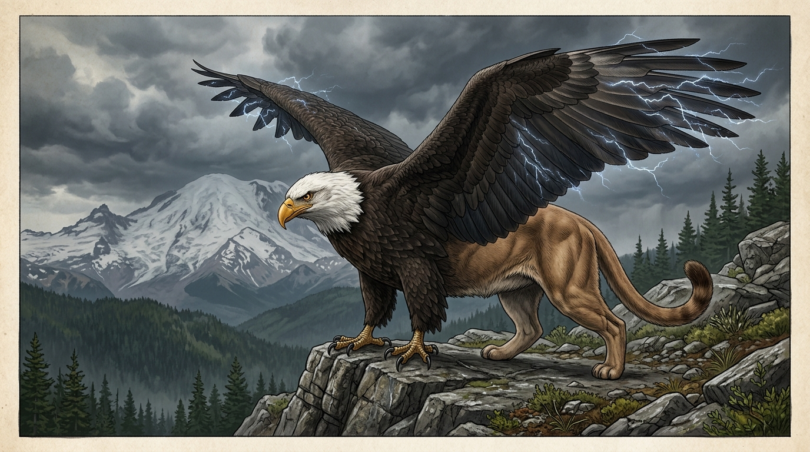

```mermaid
graph LR
    subgraph "高山アウトランド（営巣・狩猟空域）"
        A["【Sector-A】レーニア山雷雲営巣地<br>（高度4,000m・アルファ雄縄張り）"] -->|"急降下狩猟"| B["【Sector-B】カスケード航空回廊<br>（貨物コンボイ・変異獣捕食）"]
    end
    subgraph "対空迎撃ライン"
        B -->|"強襲・電撃 (240km/h)"| W["【シアトル防空リング】<br>アレス護衛機＋20mm対空砲"]
    end
    subgraph "要塞都市・素材流通"
        W -->|"撃墜個体搬入"| H["【シアトル魔獣解体所】<br>ライデン腺の絶縁摘出・放電"]
        H -->|"Class-B合格肉・羽毛出荷"| T["【パイクプレイス市場】<br>高級航空ジビエ・電磁シールド材"]
    end

    style A fill:#1b2631,stroke:#5dade2,stroke-width:2px;
    style B fill:#2c3e50,stroke:#f4d03f,stroke-width:2px;
    style W fill:#1a2a3a,stroke:#e74c3c,stroke-width:2px;
    style H fill:#1c2833,stroke:#2ecc71,stroke-width:2px;
    style T fill:#145a32,stroke:#27ae60,stroke-width:2px;
```

# 【雷鳴グリフォン】（ライメイグリフォン／*Gryphus fulgurans*／Thunder Gryphon）

---

## 1. 基本分類・メタデータ

| 項目 | 内容 |
| :--- | :--- |
| **和名** | 雷鳴グリフォン（ライメイグリフォン） |
| **学名** | *Gryphus fulgurans* |
| **英名 / 通称** | Thunder Gryphon / スカイ・ストライカー、カスケード・グリフォン、雷鷲獅子 |
| **発生起源** | **急速変異種（キメラ共生変異）**（原種：アメリカハクトウワシ *Haliaeetus leucocephalus* ＋ ピューマ *Puma concolor*） |
| **資源・食用区分** | **要処理種（Class-B）**（認可魔獣解体技師による生体放電器官「ライデン腺」の絶縁摘出・完全放電処理必須） |
| **脅威度ランク** | **Threat Level: III（高脅威度 / 防空機関砲・対空迎撃システム・重武装航空護衛部隊対応）** |
| **主要生息域** | 北米UCAS要塞圏 カスケード山脈アウトランド第1〜第3空域（レーニア山、セント・ヘレンズ山、シアトル〜ポートランド航空回廊上空） |

```
【図鑑外観標本 / Field Specimen Illustration】
```


```
【野生生態写真 / Field Wildlife Documentary Photo】
カスケード山脈レーニア山北西稜線（高度3,200m）において、雷雲から時速240kmで急降下襲撃を行う成熟雄個体。両翼と前肢の鉤爪から青紫色の生体電撃アーク（放電現象）が激しく閃光を放っている。
```


```
【北米カスケード山脈・雷鳴グリフォン（Thunder Gryphon）航空防衛作戦図 / Air Sector Tactical Map】

[標高 4,392m: レーニア山頂・永久雷雲営巣地] (高濃度風霊・雷霊マナ湧出源 / アルファ個体巣窟)
       │
       ▼
┌─────────────────────────────────────────────────────────────┐
│ 【Sector-A: カスケード高山魔境空域】(第1アウトランド / 高度 2,500-4,500m) │
│  - 環境: 常時雷雲・乱気流、高山岩壁、変異ビッグホーン・ヘラジカ生息域      │
│  - 生態: 単独行動の成体による縄張り監視、急降下狩猟（ダイブ速度 240km/h）   │
│  - 危険度: 極高 (Threat Level III)。民間航空機・ドローン侵入は100%撃墜     │
└──────────────────────┬──────────────────────────────────────┘
                       │ [降下狩猟ルート / カスケード山脈峡谷気流]
                       ▼
┌─────────────────────────────────────────────────────────────┐
│ 【Sector-B: シアトル〜デンバー航空コンボイ回廊】(高度 1,000-2,500m)       │
│  - 環境: 武装貨物機、メガコーポ社用シャトル、高圧送電線インフラ            │
│  - 生態: 航空エンジンの熱源・電磁波に誘引された迎撃・給電捕食行動          │
│  - 防衛交戦: アレス・セキュリティ航空護衛機（20mm機関砲）、近接防空タレット│
└──────────────────────┬──────────────────────────────────────┘
                       │ [防空迎撃ライン]
                       ▼
═══════════════════════════════════════════════════════════════
【防衛境界線: シアトル・タコマ広域防空リング / ボーイング・エバレット防空網】
═══════════════════════════════════════════════════════════════
                       │ (突破個体の対空迎撃・撃墜搬入)
                       ▼
┌─────────────────────────────────────────────────────────────┐
│ 【Sector-C: シアトル要塞メトロプレックス】(第1〜第2同心円)                 │
│  - 拠点: シアトル広域防空司令部、ボーイング航空魔導研究所、認可解体センター│
│  - 防衛兵装: 20mm M61 バルカンCIWS、FIM-92 スティンガー対空ミサイル        │
│  - 流通: 絶縁処理済み胸肉を「パイクプレイス魔獣市場」へ高級ジビエとして出荷│
└─────────────────────────────────────────────────────────────┘
```



---

## 2. 生物学的特徴・形態

### 2.1 外見・身体構造
- **体長 / 翼開長 / 体高 / 体重**: 体長 3.2m〜4.0m / 翼開長 9.0m〜11.5m / 体高 1.6m〜1.9m / 体重 480kg〜650kg（サイズ修正: **SM +2**）
- **骨格・羽毛・外皮**: 
  - **前半身（猛禽部）**: アメリカハクトウワシの骨格が巨大化。強靭な鉤嘴（黄色・長さ35cm）と、硬質ケラチン層にカーボンナノチューブ状生体炭素が沈着した巨大鉤爪を持つ。風切羽は導電性繊維で構成され、電磁シールド効果を発揮。
  - **後半身（ネコ科獣部）**: ピューマ特有の強靭な後肢跳躍筋と頑丈な腰帯。尾長1.8mの房毛付き尾が空中での急旋回ラダーとして機能する。
- **感覚器官・生体特異器官**: 
  - **超望遠電磁複眼**: 5km先の小動物の体温および電子機器から漏れ出る微弱な電磁ノイズを視覚的に捕捉。
  - **生体雷管（ライデン腺 / Leyden Gland）**: 竜骨突起直下の胸腔内に位置する高電圧生体コンデンサ器官。心筋収縮および羽毛摩擦で蓄電し、最大100万ボルトの生体放電を制御する。
  - **項部風力マナ受容節**: 上昇気流および気圧勾配を直接知覚・制御する霊的神経節。

### 2.2 変異・覚醒の経緯
2000年のマナ覚醒時、カスケード山脈（レーニア山〜セント・ヘレンズ山）の上空に発生した高濃度風霊・雷霊マナの乱気流渦に晒されたハクトウワシと、山麓のピューマが急速変異・キメラ共生融合。わずか3世代で安定した生殖能力を持つ超大型飛行変異種として生態系ピラミッドの頂点に君臨した。

```
[原種: ハクトウワシ (約5kg / 翼開長2.3m)] ＋ [原種: ピューマ (約70kg)]
       │
       ▼ (2000年: レーニア山上空の高濃度風霊・雷霊マナストーム被曝)
[キメラ共生変異・骨格巨大化・胸部ライデン腺の形成]
       │
       ▼ (約5世代の淘汰・生態的定着)
[雷鳴グリフォン (Gryphus fulgurans: 480-650kg / 翼開長10m超 / SM +2)]
```

---

## 3. 生態・行動パターン

### 3.1 食性・急降下電撃捕食行動
- **大型脊椎動物および電磁エネルギー摂取**: 
  - 主食はカスケード山地の変異ヘラジカ、ビッグホーン、大型齧歯類。
  - 航空機や送電塔の電磁波・静電気を好み、飛行中の貨物機や送電線に接触して放電エネルギーを吸収する習性（給電行動）を持つ。
- **急降下電撃爪撃（Lightning Dive Strike）**: 
  - 上空3,000mから翼を畳んで急降下（最高速度 **240km/h / BM 66**）。
  - 目標直前でライデン腺から前肢鉤爪へ電撃を集中させ、500kg超の運動エネルギーと数万アンペアの電撃を同時に叩き込んで獲物を瞬時に心停止・粉砕する。

```
【決定的瞬間記録: カスケード渓谷上空における超高速ダイブ / 240km/h Strike】
高度3,500mから獲物を捉えて垂直降下を開始した瞬間。両翼の導電性風切羽が青紫のプラズマを帯び、ソニックブームに近い轟音（雷鳴）を轟かせながら急降下する様子が観測された。
```

### 3.2 縄張り・営巣行動
- **単独行動・広大空域支配**: 
  - 成熟した雄はレーニア山やセント・ヘレンズ山の断崖絶壁（標高3,000m以上）に巨大な巣（エアリー）を構え、半径60kmの空域を絶対防衛縄張りとする。
  - 縄張りに侵入するすべての航空機（ヘリ、VTOL、小型ジェット）を敵対大型鳥類とみなし、即座に要撃上昇を行う。

### 3.3 繁殖・ライフサイクル
- 2年に1回、初夏に絶壁の巣で1〜2個の巨大な電磁帯電卵を産卵。
- 卵は親鳥の放電で温められ、約60日で孵化。幼体は1年で飛翔可能となり、3年で完全な成体（Threat Level: III）に達する。寿命は約40年〜50年。

---

## 4. 魔導科学・生物学的考察

### 4.1 魔力現象と発現メカニズム（魔導理論分析）
- **風霊・雷霊系生体励起力学**: 
  - **理論魔導学派（ハーメチック・メイジ）の分析**: 本種はガープスマジックにおける**風霊系（Air College）《上昇気流 (Updraft)》《風の壁 (Wall of Wind)》** および **気象・天候系《稲妻 (Lightning)》** を不随意に励起している。翼下面に局所的な超低圧・上昇気流を形成することで、500kg超の超重量巨躯でありながら軽快な飛翔と超高速急降下を可能にしている。
  - **生体電磁シールド**: 放電時、全身の導電性羽毛がファラデーケージとして機能し、自身への感電を防ぐと同時に外部からのパルス電磁攻撃を逸らしている。

### 4.2 ガープス準拠 生体パラメータ（GURPS Stat Block）

| 能力値・項目 | 規格数値 | 生物学的・力学的解釈 |
| :--- | :--- | :--- |
| **ST（体力）** | **28** | 基礎荷重値 BL $\approx 71.3 \text{ kg}$。成人の体重を軽々掴んで上空へ運搬。 |
| **DX（敏捷力）** | **13** | 猛禽類の卓越した飛行機動と獲物への捕捉精度。 |
| **IQ（知力）** | **5** | 高度な肉食獣知能。対空兵器の死角・背後からの急襲を学習。 |
| **HT（生命力）** | **14** | 希薄な高高度酸素環境と激しい気流に耐える強靭な心肺。 |
| **HP / FP** | **HP 32 / FP 14** | 巨躯と筋肉量に裏打ちされた耐久限界。 |
| **移動力 / 速度** | ・地上: **BM 10 (36 km/h)**<br>・通常飛行: **BM 22 (79.2 km/h)**<br>・急降下: **BM 66 (237.6 km/h)** | 上空からのダイブ攻撃時は最高速度で目標を急襲。 |
| **サイズ修正 (SM)** | **+2** | 翼開長 10m超、体長 3.5mの大型飛行魔獣。 |
| **防護点 (DR)** | ・導電羽毛・皮膜：**DR 8**<br>・下腹部・眼窩：**DR 2** | 羽毛は小銃弾・散弾を弾き、電磁熱線を分散。 |
| **生まれつきの攻撃** | **電撃爪撃（Lightning Talons）** | 致傷力 `突き 3d (刺)` ＋ **2d 電撃ダメージ [装甲半減: AD(2)]**（56kJ級の運動衝撃＋生体放電）。 |
| **嘴・噛み付き** | **嘴撃（Beak Chop）** | 致傷力 `振り 5d+1 (切)`（ピューマの咬合力400psiを大きく超える破壊力）。 |
| **生得的防御特徴** | **完全電気耐性 [DR 30 (電撃限定)]** / **耐寒性** | 落雷や高電圧攻撃を無効化。 |

### 4.3 科学的・電磁的相互作用
- **電磁パルス（EMP）ノイズ放出**: ライデン腺の充放電に伴い、周囲数百メートルの非シールド通信機・民間GPSにホワイトノイズが発生する。軍用ECCMおよび光ファイバー有線シールドシステムは正常に作動する。

---

## 5. 交戦マニュアル・防衛対策

### 5.1 有効な現代兵器・対空弾道力学

```
【歩兵小銃での射撃は無効・危険】
 5.56mm / 7.62mm 小銃弾 ──> [導電羽毛 (DR 8) ＋ 超高速機動 (BM 22-66)] ──> 偏差射撃困難・威力不足
 
【有効対空火器・迎撃システム】
 20×102mm M61 バルカン砲（毎分6000発 / 初速1030m/s / 56kJ）──> [翼膜・胸部骨格ごと粉砕・撃墜]
 12.7×99mm M2 重機関銃（対空曳光徹甲弾 / AP: DR半減）──> [急降下軸への迎撃射撃で致命傷]
 FIM-92 スティンガー（MANPADS / マッハ2.2）────────> [熱源・生体電波ロックオンで一撃必墜]
```

- **推奨対空兵装**:
  - **航空機・車載対空火器**: **20mm 6砲身ガトリング砲（M61 バルカン / ファランクス）**。対空近接信管弾による弾幕が最も有効。
  - **地上迎撃**: **12.7mm重機関銃（M2）** または **40mm対空自動擲弾銃（近接信管）**。
  - **携帯対空ミサイル**: **FIM-92 スティンガー**（ライデン腺から放出される高熱・電磁シグネチャに対する赤外線/紫外線誘導が極めて良好にロックオン可能）。
- **小火器による自衛**: 原則として単独歩兵の5.56mm小銃での交戦は厳禁。頭上を通過する瞬間の腹部（DR 2）への集中斉射のみが僅かに有効。

### 5.2 弱点・回避行動
- **急所**: 翼の付け根（上腕骨関節部）、下腹部の薄い毛皮、開口時の口腔内。
- **回避・欺瞞戦術**: 強力な電磁パルスを放つため、赤外線フレアおよびチャフの同時射出が急降下ロックオンの撹乱に有効。

### 5.3 魔術的対空・無力化プロトコル（術士連携戦術）
術士が搭乗する護衛機や対空防衛班においては、以下の呪文が極めて有効である：
- **風霊系呪文《無風 (No Air)》《突風 (Windstorm)》**: 飛翔中の翼下面に展開することで揚力を瞬時に奪い、**失速・不時着墜落**を強制誘発。
- **音声系呪文《大音声 (Great Voice)》《爆音》**: 超鋭敏な猛禽聴覚に対し強烈な音響ショックを与え、平衡感覚を喪失させる。
- **光・闇系呪文《閃光 (Flash)》**: 望遠複眼の視神経を一時的に焼き、ダイブ軌道を大きく逸らす。

---

## 6. 解体・食利用・流通市場

### 6.1 食用利用と調理法（Class-B / 要処理種）
- **可食部位と肉質**: 
  - 後半身のモモ肉（ピューマ肉質）は引き締まった赤身で、野性味溢れる濃厚な旨味を持つ。
  - 前半身の胸肉（猛禽肉質）は高タンパク・超低脂質で、地鶏と鴨肉を合わせたような芳醇な風味。
- **下処理・調理プロトコル**: 
  - **ライデン腺の完全放電・絶縁摘出**: 死亡後も生体雷管内に数万ボルトの残留電荷が存在するため、解体技師は**耐電圧20,000V絶縁スーツおよびアース接地棒**を装着して作業を行う。
  - **特定高圧変異寄生虫リスク**: 完全加熱必須。中心温度 **90℃以上で20分間以上の加熱**（ロースト、または赤ワイン煮込み）。
- **市場流通**: 
  - 安全検査に合格した精肉は、シアトル・メトロプレックスの**「パイクプレイス魔獣市場」**を通じて高級ホテルや航空メガコーポのVIPレストランへ出荷。「カスケード・グリフォン・ステーキ」として1ポンドあたり150〜250ドルで取引される。

### 6.2 素材採取と工業利用
- **採取可能素材**:
  1. **導電性風切羽（スカイ・フェザー）**: 軽量かつ耐熱・電磁シールド性に優れ、次世代ステルス戦闘機や宇宙往還機の外壁コーティング材として高値取引（1枚あたり約3,000ドル）。
  2. **ライデン腺（生体蓄電器官）**: メガコーポ（アレス・マックミラン等）が回収し、超高出力EMPグレネードや生体バッテリー研究用サンプルとして買い取り。
  3. **猛禽大鉤爪**: チタン並みの硬度を持ち、高周波近接格闘ナイフの刀身素材に加工。
- **バイオハザード注意点**: 解体時の感電死事故防止のため、現場には常時グラウンディング除電設備が義務付けられている。

---

## 7. 現場記録・調査員ログ

> *「レーニアの北壁を越えるデンバー行きの定期貨物シャトルに乗るなら、神に祈るより前に20mmバルカンの給弾ベルトが満載か確認することだ。  
> 奴らは高度3,000の雷雲の中に潜んで、貨物機のタービン音とレーダー電波を嗅ぎつけて落ちてくる。時速200キロを超えるダイブに、青白い稲妻をまとった爪だ。  
> 生半可な小銃じゃ羽毛に弾かれて終わりだが、アレス社製の対空ガトリングで対空信管弾を200発ほど正面からぶち込んでやれば、さすがの『空の王』も煙を吹いて雪谷に墜落する。  
> その後、アース線を打ち込んで安全確保した後のモモ肉を、シアトルの酒場で地ビールと一緒に食うのが、俺たちスカイ・マーシャルの最高のボーナスさ」*  
> —— **UCASシアトル防空輸送PMC「カスケード・スカイガード」チーフ・マーシャル・ジョン・マッケンジー**（2025年 航空護衛日誌より）
