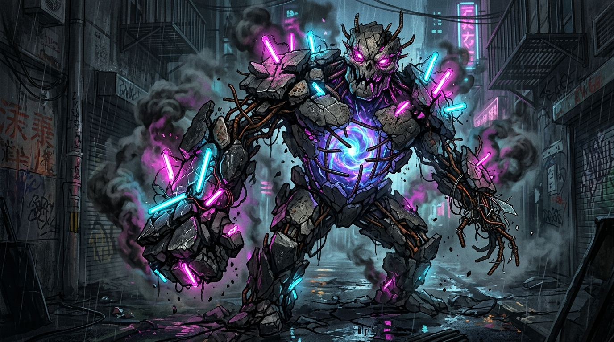
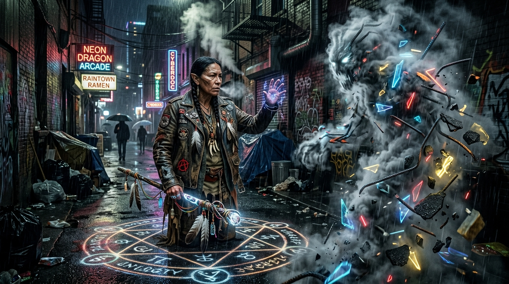
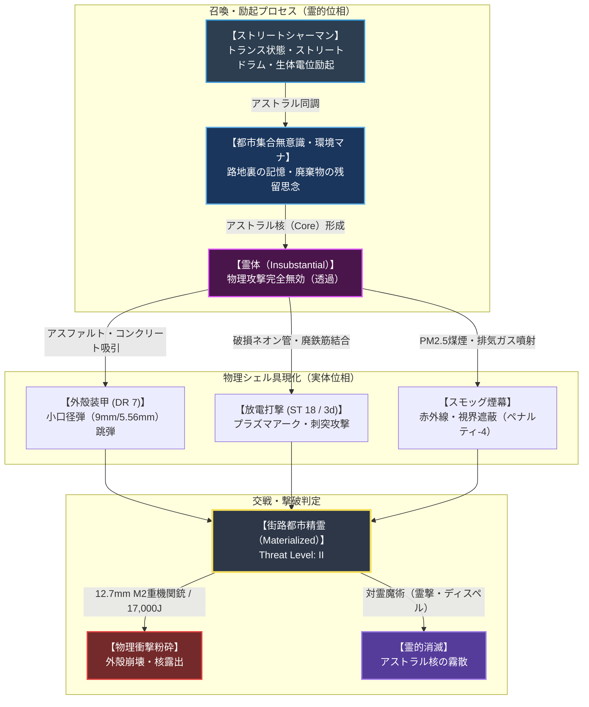

# 【街路都市精霊】（ガイロトシセイレイ／*Spiritus urbanus asphalti*／Urban Street Spirit）

---

## 1. 基本分類・メタデータ

| 項目 | 内容 |
| :--- | :--- |
| **和名** | 街路都市精霊（ガイロトシセイレイ）、アスファルト・スモッグ・エレメンタル |
| **学名・術名** | *Spiritus urbanus asphalti*（都市霊体・アスファルト具現型） |
| **英名 / 通称** | Urban Street Spirit / Asphalt Elemental, Gutter Golem（ガッター・ゴーレム / 側溝の巨霊）, Neon Smog Wraith（ネオン・スモッグ・レイス） |
| **発生起源** | **伝統・儀式学派（シャーマニズム）召喚霊体**（ストリートシャーマンによる都市環境マナ・集合思念の結晶体） |
| **資源・食用区分** | **汚染・霊体種（Class-C / 非可食・触媒回収対象）** |
| **脅威度ランク** | **Threat Level: II（中脅威度 / メガコーポ治安PMC対魔班・警察退魔士・対霊部隊対応）** |
| **主要出現・使役域** | 北米カスケディア・メガプレックス（シアトル・メトロプレックス、旧タコマ港湾スラム）、ニューヨーク・ブロンクス裏路地、地下鉄廃線網、オートジャンクヤード |

```
【図鑑外観標本 / Field Specimen Illustration】
```


```
【現場野生・召喚写真 / Field Documentary Photo】
シアトル・メトロプレックス第4スラム地区（レイン・ディストリクト）の裏路地において、先住民族系メタヒューマンのストリートシャーマンによって召喚・実体化された街路都市精霊。濡れたアスファルト上のグラフィティ魔法陣、排気ガス煤煙とネオン管の破片を纏い、治安PMCの巡回部隊を迎撃する姿が記録されている。
```


```
【シアトル・メトロプレックス裏路地・街路都市精霊（Urban Street Spirit）戦術作戦図 / Tactical Urban Sector Map】

[上層: メガコーポ本社タワー群・軌道エレベーター基部] (超高密度監視カメラ網・結界ドーム)
       │
       ▼ [スカイウォーク回廊・検問ゲート]
┌─────────────────────────────────────────────────────────────┐
│ 【Sector-A: 中層商業・電脳オフィス街】(第2セーフゾーン)                     │
│  - 治安組織: Ares Macrotechnology 傘下「Knight Errant」常駐パトロール      │
│  - 防衛兵装: 軽装甲パトロール車両、ドローン索敵網、対魔シールド発生装置   │
│  - 精霊の進入: 結界境界線により霊体侵入は遮断                              │
└──────────────────────┬──────────────────────────────────────┘
                       │ [非常階段・通気ダクト・排水本管]
                       ▼
┌─────────────────────────────────────────────────────────────┐
│ 【Sector-B: 下層スラム街（レイン・ディストリクト）】(アウター・ストリート)     │
│  - 特徴: 常時降雨、酸性雨水たまり、濃厚なPM2.5排気ガス煤煙、破損ネオン看板 │
│  - 勢力: 先住民族系メタヒューマン共同体、ストリートシャーマン・サークル     │
│  - 召喚拠点: スプレーペイントのグラフィティ魔法陣、路地裏のジャンクヤード  │
│  - 精霊の活動: 路地裏の巡回・防衛、メガコーポ地上げPMC部隊へのゲリラ迎撃    │
└──────────────────────┬──────────────────────────────────────┘
                       │ [地下鉄廃トンネル・暗渠排水路]
                       ▼
┌─────────────────────────────────────────────────────────────┐
│ 【Sector-C: 最下層地下空洞・廃水処理施設】(アンダーグラウンド・アビス)     │
│  - 特徴: 2000年覚醒時のマナ汚染残滓、高濃度エーテル滞留域                 │
│  - 危険要因: 未契約の野良都市悪霊（Urban Poltergeist）、変異巨大齧歯類     │
└─────────────────────────────────────────────────────────────┘
```



---

## 2. 生物・霊体構造と具現力学

### 2.1 外見・構成物質
- **体高 / 体幅 / 具現総重量**: 体高 1.8m〜2.4m / 肩幅 1.2m〜1.6m / 具現化時質量 350kg〜600kg（サイズ修正: **SM +1**）
- **ハイブリッド具現構造**:
  - **アストラル霊核（Astral Core）**: 胸部中央の亀裂奥深くに脈動する球状の霊的渦動。青紫色または琥珀色に発光し、術士とのマナパスを維持する。
  - **アスファルト＆コンクリート外殻（Armor Shell）**: 道路舗装から剥離したビチューメン混合アスファルト片および高強度コンクリート破片が、霊的な引力場によって相互に強固に結合（厚さ 40mm〜70mm、**DR 7**）。
  - **廃鉄筋・ワイヤー骨格（Rebar Myomer）**: 建造物廃材の異形鉄筋（D16〜D22）や鋼線が筋肉の筋繊維のように編み込まれ、高い引張強度と柔軟な関節可動域を実現。
  - **ネオン放電管クラスタ（Neon Shards）**: 肩部や背部に突き刺さった破損ネオン看板のガラス管。霊核から漏洩する生体電位によって希ガス（ネオン/アルゴン）が励起され、シアンやマゼンタの放電プラズマ光を常時放射。
  - **PM2.5スモッグ外気流（Smog Mantle）**: 排気ガス、ディーゼル煤煙、アスファルト微粒子が濃密な黒煙となって全身を渦巻き、輪郭を曖昧にする。

### 2.2 召喚・変異の経緯
2000年のミレニアム・アウェイクニング以降、伝統的なネイティブ・シャーマニズムの継承者や路地裏のスラム孤児（メタヒューマン）たちが、大自然の精霊（熊、鷹、狼）の代わりに、自らが生まれ育った「コンクリートジャングル」の集合思念・都市環境マナと同調することで誕生した近代固有の召喚魔術体系である。

```
[2000年: マナ覚醒による都市環境マナの励起]
       │
       ▼ (スラム街・路地裏における都市アニミズムの開拓)
[ストリートシャーマンによる都市の残留思念（場所の霊 / Genius Loci）の受容]
       │
       ▼ (スプレーグラフィティ魔法陣＋ストリートドラムによる召喚プロトコル確立)
[街路都市精霊 (Spiritus urbanus asphalti / Threat Level II)]
```

---

## 3. 生態・行動パターン

### 3.1 召喚維持・マナ供給
- **術士の生体マナ媒介**:
  - 本精霊は独立した生物ではなく、術士（ストリートシャーマン）のアストラル体から供給されるマナによって現界を維持する（維持消費: 1FP / 1分、または都市マナ特異点での自立稼働）。
- **都市環境マナの吸収**:
  - 車両の走行音、ネオンの明滅、人々の感情（怒り、焦燥、ストリートの連帯感）を霊的栄養素として代謝還元し、活動時間を延長する。

### 3.2 使役任務・防衛行動
- **路地裏ゲリラ防衛**:
  - メガコーポ傘下の治安部隊（Knight Errant社等）によるスラム住民の強制退去やパトロールに対し、マンホールや建物の壁面から突如実体化して急襲。車両のタイヤを破砕し、通信機を持つ指揮官を優先制圧する。
- **煙幕散布と撤退支援**:
  - 仲間が窮地に陥った際、自らの体を崩壊させながら濃密なスモッグ煙幕（PM2.5煤煙）を広範囲に噴射し、追跡部隊の視界と赤外線暗視装置を完全に無力化して退路を確保する。

### 3.3 霊的寿命・送還
- 任務完了時、または術士の集中が途切れると物理結合が解け、アスファルト片や鉄筋はその場に崩落。アストラル核は都市の霊的地下水脈へと還流（送還）する。

---

## 4. 魔導科学・都市工学考察

### 4.1 物理・霊体ハイブリッド力学
- **ガープス第4版基準能力値（具現化時）**:
  - **ST 18** (突進・打撃致傷力: 突き 1d+2 / 振り 3d)
  - **DX 11**, **IQ 8** (街路戦術・命令理解), **HT 12**
  - **HP 22**, **FP 12**, **BS 5.75**, **BM 6** (時速 21.6 km/h)
  - **防護点 (DR)**: **DR 7** (アスファルト・コンクリート複合外殻)
- **非物質性と生体媒介原則の遵守**:
  - 精霊のコアは「アストラル体（魂・霊性エネルギー）」であり、電子機器や通信回線に直接ハッキングする能力は持たない。
  - しかし、外殻に組み込まれたネオン管から生じる高電圧アーク放電（生体電位の副産物）により、接触した電子機器を物理的にショート・焼損させる局所的電撃攻撃（2d 電撃ダメージ）を行う。

### 4.2 科学的・電磁的相互作用
- **電磁波・レーダー反射**:
  - 具現化時はコンクリートと鉄筋の塊であるため、ミリ波レーダーやLiDARに極めて明瞭に探知される。
- **赤外線サーモグラフィ**:
  - アスファルトの断熱性と内部の冷たいアストラルエネルギーにより、常温〜やや低温（周囲温度と同調）として映り、熱源探知ミサイルに対して高いステルス性を発揮する。

---

## 5. 交戦マニュアル・防衛対策

### 5.1 有効な現代兵器・戦術（治安PMC・警察向け）

| 兵装・口径 | 有効性 | ダメージ / 貫通力学 | 戦術的評価 |
| :--- | :---: | :--- | :--- |
| **9×19mm拳銃弾** | **× 完全無効** | 1d+1 pi (平均 4.5) vs DR 7 | アスファルト外殻で跳弾。パトロール警官の拳銃射撃では阻止不能。 |
| **5.56×45mm NATO小銃弾** | **△ 部分有効** | 5d pi (平均 17.5) vs DR 7 (実効 10.5) | 外殻を削り落とすことは可能だが、霊核への致死打となりにくい。多弾数掃射が必要。 |
| **12 Gauge スラッグ弾** | **◯ 極めて有効** | 4d+2 pi++ (平均 16, 負傷倍率×2) | 衝撃力（約3,000J）で外殻ブロックを粉砕し、霊核の結合を強制解除。 |
| **12.7×99mm M2重機関銃** | **◎ 一撃粉砕** | 13d+1 pi+ (平均 46.5 / 約17,000J) | 防護点DR 7を容易に貫通。圧倒的な物理運動エネルギーで全身が四散。 |
| **対霊魔術（霊撃・除霊符）** | **◎ 致命的特効** | アストラル直撃（DR無視） | 外殻を無視して霊核を直接浄化・霧散させる。対魔ライセンス術士必須。 |

### 5.2 弱点・対処プロトコル
- **術士の分断・集中阻害**:
  - 本精霊は術士の生体マナ供給に依存しているため、フラッシュバン、音響兵器、催涙ガス等でストリートシャーマンのトランス（詠唱・集中）を中断させれば即座に霧散・無力化する。
- **高圧放水・消火フォーム**:
  - 毎分500リットル以上の高圧放水砲を浴びせると、結合しているPM2.5煤煙と路面スラッジが洗い流され、外殻の結合力が低下（DRが 7 から 2 へ低下）。

---

## 6. 解体・素材採取・電脳魔導利用

### 6.1 食用利用の評価
- **完全食用不可（Class-C / 汚染・霊体種）**:
  - 実体化が解けると瓦礫と煤煙に還元されるため、可食部位は一切存在しない。
  - 残留する煤煙やスラッジには高濃度の重金属・発がん性タール・霊的汚染が含まれており、経口摂取時は重度の急性呼吸不全および精神錯乱を引き起こす。

### 6.2 素材採取と工業・電脳魔導利用

| 採取素材 | 回収部位 | 主な用途・価値 |
| :--- | :--- | :--- |
| **アーバン・エーテル・スラグ**<br>*(Urban Aether Slag)* | 崩壊後の霊核中心部に残留するガラス状の黒色結晶（1個あたり 50〜150g） | **電脳魔導触媒・生体マナ同調素子**。<br>裏サイバーウェア技師が神経接続端子（データジャック）のマナ絶縁材として高額買取（約 2,000〜5,000 Nuyen / 個）。 |
| **帯電ネオンカレット**<br>*(Charged Neon Cullet)* | 高濃度マナと放電に晒されたネオン管の破砕ガラス片 | **伝統呪具・護符の触媒**。<br>ストリートシャーマン間で「街路の守護符」や閃光手榴弾の魔導充填材として流通。 |

---

## 7. 現場記録・調査員ログ

> *「路地裏のグラフィティから突如として煙が噴き出し、路面のアスファルトが唸りを上げて立ち上がった。 Knight Errant のパトロールカーが突っ込んできたが、奴はそのボンネットを300キロのコンクリートの拳で叩き潰し、ネオンの閃光とともに排気ガスの闇へと消えた。あのスラムの連中にとって、あれは単なる魔法じゃない。街そのものが奴らに味方している証拠なんだよ」*  
> —— **Ares Security / Knight Errant 第7管区治安特捜班 レックス・キャラハン巡査長**（2026年 シアトル・ダウンタウン特別捜査記録より）
