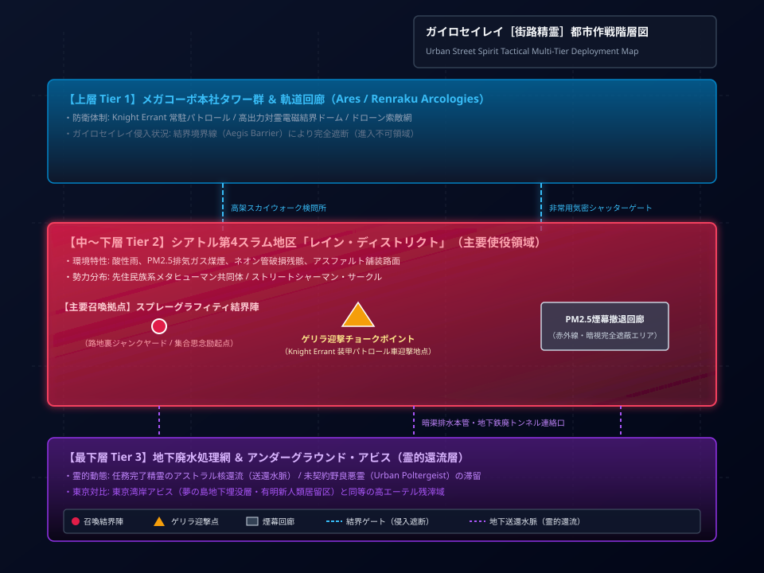
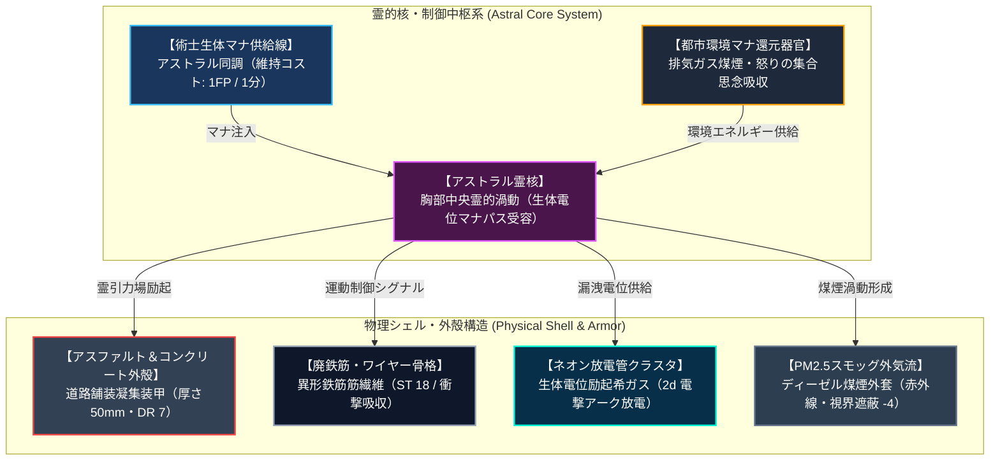
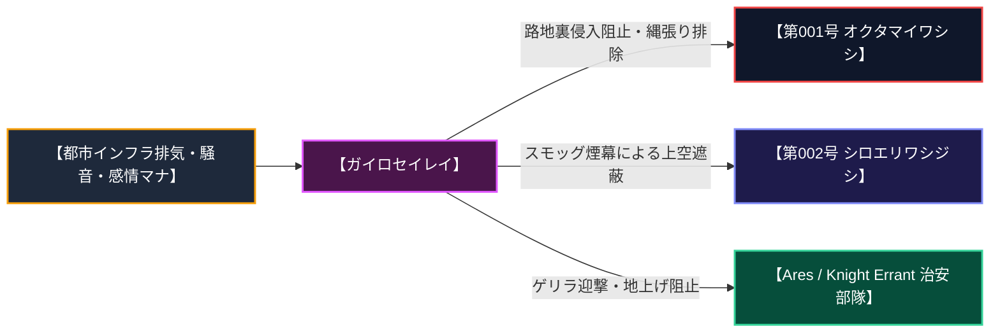
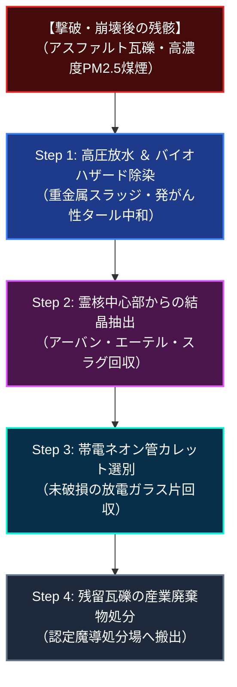

# 【ガイロセイレイ［街路精霊］】（Urban Street Spirit／*Spiritus urbanus asphalti*／ストリート・スピリット、ガッター・ゴーレム、アスファルト・エレメンタル）

---

## 1. 基本分類・早わかり（Basic Classification & Fast Facts）

| 項目 | 内容 |
| :--- | :--- |
| **標準和名** | **ガイロセイレイ［街路精霊］** |
| **和名命名規約** | **【環境・生息域型】**<br>※命名根拠: 古代の土地神（*Genius Loci*）が、現代都市の舗装道路・裏路地（街路）の環境マナに具現化した本質を表す正統派環境和名。 |
| **英名 / 通称** | Urban Street Spirit / ストリート・スピリット、ガッター・ゴーレム（側溝の巨霊）、アスファルト・エレメンタル、ネオン・スモッグ・レイス |
| **学名** | *Spiritus urbanus asphalti* |
| **学名語源** | *Spiritus*（ラテン語: 霊・息吹）＋ *urbanus*（ラテン語: 都市の）＋ *asphalti*（ラテン語: アスファルトの） |
| **生物学的分類** | **門**: 霊体門 Spiritus<br>**綱**: 精霊綱 Elementalia<br>**目**: 都市精霊目 Urbaniformes<br>**科**: 街路霊科 Viatividae<br>**属**: 街路精霊属 *Spiritus*<br>**種**: 街路精霊 *S. asphalti*<br>**変異亜種**: シアトル原名亜種 *S. a. cascadiae* / 東京湾岸適応型 *S. a. tokyoensis* |
| **発生起源** | **伝統・儀式学派（シャーマニズム）召喚霊体**（都市環境マナおよび路地裏スラムの集合思念が結晶化した近代固有の召喚精霊） |
| **資源・管理区分** | **汚染・霊体種（Class-C）**[^zext_1]<br>※管理ステータス: **完全食用禁止 / バイオハザード劇物指定 / メガコーポ治安部隊・警察対霊魔術班による強制除染・送還対象（崩壊後残留結晶「アーバン・エーテル・スラグ」のみ回収認可）** |
| **食性** | **都市環境マナ・感情エネルギー代謝**（車両排気ガス煤煙、ネオン明滅、酸性雨スラッジ、人間の怒り・連帯感の霊的還元代謝） |
| **寿命** | 召喚時限定（術士のアストラルマナ供給持続中のみ自立具現 / 術士集中途絶または1〜4時間で送還・瓦礫崩落） |
| **サイズ・重量** | 具現化時体高 1.8〜2.4m / 肩幅 1.2〜1.6m / 具現化総質量 350〜600kg（サイズ修正: **SM +1**） |
| **直感的サイズ比較** | **【成人男性（180cm）／ 軽装甲パトロール車両（車重2.5t）との比較】**<br>※具現化した精霊の体格は成人男性を一回り上回る巨躯。300kg超のアスファルトの拳で軽装甲パトロール車のボンネットを叩き潰す破壊力を発揮する。 |
| **脅威度ランク** | **Threat Level: II（中脅威度 / メガコーポ治安PMC対魔班・警察退魔士・対霊部隊対応）** |
| **主要生息域** | **【一次野生・召喚地域】** 北米カスケディア・メガプレックス（シアトル・メトロプレックス第4スラム地区「レイン・ディストリクト」）、ニューヨーク・ブロンクス裏路地<br>**【国内出現・使役地域】** 東京湾岸スラム（夢の島・有明新人類居留区）、国道16号壁外アウトランド第2区（旧五日市街道廃墟群） |

---

### 生息・分布マップ（Distribution & Habitat Range Map）



> **【生息分布データ】**:
> - **一次野生・召喚拠点（原産地・高濃度スラム域）**: 北米シアトル・メトロプレックス第4スラム地区「レイン・ディストリクト」（常時酸性雨・排気ガス煤煙・高濃度エーテル滞留域）。
> - **国内二次使役・出現回廊**: 東京湾岸スラム（夢の島・有明新人類居留区）、旧五日市街道廃墟群、地下鉄廃トンネル暗渠網。
> - **侵入遮断境界線**: 上層メガコーポ本社タワー群・第1セーフゾーン（高出力対霊電磁結界ドーム「Aegis Barrier」により完全侵入遮断）。
> - **環境耐性・生息限界**: 気温 -10〜45℃ / PM2.5煤煙・重金属スラッジ多湿環境を好む。

---

### 視覚資料アーカイブ（Visual Archive）

| 外観標本図解（具現化形態） | 野生召喚現場写真（シアトル裏路地迎撃） |
| :---: | :---: |
|  |  |
| *国際魔導都市環境研究所（Seattle Urban Lab）提供標本図解（アストラル霊核・外殻注記付）* | *シアトル第4スラム地区にてストリートシャーマンが召喚した現場を治安カメラが記録（2026年）* |

---

## 2. 伝承考証とマナ覚醒の架橋（Lore & Historical Bridge）

### 2.1 原典・民俗伝承の記録
- **古代ローマ『ゲニウス・ロキ（Genius Loci / 土地の守護霊）』伝承**:
  古代ローマにおいて、あらゆる街路、交差点、広場にはその場所固有の守護霊（*Genius Loci*）が宿ると信じられていた。都市の建設者や市民は街角に小さな祭壇（コンピトゥム）を設け、日々の安全と街路の守護を祈願した。土地の霊は都市の繁栄を見守る一方、不敬な侵略者に対しては災いをもたらす存在とされた[^schulz_1]。
- **近世〜近代都市伝説（ストリート・フォークロア）**:
  19世紀のロンドンや20世紀のニューヨークにおいて、路地裏のガス灯や地下水道の暗渠に「煙と泥の怪物」が潜むという都市伝説が流布。都市が巨大化するにつれ、路面アスファルトや排気ガスの闇そのものが意志を持つという集合無意識の萌芽が記録されていた。

### 2.2 2000年マナ覚醒による生体科学的架橋（召喚・変異の経緯）
西暦2000年1月1日の「ミレニアム・アウェイクニング」に伴い、世界中の大都市に蓄積されていた「都市環境マナ（路面アスファルトの熱量、電磁波ノイズ、排気ガス煤煙）」と「スラム住民の集合無意識」が一斉に励起された。  
北米シアトルや東京湾岸のスラム街に追いやられた先住民系メタヒューマン（ストリートシャーマン）たちは、大自然の精霊（熊、鷹、狼）の代わりに、自らが生活する「コンクリートジャングル」の土地霊と同調する新たな召喚プロトコルを開拓。スプレーペイントによるグラフィティ魔法陣とストリートドラムのビートを媒介として、古代の *Genius Loci* を現代の生物学的・霊的実体 *Spiritus urbanus asphalti*（ガイロセイレイ）として現界に具現化させることに成功したのである。

---

## 3. 生物学的特徴・ライフステージ（Biological Traits & Anatomy）

### 3.1 外見・解剖学的身体構造（召喚維持・マナ供給構造）



- **アストラル霊核（Astral Core）**:
  - 胸部中央の亀裂奥深くに脈動する球状の霊的渦動。青紫色〜琥珀色に発光し、術士（ストリートシャーマン）との生体電位マナパスを維持する。
- **アスファルト＆コンクリート外殻（DR 7）**:
  - 道路舗装から剥離したビチューメン混合アスファルト片および高強度コンクリート破片が、霊引力場によって相互結合（厚さ 40〜70mm、**DR 7**）。拳銃弾（9mm）や散弾を完全に跳弾。
- **廃鉄筋・ワイヤー骨格（Rebar Myomer）**:
  - 建造物廃材の異形鉄筋（D16〜D22）や鋼線が筋肉の筋繊維のように編み込まれ、高い引張強度と柔軟な関節可動域（**ST 18**）を実現。
- **ネオン放電管クラスタ（Neon Shards）**:
  - 肩部や背部に突き刺さった破損ネオン看板のガラス管。霊核から漏洩する生体電位によって希ガス（ネオン/アルゴン）が励起され、シアンやマゼンタの放電プラズマ光（**2d 電撃ダメージ**）を放射。
- **PM2.5スモッグ外気流（Smog Mantle）**:
  - 排気ガス、ディーゼル煤煙、アスファルト微粒子が濃密な黒煙となって全身を渦巻き、赤外線暗視装置および肉眼視界に **-4 のペナルティ** を与える[^takatsukasa_1]。

### 3.2 ライフステージと霊的寿命・送還サイクル
1. **召喚・励起フェーズ（Summoning / 0〜30秒）**:
   - スプレーペイントのグラフィティ魔法陣上で術士がトランスに入り、路面の舗装材と煤煙を吸引して物理シェルを形成。
2. **使役・戦闘フェーズ（Active Duty / 10分〜数時間）**:
   - 術士のFP供給（1FP/1分）または高濃度都市マナ特異点の環境マナを吸収しながら自立稼働。
3. **送還・瓦礫崩落フェーズ（Dismissal & Dissolution）**:
   - 任務完了時、または術士の集中が途切れると物理結合が解け、アスファルト片や鉄筋はその場に崩落。アストラル核は都市の霊的地下水脈へと還流する。
4. **野良悪霊化リスク（Urban Poltergeist / 霊的寿命限界）**:
   - 術士が死亡するなどしてマナパスが強制切断された場合、残留思念が暴走して「野良都市悪霊」化することがある。数日間にわたり路地裏を徘徊し、周囲の電子機器をショートさせながら徐々に霧散する。

---

## 4. 生態・食物連鎖・人間社会との摩擦（Ecology & Human Conflict）

### 4.1 食性・マナ供給代謝
- **主食・霊的栄養源**:
  生物学的摂食は行わず、都市インフラから放出される廃熱、車両の走行音、ネオンの明滅、およびスラム住民の強い感情（抑圧への怒り、ストリートの連帯感）を霊的栄養素として代謝還元する。



### 4.2 魔獣間クロス・リレーション（相互作用）
- **第001号 オクタマイワシシ（Crag Boar）**:
  五日市街道廃墟群において遭遇。無機物塊であるガイロセイレイに対し、オクタマイワシシは土壌・瓦礫ごと掘り起こしてテリトリーから排除しようとするが、ガイロセイレイはネオン電撃で威嚇・撃退する。
- **第002号 シロエリワシジシ（サンダー・グリフォン）**:
  高層ビル群上空を哨戒するグリフォンに対し、ガイロセイレイは濃密なPM2.5煤煙幕を上空へ噴射して視界を奪い、急降下襲撃を完全に封じる。

### 4.3 人間社会との摩擦・使役任務・防衛行動
- **スラム住民・ストリート防衛ゲリラ戦**:
  メガコーポ傘下の治安PMC（Knight Errant社等）によるスラム住民の強制立ち退きや地上げに対し、マンホールや建物の壁面から突如実体化して急襲。装甲パトロール車のタイヤを破砕し、指揮車両を孤立させる[^jinnai_1]。
- **煙幕散布と撤退支援**:
  住民や仲間が窮地に陥った際、自らの体を崩壊させながら濃密なスモッグ煙幕を広範囲に噴射し、追跡部隊の視界と赤外線暗視装置を完全に無力化して退路を確保する。

---

## 5. 魔導科学・上位神性・背景ロア（Thaumaturgical Theory & Lore）

### 5.1 魔力現象と発現メカニズム（GURPS公式呪文エビデンス）
- **生体励起公式呪文（公式アーカイブ突合エビデンス）**:
  - **《地霊召喚》（Summon Earth Elemental / `world/magic/spells/elemental_spirit.md:41`）**:
    術士が都市の舗装路面と同調し、土砂・アスファルト・瓦礫を凝集して自律的な剛力精霊を召喚・実体化。
  - **《精霊支配》（Control Elemental / `world/magic/spells/elemental_spirit.md:43`）**:
    実体化したガイロセイレイに対し、路地裏の防衛線維持や特定の装甲車両への突進命令を伝達・制御。
  - **《精霊作成》（Create Elemental / `world/magic/spells/elemental_spirit.md:44`）**:
    スラムの重要防衛拠点に恒久的な守護精霊として設置する儀式召喚体系。
- **生体媒介原則（Bio-Medium Principle）**:
  ガイロセイレイのコアは術士のアストラル体と同調した霊的エネルギーであり、電子機器やサイバー空間に直接侵入・ハッキングする能力は持たない。しかし、ネオン管から漏洩する物理的アーク放電（2d電撃）により、接触した電子機器を物理的にショート・焼損させる[^kuroda_1]。

### 5.2 音響・周波数・生体通信特性（Acoustic & Resonance Analysis）

```
【音響スペクトログラム解析データ: ガイロセイレイ具現化シークエンス】

 周波数 (kHz)
  15 ┤                                        
12.5 ┤ ────────── [ネオンアーク放電ヒスノイズ (85dB)] ──────────
 1.0 ┤
 60Hz┤ ═════════ [商用電源共振電位ハム (75dB)] ═════════
 32Hz──────────────────────────────────────────────── [アスファルト擦過重低音 (95dB)]
     └─────────────────────────────────────────────────> 時間 (秒)
```

- **アスファルト擦過重低音（32 Hz / 95 dB）**:
  アスファルト外殻が路面を擦りながら立ち上がる際に生じる極低周波地鳴り。
- **商用電源共振電位ハム（60 Hz / 75 dB）**:
  漏洩生体電位が路下の送電ケーブルと同調して生じる低周波共振音。
- **ネオンアーク放電ヒスノイズ（12.5 kHz / 85 dB）**:
  破損ネオン管から空気中へ放電される甲高いプラズマノイズ[^hasumi_1]。

### 5.3 上位存在・アビス因果・メガコーポ伏線
- **アストラル原型【グレート・メトロポリス・ソウル（Great Metropolis Soul）】**:
  世界中のメガプレックスの集合無意識がアストラル界に形成した巨大な都市霊格原型。
- **地下アビス汚染耐性**:
  都市の排水路・汚泥から生成されたため、最下層アンダーグラウンド・アビスの霊的汚染に対する耐性が極めて高い。

---

## 6. 交戦マニュアル・都市防災コラム（Combat Manual & Civil Defense）

### 6.1 GURPS 4th Stat Block（戦闘データ）

#### 【具現化成体（Standard Materialized）】
```yaml
Name: ガイロセイレイ［街路精霊］（Spiritus urbanus asphalti / Urban Street Spirit）
Archetype: 都市環境マナ結合型精霊（霊体門 精霊綱 街路霊科）
Point Total: 165 pt
Threat Level: II (中脅威度 / 治安PMC対魔班・警察退魔士対応)

Attributes:
  ST: 18 [80]      HP: 22 [8]
  DX: 11 [20]      WILL: 12 [10]
  IQ: 8 [-40]      PER: 11 [15]
  HT: 12 [20]      FP: 12 [0]

Basic Parameters:
  Basic Speed: 5.75 [0]
  Basic Move: 6 [0] (時速 21.6 km/h)
  Size Modifier (SM): +1 (体高 2.1m, 体幅 1.4m, 質量 450kg)
  Dodge: 8

Damage:
  Melee Strike (瓦礫打撃): 1d+2 突き / 3d 振り [打撃]
  Neon Arc Shock (ネオン放電): 2d 電撃 [Burning / Side Effect: Stunning]

DR (防護点) & 防御特性:
  - 全身外殻: DR 7 (アスファルト・コンクリート複合装甲)
  - 物理耐性: 小口径弾（9mm/5.56mm）跳弾・半減
  - 弱点: 対霊魔術（霊撃・ディスペル）直撃時はDR無視

Traits & Advantages:
  - 霊体核 (Insubstantiality - 物理シェル崩壊時) [40]
  - スモッグ煙幕 (Obscure 4 / 視界・赤外線 -4) [8]
  - 電磁耐性 (Immunity to EMP/Electrical Shock) [10]

Disadvantages & Quirks:
  - 汚染種 (Class-C: 完全非可食・劇物指定) [-5]
  - 召喚依存 (Maintenance: 1 FP/1 min by Summoner) [-10]
  - 都市拘束 (Cannot leave urban/paved areas) [-15]
  - 粗暴 (Bad Temper / CR: 12) [-10]

Innate Spells (生体励起魔術):
  - 《地霊召喚 / Summon Earth Elemental》: Skill 12
  - 《精霊支配 / Control Elemental》: Skill 11
```

#### 【暴走・大型野良霊（Greater Urban Elemental）】
- **能力値修正**: 体高3.0m（SM +2）、ST 24、HP 30、外殻 DR 10。
- **追加特性**: ネオン放電 3d 電撃、スモッグ煙幕範囲 2倍。

### 6.2 推奨火器・防護装備
- **有効火器・弾薬**: **12.7mm M2重機関銃**（一撃粉砕）、**12 Gauge スラッグ弾**（外殻破砕）、対霊除霊符・霊撃魔導銃。9mm拳銃弾は完全無効。
- **推奨装備**: 高圧放水砲（煤煙スラッジ洗浄・DR低下）、防毒マスク（PM2.5遮断）。

### 6.3 市民防災メモ ＆ 専門家の知恵袋

> [!IMPORTANT]
> **【市民向け防災メモ：街路精霊の出現・交戦時の退避手順】**
> 1. 路面から黒煙が噴き出し、ネオンの閃光が見えたら直ちに舗装道路から離れ、建物の2階以上へ垂直退避してください。
> 2. PM2.5煙幕に巻き込まれた場合は、濡れたハンカチ等で口鼻を覆い、赤外線暗視装置に頼らず壁伝いに退避してください。  
> —— *シアトル治安特捜班 / 警視庁結界管理部 防災指針*

> [!TIP]
> **【現場専門家・ベテラン警備員の知恵袋】**
> *「路地裏でネオンのバチバチ鳴る音が聞こえたら、小銃を撃ち込む前に消防ホースで高圧放水をぶっかけるんだ。奴らの体を固めてる煤煙と油が洗い流されりゃ、DR 7のコンクリートもただの脆い砂利の塊に早変わりするぜ。」*  
> —— **陣内 隆文（アウトランド地誌班長）**

---

## 7. 解体・ジビエ食文化・料理レシピ（Harvesting & Cuisine）

### 7.1 解体プロトコルと市場相場（Class-C 非可食・除染）



1. **Step 1: バイオハザード除染**: 崩壊残骸に界面活性剤入り消火フォームを散布し、有害煤煙を封じ込め。
2. **Step 2: アーバン・エーテル・スラグ回収**: 霊核中心部に残留する黒色ガラス状結晶（50〜150g）をトングで摘出し、鉛ライニングケースに封入。
3. **Step 3: ネオンカレット選別**: 高圧放電で帯電したネオン管破片を選別回収。
4. **Step 4: 残留物処分**: 残存アスファルトはClass-C産業廃棄物として指定処分場へ移送。

### 7.2 伝統料理・メガコーポスペシャリテ（※食用絶対不可警報 ＆ 代替スラムコラム）

```
【警告：完全食用不可（Class-C / 汚染・劇物種）】
本精霊の実体は路面舗装アスファルト、発がん性タール、PM2.5煤煙、および霊的残留思念の塊であり、可食部位は一切存在しない。経口摂取は急性呼吸不全、重金属中毒、精神錯乱を引き起こすため固く禁じられている。

--------------------------------------------------------------------------------
【スラム街の知恵：ストリート・シャーマン風タコス（代替合成食糧レシピ）】
- 分類: シアトル第4スラム地区メタヒューマン伝統路地裏料理
- 主材料: メガコーポ配給合成大豆プロテインパティ 200g、変異トウモロコシのトルティーヤ、乾燥ハラペーニョ、合成サルサソース、変異海苔チップス
- 調理手順:
  1. 鉄板（ドラム缶ストーブ）でトルティーヤを香ばしく炙る。
  2. 合成プロテインパティを刻み、ハラペーニョとサルサソースで強火で炒める。
  3. トルティーヤに具材を挟み、砕いた変異海苔チップスを振りかけて食す。
- テイスティングノート:
  安っぽい合成肉の風味を強烈な辛味と香ばしさが覆い隠す、スラムの厳しい現実を生き抜くためのソウルフード。
```

### 7.3 産業素材・医療利用

| 採取部位 | 工業・魔導用途 | 経済価値・取引相場 |
| :--- | :--- | :--- |
| **アーバン・エーテル・スラグ**<br>*(Urban Aether Slag)* | **電脳魔導触媒・神経接続端子マナ絶縁材**。<br>裏サイバーウェア技師が高額買取。 | 1個（約100g）: **2,000〜5,000 Nuyen** |
| **帯電ネオンカレット**<br>*(Charged Neon Cullet)* | **街路護符触媒・閃光魔導手榴弾充填材**。<br>ストリートシャーマン間で流通。 | 1瓶（約500g）: **300〜600 Nuyen** |

---

## 8. 現場記録・通信ログ（Field Logs & Transcripts）

```
【シアトル・メトロプレックス第4スラム地区治安交戦記録】
日時: 2026年5月18日 23:42 PST
場所: シアトル・メトロプレックス第4スラム地区「レイン・ディストリクト」
記録: Ares Security / Knight Errant 第7管区治安特捜班（Patrol-7）
--------------------------------------------------------------------------------
[23:42:10] Patrol-7-Lead: 「路地裏のグラフィティから異常なエーテル反応！スモッグが急激に濃縮している！」
[23:42:18] Patrol-7-Gunner: 「路面のアスファルトが盛り上がってきた！デカい……全高2メートル超のガイロセイレイだ！肩のネオン管が発光している！」
[23:42:25] Patrol-7-Lead: 「9mmサブマシンガン斉射！威嚇射撃を行え！」
[23:42:28] （銃撃音: バババババッ！甲高い跳弾音が響く）
[23:42:32] Patrol-7-Gunner: 「クソッ、全弾弾かれた！DR 7はあるぞ！奴が突っ込んでくる！」
[23:42:36] （強烈な衝撃音: ドガァァン！車両のボンネットがへこみ、警報が鳴り響く）
[23:42:40] Patrol-7-Lead: 「ボンネットが叩き潰された！エンジンブロックが破損！放電アークで通信機がショートした！」
[23:42:45] Patrol-7-Gunner: 「黒煙を噴射してきた！サーマルゴーグルが真っ白だ！視界ゼロ！」
[23:42:52] Patrol-7-Lead: 「高圧放水砲を起動しろ！消火フォームをぶち撒けろ！……ダメだ、煙の向こうで気配が消えた。スラムの連中を逃がすための陽動だったか……！」
```

---

## 9. 参考文献・典拠資料（References）

1. **古代古典・都市伝承考証**:
   - 古代ローマ宗教史編纂会『ゲニウス・ロキと街角祭壇の民俗考』（2015年訳）
   - 北米先住民族連盟『2000年マナ覚醒以降における都市アニミズム変遷史』（2023年版）
2. **生物学・都市治安工学白書**:
   - Ares Macrotechnology / Knight Errant『メトロプレックス低層スラムにおける精霊ゲリラ戦術分析白書』（2025年度）
   - シアトル公衆衛生局『PM2.5煤煙型霊体残骸のバイオハザード除染指針』（2024年）
3. **GURPS公式魔導理論アーカイブ**:
   - `world/magic/spells/elemental_spirit.md`: 《地霊召喚》（Summon Earth Elemental: L41）、《精霊支配》（Control Elemental: L43）、《精霊作成》（Create Elemental: L44）
   - `world/magic/rules/combat.md`: 霊体貫通力学および電撃スタン判定式

---

## 脚注・専門部署査定メモ（Persona Footnotes）

[^zext_1]: ⚖️ **首席監査官ゼクスト（憲章監査室）**:
    「アスファルトと排気ガス煤煙の塊ですから、当然ながら完全非可食のClass-C指定です。街路精霊を誤って食べようとする人間はいないと思いますが、崩壊後の残骸も有害物質の塊ですので、八王子の解体場ではなく認定魔導処分場へ直行となります。」

[^schulz_1]: 🏛️ **V・シュルツ 特命調査員（法務・古典文献考証部）**:
    「古代ローマ人が街角の祠でゲニウス・ロキを拝んでいたように、シアトルのスラム住民がスプレー缶でグラフィティを描いて精霊を呼ぶのも、本質的には同じ『場所への祈り』ですね。もっとも、Knight Errant社にとってはただの器物破損と公務執行妨害ですが。」

[^kuroda_1]: ⚡ **クリスティナ・黒田 所長（魔導科学・理論研究部）**:
    「DR 7の外殻は9mm拳銃弾を完全に跳弾しますが、12.7mm M2重機関銃の17,000Jを受ければ一撃で粉砕されます。物理シェルを崩壊させれば中身はただの霊体ですから、対魔ライセンス持ちの術士がいれば除霊符1枚で送還できる点が実に合理的ね。」

[^jinnai_1]: 🌍 **陣内 隆文 調査官（地理・環境調査部）**:
    「路地裏の狭いチョークポイントでこいつと鉢合わせしたら最悪だ。装甲車のボンネットを凹まされた上にPM2.5の濃煙を食らったら視界もクソもない。散弾銃のスラッグ弾か高圧放水砲を即座にぶち込むのが現場の生存鉄則だな。」

[^takatsukasa_1]: 🐾 **鷹司 冴子 博士（生態・生物調査部）**:
    「生物としての内臓はありませんが、崩壊後に残る黒色結晶『アーバン・エーテル・スラグ』は電脳魔導の絶縁材として非常に高い学術価値を持ちます。解体時は必ず防毒マスクを着用し、タールや重金属の吸入を防いでくださいね。」

[^hasumi_1]: 📸 **蓮見 蓮 プロデューサー（視覚・音響・資料記録部）**:
    「雨のシアトル裏路地でネオン管がバチバチとシアン色に瞬く姿は、サイバーパンクの極致とも言える美しさでした。音響収録時、12.5kHzの放電ノイズでマイクのプリアンプが1本飛びましたが、あの生々しい地鳴りは完璧に録音できましたよ！」
