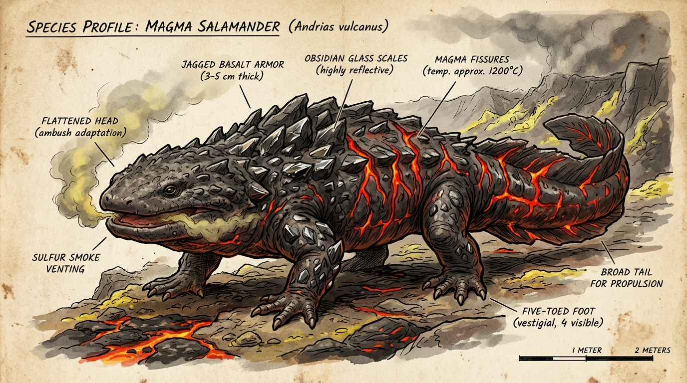
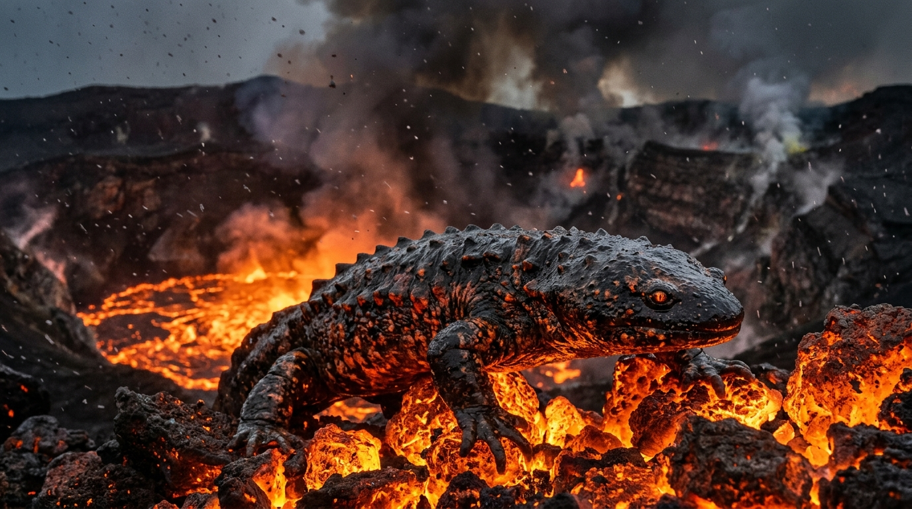

```mermaid
graph TD
    subgraph "火山・マグマ生息域"
        A["【Sector-A】浅間山火口原マグマ湖<br>（摂氏1,200℃・成熟個体の潜伏）"] -->|"採餌・縄張り移動"| B["【Sector-B】鬼押出し溶岩洞群<br>（硫黄噴気孔・産卵床）"]
    end

    subgraph "防衛迎撃ライン"
        B -->|"麓への侵攻移動"| W["【軽井沢北麓・自衛隊迎撃線】<br>液体窒素弾＋高圧冷却放水"]
    end

    subgraph "交戦・熱衝撃破壊力学"
        W -->|"急冷ヒートショック"| H1["【外殻脆化 (DR 12→6)】<br>黒曜石装甲の熱亀裂"]
        H1 -->|"12.7mm M2徹甲弾 (17,000J)"| H2["【生体核・パイロ嚢破壊】<br>行動停止・鎮火"]
    end

    subgraph "第3同心円（解体・流通）"
        H2 -->|"安全搬入"| C["【高崎・前線魔獣解体場】<br>パイロ熱嚢・毒腺の完全切除"]
        C -->|"Class-B合格肉出荷"| M["【都心・豊洲市場・料亭】<br>滋養強壮『極上火椒鍋』"]
    end

    style A fill:#7b1113,stroke:#ff4d4d,stroke-width:2px;
    style B fill:#4a154b,stroke:#e056fd,stroke-width:2px;
    style W fill:#1a365d,stroke:#3182ce,stroke-width:2px;
    style H1 fill:#2b6cb0,stroke:#63b3ed,stroke-width:2px;
    style H2 fill:#742a2a,stroke:#e53e3e,stroke-width:2px;
    style C fill:#22543d,stroke:#38a169,stroke-width:2px;
    style M fill:#1c4532,stroke:#48bb78,stroke-width:2px;
```

# 【溶岩火椒魚】（ヨウガンカショウギョ／*Andrias vulcanus*／Magma Salamander）

---

## 1. 基本分類・メタデータ

| 項目 | 内容 |
| :--- | :--- |
| **和名** | 溶岩火椒魚（ヨウガンカショウギョ）、熔岩山椒魚、火椒（かしょう） |
| **学名** | *Andrias vulcanus* |
| **英名 / 通称** | Magma Salamander / Lava Drake-Salamander, 灼熱蜥蜴（シャクネツトカゲ）, ボルケーノ・サラマンダー |
| **発生起源** | **急速変異種**（原種：オオサンショウウオ *Andrias japonicus*） |
| **資源・食用区分** | **要処理種（Class-B）**（※認可魔獣解体師による「パイロ熱嚢」「硫黄毒腺」の完全除去および耐熱除染必須） |
| **脅威度ランク** | **Threat Level: III（高脅威度 / 自衛隊普通科中隊・消防特科・重火器PMC対応）** |
| **主要生息域** | 関東・信越火山アウトランド第2〜第3区（浅間山火口原、草津白根カルデラ溶岩湖、富士山南麓溶岩洞穴群、伊豆大島三原山火口、九州阿蘇マグマ溜まり） |

```
【図鑑外観標本 / Field Specimen Illustration】
```


```
【野生生態写真 / Field Wildlife Documentary Photo】
浅間山第1火口原の溶岩湖において、摂氏1,100度の玄武岩マグマから這い出し、硫黄鉱物を貪食する成熟個体。黒曜石質の硬質外殻と背部の溶岩亀裂、立ち上る亜硫酸ガスが記録されている。
```


```
【浅間山・草津火山魔境区・溶岩火椒魚（Magma Salamander）生息戦術作戦図 / Volcanic Habitat Tactical Map】

[標高 2,568m: 浅間山火口・高濃度火霊マナ噴出孔] (超高温マグマ溜まり / 未踏査コア)
       │
       ▼
┌─────────────────────────────────────────────────────────────┐
│ 【Sector-A: 浅間山火口原溶岩湖】(第1アウトランド / 標高 2,000-2,500m)       │
│  - 特徴: 摂氏1,000〜1,200℃の溶岩プール、高濃度亜硫酸ガス、玄武岩露頭     │
│  - 生息状況: 成熟個体（単独縄張り主）の潜伏・遊泳域 (Threat Level III)     │
│  - 危険要因: 溶岩内からの急襲突進、広域溶岩ブレス（射程15m）               │
└──────────────────────┬──────────────────────────────────────┘
                       │ [鬼押出し溶岩流回廊・地下熱水脈]
                       ▼
┌─────────────────────────────────────────────────────────────┐
│ 【Sector-B: 鬼押出し・草津外縁溶岩洞穴群】(第2アウトランド / 標高 1,200-1,800m) │
│  - 特徴: 冷却した玄武岩トンネル、硫黄噴気孔、熱水温泉脈                   │
│  - 生息状況: 産卵床、幼体群れ（体長1〜1.5m）の生息回廊                     │
│  - 危険要因: 硫黄ガス滞留、地熱による装備加熱・ヒートストローク            │
└──────────────────────┬──────────────────────────────────────┘
                       │ [国道146号・旧白糸ハイランドウェイ侵攻路 (速度 18km/h)]
                       ▼
═══════════════════════════════════════════════════════════════
【防衛境界線: 軽井沢北麓・自衛隊火山特科監視哨 / 冷却迎撃ライン】
═══════════════════════════════════════════════════════════════
                       │ (液体窒素弾・高圧冷却放水による突破個体迎撃)
                       ▼
┌─────────────────────────────────────────────────────────────┐
│ 【Sector-C: 高崎・前橋前線兵站要塞】(第3同心円 / 関東平野前線基地)          │
│  - 拠点: 陸上自衛隊新町駐屯地、群馬前線魔獣解体センター                   │
│  - 防衛兵装: 12.7mm重機関銃タレット、極低温冷却車輛、耐熱複合装甲車       │
│  - 物流: 認可解体後の「火椒肉」を都心・豊洲新中央市場へ超低温冷蔵空輸     │
└─────────────────────────────────────────────────────────────┘
```



---

## 2. 生物学的特徴・形態

### 2.1 外見・身体構造
- **体長 / 体幅 / 体重**: 体長 3.2m〜4.5m / 頭幅 1.1m〜1.4m / 体重 600kg〜1,200kg（原種の約30〜40倍の超重量化、サイズ修正: **SM +2**）
- **骨格・外皮**: 
  - 頭骨および脊椎は炭化ケイ素および黒曜石質セラミック骨格へと変異し、超高熱と超高圧に耐えうる剛性を獲得。
  - 体表は厚さ 30mm〜50mmの玄武岩質多層装甲鱗で覆われ（**DR 12**）、背部から側線にかけては高温マグマが循環する発光亀裂（深紅〜橙色発光、体表面温度 600〜900℃）が走る。
- **感覚器官・生体特異器官**: 
  - **扁平頭部と超大型顎**: 原種特有の扁平な頭部を維持しつつ、咬合力は 1,800 psi（約 12 MPa）に達し、岩石や装甲板を噛み砕く。
  - **超臨界ガス交換皮膚（珪酸塩多孔質膜）**: 原種の皮膚呼吸が変異し、マグマや高温ガス中の酸素・硫黄化合物を直接生体エネルギーに還元する。
  - **生体燃焼炉（パイロ・オルガン / 熱核嚢）**: 咽頭直下に位置する生体マナ器官。火霊系マナを触媒として、摂取した硫黄・鉱物を超高温（約 1,400℃）の液状マグマスラッジへと変成・蓄積する。
  - **側線熱感センサー**: 濁ったマグマ内でも周囲数キロの獲物の微小な温度差や振動を三次元的に感知。

### 2.2 変異・覚醒の経緯
2000年のミレニアム・アウェイクニング以降、浅間山・草津白根山系の地下熱水脈に生息していたオオサンショウウオの個体群が、噴出した火霊系高濃度マナおよび深部好熱性古細菌群に被曝。冷水棲から超高温マグマ棲へと劇的な適応進化を遂げ、わずか十数世代で体躯の巨大化と黒曜石外殻の形成が定着した。

```
[原種: オオサンショウウオ (体長約1.2m / 体重約20kg / 冷水10〜15℃適応)]
       │
       ▼ (2000年: 火山深部マナ噴出孔・マグマ熱水脈への適応)
[好熱共生菌による代謝変異・珪酸塩ガラス骨格沈着・パイロ熱嚢の形成]
       │
       ▼ (約15世代の淘汰・定着)
[溶岩火椒魚 (Andrias vulcanus: 体長3.2〜4.5m / 600〜1,200kg / SM +2)]
```

---

## 3. 生態・行動パターン

### 3.1 食性・待ち伏せ捕食行動
- **超高温捕食・鉱物代謝**:
  - 主食は溶岩湖に生息する火霊系変異甲殻類、高熱適応齧歯類、および火口付近に迷い込んだ大型魔獣（剛毛巌猪等）。さらに玄武岩、硫黄鉱物、黒曜石を大量に摂食し、外殻とパイロ嚢の燃料とする。
- **溶岩内潜伏・吸引急襲**:
  - 溶岩湖や高温泥流の中に全身を没し、頭頂部と熱感センサーのみを露出して静止。獲物が間合い（10m以内）に入ると、時速 **28.8km/h（BM 8）** で突進し、巨大な口を瞬時に開いて周囲の溶岩ごと獲物を強力に吸引・丸呑みする。

### 3.2 縄張り・社会性
- **単独行動と火口占有**:
  - 成熟個体は極めて強い縄張り意識を持ち、1つのマグマ溜まり・火口原を単独で支配する。繁殖期以外に同種が侵入すると、激しい溶岩ブレスの撃ち合いと体当たりによる縄張り争いが発生する。
- **休眠期（クーリング・ステート）**:
  - 火山の活動が沈静化して地熱が低下すると、溶岩洞穴の奥深くに潜り、外殻を完全に石化させて数ヶ月から数年間の休眠状態に入る。

### 3.3 繁殖・ライフサイクル
- **溶岩洞穴での産卵**:
  - 雌は摂氏500℃以上の溶岩トンネル壁面に、耐火性のゲル状被膜で覆われた数十個の巨大な卵胞（直径約 25cm）を産み付ける。雄は孵化するまでの約3ヶ月間、周囲の溶岩湖を哨戒して外敵から卵を守る。幼体は孵化後約3年で体長2mに達する。

---

## 4. 魔導科学・熱力学考察

### 4.1 ガープス第4版基準能力値（成熟個体）

| 能力値 | 数値 | 詳細・戦闘力学 |
| :--- | :---: | :--- |
| **体力 (ST)** | **32** | 突き 3d+1 / 振り 6d-1（噛み付き 3d+1 imp / 尾の一撃 6d-1 cr） |
| **敏捷力 (DX)** | **10** | 陸上反応速度は標準的だが、溶岩内では俊敏 |
| **知力 (IQ)** | **4** | 獣的本能・待ち伏せ戦術に特化 |
| **生命力 (HT)** | **13** | 高温耐性・即死抵抗 HT 13（気絶・毒判定に強靭） |
| **HP / FP** | **38 / 14** | 肉体耐久限界 HP 38、生体マナ活力 FP 14 |
| **基本速度 / 移動力** | **5.75 / 5** | 陸上移動 BM 5（18 km/h） / 溶岩内遊泳 BM 8（28.8 km/h） |
| **サイズ修正 (SM)** | **SM +2** | 最長体長 3.8m、命中修正 +2 |
| **防護点 (DR)** | **DR 12** | 玄武岩・黒曜石外殻（通常物理 DR 12 / 耐火災・熱 DR 40） |

### 4.2 火霊系生体励起とブレス射出機構
- **生体励起呪文**:
  - パイロ熱嚢内の生体触媒により、火霊系呪文《熱耐性（常時）》《火炎噴射》《火球》に相当する現象を不随意に行使。
- **溶岩・硫黄ブレス（Magma Jet）**:
  - 射程 **15m**、致傷力 **`4d burn + 2d cor [AD(2)]`**（装甲貫通除数(2)、毎秒1回、連続3射まで）。
  - 直撃した対象は超高温火災（毎秒 1d burn 延焼）および強酸性硫黄スラッジによる腐食（DR侵食）を受ける。
- **熱歪みと赤外線特性**:
  - 体表面から常時放散される熱波（600〜900℃）により、周囲の空気が激しく陽炎（熱歪み）を起こし、光学照準に **-2のペナルティ** を与える。サーマル暗視スコープでは画面全体が白飛び（サチュレーション）を起こすため、熱遮断フィルターが必須。

---

## 5. 交戦マニュアル・防衛対策

### 5.1 有効な現代兵器・戦術（自衛隊・消防特科向け）

| 兵装・口径 | 有効性 | 弾道力学 / ダメージ評価 | 戦術的運用 |
| :--- | :---: | :--- | :--- |
| **5.56×45mm NATO小銃弾** | **× 完全無効** | 5d pi (平均 17.5) vs DR 12 (実効 5.5) | 外殻で跳弾し、体表の高熱で弾頭が瞬時に変形・融解。 |
| **7.62×51mm NATO徹甲弾** | **△ 軽微な打撃** | 7d(2) pi (平均 24.5) vs DR 6 (実効 18.5) | 外殻を部分貫通するが、HP 38の巨体には致命傷とならない。 |
| **12.7×99mm M2重機関銃 (AP)** | **◯ 極めて有効** | 13d+1(2) pi+ (平均 46.5 / 約17,000J) | 防護点DR 12を完全に貫通し、深部生体組織を破壊。 |
| **極低温冷却弾（液体窒素砲）** | **◎ 戦術的特効** | **急冷ヒートショック（DR 12 → 6に半減）** | 外殻に急激な熱収縮亀裂を発生させ、移動力 BM 5 → 2 へ低下。 |
| **対戦車誘導弾（高熱/成形炸薬）** | **◎ 一撃撃破** | 10d×2(10) cr exp | 成形炸薬ジェットにより頭部中枢およびパイロ嚢を完全粉砕。 |

### 5.2 弱点・対処プロトコル
- **ヒートショック（熱衝撃）戦術**:
  - 消防特科車輛による「極低温消火フォーム」または「高圧冷水散水（毎分1,000L以上）」を浴びせることで、摂氏800℃の外殻を強制急冷する。外殻の黒曜石が爆砕亀裂を起こして **防護点が DR 12 から DR 6 に半減** し、重機関銃による掃射で容易に撃破可能となる。
- **下腹部軟部組織（鎧の隙間）**:
  - 腹面の中央部は溶岩接触面であるため装甲が薄く（**DR 4**）、下方向からの徹甲弾射撃や対戦車地雷が極めて有効。

---

## 6. 解体・食利用・素材採取

### 6.1 食用利用と調理法（Class-B 要処理種）
- **可食部位と肉質**:
  - パイロ熱嚢と消化器官を除去した背肉、尾部筋肉、四肢の付け根。
  - 肉質は白身で、鶏肉とスッポンの中間のような極めて弾力ある食感。筋繊維の間に蓄積された生体耐熱コラーゲンが、加熱によってとろけるようなゼラチン質に変化する。
- **下処理・解体プロトコル（国家免許必須）**:
  1. **パイロ熱嚢の完全切除**: 咽頭直下の熱核嚢（内容物温度 800℃超）を耐熱グラブと超音波メスで慎重に摘出・隔離。破裂時は猛烈な硫黄ガスと高熱液体が噴出するため、防護スーツ必須。
  2. **硫黄・重金属除染**: 筋肉組織を冷却流水および重曹・クエン酸塩溶液で24時間晒し、硫黄臭と重金属を完全除去。
- **風味・料理「極上火椒鍋（かしょうなべ）」**:
  - 湯引きした火椒肉を、昆布出汁、長葱、山椒、味噌仕立ての土鍋で煮込む。天然の山椒のような爽やかな辛味と濃厚な旨味があり、極度の冷え性改善やマナ疲労回復に絶大な効能を持つとされる（1人前 30,000〜50,000円の超高級ジビエ料理）。

### 6.2 素材採取と工業・軍事利用

| 採取素材 | 回収部位 | 主な用途・産業的価値 |
| :--- | :--- | :--- |
| **玄武黒曜装甲板**<br>*(Basalt-Obsidian Scute)* | 背部・側面の硬質外殻 | **ヤマト重工製 耐熱防護プレート・消防特科装甲材**。<br>摂氏1,500℃の直火や火災旋風に耐える耐火服・装甲車両の増加装甲として高額買取。 |
| **パイロ熱核嚢（未破裂）**<br>*(Pyro-Organ Core)* | 咽頭部の生体熱反応器官 | **テイコク製薬・生体マナ触媒**。<br>熱霊系魔導リアクターの熱源コアや、強力な発火薬の生体原料（1基あたり 300万〜500万円）。 |
| **耐熱分泌脂（サラマンダー・オイル）** | 皮下脂肪層 | **超高温用工業潤滑油・火傷治療軟膏**。<br>航空機タービンや高熱魔導機関の特殊オイルとして精製利用。 |

---

## 7. 現場記録・調査員ログ

> *「浅間山の赤く煮えたぎる火口原で、あの巨躯が溶岩からヌッと頭をもたげた時の絶望感は忘れられない。こちらの5.56mm弾は奴の背中でパチパチと火花を散らして溶け落ちた。だが、応援要請で駆けつけた自衛隊の極低温冷却放水車が液体窒素を浴びせかけた瞬間、奴の黒曜石の鎧がパキパキと音を立てて砕け散ったんだ。そこに撃ち込まれた12.7ミリ重機関銃の連射音——あれこそが、現代の科学が魔境を穿つ音だった」*  
> —— **陸上自衛隊 第12旅団 火山特科派遣隊 陸曹長 柴田 剛**（2026年 浅間山第3次魔境調査記録より）
