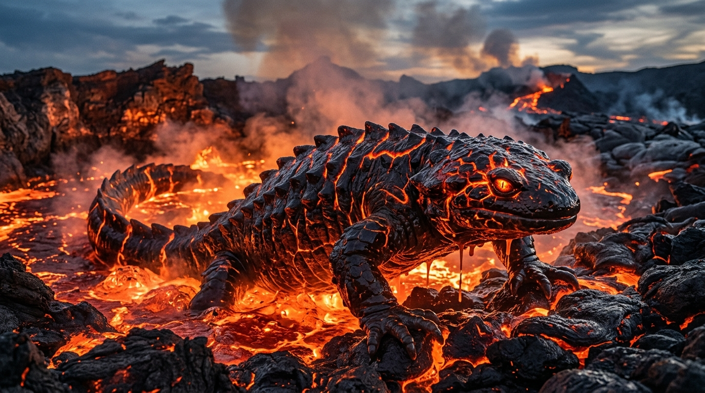
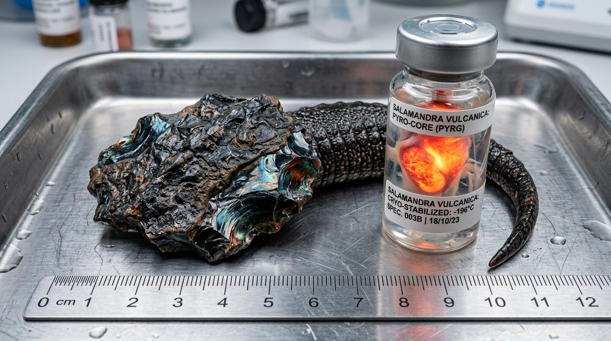
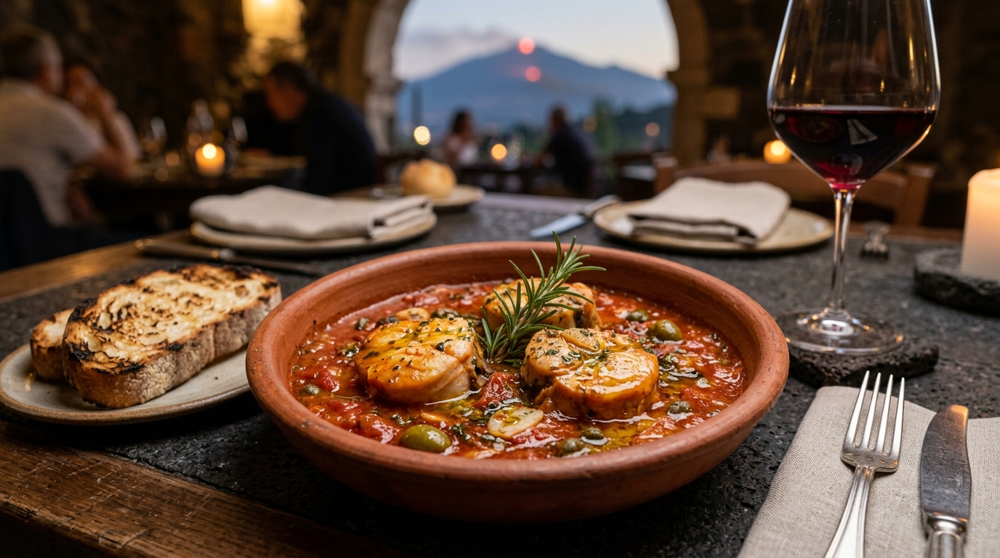
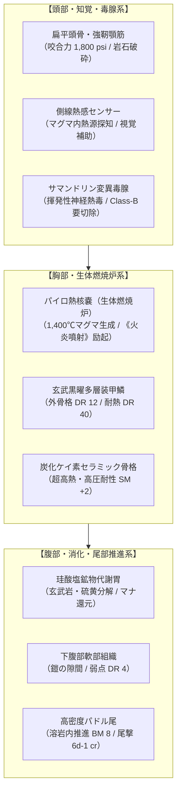
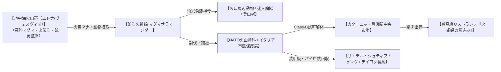

# 【溶岩火蜥蜴（マグマサラマンダー / ヨウガンヒトカゲ）】（Magma Salamander / *Salamandra vulcanica* / 灼熱火蜥蜴、エトナ・サラマンダー、熔岩火椒魚）

---

## 1. 基本分類・メタデータ

| 項目 | 内容 |
| :--- | :--- |
| **和名** | 溶岩火蜥蜴（ヨウガンヒトカゲ / マグマサラマンダー）、熔岩山椒魚、熔岩火椒魚（カショウギョ） |
| **英名 / 通称** | Magma Salamander / Lava Drake-Salamander, 灼熱火蜥蜴, エトナ・サラマンダー, ボルケーノ・サラマンダー |
| **学名** | *Salamandra vulcanica* |
| **学名語源** | *Salamandra*（古代ギリシャ語: サラマンダー、火蜥蜴）＋ *vulcanica*（ラテン語: 火山の神ウルカヌスの、火山性の） |
| **生物学的分類** | **門**: 脊索動物門 (Chordata)<br>**綱**: 両生綱 (Amphibia)<br>**目**: 有尾目 (Caudata)<br>**科**: サラマンダー科 (Salamandridae)<br>**属**: サラマンダー属 (*Salamandra*)<br>**種**: 溶岩火蜥蜴種 (*S. vulcanica*) |
| **発生起源** | **急速変異種**（2000年のマナ覚醒により、南欧・地中海火山帯に生息するファイアサラマンダー *Salamandra salamandra* が火霊マナと好熱菌に適応し劇的巨大化） |
| **資源・食用区分** | **要処理種（Class-B）**（※認可魔獣解体師による「パイロ熱核嚢」「サマンドリン変異毒腺」の完全切除および耐熱除染必須） |
| **脅威度ランク** | **Threat Level: III（高脅威度 / 自衛隊・NATO小隊迎撃級・消防特科・重火器PMC対応）** |
| **主要生息域** | **南欧・地中海・中欧火山魔境区**（イタリア・シチリア島エトナ火山、カンパーニア州ヴェスヴィオ火山・カンピ・フレグレイ、アイスランド地熱火山帯、ギリシャ・サントリーニ島カルデラ） |

### 視覚資料アーカイブ（Visual Archive）

| 生態観測写真（シチリア・エトナ山火口原） | 採取標本・組織マクロ写真 | 伝統ジビエ料理写真（シチリア名物） |
| :---: | :---: | :---: |
|  |  |  |
| *イタリア・シチリア島エトナ山火口原の溶岩湖から這い出る成熟個体（体長3.5m）。摂氏1,100度の玄武岩マグマと黒曜石装甲のコントラストが捉えられている（2025年欧州魔境調査隊撮影）。* | *八王子・欧州合同魔導生体研究所 提供標本（SLM-04）。厚さ45mmの玄武黒曜装甲板と、極低温安定容器に保管された発光パイロ熱核嚢（未破裂生体コア）。* | *シチリア州カターニャの老舗リストランテで提供される認可ジビエスペシャリテ『シチリア風・火蜥蜴と火山トマトの香草煮込み（Stufato di Salamandra alla Siciliana）』。* |

---

## 2. 伝承考証とマナ覚醒の架橋（Lore & Historical Bridge）

### 2.1 原典・民俗伝承の記録
- **古代地中海・ローマ博物誌の記録**: 
  - 古代ギリシャのアリストテレス『動物誌』およびローマの大プリニウス『博物誌（Naturalis Historia）』第10巻・第29巻において、「サラマンダーは極めて冷酷な体質を持ち、燃え盛る炎の中に入っても火を消して無傷で生き延びる」「その分泌液は猛毒であり、触れた木の実を食べた者は絶命する」と記録された。
- **ルネサンス・錬金術と四大元素霊**:
  - 16世紀の医師・錬金術師パラケルススは『妖精の書（Liber de Nymphis, sylphis, pygmaeis et salamandris）』において、サラマンダーを火を司る「火の元素霊（Vulcanici / Salamandrae）」と定義した。中世錬金術では「自らの尾を噛むウロボロス」や「火中で不滅の生命を得る賢者の石の触媒」の象徴とされた。
- **アスベスト（石綿）とサラマンダーの皮膜**:
  - 中世ヨーロッパおよび東方見聞録において、火に投じても燃えない耐火鉱物布が「火蜥蜴の毛皮（Salamander Cloth）」と称されて王侯貴族の間で珍重された。

### 2.2 2000年マナ覚醒による生体科学的架橋
- 西暦2000年1月1日の「ミレニアム・アウェイクニング」に伴い、地中海プレート境界に位置するシチリア島エトナ火山、ヴェスヴィオ火山、アイスランド火山帯の深部マグマ溜まりから、莫大な火霊系高濃度マナが地表へ噴出した。
- 当該山麓の森林・溶岩洞穴に生息していた欧州ファイアサラマンダー（*Salamandra salamandra*）が、地下熱水脈を通じて火霊マナおよび好熱性古細菌群に被曝。
- 原種が持っていた「湿潤皮膚による呼吸」「サマンドリン神経毒の分泌」という生体基盤が、マナ触媒によって劇的に再構成され、わずか十数世代（2000〜2015年）で**「珪酸塩・黒曜石セラミック外骨格の沈着」「生体燃焼炉（パイロ熱核嚢）による高熱マグマ代謝」**を獲得。古代伝承で語られた「火を恐れずマグマの中を泳ぐ火蜥蜴」が現代の魔導生体力学として完全実体化した。

---

## 3. 生物学的特徴・ライフステージ

### 3.1 外見・身体構造
- **体長 / 頭幅 / 体重**: 全長 2.8m〜3.8m / 頭幅 0.9m〜1.3m / 体重 450kg〜900kg（原種の約15〜20倍に巨大化、サイズ修正: **SM +2**）。
- **骨格・外皮（DR 12）**: 
  - 頭骨および脊椎骨は炭化ケイ素および黒曜石質セラミック骨格へと変異。
  - 体表は厚さ 30mm〜50mmの玄武岩質多層装甲鱗で覆われており（**通常物理 DR 12 / 耐火災・熱 DR 40**）、背部正中線から側線にかけては高温マグマが循環する発光亀裂（体表面温度 600〜900℃）が走る。
- **感覚器官・特異マナ器官**: 
  - **扁平頭部と超大型顎**: 咬合力は 1,800 psi（約 12.4 MPa）に達し、玄武岩の岩塊や装甲車輛の鋼板を噛み砕く。
  - **生体燃焼炉（パイロ・オルガン / 熱核嚢）**: 咽頭直下に位置する生体熱反応器官。火霊系マナを触媒とし、摂取した硫黄・玄武岩を超高温（約 1,400℃）の液状マグマスラッジへと変成・蓄積する。
  - **サマンドリン変異毒腺（*Glandula Samandarica*）**: 耳後部および側背部に位置する毒腺。原種のステロイドアルカロイド毒が高熱マナと重合し、気化すると呼吸器粘膜を破壊する「揮発性サマンドリン熱毒」を分泌。
  - **側線熱感センサー**: マグマ内でも周囲数キロの獲物の微小な温度差・圧力振動を三次元探知。



### 3.2 ライフステージと個体変異
1. **幼体・若齢期（Juvenile / 孵化後0〜3年）**:
   - 体長 0.8m〜1.5m、体重 40kg〜120kg。外殻はまだ薄い玄武岩質（DR 6）。溶岩湖深部よりも冷却した溶岩洞穴の熱水脈周辺に生息し、小型熱水甲殻類を捕食（Threat Level: I〜II）。
2. **成熟成体（Adult / 3〜30年）**:
   - 体長 2.8m〜3.8m、体重 450kg〜900kg。黒曜石装甲（DR 12）が完成し、パイロ熱核嚢によるマグマブレス射出能を獲得。火口原の溶岩湖を単独占有（Threat Level: III）。
3. **エトナ古生主級（Elder Alpha / 樹齢・活動20年以上 / エトナ深部個体）**:
   - 体長 4.5m〜5.2m、体重 1,500kg超（**SM +3**）。体表の黒曜石装甲は厚さ80mmに達し（**DR 16**）、体表面温度は1,000℃を超える。2000年の覚醒最初期からエトナ山火口深部に君臨する主級個体（Threat Level: IV / NATO特科中隊対応）。

---

## 4. 生態・食物連鎖・相互作用

### 4.1 食性・捕食行動
- **超高温鉱物代謝と捕食**:
  - 主食は溶岩湖に生息する好熱性変異甲殻類、高熱適応生物、および火口付近に迷い込んだ大型哺乳類・魔獣。さらに玄武岩、硫黄鉱物、黒曜石を大量に摂食し、外殻の補強およびパイロ熱核嚢の燃料とする。
- **溶岩内潜伏・吸引急襲**:
  - 摂氏1,100℃の溶岩湖や高温泥流の中に全身を潜伏させ、獲物が間合い（10m以内）に入ると、時速 **28.8km/h（BM 8）** で突進。巨大な口を瞬時に開いて周囲の溶岩ごと獲物を強力吸引・丸呑みする。



### 4.2 魔獣間クロス・リレーション（相互作用）
- **陽炎巨鬣獅（パイロ・プライド・ライオン）との住み分け**: 欧州・中東火山外縁部において、活動領域が隣接するが、マグマサラマンダーが「超高温溶岩湖・火口深部」を占有するのに対し、ライオンは「火口原乾燥地帯」を縄張りとするため直接衝突は稀である。
- **剛毛巌猪（クラッグ・ボア）との捕食関係**: 水分や塩分を求めて火口付近の硫黄泉に迷い込んだ剛毛巌猪の幼体・若齢個体を溶岩内から急襲・捕食する。ただし成体ボアの厚いシリカ剛毛は消化に長時間を要する。

### 4.3 縄張り・社会性・繁殖
- **単独行動と火口占有**: 成熟個体は極めて強い縄張り意識を持ち、1つの火口原・溶岩プールを単独で支配する。同種の侵入に対しては猛烈な溶岩ブレスの撃ち合いと体当たりで排除する。
- **繁殖・溶岩洞産卵**: 雌は摂氏500℃以上の溶岩トンネル壁面に、耐火性ゲル状被膜で覆われた数十個の卵胞（直径約 25cm）を産み付ける。雄は約3ヶ月間、周囲の溶岩湖を哨戒して卵を保護する。寿命は30〜50年。

---

## 5. 魔導科学・上位神性・背景ロア

### 5.1 魔力現象と発現メカニズム
- **火霊系生体内触媒（《火炎噴射》《熱耐性》）**:
  - パイロ熱核嚢内の生体触媒作用により、ガープスマジックにおける**火霊系呪文《熱耐性（常時）》《火炎噴射》《火球》** に相当する現象を不随意に励起。
- **溶岩・硫黄ブレス（Magma Jet）**:
  - 射程 **15m**、致傷力 **`4d burn + 2d cor [AD(2)]`**（装甲貫通除数(2)、毎秒1回、連続3射まで）。直撃した対象は超高温火災（毎秒 1d burn 延焼）および強酸性硫黄スラッジによる装甲腐食を受ける。
- **熱歪みと赤外線サチュレーション**:
  - 体表面から常時放散される熱波（600〜900℃）により、周囲の空気が激しい陽炎（蜃気楼現象）を起こし、光学照準に **-2のペナルティ** を与える。サーマル暗視装置では画面全体が白飛び（サチュレーション）するため、熱遮断フィルターが必須。

### 5.2 音響・周波数・生体通信特性（Acoustic & Resonance Analysis）
- **マグマ流動超低周波うなり**: `12Hz〜24Hz`（溶岩湖深部で共鳴する超低周波インフラサウンド、音圧 `85dB〜95dB`。人間には「地面が震えるような重圧感」として感知）。
- **高熱噴気音（スチーム・ベント）**: `3kHz〜8kHz`（背部のマグマ亀裂から噴出する亜硫酸蒸気のシューという高圧噴気音）。
- **破裂威嚇クリック音**: `450Hz〜1.2kHz`（咽頭のパイロ嚢を急速収縮させた際の重低音破裂音）。

### 5.3 上位存在・アビス因果・メガコーポ伏線
- **アストラル原型（火の精霊王ジン / イフリート）**: 高位の術士や儀式学派の分析によると、本種は上位アストラル界の「火の精霊王（イフリート・ジン）」の熱マナ波長と強く同調しており、火口深部での儀式により使役・使徒化された記録が存在する。
- **メガコーポの極秘研究（サエデル・シュティフトゥング & テイコク製薬）**:
  - 欧州最大メガコーポ「サエデル・シュティフトゥング」は、エトナ山のマグマサラマンダーから採取した黒曜石外殻を基に、航空宇宙用耐熱シールド「ドラコ・サーマル装甲」を量産。
  - 「テイコク製薬欧州研究所（フランクフルト）」は、サマンドリン変異毒から麻薬性鎮痛薬および不可逆的神経遮断薬「パイロ・モルヒネ」を極秘裏に合成している。

---

## 6. 交戦マニュアル・都市防災コラム

### 6.1 GURPS 4th Stat Block（戦闘データ）

#### 【通常成体（Standard Adult）】
- **能力値**: ST 32, DX 10, IQ 4, HT 13
- **副能力値**: HP 38, FP 14, 基本速度 5.75, 移動力 5 (陸上 BM 5: 18km/h / 溶岩内 BM 8: 28.8km/h) (SM +2 / 体重 650kg)
- **能動防御**: よけ 8
- **防護点（DR）**: 胴体・背面 DR 12（耐熱 DR 40）、下腹部 DR 4
- **近接攻撃**:
  - 噛み付き: `3d+1 imp`（咬合力 1,800 psi）
  - 尾の一撃: `6d-1 cr`（リーチ 1〜2m）
- **生体射撃異能**:
  - 《溶岩ブレス (Magma Jet)》: 技能 12, 射程 15m, ダメージ `4d burn + 2d cor [AD(2)]`（装甲除数(2)、毎秒1射、連続3射可能）
- **生体異能・特異性質**:
  - 《不随意・熱耐性》常時発動（摂氏1,500℃まで無効）
  - 《陽炎・熱歪み》光学射撃 -2ペナルティ
  - 《急冷脆弱性（ヒートショック）》: 液体窒素または大容量冷水を受けると外殻が爆砕し、**DR 12 → DR 6 に半減**、移動力 BM 5 → 2 に低下。

#### 【エトナ古生主級（Elder Alpha）】
- **能力値**: ST 48, DX 11, IQ 5, HT 15
- **副能力値**: HP 65, FP 20, 基本速度 6.5, 移動力 6 (溶岩内 BM 10) (SM +3 / 体重 1,600kg)
- **能動防御**: よけ 9
- **防護点（DR）**: 胴体・背面 DR 16（耐熱 DR 60）、下腹部 DR 6
- **生体射撃異能**: 《大溶岩ブレス》: 技能 14, 射程 25m, ダメージ `6d burn + 3d cor [AD(2)]`

### 6.2 推奨火器・防護装備

| 兵装・口径 | 有効性 | 弾道力学 / ダメージ評価 | 戦術的運用 |
| :--- | :---: | :--- | :--- |
| **5.56×45mm NATO小銃弾** | **× 完全無効** | 5d pi (平均 17.5) vs DR 12 | 外殻で弾かれ、体表の高熱で弾頭が瞬時に融解。 |
| **7.62×51mm NATO徹甲弾** | **△ 軽微な打撃** | 7d(2) pi (平均 24.5) vs DR 6 | 部分貫通するが、HP 38の巨体には致命傷とならない。 |
| **12.7×99mm M2重機関銃 (AP)** | **◯ 極めて有効** | 13d+1(2) pi+ (平均 46.5 / 約17,000J) | 防護点 DR 12を完全貫通し、深部生体組織・パイロ核を破壊。 |
| **極低温液体窒素砲（Cryo-Cannon）** | **◎ 戦術的特効** | **急冷ヒートショック（DR 12 → 6に半減）** | 外殻に熱収縮破壊を誘発し、小火器・重機関銃の貫通を容易にする。 |
| **BGM-71 TOW対戦車ミサイル** | **◎ 一撃粉砕** | 10d×2(10) cr exp | 成形炸薬ジェットにより頭部中枢およびパイロ核を完全消滅。 |

### 6.3 市民防災メモ ＆ 専門家の知恵袋

> [!IMPORTANT]
> **【イタリア市民保護局（Protezione Civile）防災メモ：エトナ火口原避難指針】**
> - 火山警戒レベル「Level-Orange」以上発令時は、火口から半径5km以内の登山道・溶岩洞窟への立ち入りは厳禁です。
> - 溶岩火蜥蜴の接近を知らせる前兆（急激な硫黄臭の増加、陽炎による視界歪み、地表温度の急上昇）を察知した場合、風上かつ高台（冷却した溶岩棚）へ直ちに退避してください。
> - 一般車両のラジエーター冷却水や携帯水筒の水を浴びせかける行為は厳禁です（蒸気爆発を引き起こし、逆上した個体のブレスを誘発します）。  
> —— *イタリア市民保護局（Protezione Civile Sicilia）防災ハンドブック 2026年版*

> [!TIP]
> **【現場専門家・NATO火山特科ベテランの知恵袋】**
> *「奴らに出会ったら小銃を乱射するな。弾頭が溶けて無駄玉になるだけだ。まず消防特科の極低温散水車で液体窒素を浴びせろ。摂氏800度の黒曜石にマイナス196度をぶち込めば、ガラスのコップに熱湯を注いだ時のように鎧がパキパキと音を立てて砕け散る（DRが半分に落ちる）。そこへ12.7ミリ重機関銃の徹甲弾を叩き込めば、5秒で鎮火完了だ」*  
> —— **NATO欧州連合軍第14火山即応連隊 上級曹長 マルコ・ロッシ**

---

## 7. 解体・ジビエ食文化・料理レシピ

### 7.1 解体プロトコルと市場相場（Class-B 要処理種）
- **必須下処理・除染プロトコル（国家有資格者限定）**:
  1. **パイロ熱核嚢の摘出・極低温隔離**: 咽頭直下の熱核嚢（内部温度 800℃超）を超音波メスと耐熱グラブで慎重に摘出。破裂時は猛烈な亜硫酸ガスと超高熱スラッジが噴出するため、危険物処理班立会いの下で液体窒素コンテナへ封入する。
  2. **サマンドリン変異毒腺の完全切除**: 耳後部および側背部の毒腺を周囲20mmのマージンを取って切除・焼却。
  3. **重金属・硫黄中和除染**: 尾部および背肉を冷却流水および重曹・アスコルビン酸塩溶液に24時間晒し、硫黄臭と生体重金属を完全除去する。
- **市場取引相場**:
  - 精肉（尾部・ロース）: 豊洲新中央市場 / カターニャ中央魔獣市場にて **1kgあたり 45,000〜60,000円（€300〜€400）** の超高値。

### 7.2 伝統料理・メガコーポスペシャリテ（本格レシピ）

```
【料理名】シチリア風・火蜥蜴と火山トマトの香草煮込み（Stufato di Salamandra alla Siciliana）
- 分類: 南欧認可ジビエ・リストランテ伝統料理（Class-B認可店限定）
- 主材料:
  - 溶岩火蜥蜴 尾部ロース肉（除染・湯引き済み）: 400g（輪切りメダリオン）
  - サンマルツァーノ産 火山灰土壌トマト（水煮）: 1缶（400g）
  - シチリア産グリーンオリーブ（塩抜き）: 10粒
  - パンテレリア島産ケッパー（塩抜き）: 大さじ1
  - ニンニク（薄切り）: 2片 / トウガラシ（ペペロンチーノ）: 1本
  - エトナ・ロッソ赤ワイン: 100ml
  - 新鮮なローズマリー、野生オレガノ、EVオリーブオイル、海塩、黒胡椒: 各適量
- 調理手順:
  1. 【下味と焼き付け】: 輪切りにした火蜥蜴肉に海塩と黒胡椒を擦り込む。テラコッタ鍋にオリーブオイルとニンニク、トウガラシを熱し、強火で火蜥蜴肉の両面に香ばしい焼き色をつける。
  2. 【赤ワインフランベ】: エトナ・ロッソを注ぎ、強火でアルコールを飛ばしながら肉の旨味を凝縮させる。
  3. 【トマトと香草の煮込み】: トマトを手で潰しながら加え、オリーブ、ケッパー、オレガノを投入。蓋をして弱火で約45分間じっくり煮込む。
  4. 【仕上げ】: 肉がフォークで崩れるほど柔らかくなったら、仕上げに良質なオリーブオイルを一回しし、ローズマリーの小枝を添える。
- テイスティングノート:
  肉質はスッポンとアンコウの中間のような極めて弾力ある極上の白身。噛み締めるごとに高密度の耐熱コラーゲンが口中でとろけ、トマトの鮮烈な酸味とハーブの香りが濃厚な旨味を引き立てる。摂取後、体幹から心地よい温熱マナが全身へ広がり、極度の疲労回復と冷え性改善に絶大な効能をもたらす。
```

### 7.3 産業素材・先端医療利用

| 採取素材 | 回収部位 | 主な用途・産業的価値 |
| :--- | :--- | :--- |
| **玄武黒曜装甲板**<br>*(Basalt-Obsidian Scute)* | 背部・側面の硬質外殻 | **サエデル・シュティフトゥング製 耐熱防護プレート・宇宙往還機耐熱シールド**。<br>摂氏1,500℃の直火や火災旋風に耐える耐火服・装甲車両の増加装甲として高額取引。 |
| **パイロ熱核嚢（未破裂生体コア）**<br>*(Pyro-Core Gland)* | 咽頭部の生体熱反応器官 | **テイコク製薬・生体マナ触媒**。<br>熱霊系魔導リアクターの小型熱源コアや、強力な発火薬の生体触媒（1基あたり €25,000〜€40,000 / 約400万〜650万円）。 |
| **精製サラマンダー・オイル**<br>*(Refined Salamander Oil)* | 皮下脂肪層 | **超高温用航空タービン潤滑油・重度火傷再生軟膏**。<br>摩擦係数0.01以下の極限潤滑油および皮膚細胞再生バイオマテリアル。 |

---

## 8. 現場記録・通信ログ

```
【エトナ山火口監視哨 J-ALERT警報ログ】
発信: イタリア市民保護局 シチリア火山警戒センター
受信: NATO欧州連合軍 第14火山即応連隊 / カターニャ警察PMC
日時: 2026年5月14日 03:42 CEST
対象区域: シチリア州 エトナ山南東火口原（標高2,900m地点）

[03:42:10] 《警告》エトナ南東溶岩湖において熱源異常反応を感知。
[03:42:25] 赤外線サチュレーション確認。体長約3.5mの成熟マグマサラマンダー1個体（SLM-04）が溶岩から浮上。
[03:42:40] 当該個体は鬼押出し状溶岩洞を通過し、観光道路SP92号線方向へ移動中。
[03:43:00] 火山特科第2小隊、極低温散水車輛2基および12.7mm重機関銃タレットを展開せよ。近隣住民は直ちに屋内退避を実施のこと。
```

> *「エトナ山の赤く煮えたぎる火口原で、あの巨躯が溶岩からヌッと頭をもたげた時の威圧感は今でも夢に見る。こちらの小銃弾は奴の背中でパチパチと火花を散らして弾かれ、熱で赤熱して溶け落ちた。だが、応援要請で駆けつけたNATO特科の極低温放水車がマイナス196度の液体窒素を浴びせかけた瞬間、奴の黒曜石の鎧がパキパキと音を立てて砕け散ったんだ。そこに撃ち込まれた12.7ミリ重機関銃の連射音——あれこそが、現代の科学が魔境を穿つ音だった」*  
> —— **NATO欧州連合軍 第14火山即応連隊 上級曹長 マルコ・ロッシ**（2026年 シチリア・エトナ魔境調査記録より）

---

## 9. 参考文献・典拠資料（References）

1. **古典博物誌・伝承文献**:
   - アリストテレス（前4世紀）『動物誌（Historia Animalium）』第5巻.
   - ガイウス・プリニウス・セクンドゥス（77年）『博物誌（Naturalis Historia）』第10巻（鳥類・爬虫類）, 第29巻（医薬）.
   - パラケルスス（1566年）『妖精の書（Liber de Nymphis, sylphis, pygmaeis et salamandris, et de caeteris spiritibus）』.
2. **生物学・解剖学・毒素学資料**:
   - Thorn, R. (1968). *Les Salamandres d'Europe, d'Asie et d'Afrique du Nord*. Éditions Paul Lechevalier.
   - Habermehl, G. (1975). "Die biologische Bedeutung der Amphibiengifte (Samandarin)". *Naturwissenschaften*, 62(7), 310-316.
3. **軍事・火山地質・法規資料**:
   - イタリア市民保護局（Dipartimento della Protezione Civile）（2024）『エトナ・ヴェスヴィオ火山魔獣災害対処マニュアル』.
   - サエデル・シュティフトゥング（Saeder-Krupp / Saeder-Stiftung）（2025）『ドラコ・サーマル複合装甲板物性試験報告書（ST-882）』.
   - 欧州連合魔獣衛生管理機構（EUMHO）（2023）『Class-B有尾目魔獣の特定危険部位（パイロ核・毒腺）除去基準指令』.
