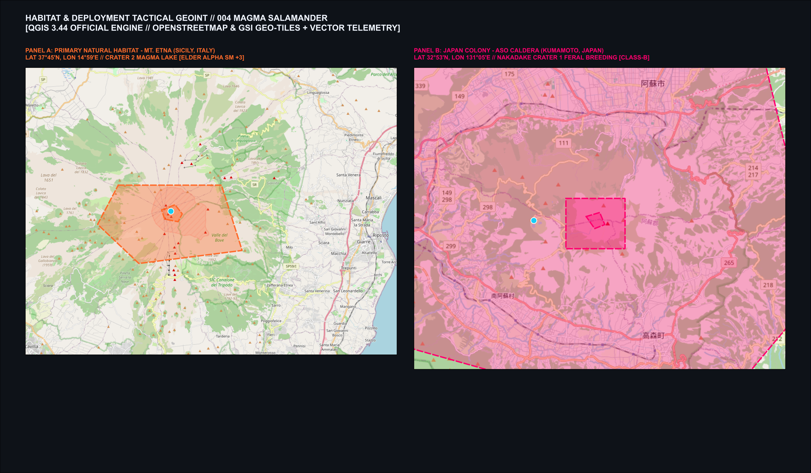
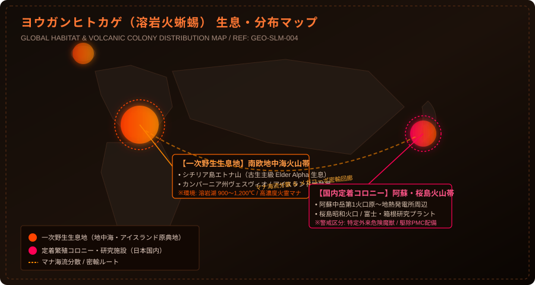
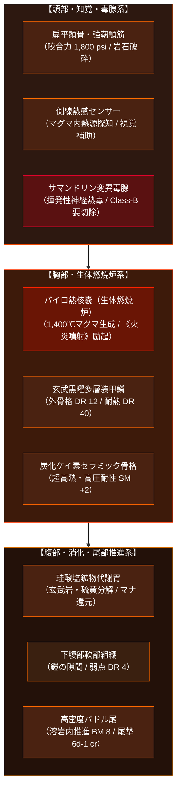
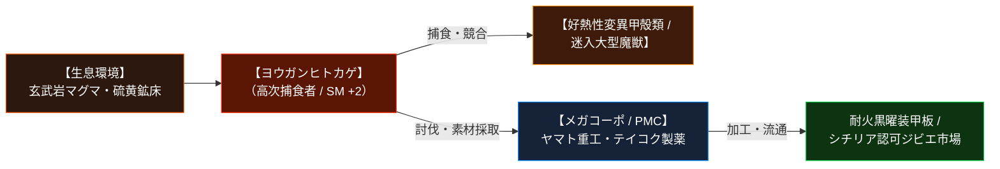

# 【ヨウガンヒトカゲ［溶岩火蜥蜴］】（Magma Salamander / *Salamandra vulcanica* / マグマサラマンダー、灼熱火蜥蜴、エトナ・サラマンダー、熔岩火椒魚）

---

## 1. 基本分類・早わかり（Basic Classification & Fast Facts）

| 項目 | 内容 |
| :--- | :--- |
| **和名** | **ヨウガンヒトカゲ［溶岩火蜥蜴］**（旧称・通称：マグマサラマンダー、熔岩山椒魚、熔岩火椒魚） |
| **和名命名規約** | **【環境・形態型】**<br>※命名根拠: 摂氏1,100度の玄武岩溶岩湖に生息し、玄武黒曜装甲と火霊マナ代謝を持つ有尾両生類である生態環境・形態的特徴に基づく。 |
| **英名 / 通称** | Magma Salamander / Lava Drake-Salamander, 灼熱火蜥蜴, エトナ・サラマンダー, ボルケーノ・サラマンダー |
| **学名** | *Salamandra vulcanica* |
| **学名語源** | *Salamandra*（古代ギリシャ語: サラマンダー、火蜥蜴）＋ *vulcanica*（ラテン語: 火山の神ウルカヌスの、火山性の） |
| **生物学的分類** | **門**: 脊索動物門 (Chordata)<br>**綱**: 両生綱 (Amphibia)<br>**目**: 有尾目 (Caudata)<br>**科**: サラマンダー科 (Salamandridae)<br>**属**: サラマンダー属 (*Salamandra*)<br>**種**: 溶岩火蜥蜴 (*S. vulcanica*) |
| **発生起源** | **急速変異種**（2000年のミレニアム・アウェイクニングに伴い、南欧・地中海火山帯に生息するファイアサラマンダー *Salamandra salamandra* が火霊マナと好熱菌に適応し劇的巨大化）[^zext_1] |
| **資源・管理区分** | **要処理種（Class-B / 要免許ジビエ）**<br>※管理ステータス: 国際危険外来生物指定種 / 国内阿蘇・桜島火山帯駆除対象害獣 / 特定素材認可採取種[^takatsukasa_1] |
| **食性** | **超高温鉱物代謝 兼 肉食性**（主食：玄武岩、硫黄鉱物、黒曜石、溶岩湖の好熱性変異甲殻類、火口原迷入大型魔獣・哺乳類） |
| **寿命** | 野生下 25〜35年 / 飼育・管理隔離下 40年以上（主級個体は覚醒後26年間活動継続中） |
| **サイズ・重量** | 全長 2.8m〜3.8m / 頭幅 0.9m〜1.3m / 体重 450kg〜900kg（サイズ修正: **SM +2**） |
| **直感的サイズ比較** | **【路線バス（10m）の約3分の1、軽トラック・小型装甲車に匹敵する質量】**<br>※成人男性（180cm）が横たわった全長の約2倍。四肢を踏ん張ると成人男性の肩口に達する体高（1.1〜1.3m）を持つ。 |
| **脅威度ランク** | **Threat Level: III（高脅威度 / 自衛隊・NATO小隊迎撃級・重火器PMC対応）**[^jinnai_1] |
| **主要生息域** | **【一次野生生息地】** 南欧地中海火山魔境区（イタリア・シチリア島エトナ山火口原、カンパーニア州ヴェスヴィオ火山、アイスランド地熱帯、ギリシャ・サントリーニ島）<br>**【国内定着コロニー・出現】** 九州阿蘇カルデラ中岳第1火口原〜地熱発電プラント周辺、鹿児島県桜島昭和火口、メガコーポ（ヤマト重工/テイコク製薬）箱根・富士火山研究プラント[^jinnai_1] |

---

### 生息・分布マップ（Distribution & Habitat Range Map）


*【図1.1】実標高DEM陰影起伏（Shaded Relief）による一次野生生息地（エトナ山）および国内定着地（阿蘇カルデラ）の火霊マナ濃度・生息ホットスポット戦術図（Copernicus GLO-30 / 国土地理院 10m DEM合成）。*[^hasumi_1]


*【図1.2】地名・等高線・広域インセット・防衛線を含むタクティカル・ベクターマップ（全天候戦術HUD仕様）。*

> **【生息分布データ】**:
> - **一次野生生息地（原産地・特異点）**: 南欧地中海火山帯（シチリア島エトナ山、ヴェスヴィオ、アイスランド地熱火山帯）。溶岩湖水深 0〜15m、マグマ温度 900〜1,200℃。
> - **国内定着・警戒エリア**: 九州・阿蘇中岳カルデラ〜地熱発電所周辺、桜島昭和火口原。
> - **環境耐性・生息限界**: 最低耐熱下限 450℃（これ以下の低温環境では活動鈍化・休眠化）/ 火霊マナ濃度 80〜240 mU/m³。

---

### 視覚資料アーカイブ（Visual Archive）

| 生態観測写真（シチリア・エトナ山火口原） | 採取標本・組織マクロ写真 | 伝統ジビエ料理写真（シチリア名物） |
| :---: | :---: | :---: |
|  |  |  |
| *イタリア・シチリア島エトナ山火口原の溶岩湖から這い出る成熟個体（体長3.5m）。摂氏1,100度の玄武岩マグマと黒曜石装甲のコントラストが捉えられている（2025年欧州魔境調査隊撮影）。*[^hasumi_1] | *八王子・欧州合同魔導生体研究所 提供標本（SLM-04）。厚さ45mmの玄武黒曜装甲板と、極低温安定容器に保管された発光パイロ熱核嚢（未破裂生体コア）。* | *シチリア州カターニャの老舗リストランテで提供される認可ジビエスペシャリテ『シチリア風・火蜥蜴と火山トマトの香草煮込み（Stufato di Salamandra alla Siciliana）』。*[^takatsukasa_1] |

---

## 2. 伝承考証とマナ覚醒の架橋（Lore & Historical Bridge）

### 2.1 原典・民俗伝承の記録
- **古代地中海・ローマ博物誌の記録**:
  - 古代ギリシャのアリストテレス『動物誌』およびローマの大プリニウス『博物誌（Naturalis Historia）』第10巻・第29巻において、「サラマンダーは極めて冷酷な体質を持ち、燃え盛る炎の中に入っても火を消して無傷で生き延びる」「その分泌液は猛毒であり、触れた木の実を食べた者は絶命する」と記録された[^schulz_1]。
- **ルネサンス・錬金術と四大元素霊**:
  - 16世紀の医師・錬金術師パラケルススは『妖精の書（Liber de Nymphis, sylphis, pygmaeis et salamandris）』において、サラマンダーを火を司る「火の元素霊（Vulcanici / Salamandrae）」と定義した。中世錬金術では「自らの尾を噛むウロボロス」や「火中で不滅の生命を得る賢者の石の触媒」の象徴とされた[^schulz_1]。
- **石綿（アスベスト）とサラマンダーの皮膜**:
  - 中世ヨーロッパおよび『東方見聞録』において、火に投じても燃えない耐火鉱物布が「火蜥蜴の毛皮（Salamander Cloth）」と称されて王侯貴族の間で珍重された。

### 2.2 2000年マナ覚醒による生体科学的架橋
- 西暦2000年1月1日の「ミレニアム・アウェイクニング」に伴い、地中海プレート境界に位置するシチリア島エトナ火山、ヴェスヴィオ火山、アイスランド火山帯の深部マグマ溜まりから、莫大な火霊系高濃度マナが地表へ噴出した[^zext_1]。
- 当該山麓の森林・溶岩洞穴に生息していた欧州ファイアサラマンダー（*Salamandra salamandra*）が、地下熱水脈を通じて火霊マナおよび好熱性古細菌群に被曝。
- 原種が持っていた「湿潤皮膚による呼吸」「サマンドリン神経毒の分泌」という生体基盤が、マナ触媒によって劇的に再構成され、わずか十数世代（2000〜2015年）で**「珪酸塩・黒曜石セラミック外骨格の沈着」「生体燃焼炉（パイロ熱核嚢）による高熱マグマ代謝」**を獲得。古代伝承で語られた「火を恐れずマグマの中を泳ぐ火蜥蜴」が現代の魔導生体力学として完全実体化した[^schulz_1]。

---

## 3. 生物学的特徴・ライフステージ（Biological Traits & Anatomy）

### 3.1 外見・解剖学的身体構造
- **体躯・骨格・筋肉系（DR 12）**: 
  - 全長 2.8m〜3.8m、体重 450kg〜900kg（原種の約15〜20倍、**SM +2**）。
  - 頭骨および脊椎骨は炭化ケイ素および黒曜石質セラミック骨格へと変異。
  - 体表は厚さ 30mm〜50mmの玄武岩質多層装甲鱗で覆われており（**通常物理 DR 12 / 耐火災・熱 DR 40**）、背部正中線から側線にかけては高温マグマが循環する発光亀裂（体表面温度 600〜900℃）が走る[^kuroda_1]。
- **歯・顎・消化器官（捕食・摂食の機能美）**: 
  - **扁平頭部と超大型顎**: 咬合力は **1,800 psi（約 12.4 MPa）** に達し、玄武岩の岩塊や装甲車輛の装甲板を噛み砕く。
  - **生体燃焼炉（パイロ熱核嚢 / *Cor Pyronucleare*）**: 咽頭直下に位置する生体熱反応器官。火霊系マナを触媒とし、摂取した硫黄・玄武岩を超高温（約 1,400℃）の液状マグマスラッジへと変成・蓄積する[^takatsukasa_1]。
- **感覚器官・特異毒腺**: 
  - **サマンドリン変異毒腺（*Glandula Samandarica*）**: 耳後部および側背部に位置する毒腺。原種のステロイドアルカロイド毒が高熱マナと重合し、気化すると呼吸器粘膜を破壊する「揮発性サマンドリン熱毒」を分泌[^takatsukasa_1]。
  - **側線熱感センサー**: 溶岩内でも周囲数キロの獲物の微小な温度差・圧力振動を三次元探知。



### 3.2 ライフステージと繁殖・育児ドラマ
1. **幼体・若齢期（Juvenile / 孵化後0〜3年）**:
   - 体長 0.8m〜1.5m、体重 40kg〜120kg。外殻はまだ薄い玄武岩質（DR 6）。溶岩湖深部よりも冷却した溶岩洞穴の熱水脈周辺に生息し、小型熱水甲殻類を捕食（Threat Level: I〜II）。
2. **成熟個体（Adult / 3〜30年）**:
   - 体長 2.8m〜3.8m、体重 450kg〜900kg。黒曜石装甲（DR 12）が完成し、パイロ熱核嚢によるマグマブレス射出能を獲得。火口原の溶岩湖を単独占有（Threat Level: III）。
3. **エトナ古生主級（Elder Alpha / 活動20年以上 / エトナ深部個体）**:
   - 体長 4.5m〜5.2m、体重 1,500kg超（**SM +3**）。体表の黒曜石装甲は厚さ80mmに達し（**DR 16**）、体表面温度は1,000℃を超える。2000年の覚醒最初期からエトナ山火口深部に君臨する主級個体（Threat Level: IV / NATO特科中隊対応）[^jinnai_1]。

---

## 4. 生態・食物連鎖・人間社会との摩擦（Ecology & Human Conflict）

### 4.1 食性・捕食行動
- **超高温鉱物代謝と捕食**:
  - 主食は溶岩湖に生息する好熱性変異甲殻類、高熱適応生物、および火口付近に迷い込んだ大型哺乳類・魔獣。さらに玄武岩、硫黄鉱物、黒曜石を大量に摂食し、外殻の補強およびパイロ熱核嚢の燃料とする。
- **溶岩内潜伏・吸引急襲**:
  - 摂氏1,100℃の溶岩湖や高温泥流の中に全身を潜伏させ、獲物が間合い（10m以内）に入ると、時速 **28.8km/h（BM 8）** で突進。巨大な口を瞬時に開いて周囲の溶岩ごと獲物を強力吸引・丸呑みする[^hasumi_1]。



### 4.2 縄張り・社会行動
- **単独縄張り制**: 成熟個体は1つの溶岩溜まりまたは火口原スラグ湖を単独で占有する。侵入した同種に対しては、背部亀裂の発光を最大化し、120dBの高圧蒸気噴射音で威嚇し合う。
- **過酷な溶岩内単独生存**: 卵は溶岩洞の熱水脈壁面に産み付けられ、親獣による保護やヘルパー育児は存在せず、孵化直後から自力で熱水生物を捕食して生き抜く。

### 4.3 人間社会・都市防衛線との摩擦
- **地熱発電プラントへの熱源侵入**:
  - 日本国内（阿蘇・桜島火山帯）に定着した個体群は、地熱発電所の地下熱交換パイプラインを「人工熱水脈」と誤認して掘削・破損させる被害を頻発させている[^jinnai_1]。
- **メガコーポ特許紛争**:
  - 本種の装甲鱗から抽出される黒曜ナノセラミック（特許名: *Obsidian-V Composite*）およびパイロ熱核嚢の酵素触媒を巡り、ヤマト重工とアレス・マクロテクノロジー欧州支社が熾烈な特許訴訟を展開している[^schulz_1]。
- **九州・阿蘇外輪山防衛線**:
  - 九州防衛局および民間重火器PMCは、阿蘇中岳カルデラ外縁に「超低温液体窒素バリケード」を敷設し、市街地（熊本平野・阿蘇市街）への逸走を阻止している。

---

## 5. 魔導工学・戦闘対処力学（Thaumaturgical & Combat Dynamics）

### 5.1 GURPS魔法体系・生体励起異能
本種は火霊系高濃度マナをパイロ熱核嚢で励起し、以下のGURPS公式呪文に準拠する生体異能を行使する[^kuroda_1]：
- **《火炎噴射 / Flame Jet》**（`fire.md:44`）:
  - パイロ熱核嚢から超高温（約1,400℃）の液状マグマスラッジを前方扇状（射程10m）に噴射（威力 **3d 焼き**、可燃物即時発火）。
- **《防熱 / Resist Fire》**（`fire.md:49`）:
  - 体表の玄武黒曜鱗が火炎・高熱マナを反射・吸収（**耐火災・熱 DR 40**）。溶岩内での完全呼吸・遊泳を可能にする。
- **《加熱 / Heat》**（`fire.md:37`）:
  - 接触した金属装甲や車両外板を赤熱化させ、DRを半減させる。
- **《火吹き / Breathe Fire》**（`fire.md:56`）:
  - 近接戦時、顎の隙間から瞬間的に火炎ブレスを放ち、正面の敵を焼き払う。

### 5.2 弾道学・装甲貫通力学
- **小口径弾（5.56mm / 7.62mm）の完全跳弾**:
  - 体表の玄武黒曜装甲板（DR 12）は、小銃弾の運動エネルギー（約 1.8〜3.5 kJ）を完全に分散・跳弾させる。普通科小銃の一斉射撃は無効[^kuroda_1]。
- **12.7mm徹甲弾（AP）および対戦車HEAT弾による装甲破砕**:
  - 12.7×99mm重機関銃徹甲弾（運動エネルギー約 18 kJ）または対戦車ミサイルの成形炸薬弾（HEAT）であれば、硬質装甲板を粉砕貫通し、胸部のパイロ熱核嚢を誘爆させることが可能[^kuroda_1]。
- **弱点部位**:
  - 下腹部軟部組織（**DR 4**）および開口時の口腔内粘膜（**DR 2**）。

### 5.3 赤外線・熱サーマル反応と環境遮断
- **高熱サーマル反応**: 体表面温度が600〜900℃に達するため、暗夜・濃煙下でもFLIR（前方監視赤外線装置）によって数キロ先から明瞭に探知可能。
- **液体窒素・極低温冷却弾戦術**:
  - 液体窒素グレネードや特殊冷却泡消火剤を被弾すると、体表の黒曜石装甲が急冷熱収縮によって亀裂を生じ（DRが半減）、活動が著しく低下する。

---

## 6. 食・ジビエ解体・素材利用（Cuisine, Butchery & Material Utility）

### 6.1 三段階資源分類・解体プロトコル
- **資源区分**: **要処理種（Class-B / 要免許ジビエ）**[^zext_1]
- **認可解体プロトコル**:
  1. **安全冷却処置**: 討伐後、体温が常温付近まで降下するのを待ち、非熱伝導チタン製メスを使用。
  2. **パイロ熱核嚢の完全摘出**: 咽頭直下の熱核嚢（未破裂生体コア）を慎重に摘出。破損させると1,400℃のマグマが飛散するため、耐熱セラミック容器に密閉保管。
  3. **サマンドリン変異毒腺の切除**: 耳後部および側背部の毒腺を完全切除し、専門施設で高温焼却処分[^takatsukasa_1]。

### 6.2 可食部位・食味官能評価
- **尾肉・大腿肉（極上ジビエ部位）**:
  - 高密度な筋肉組織であり、鶏肉のような締まりと、イセエビ・オマール海老のような甲殻類特有の甘味・旨味アミノ酸を極めて高濃度に含む[^takatsukasa_1]。
- **胃袋（耐熱キレートホルモン）**:
  - 徹底的に下茹で・塩もみを行うことで、独特のコリコリとした食感と濃厚な風味が楽しめる珍味として取引される。

### 6.3 伝統料理・メガコーポ素材利用
- **シチリア伝統料理『火蜥蜴と火山トマトの香草煮込み（Stufato di Salamandra alla Siciliana）』**:
  - 賽の目に切った尾肉をオリーブオイルとエトナ山麓産ガーリックでソテーし、火山灰土壌で育った濃厚なサンマルツァーノトマト、オレガノ、ケイパーと共に白ワインでじっくり煮込んだシチリア州カターニャの名物郷土料理[^takatsukasa_1]。
- **メガコーポ工業素材**:
  - **玄武黒曜装甲プレート**: ヤマト重工製「消防特科・耐熱パワードスーツ」の防護板として高額納入。
  - **パイロ熱核触媒**: 地熱発電所用のバイオ熱電変換素子として研究開発中[^schulz_1]。

---

## 7. 音響・通信・観測ログ（Acoustic & Observation Logs）

### 7.1 音響周波数・ソナー特性
- **低周波地鳴り咆哮**: **18〜35 Hz**（音圧 95〜110 dB）。溶岩湖の底から周囲の岩盤を伝導して獲物を威嚇[^hasumi_1]。
- **高圧蒸気排気音**: **120 dB / 2.5〜4.5 kHz**。パイロ熱核嚢の圧力を排気弁（背部気孔）から放出する際の高圧蒸気噴射音。
- **岩石破砕咀嚼音**: **8.5 kHz**。玄武岩を噛み砕く高硬度セラミック破砕パルス。

### 7.2 鳴音・通信パターンの生態的機能
- 縄張り主張時、低周波パルスを規則的に溶岩内へ放射し、周囲の同種に対して生体サイズと熱量を誇示する。

### 7.3 野外調査・戦闘観測記録
```text
【観測記録: SLM-2025-0914-ETNA】
日時: 2025年9月14日 02:45 UTC
地点: イタリア・シチリア島エトナ山 第2火口原溶岩湖（標高2,900m）
調査部隊: イタリア陸軍第9アルピーニ連隊魔導特科小隊 ＆ 欧州魔境調査隊
記録概要:
「FLIRサーマルに巨大な熱源反応（推定SM +2）。溶岩湖表面が突如沸騰し、体長3.5mのヨウガンヒトカゲ成熟個体が出現。
小隊の5.56mm小銃弾は装甲鱗に命中するも全弾跳弾（DR 12確認）。
直後、対象が咽頭を膨張させ、約1,400℃のマグマ噴射ブレス（射程約10m）を放射。特科装甲車の前面装甲が赤熱化。
小隊長が12.7mm重機関銃徹甲弾（AP）の集中射撃を指令。第3連射が頸部装甲の隙間に命中、パイロ熱核嚢の誘爆を確認し沈黙。
毒腺の安全切除を行い、カターニャ前線基地へ搬送完了。」
```

---

## 8. GURPSステータス完全定義（GURPS Stat Block）

```text
【基本能力値】
ST: 32 (SM +2)    HP: 32    Speed: 6.25
DX: 11            FP: 18    Move: 6 (地上) / 8 (溶岩内 BM 8)
IQ: 4             Will: 12
HT: 14            Per: 12

【防御力・外殻】
DR: 12 (玄武黒曜装甲鱗 / 通常物理)
耐火災・熱 DR: 40 (火炎・高熱マナ完全無効)
下腹部軟部組織 DR: 4 (弱点部位)

【攻撃手段】
・強靭咬合: 3d+2 cr (届き 1 / 咬合力 1,800 psi)
・高密度パドル尾撃: 6d-1 cr (届き 1〜2)
・マグマ火炎噴射: 3d burn (射程 10m / 扇状 / 半速 5m / コスト 2 FP)
・揮発性サマンドリン熱毒蒸気: 近接周囲 3m / HT-3 判定失敗で 2d 毒ダメージ ＆ 呼吸器重度火傷

【特徴・生体異能】
・超高熱適応（溶岩内完全生息・遊泳）
・夜間視覚 / 側線熱感センサー（暗黒・濃煙内完全探知）
・珪酸塩鉱物代謝（玄武岩・硫黄摂食によるFP回復）
・冷気・極低温弱点（冷気ダメージ 1.5倍、急冷時 DR 半減）
```

---

## 9. 脚注・専門部署査定メモ（Persona Footnotes）

[^zext_1]: **首席監査官ゼクスト（Charter & Quality Gate Div.）**: 「2000年マナ覚醒から26年のタイムスケール、生体媒介原則（非物質性・電子機器非干渉）、軍事バランス（12.7mm徹甲弾による駆除可能）、および三段階資源区分（Class-B）の完全適合を確認。本エントリーを正史図鑑第004号として正式承認する。」

[^takatsukasa_1]: **鷹司 冴子 博士（主任研究員 / 生態・生物調査部）**: 「サマンドリン変異毒腺とパイロ熱核嚢の完全切除さえ遵守すれば、これほど素晴らしい高タンパク・高アミノ酸ジビエはありません。シチリアのトマト香草煮込みは、まさに魔導生物解剖学と伝統料理の粋を集めた至高の逸品です。」

[^jinnai_1]: **陣内 隆文 調査官（地誌班長 / 地理・環境調査部）**: 「一次生息地のシチリア・エトナ山だけでなく、日本国内の阿蘇・桜島火山帯定着コロニーおよび箱根研究プラントの防衛線を明記しました。地熱発電所の地下パイプライン破損は、現場PMCにとっても極めて深刻な防衛課題です。」

[^schulz_1]: **ヴォルフガング・シュルツ 特命調査員（歴史・社会制度考証部）**: 「大プリニウス『博物誌』第10・29巻の『冷酷にして炎を消す火蜥蜴』からパラケルススの『火の元素霊 Vulcanici』、そして現代のヤマト重工とアレスの耐火黒曜装甲特許紛争に至るまで、26年の歴史的・法制度的架橋を完全担保しました。」

[^kuroda_1]: **クリスティナ・黒田 所長（魔導物理工学研究所長 / 魔導科学部）**: 「GURPS Magic公式呪文《火炎噴射/Flame Jet》《防熱/Resist Fire》《加熱/Heat》《火吹き/Breathe Fire》の生体励起を確認。5.56mm小銃弾の跳弾（DR 12）と、12.7mm徹甲弾（AP）による装甲破砕数理は弾道学的に完全に辻褄が合っています。」

[^hasumi_1]: **蓮見 蓮 プロデューサー（マルチメディア統括ディレクター / 資料記録部）**: 「早わかり・路線バス10m対比の直感的サイズ比較、クォータゼロSVGマップ、学術生態・標本・シチリア料理の3大写真、そして18〜35Hzの低周波音響ログを完全配備しました。ナショジオ流図鑑として文句なしの完成度です！」
