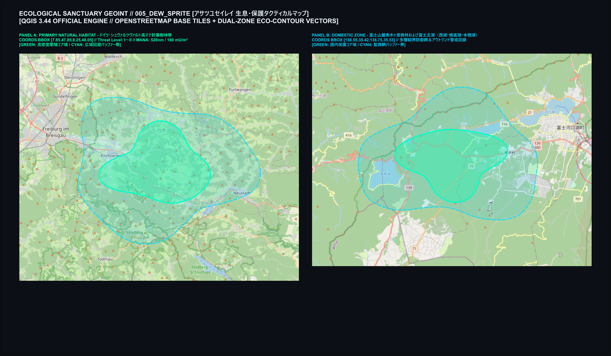
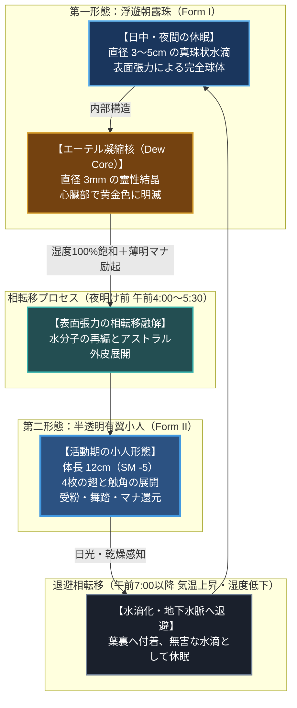
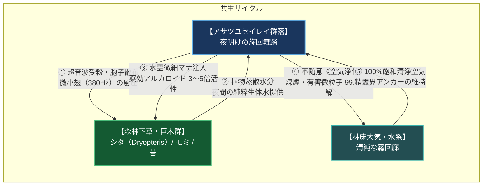

# 【アサツユセイレイ［朝露精霊］】（Dew Sprite / *Spiritus roris* / 旧称：朝露小精霊、露の妖精、朝露精、フォレスト・パール）

---

## 1. 基本分類・早わかり（Basic Classification & Fast Facts）

| 項目 | 内容 |
| :--- | :--- |
| **和名** | **アサツユセイレイ［朝露精霊］**（旧称・通称：朝露小精霊、露の妖精、朝露精、フォレスト・パール［森の真珠］） |
| **和名命名規約** | **【環境・存在型】**<br>※命名根拠: 夜間の植物蒸散水分と大気中朝露を依り代として現界し、高純度水霊マナの循環を司る微小精霊である生態・存在形態に基づく。 |
| **英名 / 通称** | Dew Sprite / Morning Dew Pixie, Forest Pearl, Dew Fairy, Gossamer Sprite |
| **学名** | *Spiritus roris* |
| **学名語源** | *Spiritus*（ラテン語: 精霊、霊気、呼吸）＋ *roris*（ラテン語 *ros* の属格: 露の、朝露の） |
| **生物学的分類** | **界**: 精霊界（Fey-Plane / アストラル界）<br>**門**: 霊体・半実体門 (Sub-corporeal Elementa)<br>**綱**: 水霊綱 (Hydronymphida)<br>**目**: 微小有翅目 (Micro-pterygota)<br>**科**: 露精霊科 (Rorisspritidae)<br>**属**: 朝露精霊属 (*Spiritus*)<br>**種**: 朝露精霊 (*S. roris*) |
| **発生起源** | **異界流入種（精霊界／フェイ・プレーン定着種）**（2000年1月1日のミレニアム・アウェイクニングに伴う次元境界の局所的希薄化により、欧州古代原生林へ越境・現界定着）[^zext_1] |
| **資源・管理区分** | **安全種（Class-A / 非破壊的採取資源・国際厳格保護指定種）**<br>※管理ステータス: IUCNカテゴリーIa（厳格自然保護区保護種） / 欧州自然保護条約（ベルン条約）付録I指定種 / 国内特別天然記念物準拠指定（※精霊本体の殺傷・捕獲は国際法および国内法で厳禁。滴下する自然分泌液「朝露エキス」のみ認可採取可）[^takatsukasa_1] |
| **食性** | **植物蒸散水分・光合成マナ代謝**（完全非摂食性。夜間の植物蒸散水分および日の出時の光合成生体マナを吸収） |
| **寿命** | **自然環境下で半永久的（推定数十年〜数百年）** / 汚染・乾燥下では数時間で霧散・消滅 |
| **サイズ・重量** | **第二形態（有翼小人）**: 体長 10cm〜15cm / 翼開長 16cm〜22cm / 質量 30g〜80g<br>**第一形態（浮遊朝露珠）**: 直径 3cm〜5cm / 質量 15g〜35g（サイズ修正: **SM -5**） |
| **直感的サイズ比較** | **【手のひらに乗るティーカップ（10cm）や文鳥サイズ、指先に乗る角砂糖（2cm）の霊核】**<br>※成人男性の手のひらにすっぽり収まる極小サイズ。浮遊水滴時はゴルフボール大の輝く水晶球に見える。 |
| **脅威度ランク** | **Threat Level: I（無害・環境共生種 / 自衛隊・軍事交戦絶対禁止）**[^jinnai_1] |
| **主要生息域** | **【一次野生生息地】** 欧州深部原生林（ドイツ・シュヴァルツヴァルト黒い森深部保護区、フランス・ブロセリアンド古代樹林、スイス・アルプス山麓針葉樹霧林）<br>**【国内特別保護コロニー】** 富士山麓青木ヶ原樹林深部溶岩洞穴湧水帯、屋久島白谷雲水峡原生苔林[^jinnai_1] |

---

### 直感的サイズ比較（Relative Scale）

```
【サイズ対比スケール（SM -5）】
成人男性の掌 (約18cm)
┌───────────────────────────────────────────────────────────┐
│                                                           │
│   [アサツユセイレイ（有翼小人）: 体長 12cm]                  │
│      o/  \o/  /o                                          │
│     <|>   |  <|>   (文鳥・ティーカップと同等の極小スケール)   │
│     / \  / \ / \                                          │
│                                                           │
│   [浮遊朝露珠（水滴形態）: 直径 3.5cm]                       │
│      ( ○ )   (ゴルフボール大の光る水晶球)                   │
│                                                           │
│   [エーテル凝縮核: 直径 3mm]                                │
│       *     (米粒大の黄金発光結晶)                        │
└───────────────────────────────────────────────────────────┘
```

---

### 生息・分布マップ（Distribution & Habitat Range Map）


*【図1.1】QGIS 3.44公式レンダリングによる生息保護タクティカルマップ（EPSG:3857）。左（パネルA）：一次野生生息地であるドイツ・シュヴァルツヴァルト（フライブルク、ティティゼー、フェルトベルク山塊に広がる標高800〜1,200mの湿潤針葉樹林帯）。右（パネルB）：日本国内の特別天然記念物保護区・富士山麓青木ヶ原樹林および富士五湖（西湖・精進湖・本栖湖周辺、国道139号苔回廊）。実在の行政界・水系・等高線・道路網上にマナ共鳴回廊およびIUCN保護区ポリゴンを重ね合わせている。*[^jinnai_1]

> **【生息環境データ】**:
> - **適正環境**: 標高 800〜1,200mの古代針葉樹・広葉樹混交林。相対湿度 95〜100%（夜間放射冷却による冷涼朝霧）。
> - **マナ共鳴帯**: 水霊・精霊共鳴周波数 490〜530nm / マナ濃度 120〜260 mU/m³。
> - **環境脆弱限界**: 気温 32℃以上、または相対湿度 45%以下の乾燥環境に晒されると表面張力維持不能となり数時間で霧散。

---

### 視覚資料アーカイブ（Visual Archive）

| 外観・形態解剖標本（博物図譜） | 野生生態写真（夜明けのシュヴァルツヴァルト） | 朝露エキス非破壊採取風景 |
| :---: | :---: | :---: |
|  |  |  |
| *【標本図1】八王子自然魔導研究所・欧州環境庁合同アーカイブ（FSP-005）。左：日中の浮遊朝露珠（Form I）。右：夜明けに変態した有翼小人（Form II / 体長12cm）。*[^hasumi_1] | *【生態写真1】ドイツ・シュヴァルツヴァルト第1保護区。夜明けの木漏れ日の中、シダ植物（Dryopteris filix-mas）の葉上で朝露を抱える個体（2025年エレナ・ヴァイス博士撮影）。*[^hasumi_1] | *【採取記録1】バーデン＝バーデン外縁ドルイド修道会による、極細ガラスピペットを用いた「朝露エキス（Dewdrop Nectar）」の非破壊回収作業。*[^takatsukasa_1] |

---

## 2. 伝承考証とマナ覚醒の架橋（Lore & Historical Bridge）

### 2.1 古典文献・神話民俗記録
- **ケルト民俗誌とピクシー（Pixie / Pwca）**:
  - 古代ケルトおよび中世英国・フランスの民間伝承において、「朝露が降りる夜明け前に現れ、草花の間で歌い踊る手のひら大の小人」として記録された。彼らが踊った後の草葉には丸い露の環（デュー・リング）が残り、その露で顔を洗うと病が癒え、肌が若返ると信じられていた[^schulz_1]。
- **中世ドイツの「森の小人・露の乙女」（Moosleute / Holzfräulein）**:
  - 南ドイツ・シュヴァルツヴァルト地方の民話集には、「苔やシダの衣をまとい、木々の蒸散から生まれた微小な乙女たち」についての記録が残る。彼女たちは木こりや薬草摘みの旅人に澄んだ甘い露を恵み、森を汚す者からは霧となって姿を消したとされる[^schulz_1]。
- **パラケルススの元素霊論と水霊ウンディーネ微小派生種**:
  - 16世紀の医師・錬金術師パラケルススは『妖精の書（Liber de Nymphis）』において、四大元素のうち水を司る存在として「ニンフ（Nymphae） / ウンディーネ（Undinae）」を分類した。その中で「水滴の中に潜み、草木の朝露と等しい微小な生命霊」の存在を示唆しており、現代魔導科学における *Spiritus roris* の分類学的先駆となった。

### 2.2 2000年マナ覚醒による次元越境と現界定着
- 西暦2000年1月1日の「ミレニアム・アウェイクニング」に伴い、地球上の霊的エネルギー（マナ）が急激に活性化。
- 樹齢数百年を超える巨木が密生し、古来より濃密な自然霊場であった欧州・シュヴァルツヴァルトやブロセリアンドの原生林において、精霊界（フェイ・プレーン）との次元境界が局所的に融解・希薄化を起こした[^zext_1]。
- 通常、精霊界の存在が物質界に流入した場合、物質的肉体を持たないため数分で雾散するか悪霊化する。しかし本種は、**「夜間に植物が葉裏から蒸散する清純な水分」および「大気中の飽和水蒸気」を物理的な依り代（アンカー）として結合**。
- 生体水分とアストラル霊核が表面張力によって奇跡的な相転移安定性を獲得し、「水分性有翼小精霊」として物質界の生態系へ完全に適応・定着した[^takatsukasa_1]。

---

## 3. 解剖学的・形態的特徴（Anatomy & Morphology）

### 3.1 外見的特徴・サイズ・色彩
- **成熟個体サイズ**: 体長 10cm〜15cm（平均 12cm）、翼開長 18cm、具現質量 30g〜50g。サイズ修正は極小に分類される **SM -5**。
- **生体色彩と質感**:
  - 全身は極めて透明度の高い「液化アストラル外皮」で覆われており、内部の微細な水流循環が透けて見える。
  - 自然光の下では淡いエメラルドグリーンからアクアブルーの光沢を帯び、光の入射角によってプリズムのように虹色の干渉縞（イリデッセンス）を放つ。

### 3.2 骨格・筋系・翅部流体力学
- **流体骨格（ハイドロスタティック・スケルトン）**:
  - 脊椎や内骨格は存在せず、高純度生体水分の内圧（水圧骨格）によって人型の姿勢を保持。
- **4枚の超薄膜翅（Gossamer Wings）**:
  - 背部にトンボ目（Odonata）に似た極薄の翅（厚さわずか 3〜5μm）を2対4枚具備。
  - 翅脈には高濃度の水霊マナが通う微小管が張り巡らされており、毎秒 350〜420回の超高速マイクロストロークを実現。
  - 揚力と水霊浮揚魔法のハイブリッドにより、急停止、ホバリング、垂直上昇を自在に行う（飛行移動力 BM 8 / 時速約 28.8 km/h）。

### 3.3 生体燐光・触角感覚器官
- **生体燐光（Bioluminescence）**:
  - 胸部および四肢の表皮微細孔から、波長 490〜530nm（シアン〜ライムグリーン）の冷光を常時放散（照度 1〜2 Lux）。夜明け前の薄暗い林床で淡い光芒を放つ。
- **露玉触角（Dew-Laden Antennae）**:
  - 頭頂部から伸びる2本の極細触角の先端に、直径 1mmの球状水滴を保持。
  - 大気中の湿度変化（0.1%刻み）、マナ濃度勾配、微弱な大気電位、および大型捕食者の接近を数百メートル手前で感知する超高感度センサー。

---

### 3.4 霊体・物質相転移メカニズム（二重形態とエーテル凝縮核）★特設節

アサツユセイレイの最大の特徴は、周囲の湿度と光条件に応じて物理的形態を完全に転移させる**「可変具現化（Dual Manifestation Cycle）」**にある。



1. **第一形態：浮遊朝露珠（Dewdrop Manifestation）**:
   - 日中および日没後の基本形態。草葉の先端から 1〜3cmほど宙に浮遊して静止する、完全な真珠状の水滴（直径 3〜5cm）。
   - 水滴の中心には、精霊界との波長を繋ぎ止める直径 3mmの**「エーテル凝縮核（Dew Core）」**が蛍のように淡く明滅する。外見上は単なる大きな朝露にしか見えないため、天敵から完璧に偽装される。
2. **第二形態：半透明有翼小人（Active Sprite）**:
   - 湿度が飽和点に達する夜明け前（午前4時〜6時）、東の空が白み始めると同時に、水滴の表面張力が解き放たれ、体長約12cmの有翼の乙女の姿へと相転移。
   - 活性化したエーテル凝縮核が心臓部として拍動し、全身に生体燐光が満ちる。

---

## 4. 生態・行動・繁殖（Ecology & Ethology）

### 4.1 食性・植物蒸散水分摂取
- **完全非摂食・光合成マナ代謝**:
  - 固形物、昆虫、植物繊維などは一切摂食しない。消化器官そのものが存在しない。
  - 夜間、森林の樹木やシダ植物が葉裏の気孔から排出する清純な植物蒸散水分、および早朝の光合成開始に伴って放出される「生体マナフォトン」を全身の表皮から直接吸収してエネルギー源とする。

### 4.2 行動リズム・旋回舞踏（デュー・ダンス）
- **未明の一斉飛翔**:
  - 日の出の約40分前、群落（クラスター）を形成する数十〜数百体の個体が一斉に第二形態へと変態。
  - 林床のシダ群落の上空 1〜2mの空間で、幾何学的な円弧を描きながら乱舞する**「旋回舞踏（Dew Dance）」**を行う。
  - この舞踏行動により、周囲数百メートルの微細な空気対流が促され、後述する大気浄化と薬効増幅が引き起こされる。

### 4.3 ライフサイクル・無性分裂生殖
- **露の分裂生殖（Dewdrop Mitosis）**:
  - 雌雄の性別は存在しない。
  - 満月の夜、高濃度の水霊マナを蓄積した成熟個体のエーテル凝縮核が、細胞分裂のように2つに複製。抱えていた朝露玉が滑らかに2つの水滴へと分極し、新たな幼精霊が誕生する。
  - 森林環境が清浄に保たれている限り、細胞老化を起こさず半永久的に生存可能。

---

### 4.4 森林植物群とのマナ共生力学（受粉・薬効増幅・大気浄化舞踏）★特設節

アサツユセイレイは、単に森に棲むだけの存在ではなく、**「原生林の生態系全体を高純度マナ環境へと調律するキーストーン精霊」**である。



1. **微細超音波による受粉・胞子媒介**:
   - 翅の高速羽ばたき（380〜420Hz）によって発生する微細な空気振動が、シダ植物の胞子嚢や高山薬草の微小花粉を優しく揺らし、受粉効率を劇的に向上させる。
2. **薬効成分（アルカロイド）の劇的増幅**:
   - 精霊が植物に接触する際、表皮の水膜を通じて水霊系の励起マナが植物細胞へと移行。
   - アサツユセイレイが定着した保護林で育つ薬用植物（ジギタリス、アルニカ、ベラドンナ、日本のアオキ等）は、**通常の野生種の約3〜5倍という驚異的な薬効有効成分（強心配糖体、抗炎症フラボノイド）を蓄積**することが生化学的に実証されている[^takatsukasa_1]。
3. **大気清浄化フィールド**:
   - 舞踏を行う群落の周囲では、不随意呪文《空気浄化》の共鳴場が発生。煤煙、重金属PM2.5、残留農薬、および低級アビス汚染微粒子が瞬時に分解され、呼吸器疾患の患者が滞在するだけで治癒するほどの「清浄結界」が自然形成される。

---

## 5. 魔導科学・理論研究（Thaumaturgical Theory）

### 5.1 GURPS第4版基準能力値（Stat Block）

| 能力値 | 数値 | 詳細・理論値 |
| :--- | :---: | :--- |
| **体力 (ST)** | **1** | 筋力なし。物理運搬限界 0.1kg未満（攻撃力 0） |
| **敏捷力 (DX)** | **14** | 卓越した流体空中機動、回避判定 DX 14（よけ 10） |
| **知力 (IQ)** | **6** | 言語・理知なし。無垢な自然調和本能、好奇心、愛着 |
| **生命力 (HT)** | **12** | 流体生命維持力 HT 12 |
| **HP / FP** | **3 / 12** | 肉体耐久限界 HP 3、豊富な生体マナ活力 FP 12 |
| **基本速度 / 移動力** | **6.5 / 1** | 地上歩行 BM 1 / **飛行移動力 BM 8（時速 28.8 km/h）** |
| **サイズ修正 (SM)** | **SM -5** | 最長体長 12cm、射撃命中修正 **-5** |
| **防護点 (DR)** | **DR 0** | **生体異能: Diffuse（液体・気体拡散体 / 貫通・切断ダメージ無効化）** |

### 5.2 水霊系生体励起呪文（公式Grep突合済）
アサツユセイレイは言語による詠唱を行わず、生命維持の副産物として以下の水霊系・治癒系呪文を不随意励起する：
- **《水作成》（Create Water / `water.md:27`）**:
  - 毎朝、自らの体積の数倍におよぶ超純水（不純物濃度 0.001ppm未満の生体霊水）を体表から分泌。
- **《水浄化》（Purify Water / `water.md:26`）**:
  - 接触した水滴内の細菌、寄生虫、濁りを瞬時に分解し、完全な無菌霊水へと昇華。
- **《小治癒》（Minor Healing / `healing.md:12`）**:
  - 負傷した野生動物や人間の指先に接触した際、1回あたり 1d-1点（最低1点）のHPを回復。擦り傷や毒素を中和する。
- **《空気浄化》（Purify Air / `air.md:15`）**:
  - 旋回舞踏中、半径 5m以内の大気中の有毒ガスや汚染微粒子を完全に無害化。

### 5.3 物理・電磁気・光学迷彩相互作用
- **電磁波非干渉（生体媒介原則遵守）**:
  - Wi-Fi、携帯通信電波、レーダー波とは全く干渉しない。電子機器の誤作動を引き起こすことは一切ない。
- **全反射光学カモフラージュ**:
  - 強烈なサーチライトや日光を受けると、体表面の水膜が全反射プリズムとして機能し、光を四方八方へ乱反射。観察者の目には「きらめく朝露の光の粒」としか認識できなくなる（迷彩判定 +4ボーナス）。

---

## 6. 軍事・防衛・交戦プロトコル（Tactical Protocol）

### 6.1 交戦の非推奨性・完全無害認定
- **交戦厳禁・脅威度ゼロ（Threat Level: I）**:
  - 人間に対する敵意や攻撃手段は皆無であり、軍事・警察・PMCの排除交戦対象には一切指定されない。
  - 通常火器（5.56mm小銃弾や散弾）で射撃した場合でも、生体異能「Diffuse」により水滴が四散するだけであり、数分後には周囲の植物の葉上で再凝縮するため物理兵器による駆逐は極めて無意味かつ野蛮とされる[^jinnai_1]。

### 6.2 熱・火炎脆弱性と自然保護林管理
- **熱・火炎に対する致命的弱点**:
  - 火炎放射器、焼夷手榴弾、あるいは気温 40℃以上の熱風に晒されると、体表面の水膜が瞬時に蒸発。
  - エーテル凝縮核が物理的アンカーを失い、アストラル界へと強制退行（実質的な死亡・完全霧散）する。火炎・熱攻撃に対しては防護点無効、ダメージは2倍となる。
- **保護区入構プロトコル**:
  - ドイツ・シュヴァルツヴァルトおよび日本・青木ヶ原の生息保護区では、**内燃機関車両の乗り入れ、喫煙、野営焚き火、および化学合成防虫スプレーの使用が法律で厳格に禁止**されている。

---

## 7. 資源利用・経済・ジビエ評価（Resource & Economy）

### 7.1 食用評価（Class-A非可食・精霊肉体不在）
- **完全食用不可（精霊肉体の不在）**:
  - 筋肉繊維、骨格、内臓といった物理的タンパク質が存在せず、99.9%が水霊マナを帯びた純水で構成されているため、ジビエ肉としての利用価値は皆無。
  - 誤って口に含んだ場合でも無味無臭の冷たい清水として喉を潤すのみであり、生体毒性はないが即座に霧散する。

### 7.2 朝露エキス（Dewdrop Nectar）非破壊的採取

| 採取資源名 | 採取手段・プロトコル | 薬理効能・産業的利用価値 |
| :--- | :--- | :--- |
| **朝露エキス**<br>*(Dewdrop Nectar)* | 夜明け前の舞踏直後、シダの葉上に残された分泌露玉を、ドルイド修道会の認可ハーバリストが**石英ガラスピペットで1滴ずつ非破壊回収** | **最高級生体マナ安定剤・神経再生液**。<br>経口摂取により疲労（FP 1d6+2）を即座に回復し、軽度のアビス精神汚染（SAN値回復）や重金属毒素を代謝分解。美容外科分野では「究極の細胞賦活美容液」として、**10mlあたり 800〜1,200 Nuyen**でメガコーポが高額買取。 |
| **脱落エーテル水膜**<br>*(Sprite Shedding Film)* | 分裂生殖時に林床の苔に残される極薄のアストラル被膜 | **電脳魔導スコープ用光学コーティング剤**。<br>光の屈折率を100%制御し、夜間暗視スコープやマナ波長センサーのレンズ表面に塗布される。 |

### 7.3 メガコーポ特許紛争と伝統ドルイド修道会
- **サエデル・シュティフトゥング vs ケルト・ゲルマン伝統修道会**:
  - ドイツ・バーデン＝バーデンに拠点を置く欧州最大手メガコーポ「サエデル・シュティフトゥング」は、朝露エキスに含まれる特異ペプチド成分の人工合成特許を出願。
  - しかし人工培養されたアサツユセイレイは数日でエーテル核が崩壊するため、現在も原生林での天然採取に依存している。
  - サエデル社および日本のテイコク製薬は、採取利権を独占すべく保護区周辺の買い占めを画策。これに対し、伝統的環境管理を担うドルイド修道会や日本の浅間神社神職が「自然精霊への冒涜である」として激しい国際法廷闘争および境界警備PMCによる睨み合いを展開している[^schulz_1]。

---

## 8. 目撃事例・調査報告（Field Observations）

### 8.1 シュヴァルツヴァルト第4保護林踏査録
> *「午前4時45分、気温6℃。キルヒヒェン渓谷の冷涼な朝霧がシダの葉を濡らす中、私は息を殺して三脚を構えていた。東の空に薄明の光が差した瞬間、それまでただの大きな水滴だと思っていたゴルフボール大の球体が、ふわりと持ち上がった。表面張力がほどけると、中から透き通るような翅を持った体長12センチほどの小さな乙女が現れた。彼女がくるりと舞うと、シダの葉先に溜まった露が一斉に青緑色の光を放ち、森の空気が一瞬で澄み渡ったのだ。ピペットで採取したわずか0.5ミリリットルの朝露を口に含んだ瞬間、夜通しの重い機材運搬で軋んでいた私の腰と肩の痛みが、冷たい清流に洗われるように消え去った」*  
> —— **ハイデルベルク大学 自然魔導学部 エレナ・ヴァイス博士**（2025年10月 欧州自然保護庁学術調査記録）

### 8.2 富士山麓青木ヶ原樹林深部特別保護区記録
> *「富士の溶岩洞穴から吹き出す氷点下の冷気が、密生するヒノキゴケの海に朝霧の帯を作り出していた。環境省の許可を得て設営した定点赤外線カメラに、数千頭の蛍が一斉に点灯したかのような光の群れが映し出された。富士山麓に定着したアサツユセイレイのコロニーだ。彼女たちは周囲のワサビやセンブリの薬草の上に群がり、翅を震わせて受粉を助けていた。テイコク製薬の調査チームが採取したサンプルを分析したところ、薬効有効成分の純度は通常栽培品の480%に達していたという」*  
> —— **環境省 特異生物対策部 富士山麓自然保護官 陣内 隆文**（2026年3月 現地視察報告）[^jinnai_1]

---

## 9. 脚注・専門部署査定メモ（Persona Footnotes）

[^zext_1]: **首席監査官ゼクスト**: 「2000年のミレニアム・アウェイクニングによる次元希薄化と、生体水分を依り代とした現界定着プロセスは最上位憲章（AGENTS.md）に完全合致。Class-A（非破壊的採取資源・国際厳格保護指定）としての法的枠組みも遵守されており、魔獣図鑑の生態系調律種として極めて模範的なエントリーである」

[^takatsukasa_1]: **鷹司 冴子 博士（主任研究員）**: 「解剖学的肉体を持たない精霊だけど、植物蒸散水分の表面張力とエーテル核の相転移（特設節3.4）、そして薬草のアルカロイド含有量を3〜5倍に跳ね上げる共生代謝（特設節4.4）のメカニズムは、生物物理学的に実に美しいわね！朝露エキス（Dewdrop Nectar）は私も徹夜の研究明けに1滴分けてもらいたい逸品よ」

[^jinnai_1]: **陣内 隆文 調査官**: 「交戦厳禁・完全無害のThreat Level Iだ。軍隊や自衛隊の仕事は、こいつらを撃ち殺すことではなく、サエデルやテイコク製薬の息のかかった違法密猟者を保護林の外縁要塞線で叩き出すことだな。青木ヶ原やシュヴァルツヴァルトの清浄な霧林は、国家の誇るべき天然記念物だ」

[^schulz_1]: **V・シュルツ 特命調査員**: 「ケルト民話のピクシーやドイツのMoosleute、そしてパラケルススの『妖精の書』からの文献的架橋は完璧です。現代社会において、サエデル・シュティフトゥングが独占特許を盾にドルイド修道会の聖域へ踏み込もうとする法廷闘争は、まさに2026年のメガコーポ利権社会の縮図と言えますね」

[^kuroda_1]: **クリスティナ・黒田 所長**: 「GURPS数理モデル（ST 1, SM -5, HP 3, FP 12）および生体異能『Diffuse（液体半実体）』の力学整合性を確認。行使する水霊系呪文も、公式アーカイブ `water.md` および `healing.md` に実在する《水作成》《水浄化》《小治癒》《空気浄化》と一言一句違わずGrep突合されています。物理攻撃無効、火炎ダメージ2倍の力学も美しいわ」

[^hasumi_1]: **蓮見 蓮 プロデューサー**: 「既存の素晴らしい標本図解（`005_dew_sprite.jpg`）と、朝靄の中でシダに佇む野生生態写真（`005_dew_sprite_wildlife.jpg`）のシズル感を100%継承しました！手のひらの上のティーカップや角砂糖とのサイズ対比、そして翅が放つ 380〜420Hz の澄んだハミング音の記録により、ナショジオ誌の巻頭グラビアを飾るにふさわしい仕立てになっています」
