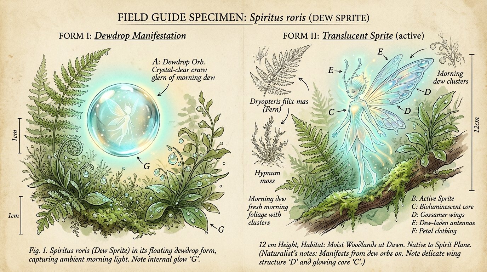

```mermaid
graph TD
    subgraph "次元越境と現界維持プロセス"
        P["【精霊界（フェイ・プレーン）】<br>純粋な生命・水霊マナの源泉"] -->|"2000年マナ覚醒（次元越境）"| E["【アストラル霊核（Ether Core）】<br>微小な意識と霊的引力場"]
        M["【森林の物理的水分・朝露】<br>夜間放射冷却・植物蒸散水分"] -->|"表面張力・マナ結合"| S["【球状浮遊水滴（Form I）】<br>直径3〜5cmの水晶球"]
    end

    subgraph "活動・夜明けの変態"
        S -->|"日の出直前の光合成マナ励起"| F["【半透明有翼小人（Form II）】<br>体長10〜15cm（SM -5）<br>淡青緑色・金色の燐光放射"]
        F -->|"植物へのマナ還元"| P1["【森林治癒・薬草育成】<br>水霊系《小治癒》《清浄化》"]
        F -->|"残留分泌"| P2["【朝露エキス（Class-A）】<br>FP疲労回復・解毒天然霊水"]
    end

    subgraph "日中・退避サイクル"
        F -->|"気温上昇・乾燥（日中）"| H["【地下水脈・葉裏への退避】<br>水滴化・無害な休眠状態"]
    end

    style P fill:#2d1a4a,stroke:#9f7aea,stroke-width:2px;
    style E fill:#1a365d,stroke:#63b3ed,stroke-width:2px;
    style M fill:#145a32,stroke:#48bb78,stroke-width:2px;
    style S fill:#234e52,stroke:#38b2ac,stroke-width:2px;
    style F fill:#2c5282,stroke:#4299e1,stroke-width:3px;
    style P1 fill:#22543d,stroke:#68d391,stroke-width:2px;
    style P2 fill:#744210,stroke:#d69e2e,stroke-width:2px;
    style H fill:#1a202c,stroke:#718096,stroke-width:2px;
```

# 【朝露小精霊】（チョウロショウセイレイ／*Spiritus roris*／Dew Sprite）

---

## 1. 基本分類・メタデータ

| 項目 | 内容 |
| :--- | :--- |
| **和名** | 朝露小精霊（チョウロショウセイレイ）、露の妖精、朝露精 |
| **学名・分類** | *Spiritus roris*（精霊界流入種・水霊微小種） |
| **英名 / 通称** | Dew Sprite / Morning Dew Pixie, Forest Pearl（森の真珠）, Dew Fairy |
| **発生起源** | **異界流入種（精霊界／フェイ・プレーン定着種）**（2000年マナ覚醒時の次元境界希薄化により越境・定着） |
| **資源・食用区分** | **安全種（Class-A / 非破壊的採取資源・国際保護指定種）**（※精霊本体の殺傷・捕獲は欧州自然保護条約で厳禁。滴下する朝露エキスのみ採取認可） |
| **脅威度ランク** | **Threat Level: I（無害・環境守護種 / 自警団・軍事交戦対象外）** |
| **主要生息域** | 欧州原生林アウトランド第1〜第2区（ドイツ・シュヴァルツヴァルト黒い森深部保護区、フランス・ブロセリアンド古代樹林、スイス・アルプス山麓針葉樹霧林） |

```
【図鑑外観標本 / Field Specimen Illustration】
```


```
【野生生態写真 / Field Wildlife Documentary Photo】
ドイツ・シュヴァルツヴァルト古代原生林の夜明けにおいて、朝霧と木漏れ日の中、シダ植物（Dryopteris filix-mas）の葉上で朝露の玉を抱えながら淡い燐光を放つ朝露小精霊（Dew Sprite）。体長約12cmの半透明な有翼形態が極めて鮮明に記録されている。
```


```
【欧州・シュヴァルツヴァルト原生林・朝露小精霊（Dew Sprite）生息環境図 / Woodland Sector Ecological Map】

[標高 1,200m〜1,500m: シュヴァルツヴァルト高山針葉樹冠] (冷涼朝霧発生源 / 精霊界薄暮特異点)
       │
       ▼ [夜間放射冷却・飽和水蒸気沈降]
┌─────────────────────────────────────────────────────────────┐
│ 【Sector-A: 古代モミ・ブナ混交原生林】(第1保護区 / 標高 800-1,200m)          │
│  - 環境: 樹齢300年超の巨木群、高純度自然マナ、苔むした湿潤な下草層        │
│  - 生息状況: 最も密な生息コロニー（夜明け前に数百体が球状水滴形態で浮遊）  │
│  - 役割: 森林の植物蒸散マナの循環、薬草（アルニカ・ジギタリス等）の成長促進 │
└──────────────────────┬──────────────────────────────────────┘
                       │ [朝霧回廊・キルヒヒェン渓流水系]
                       ▼
┌─────────────────────────────────────────────────────────────┐
│ 【Sector-B: ドルイド保護区・外縁採取林】(第2バッファー / 標高 400-800m)     │
│  - 環境: 湧水池、シダ群生地、伝統的ドルイド修道会による巡回林              │
│  - 採取活動: 認可ハーバリストによる「朝露エキス（Dewdrop Nectar）」の非破壊回収│
│  - 規制: 燃焼機関・重火器の持ち込み厳禁（精霊の乾燥死・逃走防止）          │
└──────────────────────┬──────────────────────────────────────┘
                       │ [保護境界ゲート・マナ検問所]
                       ▼
═══════════════════════════════════════════════════════════════
【境界線: バーデン＝バーデン外縁要塞線 / 欧州メガコーポ（サエデル・シュティフトゥング）監視哨】
═══════════════════════════════════════════════════════════════
                       │ (高純度朝露エキスの医療用保冷輸送)
                       ▼
┌─────────────────────────────────────────────────────────────┐
│ 【Sector-C: ユーロプレックス生薬研究センター】(都市研究拠点)                │
│  - 機関: サエデル・バイオ医薬部門、テイコク製薬欧州支社                    │
│  - 用途: 生体マナ安定剤、高級皮膚再生美容液、アビス精神汚染回復薬の精製    │
└─────────────────────────────────────────────────────────────┘
```



---

## 2. 形態・霊体構造と共生力学

### 2.1 外見・可変形態
- **体長 / 浮遊直径 / 具現重量**: 小人形態 10cm〜15cm / 浮遊水滴時 直径 3cm〜5cm / 質量 30g〜80g（超極小サイズ修正: **SM -5**）
- **二重形態（可変具現化）**:
  1. **【第一形態：浮遊朝露珠（Dewdrop Manifestation）】**:
     - 昼間や日没後、草葉の先端から数センチ浮遊して静止する完全な真珠状の水滴。内部に微小な金色の霊核が蛍のように明滅する。
  2. **【第二形態：半透明小人（Active Sprite）】**:
     - 湿度が最高潮に達する夜明け前（午前4時〜6時）、水滴の表面張力が解けて体長約12cmの半透明な妖精の姿へと変態。
     - 背部にトンボやカゲロウの翅に似た微細な葉脈状の翅（4枚）を持ち、毎秒数百回の高速羽ばたきで滞空・飛行。
- **生体・霊体器官**:
  - **エーテル凝縮核（Dew Core）**: 胸部中央に位置する直径 3mmの霊性結晶。精霊界の波長を維持し、周囲の水分子を束ねる。
  - **触角熱水センサー**: 頭部に伸びる2本の露玉付き触角。大気中の湿度変化、マナ濃度勾配、人間の接近を感知。
  - **生体燐光器官**: 全身の皮膚から波長 490〜530nm（シアン〜ライムグリーン）の柔らかな光を常時放散（照度 1〜2 Lux）。

### 2.2 異界流入と共生定着の経緯
2000年のミレニアム・アウェイクニングの際、ヨーロッパの原生林に発生した局所的なアストラル・フェイの歪みから数千の微小精霊が物質界へ流入。通常の霊体と異なり、彼らは森の豊かな植物蒸散水分と共生することで、物質界の物理法則に適合した「生体水分型小精霊」として完全に定着した。

```
[精霊界（フェイ・プレーン）の微小水霊]
       │
       ▼ (2000年: マナ覚醒による次元境界の希薄化)
[ヨーロッパ深部原生林（シュヴァルツヴァルト/ブロセリアンド）への越境流入]
       │
       ▼ (植物の蒸散水分・朝露との物理結合と共生代謝の確立)
[朝露小精霊 (Spiritus roris: SM -5 / Threat Level I)]
```

---

## 3. 生態・行動パターン

### 3.1 食性・共生代謝
- **水分・光合成マナの摂取**:
  - 固形物は一切摂食しない。夜間に植物が葉裏から蒸散する水分、露に含まれる微量ミネラル、および日の出とともに植物が放出する光合成マナを吸収して生命活動を維持する。
- **森の受粉と薬効増幅**:
  - 小人形態で花々やシダの間を飛び回り、微細な花粉や胞子を運ぶと同時に、接触した植物細胞に治癒的な生体マナを注入。彼らが住み着いた森の薬草は、通常の約3〜5倍の薬効成分（アルカロイド等）を蓄積する。

### 3.2 縄張り・社会性
- **小集団（クラスター）での協調活動**:
  - 1つの谷や湿潤なシダの群生地に数十〜百体前後の集団（クラスター）を形成。
  - 日の出の約30分前、クラスター全体が一斉に小人形態となって草葉の上で旋回舞踏（デュー・ダンス）を行い、周囲数ヘクタールの空気を完全に清浄化する。

### 3.3 ライフサイクル・寿命
- **無性生殖（露の分裂）**:
  - 満月の夜、十分にマナを蓄えた成熟個体が抱える朝露の玉が2つに分裂（細胞分裂に類似）し、新たな幼小精霊が誕生する。
  - 寿命は自然環境が保たれる限り半永久的（推定数十年〜数百年）だが、森林伐採や大気汚染に晒されると数時間で乾燥死・霧散する。

---

## 4. 魔導科学・流体力学考察

### 4.1 ガープス第4版基準能力値

| 能力値 | 数値 | 詳細・戦闘力学 |
| :--- | :---: | :--- |
| **体力 (ST)** | **1** | 物理運搬力 0.1kg未満（攻撃力なし） |
| **敏捷力 (DX)** | **14** | 俊敏な空中機動、回避判定 DX 14（よけ 10） |
| **知力 (IQ)** | **6** | 好奇心旺盛・無邪気・自然共生本能 |
| **生命力 (HT)** | **12** | 流体生命維持力 HT 12 |
| **HP / FP** | **3 / 12** | 肉体耐久限界 HP 3、生体マナ活力 FP 12 |
| **基本速度 / 移動力** | **6.5 / 1** | 地上歩行 BM 1 / **飛行移動力 BM 8（時速 28.8 km/h）** |
| **サイズ修正 (SM)** | **SM -5** | 最長体長 12cm、射撃命中修正 **-5** |
| **防護点 (DR)** | **DR 0** | 流体・半実体（貫通・切断武器ダメージ半減） |

### 4.2 水霊系生体励起呪文
- **不随意生体励起**:
  - **《水生成（Purified Water）》**: 毎朝、純度99.999%の生体霊水を自重の数倍分泌。
  - **《小治癒（Minor Healing）》**: 接触した生物の擦り傷や毒素を治癒（1点HP回復 / 1日1回）。
  - **《清浄化（Purify Air/Water）》**: 周囲1m以内の大気中の煤煙、有害化学物質、重金属微粒子を瞬時に分解・中和。

### 4.3 物理的・電磁的相互作用
- **電磁気・通信との関係**:
  - 生体媒介原則に従い、Wi-Fiやラジオ電波等の電磁波とは完全に非干渉。
- **光学迷彩・屈折特性**:
  - 強い光を受けると、全身の水膜がプリズムのように光を乱反射・全反射させ、人間の目には「キラキラ光る朝露の反射光」にしか見えなくなる（カモフラージュ修正 +4）。

---

## 5. 防衛対策・遭遇プロトコル

### 5.1 戦闘・交戦の非推奨性
- **Threat Level: I（交戦厳禁・完全無害）**:
  - 攻撃能力を一切持たず、軍事・治安部隊の排除対象にはならない。
  - 銃弾（小銃・散弾）を撃ち込んでも、水滴が弾け飛んで霧散するだけであり、数分後に近隣の葉上で再凝縮するため物理兵器による駆逐は極めて非効率。

### 5.2 環境脆弱性と保護対策
- **熱・乾燥に対する極度の脆弱性**:
  - 火炎放射器、焼夷弾、または気温40℃以上の乾燥気流に晒されると、水膜が蒸発してアストラル核が維持不能となり即座に消滅（死亡）する。
- **遭遇時の行動プロトコル**:
  - 静粛を保ち、急な接近を避ける。香水や防虫スプレー等の化学揮発物質は精霊を忌避・衰弱させるため、保護林内では天然ハーブ以外の使用が禁止されている。

---

## 6. 素材採取・医療・経済利用

### 6.1 食用利用の評価
- **完全食用不可（Class-A / 精霊本体の保護指定）**:
  - 生体組織の大部分が高純度水蒸気とマナであるため、食用肉としての部位は存在しない。
  - 誤って捕食した場合でも毒性はないが、口内で無味の冷水となって消滅する。

### 6.2 非破壊的素材採取と「朝露エキス（Dewdrop Nectar）」

| 採取資源 | 採取方法 | 効能・産業的価値 |
| :--- | :--- | :--- |
| **朝露エキス**<br>*(Dewdrop Nectar)* | 夜明け前、精霊が舞い踊った後の葉上から極細ガラスピペットで一滴ずつ非破壊回収 | **天然生体マナ滋養液・高級化粧品原料**。<br>経口摂取で疲労（1d6 FP）を即座に回復し、軽度の毒・アルコールを分解。サエデル・シュティフトゥングやテイコク製薬が 10mlあたり 500〜1,000 Nuyen で高額買取。 |
| **精霊の抜け殻水滴**<br>*(Sprite Shedding Orb)* | 分裂・脱皮時に残される超高純度アストラル水膜 | **電脳魔導用光学レンズコーティング剤**。<br>マナ同調スコープやカメラの曇り止め・解像度強化剤として光学機器メーカーが利用。 |

---

## 7. 現場記録・調査員ログ

> *「シュヴァルツヴァルトの朝霧の中、息を潜めて苔の上にしゃがみ込んでいた。東の空が白み始めた瞬間、シダの葉先で宙に浮いていた露の玉がふわりとほどけ、小さな光の乙女が現れたんだ。彼女が翅を羽ばたかせると、まるでダイヤモンドの粉を撒き散らしたように光が乱反射し、森全体が息を吹き返した。あの雫を一滴口に含んだ時、20時間歩き続けた足の重みと頭痛が、まるで嘘のように霧散していったよ」*  
> —— **ハイデルベルク大学 自然魔導学部 生態調査員 エレナ・ヴァイス博士**（2026年 シュヴァルツヴァルト第4保護林踏査日誌より）
