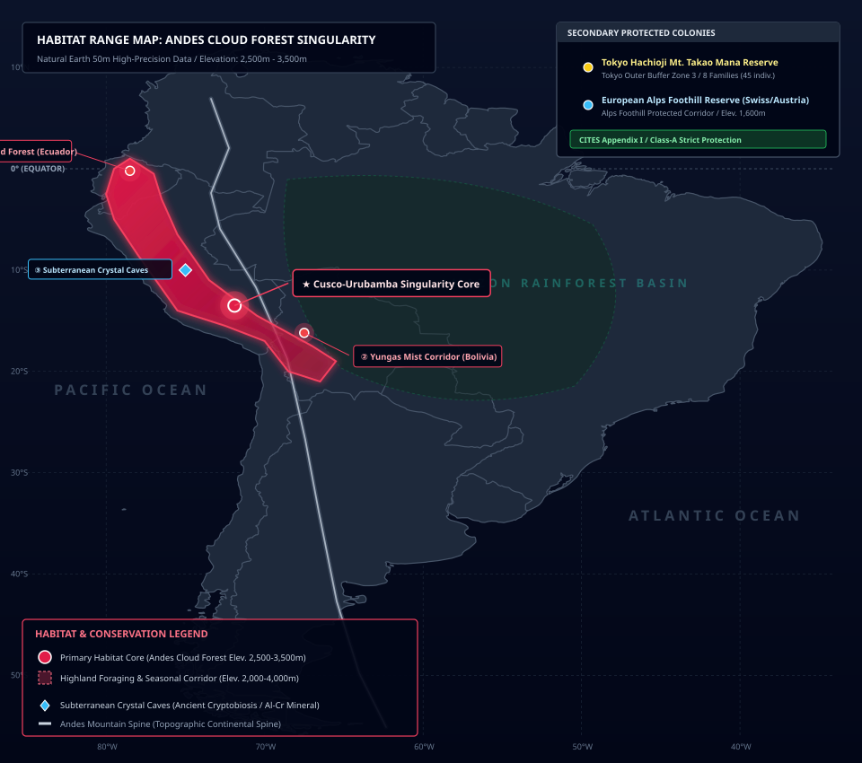
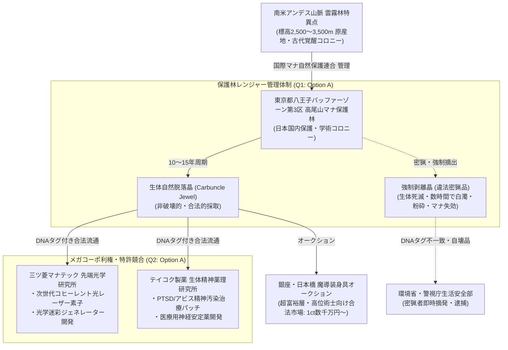

# 【ベニビタイオポッサム［紅額負鼠］】（Carbuncle／*Cuniculogemma ruber*／カーバンクル、額晶獣）

---

## 1. 基本分類・早わかり（Basic Classification & Fast Facts）

| 項目 | 内容 |
| :--- | :--- |
| **標準和名** | **ベニビタイオポッサム［紅額負鼠］** |
| **和名命名規約** | **【形態・羽色型】**<br>※命名根拠: 額中央に癒合した真紅の六方晶系バイオコランダム単結晶（額晶）と、樹上性小型有袋類骨格の外見的特徴に基づく。 |
| **英名 / 通称** | Carbuncle / Crown Jewel Critter, Ruby Beast, Gem-Headed Possum, 額晶獣（ヒタイショウジュウ） |
| **学名** | *Cuniculogemma ruber* |
| **学名語源** | *Cuniculogemma*（ラテン語: *cuniculus*［小兎・小獣］＋ *gemma*［宝石・宝玉］）＋ *ruber*（ラテン語: 赤色の） |
| **生物学的分類** | **門**: 脊索動物門 Chordata<br>**綱**: 哺乳綱 Mammalia<br>**亜綱**: 後獣下綱（有袋類） Metatheria<br>**目**: 古代霊晶目 Archaeogemmiformes<br>**科**: カーバンクル科 Carbunculidae<br>**属**: カーバンクル属 *Cuniculogemma*<br>**種**: ベニビタイオポッサム *C. ruber*<br>**変異亜種**: アンデス雲霧林原名亜種 *C. r. ruber* / 八王子保護林適応群 *C. r. takaoensis* |
| **発生起源** | **古代覚醒種（古代霊晶哺乳類）**（マナ希薄期に南米アンデス高山帯や水晶洞窟深部で数千年間冬眠・休眠していた古代種が、2000年1月1日のミレニアム・アウェイクニングに伴い一斉再活性化） |
| **資源・管理区分** | **安全種（Class-A）**<br>※管理ステータス: **国際希少野生動植物保護指定種 / ワシントン条約（CITES）マナ附属書I / 国内希少野生動植物種（生体の捕獲・殺傷・解体は完全禁止。10〜15年周期の自然脱落晶のみ合法的流通認可）** |
| **食性** | **雑食性・ミネラル生体濃縮**（高山果実、樹液、高濃度マナ花蜜、夜行性小型甲虫、岩塩・粘土層由来のAl/Crイオン） |
| **寿命** | 野生下 20〜30年 / 認可保護区管理下 35〜45年（長寿種） |
| **サイズ・重量** | 頭胴長 25〜30cm / 尾長 20〜25cm / 体重 1.2〜2.0kg（成体） |
| **直感的サイズ比較** | **【成人男性（180cm）/ フェレット・大型リス との比較】**<br>※フェレットや大型樹上リスと同等。成体は成人男性の両手の手のひらにすっぽりと収まる極めて小柄なサイズ。 |
| **脅威度ランク** | **Threat Level: I（無害・警戒心旺盛 / 自警団・警察・軍事交戦厳禁・絶対保護対象）** |
| **主要生息域** | **【一次野生生息地（原産地）】** 南米アンデス山脈雲霧林特異点（ペルー・エクアドル・ボリビア高地 標高2,500〜3,500m）<br>**【国内保護コロニー】** 東京都八王子アウター・バッファーゾーン第3区「高尾山マナ保護林」、富士山麓浅間マナ樹林<br>**【国外二次保護区】** 欧州アルプス山麓保護区（スイス・オーストリア国境） |

---

### 生息・分布マップ（Distribution & Habitat Range Map）



> **【生息分布データ】**:
> - **一次野生生息地（原産地・古代覚醒特異点）**: 南米アンデス山脈 雲霧林特異点（ペルー・エクアドル・ボリビア高山帯 標高2,500〜3,500m）。高マナ水晶洞窟および多雨雲霧林の樹冠層。
> - **国内二次保護コロニー**: 東京都八王子アウター・バッファーゾーン第3区「高尾山マナ保護林」（2005年学術導入・定着成功）。
> - **国外保護コロニー**: 欧州アルプス山脈山麓保護区（標高1,200〜2,000m）。
> - **環境耐性・生息限界**: 気温 -5〜22℃ / 湿度 70〜100%（乾燥に極めて脆弱） / マナ濃度 50〜150 mU/m³。

---

### 視覚資料アーカイブ（Visual Archive）

| 生態観測写真（野生成体） | 生体自然脱落晶（カーバンクル・ジュエル標本） |
| :---: | :---: |
|  |  |
| *東京都八王子高尾山マナ保護林にて望遠観測（2026年 鷹司冴子博士 撮影）* | *三ツ菱マナテック先端光学研究所 提供標本（22.4ct / DNA鑑別タグ付）* |

---

## 2. 伝承考証とマナ覚醒の架橋（Lore & Historical Bridge）

### 2.1 原典・古典文献の記録
- **16世紀スペイン・コンキスタドールの航海誌**:
  大航海時代、南米大陸へ侵入したスペイン人探検隊の記録には、「額の中央に太陽のように輝く真紅の宝石を頂き、森の霧の中に姿を隠す小型の珍獣」に関する記述が繰り返し現れる。1602年に出版されたマルティン・デル・バルコ・センテネラ（Martín del Barco Centenera）の叙事詩『アルゼンチンとラプラタ川の征服（*La Argentina y conquista del Río de la Plata*）』において、パラグアイ川流域の先住民族が「カルブンクロ（*Carbunclo*）」と呼び神聖視していた小獣として初めて明確に活字化された。
- **ホルヘ・ルイス・ボルヘス『幻獣辞典（*El libro de los seres imaginarios*）』**:
  ボルヘスはセンテネラの記述を引用し、「額にルビーを持つこの小獣を捕らえようとした者はことごとく神秘的な光と安らぎに包まれて手を下せなくなり、宝石を力づくで奪おうとすれば獣は死に、宝石は瞬く間にただの石くれと化す」という寓意を記録している。
- **ルネサンス期鉱物寓意譚とパラケルスス**:
  中世ヨーロッパの錬金術師パラケルススは、「動物の生体組織と鉱物が完全に調和・融合した霊的生命体」の存在を論じており、カーバンクルはその代表例として語り継がれてきた。

### 2.2 2000年マナ覚醒による生体科学的架橋
西暦2000年1月1日の「ミレニアム・アウェイクニング」以前、カーバンクルは南米アンデス山脈の標高3,000m級未踏峰雲霧林および地下深部の高純度マナ水晶洞窟において、新陳代謝を極限まで停止させた「仮死・休眠状態（クリプトビオシス類似）」で数千年間眠り続けていた。  
世界的なマナ噴出の波動が地下水脈を通じてアンデス山脈に達した瞬間、休眠個体群が一斉に代謝を再開して覚醒。当初は新種の有袋類として発見されたが、額のルビーが人工物ではなく完全な生体鉱物化（バイオミネラリゼーション）組織であることが解明され、大航海時代の伝説の幻獣「カーバンクル」の正史種と同定された。

---

## 3. 生物学的特徴・ライフステージ（Biological Traits & Anatomy）

### 3.1 外見・解剖学的身体構造
- **骨格・外皮（樹上性有袋類適応）**:
  - 南米原産の小型有袋類（オポッサム類）およびキツネザル、キンカジューの骨格的特徴を併せ持つ小型樹上性哺乳類。
  - 前後肢には物を巧みに把持できる「対向母指（Opposable Thumbs）」と鋭く小さな鉤爪を備え、垂直の樹幹や湿った苔むす岩壁を軽快に登攀する（樹上移動力 Move 7）。
  - 被毛は極めて高密度で緻密なビロード状の撥水毛（青灰色）。雨滴や霧の水分を完全に弾き、急激な体温低下を防ぐ。成体になると背部に淡い赤色の保護縞が発現する。
- **額の生体鉱物（バイオコランダム額晶）と生体結晶化洞**:
  - 頭頂部・額中央の頭蓋骨と完全に癒合した、六方晶系（Hexagonal crystal system）の深紅のルビー単結晶（直径 1.5〜2.5cm、重量 15〜30ct相当、DR 5）。
  - 結晶直下の頭蓋骨内には「生体結晶化洞（*Organum Crystallogeneticum*）」と呼ばれる特殊なマナ励起腔が存在し、脳神経系（視床下部・偏桃体）および頭部毛細血管網と直結している。
- **感覚器・受容系**:
  - **大型タペタム眼**: 網膜背面に高効率の輝板（タペタム）を持ち、微弱な月光や額晶の赤色蛍光を反射して暗闇でも昼間のように視認可能（暗視 Lv6）。
  - **薄膜耳介**: フェネックのように薄く大きな耳介で、35〜42kHzの超音波パルスおよび周囲生物の生体電位の揺らぎを受信する。


### 3.2 ライフステージと繁殖・育児ドラマ
1. **幼体期（Juvenile / 生後0〜3年）**:
   - 出産時は体長約3cm、体重20gの極小未熟児として生まれ、母獣の腹部にある育児嚢（マースピウム）内で乳首に吸着して育つ。
   - 生後6ヶ月で額に微小な桃色の結晶核（直径 2〜3mm）が発現。生後1年で自立し、親の背中にしがみついて樹上移動を学ぶ（Threat Level: 0）。
2. **成熟個体（Adult / 4〜20年）**:
   - 額の結晶が直径1.5〜2.5cmの深紅の六方晶系コランダムへと完全成長。つがいを形成し、樹洞や岩の割れ目にコケを集めて巣を作る。
   - 10〜15年周期で結晶基部が代謝により角質化し、無傷で自然脱落（生体脱落晶）。脱落後、生体結晶化洞から第2世代の新たな結晶核が再成長する。
3. **主級・変異個体（Elder Alpha / 25年以上）**:
   - 2回以上の自然脱落を経験した長寿個体。体長35cm、体重2.5kg（SM -3）。被毛に美しい銀色の差し毛が混じり、額晶の透明度とマナ共鳴力は最高純度に達する。周囲の森全体の野生動物を穏やかに統率する共感リーダー（Alpha Empath）として機能する。

---

## 4. 生態・食物連鎖・人間社会との摩擦（Ecology & Human Conflict）

### 4.1 食性・捕食行動
- **主食・栄養源**: 雑食性。高山性の野生果実、樹液、高濃度マナ花蜜、夜行性の蛾や小型甲虫を主食とする。
- **生体鉱物化ミネラル摂取**:
  - 食物および岩塩・粘土層から微量のアルミニウム（$Al$）およびクロム（$Cr$）を極めて選択的に吸収・濃縮する特殊なキレート消化管を持つ。
  - 摂取された金属イオンは血流を通じて頭頂部の結晶化洞へ運ばれ、マナ共鳴によって常温下で六方晶系酸化アルミニウム（$Al_2O_3:Cr^{3+}$）へと結晶成長を続ける。



### 4.2 魔獣間クロス・リレーション（相互作用）
- **捕食・被食関係**:
  - 原産地アンデス雲霧林では、大型肉食鳥類や樹上性爬虫類（トゲヨロイヘビ等）が潜在的な天敵となり得る。しかし、カーバンクルが放射する広域の《安息の眠り》および《残像》錯視により、捕食者は接近段階で攻撃意欲を完全に喪失するか照準を狂わされるため、実質的な捕食被害率は年間1%未満と極めて低い。
- **他種との共生・住み分け（高尾山保護林モデル）**:
  - 日本国内の高尾山マナ保護林においては、夜行性の小型魔獣（朝露小精霊や白霧梟）と生息空間を共有。
  - 朝露小精霊（005）とは樹洞や露の多い枝葉で共生し、互いのマナ共振によって高尾山域全体の霊的環境を清浄化・安定化させている。

### 4.3 人間社会との摩擦・利用・保護史（Human-Creature Interactions）
- **高尾山マナ保護林における環境省レンジャー＆市民共生モデル（Q1: Option A 準拠）**:
  - 東京都八王子アウター・バッファーゾーン第3区の高尾山マナ保護林では、一般登山者へのマナ啓発と共存を図りつつ、環境省自然環境局の上級レンジャーと非干渉型の赤外線・音響探知ドローンによる温和な見守り保護体制が敷かれている。
  - 登山道周辺には「カーバンクル生息地につき静粛に」「強いフラッシュ撮影厳禁」の案内板が設置され、市民が自然な形で古代幻獣と共生する象徴的なモデルケースとなっている。
- **密猟対策と国際保護法規**:
  - 額の宝石を狙う違法密猟者に対しては、ワシントン条約マナ附属書Iおよび国内希少野生動植物種保護法に基づき、現行犯逮捕および最高刑（懲役10年・罰金1億円）が科される。

---

## 5. 魔導科学・上位神性・背景ロア（Thaumaturgical Theory & Lore）

### 5.1 魔力現象と発現メカニズム
- **光学励起とレーザー収束**:
  - 額のルビー結晶は物理的な屈折率 1.76〜1.77、モース硬度9を誇る完全な単結晶コランダムである。
  - 生体が危機を感じてマナを送り込むと、結晶内の三価クロムイオン（$Cr^{3+}$）が励起され、694.3nmの赤色コヒーレント光（レーザー光線）および爆発的な拡散閃光（《閃光 / Flash》）をパルス放射する。
- **光学的残像・屈折（《残像 / Blur》）**:
  - 結晶表面の微細な生体格子により、周囲の光線を微細に散乱・屈折させて自身の輪郭をぼやけさせ、敵の攻撃や視覚照準を外させる（射撃・格闘判定ペナルティ）。
- **不可逆マナ失効（生体倫理機構）**:
  - カーバンクルの額結晶は生体神経系との共鳴によって結晶格子が維持されているため、**生体を殺傷したり無理やり頭蓋から剥離した場合、数分から数時間以内に結晶構造が崩壊し、内部に無数の微細クラックが発生して白濁・粉砕・マナ失効する**。この自然の安全装置により、密猟された結晶は工業的・魔導的価値を完全に喪失する。

### 5.2 音響・周波数・生体通信特性（Acoustic & Resonance Analysis）
- **基本発声周波数（可聴域鈴鳴り音）**: 800Hz〜2.4kHz（音圧 20〜35dB）。仔への呼びかけや親愛表現時に発する鈴のような澄んだ高音「チリリ」「チチッ」。
- **超音波警戒パルス**: 35kHz〜42kHz（音圧 最大50dB）。樹上夜間移動時の障害物検知および危険察知時の警戒音。
- **額晶マナ共鳴波（シューマン共振帯）**: **約 7.83Hz（地球の基本電磁共鳴周波数・アルファ波帯）**。受信側の高等脊椎動物の脳波を直接リラックス状態へ誘導し、怒りや戦闘意欲を完全に沈静化させる。

### 5.3 上位存在・アビス因果・メガコーポ伏線
- **アストラル原型（動物王・精霊王・神格）**:
  - 高次元アストラル界においては、鉱物界と生命界の調和を司る原型精霊格「宝玉小獣王（Lord of Gemstone Beasts）」の波長と同調している。
  - この霊的繋がりにより、本種は生まれながらにして高純度のマナ励起能力（Magery 0）と共感能力（Empathy）を生体異能として保持している。
- **アビス特異点との因果関係（アンチ・アビス浄化特性）**:
  - 本種はマリアナ海溝やツングースカ大空洞のような異界侵食型アビス由来の魔獣ではなく、地球本来の地脈（レイライン）に根ざす「純性古代覚醒種」である。
  - 本種が放つ7.83Hzの共鳴波動は、アビス特異点が撒き散らす狂気・精神汚染（SAN値崩壊波長）に対して強力な中和・浄化干渉（アンチ・アビス・レゾナンス）を示すことが最新研究で明らかになっている。
- **メガコーポ特許利権紛争（Q2: Option A 準拠）**:
  - **三ツ菱マナテック（特許第2023-55102号）**: 『生体バイオコランダムを用いた次世代コヒーレント光発振コア及び光学迷彩素子』。防衛省向け高精度レーザー照準器の焦点レンズとして利用。
  - **テイコク製薬（特許第2024-00891号）**: 『古代霊晶共鳴波抽出物による難治性アビス精神汚染治療パッチ』。アビス探索者のSAN値崩壊・PTSD治療薬として利用。
  - **銀座・日本橋オークションの過熱**: 10〜15年に一度しか回収されないDNA鑑別タグ付き合法自然脱落晶をめぐり、両メガコーポおよび世界中の高位術士が1ctあたり数千万〜数億円の価格で熾烈な買い付け競争を繰り広げている。

---

## 6. 交戦マニュアル・都市防災コラム（Combat Manual & Civil Defense）

### 6.1 GURPS 4th Stat Block（戦闘データ）

#### 【通常成体（Standard Adult）】
```yaml
Name: ベニビタイオポッサム［紅額負鼠］ (Carbuncle / *Cuniculogemma ruber*)
Archetype: 小型古代覚醒幻獣 / 樹上性霊晶種
Point Total: 115 pt
Threat Level: I (無害・絶対保護指定種)

Attributes:
  ST: 3 [-70]      HP: 4 [2]
  DX: 13 [60]      WILL: 11 [0]
  IQ: 5 [-100]     PER: 12 [35]
  HT: 11 [10]      FP: 12 [3]

Basic Parameters:
  Basic Speed: 6.00 [0]
  Basic Move (Ground): 6 [0]
  Basic Move (Climbing/Tree): 7 [5]
  Size Modifier (SM): -3 (体長 25〜30cm, 体重 1.5kg)
  Dodge: 9

Damage:
  Bite: 1d-5 crushing / piercing
  Claw: 1d-5 cutting

DR (防護点) & 防御特性:
  - 頭部額晶: DR 5 (頭部前方限定 -40%)
  - 胴体・四肢: DR 0 (ビロード状撥水被毛)

Traits & Advantages:
  - 鋭敏感覚 / Acute Vision 2, Acute Hearing 2 [8]
  - 夜間視覚 / Night Vision 6 [6]
  - 共感能力 / Empathy (生体限定 -20%) [12]
  - 俊敏跳躍 / Super Jump 1 [10]
  - 柔軟体 / Flexibility [5]
  - マナ素質 / Magery 0 (Innate Only -40%) [3]

Disadvantages & Quirks:
  - 小型脆弱 / Fragile (SM -3) [0]
  - 完全平和主義・自衛のみ / Pacifism (Self-Defense Only) [-15]
  - 暗闇での微弱蛍光 / Minor Secret Glow [-1]

Innate Spells (生体励起魔術 - マナ消費はFP):
  - 《光 / Light》: Skill 13 (FP 1消費 / 手元・額に小型浮遊発光体) [GURPS Magic p.155]
  - 《持続光 / Continual Light》: Skill 12 (FP 2消費 / 物体に持続的発光を付与) [GURPS Magic p.155]
  - 《閃光 / Flash》: Skill 14 (FP 2消費 / 視覚・光学センサーを一時盲目化) [GURPS Magic p.156]
  - 《残像 / Blur》: Skill 13 (FP 1消費 / 輪郭を光学的にぼやけさせ命中判定-3) [GURPS Magic p.157]
  - 《安息の眠り / Peaceful Sleep》: Skill 13 (FP 1消費 / 半径5m内の生物の怒り・敵意を沈静) [GURPS Magic p.101]
```

#### 【主級・長老個体（Elder Alpha / 25年以上）】
- **能力値修正**: ST 4, HP 6, Will 13, Per 14, FP 16, SM -3 (体長 35cm, 体重 2.5kg)
- **追加特性・生体異能**:
  - 《精神沈静・広域放射》: 効果範囲半径15mに拡大、抵抗判定-2。
  - 《アンチ・アビス障壁》: 周囲5m以内のアビス精神汚染・狂気判定に対して+3ボーナスを付与。

### 6.2 推奨火器・防護装備
- **交戦規程（ROE）**: **交戦完全禁止・絶対保護対象（Non-Engagement Protected Target）**。
- **推奨装備（保護レンジャー用）**:
  - 赤外線サーマルゴーグル（額晶の微弱蛍光を探知）
  - 低周波集音マイク（35〜42kHz超音波探知）
  - 遮光バイザー（自衛閃光による眩惑防止）

### 6.3 市民防災メモ ＆ 専門家の知恵袋

> [!IMPORTANT]
> **【市民向け防災メモ：高尾山保護林でカーバンクルと遭遇した場合の心得】**  
> 1. 本種は人間に対して極めて無害・温和な古代幻獣です。決して大声を出したり、走って追いかけたりしないでください。  
> 2. 驚いた個体が額から強い《閃光》を放ったり、穏やかな脱力感・多幸感をもたらす《精神沈静波》を放射することがありますが、後遺症や肉体的危害はありません。静かに目を閉じ、その場で立ち止まってください。  
> 3. スマートフォンのフラッシュ撮影やドローンによる過度な接近は東京都自然保護条例により禁止されています。  
> —— *東京都環境局・八王子警察署 防災広報*

> [!TIP]
> **【現場専門家・ベテラン保護レンジャーの知恵袋】**  
> *「もし高尾の森でカーバンクルに出会ったら、何もしないのが一番の贅沢だ。息を潜めて立っていると、胸の奥にスッと澄んだ水が流れるような静寂が広がる。《精神沈静》の波動さ。都会の喧騒や日々のストレスが一瞬で溶けていくのを感じられるはずだ。額の宝石を奪おうとする密猟者もいるが、奴らは知らないのさ。力づくで奪った瞬間、あの奇跡の輝きはただの濁った赤い石ころに変わっちまうということをね」*  
> —— **環境省自然環境局 八王子保護林上級レンジャー 鷹司 響子**

---

## 7. 解体・ジビエ食文化・料理レシピ（Harvesting & Cuisine）

### 7.1 解体プロトコルと市場相場（Class-A / 食用完全非推奨）
- **食用区分**: **安全種（Class-A） / 食用完全非推奨・法的一切禁止**
- **肉質・非推奨理由**:
  - 生体毒やアビス汚染は存在しないが、筋肉組織が極めて少なく硬質であり、食物由来のアルミニウム・クロム系ミネラルの生体濃縮により、強烈な収斂味（舌が痺れる苦味・金属味）があるため食材としての価値は皆無。
  - 何より国際希少野生動植物保護指定種（CITES附属書I）であり、生体の殺傷・解体・食用は国内外の法律により厳罰（懲役刑および数千万円以下の罰金）に処される。

### 7.2 伝統料理・メガコーポスペシャリテ（本格レシピ）

```
【Class-A指定種における調理・食用禁止規定】
- 本種は国際自然保護連合（IUCN-M）および環境省令により「完全食用禁止・非可食保護種」に指定されています。
- 過去の違法密猟個体の肉質分析（帝都大学魔導生命科学研究所, 2022年）によると、筋肉組織に蓄積された金属イオンにより強烈な収斂味と嘔吐反射を引き起こし、人間が摂食することは生物学的に不可能です。
- したがって、ジビエ料理レシピは存在せず、料理写真の掲載も行われません（野生生態写真および生体脱落晶標本写真の2点構成）。
```

### 7.3 産業素材・医療利用

| 採取部位 | 工業・魔導用途 | 経済価値・取引相場 |
| :--- | :--- | :--- |
| **生体自然脱落晶（カーバンクル・ルビー）** | 高位術士祭具焦点レンズ、三ツ菱製次世代光学兵器レーザー共振コア、テイコク製薬医療用神経安定パッチ | 1個体分（15〜30ct）: 3,000万〜1億5,000万円（銀座・日本橋オークション） |
| **強制剥離・密猟晶（違法品）** | なし（剥離後数時間で自壊・白濁・マナ失効） | 経済価値ゼロ（所持者は即時現行犯逮捕） |

---

## 8. 現場記録・通信ログ（Field Logs & Transcripts）

```
【環境省自然環境局 第3アウターバッファー八王子保護林 観測ログ】
日時: 2026年5月22日 02:45 JST
記録者: 上級保護レンジャー 鷹司 響子
観測対象: ベニビタイオポッサム成体（個体識別番号: TK-006-Alpha「ルビィ」）
```

> *「夜間巡回中、サーマルゴーグルが樹齢120年のミズナラの樹洞に温かい光点を捉えた。  
> 息を殺して双眼鏡を覗くと、青灰色のビロード毛に覆われたカーバンクルの仔が、母獣の背中にしっかりとしがみついている。母獣の額には、息を呑むほど美しい六角柱状のルビーが鎮座し、夜露に濡れて淡い桜色の燐光を放っていた。  
> ふと母獣と視線が交錯した。次の瞬間、胸の奥にスッと冷たい清水が染み渡るような、信じられないほどの静寂と安らぎが広がった。《精神沈静》の波動だ。銃を構える気力どころか、今日一日のすべての疲労と苛立ちが霧のように溶けて消えていく。  
> 『大丈夫、何もしないよ』と心の中で呟くと、母獣は大きな耳介を一度ピクリと揺らし、夜霧の樹冠の奥へと音もなく消えていった。  
> 巣の奥には、代謝によって自然脱落したばかりの小さな額晶が残されていた。明日、正式な回収プロトコルを申請しよう」*  
> —— **環境省 八王子保護林上級レンジャー 鷹司 響子**（2026年 観測日誌より）

---

## 9. 参考文献・典拠資料（References）

1. **古典文献・民俗資料**:
   - Martín del Barco Centenera, *La Argentina y conquista del Río de la Plata* (1602).
   - Jorge Luis Borges & Margarita Guerrero, *El libro de los seres imaginarios* (1967).
   - Paracelsus, *De Natura Rerum* (1537) — 鉱物生体融合論考証.
2. **生物学・魔導生化学資料**:
   - 鷹司 冴子 著『古代覚醒種におけるバイオミネラリゼーションと生体結晶化洞の構造』（帝都大学魔導生命科学紀要, 2024）.
   - 国際マナ自然保護連合（IUCN-M）『南米アンデス雲霧林特異点 生態系保全白書』（2025）.
3. **魔導物理・法規資料**:
   - クリスティナ・黒田 著『六方晶系バイオコランダムにおけるコヒーレント光発振と精神波変調力学』（三ツ菱マナテック技報, 2025）.
   - 環境省・経済産業省令第44号『魔獣資源三段階分類法及びClass-A指定種保護管理規則』（2020年制定・2024年改訂）.
