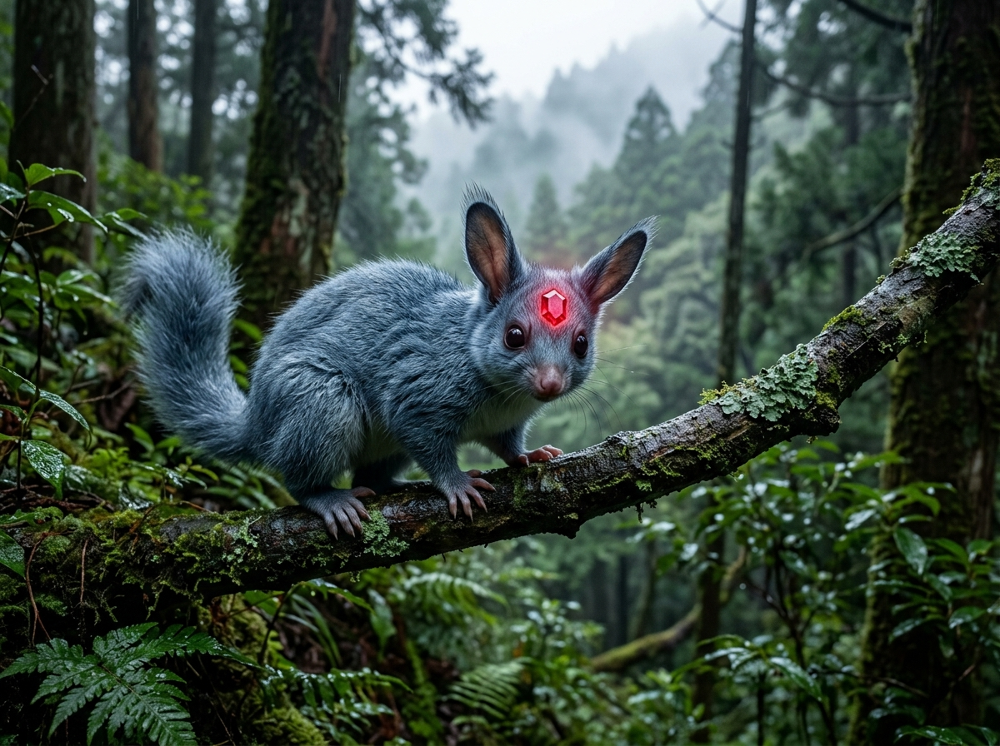
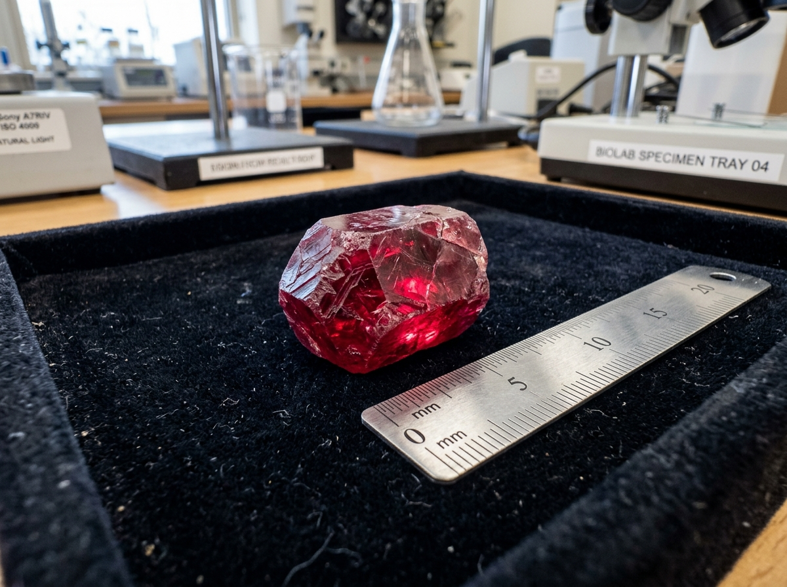
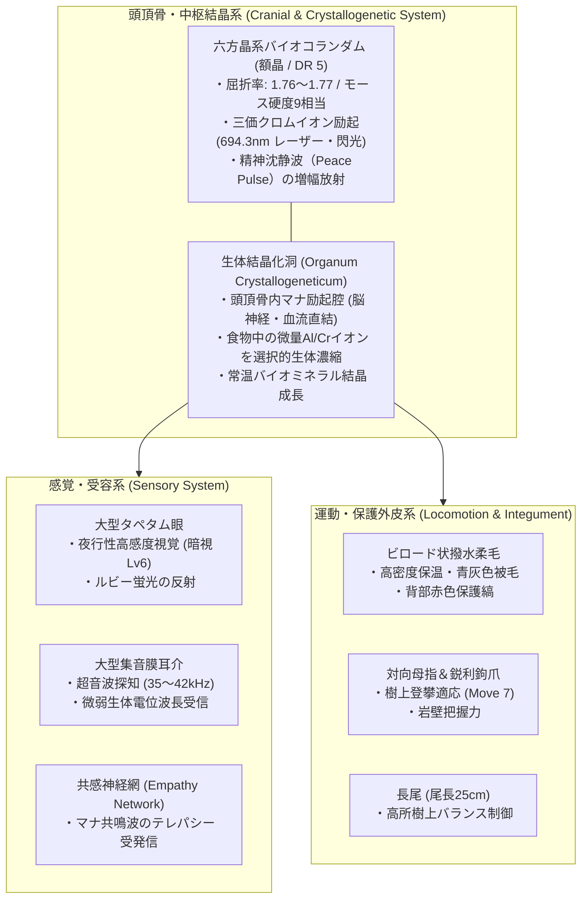
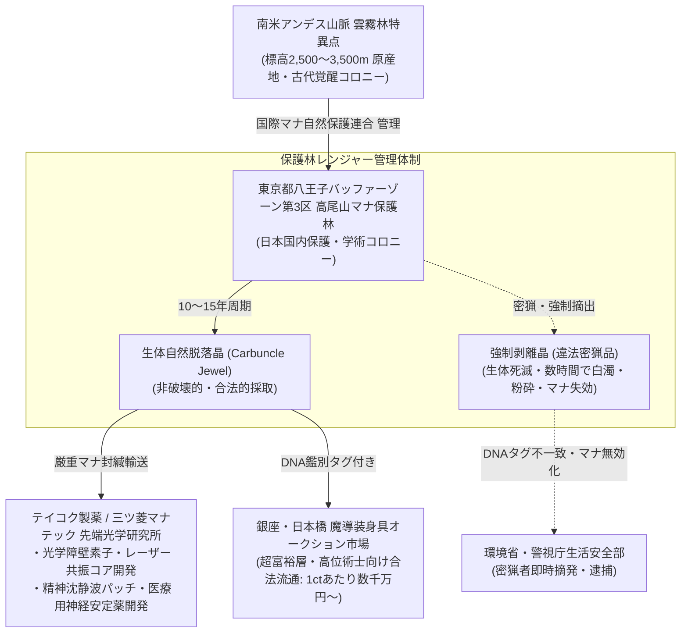

# 【紅玉小獣 カーバンクル】（コウギョクショウジュウ／*Cuniculogemma ruber*／Carbuncle）

---

## 1. 基本分類・メタデータ

| 項目 | 内容 |
| :--- | :--- |
| **和名** | 紅玉小獣（コウギョクショウジュウ）、ルビー獣、額晶獣（ヒタイショウジュウ） |
| **学名・分類** | *Cuniculogemma ruber*（古代覚醒種・古代霊晶目 カーバンクル科） |
| **英名 / 通称** | Carbuncle / Ruby Beast, Crown Jewel Critter, Gem-Headed Possum |
| **発生起源** | **古代覚醒種（古代霊晶哺乳類）**（2000年ミレニアム・アウェイクニングに伴い、南米アンデス山脈雲霧林および世界各地の高純度マナ水脈・霊峰の深部地下洞窟より再活性化） |
| **資源・食用区分** | **安全種（Class-A / 非破壊的採取資源・国際希少野生動植物保護指定種）**（※生体の殺傷・強制捕獲はワシントン条約マナ野生種附属書Iおよび各国自然保護法で厳禁。自然脱落晶のみ合法的流通認可） |
| **脅威度ランク** | **Threat Level: I（無害・警戒心旺盛 / 自警団・警察・軍事交戦不要）** |
| **主要生息域** | 南米アンデス特異点・雲霧林保護区（ペルー、エクアドル高地）、欧州アルプス山麓、日本国内保護区（東京都八王子アウター・バッファーゾーン第3区高尾保護林、富士山麓浅間マナ樹林） |

### 視覚資料アーカイブ（Visual Archive）
| 生態観測写真（野生成体） | 生体自然脱落晶（カーバンクル・ジュエル標本） |
| :---: | :---: |
|  |  |
| *東京都八王子高尾保護林にて望遠観測（2026年）* | *三ツ菱マナテック先端光学研究所 提供標本（22.4ct）* |





---

## 2. 生物学的特徴・形態

### 2.1 外見・身体構造
- **体長 / 尾長 / 体重**: 体長 25〜30cm、尾長 20〜25cm、体重 1.2〜2.0kg。
- **骨格・外皮**: 
  - 南米原産の小型有袋類（オポッサム類）およびキツネザル、キンカジューの骨格的特徴を併せ持つ小型樹上性哺乳類。
  - 四肢には物を巧みに把持できる対向母指と鋭く小さな鉤爪を備え、垂直の樹幹や岩壁を軽快に移動する。
  - 被毛は極めて緻密で柔らかいビロード状の撥水毛（青灰色、成体になると背部に淡い赤色の縞模様が発現）。
- **感覚器官・額の生体結晶（バイオコランダム）**:
  - 頭頂部・額の中央に、六方晶系（Hexagonal crystal system）の美しい真紅のルビー結晶（直径 1.5〜2.5cm、重量 15〜30ct相当）が強固に結合している。
  - 結晶直下の頭蓋骨内には「生体結晶化洞（*Organum Crystallogeneticum*）」と呼ばれる特殊なマナ励起洞窟が存在し、脳神経・血流系と直結している。
  - 耳介はフェネックギツネのように大きく薄い膜状で、微小な空気の振動や生物の生体電位波長、マナの揺らぎを捉える。瞳は大きく琥珀色で、夜間はルビー結晶の微弱な赤色蛍光を反射して美しく輝く。

### 2.2 変異・覚醒の経緯
- 西暦2000年1月1日の「ミレニアム・アウェイクニング」以前、カーバンクルは南米アンデス山脈の標高3,000m級の未踏峰雲霧林や、地下深部の高マナ水晶洞窟において、仮死・冬眠状態で数千年にわたり休眠していた古代哺乳類である。
- マナの噴出に伴い一斉に覚醒。当初は新種の有袋類として報告されたが、額の宝石が人工物ではなく完全な生体鉱物（バイオミネラル）であることが判明し、大航海時代から南米伝承（コンキスタドールたちが追い求めた「額に宝石を持つ幻獣」）に記録されていた伝説の幻獣「カーバンクル」の正史種として同定された。

---

## 3. 生態・行動パターン

### 3.1 食性・捕食行動
- **主食**: 雑食性。マナを帯びた果実、樹液、高山植物の新芽、花蜜、および小型甲虫・夜行性の蛾を捕食する。
- **生体鉱物化ミネラル摂取**:
  - 食物および岩塩・粘土層から微量のアルミニウム（$Al$）およびクロム（$Cr$）を極めて選択的に吸収・濃縮する特異な消化吸収管を持つ。
  - 摂取された金属イオンは血液を通じて頭頂部の結晶化洞へ運ばれ、マナ共振によって常温で六方晶系酸化アルミニウム（$Al_2O_3:Cr^{3+}$）へと結晶成長を続ける。

### 3.2 縄張り・社会性
- **小家族群・ペア形成**:
  - つがい、または親仔2〜4頭の小規模な家族単位で生活し、樹洞や岩の割れ目に柔らかいコケを集めた巣を作る。
  - 性格は極めて温和で臆病、警戒心が強い。争いを嫌い、外敵や他の個体と遭遇した際は額の結晶から穏やかな共感波（《精神沈静》）を放射して敵意を中和させ、その隙に素早く樹上へ逃走する。
- **共感コミュニケーション**:
  - 鳴き声はほとんど発さず（仔を呼ぶ際の微弱な鈴のような「チチッ」という音のみ）、仲間同士の意思疎通は額結晶を介したマナ共鳴波（テレパシー・共感波）で行われる。

### 3.3 繁殖・ライフサイクル
- **寿命**: 野生下で約25〜35年、保護下で40年以上の長寿を誇る。
- **繁殖**: 3〜4年に一度、1〜2頭の幼体を出産（有袋類型の育児嚢を持つ）。
- **結晶の成長と自然脱落（生体脱落晶）**:
  - 幼体時には額に小さな桃色の結晶核（3〜5mm）しか存在しないが、加齢とともに成長し、10〜15年ごとに結晶基部が代謝によって角質化し、**無傷でポロリと自然脱落する（生体脱落晶）**。
  - 脱落後、基部の結晶化洞から新たな第2世代・第3世代の結晶核が再成長する。この脱落晶こそが、世界で最も純粋で強力な生体マナ触媒として珍重される。

---

## 4. 魔導科学・生物学的考察

### 4.1 魔力現象と発現メカニズム
- **光学励起とレーザー収束**:
  - 額のルビー結晶は、物理的な屈折率 1.76〜1.77、モース硬度9を誇る完全な単結晶コランダムである。
  - 生体が危機を感じてマナを送り込むと、結晶内の三価クロムイオン（$Cr^{3+}$）が励起され、694.3nmの赤色コヒーレント光（レーザー光線）および拡散閃光（《閃光 / Flash》）をパルス放射する。
- **光学的屈折障壁**:
  - 結晶表面の微細な生体マナ格子により、周囲の光線や赤外線レーザーを歪曲・屈折させる《屈折障壁 / Refract Barrier》を励起可能。これにより、捕食者の視覚や照準器から自身の位置を数十センチメートルずらして錯視させる。
- **精神波共鳴（心話・沈静）**:
  - 結晶化洞と直結する視床下部・偏桃体からの微弱生体電位が結晶格子内で増幅され、周囲半径10m以内の高等脊椎動物の精神（アストラル体）に穏やかな同調波（《精神沈静 / Peace》）を届ける。

### 4.2 科学的・電磁的相互作用
- **電子機器への非干渉**:
  - 本種が放つ現象は純粋な光学現象（光子）および生体共感波であるため、近隣のスマートフォン、無線機、監視カメラなどの電磁回路を破壊・妨害することはない。
- **光学センサー・暗視スコープへの反応**:
  - 赤外線暗視装置（ナイトビジョン）で見ると、額の結晶が常時微弱な赤外〜近赤外蛍光を放っているため、高感度サーマル・暗視スコープでは暗闇でも明確な輝点として探知可能。

### 4.3 音響・周波数・生体通信特性（Acoustic & Resonance Analysis）
- **鳴き声・発声周波数帯**:
  - **可聴域（鈴鳴り音）**: 幼体への呼びかけや親愛表現時に発する「チチッ」「チリリ」という高音（800Hz〜2.4kHz、音圧 20〜35dB）。
  - **超音波帯（エコロケーション・警戒パルス）**: 樹上夜間移動および危険察知時に用いる超音波クリックス音（35kHz〜42kHz、音圧 最大50dB）。
- **額晶マナ共鳴波（テレパシー・共感パルス）**:
  - 額のルビー結晶を介したマナ共鳴周波数は約 **7.83Hz（シューマン共振・アルファ波帯）** に極めて近く同調。
  - 受信側の高等哺乳類の脳波を直接リラックス状態へ誘導し、《精神沈静》の効果を生み出す。

---

## 5. ガープス第4版（GURPS 4th）データブロック

```yaml
Name: 紅玉小獣 カーバンクル (Carbuncle)
Archetype: 小型古代覚醒幻獣 / 愛玩・霊晶種
Point Total: 110 pt
Threat Level: I (無害・保護指定種)

Attributes:
  ST: 3 [-70]      HP: 4 [2]
  DX: 13 [60]      WILL: 11 [0]
  IQ: 5 [-100]     PER: 12 [35]
  HT: 11 [10]      FP: 12 [3]

Basic Parameters:
  Basic Speed: 6.00 [0]
  Basic Move (Ground): 6 [0]
  Basic Move (Climbing/Tree): 7 [5]
  Size Modifier (SM): -4 (体長 25〜30cm, 体重 1.5kg)
  Dodge: 9

Damage:
  Bite: 1d-5 crushing / piercing
  Claw: 1d-5 cutting

Traits & Advantages:
  - 額の生体ルビー結晶 (DR 5, 頭部前方のみ限定 -40%) [15]
  - 鋭敏感覚 / Acute Vision 2, Acute Hearing 2 [8]
  - 夜間視覚 / Night Vision 6 [6]
  - 共感能力 / Empathy (生体限定) [15]
  - 俊敏跳躍 / Super Jump 1 [10]
  - 柔軟体 / Flexibility [5]
  - 超感覚的マナ感知 / Magery 0 (Innate Only -40%) [3]

Disadvantages & Quirks:
  - 小型脆弱 / Fragile (SM -4) [0]
  - おとなしい・臆病 / Pacifism (Self-Defense Only) [-15]
  - 暗闇で額が光る / Minor Secret Glow [-1]

Innate Spells (生体励起魔術 - マナ消費はFP):
  - 《閃光 / Flash》: Skill 14 (FP 2消費 / 前方コーン状に強烈な目くらまし光)
  - 《精神沈静 / Peace》: Skill 13 (FP 1消費 / 半径5m内の生物の怒り・戦闘意欲を沈静)
  - 《屈折障壁 / Refract Barrier》: Skill 12 (FP 3消費 / 光線攻撃・視覚射撃に対する命中判定-3)
```

---

## 6. 交戦・保護・防衛マニュアル

### 6.1 交戦の必要性と法的保護
- **交戦厳禁・非敵対存在**:
  - 本種は人間を攻撃することは一切なく、危害を加える能力も持たない。
  - 自衛隊・警察・認可PMCの交戦規程（ROE）において「**絶対保護対象（Non-Engagement Protected Target）**」に指定されている。
- **自衛行動への対処**:
  - 驚かせた場合、額から《閃光》を放って目くらましを行ったり、《精神沈静》波を放射して一時的な脱力感・多幸感をもたらすが、身体的後遺症や害はない。目を閉じて静かに後退すれば自然に逃走する。

### 6.2 密猟・不法捕獲への対策
- **密猟監視プロトコル**:
  - 八王子保護林および富士山麓保護区には、赤外線センサーおよびマナ波感知ドローンが常時配備されており、生体トラップや麻酔銃を用いた不法侵入者は即時現行犯逮捕される。

---

## 7. 解体・食利用・素材採取

### 7.1 食用利用と評価（Class-A）
- **食用区分**: **安全種（Class-A） / 食用完全非推奨**
- **肉質・理由**:
  - 生体毒や呪術的汚染は存在しないが、筋肉組織が非常に少なく硬質で、アルミニウム系ミネラルの蓄積により独特の収斂味（苦味・金属味）があり、食材としての価値は皆無である。
  - 何より国際保護種であり、解体・食用は世界中の自然保護法および文化・倫理的観点から厳罰（懲役刑・莫大な罰金）の対象となる。

### 7.2 素材採取と工業・魔導利用

| 比較項目 | 生体自然脱落晶（合法流通品） | 強制剥離・殺傷晶（違法密猟品） |
| :--- | :--- | :--- |
| **外観・透明度** | 完全無欠の深紅・高透明度六方晶系 | 白濁、内部クラック、くすんだ赤色 |
| **マナ伝導率・保持力** | 極めて高い（半永久的共鳴） | 摘出後数時間で95%以上マナ失効 |
| **光学レーザー発振** | 安定した高出力コヒーレント光 | 発振不能（熱暴走・自壊） |
| **市場価値** | 1ctあたり数千万〜数億円（超高額） | 価値ゼロ（DNAタグ検知で即座に逮捕） |

- **採取可能部位**:
  - **カーバンクル・ジュエル（生体自然脱落ルビー）**:
    - 10〜15年に一度、自然に脱落した無傷の結晶のみを保護レンジャーが回収。
    - **用途**: 高位術士の杖・祭具の焦点レンズ、メガコーポ製先端光学レーザー魔導兵器の共振コア、最高級マナ安定装身具。
- **生体結晶の不可逆マナ失効（バイオハザードならぬ生体倫理機構）**:
  - カーバンクルの額結晶は生体神経系との共鳴によって結晶構造が維持されているため、**生体を殺傷したり無理やり頭蓋から剥離した場合、数分から数時間以内に結晶構造が崩壊し、内部に無数の微細クラックが発生して白濁・粉砕する**。
  - この「生体死滅に伴うマナ失効」という自然の安全装置により、密猟された結晶は工業的・魔導的価値を完全に喪失する。

---

## 8. 現場記録・調査員ログ

> *「八王子の第3アウターバッファー、高尾の旧登山道奥にある保護林で夜間パトロールを行っていた時のことだ。サーマルゴーグルに、樹洞から顔を出す小さな温かい光点が映った。*  
> *息を殺して双眼鏡を覗くと、青灰色のビロード毛に覆われたカーバンクルの仔が、親の背中にしがみついていた。親の額には、息を呑むほど美しい六角形のルビーが鎮座し、夜露に濡れて淡い桜色の燐光を放っている。*  
> *ふと親獣と目が合った。次の瞬間、胸の奥にスッと冷たい泉の水が染み渡るような、信じられないほどの静寂と安らぎが広がった。《精神沈静》の波動だ。銃を構える気力どころか、今日一日のすべての疲労と苛立ちが溶けて消えていくようだった。*  
> *『大丈夫だ、撃ちやしないさ』と心の中で呟くと、親獣は大きな耳を一度ピクリと揺らし、夜霧の樹冠の奥へと音もなく消えていった。*  
> *あの額の宝石を狙って銃を向ける密猟者がいるという。だが奴らは知らないのだ。力づくで奪った瞬間、あの奇跡のような輝きはただの濁った赤い石ころに変わってしまうということを」*  
> —— **環境省自然環境局 八王子保護林上級レンジャー 鷹司 響子**（2026年 観測日誌より）

---
