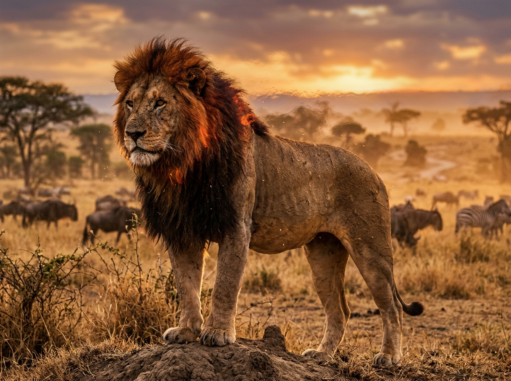
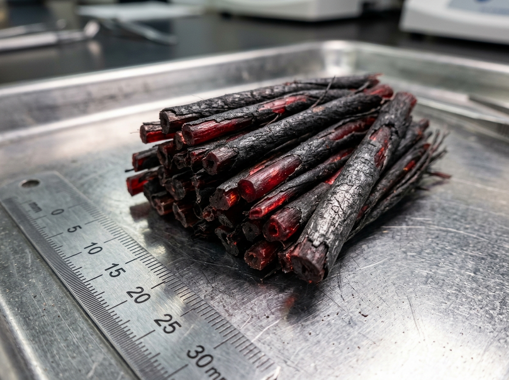
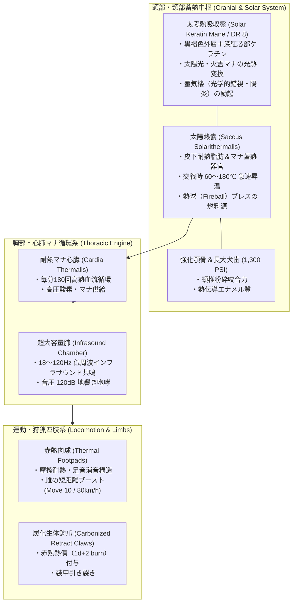
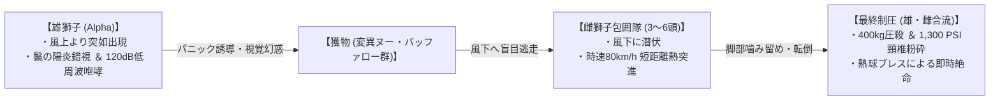

# 【陽炎巨鬣獅 パイロ・プライド・ライオン】（ヨウエンキョリョウシ／*Panthera leo solaris*／Pyro-Pride Lion）

---

## 1. 基本分類・メタデータ

| 項目 | 内容 |
| :--- | :--- |
| **和名** | 陽炎巨鬣獅（ヨウエンキョリョウシ）、陽炎獅子、パイロ・ライオン、サン・ライオン |
| **学名・分類** | *Panthera leo solaris*（急速変異種・食肉目 ネコ科 ヒョウ属 太陽獅子亜種） |
| **英名 / 通称** | Pyro-Pride Lion / Solar Mane Lion, Mirage King, Savannah Heat Beast |
| **発生起源** | **急速変異種（大型食肉哺乳類）**（2000年ミレニアム・アウェイクニングに伴い、東アフリカ・サバンナの強烈な太陽光およびサハラ特異点南部より噴出した高濃度火霊マナに晒された原種ライオンが数世代で適応変異） |
| **資源・食用区分** | **要処理種（Class-B / 要免許ジビエ）**（※高熱・引火性の「太陽熱嚢」および「火炎分泌腺」の完全摘出が必須。適切に下処理された赤身肉は滋養強壮の超高級ジビエとして認可流通） |
| **脅威度ランク** | **Threat Level: III（高度危険種 / 要重火器・サファリ武装コンボイ護衛推奨）** |
| **主要生息域** | 東アフリカ・サバンナアウトランド（ケニア・マサイマラ、タンザニア・セレンゲティ平原）、サハラ・ヴォイドゾーン南部境界ステップ |

### 視覚資料アーカイブ（Visual Archive）
| 生態観測写真（雄成体・夕暮れのサバンナ） | 太陽熱吸収鬣（ケラチン繊維マクロ標本写真） |
| :---: | :---: |
|  |  |
| *セレンゲティ保護区南部境界にて望遠観測（2026年）* | *国際マナ生物資源研究所（Nairobi Lab）提供標本（スケール付）* |

---

## 2. 生物学的特徴・形態

### 2.1 外見・身体構造
- **体長 / 肩高 / 体重**:
  - **雄（Alpha Male）**: 体長 2.8〜3.4m（尾長 1.1〜1.3m）、肩高 1.3〜1.5m、体重 320〜420kg（原種雄ライオンの約1.5倍・SM +1）。
  - **雌（Lioness）**: 体長 2.3〜2.7m（尾長 0.9〜1.1m）、肩高 1.1〜1.2m、体重 190〜260kg。
- **骨格・筋肉・咬合力**:
  - 骨密度は原種の約2倍に強化され、前肢・胸郭の筋量は成体ヒグマに匹敵する。
  - **咬合力**: 1,200〜1,400 PSI（約 8,000〜9,500 N）。犬歯長は 8.5〜10cm に達し、大型草食魔獣の頸椎を一撃で粉砕する。
- **太陽熱吸収鬣（ソーラー・ケラチン・メーン）**:
  - 雄の頭部から肩、胸部全体を覆う巨大な鬣は、通常の毛髪ではなく「炭化チタン類似の生体耐熱ケラチン」で構成される。
  - 外層は焦げた木炭のような黒褐色、芯部は半透明の深紅（ルビーレッド）であり、日中の強烈な太陽光（紫外線・赤外線）と環境中の火霊マナを効率的に光熱変換して体内に取り込む。
- **皮下「太陽熱嚢（*Saccus Solarithermalis*）」**:
  - 頸部・胸部の皮下に存在する特殊な耐熱脂肪・マナ共振器官。蓄積された熱エネルギーを維持し、交戦時には体温を局所的に 60℃〜180℃ まで急上昇させる。



### 2.2 変異・覚醒の経緯
- 2000年1月1日のミレニアム・アウェイクニング時、アフリカ大陸中央部のサハラ砂漠南端に「サハラ・ヴォイド特異点」が発生。南下した火霊マナストームがセレンゲティ・マサイマラの野生ライオンの群れ（プライド）を直撃した。
- 多くの個体が熱死・淘汰される中、太陽光と火霊マナをケラチン構造に固定化することに成功した個体群が生き残り、わずか数世代（約20年）で劇的な大型化と熱適応を完了。サバンナの生態系頂点捕食者「陽炎巨鬣獅」として定着した。

---

## 3. 生態・行動パターン

### 3.1 食性・プライド戦術包囲狩猟
- **主食**: 大型草食魔獣（変異ヌー、剛角バッファロー、サバンナシマウマ、アダマント・ライノの幼体など）。
- **戦術的熱波包囲狩猟（Thermal Mirage Tactics）**:
  1. **扇状包囲（雌獅子隊）**: 3〜6頭の雌が風下に回り込み、赤熱する足先で砂塵を上げずに獲物の周囲を半円状に包囲。
  2. **陽炎威圧・パニック誘導（雄獅子）**: 雄が風上から姿を現し、鬣から猛烈な陽炎（ミラージュ）と低周波咆哮（120dB）を放つ。獲物は雄の位置・距離感を錯視し、パニック状態で逃走する。
  3. **熱波挟み撃ち（Ambush & Strike）**: 逃げ惑う獲物を待ち伏せた雌が高速ダッシュ（80km/h）で急襲し、最後に追いついた雄が圧倒的な体重（400kg）と1,300 PSIの咬合力で頸椎を噛み砕いて即死させる。



### 3.2 縄張り・社会構造
- **プライドの構成**: 雄1〜2頭、血縁関係の雌4〜10頭、幼体数頭で構成される強固な家族集団。
- **縄張り範囲**: 1プライドあたり約 150〜300 $km^2$。縄張り境界の巨岩やバオバブの樹幹には、雄が鬣の熱を擦り付けて焼き焦がした「焦土マーキング（Scorched Mark）」が施される。

### 3.3 繁殖・ライフサイクル
- **寿命**: 野生下で 15〜20年、保護下で 25年。
- **幼体の成長**: 雌は一度に2〜4頭を出産。幼体は生後6ヶ月まで鬣が発現せず、母獅子の熱嚢から放射される微弱な温熱マナを受けて育つ。生後2年で狩猟に参加し、雄は3歳でプライドを離脱して単独放浪（ノーマッド）となる。

---

## 4. 魔導科学・生物学的考察

### 4.1 魔力現象と発現メカニズム
- **光学的陽炎障壁（《蜃気楼 / Mirage》現象）**:
  - 雄の鬣が蓄熱（60℃〜180℃）すると、頭部周辺の空気が激しい熱対流を起こし、光線の屈折率が連続的に変化する。
  - これにより、遠隔からの肉眼視・光学スコープによる照準において、ライオンの実体が「左右・上下に最大 1.5m 揺らいで見える（光学照準判定 -4）」。
- **熱球ブレス（《火球 / Fireball》励起）**:
  - 極度の興奮・防衛時、太陽熱嚢から高圧の熱分解油性ガスを咽頭部へ逆流させ、肺からの高圧呼気とともに前方コーン状（射程 10m）に 800℃の火炎弾を噴射する。
- **低周波威圧（《恐怖 / Fear》同調）**:
  - 咆哮時に放射される 18Hz〜25Hz の超低周波音（インフラサウンド）が、獲物の前庭器官および自律神経系を直撃し、一時的な運動麻痺・戦意喪失（Morale崩壊）を引き起こす。

### 4.2 科学的・電磁的相互作用
- **電子機器への非干渉**:
  - 本種が操る火霊現象は生体熱力学および光学的屈折現象であり、電磁パルス（EMP）や無線妨害は発生しない。
- **サーモグラフィ（赤外線センサー）への反応**:
  - 熱線放射量が極めて巨大であるため、サーマルビジョンでは白熱した巨大な熱源（Hot Spot）として遠距離（2km以上）から容易に探知可能。サファリ警戒ドローンはこの熱シグネチャを自動追尾して観光コンボイの安全を確保している。

### 4.3 音響・周波数・生体通信特性（Acoustic & Resonance Analysis）
- **地響き咆哮（Territorial Roar）**:
  - **インフラサウンド帯**: 18Hz〜120Hz（可聴域下限〜重低音）。地面を伝播し、半径 8〜10km 先のプライドや侵入者に到達。
  - **音圧**: 最大 **115〜120dB**（至近距離では人間の鼓膜を振動させ平衡感覚を奪う）。
- **プライド内近接通信（Chuffing & Purr）**:
  - 鼻を鳴らす挨拶音（250Hz〜500Hz、音圧 40dB）。

---

## 5. ガープス第4版（GURPS 4th）データブロック

```yaml
Name: 陽炎巨鬣獅 パイロ・プライド・ライオン (Pyro-Pride Lion - Alpha Male)
Archetype: 大型急速変異魔獣 / サバンナ頂点捕食種
Point Total: 310 pt
Threat Level: III (高度危険・要重火器)

Attributes:
  ST: 24 [140]     HP: 28 [8]
  DX: 13 [60]      WILL: 13 [15]
  IQ: 6 [-80]      PER: 13 [35]
  HT: 12 [20]      FP: 16 [12]

Basic Parameters:
  Basic Speed: 6.25 [0]
  Basic Move (Ground): 8 [0] (雌は Move 10 / スプリント 12)
  Size Modifier (SM): +1 (体長 3.0m, 体重 380kg)
  Dodge: 9

Damage:
  Bite: 2d+2 crushing / piercing (咬合力 1,300 PSI)
  Claw: 2d cutting + 1d-1 burning (赤熱鉤爪)

DR (防護点):
  - 頭部・頸部 (鬣): DR 8 (熱・炎に対して DR 15)
  - 胴体・四肢: DR 4 (熱・炎に対して DR 8)

Traits & Advantages:
  - 太陽熱蓄積体 / Damage Resistance (Heat/Fire Only) +7 [14]
  - 陽炎の揺らぎ / Enhanced Dodge 1 (遠隔射撃に対してのみ) [15]
  - 低周波咆哮 / Terror (Infrasound Roar, Will-3判定) [40]
  - 夜間視覚 / Night Vision 5 [5]
  - 鋭敏嗅覚・聴覚 / Acute Smell 2, Acute Hearing 2 [8]
  - 四足歩行 / Quadruped [-35]

Disadvantages & Quirks:
  - 肉食性・捕食衝動 / Carnivore [-1]
  - 寒冷脆弱 / Weakness (Cold/Freezing: 1d/min) [-20]
  - 縄張り執着 / Proud & Bad Temper (12) [-10]

Innate Spells (生体励起火霊魔術 - マナ消費はFP):
  - 《蜃気楼 / Mirage》: Skill 14 (常時励起 / 遠隔光学射撃に命中修正 -4)
  - 《火球 / Fireball》: Skill 13 (FP 3消費 / 前方コーン状 2d+2 爆発熱傷ダメージ / 射程 10m)
  - 《熱気 / Heat》: Skill 14 (FP 2消費 / 周囲5mの気温を急上昇させ敵のFPを毎ターン1削る)
```

---

## 6. 交戦マニュアル・防衛対策

### 6.1 有効な現代兵器・戦術
- **推奨火器・交戦規程**:
  - **小火器（9mm拳銃・5.56mm小銃）**: 雄の頭部・頸部鬣（DR 8）には跳弾・浅傷にとどまり、激昂させるため**使用非推奨**。
  - **有効火器**: **7.62mm NATO徹甲弾（AP）** 以上の自動小銃（FN SCAR-H、豊和20式7.62mm等）による胴体・後肢への集中射撃。
  - **制圧重火器**: サファリ護衛装甲車に搭載された **12.7mm M2重機関銃** または **40mm自動擲弾銃**。12.7mm弾の運動エネルギー（約18,000J）であれば鬣のDR 8を容易に貫通粉砕可能。
- **熱線・蜃気楼への対処**:
  - 光学スコープのみに頼ると陽炎錯視で狙点がずれるため、**ミリ波レーダー照準器** または **レーザー測距アクティブセンサー** による実測座標補正射撃が極めて有効。
- **消火・冷却戦術**:
  - 消防放水銃、液体窒素消火弾による急冷射撃。太陽熱嚢の温度が低下すると《蜃気楼》《火球》の発動が不能になり、動きが急激に鈍化する。

### 6.2 弱点・回避行動
- **弱点部位**: 鬣に覆われていない「下腹部」「後肢の腱」「鼻先」。
- **遭遇時の退避プロトコル**:
  - サバンナで単独遭遇した場合、背中を見せて走ることは厳禁（捕食スイッチが入る）。
  - 車両・コンボイ内にとどまり、防弾ガラスを閉め、クラクションや発煙筒（特に白煙・低温炭酸ガス）を使用して視界と嗅覚を遮断しつつ低速で後退する。

---

## 7. 解体・食利用・素材採取

### 7.1 食用利用と調理法（Class-B）
- **食用区分**: **要処理種（Class-B / 要免許ジビエ）**
- **下処理・解体プロトコル（太陽熱嚢摘出）**:
  1. **放血と急速冷却**: 討伐後15分以内に頸静脈を切開放血し、氷塊または冷却ゲルで胸部を急冷（体温が下がらないと肉が自己消化・変性する）。
  2. **熱嚢・火炎腺の完全摘出**: 頸部皮下の「太陽熱嚢」および口腔基部の「火炎分泌腺」を、ナイフで傷つけずに完全切除する（嚢を破ると高熱油が肉に流出し、強烈な焦げ臭と下痢・炎症を引き起こす）。
- **可食部位と風味**:
  - **太陽獅子ロース（Solar Tenderloin）**: 高タンパク・極低脂肪の美しい真紅の赤身肉。火霊マナの影響で肉繊維が極めて柔らかく、噛むとナッツのような香ばしさと濃厚な旨味が広がる。
  - **ステーキ・直火焼き**: 現地サファリロッジでは最高級ジビエステーキとして超富裕層に提供される（1ポンドあたり約300〜500ドル）。

### 7.2 素材採取と工業・魔導利用

| 採取部位 | 工業・魔導用途 | 経済価値・取引相場 |
| :--- | :--- | :--- |
| **太陽熱吸収鬣（毛皮）** | 先端耐熱消防服、宇宙航空用耐熱インシュレーター、火霊術士用魔導マント | 1頭分完全体: 300万〜500万円 |
| **炭化生体鉤爪（牙・爪）** | 近接格闘用タクティカルナイフ刃材、魔導装身具 | 1本: 15万〜30万円 |
| **太陽熱嚢抽出オイル** | 航空機用極低温不凍・耐熱特殊潤滑油、火霊薬（エリクサー）精製原料 | 1リットル: 80万円 |

- **バイオハザード・衛生上の注意**:
  - 解体前の死体は数時間高熱を放ち続けるため、乾燥したサバンナの枯れ草に引火して野火（山火事）を引き起こす危険がある。必ず難燃シート上で解体を行うこと。

---

## 8. 現場記録・調査員ログ

> *「セレンゲティ第4保護回廊で、武装サファリコンボイの先導を行っていた正午過ぎのことだ。水平線の陽炎の向こうに、黒と赤の巨大な影が揺らめいた。*  
> *双眼鏡を覗くが、蜃気楼のように像が二重三重にブレて定まらない。パイロ・プライド・ライオンの雄だ。推定400キロの巨体が、まるで空気そのものを燃やしながら悠然と立ち塞がっていた。*  
> *次の瞬間、大地がズズズ……と低く唸りを上げた。可聴域ギリギリの地響き咆哮だ。装甲車の窓ガラスがビリビリと共振し、乗客の観光客たちが一瞬でパニックに陥った。同時に、両脇のブッシュから熱い砂煙を上げて3頭の雌が飛び出してきた。挟み撃ちの完璧な布陣だ。*  
> *『全員伏せろ！ 撃ち下ろすな、12.7ミリで行く！』*  
> *車載のM2重機関銃を旋回させ、雄の胸元へ3点バーストを叩き込んだ。重たい12.7ミリ徹甲弾が雄の足元の岩を砕き、砂柱が吹き上がると、百獣の王はようやくこちらがただの獲物ではないと理解したらしい。赤く燃える瞳で我々を一瞥し、陽炎のヴェールの中に音もなく身を隠した。*  
> *あの鬣の揺らめきは、サバンナの太陽そのものだ。敬意と重機関銃を持たぬ者が足を踏み入れていい場所じゃない」*  
> —— **東アフリカ野生動植物保護庁 第1特科サファリレンジャー隊長 サミュエル・オディアンボ**（2026年 巡視記録より）
