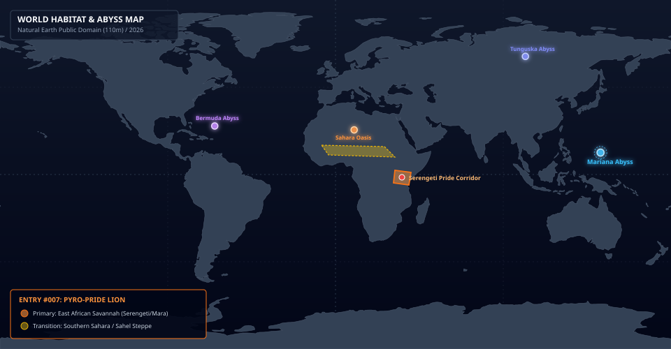
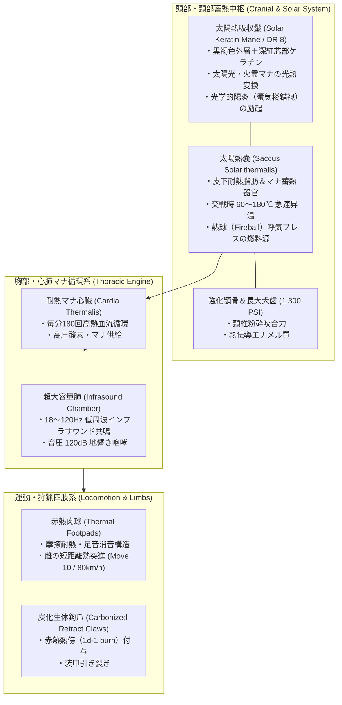
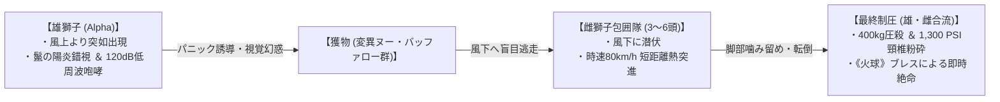

# 【カゲロウライオン】（陽炎獅子／*Panthera leo solaris*／Pyro-Pride Lion）

---

## 1. 基本分類・早わかり（Basic Classification & Fast Facts）

| 項目 | 内容 |
| :--- | :--- |
| **和名** | カゲロウライオン（陽炎獅子） |
| **和名命名規約** | **【形態・羽色型】**<br>※命名根拠: 雄の頭頸部を覆う耐熱ケラチン鬣の激しい放熱により、周囲の大気に猛烈な陽炎（蜃気楼）を励起させて実体を揺らがせる特異な形態的特徴に基づく。 |
| **英名 / 通称** | Pyro-Pride Lion / Solar Mane Lion, Mirage King, Savannah Heat Beast, 陽炎ライオン |
| **学名** | *Panthera leo solaris* |
| **学名語源** | *Panthera*（ヒョウ属）＋ *leo*（ライオン）＋ *solaris*（ラテン語: 太陽の、太陽光の） |
| **生物学的分類** | **綱**: 哺乳綱 Mammalia<br>**目**: 食肉目 Carnivora<br>**科**: ネコ科 Felidae<br>**属**: ヒョウ属 *Panthera*<br>**種**: ライオン *Panthera leo*<br>**変異亜種**: 太陽獅子亜種 *Panthera leo solaris* |
| **発生起源** | **急速変異種（大型食肉哺乳類）**（2000年マナ覚醒時、サハラ・オアシス特異点南部より流出した火霊マナおよび強烈な赤道直下太陽光に晒された原種ライオンが数世代で急速変異） |
| **資源・管理区分** | **要処理種（Class-B / 要免許ジビエ・素材採取）**<br>※管理ステータス: セレンゲティ・マサイマラ野生保護回廊指定管理種 / 認可サファリハンター管理捕獲対象 |
| **食性** | 完全肉食（変異ヌー、剛角バッファロー、サバンナシマウマ、アダマント・ライノの幼体等） |
| **寿命** | 野生下 15〜20年（保護区・飼育下 25年） |
| **サイズ・重量** | **雄成体**: 体長 2.8〜3.4m / 肩高 1.3〜1.5m / 体重 320〜420kg（SM +1）<br>**雌成体**: 体長 2.3〜2.7m / 肩高 1.1〜1.2m / 体重 190〜260kg |
| **直感的サイズ比較** | **【サファリ用装甲4WD（全長4.8m・車高1.9m）との比較】**<br>※雄の体高はサファリ四駆のボンネット高を凌駕し、体重400kgは成体ヒグマに匹敵。人間（180cm男性）の約2.5倍の体躯。 |
| **脅威度ランク** | **Threat Level: III（高度危険種 / 要重火器・サファリ武装コンボイ護衛推奨）** |
| **主要生息域** | **【一次生息地】** 東アフリカ・サバンナアウトランド（ケニア・マサイマラ、タンザニア・セレンゲティ平原）<br>**【境界ステップ】** サハラ・オアシス特異点南部サヘル移行帯 |

---

### 生息・分布マップ（Distribution & Habitat Range Map）



> **【生息分布データ】**:
> - **一次野生生息地（コア領域）**: 東アフリカ・セレンゲティ国立公園〜マサイマラ国立保護区アウトランド（標高 1,200〜1,800m サバンナ平原）
> - **回遊・出現警戒エリア**: サハラ特異点南部（サヘル地帯〜チャド湖盆地境界ステップ）
> - **環境耐性・生息限界**: 気温 18〜48℃ / 火霊マナ濃度 35〜95 mU/m³（※寒冷地・氷点下環境下では活動性激減）

---

### 視覚資料アーカイブ（Visual Archive）

| 生態観測写真（雄成体・夕暮れのサバンナ） | 太陽熱吸収鬣（ケラチン繊維マクロ標本写真） | 伝統料理写真（Class-Bジビエ） |
| :---: | :---: | :---: |
|  |  |  |
| *セレンゲティ保護区南部境界にて望遠観測（2026年）* | *国際マナ生物資源研究所（Nairobi Lab）提供標本（スケール付）* | *高級サファリロッジ提供『太陽獅子ロースステーキ・アカシア蜜ソース』* |

---

## 2. 伝承考証とマナ覚醒の架橋（Lore & Historical Bridge）

### 2.1 原典・古典文献の記録
1. **古代ギリシャ神話『ヘラクレスの十二の功業（ネメアの獅子）』**:
   - ネメアの谷に棲む巨獅子について、「刃物や矢を通さぬ鋼鉄のごとき頑強な毛皮を持ち、口から熱気を吐いて大地を焦がした」と記述。ヘラクレスは棍棒で気絶させた後に絞め殺し、その爪を用いて皮を剥ぎ鎧とした。
2. **古代エジプト神話『セクメト（Sekhmet / 太陽神ラーの眼）』**:
   - 太陽の灼熱と熱風、疫病を司る獅子頭の女神。「その吐息は砂漠の熱風（カムシン）となり、敵対する者を焼き尽くす」と記録され、太陽光と獅子の炎熱属性の結びつきを示す最古の文献記録。
3. **旧約聖書『士師記』第14章（サムソンと獅子）**:
   - ティムナのぶどう畑でサムソンが素手で引き裂いた若獅子の死骸にミツバチが巣を作り、甘い蜜を生み出した寓話。「強いものから甘いものが出た」という記述は、強烈な熱器官を持ちながらも極上の滋養肉をもたらす本種のジビエ特性と象徴的に符合する。

### 2.2 2000年マナ覚醒による生体科学的架橋
- 2000年1月1日のミレニアム・アウェイクニングに伴い、アフリカ大陸中央部のサハラ砂漠南端に「サハラ・オアシス特異点」が発生。南下した火霊マナストームがセレンゲティ・マサイマラの野生ライオンの群れ（プライド）を直撃した。
- 多くの個体が急性熱死・淘汰される中、高密度ケラチン構造に太陽光と火霊マナを固定化（光熱変換）することに成功した個体群が生存。わずか数世代（約20年）で劇的な骨密度強化・大型化（成体雄400kg）と熱適応を完了し、サバンナの頂点捕食者「カゲロウライオン」として定着した。

---

## 3. 生物学的特徴・ライフステージ（Biological Traits & Anatomy）

### 3.1 外見・解剖学的身体構造
- **骨格・筋肉・咬合力**:
  - 骨密度は原種の約2倍に強化され、前肢・胸郭の筋量は成体ヒグマに匹敵。
  - **咬合力**: 1,200〜1,400 PSI（約 8,000〜9,500 N）。犬歯長は 8.5〜10cm に達し、大型草食魔獣の頸椎を一撃で粉砕する。
- **太陽熱吸収鬣（ソーラー・ケラチン・メーン / 防護点 DR 8）**:
  - 雄の頭部から肩、胸部全体を覆う巨大な鬣は、炭化チタン類似の生体耐熱ケラチンで構成。
  - 外層は焦げた木炭のような黒褐色、芯部は半透明の深紅（ルビーレッド）であり、日中の強烈な太陽光（紫外線・赤外線）と環境中の火霊マナを効率的に光熱変換して体内に蓄積する。
- **皮下「太陽熱嚢（*Saccus Solarithermalis*）」**:
  - 頸部・胸部の皮下に存在する特殊な耐熱脂肪・マナ共振器官。蓄積された熱エネルギーを維持し、交戦時には局所的に体温を 60℃〜180℃ まで急上昇させる。



### 3.2 ライフステージとプライドの階級ドラマ
1. **幼体期（Cubhood / 0〜2歳）**:
   - 雌は1回の出産で2〜4頭を産む。幼体時は鬣が未発達で体毛は淡黄褐色の保護色。母獅子の太陽熱嚢から放射される温熱マナ（《暖房》）を受けて育つ。
2. **若獣・放浪期（Nomad Stage / 2〜4歳）**:
   - 2歳で狩猟に参加。雄は3歳でプライドから追放され、同世代の若雄と2〜3頭の「放浪連合（Nomad Coalition）」を形成してサバンナ辺境を放浪する。
3. **君臨期（Pride Alpha / 5〜12歳）**:
   - 既存プライドの支配雄に決闘を挑み、勝利した雄がプライドのリーダー（Alpha Male）として君臨。広大な縄張り（150〜300 $km^2$）を統率する。

---

## 4. 生態・人間社会摩擦・繁殖育児（Ecology & Ethology）

### 4.1 食性・戦術的熱波包囲狩猟
- **主食**: 大型草食魔獣（変異ヌー、剛角バッファロー、サバンナシマウマ、アダマント・ライノの幼体等）。
- **戦術的熱波包囲狩猟（Thermal Mirage Tactics）**:
  1. **扇状包囲（雌獅子隊）**: 3〜6頭の雌が風下に回り込み、赤熱する足先（Thermal Footpads）で砂塵を上げずに獲物の周囲を半円状に包囲。
  2. **陽炎威圧・パニック誘導（雄獅子）**: 雄が風上から姿を現し、鬣から猛烈な陽炎（光学的錯視）と120dBの低周波地響き咆哮を放つ。獲物は雄の位置・距離感を錯視し、パニック状態で風下へ盲目逃走する。
  3. **熱波挟み撃ち（Ambush & Strike）**: 逃げ惑う獲物を待ち伏せた雌が時速80km/hの短距離ダッシュで急襲して脚部を噛み留め、最後に追いついた雄が400kgの巨体と1,300 PSIの咬合力で頸椎を噛み砕いて即死させる。



### 4.2 人間社会との摩擦・サファリ防衛史
- **観光サファリコンボイとの摩擦**:
  - セレンゲティ国立公園内のサファリ観光ルートにおいて、陽炎によるドライバーの錯視事故や、コンボイのエンジン熱に誘引された雄ライオンの威嚇接触が多発。
  - 東アフリカ野生動植物保護庁（KWS/TANAPA）は、全サファリ車両に**「車載ミリ波レーダー」**および**「12.7mm重機関銃座を備えた特科サファリレンジャーの同乗」**を義務化。
- **先住民族マサイ族の伝統儀礼「オラマイヨ（Olamayio）」の変容**:
  - マサイ族の戦士（モラン）が一人前となるためのライオン単独狩猟儀礼「オラマイヨ」は、2000年の変異以降、従来の鉄槍では返り討ちに遭う事例が相次いだ。
  - 現代では、先祖伝来の呪具槍に「耐熱冷却ルーン」を施した特製対魔槍を用い、部族の誇りを賭けた儀礼として継承されている。
- **メガコーポによる密猟・利権紛争**:
  - 太陽熱吸収鬣（先端防護服素材）や太陽熱嚢オイル（航空用不凍潤滑油）を狙い、テイコク製薬やアズテク系の非公認PMCによる違法密猟が横行。保護庁レンジャー部隊との間で激しい武力衝突が続いている。

---

## 5. ガープス第4版（GURPS 4th）戦闘データ

```yaml
Name: カゲロウライオン (Pyro-Pride Lion - Alpha Male)
Archetype: 大型急速変異魔獣 / サバンナ頂点捕食種
Point Total: 310 pt
Threat Level: III (高度危険・要重火器)

Attributes:
  ST: 24 [140]     HP: 28 [8]
  DX: 13 [60]      WILL: 13 [15]
  IQ: 6 [-80]      PER: 13 [35]
  HT: 12 [20]      FP: 16 [12]

Basic Parameters:
  Basic Speed: 6.25 [0]
  Basic Move (Ground): 8 [0] (雌は Move 10 / スプリント 12)
  Size Modifier (SM): +1 (体長 3.0m, 体重 380kg)
  Dodge: 9

Damage:
  Bite: 2d+2 crushing / piercing (咬合力 1,300 PSI)
  Claw: 2d cutting + 1d-1 burning (赤熱生体鉤爪)

DR (防護点):
  - 頭部・頸部 (鬣): DR 8 (熱・炎に対して DR 15)
  - 胴体・四肢: DR 4 (熱・炎に対して DR 8)

Traits & Advantages:
  - 太陽熱蓄積体 / Damage Resistance (Heat/Fire Only) +7 [14]
  - 陽炎の揺らぎ / Enhanced Dodge 1 (遠隔光学射撃に対してのみ) [15]
  - 低周波咆哮 / Terror (Infrasound Roar, Will-3判定) [40]
  - 夜間視覚 / Night Vision 5 [5]
  - 鋭敏嗅覚・聴覚 / Acute Smell 2, Acute Hearing 2 [8]
  - 四足歩行 / Quadruped [-35]

Disadvantages & Quirks:
  - 肉食性・捕食衝動 / Carnivore [-1]
  - 寒冷脆弱 / Weakness (Cold/Freezing: 1d/min) [-20]
  - 縄張り執着 / Proud & Bad Temper (12) [-10]

Innate Spells (生体励起火霊魔術 - マナ消費はFP):
  - 《加熱 / Heat》: Skill 14 (FP 2消費 / 周囲5mの気温を急上昇させ敵のFPを毎ターン1削る)
  - 《火球 / Fireball》: Skill 13 (FP 3消費 / 前方コーン状 2d+2 爆発熱傷ダメージ / 射程 10m)
  - 《火吹き / Breathe Fire》: Skill 14 (FP 2消費 / 口腔より 1d+2 火炎放射)
  - 光学的陽炎励起 (常時励起 / 遠隔光学射撃判定に -4 ペナルティ)
```

---

## 6. 軍事対処・防護プロトコル（Military & Tactics）

### 6.1 推奨火器・交戦規程
- **小火器（9mm拳銃・5.56mm小銃）の無力化**:
  - 雄の頭部・頸部鬣（DR 8）に対して小口径弾は跳弾・浅傷にとどまり、個体を激昂させるため**使用厳禁**。
- **有効火器**:
  - **7.62mm NATO徹甲弾（AP）** 以上の自動小銃（FN SCAR-H、豊和20式7.62mm等）による胴体・後肢への集中射撃。
  - **制圧重火器**: サファリ護衛装甲車に搭載された **12.7mm M2重機関銃** または **40mm自動擲弾銃**。12.7mm弾の圧倒的運動エネルギー（約18,000J）であれば鬣のDR 8を容易に貫通粉砕可能。
- **熱線・蜃気楼への対処**:
  - 光学スコープのみに頼ると陽炎錯視で狙点がブレるため、**ミリ波レーダー照準器** または **レーザー測距アクティブセンサー** による実測座標補正射撃が極めて有効。
- **消火・冷却急冷戦術**:
  - 消防高圧放水銃、液体窒素消火弾による急冷射撃。太陽熱嚢の温度が急低下すると熱球ブレスや陽炎励起が不能になり、運動性が著しく低下する。

### 6.2 弱点・回避行動
- **弱点部位**: 鬣に覆われていない「下腹部」「後肢の腱」「鼻先」。
- **遭遇時の退避プロトコル**:
  - 単独遭遇時、背中を見せて走ることは絶対厳禁（捕食スイッチが入る）。
  - 車両内にとどまり、防弾ガラスを閉め、クラクションや白煙・低温炭酸ガス発煙筒を用いて視界と嗅覚を遮断しつつ低速後退する。

---

## 7. 解体・食利用・素材採取（Cuisine & Harvesting）

### 7.1 食用利用と調理法（Class-B）
- **食用区分**: **要処理種（Class-B / 要免許ジビエ）**
- **下処理・解体プロトコル（太陽熱嚢摘出）**:
  1. **放血と急速冷却**: 討伐後15分以内に頸静脈を切開放血し、氷塊または冷却ゲルで胸部を急冷（熱が残ると肉が自己消化・変性する）。
  2. **熱嚢・火炎腺の完全摘出**: 頸部皮下の「太陽熱嚢」および口腔基部の「火炎分泌腺」を、ナイフで傷つけずに完全切除（嚢を破ると高熱油が肉に流出し、強烈な焦げ臭と急性下痢・消化器炎症を引き起こす）。
- **可食部位と風味**:
  - **太陽獅子ロース（Solar Tenderloin）**: 高タンパク・極低脂肪の美しい真紅の赤身肉。火霊マナの影響で肉繊維が極めて柔らかく、噛むとナッツのような香ばしさと濃厚な旨味が広がる。
  - **ステーキ・直火焼き**: 現地高級サファリロッジでは『太陽獅子ロースステーキ・アカシア蜜ソース』として超富裕層に提供される（1ポンドあたり約300〜500ドル）。

### 7.2 素材採取と工業・魔導利用

| 採取部位 | 工業・魔導用途 | 経済価値・取引相場 |
| :--- | :--- | :--- |
| **太陽熱吸収鬣（毛皮）** | 先端耐熱消防服、宇宙航空用耐熱インシュレーター、火霊術士用魔導マント | 1頭分完全体: 300万〜500万円 |
| **炭化生体鉤爪（牙・爪）** | 近接格闘用タクティカルナイフ刃材、魔導装身具 | 1本: 15万〜30万円 |
| **太陽熱嚢抽出オイル** | 航空機用極低温不凍・耐熱特殊潤滑油、火霊薬（エリクサー）精製原料 | 1リットル: 80万円 |

- **バイオハザード・衛生上の注意**:
  - 解体前の死体は数時間高熱を放ち続けるため、乾燥したサバンナの枯れ草に引火して野火（山火事）を引き起こす危険がある。必ず難燃シート上で解体を行うこと。

---

## 8. 現場記録・調査員ログ（Field Log）

> *「セレンゲティ第4保護回廊で、武装サファリコンボイの先導を行っていた正午過ぎのことだ。水平線の陽炎の向こうに、黒と赤の巨大な影が揺らめいた。*  
> *双眼鏡を覗くが、蜃気楼のように像が二重三重にブレて定まらない。カゲロウライオンの雄だ。推定400キロの巨体が、まるで空気そのものを燃やしながら悠然と立ち塞がっていた。*  
> *次の瞬間、大地がズズズ……と低く唸りを上げた。可聴域ギリギリの地響き咆哮だ。装甲車の窓ガラスがビリビリと共振し、乗客の観光客たちが一瞬でパニックに陥った。同時に、両脇のブッシュから熱い砂煙を上げて3頭の雌が飛び出してきた。挟み撃ちの完璧な布陣だ。*  
> *『全員伏せろ！ 撃ち下ろすな、12.7ミリで行く！』*  
> *車載のM2重機関銃を旋回させ、雄の足元の岩盤へ3点バーストを叩き込んだ。重たい12.7ミリ徹甲弾が岩を砕き、砂柱が吹き上がると、百獣の王はようやくこちらがただの獲物ではないと理解したらしい。赤く燃える瞳で我々を一瞥し、陽炎のヴェールの中に音もなく身を隠した。*  
> *あの鬣の揺らめきは、サバンナの太陽そのものだ。敬意と重機関銃を持たぬ者が足を踏み入れていい場所じゃない」*  
> —— **東アフリカ野生動植物保護庁 第1特科サファリレンジャー隊長 サミュエル・オディアンボ**（2026年 巡視記録より）

---

## 9. 関連研究・派生種（Related Research & Subspecies）

1. **サハラ灼熱亜種（*Panthera leo saharae*）**:
   - サハラ・オアシス特異点中心部周辺の極限乾燥ステップに生息する小型・超高熱特化型亜種（体重220〜280kg）。体色は完全な砂金色で、体温が常時90℃前後に達する。
2. **カラハリ砂漠黒鬣種（*Panthera leo kalahariensis*）**:
   - 南部アフリカ・カラハリ砂漠に生息する夜行性変異種。日中に蓄熱したエネルギーを夜間の急激な放射冷却環境下で放出し、暗闇で赤熱発光しながら単独狩猟を行う。
3. **メガコーポ特許情報**:
   - **ヤマト重工**: 特許第2024-88912号『カゲロウライオン鬣ケラチン抽出物を用いた次世代航空機用断熱コーティング材』
   - **テイコク製薬**: 特許第2025-01443号『太陽熱嚢リピッド由来の持続性生体温熱パッチ剤』
