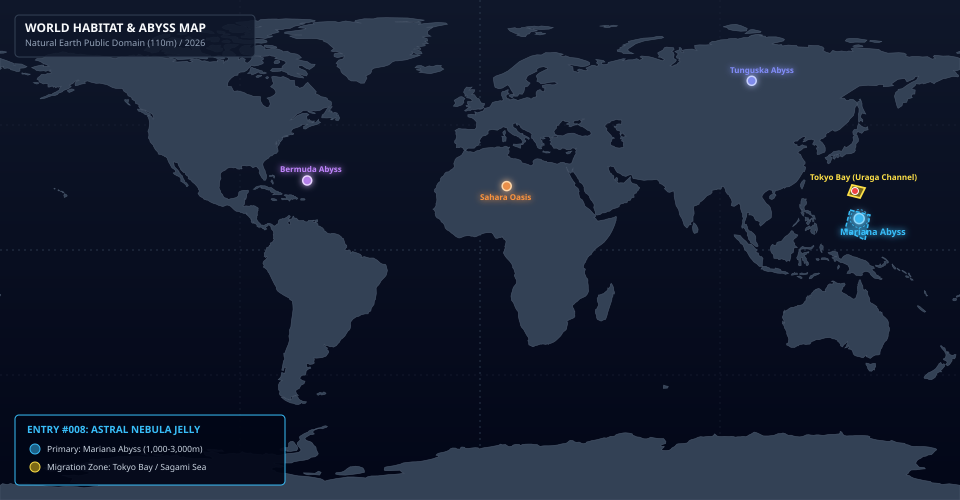
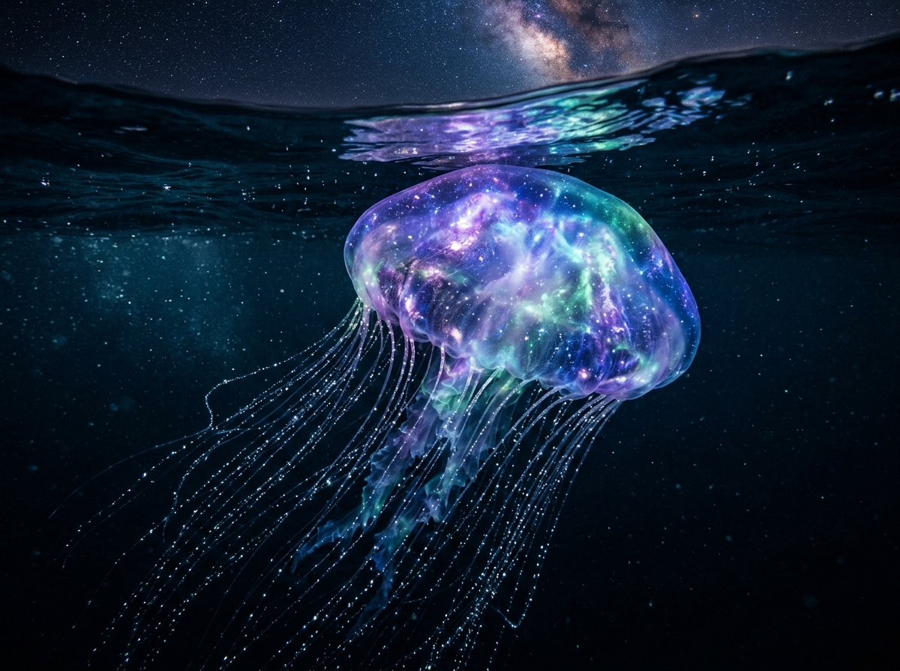
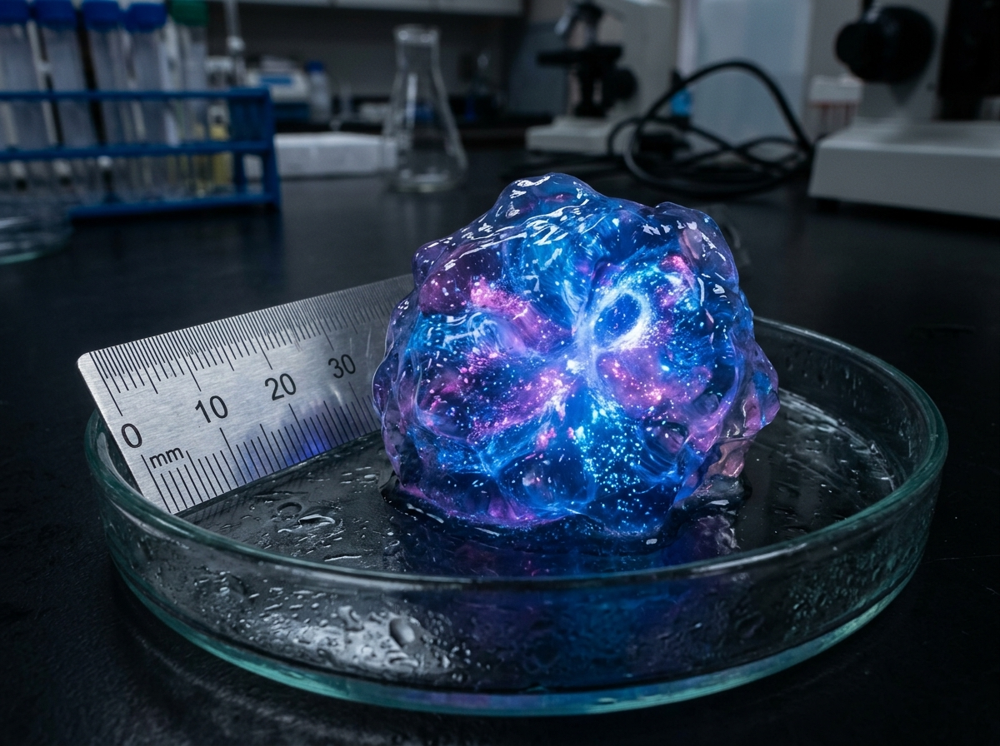
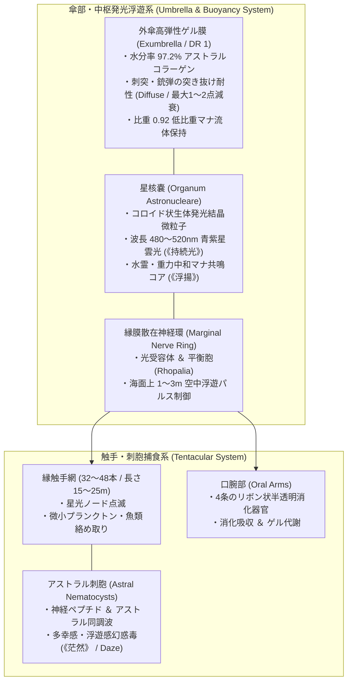
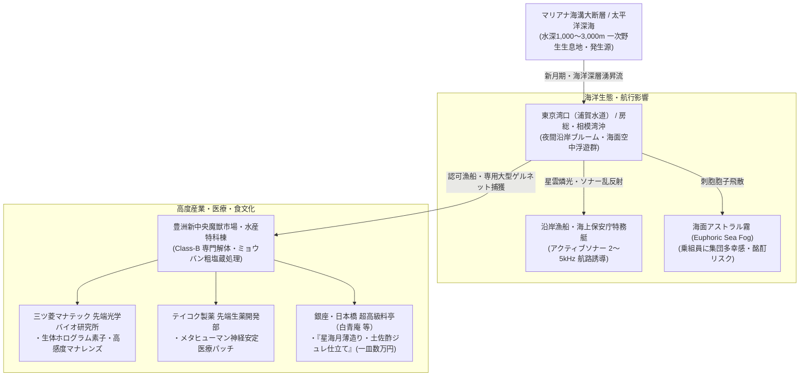

# 【幽光星海月】（ユウコウホシクラゲ／*Aurelia astralis*／Astral Nebula Jelly）

---

## 1. 基本分類・早わかり（Basic Classification & Fast Facts）

| 項目 | 内容 |
| :--- | :--- |
| **和名** | 幽光星海月（ユウコウホシクラゲ） |
| **和名命名規約** | **【形態・環境型】**<br>※命名根拠: 傘内部に星雲状の自発光コア（幽光）を抱く半透明の巨躯と、新月期の夜間海面および洋上大気に浮遊する生態環境に基づく。 |
| **英名 / 通称** | Astral Nebula Jelly / Starlight Medusa, Cosmic Drifter, Celestial Bloom, 星雲海月（セイウンクラゲ） |
| **学名** | *Aurelia astralis* |
| **学名語源** | *Aurelia*（ラテン語: 金色・月・ミズクラゲ属）＋ *astralis*（ラテン語: 星の、星辰の、アストラル界の） |
| **生物学的分類** | **門**: 刺胞動物門 Cnidaria<br>**綱**: 鉢クラゲ綱 Scyphozoa<br>**目**: 旗口クラゲ目 Semaeostomeae<br>**科**: ミズクラゲ科 Ulmaridae<br>**属**: 幽光星海月属 *Aurelia*<br>**種**: 幽光星海月 *Aurelia astralis*<br>**変異亜種**: 太平洋アビス深海型 *A. a. profunda* |
| **発生起源** | **異界流入・深海覚醒種（アビス種）**（マリアナ海溝・太平洋アビス大断層深海域 1,000〜3,000m 起源） |
| **資源・管理区分** | **要処理種（Class-B / 要免許ジビエ・素材）**<br>※管理ステータス: 浦賀水道特定航路警戒種・認可漁業者管理水揚げ指定 |
| **食性** | 肉食・マナ食（海洋性動物プランクトン、小型魚類、浮遊アストラルマナ残滓） |
| **寿命** | 野生メデューサ成体 3〜5年（深海底ポリプ期 2〜10年） |
| **サイズ・重量** | 傘径 2.5〜4.5m / 触手長 15〜25m / 湿重量 150〜300kg |
| **直感的サイズ比較** | **【大型路線バス（全長10m）との比較】**<br>※傘の直径（約3.5m）は路線バスの車幅（2.5m）を上回り、触手を伸ばすとバス2台分の長さに匹敵。 |
| **脅威度ランク** | **Threat Level: II（警戒対象 / 非好戦的・広範囲幻惑・航行ソナー障害）** |
| **主要生息域** | **【一次生息地】** 太平洋アビス大断層（水深1,000〜3,000m）<br>**【回遊・出現】** 東京湾口アビスベイ（浦賀水道〜房総・相模湾沖）、新月期の外洋湧昇流域 |

---

### 生息・分布マップ（Distribution & Habitat Range Map）



> **【生息分布データ】**:
> - **一次野生生息地（原産地）**: マリアナ海溝・太平洋アビス大断層（水深 1,000〜3,000m 深海域）
> - **回遊・出現警戒エリア**: 東京湾口（浦賀水道要塞線外縁）〜房総半島沖・相模湾
> - **環境耐性・生息限界**: 水温 2〜22℃ / アストラルマナ濃度 45〜150 mU/m³


---

### 視覚資料アーカイブ（Visual Archive）

| 生態観測写真（野生環境・夜間空中浮遊） | 採取標本・組織マクロ写真（星核嚢） | 伝統料理写真（Class-Bジビエ） |
| :---: | :---: | :---: |
|  |  |  |
| *東京湾口アビスベイ（浦賀水道沖）にて夜間洋上撮影（2026年）* | *海洋研究開発機構（JAMSTEC-M）提供標本（スケール付）* | *銀座「白青庵」提供『星海月薄造り・土佐酢ジュレ仕立て』* |

---

## 2. 伝承考証とマナ覚醒の架橋（Lore & Historical Bridge）

### 2.1 原典・古典文献の記録
1. **大プリニウス『博物誌（Naturalis Historia）』第9巻（古代ローマ）**:
   - 地中海の夜光性クラゲ「プルモ・マリヌス（*Pulmo Marinus* / 海の肺）」について、「暗夜において木製の杖の先につけると青白い光を放ち、松明のように周囲を照らし出す」と記録。
2. **中世ウェールズ・英国民間伝承「星のゼリー（Star Jelly / Pwdre Ser）」**:
   - 流れ星が落ちた海面や沿岸岩礁に残されるという半透明の発光粘性体。古来より「天体の霊気が凝縮した星辰の落とし子」として語り継がれてきた。
3. **外洋現象「乳白色の海（Milky Seas）」**:
   - 夜間の大洋において数百平方キロメートルにわたり海面が一様に発光する海洋現象。古代・中世の船員たちの航海日誌に「星空の中を航行するがごとき幻惑海」として頻出する。

### 2.2 2000年マナ覚醒による生体科学的架橋
- 2000年1月1日のミレニアム・アウェイクニングに伴い、マリアナ海溝底の「太平洋アビス大断層」から噴出した高濃度のアストラル界（精神・星辰プレーン）マナ流に、深海浮遊性のクダクラゲ類および旗口クラゲ類が晒された。
- 水分率97%以上のコラーゲン組織がアストラルマナの波長（480〜520nm）と完全同調。物理的な重力影響を減衰させる生体浮力（《浮揚》）と、ルシフェリン微粒子を高密度凝縮した球状器官「星核嚢」を獲得し、深海から夜間の浅海・海面上へと生息域を拡大した。

---

## 3. 生物学的特徴・ライフステージ（Biological Traits & Anatomy）

### 3.1 外見・解剖学的身体構造
- **傘径 / 触手長 / 湿重量**:
  - **傘径（Bell Diameter）**: 2.5〜4.5m（SM +2）。
  - **触手長（Tentacle Length）**: 15〜25m（傘縁から最大 32〜48本の半透明触手が垂下）。
  - **湿重量**: 150〜300kg（体内組成の 97.2% が水分および高分子アストラルコラーゲンゲル）。
- **傘の構造と「星核嚢（*Organum Astronucleare*）」**:
  - 傘の外層は完全な透明で、内部中央に直径 40〜60cm の球状発光器官「星核嚢」を内包。
  - 星核嚢の内部には、自発光性ルシフェリン結晶微粒子がコロイド状に浮遊し、まるで渦巻銀河や星雲（Nebula）のような青紫・エメラルドグリーンの光を脈動放射する。
- **刺胞・触手網と捕食摂食機能美**:
  - 触手には数百万個の「アストラル刺胞（Astral Nematocysts）」が配列。微細な光のノード（節）のように等間隔で点滅し、夜間の海中で星の糸のようなカーテンを形成。獲物に激痛を与えず弛緩昏睡させ、4条のリボン状口腕で傘内部へ引き込んで酸分解丸呑みする。



### 3.2 ライフステージと繁殖・群れの階級ドラマ
1. **幼体・ポリプ期（ストロビラ / Polyp & Strobila）**:
   - 深海1,000〜3,000mの岩盤に定着する微小な青色結晶状ポリプ（体高5〜10mm、SM -8）。周囲のアストラルマナを吸収して無性生殖（出芽）を繰り返し、成熟するとエフィラ幼生として遊泳を開始する。
2. **成熟成体（Standard Adult）**:
   - 傘径2.5〜4.5m、触手長15〜25m（SM +2、Threat Level II）。夜間に浅海へ浮上し、海面上1〜3mの空中ドリフト浮遊を行う標準的な個体。
3. **巨星主級「星雲核」（Elder Alpha / Nebula Core）**:
   - 傘径 5.5〜6.5m、触手長 30m超（SM +3、Threat Level III）。樹齢数十年相当のアストラルマナを蓄積した長寿巨大個体。
   - 星核嚢の輝度は通常個体の3倍以上に達し、群れの中心で「共鳴中継塔」として機能。散在神経環から強力なマナ同期波を発信し、半径数kmの海面一帯を青く染め上げ、数千匹の群れの浮遊リズムを統率する。

---

## 4. 生態・食物連鎖・人間社会との摩擦（Ecology & Human Conflict）

### 4.1 食性・捕食行動
- **主食・栄養源**: 海洋性動物プランクトン、小型魚類（カタクチイワシ、サバ幼魚等）、および海中の浮遊アストラルマナ残滓。
- **星光カーテン捕食（Cosmic Curtain Trapping）**:
  - 夜間、星核嚢の燐光と触手の点滅ノードを明滅させ、走光性を持つ小魚や甲殻類を誘引。
  - 触手に触れた獲物は即座にアストラル毒で麻痺・多幸昏睡状態（《茫然》）に陥り、口腕によって傘の内側へと運ばれてゆっくりと消化吸収される。



### 4.2 魔獣間クロス・リレーション（相互作用）
- **深海アビス種との競合・共生**:
  - 太平洋アビス大断層深部において、高次異次元種「千眼触手星雲 アビス・ポリプ」の周辺に群生し、高濃度マナの余波を吸収して成長する相利共生的側面を持つ。
- **沿岸魚類・捕食魔獣との関係**:
  - アストラル刺胞毒に免疫を持つ一部の深海甲殻類や大型ウミガメ変異種が本種の傘ゲルを捕食する。

### 4.3 人間社会との摩擦・利用・保護史（Human-Creature Interactions）
- **海洋防護インフラと航路確保**:
  - 浦賀水道要塞線では、新月期の星辰ブルームに伴い大型貨物船のスクリュー巻き込み事故やソナー乱反射が多発。海上保安庁特務艇がアクティブソナー（2〜5kHz）を用いて航路啓開パトロールを実施している。
- **沿岸アストラル霧被害と防毒対策**:
  - 風上に大群が浮遊すると、海面に「多幸性アストラル霧」が発生。無防備な漁船乗組員が集団酩酊・操舵不能に陥る事例があり、全船舶に微粒子防毒マスクの常備が義務付けられている。
- **メガコーポ乱獲防止と認可漁業**:
  - 三ツ菱マナテックの先端光学素子原料として高額取引されるため、一時期密猟が横行。現在は豊洲中央流通HDおよび水産庁の厳格な「認可漁獲枠（クオータ制）」により管理されている。

---

## 5. 魔導科学・上位神性・背景ロア（Thaumaturgical Theory & Lore）

### 5.1 魔力現象と発現メカニズム
- **重力減衰浮遊（生体励起《浮揚 / Levitation》）**:
  - 傘ゲル内のアストラルコラーゲン繊維が、地球磁場および水面のマナ張力と反発する「逆極性マナ斥力」を励起。自重の約95%を相殺し、空中ドリフトを可能にしている（`world/magic/spells/movement.md#L48`）。
- **アストラル幻惑毒（生体励起《茫然 / Daze》）**:
  - 刺胞から注入される神経ペプチドは、標的の脳神経シナプスに作用すると同時にアストラル体を弛緩させる。被毒者は物理的激痛をほとんど感じず、「満天の星空を飛んでいるような圧倒的多幸感と脱力」に包まれ、抵抗意思を喪失する（`world/magic/spells/mind.md#L57`）。
- **常夜星光（生体励起《持続光 / Continual Light》）**:
  - 星核嚢が放つ光は熱を一切伴わない冷光（Cold Light）であり、暗闇の水中を半径 50m 以上照らし出す（`world/magic/spells/light_darkness.md#L42`）。
- **流体ゲル肉体（生体特徴 `Diffuse`）**:
  - 水分率97.2%のゲル肉体により、小口径実弾や刺突攻撃のダメージを1〜2点に減衰・無力化する（`world/magic/rules/damage_and_tactics.md#L30`）。

### 5.2 音響・周波数・生体通信特性（Acoustic & Resonance Analysis）
- **水中水流拍動（Pulsing Hydro-Acoustics）**:
  - **超低周波拍動**: 0.5Hz〜5Hz（傘の収縮運動に伴う微小水流パルス）。
  - **マナ共振音（Resonance Hum）**: 432Hz / 音圧 25〜40dB（高位術士やメタヒューマンのエルフのみが聴取可能な微弱な「ハミング音」）。

### 5.3 上位存在・アビス因果・メガコーポ伏線
- **星辰プレーン（アストラル界）の生体アンテナ**:
  - 本種はアストラル界上位霊峰に存在する「星辰の海（Celestial Sea）」の波長を物質界で受信する生体共鳴アンテナであるとされる。
- **メガコーポの光学・医療利権**:
  - 三ツ菱マナテックは本種の星核嚢から抽出したコロイド結晶を用いて次世代「生体ホログラム投影素子」を独占製造。テイコク製薬はアストラル毒ペプチドを精製したメタヒューマン専用の「抗PTSD精神安定医療パッチ」の特許を保有している。

---

## 6. 交戦マニュアル・都市防災コラム（Combat Manual & Civil Defense）

### 6.1 GURPS 4th Stat Block（戦闘データ）

#### 【通常成体（Standard Adult）】
```yaml
Name: 幽光星海月（ユウコウホシクラゲ／Astral Nebula Jelly）
Archetype: 巨大異界流入浮遊刺胞魔獣 / 深海・発光種
Point Total: 180 pt
Threat Level: II (警戒対象 / 非好戦的・広範囲幻惑)

Attributes:
  ST: 10 [0]       HP: 16 [12]
  DX: 11 [20]      WILL: 10 [0]
  IQ: 2 [-160]     PER: 11 [5]
  HT: 12 [20]      FP: 14 [6]

Basic Parameters:
  Basic Speed: 5.75 [0]
  Basic Move (Water/Swim): 3 [-10]
  Basic Move (Air/Levitation): 2 [-15]
  Size Modifier (SM): +2 (傘径 3.0m, 触手長 20m, 湿重量 220kg)
  Dodge: 8

Damage:
  Tentacle Touch: 1d-3 cr + 特殊アストラル刺胞毒

DR (防護点) & 防御特性:
  - 傘部・触手: DR 1
  - ゲル状肉体 / Injury Tolerance (Diffuse: 刺突・銃弾ダメージを1〜2点に減衰) [100]
  - 脳・心臓弱点なし / No Vitals, No Brain [10]

Traits & Advantages:
  - 水中呼吸＆海面浮遊 / Amphibious & Flight (Lighter Than Air -10%, Low Ceiling 3m -20%) [28]
  - 生体星光放射 / Illumination (Radius 10m, Switchable) [5]
  - アストラル幻惑刺胞毒 / Affliction 2 (Will-2判定失敗で1d6時間多幸感・朦朧Daze状態) [30]
  - 360度感覚 / 360-Degree Vision (散在神経環) [25]

Disadvantages & Quirks:
  - 脆弱な乾燥耐性 / Dependency (Salt Water: 毎分1HP減少) [-20]
  - 非好戦的 / Pacifism (Self-Defense Only) [-15]
  - 音波脆弱 / Vulnerability (Sonic Shockwave x2) [-15]

Innate Spells (生体励起水霊・精神魔術 - マナ消費はFP):
  - 《浮揚 / Levitation》: Skill 13 (常時励起 / 水中〜海面上3mを無重力浮遊)
  - 《茫然 / Daze》: Skill 14 (FP 2消費 / 触手接触時に精神同調波を送り込み意識を麻痺)
  - 《持続光 / Continual Light》: Skill 15 (FP 1消費 / 星核嚢の燐光を最大輝度にブースト)
```

#### 【巨星主級「星雲核」（Elder Alpha / Nebula Core）】
- **能力値修正**: ST 15 [50], HP 28 [24], SM +3 (傘径 6.0m, 触手長 32m, 湿重量 650kg), Threat Level: III
- **追加特性**:
  - 広域共鳴発光 / Illumination (Radius 50m, Group Synchronization) [15]
  - 群れ統率マナ共鳴パルス / Mind Control (Area Effect 500m, Jellyfish Only -80%) [10]
  - 刺胞毒強化 / Affliction 3 (Will-4判定) [45]

### 6.2 推奨火器・防護装備
- **小火器射撃厳禁**: 散弾銃や小銃（5.56mm/7.62mm）で射撃しても、ゲル肉体を弾丸が突き抜けるだけで効果がなく（Diffuse）、破片が飛び散って刺胞毒が空気中に拡散するため**射撃は厳禁**。
- **有効装備**:
  - **アクティブソナー（2〜5kHz中周波パルス）**: 平衡胞を刺激して急速潜航・退避させる特効戦術。
  - **消防高圧放水銃**: 船体に接近した個体を傷つけずに安全に押し戻す。
  - **密閉型防毒マスク（P3微粒子フィルター付）**: 海面アストラル霧の吸入防止。

### 6.3 市民防災メモ ＆ 専門家の知恵袋

> [!IMPORTANT]
> **【東京湾沿岸・船舶向け防災指針：幽光星海月ブルーム発生時】**
> 1. **夜間航行時の減速・見張り強化**: 新月期の夜間に青紫色の発光帯を確認した場合、即座に船速を微速前進（5kt以下）に落とし、スクリューへの触手巻き込みを防止せよ。
> 2. **防毒マスク・換気停止**: 海面霧が発生している場合、船室の密閉および微粒子防毒マスクを着用せよ。多幸感・浮遊感を感じた乗組員は直ちに甲板作業から離脱させ、安静室へ隔離すること。  
> —— *海上保安庁 第3管区海上保安本部 特務防災課*

> [!TIP]
> **【現場専門家・ベテラン哨戒艇長の知恵袋】**
> *「新月の夜、東京湾の浦賀水道を巡視艇で走っていると、天の川がそのまま海に落ちてきたような光景に出くわす。見とれてる暇はない。絶対に銃は撃つな。撃てば毒胞子が甲板に舞って全員が満面の笑みでヘラヘラ座り込む羽目になる。船載ソナーを『ピーン』と2キロヘルツで一発鳴らせば、あいつらは驚いてスーッと深海へ帰っていく。優雅に道を譲ってもらうのが海の流儀だ」*  
> —— **海上保安庁 第3管区特務海洋哨戒艇「うらなみ」 艇長 瀬崎 浩二**

---

## 7. 解体・ジビエ食文化・料理レシピ（Harvesting & Cuisine）

### 7.1 解体プロトコルと市場相場（Class-B）
- **食用区分**: **要処理種（Class-B / 要免許ジビエ・水産）**
- **伝統的脱毒・塩蔵プロトコル**:
  1. **触手・口腕の即時切除**: 水揚げ直後、防護手袋とフェイスシールドを着用し、毒性の高い触手と口腕を基部から完全に切除・焼却廃棄する。
  2. **ミョウバン・粗塩漬け（脱水不活化）**: 傘のゲルを海水濃度の塩水とミョウバン（硫酸アルミニウムカリウム）に48時間漬け込み、アストラル毒ペプチドを完全変性・不活化させる。
- **市場取引相場**:
  - 脱毒処理済みの傘ゲルは、豊洲新中央魔獣市場において **1kgあたり 15,000〜25,000円** の超高値で取引される。

### 7.2 伝統料理・メガコーポスペシャリテ（本格レシピ）

```
【料理名】星海月薄造り・土佐酢ジュレ仕立て（銀座「白青庵」スペシャリテ）
- 分類: メガコーポ迎賓館・銀座超高級会席料理
- 主材料:
  - 脱毒幽光星海月 傘ゲル薄切り: 120g
  - 土佐酢ジュレ（鰹出汁、薄口醤油、みりん、米酢、吉野葛）: 40g
  - 薬味: 花穂紫蘇、青紫蘇、おろし生姜、すだち輪切り、金箔
- 調理手順:
  1. 【塩抜き・氷締め】: 48時間塩蔵された星海月ゲルを真水で半日かけて丁寧に塩抜きし、氷水でキリリと締める。
  2. 【薄造り】: 柳刃包丁を寝かせ、向こう側が透けて見えるほど極薄（1.5mm）にそぎ切りにする。
  3. 【盛り付け】: 深みのある藍色・黒漆の平皿に放射状（銀河の渦状）に美しく並べ、中央に冷やした土佐酢ジュレを盛り、花穂紫蘇と金箔を散らす。
- テイスティングノート:
  - コリコリとした心地よい弾力と、舌の上でフワリと溶けるアストラルゲルの極上の清涼感。
  - 噛みしめるほどに上品な潮の甘みが広がり、食後には頭がスッキリと冴え渡る微弱なアストラル・リフレッシュ効果をもたらす。一皿 35,000円。
```

### 7.3 産業素材・先端医療利用

| 採取部位 | 工業・魔導用途 | 経済価値・取引相場 |
| :--- | :--- | :--- |
| **星核嚢（アストラル・コアゲル）** | 三ツ菱マナテック製「生体ホログラム投影素子」、高感度マナ光学レンズ | 1個体分: 120万〜200万円 |
| **脱毒アストラルコラーゲン** | テイコク製薬製 メタヒューマン神経安定パッチ、抗PTSD精神医療用軟膏 | 100g: 8万円 |
| **発光ルシフェリン抽出液** | 深海探査用無電源コールドライト、魔導バイオマーカー試薬 | 500ml: 35万円 |

---

## 8. 現場記録・通信ログ（Field Logs & Transcripts）

```
【海上保安庁 第3管区特務海洋哨戒艇 特科無線交信ログ】
日時: 2026年5月18日 02:14 JST
発信: 特務哨戒艇「うらなみ」（浦賀水道・第3同心円外縁哨戒中）
受信: 第3管区海上保安本部 運用管制室

うらなみ:「管制、こちら『うらなみ』。観音崎沖南東3マイル海域にて、大規模な生体発光群を視認。
           海面直下から洋上高度2メートルにかけて、幽光星海月の大群（推定800個体以上）が浮上・空中ドリフト中。
           海面一帯が青紫色に発光。前方の視界が星雲状の光に包まれている」
管制:「うらなみ、了解。当該海域はClass-B指定航路。直ちにアクティブソナーによる航路啓開を実施せよ。
       近隣の認可大型底引き網漁船2隻が水揚げのため接近中」
うらなみ:「了解。船載ソナー、周波数3.2kHz、パルス出力40%で発振……発振完了。
           クラゲ群、ソナー音波を感知して急速潜航を開始。航路中央クリア。
           なお、海面に微弱なアストラル霧が漂流中。全乗組員、防毒マスク着装にて警戒航行を継続する」
```

> *「新月の夜、東京湾の浦賀水道を第3管区の巡視艇で哨戒していた時の光景は、一生忘れられない。*  
> *前方海面が、まるで夜空の天の川がそのまま海に落ちてきたかのように青紫色の淡い光で満ちていたんだ。何千匹もの幽光星海月が、海面すれすれに浮上して光の絨毯を作っていた。*  
> *驚いたことに、そのうちの何匹かは海面を飛び出して、夜風に乗って空中にふわりと浮かび上がった。高さ2メートルほどを、銀河を抱えた半透明の巨大な傘が、星屑を散らすように触手を揺らしながら通り過ぎていく。*  
> *見とれていた機関長が、ふと『なんだか……ものすごく幸せな気分になってきましたね』と呟いて甲板に座り込んだ。風に乗って刺胞の微細な胞子が飛んできたんだ。すぐに全員に防毒マスクを着けさせ、アクティブソナーを軽く一発鳴らして道をあけてもらった。*  
> *あのクラゲの光を見ていると、深海と宇宙は本当につながっているんじゃないかと思えてくるよ」*  
> —— **海上保安庁 第3管区特務海洋哨戒艇「うらなみ」 艇長 瀬崎 浩二**（2026年 浦賀水道航行日誌より）

---

## 9. 参考文献・典拠資料（References）

1. **古典文献・博物学**:
   - ガイウス・プリニウス・セクンドゥス『博物誌（Naturalis Historia）』第9巻（水生動物の性質とPulmo Marinusの生物発光記録）
   - トマス・ペナント『英国動物誌（British Zoology）』（ウェールズ地方におけるStar Jelly / Pwdre Ser伝承考）
2. **生物学・海洋学資料**:
   - 海洋研究開発機構（JAMSTEC-M）編『マリアナ海溝大断層深海生物変異調査報告書（2024年版）』
   - 日本刺胞動物学会誌『旗口クラゲ目における高分子アストラルコラーゲンの生化学的特性と比重制御メカニズム』（2025年）
3. **法規・軍事・食肉衛生基準**:
   - 農林水産省・豊洲中央流通HD『Class-B指定海洋魔獣の塩蔵脱毒基準および市場流通ガイドライン（水産第44号）』
   - 海上保安庁『結界都市周辺海域における浮遊刺胞魔獣遭遇時の音響威嚇プロトコル（訓令第12号）』
