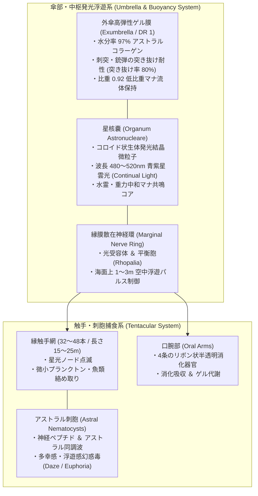
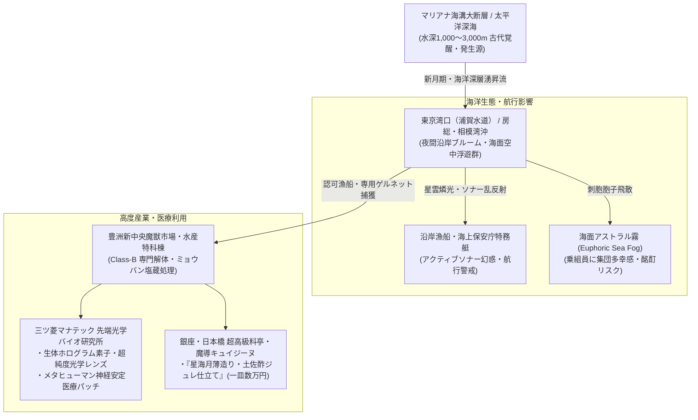

# 【幽光星海月 アストラル・ネビュラ・ジェリー】（ユウコウホシクラゲ／*Aurelia astralis*／Astral Nebula Jelly）

---

## 1. 基本分類・メタデータ

| 項目 | 内容 |
| :--- | :--- |
| **和名** | 幽光星海月（ユウコウホシクラゲ）、星雲海月（セイウンクラゲ）、アストラル・ジェリー |
| **学名・分類** | *Aurelia astralis*（異界流入・深海覚醒種・刺胞動物門 鉢クラゲ綱 幽光星海月科） |
| **英名 / 通称** | Astral Nebula Jelly / Starlight Medusa, Cosmic Drifter, Celestial Bloom |
| **発生起源** | **異界流入・深海覚醒種（海洋刺胞動物）**（2000年ミレニアム・アウェイクニングに伴い、マリアナ海溝・太平洋アビス大断層および深海特異点より流入。高濃度水霊・アストラルマナに適応して巨大化・半空中浮遊性を獲得） |
| **資源・食用区分** | **要処理種（Class-B / 要免許ジビエ・素材）**（※触手のアストラル幻惑毒の加熱・塩蔵不活化処理が必須。適切に脱毒された傘ゲルは超高級珍味「星海月刺身」として認可流通） |
| **脅威度ランク** | **Threat Level: II（警戒対象 / 非好戦的・広範囲幻惑・航行ソナー障害）** |
| **主要生息域** | 太平洋アビス大断層周辺、東京湾アビスベイ（浦賀水道〜房総半島沖）、新月期の沿岸湧昇流海域 |

### 視覚資料アーカイブ（Visual Archive）
| 生態観測写真（夜間海面・星雲状発光） | 生体発光核「星核嚢」（研究室マクロ標本写真） |
| :---: | :---: |
|  |  |
| *東京湾口アビスベイ（浦賀水道沖）にて夜間洋上撮影（2026年）* | *海洋研究開発機構（JAMSTEC-M）提供標本（スケール付）* |

---

## 2. 生物学的特徴・形態

### 2.1 外見・身体構造
- **傘径 / 触手長 / 湿重量**:
  - **傘径（Bell Diameter）**: 2.5〜4.5m（原種ミズクラゲの10倍以上・SM +2）。
  - **触手長（Tentacle Length）**: 15〜25m（傘縁から最大 32〜48本の半透明触手が垂下）。
  - **湿重量**: 150〜300kg（体内組成の 97.2% が水分および高分子アストラルコラーゲンゲル）。
- **傘の構造と「星核嚢（*Organum Astronucleare*）」**:
  - 傘の外層は完全な透明で、内部中央に直径 40〜60cm の球状発光器官「星核嚢」を内包する。
  - 星核嚢の内部には、自発光性ルシフェリン微粒子とアストラル結晶粒子がコロイド状に浮遊し、まるで渦巻銀河や星雲（Nebula）のような青紫・エメラルドグリーンの光を脈動放射する。
- **刺胞・触手網**:
  - 触手には数百万個の「アストラル刺胞（Astral Nematocysts）」が配列。微細な光のノード（節）のように等間隔で点滅し、夜間の海中で星の糸のようなカーテンを形成する。



### 2.2 変異・覚醒の経緯
- 2000年1月1日のマナ覚醒時、マリアナ海溝底の「太平洋アビス大断層」から噴出した高濃度のアストラル界（精神・星辰プレーン）マナ流に、深海浮遊性のクダクラゲ類および鉢クラゲ類が晒された。
- 生体組織の大部分をアストラルマナと親和性の高いコラーゲンゲルで構成していたため、急激な変異に適応。物理的な重力の影響を弱める「中性〜正の浮力」を獲得し、深海から夜間の浅海・海面上へと生息域を拡大した。

---

## 3. 生態・行動パターン

### 3.1 食性・光誘引捕食
- **主食**: 海洋性動物プランクトン、小型魚類（カタクチイワシ、サバの幼魚等）、および海中の浮遊マナ残滓。
- **星光カーテン捕食（Cosmic Curtain Trapping）**:
  - 夜間、星核嚢の燐光と触手の点滅ノードを明滅させ、光走性を持つ小魚や甲殻類を引き寄せる。
  - 触手に触れた獲物は即座にアストラル毒で麻痺・多幸昏睡状態に陥り、口腕によって傘の内側へと運ばれてゆっくりと消化吸収される。



### 3.2 潮汐・月齢周期と海面空中浮遊現象（Starlight Levitation）
- **新月期の海面ブルーム**:
  - 月明かりのない新月の夜、水温躍層に乗って大群（数百〜数千個体）が海面近くに浮上する「星辰ブルーム（Nebula Bloom）」が発生。
  - 傘内部の低比重マナ流体（比重0.92）と水霊マナの斥力により、**海面上 1〜3m の空中にふわりと浮き上がり、夜風に乗って海面を滑るように漂う幻想的な空中浮遊**を見せる。

### 3.3 繁殖・ライフサイクル
- **寿命**: 成体（メデューサ型）として約 3〜5年。
- **ポリプ期の特異性**: 深海底の岩盤に定着したポリプ（幼生）は、微小な青いクリスタルのような形状（ストロビラ）をしており、数年間にわたりアストラルマナを吸収して無性生殖（出芽）を繰り返す。

---

## 4. 魔導科学・生物学的考察

### 4.1 魔力現象と発現メカニズム
- **重力減衰浮遊（《浮遊 / Levitation》励起）**:
  - 傘ゲル内のアストラルコラーゲン繊維が、地球磁場および水面のマナ張力と反発する「逆極性マナ斥力」を微弱励起。自重の約95%を相殺し、空中ドリフトを可能にしている。
- **アストラル幻惑毒（《幻惑 / Daze》《多幸トランス》）**:
  - 刺胞から注入される神経ペプチドは、標的の脳神経シナプスに作用すると同時に、アストラル体（魂の境界膜）を弛緩させる。
  - 被毒者は物理的激痛をほとんど感じず、「満天の星空を飛んでいるような圧倒的多幸感と脱力」に包まれ、抵抗意思を喪失する。
- **常夜星光（《星光 / Continual Light》）**:
  - 星核嚢が放つ光は、熱を一切伴わない冷光（Cold Light）であり、暗闇の水中を半径 50m 以上照らし出す。

### 4.2 科学的・電磁的相互作用
- **電子機器・通信への非干渉**:
  - 電磁ノイズはゼロ。電波・Wi-Fi・衛星通信に悪影響を与えることはない。
- **アクティブソナー乱反射（Acoustic Cloak）**:
  - 体内が水分率97%の均質ゲルであるため、船舶・潜水艦の音波探信儀（ソナー）の音波をほとんど反射せず透過・減衰させる。大群が発生するとソナー画面に「巨大な靄（ゴースト・ノイズ）」として映り、測深器を誤認させる。

### 4.3 音響・周波数・生体通信特性（Acoustic & Resonance Analysis）
- **水中水流拍動（Pulsing Hydro-Acoustics）**:
  - **超低周波拍動**: 0.5Hz〜5Hz（傘の収縮運動に伴う微小水流パルス）。
  - **マナ共振音（Resonance Hum）**: 432Hz（高位術士やメタヒューマンのエルフのみが聴取可能な微弱な「ハミング音」）。

---

## 5. ガープス第4版（GURPS 4th）データブロック

```yaml
Name: 幽光星海月 アストラル・ネビュラ・ジェリー (Astral Nebula Jelly)
Archetype: 巨大異界流入浮遊刺胞魔獣 / 深海・発光種
Point Total: 180 pt
Threat Level: II (警戒対象 / 非好戦的・広範囲幻惑)

Attributes:
  ST: 10 [0]       HP: 16 [12]
  DX: 11 [20]      WILL: 10 [0]
  IQ: 2 [-160]     PER: 11 [5]
  HT: 12 [20]      FP: 14 [6]

Basic Parameters:
  Basic Speed: 5.75 [0]
  Basic Move (Water/Swim): 3 [-10]
  Basic Move (Air/Levitation): 2 [-15]
  Size Modifier (SM): +2 (傘径 3.0m, 触手長 20m, 湿重量 220kg)
  Dodge: 8

Damage:
  Tentacle Touch: 1d-3 crushing + 特殊刺胞毒

DR (防護点) & 防御特性:
  - 傘部・触手: DR 1
  - ゲル状肉体 / Injury Tolerance (Diffuse: 刺突・銃弾のダメージを1〜2点に減衰) [100]
  - 脳・心臓弱点なし / No Vitals, No Brain [10]

Traits & Advantages:
  - 水中呼吸＆海面浮遊 / Amphibious & Flight (Lighter Than Air -10%, Low Ceiling 3m -20%) [28]
  - 生体星光放射 / Illumination (Radius 10m, Switchable) [5]
  - アストラル幻惑刺胞毒 / Affliction 2 (Will-2判定失敗で1d6時間多幸感・朦朧Daze状態) [30]
  - 360度感覚 / 360-Degree Vision (散在神経環) [25]

Disadvantages & Quirks:
  - 脆弱な乾燥耐性 / Dependency (Salt Water: 毎分1HP減少) [-20]
  - 非好戦的 / Pacifism (Self-Defense Only) [-15]
  - 音波脆弱 / Vulnerability (Sonic/Crushing Shockwave x2) [-15]

Innate Spells (生体励起水霊・精神魔術 - マナ消費はFP):
  - 《浮遊 / Levitation》: Skill 13 (常時励起 / 水中〜海面上3mを無重力浮遊)
  - 《幻惑 / Daze》: Skill 14 (FP 2消費 / 触手接触時に精神同調波を送り込み意識を麻痺)
  - 《星光 / Continual Light》: Skill 15 (FP 1消費 / 星核嚢の燐光を最大輝度にブースト)
```

---

## 6. 交戦マニュアル・防衛対策

### 6.1 航行安全・非殺傷対処
- **交戦の必要性**:
  - 本種から能動的に人間や船舶を襲うことはない。
  - 最大の危険は「夜間航行中のスクリューへの触手巻き込み」および「海面に漂う微細な遊泳片・刺胞胞子を吸入した船員の集団酩酊」。
- **有効な回避・対処戦術**:
  - **銃撃厳禁**: 散弾銃や小銃（5.56mm/7.62mm）で射撃しても、ゲル肉体を弾丸が突き抜けるだけで効果がなく、破片が飛び散って刺胞毒が拡散するため**射撃は厳禁**。
  - **アクティブソナー威嚇（音波パルス）**: 船載ソナーから強力な中周波音波（2〜5kHz）を発信すると、平衡胞が刺激されて急速に深海へと潜航・退避する。
  - **高圧放水銃**: 船舶に接近した個体は、消防放水銃の水圧で安全に押し戻すことが可能。

---

## 7. 解体・食利用・素材採取

### 7.1 食用利用と調理法（Class-B）
- **食用区分**: **要処理種（Class-B / 要免許ジビエ・水産）**
- **伝統的脱毒・塩蔵プロトコル**:
  1. **触手・口腕の即時切除**: 水揚げ直後、防護手袋を着用して毒性の高い触手と口腕を基部から完全に切り落とす。
  2. **ミョウバン・粗塩漬け（脱水不活化）**: 傘のゲルを海水濃度の塩水とミョウバンに48時間漬け込み、アストラル毒ペプチドを完全変性・不活化させる。
- **風味・食感の記録（『星海月刺身』）**:
  - 薄造りに引かれた透明なゲルは、サクサクとした心地よい歯ごたえ（クラゲ特有のコリコリ感）と、舌の上でフワリと溶けるアストラルゲルの清涼感を持つ。
  - ほんのりとした甘みと、食べた後に頭がスッキリと冴え渡る微弱なリフレッシュ効果があり、豊洲市場では1kgあたり 15,000〜25,000円の高値で取引される。

### 7.2 素材採取と先端テクノロジー応用

| 採取部位 | 工業・魔導用途 | 経済価値・取引相場 |
| :--- | :--- | :--- |
| **星核嚢（アストラル・コアゲル）** | 三ツ菱マナテック製「生体ホログラム投影素子」、高感度マナ光学レンズ | 1個体分: 120万〜200万円 |
| **脱毒アストラルコラーゲン** | メタヒューマン神経安定パッチ、抗PTSD精神医療用軟膏、高級化粧品 | 100g: 8万円 |
| **発光ルシフェリン抽出液** | 深海探査用無電源コールドライト、魔導バイオマーカー | 500ml: 35万円 |

---

## 8. 現場記録・調査員ログ

> *「新月の夜、東京湾の浦賀水道を第3管区の巡視艇で哨戒していた時の光景は、一生忘れられない。*  
> *前方海面が、まるで夜空の天の川がそのまま海に落ちてきたかのように青紫色の淡い光で満ちていたんだ。何千匹ものアストラル・ネビュラ・ジェリーが、海面すれすれに浮上して光の絨毯を作っていた。*  
> *驚いたことに、そのうちの何匹かは海面を飛び出して、夜風に乗って空中にふわりと浮かび上がった。高さ2メートルほどを、銀河を抱えた半透明の巨大な傘が、星屑を散らすように触手を揺らしながら通り過ぎていく。*  
> *見とれていた機関長が、ふと『なんだか……ものすごく幸せな気分になってきましたね』と呟いて甲板に座り込んだ。風に乗って刺胞の微細な胞子が飛んできたんだ。すぐに全員に防毒マスクを着けさせ、アクティブソナーを軽く一発鳴らして道をあけてもらった。*  
> *あのクラゲの光を見ていると、深海と宇宙は本当につながっているんじゃないかと思えてくるよ」*  
> —— **海上保安庁 第3管区特務海洋哨戒艇 艇長 瀬崎 浩二**（2026年 浦賀水道航行日誌より）
