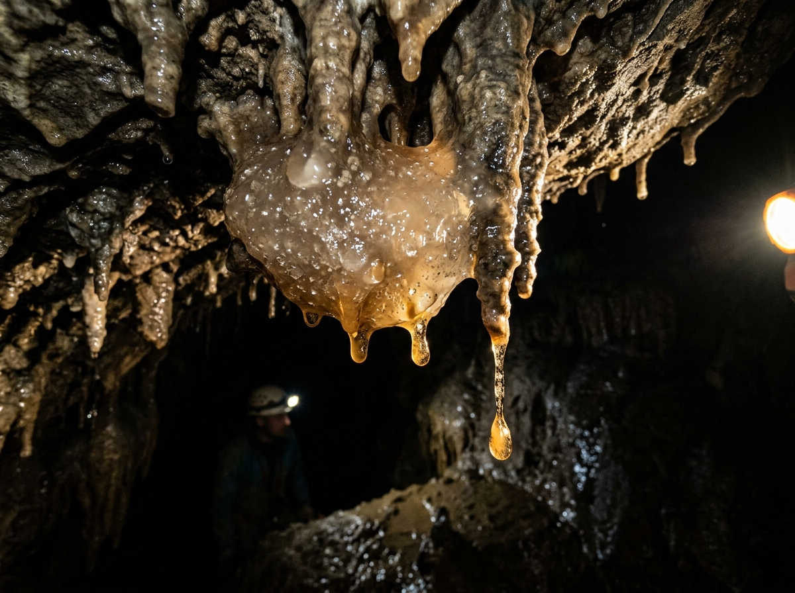
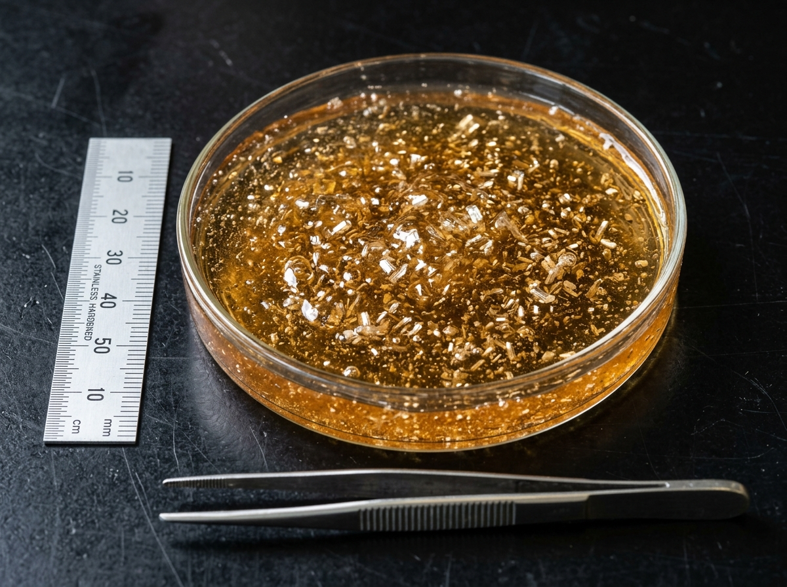
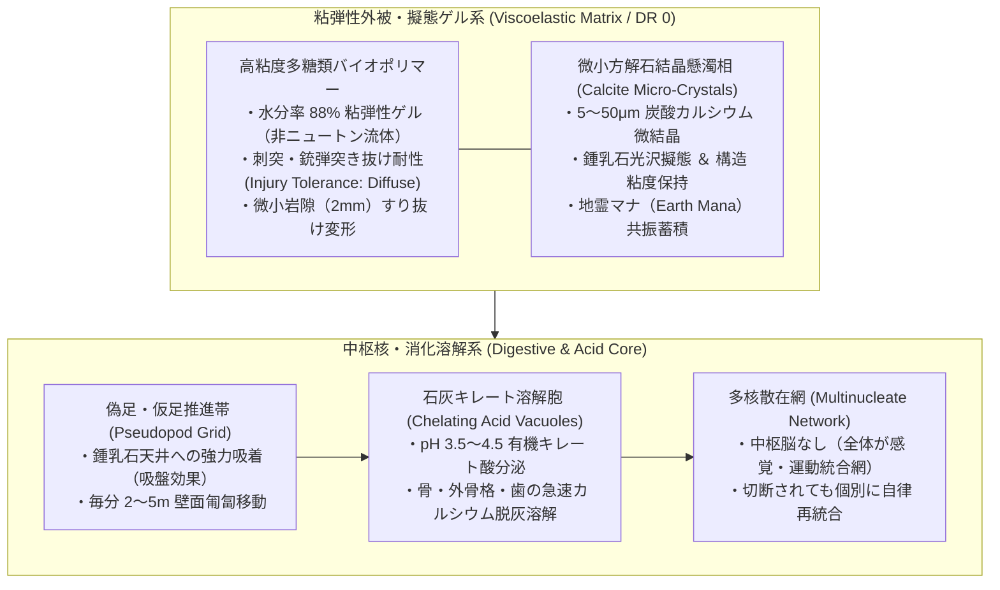
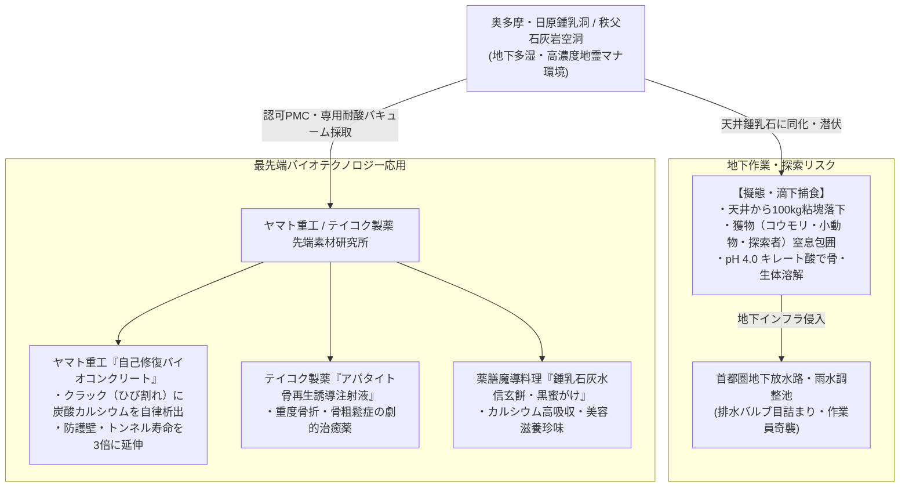

# 【鍾乳石灰粘塊 カルサイト・ケイブ・スライム】（ショウニュウセッカイネンカイ／*Limus calcarius*／Calcite Cave Slime）

---

## 1. 基本分類・メタデータ

| 項目 | 内容 |
| :--- | :--- |
| **和名** | 鍾乳石灰粘塊（ショウニュウセッカイネンカイ）、鍾乳石泥（ショウニュウセキデイ）、カルサイト・スライム、洞窟粘魔 |
| **学名・分類** | *Limus calcarius*（急速変異種・変形菌門 変形菌綱 鍾乳粘塊科） |
| **英名 / 通称** | Calcite Cave Slime / Stalactite Ooze, Limestone Jelly, Amber Cave Blob |
| **発生起源** | **急速変異種（洞窟性アメーバ・粘菌類）**（2000年ミレニアム・アウェイクニングに伴い、石灰岩洞窟の地下水脈に生息していた好アルカリ性粘菌・単細胞原生生物が高濃度地霊・水霊マナに晒され、炭酸カルシウムを生体鉱物化して多細胞巨大化） |
| **資源・食用区分** | **要処理種（Class-B / 要免許ジビエ・工業素材）**（※高活性カルシウムキレート酸の中和・不活化処理が必須。精製された粘液ゲルは自己修復コンクリート建材および骨粗鬆症治療薬原料として超高額取引） |
| **脅威度ランク** | **Threat Level: II（警戒対象 / 洞窟探索者・地下作業員への天井奇襲リスク）** |
| **主要生息域** | 東京都奥多摩アウトランド（日原鍾乳洞深部）、埼玉県秩父石灰岩廃坑、山口県秋吉台地下特異点空洞、結界都市外縁の地下雨水調節池 |

### 視覚資料アーカイブ（Visual Archive）
| 洞窟生態観測写真（鍾乳石擬態・滴下） | 結晶懸濁粘性ゲル（研究室マクロ標本写真） |
| :---: | :---: |
|  |  |
| *奥多摩日原鍾乳洞・非公開地下回廊にて撮影（2026年）* | *ヤマト重工 先端バイオマテリアル研究所 提供標本（スケール付）* |

---

## 2. 生物学的特徴・形態

### 2.1 外見・身体構造
- **サイズ / 重量**:
  - **平常時（不定形）**: 直径 1.0〜2.2m（厚さ 20〜40cm・SM 0〜+1）。
  - **湿重量**: 80〜220kg（水分率 88%、炭酸カルシウム結晶 8%、高分子バイオポリマー 4%）。
- **外観と結晶懸濁構造**:
  - 半透明の乳白色から淡い琥珀色（ハニーアンバー）を呈し、鍾乳石から滴る石灰水と完全に同化。
  - ゲル内部には、粒径 5〜50μm の微小な方解石（$CaCO_3$ / Calcite）および霰石（Aragonite）の微小結晶が無数に懸濁しており、探検用ライトの光を当てると内部で星屑のようにキラキラと反射する。
- **粘弾性（非ニュートン流体特性）**:
  - 物理的な衝撃（打撃・弾丸）を受けると瞬時に粘度が上昇してエネルギーを吸収・分散し、ゆっくりとした圧力には柔軟に変形して岩の隙間（幅数ミリメートル）へ滑り込む。



### 2.2 変異・覚醒の経緯
- 2000年のミレニアム・アウェイクニング以降、石灰岩地帯の地下空洞に浸透した地霊マナが、地下水中のバクテリアおよび洞窟性変形菌の群体に濃縮された。
- 洞窟天井の鍾乳石形成プロセス（炭酸水素カルシウムの脱炭酸反応）を生体代謝に取り込み、自ら炭酸カルシウムを分泌・溶解させることで、完全な洞窟適応型不定形捕食者へと変異した。

---

## 3. 生態・行動パターン

### 3.1 食性・天井滴下捕食（Drop & Smother）
- **主食**: 洞窟性コウモリ、カマドウマ、洞窟ネズミ、迷い込んだ小型動物、および石灰岩のミネラル分。
- **擬態と滴下奇襲**:
  1. **つらら石擬態**: 鍾乳洞の天井に張り付き、鍾乳石（つらら石）の先端から一滴ずつ石灰水を滴下させながら、下を通る獲物を感知（振動・熱源探知）。
  2. **急激な滴下・包み込み**: 獲物が直下を通過した瞬間、自重（100kg超）を一気に落下させて獲物の頭部・全身を包み込み、窒息させる。
  3. **カルシウム脱灰溶解**: 獲物を包み込んだまま「石灰キレート溶解酸」を分泌。筋肉・皮膚を軟化させ、骨や歯のカルシウムを完全に溶かし去って吸収する（数時間で骨すら残らない）。



### 3.2 繁殖・分裂と休眠性
- **自己増殖**: 獲物を十分に捕食して重量が 200kg を超えると、2つの独立した個体へと二分裂する。
- **乾燥休眠（石灰化クラスト）**: 洞窟内の湿度が低下すると、体表の炭酸カルシウムを急激に硬化させて「白い石灰の塊（偽装石筍）」となって数ヶ月〜数年間休眠する。水分とマナを感知すると数分で再ゲル化して活動を再開する。

---

## 4. 魔導科学・生物学的考察

### 4.1 魔力現象と発現メカニズム
- **石灰溶解・析出サイクル（《酸 / Acid》《石変化 / Shape Stone》）**:
  - 本種は体内酵素と地霊マナを同調させ、可逆的に炭酸カルシウムの「溶解（酸性化）」と「析出（アルカリ化）」を切り替える。
  - これにより、岩壁を溶かして掘り進んだり、自身を一時的に硬質化させて防御することが可能。
- **粘弾性衝撃吸収（Diffuse 耐性）**:
  - ゲル構造がマナ格子と結びついており、銃弾や刃物による局所的運動エネルギーを「分子振動」として全体に拡散。銃創や切断面は数秒で融合・修復される。

### 4.2 科学的・電磁的相互作用
- **電子機器への非干渉**:
  - 電磁パルスや電波妨害は一切発生しない。
  - ただし、粘液が機器内部に侵入すると、高濃度の石灰分が乾燥・結晶化してスイッチや冷却ファンを物理的に固着・故障させる。
- **金属・装甲への影響**:
  - キレート酸はカルシウムに特化しているため、チタンや強化ポリマー装甲は侵食されないが、骨性装甲や歯、天然繊維（革・布）は急速に侵食・劣化する。

### 4.3 音響・生体通信特性（Acoustic & Resonance Analysis）
- **環境滴下音（Acoustic Mimicry）**:
  - **水滴音**: 1.5kHz〜3.0kHz（洞窟の通常の水滴音に完全に擬態した「ポタ……ポタ……」という周期的落下音）。
- **粘性移動破裂音（Viscous Slurp）**:
  - **低周波気泡音**: 80Hz〜150Hz（天井を這う際に発生する極めて微小な粘着剥離音。高感度集音マイクで探知可能）。

---

## 5. ガープス第4版（GURPS 4th）データブロック

```yaml
Name: 鍾乳石灰粘塊 カルサイト・ケイブ・スライム (Calcite Cave Slime)
Archetype: 不定形洞窟変異魔獣 / 地下粘塊種
Point Total: 165 pt
Threat Level: II (警戒対象 / 天井奇襲・インフラ障害)

Attributes:
  ST: 12 [20]      HP: 18 [12]
  DX: 9 [-20]      WILL: 10 [0]
  IQ: 2 [-160]     PER: 11 [5]
  HT: 12 [20]      FP: 12 [0]

Basic Parameters:
  Basic Speed: 5.25 [0]
  Basic Move (Ground/Crawl): 2 [-15]
  Basic Move (Climbing/Ceiling): 3 [-10]
  Size Modifier (SM): 0〜+1 (直径 1.5m, 重量 120kg)
  Dodge: 7

Damage:
  Drop & Smother: 1d+1 crushing (窒息・圧殺) + 1d-1 corrosion (酸溶解)
  Acid Touch: 1d-1 corrosion (カルシウム・有機物侵食)

DR (防護点) & 特殊耐性:
  - DR: 0
  - 不定形肉体 / Injury Tolerance (Diffuse: 刺突・銃弾・斬撃のダメージを1点に減衰) [100]
  - 弱点なし / No Brain, No Vitals, No Eyes [15]

Traits & Advantages:
  - 天井吸着登攀 / Clinging (天井張り付き可能) [20]
  - 振動感知 / Vibration Sense (Air/Ground) [10]
  - 鍾乳石擬態 / Chameleon 3 (石灰洞窟内限定 -20%) [12]
  - カルシウム溶解酸 / Innate Attack (Corrosion 1d-1, Contact Only) [9]

Disadvantages & Quirks:
  - 火炎脆弱 / Vulnerability (Fire/Heat: ダメージ2倍, 水分蒸発で1d/Turn硬化自壊) [-30]
  - 凍結脆性 / Weakness (Cold/Freezing: 1d/min, 凍結時Diffuse喪失) [-15]
  - 消石灰・強アルカリ拒絶 / Revulsion (Slaked Lime: 即時固化・麻痺) [-10]

Innate Spells (生体励起地霊・水霊魔術 - マナ消費はFP):
  - 《酸 / Acid》: Skill 13 (FP 2消費 / 接触面を有機キレート酸で溶解)
  - 《石変化 / Shape Stone》: Skill 12 (FP 3消費 / 周囲の石灰岩を軟化・同化)
  - 《粘体同化 / Amorphous Form》: Skill 14 (常時励起 / 隙間への滑り込み)
```

---

## 6. 交戦マニュアル・防衛対策

### 6.1 有効な現代兵器・戦術
- **小火器（拳銃・小銃・散弾）の無効性**:
  - 9mm、5.56mm、散弾などの通常弾は粘弾性ゲルを突き抜けるだけで物理的ダメージを与えられず、弾丸を飲み込んで自重を増すだけであるため**発砲厳禁**。
- **推奨撃退装備・特効戦術**:
  1. **火炎放射器・マグネシウム発炎筒**:
     - 高熱（600℃以上）に晒されると、水分が瞬時に沸騰・蒸発し、炭酸カルシウムが急激に脱水固化してボロボロの石灰灰へと自壊する。
  2. **消石灰・強アルカリ散布スプレー（Slaked Lime Neutralizer）**:
     - 消石灰（水酸化カルシウム）の粉末や高濃度アルカリ溶液を吹きかけると、キレート酸が中和されると同時にバイオポリマーがゲル化能力を失って急凝固・麻痺する。
  3. **冷却・液体窒素弾**:
     - 急冷によりゲルが氷結すると、Diffuse（流体分散）特性が消失し、つるはしやハンマーの一撃で粉々に破砕可能となる。

---

## 7. 解体・食利用・素材採取

### 7.1 工業・先端医療マテリアル採取（Class-B）
- **採取プロトコル**:
  - 耐酸バキュームポンプで生きたまま密閉タンクに吸引回収、または消石灰散布で仮死・凝固させて搬送。
- **工業・医療利用**:
  - **ヤマト重工製『自己修復バイオセメント』**:
    - コンクリート構造物の微細クラックに本種の休眠ポリマーを混入。雨水が浸入するとポリマーが活性化し、炭酸カルシウム結晶を自律析出してひび割れを完全修復する。防護壁や地下道の寿命を半永久化する先端建材。
  - **テイコク製薬製『バイオアパタイト骨再生薬』**:
    - 精製されたキレート多糖類が、骨折部位にカルシウムイオンを急速集積させ、骨癒合を通常の3倍に加速させる。

### 7.2 食用利用と評価（Class-B）
- **食用区分**: **要処理種（Class-B / 要免許薬膳）**
- **下処理・脱酸プロトコル**:
  - 採取したゲルを大量の重曹水で洗浄・中和し、酸性キレート成分を完全に除去した後、加熱殺菌して冷却。
- **風味・食感の記録（『鍾乳水信玄餅』）**:
  - 完全に中和されたゲルは、無味無臭で驚くほど滑らかな「極上の超弾力わらび餅」のような食感を持つ。
  - 黒蜜と黄粉をかけて食すと、口の中でひんやりと溶け、高純度カルシウムとミネラルが体に染み渡る薬膳スイーツとして、奥多摩の山小屋や高級料亭で密かに人気を博している。

---

## 8. 現場記録・調査員ログ

> *「奥多摩の日原鍾乳洞の奥、一般観光ルートから外れた調査区で起きた事故の話だ。*  
> *地下水脈の流量センサーを点検していた作業員が、頭上からドサリと落ちてきた『冷たい塊』に包まれた。叫び声すら上げられなかった。ヘッドライトの光が、半透明の琥珀色の中で乱反射して消えそうになっていた。*  
> *同行していた私が小銃を構えたが、撃っても無駄だとすぐに分かった。撃てば中の作業員を撃ち抜いてしまう。*  
> *とっさに背負っていた坑道用消石灰スプレーを構え、スライムの表面にノズルを突き刺して一気に噴射した。*  
> *シュウウウ……という激しい中和音とともに、琥珀色のゲルがみるみる白濁し、チョークの粉のようにポロポロと崩れて作業員が吐き出された。幸い、ヘルメットと防護服のおかげで軽度の皮膚の爛れと脱灰で済んだが、作業員の着ていた綿のツナギは酸でドロドロに溶けていた。*  
> *洞窟の天井を見上げてみろ。つらら石の先端が琥珀色に濡れていたら、それは石じゃない。お前を見下ろしているスライムだ」*  
> —— **東京都水道歴史館 奥多摩地下水脈保守主任 乾 健三**（2026年 現場安全報告書より）
