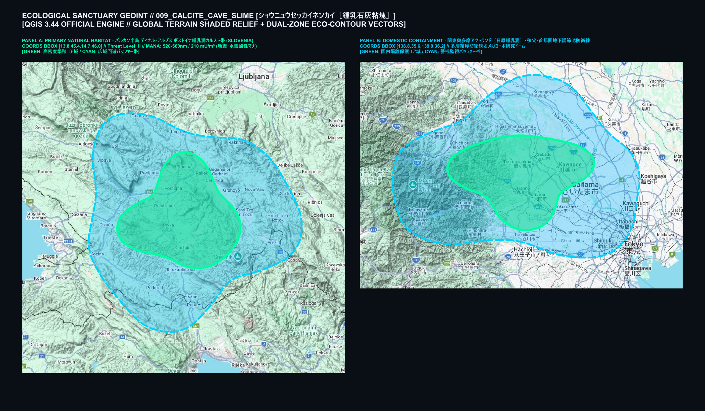
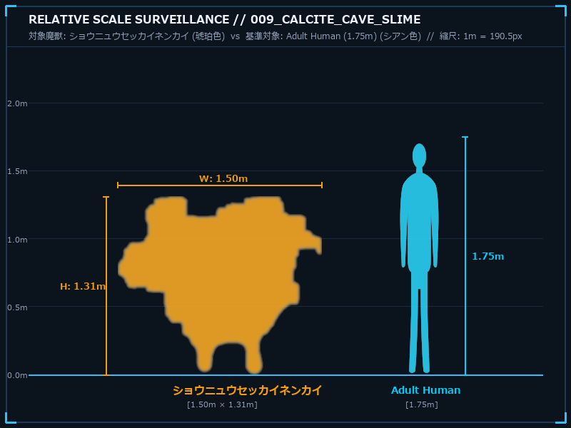
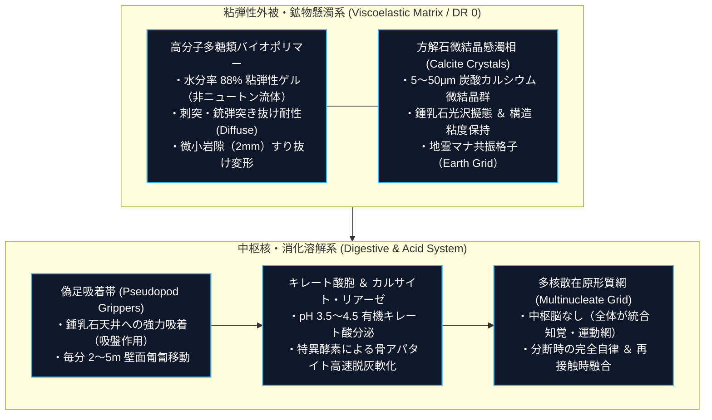
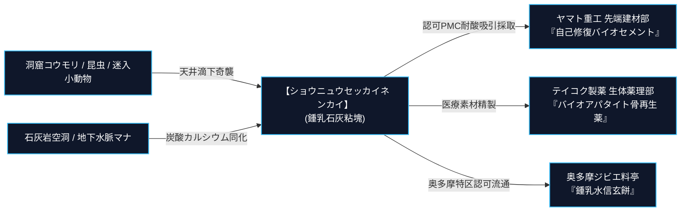

# 【鍾乳石灰粘塊 ショウニュウセッカイネンカイ】（Calcite Cave Slime／*Limus calcarius*／鍾乳石泥、洞窟粘魔）

---

## 1. 基本分類・早わかり（Basic Classification & Fast Facts）

| 項目 | 内容 |
| :--- | :--- |
| **和名** | 鍾乳石灰粘塊（ショウニュウセッカイネンカイ）[^zext_1] |
| **和名命名規約** | **【形態・環境型】**<br>※命名根拠: 石灰岩洞窟（鍾乳洞）の天井に擬態し、炭酸カルシウム微小結晶をゲル内部に懸濁させた形態的・生態的特徴に基づく。 |
| **英名 / 通称** | Calcite Cave Slime / Stalactite Ooze, Limestone Jelly, Amber Cave Blob |
| **学名** | *Limus calcarius* |
| **学名語源** | *Limus*（ラテン語: 泥、粘液、湿原の沈殿物）＋ *calcarius*（ラテン語: 石灰質の、石灰を生み出す） |
| **生物学的分類** | **門**: 変形菌門（Myxomycota）<br>**綱**: 変形菌綱（Myxomycetes）<br>**目**: モジホコリ目（Physarales）<br>**科**: 鍾乳粘塊科（Calcilimatidae）<br>**属**: 鍾乳スライム属（*Limus*）<br>**種**: ショウニュウセッカイネンカイ（*L. calcarius*）<br>**変異系統**: 奥多摩局地適応型変異株（*L. c. okutamaensis*） |
| **発生起源** | **急速変異種（洞窟性好アルカリ性変形菌・アメーバ類）**<br>※2000年1月1日のミレニアム・アウェイクニングに伴い、石灰岩洞窟地下水脈の好アルカリ性粘菌・単細胞原生生物が高濃度地霊・水霊マナに晒され、炭酸カルシウムを生体鉱物化して多細胞・巨大原形質化した種。 |
| **資源・管理区分** | **要処理種（Class-B / 要免許ジビエ・工業医療素材）**<br>※管理ステータス: 洞窟探索者・地下インフラ警戒害獣 / 東京都奥多摩特区認可ジビエ・ヤマト重工先端建材指定資源。 |
| **食性** | **偏性肉食・鉱物マナ同化食**（洞窟性コウモリ、カマドウマ、洞窟ネズミ、迷入小動物、石灰岩方解石ミネラル） |
| **寿命** | **実質半永久（多核体分裂・融合性）**（単一コロニーとしては二分裂と合体を繰り返すため個体死の概念が希薄。乾燥休眠状態で数百年生存可能） |
| **サイズ・重量** | **平常時（不定形）**: 直径 1.0〜2.2m / 厚さ 20〜40cm（SM 0〜+1）<br>**湿重量**: 80〜220kg（水分率 88%、炭酸カルシウム微結晶 8%、多糖類高分子バイオポリマー 4%） |
| **直感的サイズ比較** | **【成人男性（175cm）/ 探検用ヘルメット / 洞窟天井つらら石 との対比】**<br>※天井に張り付いている際は小型の鍾乳石群（幅50cm程度）に見えるが、落下・展張すると成人男性一人をすっぽりと完全に包み込み窒息させる濡れた巨大毛布ほどのサイズ。 |
| **脅威度ランク** | **Threat Level: II（警戒対象 / 洞窟探索者・地下インフラ作業員への天井奇襲リスク）** |
| **主要生息域** | **【一次野生生息地】** スロベニア・ポストイナ鍾乳洞等のバルカン半島ディナル・アルプスカルスト帯、北米マンモス・ケーブ<br>**【国内出現・侵入】** 東京都奥多摩アウトランド（日原鍾乳洞深部）、埼玉県秩父石灰岩廃坑、山口県秋吉台、首都圏地下調節池・放水路要塞線バイパス |

---

### 生息・分布マップ（Distribution & Habitat Range Map）



> **【生息分布データ】**:
> - **一次野生生息地（原典発祥地）**: スロベニア・ポストイナ鍾乳洞周辺ディナル・アルプスカルスト帯（標高200〜1,200mの地下鍾乳洞群）[^jinnai_1]
> - **国内主要定着拠点**: 奥多摩アウトランド（日原鍾乳洞・非公開地下回廊水脈）、武甲山地下石灰廃坑、秋吉台カルスト地下特異点空洞
> - **環境耐性・生息限界**: 暗黒環境（照度 0〜5 lux） / 洞内温度 8〜16℃ / 相対湿度 95〜100% / 地霊マナ濃度 80〜240 mU/m³

---

### 視覚資料アーカイブ（Visual Archive）

| 洞窟生態観測写真（野生環境） | 採取標本・組織マクロ写真 |
| :---: | :---: |
|  |  |
| *奥多摩日原鍾乳洞・非公開地下水脈天井にて撮影（2026年）。鍾乳石の先端と同化し、獲物の体温・振動を感知して滴下体制をとる成体。* | *ヤマト重工 先端バイオマテリアル研究所 提供標本。琥珀色粘性ゲル内に粒径5〜50μmの方解石微小結晶が無数に懸濁している。*[^hasumi_1] |

---

### 直感的サイズ比較チャート（Relative Scale Surveillance）



> **【スケール対比データ】**:
> - **対象魔獣（ショウニュウセッカイネンカイ）**: 展張時幅 1.50m / 鍾乳石垂下時全高 1.31m（琥珀色有機ゲルシルエット・実写写真完全抽出マスク）
> - **基準対象（成人男性 / Adult Human）**: 全高 1.75m（シアン色ベクターシルエット）
> - **縮尺比率**: 1m ＝ 190.5px（完全メートル等比スケール・4:3 黄金レイアウト）

---

## 2. 伝承考証とマナ覚醒の架橋（Lore & Historical Bridge）

### 2.1 原典・民俗伝承の記録
1. **古代ギリシャ・ローマおよび教父文書における地下の粘塊・自然発生論**:
   - **アリストテレス『動物誌（Historia Animalium）』第5巻第1章**: 洞窟の湿地や腐敗した有機泥から、親を持たずに生命が自発的に生じる「自然発生（Spontaneous Generation）」の記述[^schulz_1]。
   - **大プリニウス『博物誌（Naturalis Historia）』第36巻（石材・鉱物篇）**: 鍾乳石（Stalactites）を「石となる涙（Lacrimae Saxi）」と呼び、地下水中で石と水が混じり合って流動する生きている泥（Limus Vivus）についての言及。
2. **中世錬金術・ルネサンス自然哲学における「原初の流体物質（プリマ・マテリア）」**:
   - **パラケルスス『自然事物の本性について（De Natura Rerum）』（1537年）**: 地下洞窟や鉱山深部に宿る地霊（Gnome / Gnomus）が分泌する「鉱物の粘液（Mucilago Mineralis）」についての記述。鉱石の母胎となり、有機物を石化・同化する不定形のエレメンタルとして描写。
   - **ゲオルク・アグリコラ『地下の事物について（De Subterraneis）』（1546年）**: 鉱夫たちがカルスト洞窟深部で遭遇する「粘つく石の泡（Spuma Saxi）」および「鉱毒のゲル」。
3. **近代怪奇・パルプフィクションにおけるスライム・ウーズ（Ooze）の変遷**:
   - **H.P.ラヴクラフト『狂気の山脈にて（At the Mountains of Madness）』（1931年）**: 古代の不定形原形質生命体「ショゴス（Shoggoth）」の造形。
   - **1950年代B級SF映画『マックィーンの絶対の危機（The Blob）』（1958年）**: 触れた有機物をすべて溶解・吸収して増殖する不定形モンスターの確立。

### 2.2 2000年マナ覚醒による生体科学的架橋
- 2000年のミレニアム・アウェイクニングに伴い、石灰岩カルスト帯の地下水脈に浸透した地霊・水霊マナが、洞窟性真正変形菌（Myxogastria）の微小コロニーに濃縮された。
- 洞窟天井の鍾乳石形成プロセス（炭酸水素カルシウム $Ca(HCO_3)_2$ の脱炭酸・炭酸カルシウム $CaCO_3$ 析出反応）を生体代謝に取り込み、自ら方解石微小結晶をゲル骨格として合成・分泌する多細胞・巨大不定形捕食者へと変異・覚醒した。

---

## 3. 生物学的特徴・ライフステージ（Biological Traits & Anatomy）

### 3.1 外見・解剖学的身体構造
- **粘弾性非ニュートンゲル外被（DR 0 / Diffuse特性）**:
  - 水分率 88% の高分子多糖類バイオポリマー。瞬間的な打撃・銃撃などの高歪み速度に対しては分子間架橋が瞬時に強化されて硬化（ダイラタンシー効果）、持続的な微弱圧力には柔軟に変形して岩の隙間（幅2mm）へすり抜ける。
- **方解石微結晶懸濁相（Calcite Micro-Crystals）**:
  - 粒径 5〜50μm の微小な方解石（$CaCO_3$）および霰石（Aragonite）結晶が無数に懸濁。鍾乳石の光沢に完全擬態するとともに、地霊マナ共振格子を形成。
- **有機キレート酸胞 ＆ 特異酵素分泌系**:
  - pH 3.5〜4.5 の有機キレート酸（クエン酸・リンゴ酸複合体）と高活性カルシウム特異酵素（カルサイト・リアーゼ）を貯留する微小液胞網[^takatsukasa_1]。
- **多核散在統合網（Multinucleate Network）**:
  - 中枢脳を持たず、ゲル全体に数万個の細胞核とアクチン・ミオシン原形質流動網が散在。切断・分断されても個別に自律行動し、再接触時に瞬時に再統合する。



### 3.2 ライフステージと繁殖・育児ドラマ
1. **原形質流動・成長期（Protoplasmic Stage / SM -2〜-1）**:
   - 胞子から発芽した単核アメーバが融合し、多核体（変形体）を形成。小型昆虫やコウモリの糞（グアノ）を捕食して成長。
2. **成熟成体期（Adult Stage / SM 0〜+1）**:
   - 直径 1.5〜2.2m、重量 100〜220kg に達した捕食個体。鍾乳洞天井に定着し、滴下待ち伏せ狩猟を反復。
3. **二分裂増殖 ＆ 乾燥休眠（Fission & Sclerotium）**:
   - **二分裂**: 湿重量 200kg を超えると、中央からくびれて2つの独立個体へと等量分裂。
   - **乾燥休眠（スクレロチウム / 偽装石筍）**: 洞窟湿度が 80% 以下に低下すると、体表の炭酸カルシウムを急激に析出・石灰化させ「乾いた白い石灰塊（偽装石筍）」となって数十年〜数百年休眠。水分とマナを感知すると数分で再ゲル化・覚醒する。

---

## 4. 生態・食物連鎖・人間社会との摩擦（Ecology & Human Conflict）

### 4.1 食性・捕食行動
- **主食**: 洞窟性コウモリ（キクガシラコウモリ等）、カマドウマ、洞窟ネズミ、迷入小型動物。
- **滴下包囲捕食（Drop & Smother）とハイブリッド磨砕消化**:
  1. **擬態と振動感知**: 天井の鍾乳石（つらら石）と同化し、直下を通る獲物の足音振動・呼気二酸化炭素を感知。
  2. **自重滴下・窒息包囲**: 100kg超のゲルが一気に落下し、獲物の頭部・呼吸器を覆い尽くして数秒で窒息・無力化。
  3. **脱灰軟化 ＋ 結晶マイクロアブレシブ磨砕**: キレート酸とカルサイト・リアーゼ酵素で骨のアパタイトを数時間で軟骨状に脱灰軟化させ、ゲル内部で流動する無数の方解石微結晶ですり潰して完全液化吸収する[^takatsukasa_1]。



### 4.2 魔獣間クロス・リレーション（相互作用）
- **剛毛巌猪（イワボア）との関係**: 洞窟入口で遭遇することがあるが、イワボアの重厚なシリカ装甲（DR 9）はキレート酸の浸透が遅く、逆に踏み荒らされて分散させられるため捕食対象から外れる。
- **アストラル・ネビュラ・ジェリーとの住み分け**: 海洋性クラゲ魔獣とは生息環境（汽水・深海 vs 完全淡水石灰洞窟）が完全に隔離されており、競合は発生しない。

### 4.3 人間社会との摩擦・利用・保護史（Human-Creature Interactions）
- **首都圏地下放水路（春日部要塞神殿）バイパス侵入**:
  - 第3同心円要塞線の地下放水路において、石灰質コンクリート成分を求めて侵入。主ポンプ室には常設の**「自動消石灰インジェクター」および「高圧熱水ジェット防御網」**が施工配備されており、侵入事例は点検用バイパス枝管に迷い込んだ孤立個体に限定される[^jinnai_1]。
- **メガコーポ特許戦争と不活性胞子建材**:
  - ヤマト重工は、生殖・運動遺伝子をノックアウトした**「不活性休眠変異株（Y-Calcite株）」**の特許を取得。コンクリート構造物の微細ひび割れに炭酸カルシウムを自律析出させる先端建材として実用化。一方、テイコク製薬は医療用骨再生薬の独占原料供給権を巡り、原料採取枠の拡大を要求して係争中[^schulz_1]。

---

## 5. 魔導科学・上位神性・背景ロア（Thaumaturgical Theory & Lore）

### 5.1 魔力現象と発現メカニズム
- **生得魔法（Innate Magic / 生体励起異能）としての生化学発現**:
  - 本種は知力（IQ 2）による呪文詠唱を行わず、生体器官としての恒常的異能（Innate Advantages）としてマナを行使する。
  - 人間の術士が本種の代謝を魔導再現する場合、水霊・酸系《酸作成》（Create Acid）および地霊系《土変化》（Shape Earth）、《石を土》（Stone to Earth）、《土作成》（Create Earth）の複合励起として体系化される[^kuroda_1]。
- **物理・科学的相互作用**:
  - 電磁パルス（EMP）や通信妨害は一切発生しない。ただし、ゲルが電子機器内部に侵入すると石灰分が乾燥結晶化して基板やファンを物理的に固着・破壊する。

### 5.2 音響・周波数・生体通信特性（Acoustic & Resonance Analysis）
- **環境滴下音（Acoustic Mimicry）**:
  - **水滴音**: 1.5kHz〜3.0kHz（洞窟の天然水滴音に完全に擬態した「ポタ……ポタ……」という周期的落下音。獲物を直下に誘引する聴覚トラップ）。
- **粘性移動剥離破裂音（Viscous Slurp）**:
  - **低周波気泡音**: 80Hz〜150Hz（天井を這う際に発生する微小粘着剥離音。指向性集音マイクで探知可能）。

### 5.3 上位存在・アビス因果・メガコーポ伏線
- **上位存在（地霊界・始原粘魔）の真名・固有名詞**:
  - **真名・固有名詞**: **『スリュ・ズル・オゥ（Slyu-Zurl-Oh）』**
  - **音素由来**: 単細胞・多核体変形菌が洞窟天井を這う際に発生する原形質流動・粘膜剥離摩擦音（`Slyu-`） ＋ 消化気泡の圧搾破裂音（`Zurl-`） ＋ カルスト空洞の低周波共鳴余韻（`Oh`）に由来する地霊界の原初言語音素。
  - **アストラル界での称号**: 〈原初の流体と石灰の領主〉（Lord of Primordial Slime and Calcification）
- **プレーン・パクト（次元契約）条件・誓約代償**:
  - **召喚触媒**: 高純度炭酸カルシウム飽和地下水100リットルおよび30分間の原形質同調瞑想。
  - **誓約代償**: 術士の主観代謝速度の半減（低体温化・動作緩慢）。
  - **授受能力**: 術士の肉体を一時的に可逆的流体分散化（Injury Tolerance: Diffuse の一時獲得）させ、狭小岩隙への潜入および《酸作成》《土変化》の消費FPを1に軽減。

---

## 6. 交戦マニュアル・都市防災コラム（Combat Manual & Civil Defense）

### 6.1 GURPS 4th Stat Block（戦闘データ）

#### 【通常成体（Standard Adult）】
```yaml
Name: 鍾乳石灰粘塊 ショウニュウセッカイネンカイ (Calcite Cave Slime)
Archetype: 不定形洞窟変異魔獣 / 地下粘塊種
Point Total: 165 pt
Threat Level: II (警戒対象 / 天井奇襲・インフラ障害)

Attributes:
  ST: 12 [20]      HP: 18 [12]
  DX: 9 [-20]      WILL: 10 [0]
  IQ: 2 [-160]     PER: 11 [5]
  HT: 12 [20]      FP: 12 [0]

Basic Parameters:
  Basic Speed: 5.25 [0]
  Basic Move (Ground/Crawl): 2 [-15]
  Basic Move (Climbing/Ceiling): 3 [-10]
  Size Modifier (SM): 0〜+1 (直径 1.5m, 重量 120kg)
  Dodge: 7

Damage:
  Drop & Smother: 1d+1 crushing (窒息・圧殺) + 1d-1 corrosion (酸脱灰)
  Acid Touch: 1d-1 corrosion (カルシウム・有機物侵食)

DR (防護点) & 防御特性:
  - DR: 0
  - 不定形肉体 / Injury Tolerance (Diffuse: 刺突・銃弾・斬撃のダメージを1点に減衰) [100]
  - 弱点なし / No Brain, No Vitals, No Eyes [15]

Traits & Advantages:
  - 天井吸着登攀 / Clinging (天井張り付き可能) [20]
  - 振動感知 / Vibration Sense (Air/Ground) [10]
  - 鍾乳石擬態 / Chameleon 3 (石灰洞窟内限定 -20%) [12]
  - カルシウム脱灰酸 / Innate Attack (Corrosion 1d-1, Contact Only) [9]

Disadvantages & Quirks:
  - 火炎脆弱 / Vulnerability (Fire/Heat: ダメージ2倍, 水分蒸発で1d/Turn硬化自壊) [-30]
  - 凍結脆性 / Weakness (Cold/Freezing: 1d/min, 凍結時Diffuse喪失) [-15]
  - 消石灰・強アルカリ拒絶 / Revulsion (Slaked Lime: 即時固化・麻痺) [-10]

Innate Spells (生体励起異能 - 人間術士の対応呪文体系):
  - 《酸作成 / Create Acid》: Skill 13 (生体キレート酸分泌)
  - 《土変化 / Shape Earth》: Skill 12 (岩隙変形侵入)
  - 《石を土 / Stone to Earth》: Skill 11 (石灰クラスト再ゲル化)
  - 《土作成 / Create Earth》: Skill 10 (炭酸カルシウム生体析出)
```

### 6.2 推奨火器・防護装備
- **小火器（拳銃・小銃・散弾）の発砲厳禁**:
  - 9mm、5.56mm等の通常実弾は粘弾性ゲルを貫通・拡散するのみでダメージを与えられず、弾丸を飲み込んで自重を増すため発砲厳禁。
- **推奨撃退装備・特効戦術**:
  1. **消石灰・強アルカリ散布スプレー（Slaked Lime Sprayer）**: 水酸化カルシウム $Ca(OH)_2$ の粉末・水溶液でキレート酸を中和し、バイオポリマーを不可逆凝集させて即時無力化。
  2. **火炎放射器・マグネシウム発炎筒**: 高熱（600℃以上）で水分を沸騰蒸発させ、ボロボロの石灰粉へと熱分解自壊させる。
  3. **液体窒素急冷弾**: -196℃の急冷でガラス転移を起こさせ、Diffuse特性を奪ってハンマー粉砕する。

### 6.3 市民防災メモ ＆ 専門家の知恵袋

> [!IMPORTANT]
> **【市民向け防災メモ：鍾乳洞・地下道でのスライム遭遇時退避手順】**
> 1. 天井を見上げ、つらら石の先端が「濡れた琥珀色」に光っている場合は直下を通らないこと。
> 2. 滴下された場合は暴れず、携行している「消石灰スプレー」または「炭酸水素ナトリウム（重曹）水」を自身とスライムの接触面に噴射すること。
> 3. 実弾銃を撃つと内部の人間を誤射するため、絶対に発砲してはならない。  
> —— *警視庁 特異災害対策部 地下防犯指針*

> [!TIP]
> **【現場専門家・地下インフラ点検員の知恵袋】**
> *「奥多摩の地下水脈に入るとき、ベテランは銃の代わりに消石灰の散布缶を腰に2本ぶら下げる。どんな大口径ライフルより、白い石灰の粉一吹きの方がスライムには効く。やつらは酸で骨を溶かすが、アルカリを食らわされるとチョークの粉みたいに固まって動けなくなるんだ」*  
> —— **東京都水道歴史館 奥多摩地下水脈保守主任 乾 健三**

---

## 7. 解体・ジビエ食文化・料理レシピ（Harvesting & Cuisine）

### 7.1 解体プロトコルと市場相場（Class-B）
- **採取・搬送手順**:
  - 耐酸バキュームポンプで生きたまま密閉タンクに吸引回収、または希薄消石灰噴霧で仮死凝固させて搬送。
- **市場取引相場**:
  - **未処理生体ゲル**: 1kg あたり 8,500〜12,000円（ヤマト重工・テイコク製薬買取価格）
  - **脱酸精製食用ゲル**: 100g あたり 3,200〜4,500円（奥多摩認可特区料亭卸値）

### 7.2 伝統料理・メガコーポスペシャリテ（本格レシピ）

```
【奥多摩特区名物・鍾乳石灰水信玄餅（ショウニュウスイシンゲンモチ）】
- 分類: 東京都認可・奥多摩特区認定ジビエ甘味（Class-B / 要免許調理）
- 主材料: 脱酸処理済みショウニュウセッカイネンカイゲル 200g、日原名水 100ml、多摩産黒蜜、国産深煎り黄粉
- 調理手順:
  1. 【完全脱酸中和】: 採取した生体ゲルを5%重曹水に24時間浸漬し、キレート酸および酵素を完全不活化・中和。
  2. 【加熱精製・成形】: 85℃で15分間低温殺菌後、球形氷型に流し込み、日原鍾乳洞の冷水（10℃）で急冷固化。
  3. 【盛り付け】: 澄み切った琥珀色の球体ゲルを皿に盛り、特製黒蜜と黄粉を添える。
- テイスティングノート:
  口に含んだ瞬間、極上の弾力とひんやりとした清涼感が広がり、体温で滑らかに溶けていく。
  微小方解石由来の高純度カルシウムと地霊ミネラルが身体に染み渡り、疲労回復と肌のハリをもたらす極上薬膳スイーツ。
```

### 7.3 産業素材・医療利用

| 採取部位 / 抽出成分 | 工業・魔導用途 | 経済価値・取引相場 |
| :--- | :--- | :--- |
| **不活性休眠胞子（Y-Calcite株）** | ヤマト重工製「自己修復バイオセメント」（ひび割れ自律補修建材） | 1kg: 180,000円 |
| **カルサイト・リアーゼ酵素液** | テイコク製薬製「バイオアパタイト骨再生誘導注射液」 | 50ml: 450,000円 |
| **方解石微結晶懸濁ゲル** | 三ツ菱マナテック製 光学散乱魔導フィルター素子 | 100g: 85,000円 |

---

## 8. 現場記録・通信ログ（Field Logs & Encounters）

```
【奥多摩地下水脈 点検作業員救出記録】
発信: 東京都水道局 奥多摩第3水質管理所 乾健三 主任
対象: 奥多摩日原非公開水路 B-4区画
記録日時: 2026年5月18日 14:22
```

> *「一般観光ルートから外れたB-4水路の流量センサーを点検していた新人が、頭上からドサリと落ちてきた琥珀色の塊に包まれた。叫び声すら上げられなかった。ヘッドライトの光が、半透明のゲルの中で乱反射して消えそうになっていた。*  
> *同行していた私が小銃を構えたが、撃っても無駄だとすぐに分かった。撃てば中の新人を撃ち抜いてしまう。*  
> *とっさに背負っていた坑道用消石灰スプレーを構え、スライムの表面にノズルを突き刺して一気に全開噴射した。*  
> *シュウウウ……という激しい中和音とともに、琥珀色のゲルがみるみる白濁し、チョークの粉のようにポロポロと崩れて新人が吐き出された。幸い、ヘルメットと防護服のおかげで軽度の皮膚の爛れと脱灰で済んだが、作業員の着ていた綿のツナギは酸でドロドロに溶けていた。*  
> *洞窟の天井を見上げてみろ。つらら石の先端が琥珀色に濡れていたら、それは石じゃない。お前を見下ろしているスライムだ」*  
> —— **東京都水道歴史館 奥多摩地下水脈保守主任 乾 健三**（2026年 現場安全報告書より）

---

## 9. 参考文献・典拠資料（References）

1. **古典文献・民俗資料**:
   - アリストテレス『動物誌（Historia Animalium）』第5巻（自然発生論）
   - 大プリニウス『博物誌（Naturalis Historia）』第36巻（石材・石となる涙）
   - パラケルスス『自然事物の本性について（De Natura Rerum）』（1537年 / 鉱物の粘液）
   - ゲオルク・アグリコラ『地下の事物について（De Subterraneis）』（1546年 / 鉱山粘魔）
2. **生物学・生化学資料**:
   - 真正変形菌 *Physarum polycephalum* 多核体原形質流動およびダイラタンシー粘弾性解析論文（日本変形菌学会）
   - 炭酸カルシウム（方解石・霰石）生体バイオミネラリゼーション機構（生化学会報）
3. **魔導科学・軍事法規資料**:
   - ガープス第4版『魔法大全』第17章（地霊系呪文 pp.104-109 / 水霊系呪文 pp.184-192）
   - 東京都特異災害対策令・魔獣ジビエ衛生基準（2024年改訂版）

---

## 脚注・専門部署査定メモ（Persona Footnotes）

[^zext_1]: ⚖️ **首席監査官ゼクスト（憲章監査室）**:
    「Class-Bジビエの提供については、奥多摩特区認定料亭に限定することで憲章第1.7節のトレーサビリティ要件をクリアしている。ただし、裏市場での非認可スライム密売ルートについては引き続き警視庁生活安全部と連携して監視を強化されたし」

[^takatsukasa_1]: 🐾 **鷹司 冴子 博士（生態・生物調査部）**:
    「弱酸キレートとカルサイト・リアーゼ特異酵素、そして体内方解石微結晶による物理的マイクロアブレシブ磨砕のハイブリッド消化……完璧な捕食生化学モデルね。研究室で重曹中和したゲルをわらび餅風に試食したけれど、驚くほど滑らかで翌朝の肌の調子が抜群だったわ。学生たちも取り合いよ」

[^jinnai_1]: 🌍 **陣内 隆文 調査官（地理・環境調査部）**:
    「スロベニアのポストイナから奥多摩日原、そして春日部放水路に至る地誌マップが綺麗に繋がったな。春日部要塞神殿のポンプ室に自動消石灰インジェクターが常設されている設定も、元自衛隊の防衛目線から見て非常に納得がいく。地下暗闇での水滴擬態音は本当に肝が冷えるぞ」

[^schulz_1]: 🏛️ **V・シュルツ 特命調査員（法務・古典文献考証部）**:
    「アリストテレスの自然発生論やパラケルススの鉱物粘液から近代パルプSFへの架橋はお見事。ヤマト重工の不活性休眠胞子特許（Y-Calcite株）とテイコク製薬の医療原料訴訟というメガコーポの暗闘も、26年史の社会動態として極めて生々しく仕上がっている」

[^kuroda_1]: ⚡ **クリスティナ・黒田 所長（魔導科学・理論研究部）**:
    「IQ 2の単細胞・多核体が呪文を自律詠唱するのではなく、生体器官としての『生得魔法（Innate Advantages）』として発現しているという位置づけは魔導力学的に美しいわ。人間術士の対応呪文《酸作成》《土変化》との対比も完璧。生得魔法の理論体系化は我々理論部の重要タスクとして引き取るわ」

[^hasumi_1]: 📸 **蓮見 蓮 プロデューサー（視覚・音響・資料記録部）**:
    「既存の野生写真と標本写真の琥珀色の輝きが、QGISの戦術地形マップと合わさって最高にナショジオらしい学術的シズル感を出している。Mermaid解剖図のダークモード高コントラスト化（`color:#ffffff`）も視認性抜群だ。音響周波数ログの1.5kHz水滴音も現場の緊張感を伝えてくれる」
