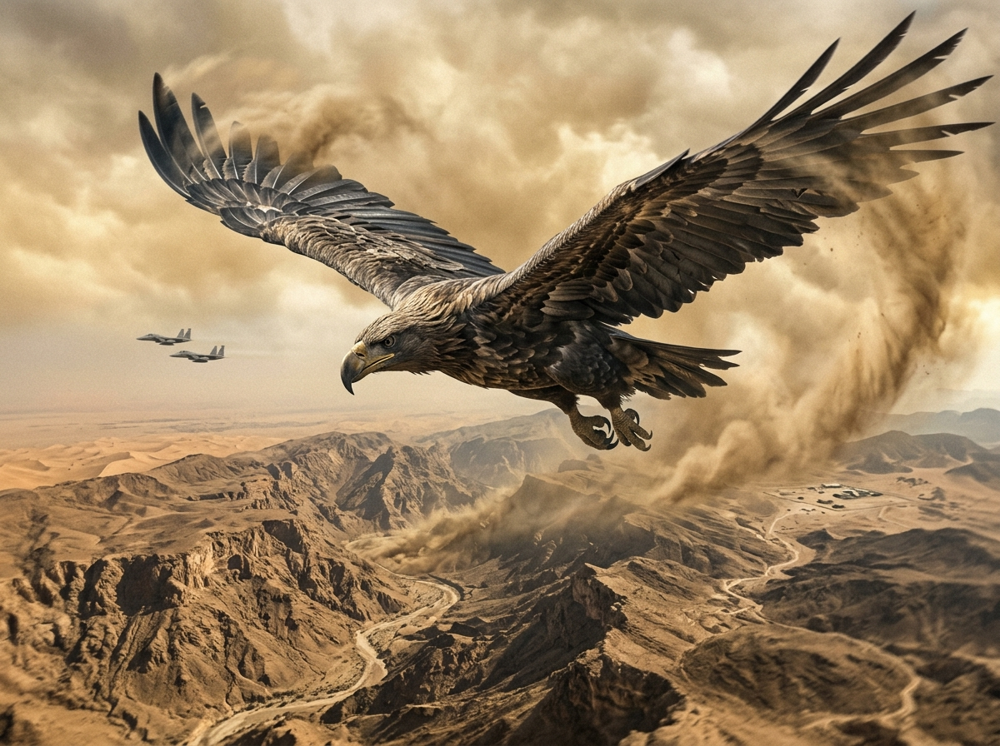
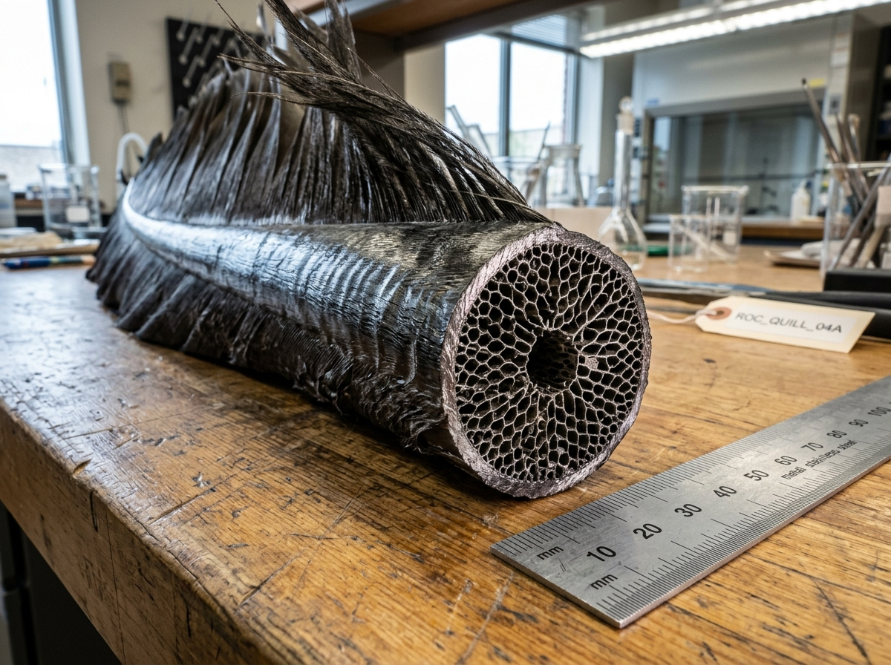
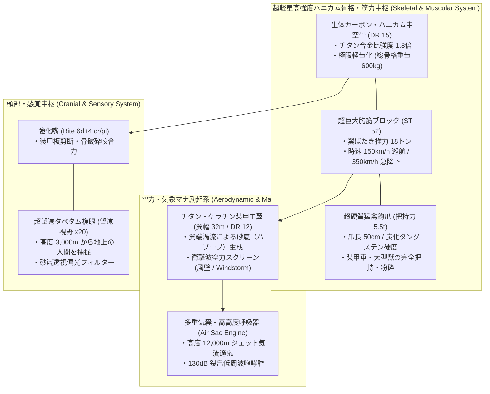
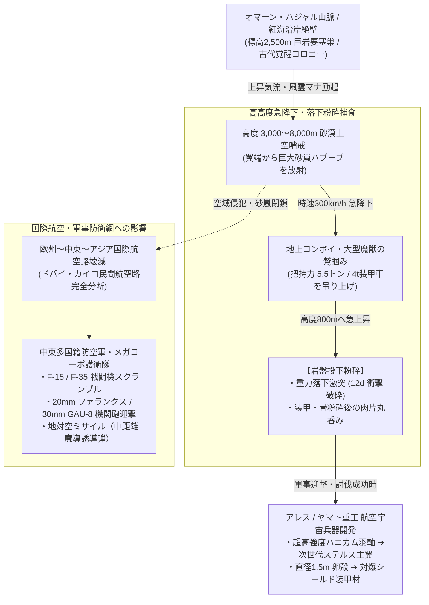

# 【砂嵐巨怪鳥 ロック（アル・ルフ）】（サアラシキョカイチョウ ロック／*Titanoroc arabicus*／Titanoroc）

---

## 1. 基本分類・メタデータ

| 項目 | 内容 |
| :--- | :--- |
| **和名** | 砂嵐巨怪鳥 ロック（サアラシキョカイチョウ ロック）、怪鳥ルフ、アル・ルフ（الرخ）、大鵬鳥 |
| **学名・分類** | *Titanoroc arabicus*（古代覚醒種・鳥綱 タカ目 ロック科 砂嵐巨禽属） |
| **英名 / 通称** | Titanoroc / Arabian Roc, Storm Feather Terror, Sky Citadel, Dune Sovereign |
| **発生起源** | **古代覚醒種（超大型怪鳥類）**（2000年ミレニアム・アウェイクニングに伴い、中東アラビア半島の未踏霊峰ハジャル山脈および紅海沿岸の深部断崖洞窟より覚醒。サハラ特異点東部の高濃度風霊・土霊マナによって再活性化した古代の空の支配種） |
| **資源・食用区分** | **汚染種（Class-C / 食用完全不可・超重要戦略軍事素材）**（※筋肉・内臓は高濃度の砂塵ミネラルおよび過負荷風霊マナを帯びており、摂取すると致命的な消化管壊死・マナ中毒を引き起こすため食用厳禁。巨大な羽軸および卵殻は最高級の航空宇宙・防空装甲素材） |
| **脅威度ランク** | **Threat Level: IV（天災指定・航空要塞級 / 師団級防空・戦闘機スクランブル対象）** |
| **主要生息域** | 中東アラビア半島山岳地帯（オマーン・ハジャル山脈、サウジアラビア・サリワート山脈）、紅海沿岸アウトランド空域、サハラ・ヴォイドゾーン東部上空 |

### 視覚資料アーカイブ（Visual Archive）
| 航空哨戒観測写真（中東砂漠上空・戦闘機スクランブル） | チタンケラチン羽軸（研究室マクロ標本写真） |
| :---: | :---: |
|  |  |
| *中東多国籍防空軍 F-15戦闘機護衛隊より望遠撮影（2026年）* | *アレス・マクロテクノロジー航空宇宙材料研究所 提供標本* |

---

## 2. 生物学的特徴・形態

### 2.1 外見・身体構造
- **全長 / 翼開長 / 体重**:
  - **全長（Total Length）**: 11〜14m（頭胴長 8〜10m、尾羽 3〜4m）。
  - **翼開長（Wingspan）**: 28〜36m（旅客機ボーイング737に匹敵する超巨大翼幅・SM +4）。
  - **体重**: 4.5〜6.5トン。
- **生体複合ハニカム中空骨（Bio-Carbon Honeycomb Skeleton）**:
  - 骨格は通常の鳥類の中空構造を遥かに超え、炭素繊維（生体カーボン）とシリカガラスが微細な正六角形ハニカム格子を形成。
  - チタン合金に匹敵する引張強度と極限の軽量性を両立し、5トンを超える巨体でありながら大気中を自在に飛翔する。
- **チタン・ケラチン装甲羽毛（DR 12）**:
  - 羽毛は砂塵の衝突摩擦と超音速降下の空力加熱に耐えるため、金属光沢を帯びたタン（黄褐色）〜暗褐色の硬質ケラチンで覆われる。
  - 羽軸（Quill）は直径 15〜25cm、厚さ数センチの複合装甲パイプとなっており、小口径弾や破片を完全に跳ね返す。
- **把持力 5.5トンの猛禽鉤爪（Titan Talons）**:
  - 足指は強靭な三前一後趾構造。爪の長さは 45〜60cm に達し、炭化タングステン並みの硬度を誇る。
  - 油圧シリンダーのような強大な腱構造により、4〜5トンの装甲車両や大型変異獣を軽々と掴み上げて上空へ運ぶ。



### 2.2 変異・覚醒の経緯
- 紀元前の千夜一夜物語（アラビアンナイト）やシンドバッドの航海記、マルコ・ポーロの東方見聞録に記録されていた伝説の巨鳥「ルフ」は、マナ濃度の低下に伴いアラビア山脈深部の巨大地下空洞で仮死・休眠していた。
- 2000年1月1日、ミレニアム・アウェイクニングによる地球規模のマナ再活性化と、サハラ特異点からの地脈エネルギー噴出によって目覚め、中東〜インド洋の制空権を奪取した。

---

## 3. 生態・行動パターン

### 3.1 食性・高高度落下粉砕狩猟（Drop-Crush Predation）
- **主食**: 大型草食魔獣（変異ラクダ、アフリカゾウ、バイソン）、大型捕食獣、および地上を走行する装甲車両・軍用コンボイ。
- **高高度落下捕食シークエンス**:
  1. **高度 2,000m からの急降下**: 砂嵐のカーテンから突然姿を現し、時速 300km/h 超のダイブで地上へ急降下。
  2. **ターゲット把持（Talon Snatch）**: 逃げ惑う装甲車両や大型獣を5.5トンの鉤爪で鷲掴みにし、空力揚力で一気に急上昇。
  3. **高度 800m からの岩盤投下**: 獲物を上空 500〜1,000m まで持ち上げてから放り投げ、時速 180km/h の終端速度で断崖の岩盤へ激突させて粉砕。装甲や骨を破砕した肉片を巨大な嘴で丸呑みにする。



### 3.2 気象操作・砂嵐（ハブーブ）形成
- 巨翼の羽ばたきにより、周囲数キロメートルの砂塵を一気に巻き上げ、**最大風速 45m/s、高さ 1,000m に達する局所的巨大砂嵐（Haboob）** を自発的に生成する。
- 砂嵐の中では視界がゼロになり、航空機のジェットエンジンに砂塵が吸入されて推力喪失（フレームアウト）を引き起こすため、中東上空を飛行する非装甲機は一瞬で撃墜される。

### 3.3 繁殖・巨大卵の生態
- **巨大卵のスペック**:
  - 10〜15年に一度、山頂の巨大なクレーター状の巣に 1〜2個の巨大卵を産卵。
  - **卵のサイズ**: 直径 1.2〜1.6m、重量 250〜350kg。卵殻の厚さは 2.5〜3.5cm に達し、小銃弾を完全に跳ね返す陶磁器複合材のような強度を持つ。

---

## 4. 魔導科学・生物学的考察

### 4.1 魔力現象と発現メカニズム
- **突風障壁（《風壁 / Windstorm》励起）**:
  - 主翼の表面から高圧の風霊マナジェットを噴出させ、飛翔前面に「空気力学的圧縮スクリーン」を形成。
  - 迎撃ミサイルの近接信管を早期爆発させたり、機関砲弾の弾道を逸らす。
- **超音速衝撃降下（《ソニック・ダイブ》）**:
  - 急降下時、風霊マナで機体周囲の空気抵抗をゼロ化。遷音速（マッハ 0.9〜1.1）まで加速し、突入時に強烈なソニックブーム（爆風衝撃波）を地上へ叩きつける。

### 4.2 科学的・電磁的相互作用
- **レーダー反射特性（巨大RCS）**:
  - 翼開長30m超の巨体であるため、軍用対空レーダー（ミリ波・フェーズドアレイ）では「大型爆撃機」並みの巨大なレーダー反射断面積（RCS: 40〜60 $m^2$）として長距離（150km以上先）から明瞭に探知可能。
- **砂嵐による電波減衰**:
  - 自ら巻き起こす砂嵐により、地上レーダーや光学照準装置の追尾精度を著しく低下（電波散乱・赤外線遮蔽）させる。

### 4.3 音響・周波数・生体通信特性（Acoustic & Resonance Analysis）
- **巨翼の超低周波脈動（Sub-Audible Wingbeat）**:
  - **周波数帯**: 12Hz〜35Hz（耳には聞こえず、胸骨やガラスを振動させる地響きインフラサウンド）。
  - **音圧**: 至近距離で **110dB**（急接近時に心拍数の乱れ・恐怖感を引き起こす）。
- **裂帛の怪鳥咆哮（Sky-Rend Screech）**:
  - **周波数帯**: 800Hz〜4.5kHz。
  - **音圧**: 最大 **130dB**（ジェットエンジンの離陸音に匹敵し、聴覚保護具なしでは鼓膜が破裂する）。

---

## 5. ガープス第4版（GURPS 4th）データブロック

```yaml
Name: 砂嵐巨怪鳥 ロック (Titanoroc / Al-Rukh)
Archetype: 超巨大古代覚醒怪鳥 / 航空天災種
Point Total: 650 pt
Threat Level: IV (天災指定・航空要塞級)

Attributes:
  ST: 52 [180]     HP: 60 [16]
  DX: 13 [60]      WILL: 14 [20]
  IQ: 5 [-100]     PER: 15 [45]
  HT: 14 [40]      FP: 22 [24]

Basic Parameters:
  Basic Speed: 6.75 [0]
  Basic Move (Ground): 4 [-10]
  Basic Move (Flight): 25 (時速 90〜150km/h / 急降下 300km/h) [30]
  Size Modifier (SM): +4 (全長 12m, 翼開長 32m, 体重 5.5t)
  Dodge: 10 (空中機動 11)

Damage:
  Talon Strike / Grasp: 5d+2 crushing / cutting (把持力 5.5t)
  Beak Bite: 6d+4 crushing / piercing (装甲板剪断)

DR (防護点):
  - 全身 (チタンケラチン装甲羽毛): DR 12
  - 頭部・嘴・骨格: DR 15

Traits & Advantages:
  - 巨大飛行 / Flight (Winged, Maximum Air Move 30) [30]
  - 5t把持握力 / Lifting ST +20 (脚部限定 -20%) [48]
  - 超望遠視覚 / Telescopic Vision 4 (望遠視野 x16) [20]
  - 砂嵐適応・保護瞬膜 / Protected Eyes, Filter Lungs [10]
  - 裂帛咆哮 / Terror (130dB Screech, Will-4判定) [50]
  - 局所気象操作 / Obscure 5 (Dust Storm / 視覚・赤外線遮蔽) [20]

Disadvantages & Quirks:
  - 巨大標的 / Size Modifier +4 (射撃命中修正 +4) [0]
  - 飛行依存 / Ground Incompetence (地上移動困難) [-10]
  - 激昂・縄張り意識 / Bad Temper (9) [-15]

Innate Spells (生体励起風霊・土霊魔術 - マナ消費はFP):
  - 《突風 / Windstorm》: Skill 15 (FP 3消費 / 翼前方へ風速 45m/s 突風噴射)
  - 《砂嵐 / Sandstorm》: Skill 14 (FP 4消費 / 半径 500m に砂嵐ハブーブを展開)
  - 《風壁 / Wind Wall》: Skill 14 (FP 3消費 / 飛翔前面に空気力学偏向スクリーンを展開)
```

---

## 6. 交戦マニュアル・防衛対策

### 6.1 軍事防空戦術・推奨迎撃兵装
- **歩兵小火器の完全無力化**:
  - 5.56mm小銃弾や7.62mm機関銃、12.7mm重機関銃の単発射撃は、DR 12の装甲羽毛および高速気流で弾き飛ばされるため**交戦不能**。
- **推奨迎撃重火器・航空戦術**:
  1. **20mm〜30mm対空機関砲（CIWS / 機関砲）**:
     - 20mm M61A2バルカン（発射速度 6,000発/分）または 30mm GAU-8アヴェンジャーによる大火力集中掃射。主翼の付け根（翼関節）を破壊して空力揚力を奪う。
  2. **地対空・空対空ミサイル（魔導複合誘導弾）**:
     - 赤外線誘導弾は砂嵐で無力化されやすいため、**ミリ波レーダー誘導またはレーザーセミアクティブ誘導ミサイル（AIM-120 AMRAAM等）** を使用。
  3. **迎撃戦闘機による超音速一撃離脱**:
     - F-15EX、F-35等の戦闘機により、ロックの旋回範囲外（高度 10,000m 以上）から中距離ミサイルを発射し、旋回巻き込みを回避する。

---

## 7. 解体・食利用・素材採取

### 7.1 食用利用の評価（Class-C: 汚染種）
- **食用区分**: **汚染種（Class-C / 食用完全禁止・劇物）**
- **毒性・有害性**:
  - 筋肉繊維は極度の高負荷運動と砂塵吸入によりゴムのように硬質で、強烈なアルカリ金属苦味と硫黄臭を持つ。
  - 摂取した場合、風霊マナ過敏症による急激な血圧上昇、心室細動、および急性胃腸出血を引き起こすため、国際食品衛生法により**完全食用不可・焼却廃棄指定**となっている。

### 7.2 戦略軍事マテリアル・先端航空宇宙応用

| 採取部位 | 工業・魔導用途 | 経済価値・取引相場 |
| :--- | :--- | :--- |
| **主翼羽軸（チタンハニカム・スパー）** | 次世代魔導戦闘機（第6世代機）の主翼桁材、超音速宇宙往還機の耐熱耐空フレーム | 1本（長さ3m）: 3,000万〜5,000万円 |
| **巨大卵殻（防護セラミック複合材）** | 大統領専用装甲車両の耐爆ライナー、結界発生器用マナ遮蔽陶板 | 1個体分完全殻: 1億5,000万円 |
| **猛禽鉤爪（チタンタロン）** | 超大型削岩機ビット、戦車用複合装甲衝角 | 1本: 200万〜400万円 |

---

## 8. 現場記録・調査員ログ

> *「アレス航空警備 第8戦闘飛行隊、コールサイン『デザート・イーグル01』。オマーン上空、高度7,000メートルで民間コンボイ輸送機の護衛任務についていた時の記録だ。*  
> *レーダー画面に突如、爆撃機並みの巨大な反射波が出現した。次の瞬間、直下の砂漠から竜巻のような砂柱が吹き上がり、視界がセピア色の闇に覆われた。ハブーブだ。*  
> *砂煙を突き破って現れたのは、鳥なんて生易しいものじゃない。『空飛ぶ要塞』だった。翼幅30メートルを超える巨怪鳥ロックが、F-15の目の前を悠然と横切ったんだ。チタンのように鈍く輝く羽毛の1本1本が、電柱ほどの太さがある。*  
> *ロックが翼を軽く一振りしただけで、強烈な下降突風が愛機のキャノピーを激しく叩いた。油圧が悲鳴を上げ、Gメーターが振り切れる。*  
> *『デザート01より各機へ！ 20ミリバルカン掃射、翼根を狙え！ 決して旋回圏内に入るな、掴まれたら終わりだ！』*  
> *サイドワインダー2発が風壁に弾かれ、機関砲の曳光弾が翼の装甲羽毛を削り取って火花を散らした。巨鳥は苛立ったように一鳴きした。130デシベルの咆哮がコクピット越しに脳髄を揺さぶり、計器のアラートが一斉に赤く染まった。*  
> *奴は中東の空の主だ。あそこを飛ぶってことは、神話の怪物と空中戦をやる覚悟が必要なんだよ」*  
> —— **アレス・マクロテクノロジー航空警備隊 大尉 カリード・アル＝マンスール**（2026年 中東空域戦闘詳報より）
