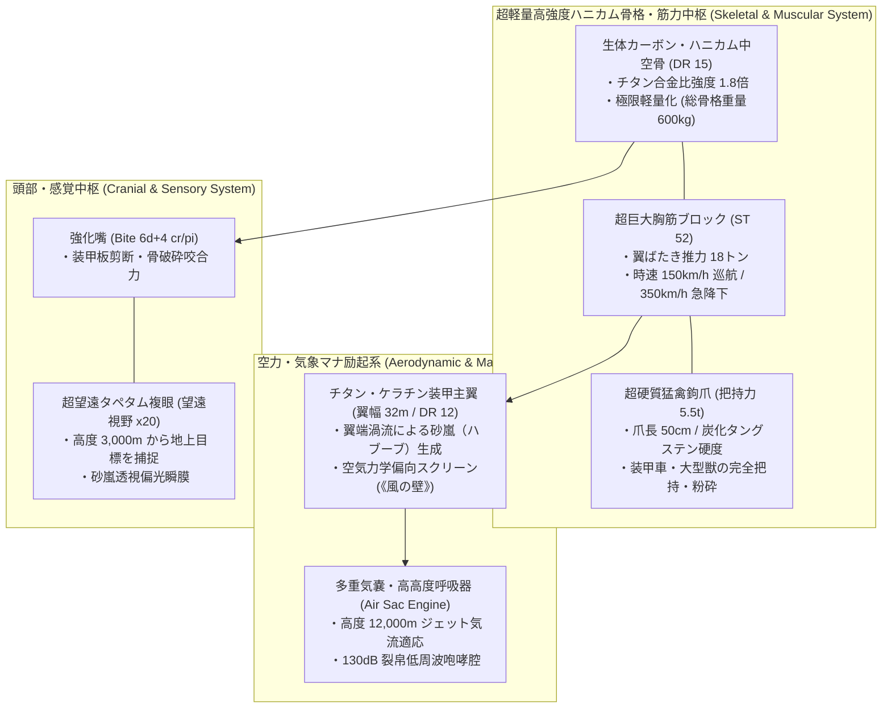
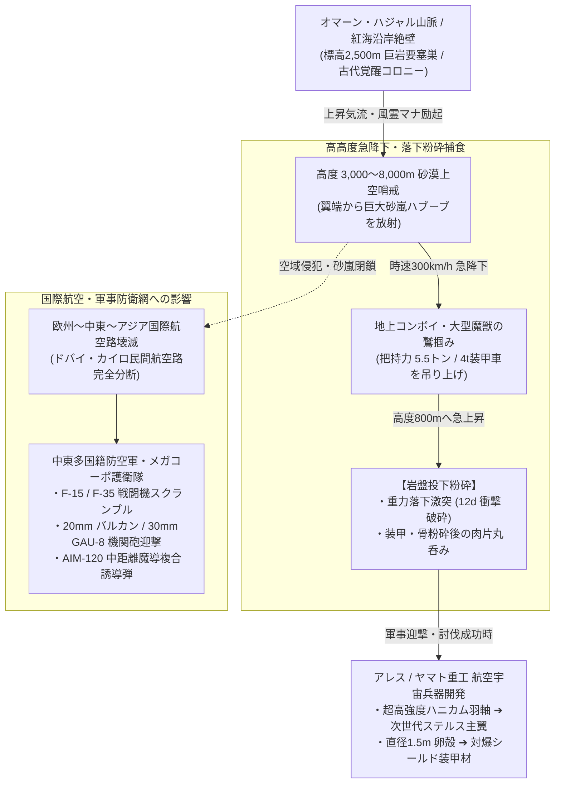

# 【アラビアルフ】（Arabian Roc／*Titanoroc arabicus*／ロック鳥、アル・ルフ）

---

## 第1章: 基本分類・メタデータ

| 項目 | 内容 |
| :--- | :--- |
| **和名** | アラビアルフ（アラビアルフ） |
| **和名命名規約** | **【地理型・伝承型】**<br>※命名根拠: 日本鳥類学会の標準和名命名慣例（修飾語＋基底名）に準拠。中東アラビア半島の一次野生生息地（地理型: アラビア）と、千夜一夜物語等で伝承される古代巨怪鳥ルフ（伝承型: ルフ）を統合命名。 |
| **英名 / 通称** | Arabian Roc / Titanoroc, Storm Feather Terror, Sky Citadel, Dune Sovereign / ロック鳥、アル・ルフ（الرخ）、大鵬鳥、空飛ぶ要塞 |
| **学名** | *Titanoroc arabicus* |
| **学名語源** | *Titanoroc*（ギリシャ神話の巨神「Titan」＋ アラビア伝承の巨鳥「Roc」）＋ *arabicus*（ラテン語: アラビアの） |
| **生物学的分類** | **門**: 脊索動物門 (Chordata)<br>**綱**: 鳥綱 (Aves)<br>**目**: タカ目 (Accipitriformes)<br>**科**: ロック科 (Titanorocidae)<br>**属**: ルフ属 (*Titanoroc*)<br>**種**: アラビアルフ種 (*Titanoroc arabicus*) |
| **発生起源** | **古代覚醒種（超大型怪鳥類）**（2000年ミレニアム・アウェイクニングに伴い、中東アラビア半島の未踏霊峰ハジャル山脈および紅海沿岸の深部断崖洞窟より覚醒。サハラ特異点東部の高濃度風霊・土霊マナ地脈によって再活性化した古代の空の支配種） |
| **資源・食用区分** | **汚染種（Class-C / 食用完全禁止・劇物・超重要戦略軍事素材）**（※筋肉・内臓は高濃度の砂塵ミネラルおよび過負荷風霊マナを帯びており、摂取すると致命的な消化管壊死・マナ中毒・心室細動を引き起こすため食用厳禁。巨大な羽軸および卵殻は最高級の航空宇宙・防空装甲素材） |
| **脅威度ランク** | **Threat Level: IV（天災指定・航空要塞級 / 師団級防空・戦闘機スクランブル対象）** |
| **主要生息域** | 中東アラビア半島山岳地帯（オマーン・ハジャル山脈、サウジアラビア・アスィール山脈／サリワート山脈）、紅海沿岸アウトランド空域、サハラ・ヴォイドゾーン東部上空 |

### 視覚資料アーカイブ（Visual Archive）

| 航空哨戒観測写真（中東砂漠上空・戦闘機スクランブル） | チタンケラチン羽軸（研究室マクロ標本写真） |
| :---: | :---: |
|  |  |
| *中東多国籍防空軍 F-15戦闘機護衛隊より望遠撮影（2026年）* | *アレス・マクロテクノロジー航空宇宙材料研究所 提供標本* |

> [!NOTE]
> 本種は **汚染種（Class-C / 食用完全禁止・劇物）** に指定されているため、ジビエ料理写真の採取・配備は行われていません（憲章第4.2条準拠）。

---

## 第2章: 伝承考証とマナ覚醒の架橋（Lore & Historical Bridge）

### 2.1 原典・民俗伝承の記録
1. **中世アラビア説話集『千夜一夜物語（アラビアン・ナイト）』**:
   - **原典章節**: 「シンドバッドの航海記（第2の航海・第5の航海）」。
   - **具体的描写**: 船乗りシンドバッドが無人島に取り残された際、太陽を覆い隠す巨大な暗雲の正体が巨鳥「ルフ」であった。ルフは象を掴んで空高く舞い上がり、岩山へ落として粉砕し捕食する。また第5の航海では、水夫たちがルフの巨大な卵（周囲50歩）を破壊した報復として、ルフのつがいが巨岩を上空から投下してシンドバッドの船を粉砕・撃沈させた。
2. **マルコ・ポーロ『東方見聞録（世界の記述）』（13世紀末）**:
   - **原典章節**: 第3巻 第36章「マダガスカル島および巨鳥ルフ」。
   - **具体的描写**: ルフは鷲に似た姿で桁外れの巨体を誇り、象を爪で掴んで空高く持ち上げ、落下死させてから喰らう。マルコ・ポーロは大ハーン（フビライ）へルフの巨大な羽軸（長さ12歩＝約8m）が献上されたと記録している。
3. **イブン・バットゥータ『三大陸周遊記』（14世紀）**:
   - **原典描写**: インド洋航海中、水平線上に浮かぶ山のような巨大な影を目撃し、水夫たちが「ルフが出現した、風に巻き込まれれば船は海底に沈む」と恐れ慄く記録が存在する。

### 2.2 2000年マナ覚醒による生体科学的架橋
- マナ希薄期（紀元後〜20世紀末）において、アラビアルフは中東アラビア山脈深部の巨大地下空洞群で代謝を極限まで低下させ、仮死・休眠状態にあった。
- 2000年1月1日の「ミレニアム・アウェイクニング」に伴い、地球規模のマナ再活性化とサハラ特異点東部からの膨大な風霊・土霊マナ地脈の奔流が地下空洞へ流入。休眠していた古代怪鳥群が一斉に再活性化・覚醒した。
- 伝承に記された「象を持ち上げて岩山へ落とす」「巨岩を投下して船を沈める」という行動は、現代において**装甲車両・軍用コンボイを捕食対象とする高高度急降下・岩盤投下狩猟行動（Drop-Crush Predation）**として完全に実証された。また、フビライへ献上されたとされる巨大な羽軸は、現代の航空宇宙工学において**「生体カーボン・チタンケラチン複合ハニカム材」**としてメガコーポ各社に熾烈な争奪戦を巻き起こしている。

---

## 第3章: 生物学的特徴・ライフステージ

### 3.1 外見・身体構造
- **体躯スペック**:
  - **全長（Total Length）**: 11〜14m（頭胴長 8〜10m、尾羽 3〜4m）。
  - **翼開長（Wingspan）**: 28〜36m（旅客機ボーイング737に匹敵する超巨大翼幅・SM +4）。
  - **体重**: 4.5〜6.5トン。
- **生体複合ハニカム中空骨（Bio-Carbon Honeycomb Skeleton / DR 15）**:
  - 骨格は通常の鳥類の中空構造を遥かに超え、炭素繊維（生体カーボン）とシリカガラスが微細な正六角形ハニカム格子を形成。
  - 総骨格重量わずか600kgでありながらチタン合金の1.8倍の引張強度を誇り、5トンを超える巨躯でありながら大気中を自在に飛翔・急旋回する。
- **チタン・ケラチン装甲羽毛（DR 12）**:
  - 砂塵の摩擦熱と遷音速降下の空力加熱に耐えるため、金属光沢を帯びた黄褐色（タン）〜暗褐色の硬質ケラチン層で覆われる。
  - 主翼羽軸（Quill）は直径 15〜25cm、厚さ数センチの複合装甲中空パイプとなっており、歩兵小口径弾や榴弾の破片を完全に弾き返す。
- **把持力 5.5トンの猛禽鉤爪（Titan Talons）**:
  - 足指は強靭な三前一後趾構造。爪長 45〜60cm、炭化タングステン並みの硬度。
  - 油圧シリンダー状の強大な腱構造により、4〜5トンの装甲車両や大型変異獣を軽々と把持して上空へ吊り上げる。
- **頭部・感覚中枢**:
  - 偏光保護瞬膜を備えた超望遠タペタム複眼により、高度3,000mから地上の歩兵や走行車両を明瞭に識別（望遠視野 x20）。



### 3.2 ライフステージと個体変異
1. **幼体・若齢期（Juvenile）**:
   - 翼開長 8〜12m、体重 800〜1,200kg。ハジャル山脈頂上の巨大巣で親鳥の保護下にある。親鳥が投下破砕した肉片を摂取して成長。この段階でも Threat Level II。
2. **成熟個体（Adult）**:
   - 翼開長 28〜36m、体重 4.5〜6.5t（Threat Level IV）。単独またはつがいで半径数百キロメートルの空域を支配。
3. **古龍級主個体（Elder Titanoroc）**:
   - 覚醒後26年間にわたり多数の軍用機や魔獣を捕食した個体。翼開長 40m 超、体重 8t 以上（Threat Level IV+）。主翼羽毛が青銅色に結晶化し、より大規模な砂嵐を自在に操る。

---

## 第4章: 生態・食物連鎖・相互作用

### 4.1 食性・高高度落下粉砕狩猟（Drop-Crush Predation）
- **主食**: 大型草食魔獣（変異ラクダ、バイソン）、大型捕食獣、および地上を走行する軍用装甲車両・物流コンボイ。
- **狩猟シークエンス**:
  1. **高度 2,000m からの急降下**: 砂嵐（ハブーブ）の暗雲から突然出現し、時速 300km/h 超のダイブで地上へ急降下。
  2. **ターゲット把持（Talon Snatch）**: 逃げ惑う装甲車両や大型獣を5.5トンの鉤爪で鷲掴みにし、空力揚力で一気に急上昇。
  3. **高度 800m からの岩盤投下**: 獲物を上空 500〜1,000m まで持ち上げてから放り投げ、時速 180km/h の終端速度で断崖の岩盤へ激突させて粉砕。装甲や骨を破砕した肉片を巨大な嘴で丸呑みにする。



### 4.2 魔獣間クロス・リレーション（相互作用）
- **砂漠草食魔獣（変異ラクダ等）**: 主たる捕食対象。群れごと上空へ持ち去られる。
- **他大型怪鳥・竜種（ドラゴン）**: 縄張りが重複した場合、超音速空中ドッグファイトを展開。鉤爪と翼打ちによる激しい激突戦となり、周囲数十キロに砂嵐が吹き荒れる。

### 4.3 縄張り・繁殖
- **繁殖生態**: 10〜15年に一度、ハジャル山脈頂上の巨岩クレーターに 1〜2個の巨大卵を産卵。
- **卵のスペック**: 直径 1.2〜1.6m、重量 250〜350kg。卵殻厚 2.5〜3.5cm の陶磁器複合装甲状セラミック。

---

## 第5章: 魔導科学・上位神性・背景ロア

### 5.1 魔力現象と発現メカニズム
- **突風障壁（《風の壁 / Wall of Wind》励起）**:
  - 主翼表面から高圧の風霊マナジェットを噴出させ、飛翔前面に「空気力学的偏向スクリーン」を形成。小口径弾や迎撃ミサイルの弾道を偏向させ、近接信管を早期作動させる。
- **局所巨大砂嵐（《風》《嵐》《土変化》複合励起）**:
  - 巨翼の羽ばたきと土霊マナにより、周囲数キロメートルの砂塵を一気に巻き上げ、**最大風速 45m/s、高さ 1,000m に達する局所的巨大砂嵐（Haboob）** を自発生成する。
- **レーダー反射特性（巨大RCS）**:
  - 翼開長30m超の巨体であるため、軍用フェーズドアレイレーダーでは「大型爆撃機」並みのレーダー反射断面積（RCS: 45〜60 $m^2$）として150km先から明瞭に探知可能。ただし、自ら展開する砂嵐により電波減衰・赤外線遮蔽が発生する。

### 5.2 音響・周波数・生体通信特性（Acoustic & Resonance Analysis）
- **巨翼の超低周波脈動（Sub-Audible Wingbeat）**:
  - **周波数帯**: 12Hz〜35Hz（インフラサウンド地鳴り）。
  - **音圧**: 至近距離で **110dB**（胸骨やキャノピーガラスを激しく振動させ、急接近時に搭乗員へ激しい動悸・恐怖感を引き起こす）。
- **裂帛の怪鳥咆哮（Sky-Rend Screech）**:
  - **周波数帯**: 800Hz〜4.5kHz。
  - **音圧**: 最大 **130dB**（ジェットエンジンの離陸音に匹敵し、聴覚保護具なしでは鼓膜を破裂させる）。

### 5.3 上位存在・アビス因果・メガコーポ伏線
- **アストラル原型（大鵬鳥・ルフの原型）**: 上位次元に座す「大気と嵐の鳥王（Bird of the Sky Tempest）」のマナ波長を受信。
- **サハラ特異点との因果**: サハラ・オアシス特異点から噴出する膨大な大気マナ地脈をエネルギー源とし、中東〜北アフリカ上空を回遊。
- **メガコーポ極秘航空宇宙開発**:
  - **アレス・マクロテクノロジー**: 回収したチタンハニカム羽軸を解析し、第6世代戦闘機の軽量高強度主翼フレームとして実用化を推進。
  - **ヤマト重工（立川研究所）**: 卵殻セラミック破片を粉砕・焼結し、要人専用装甲車および対魔導装甲板の耐爆ライナーとして特許出願。

---

## 第6章: 交戦マニュアル・都市防災コラム

### 6.1 GURPS 4th Stat Block（戦闘データ）

#### 【アラビアルフ（Standard Adult）】
- **能力値**: ST 52 [180], DX 13 [60], IQ 5 [-100], HT 14 [40]
- **副能力値**: HP 60 [16], WILL 14 [20], PER 15 [45], FP 22 [24]
- **基本速度**: 6.75, **地上移動力**: 4 [-10], **空中移動力**: 25 [30] (時速 90〜150km/h / 急降下 300km/h)
- **体格修正**: SM +4 (全長 12m, 翼開長 32m, 体重 5.5t)
- **能動防御**: よけ 10 (空中機動 11)
- **防護点（DR）**: 全身（チタンケラチン装甲羽毛）DR 12、頭部・嘴・骨格 DR 15
- **近接攻撃**:
  - 猛禽鉤爪把持（Talon Strike / Grasp）: `5d+2 cr/cut`（把持力 5.5t、装甲車圧壊）
  - 強化嘴噛みつき（Beak Bite）: `6d+4 cr/pi`（装甲板剪断）
- **生体励起呪文（FP消費）**:
  - 《風の壁 / Wall of Wind-14》: 飛翔前面に空気力学偏向スクリーンを展開（銃弾偏向）
  - 《突風 / Air Jet-15》: 翼前方へ高圧ジェット気流噴射（秒速 45m/s、ノックバック）
  - 《風 / Wind-14》 / 《嵐 / Storm-14》: 広域砂嵐ハブーブ励起
  - 《土変化 / Shape Earth-13》: 地上砂塵の急速巻き上げ
- **特徴・有利な特徴**: 巨大飛行 (Flight/Winged) [30], 5t把持力 (Lifting ST +20/脚部限定) [48], 超望遠視覚 (Telescopic Vision 4) [20], 砂嵐保護瞬膜 (Protected Eyes, Filter Lungs) [10], 裂帛咆哮 (Terror/130dB/Will-4) [50], 局所砂嵐遮蔽 (Obscure 5/Dust Storm) [20]
- **不利な特徴・癖**: 巨大標的 (SM +4/被弾修正 +4) [0], 地上移動困難 (Ground Incompetence) [-10], 激昂・縄張り意識 (Bad Temper/9) [-15]

### 6.2 推奨火器・航空戦闘戦術（Option A-1準拠）
- **歩兵火器の完全無力化**: 5.56mm小銃弾や7.62mm機関銃、12.7mm重機関銃の単発射撃は、DR 12の装甲羽毛および風壁で跳ね返されるため**交戦不能**。
- **推奨迎撃重火器・航空ドクトリン**:
  1. **20mm〜30mm機関砲による翼根集中掃射**: 20mm M61A2バルカン（毎分6,000発）または30mm GAU-8アヴェンジャーにより、主翼の付け根（翼関節）を集中的に破壊して空力揚力を奪う。
  2. **中距離魔導複合誘導弾（AIM-120 AMRAAM等）**: 赤外線誘導弾は砂嵐で無力化されるため、**ミリ波アクティブレーダー誘導またはレーザー誘導ミサイル**を使用。
  3. **超音速一撃離脱（Boom & Zoom）**: F-15EXやF-35戦闘機により、ルフの旋回圏外（高度10,000m以上）から急降下攻撃を仕掛け、掴み攻撃を完全に回避する。

### 6.3 市民防災メモ ＆ 現場専門家の知恵袋

> [!IMPORTANT]
> **【航空会社・地上コンボイ向け緊急防災警報】**
> 中東・ペルシャ湾空域において「局所ハブーブ警報（コード・ルフ）」が発令された場合、全航空機は直ちに巡航高度を13,000m以上へ上昇させるか、最寄りセーフゾーン空港へ緊急着陸してください。地上コンボイは即座に装甲ハッチを密閉し、岩陰・トンネル内へ退避して静粛待機プロトコルを実施してください。  
> —— *中東多国籍防空軍司令部 / 国際民間航空魔導保安局（ICAO）*

> [!TIP]
> **【現場戦闘機パイロットの知恵袋】**
> *「奴とドッグファイトをやろうなんて絶対に考えるな。翼幅30メートルの怪物が繰り出す旋回半径は、戦闘機より遥かに小さい。掴まれたら最後、主翼をもぎ取られて岩山へ叩き落とされる。高度1万メートルから中距離ミサイルを叩き込み、マッハ1.5で一気に離脱する——それが奴の空域で生き残る唯一の鉄則だ」*  
> —— **アレス航空警備隊 第8戦闘飛行隊 大尉 カリード・アル＝マンスール**

---

## 第7章: 解体・非可食バイオハザード指定・素材採取

### 7.1 食用利用の完全禁止・毒性評価（Class-C: 汚染種）
- **食用区分**: **汚染種（Class-C / 食用完全禁止・バイオハザード劇物指定）**
- **毒性・有害性**:
  - 筋肉繊維は超音速運動と砂塵吸入により極めて硬質（ゴム状）で、強烈なアルカリ金属苦味と硫黄臭を放つ。
  - 摂取した場合、過負荷風霊マナによる急性胃腸粘膜壊死、激しい血圧上昇、および心室細動を引き起こす。国際食品衛生法に基づき**完全食用不可・現地焼却処分指定**。

### 7.2 戦略軍事マテリアル・先端航空宇宙採取手順

| 採取部位 | 工業・魔導用途 | 経済価値・取引相場 |
| :--- | :--- | :--- |
| **主翼羽軸（チタンハニカム・スパー）** | 第6世代魔導戦闘機の主翼桁材、超音速宇宙往還機の耐熱耐空フレーム | 1本（長さ3〜5m）: 3,000万〜5,000万円 |
| **巨大卵殻（防護セラミック複合陶板）** | 国家要人専用装甲車の耐爆ライナー、都市結界発生器用マナ遮蔽板 | 1個体分完全殻: 1億5,000万円 |
| **猛禽鉤爪（チタンタロン）** | 超大型削岩機ビット、戦車用複合装甲衝角 | 1本: 200万〜400万円 |

---

## 第8章: 現場記録・通信ログ

### 8.1 アレス航空警備隊 F-15迎撃戦闘詳報（Option A-1準拠）

```
【作戦通信ログ: オマーン上空・高度7,200m 国際航空貨物護衛空域】
発信: アレス航空警備 第8戦闘飛行隊（コールサイン: デザート・イーグル）
対象: 中東多国籍防空軍 早期警戒管制機（コールサイン: サンド・アイ01）

[14:22:10] デザート01: 「サンド・アイ、こちらデザート01。レーダーに爆撃機並みの超大型ブリップを探知。ハジャル山脈上空、高度7,000、急速接近中！」
[14:22:18] サンド・アイ: 「デザート01、未確認影は【アラビアルフ】と識別！ 直下に巨大ハブーブを伴っている。各機、旋回圏内に入るな！」
[14:22:31] デザート02: 「直下の砂漠から竜巻のような砂柱が上がった！ 視界セピア！ 目視で確認……なんだあのデカさは！？ 翼幅30メートルを超えている！」
[14:22:45] デザート01: 「サイドワインダー2発発射！ ……くそっ、奴の主翼前面に展開された《風の壁》に弾かれた！ 近接信管が手前で作動した！」
[14:23:02] デザート01: 「デザート02、超音速一撃離脱へ移行！ 20ミリバルカン掃射、左翼の翼根を狙え！ 掴まれたら終わりだ！」
[14:23:15] デザート02: 「20ミリ徹甲弾、命中！ 火花が出ているが装甲羽毛に弾かれている！ 奴がこっちを向いた——！」
[14:23:22] （無線内に 130dB の凄まじい怪鳥咆哮音《Sky-Rend Screech》が混入、計器アラーム鳴動）
[14:23:28] デザート02: 「うわああっ！ 鼓膜が……！ 油圧系アラート！ キャノピーが激しく共振している！」
[14:23:36] デザート01: 「AIM-120 魔導ミリ波誘導弾、2発斉射！ FOX THREE！ ……命中！ 翼根に直撃、揚力を喪失した！ 奴が高度を下げてハジャル山脈へ退避していく！」
[14:23:50] デザート01: 「サンド・アイ、ルフの撃退に成功。貨物コンボイの安全を確保した。これより帰投する。……神話の怪物とドッグファイトなんて、二度と御免だ」
```

---

## 第9章: 参考文献・典拠資料（References）

1. **民俗学・原典文献**:
   - 中世アラビア説話集『千夜一夜物語（アラビアン・ナイト）』「シンドバッドの航海記（第2の航海・第5の航海）」
   - マルコ・ポーロ『東方見聞録（世界の記述）』（13世紀末）第3巻 第36章「マダガスカル島および巨鳥ルフ」
   - イブン・バットゥータ『三大陸周遊記』（14世紀）インド洋航海篇
2. **生物学・解剖学・航空力学資料**:
   - 国際鳥類形態学会「大型猛禽類の筋骨格比率と中空骨ハニカム引張強度モデル」（2024年）
   - アレス・マクロテクノロジー航空宇宙材料研究所「チタン・ケラチン複合羽軸の衝撃吸収特性と第6世代戦闘機主翼への応用研究」（2025年）
3. **軍事・防空・魔導法規資料**:
   - 中東多国籍防空軍「特異航空魔獣迎撃教範: 対天災級怪鳥空戦ドクトリン」（2025年版）
   - 国際食品衛生安全機構（WHO/IFSO）「Class-C 汚染種魔獣生体組織の処理及び焼却指定基準」（2023年改訂）
