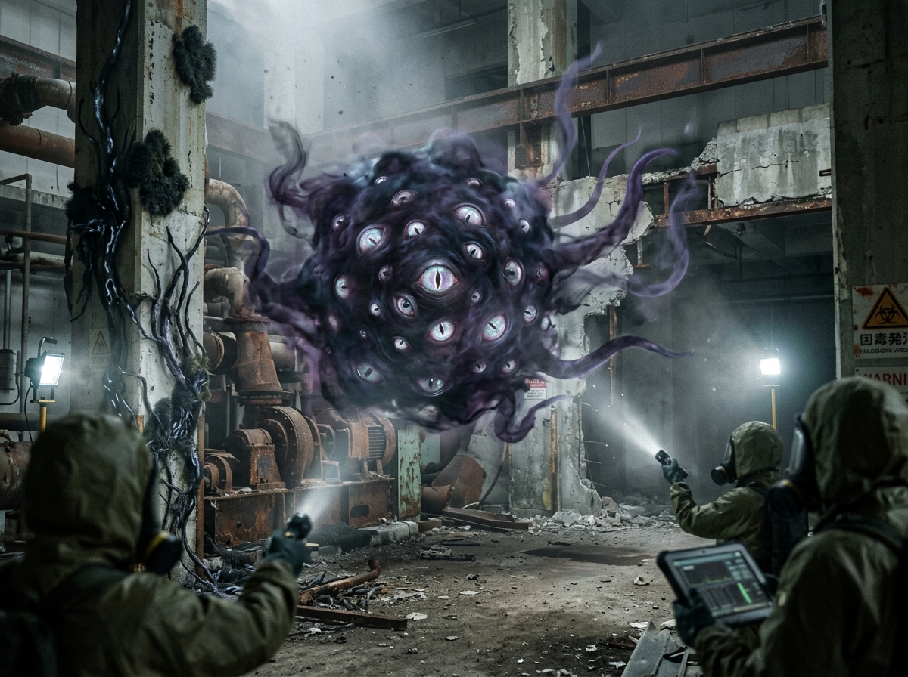
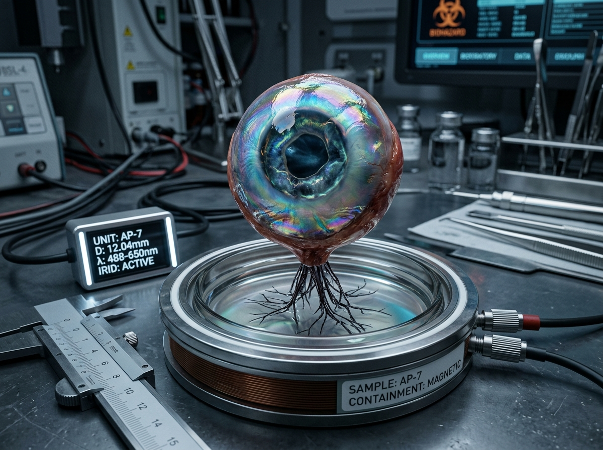
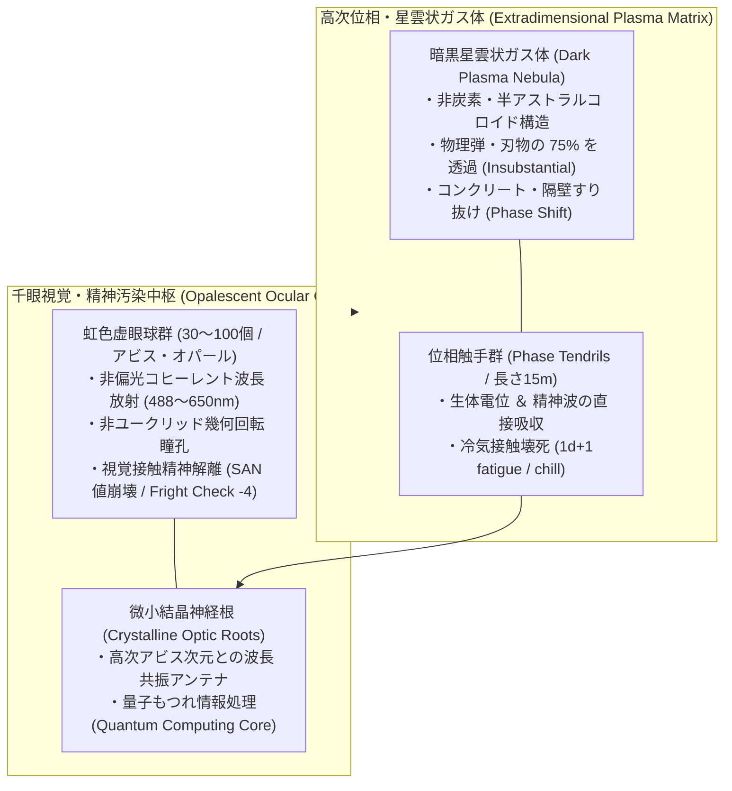
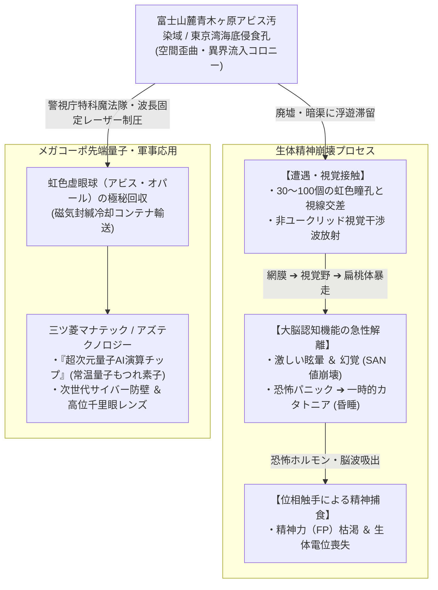

# 【千眼触手星雲 アビス・ポリプ】（センガンショクシュセイウン／*Xenopodia polyophthalma*／Abyss Polyp）

---

## 1. 基本分類・メタデータ

| 項目 | 内容 |
| :--- | :--- |
| **和名** | 千眼触手星雲（センガンショクシュセイウン）、アビス・ポリプ、虚眼這体（キョガンシャタイ）、多眼星雲 |
| **学名・分類** | *Xenopodia polyophthalma*（異界流入種・外次元異形門 虚眼綱 アビス星雲目） |
| **英名 / 通称** | Abyss Polyp / Thousand-Eye Nebula, Void Creeper, Opalescent Horror, Cosmic Drifter |
| **発生起源** | **異界流入種（アビス深淵界生命体）**（2000年ミレニアム・アウェイクニングに伴い世界各地に発生した空間の裂け目・マナ特異点より流入。地球上の炭素・骨格生物とは根本的に異なる、半物質・半アストラル体の非ユークリッド異形生命） |
| **資源・食用区分** | **汚染種（Class-C / 食用完全禁止・劇毒・高次精神汚染指定）**（※生体組織の摂取は致命的な中枢神経崩壊および肉体のアストラル壊死を引き起こすため完全食用厳禁。摘出された「虹色虚眼球」のみが超次元量子演算素子および最高級透視魔導具として極秘取引） |
| **脅威度ランク** | **Threat Level: IV（要域汚染・特殊魔法部隊／高出力レーザー専任対象）** |
| **主要生息域** | 東京都・山梨県境界 富士山麓・青木ヶ原特異災害指定地域、東京湾口アビス・ベイ海底侵食孔、バミューダ海域幽霊船群 |

### 視覚資料アーカイブ（Visual Archive）
| 隔離区域観測写真（青木ヶ原廃墟・突入部隊） | 摘出された虹色虚眼球「アビス・オパール」 |
| :---: | :---: |
|  |  |
| *警視庁特科魔法隊・青木ヶ原特別制圧班 現場撮影（2026年）* | *三ツ菱マナテック量子生体情報研究所 提供標本（AP-7）* |

---

## 2. 生物学的特徴・形態

### 2.1 外見・身体構造
- **群体サイズ / 触手長 / 質量**:
  - **本体星雲（Core Nebula）**: 直径 3.0〜5.5m（SM +2）。
  - **位相触手長（Phase Tendrils）**: 10〜15m（霧状の半透明黒紫色触手が数十本伸長）。
  - **質量**: 150〜350kg（気体プラズマ・アストラル微小コロイドの混合相）。
- **暗黒星雲状肉体（Dark Cosmic Mist Body）**:
  - 地球上の細胞・筋肉・骨格を持たず、暗黒星雲のような高密度プラズマガスとアストラル磁場で形を維持。
  - 壁や鉄扉などの物理的障害物を「位相のズレ」を利用して煙のようにすり抜ける（半実体・位相透過性）。
- **虹色虚眼球群（Ocular Spheres / アビス・オパール）**:
  - 星雲の表面に、直径 10〜25cm の球状眼球が 30〜100個以上埋め込まれている。
  - 眼球表面は油膜のように虹色（オパレッセンス）に妖しく光り、内部の瞳孔は非ユークリッド幾何学パターンで不規則に回転・伸縮する。



### 2.2 変異・覚醒の経緯
- 2000年1月1日のマナ覚醒時、地球と深淵異界（アビス・プレーン）を隔てる次元の壁に大亀裂が生じ、高次空間を漂流していた生命形態が物質界へと迷い込んだ。
- 地球上の重力・大気環境に適合するため、大気中の微小炭素とアストラル粒子を凝集させて星雲状の擬似肉体を形成し、特異災害指定地域に定着した。

---

## 3. 生態・行動パターン

### 3.1 食性・精神波＆恐怖ホルモン捕食
- **非物質代謝**: 物理的な肉や植物は一切摂食しない。
- **捕食プロセス（Psycho-Predation）**:
  1. **潜伏・多眼監視**: 廃墟の天井や暗渠の空間の歪みに滞留し、360度全方位の虚眼球で周囲を走査。
  2. **視覚接触による認知崩壊**: 人間や高等動物がその姿を直視すると、瞳孔の虹色干渉波が大脳視覚野を過剰刺激し、強烈な恐怖・幻覚・パニックを誘発。
  3. **精神エネルギー吸収**: 獲物の脳内で大量分泌されたアドレナリン・コルチゾールおよびカオス状態に陥った脳波（精神波）を、位相触手を介して直接吸い上げ、自己の存在維持エネルギーへと変換する。



### 3.2 位相変位と空間歪曲移動
- 重力や慣性の法則に縛られず、真空中や水中、空中を音もなく時速 10〜30km/h で滑空。
- 物理的な壁に衝突することなく、自身の原子位相をずらしてコンクリートや鋼鉄の隔壁をすり抜ける。

---

## 4. 魔導科学・生物学的考察

### 4.1 魔力現象と発現メカニズム
- **深淵邪神呪術（アビス・ソーサリー）同調**:
  - 本種はマナを四大元素（火・水・風・土）ではなく、「高次空間の歪み（ヴォイド・マナ）」として運用する。
- **視覚誘導神経解離（《精神汚染 / Mind Warp》《恐怖 / Panic》）**:
  - 眼球が放つ光は、波長 488〜650nm の非偏光レーザー類似干渉縞を形成。目撃者の視神経を通じてシナプス伝達をカオス同期させ、短時間で精神抵抗（WILL判定）を粉砕する。
- **位相防護（Phase Shift Defense）**:
  - 物理攻撃を受けた瞬間、運動エネルギーの作用面を「物質界」から「アストラル界」へ逃がすため、通常弾頭の直撃をほとんど無力化する。

### 4.2 科学的・電磁的相互作用
- **電子機器への生体電位誘導障害**:
  - 本種が近づくと、周囲の監視カメラや暗視スコープの映像に「砂嵐ノイズ（スノーノイズ）」や「歪んだ虹色の格子模様」が発生する（電子回路自体は破壊されないが、光学センサーが干渉波を誤認識する）。

### 4.3 音響・周波数・生体通信特性（Acoustic & Resonance Analysis）
- **逆相超音波（Inverted Ultrasonic Pulse）**:
  - **周波数帯**: 22kHz〜48kHz（周囲の通常の音波を打ち消す「逆位相ノイズ」を放ち、周囲を不自然な完全静寂に落とし込む）。
- **多重逆再生の囁き（Multivocal Whispers）**:
  - **周波数帯**: 200Hz〜800Hz（人間の言語を逆再生したような、複数の声が重なり合う不気味な空気振動音。音圧 30〜45dB）。

---

## 5. ガープス第4版（GURPS 4th）データブロック

```yaml
Name: 千眼触手星雲 アビス・ポリプ (Abyss Polyp)
Archetype: 高次異次元流入魔獣 / 深淵精神捕食種
Point Total: 420 pt
Threat Level: IV (要域汚染・特殊部隊専任)

Attributes:
  ST: 16 [60]      HP: 24 [16]
  DX: 12 [40]      WILL: 15 [25]
  IQ: 12 [40]      PER: 14 [10]
  HT: 12 [20]      FP: 20 [24]

Basic Parameters:
  Basic Speed: 6.00 [0]
  Basic Move (Air/Phase Float): 6 [0]
  Size Modifier (SM): +2 (本体直径 3.5m, 触手長 12m)
  Dodge: 9 (位相転移時 12)

Damage:
  Phase Tendril Touch: 1d+2 crushing + 1d FP drain (精神冷気)
  Gaze of the Abyss: 特殊視覚接触精神汚染 (Will-4判定)

DR (防護点) & 特殊耐性:
  - DR: 0
  - 半実体・位相透過 / Insubstantiality (通常実弾・打撃を 75% 確率ですり抜け無効化) [80]
  - 急所なし / No Vitals, No Brain [15]

Traits & Advantages:
  - 360度全方位多眼視覚 / 360-Degree Vision [25]
  - 虚眼の狂気視線 / Terror (Visual Only, Fright Check -4) [60]
  - 精神波捕食 / Leech (FP Only, Ranged Contact) [28]
  - 静寂の結界 / Silence 4 [20]

Disadvantages & Quirks:
  - レーザー光子脆弱 / Weakness (Coherent Laser Light: ダメージ2倍, 位相強制固定) [-20]
  - 空間封印脆弱 / Vulnerability (Dispel Magic / Banish: ダメージ3倍) [-30]
  - 物質界不完全適応 / Unnatural Feature (虹色発光・暗黒星雲) [-5]

Innate Spells (深淵アビス呪術 - マナ消費はFP):
  - 《精神汚染 / Mind Warp》: Skill 15 (FP 3消費 / 標的の知覚を狂わせパニックに陥れる)
  - 《位相転移 / Phase Shift》: Skill 14 (FP 2消費 / 物理隔壁をすり抜け移動)
  - 《虚空の囁き / Void Whispers》: Skill 14 (FP 2消費 / 半径10mの全員に幻聴・WILL判定-2)
```

---

## 6. 交戦マニュアル・防衛対策

### 6.1 実弾兵器の無効性と推奨特殊戦術
- **通常火器（小銃・機関銃・散弾）の限界**:
  - 実弾射撃は位相のズレにより大半がすり抜けるため、通常歩兵部隊による射撃戦は弾薬の浪費とパニックを招くため**非推奨**。
- **推奨撃退装備・特効戦術**:
  1. **高出力波長固定レーザー兵器（Mega-Joule Optical Laser）**:
     - 特定波長（532nm グリーンレーザー等）の大出力パルス光を照射すると、アストラルコロイドが光子圧で励起され、**位相が物質界に強制固定化（実体化）** する。
  2. **大気圧爆風（燃料気化爆薬 / サーモバリック）**:
     - 破片（弾片）ではなく、急激な大気圧縮衝撃波により星雲状のガス体を一気に引き裂き・四散させる。
  3. **専門魔法隊による《退散 / Dispel Magic》《空間封印》**:
     - 高位術士による空間結界展開により、アビス次元との結合を断ち切り、急速消滅・追放させる。
- **個人防護プロトコル**:
  - 偏光偏光スモークバイザー（網膜への虹色干渉波遮断）の常時着用、および向精神性マナ遮断パッチの貼付。

---

## 7. 解体・食利用・素材採取

### 7.1 食用利用の評価（Class-C: 劇毒・精神汚染）
- **食用区分**: **汚染種（Class-C / 食用完全禁止・劇物）**
- **毒性・危険性**:
  - 組織を摂取すると、細胞がアストラル崩壊を起こして体液が沸騰・変性し、致死的な多臓器不全および重度脳障害（人格崩壊）を引き起こす。国際法に基づき、残骸は専用マナ焼却炉で完全灰化処分される。

### 7.2 最先端量子テクノロジー・魔導光学応用

| 採取部位 | 工業・魔導用途 | 経済価値・取引相場 |
| :--- | :--- | :--- |
| **虹色虚眼球（アビス・オパール）** | 三ツ菱マナテック製「超次元常温量子AI演算素子」、高位術士用千里眼・透視レンズ | 1個（直径15cm）: 1億〜3億円 |
| **位相触手微細繊維** | 電脳魔術用ニューロ・インプラント伝送路、極秘ステルス被覆材 | 10g: 2,500万円 |
| **暗黒星雲凝縮液（ヴォイド・オイル）** | 空間転送ゲート（Gate Spells）安定化触媒 | 100ml: 4,000万円 |

---

## 8. 現場記録・調査員ログ

> *「青木ヶ原の第2警戒ゲート奥、立ち入り禁止の旧産業廃棄物処理場へ突入した時のことだ。*  
> *防毒マスクの通信機から、ザー……という砂嵐に混じって、誰かが呪文を逆再生で呟いているような声が聞こえ始めた。*  
> *『バイザーの偏光フィルターを最大にしろ！ 目を合わせるな！』*  
> *班長が叫んだ瞬間、天井の崩れたコンクリートの隙間から、紫黒色の靄が音もなく降りてきた。靄の表面に、油膜みたいにギラつく巨大な目玉が数十個、一斉にカッと開いたんだ。*  
> *フィルター越しだったが、頭の芯を冷たい針でかき回されたような激痛が走った。先頭の小銃手が『うわああ！ 空が、空が全部目玉だ！』と叫んで銃を乱射し、自分の頭を抱えて床に倒れ込んだ。実弾は靄を何発もすり抜けて背後の鉄扉を跳ね返しただけだった。*  
> *『レーザー照射器、起動！ 周波数532、薙ぎ払え！』*  
> *支援班の高出力グリーンレーザーが星雲を貫いた瞬間、ジュウウウ！という凄まじい悲鳴のような高周波音が響き、目玉の怪物が初めて実体化して苦悶にのたうち回った。そこにサーモバリック擲弾を叩き込んでようやく吹き飛ばしたよ。*  
> *討伐後、床にポツンと転がっていたオパール色の目玉をピンセットで回収したが……磁気ケースの中で、まだ瞳孔が私の顔をじっと見つめていたよ。あの眼球は生きているんじゃない。別の次元からこちらを覗き見ている『窓』なんだ」*  
> —— **警視庁特科魔法隊 第3突入班 警部補 志村 拓海**（2026年 青木ヶ原特異災害掃討報告書より）
