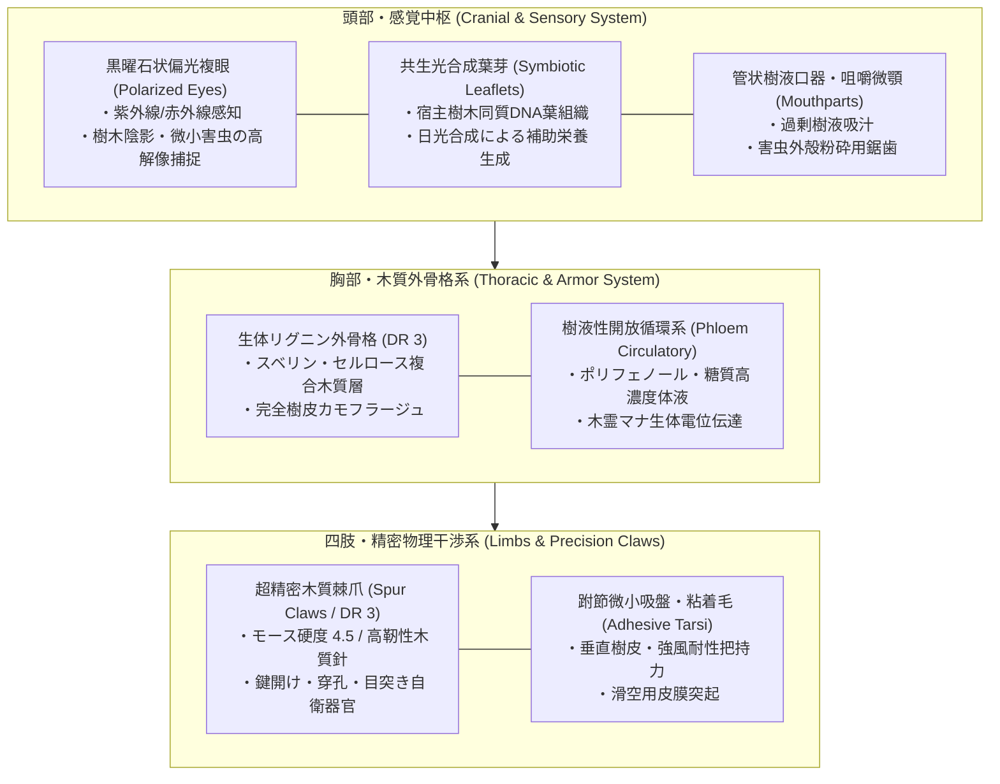
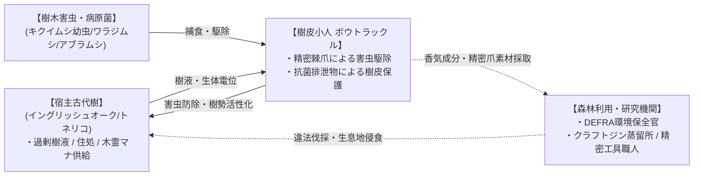

# 【樹皮小人 ボウトラックル】（ジュヒショウジン ボウトラックル／*Dendrophasma britannicum*／Wood Bowtruckle）

---

## 1. 基本分類・メタデータ

| 項目 | 内容 |
| :--- | :--- |
| **和名** | 樹皮小人 ボウトラックル（ジュヒショウジン ボウトラックル）、英国小枝守り虫、ウッド・ボウトラックル、ケルト樹守（ジュシュ）、枝小鬼（ツィグ・インプ） |
| **学名・分類** | *Dendrophasma britannicum*（急速変異種・植物節足綱 樹皮擬態目 ケルト樹守科 ボウトラックル属） |
| **英名 / 通称** | Wood Bowtruckle / Celtic Stick Guardian, Twig Imp, Bark Sprite, Bough-Dweller, Wand-Wood Watcher |
| **発生起源** | **急速変異種（植物節足キメラ共生型）**（2000年ミレニアム・アウェイクニングに伴い、英国南西部の古代ケルト樹林地帯に定着していたナナフシ類が、古代オークやセイヨウトネリコの濃厚な木霊マナ［植物生体電位］を取り込み、宿主樹木の細胞組織［リグニン・セルロース・葉緑素］と細胞レベルでキメラ融合・急速変異して誕生） |
| **資源・食用区分** | **要処理種（Class-B / 薬用・芳香蒸留原料・超精密工学素材）**（※筋組織は極小で大半が硬質リグニン・セルロース繊維のため食用肉としての利用価値は皆無。不適切な生食は重度の消化管閉塞・胃腸障害を引き起こす。一方で体液および樹皮粉末は極めて高濃度の芳香性テルペン、タンニン、植物ホルモンを含み、高級ハーブティー、クラフトジン、植物活力剤として高額取引。前肢の木質棘爪は非磁性超精密器具素材） |
| **脅威度ランク** | **Threat Level: I（局地自衛・軽微警戒級 / 厚手防護具・専用燻煙器で対処可能）** |
| **主要生息域** | 英国南西部（コーンウォール州、デヴォン州、ディーンの森）、ウェールズ古代温帯雨林、ニューフォレスト国立公園内の古代イングリッシュオーク（*Quercus robur*）、セイヨウトネリコ（*Fraxinus excelsior*）、セイヨウヒイラギ（*Ilex aquifolium*）、セイヨウイチイ（*Taxus baccata*）の巨木樹冠部 |

### 視覚資料アーカイブ（Visual Archive）
| コーンウォール古代樹林 生態写真（宿主オーク樹幹） | 生体木質棘爪（Spur Claw）精密顕微鏡標本 |
| :---: | :---: |
|  |  |
| *英国環境・食糧・農村地域省（DEFRA）特異生態系保全課 巡視記録（2026年）* | *オックスフォード大学 生体マテリアル工学研究所 提供標本* |

---

## 2. 生物学的特徴・形態

### 2.1 外見・身体構造
- **体長 / 全高 / 体重**:
  - **全高（Height）**: 15〜22cm（SM -4）。
  - **頭胴長**: 10〜14cm、前肢長 8〜12cm。
  - **体重**: 30〜55g（非常に軽量で、微風に乗って枝から枝へ滑空移動可能）。
- **生体樹皮外骨格（Bio-Lignin Exoskeleton / DR 3）**:
  - 外骨格は昆虫のクチクラ層に宿主樹木由来のリグニン、スベリン（コルク質）、および微細セルロース繊維が高密度で沈着した生体複合木質層。
  - 色彩は宿主樹木の樹皮と完全に同一化し、個体によって暗褐色、灰褐色、または地衣類・蘚苔類を模した緑斑パターンを呈する。
  - 頭頂部および肩部から2〜4枚の生きた本物の若葉（宿主樹木と同一遺伝子を持つ共生葉）が発芽しており、日光を浴びて光合成を行いエネルギーを補助生成する。
- **超精密木質棘爪（Micro-Spur Claws）**:
  - 前肢の先端には、2本の細長く尖った硬質木質化鉤爪（長さ 2.5〜3.8cm）を備える。
  - モース硬度 4.5（ガラス・軽金属と同等）の硬度と、植物繊維特有の高い柔軟性・靭性を併せ持ち、極めて細かな物理的操作（樹皮下の虫の穿り出し、鍵穴のピンの押し上げ、樹液道の開削）が可能。
- **感覚・循環器系**:
  - 頭部に2つの黒曜石状の光受容複眼を持ち、偏光および紫外線波長を感知して森の陰影を鋭敏に捉える。
  - 体液（樹液性ヘモリンパ）は無色透明〜淡黄緑色で、高濃度の糖類、アミノ酸、ポリフェノール、および微弱な木霊マナイオンが循環している。

### 2.2 変異・覚醒の経緯
- 20世紀初頭にニュージーランド等からの園芸植物輸入に伴い英国南西部に侵入・定着していたナナフシ類（*Acanthoxyla* 属等）および在来の微小昆虫群が基礎母体。
- 2000年1月1日の「ミレニアム・アウェイクニング」において、英国全土の古代ケルト聖樹林（ケルト神話において神聖視されてきたドルイドのオーク、トネリコ、イチイの巨木群）から噴出した濃厚な「木霊マナ（植物生体エネルギー）」に被曝。
- ナナフシが持つ強力な擬態遺伝子が、マナの触媒作用によって「物理的な植物細胞の直接同化・融合」へと急激に昇華。宿主樹木の維管束・樹皮細胞と昆虫の表皮組織がキメラ結合した新種魔獣 *Dendrophasma britannicum* として固定化された。

---

## 3. 生態・行動パターン

### 3.1 食性・共生行動
- **相利共生エンジニア（Mutualistic Ecosystem Engineer）**:
  - 主食は宿主樹木から分泌される過剰な樹液、および樹木を食害する有害無脊椎動物（キクイムシの幼虫、ワラジムシ、アブラムシ、ハダニ、菌類病変部）。
  - 細い前肢の棘爪を用いて樹皮の微小な裂け目から害虫を巧みに穿り出して捕食し、樹木を病害虫から保護する。
  - 排泄物には濃縮されたリン・カリウムおよび抗菌性ファイトケミカルが含まれ、樹皮の治癒を早める天然の保護軟膏として機能する。

### 3.2 縄張り・社会性
- **小家族群（Clutch）の形成**:
  - 1本の古代巨木につき、3〜8体の血縁個体からなる小グループで生活する。
  - 通常は極めて温厚かつ臆病であり、風が吹くと木の小枝のように体をリズミカルに揺らしてカモフラージュを行う。
- **激しい防衛反応（伐採・損壊への反撃）**:
  - 宿主樹木がチェーンソーや斧で伐採されようとしたり、枝を大きく折られたりすると、群れ全体が一斉に覚醒・激昂する。
  - 高所から音もなく滑空落下し、侵入者の顔面、特に眼球（角膜）や頸動脈などの露出部を目掛けて鋭利な木質棘爪で連続突刺攻撃（目突き）を敢行する。これが古くから林業従事者の間で恐れられた「木の守り手の祟り」の正体である。

### 3.3 繁殖・ライフサイクル
- **繁殖期**: 毎年4月〜5月の新緑期。
- **産卵形態**: 雌は宿主樹木の樹皮深層に、直径約 3mm の木質カプセル状卵を 5〜10個 産み付ける。
- **成長と寿命**:
  - 約60日で孵化。幼体は体長 2cm ほどの明るい若草色で、成長とともに宿主樹木の樹皮色へと変化する。
  - 植物と融合した代謝機構により寿命は極めて長く、宿主樹木の寿命と共鳴して **15〜25年** に達する個体も確認されている。

---

## 4. 魔導科学・生物学的考察

### 4.1 魔力現象と発現メカニズム
- **木霊マナ（植物生体電位）の循環と同化呪文**:
  - 本種は体内器官単独で大規模なエネルギーを放出する能力は持たないが、宿主樹木の導管網・菌根菌（マイコライザ）ネットワークと微弱生体電位を同調させる。
  - GURPS基準の魔法体系において、《樹木同化（Tree Blend）》《植物交信（Plant Whispering）》《生体微弱共振（Micro-Bio Resonance）》を常時パッシブで展開している。
  - これにより、目視はもちろん、赤外線サーモグラフィや生体熱センサーを用いても「樹木そのものの温度・波長」と同化し、発見が極めて困難（隠蔽判定に +8 の修正）。

### 4.2 科学的・電磁的相互作用
- 電子機器や送電網への直接的な破壊・電磁的干渉は一切引き起こさない。
- 高感度生体電位計を用いた測定では、宿主樹木が傷つけられた瞬間に 0.5〜2.5Hz の微弱な電位パルス（植物傷応答シグナル）がボウトラックルの神経系に直接伝達される現象が観測される。

### 4.3 音響・周波数・生体通信特性（Acoustic Logs）
- **木質摩擦クリック音（Acoustic Ultrasound Pulse）**:
  - 興奮・警戒時、前肢の木質関節を擦り合わせて **32kHz〜52kHz** の超音波クリック音（音圧 45〜60dB）を発振し、群れの仲間に危険を知らせる。
- **樹液流動超低周波（Sub-Audible Sap Resonance）**:
  - 宿主樹木の導管に体を密着させ、**5Hz〜15Hz** の不可聴超低周波振動を感知・共鳴させることで、半径数キロ以内の森林伐採や山火事の振動を早期に察知する。

---

## 5. 交戦マニュアル・防衛対策

### 5.1 GURPS 4th Edition ステータス・データブロック

| 能力値 | 数値 | コスト | 備考 |
| :--- | :---: | :---: | :--- |
| **ST** | **1** | -90 | 極小筋力（SM -4） |
| **DX** | **15** | 100 | 超俊敏・超精密運動性能 |
| **IQ** | **6** | -80 | 動物的知性（道具・鍵構造への高い直感） |
| **HT** | **11** | 10 | 植物複合強靭性 |
| **HP** | **4** | 0 | 体長 20cm 相当 |
| **意志力 (Will)** | **10** | 20 | 宿主防衛時は Fearless +4 |
| **知覚力 (Per)** | **14** | 40 | 樹林環境・微細動体視力 |
| **疲労点 (FP)** | **11** | 0 |  |
| **基本速度** | **6.5** | 0 |  |
| **移動力** | **6** | 0 | 登攀移動 8 / 短距離滑空 6 |

- **防護点 (DR)**: **3**（全身の生体リグニン外骨格。小型ナイフの浅い刃や小口径空気銃弾を弾く）。
- **有利な特徴**:
  - `カモフラージュの達人 (Chameleon 3 / 樹木限定)`: 樹皮上での隠蔽・発見難度 +8。
  - `超精密触肢 (High Manual Dexterity 4)`: 指先・爪による微細作業判定 +4。
  - `絶対的登攀能力 (Clinging)`: 垂直な樹皮やガラス面を自在に歩行。
- **技能**:
  - `カモフラージュ (Camouflage)`: 18
  - `忍び足 (Stealth)`: 16
  - `鍵開け (Lockpicking / ピッキング)`: 16（構造の直感的把握）
  - `近接格闘／目突き (Brawling / Eye Gouge)`: 15（命中時 1d-4 pi- / 防御無視の眼球直撃）
- **魔術呪文 (Spells)**:
  - 《樹木同化》-16、《植物交信》-14、《生体微弱共振》-15

### 5.2 有効な現代兵器・防護対策
- **推奨防護装備（極めて重要）**:
  - **密閉型ポリカーボネート防護ゴーグル（ANSI Z87.1規格以上）**: 必須。ボウトラックルの攻撃はほぼ 100% 眼球に集中するため、ゴーグル装着で致命傷を完全に防げる。
  - **厚手ケブラー強化レザーグローブ / ネックガード**: 露出した手首や首筋の裂傷を防止。
- **非殺傷忌避装備（推奨）**:
  - **森林用ユーカリ・針葉樹精油スモーカー（燻煙器）**: 高濃度の刺激燻煙を吹きかけることで、ボウトラックルは無傷で樹冠部へ退避する。
  - **40kHz 超音波害獣忌避スピーカー**: 指向性超音波により、攻撃意欲を完全に喪失させ接近を阻止可能。
- **火器・駆除戦術**:
  - 生態系保全法により原則殺傷禁止（罰金対象）。やむを得ない緊急自衛時は、散弾（Birdshot / 12ゲージ鳥撃ち弾）や一般的な園芸用剪定鋏で容易に対処可能。

---

## 6. 解体・食利用・素材採取

### 6.1 食用利用と加工（Class-B / 要処理種）
- **食用肉としての評価**:
  - **不可食（肉質皆無）**: 体内組織の 85% 以上が硬質なリグニン・セルロース繊維および微小な外骨格で占められており、動物性の筋肉組織は極小。
  - **健康リスク**: 未処理で経口摂取した場合、胃酸で消化されず腸壁を傷つけ、重度の腸閉塞や激しい腹痛を引き起こすため、肉としての直接食用は厳禁。
- **伝統蒸留酒・ハーブ抽出原料（要認可ジビエ加工）**:
  - **英国高級クラフトジン「ドライアドズ・バウ（Dryad's Bough Gin）」原料**:
    自然死した個体、または保全間伐時に採取された個体の樹皮・外骨格を乾燥・粉砕し、ジュニパーベリーと共にスピリッツに浸漬・減圧蒸留。
    オーク樽由来の芳醇なバニリン香、針葉樹の清涼なピネン、および微弱なリラックス効果（木霊成分）を持つ最高級クラフトジンとして1本500ポンド以上で取引される。
  - **ケルティック・ウッド・インフュージョン（薬用ハーブティー）**:
    発芽した共生葉芽と外皮スライスをブレンドしたハーブティー。抗酸化ポリフェノールおよび天然サリチル酸配糖体を豊富に含み、偏頭痛や神経痛の民間伝承薬として英国南西部で珍重される。

### 6.2 素材採取と超精密工学・バイオ医療利用
- **超精密木質棘爪（Spur Claws）**:
  - **時計製造・超精密電子器具用ピンセット**:
    完全非磁性、かつ静電気を帯電せず、金属ピンセットのように微小な歯車やシリコン基板を傷つけない理想的な弾性・硬度を持つ。スイスおよび英国の独立時計師が喉から手が出るほど求める超高級工具素材。
  - **微小外科手術用縫合ニードルガイド**:
    眼科および脳神経外科において、微小血管を把持する非侵襲性マイクロピンセットの先端チップとして医療機器メーカー（ヤマト重工・医療機器部門等）が高額買い取り。
- **生体樹皮抽出液（Phyto-Hormone Extract）**:
  - 体液から抽出される高純度オーキシン・サイトカイニン複合誘導体は、絶滅危惧植物やマナ変異薬草の発根・成長を劇的に促進する天然バイオスティミュラントとして農学研究所で活用される。

---

## 7. 現場記録・調査員ログ

> *「林業会社の若手が『変な小枝が動いた』と笑っていた次の瞬間、頭上のトネリコから緑の影が降ってきた。ゴーグルをしていなかったら、あいつの右目は今頃なくなっていただろう。ボウトラックルは悪意で襲っているんじゃない。あの小さな体で、樹齢300年の木を本気で守ろうとしているんだ。だからこそ、我々が森に入る時はチェーンソーの前にまず燻煙器を焚き、敬意を払わなきゃならん」*  
> —— **英国森林局（Forestry Commission UK） 特異樹木保全主任官 エドワード・ペンデリス**（2026年 コーンウォール・ボドミン周辺林調査日誌より）

