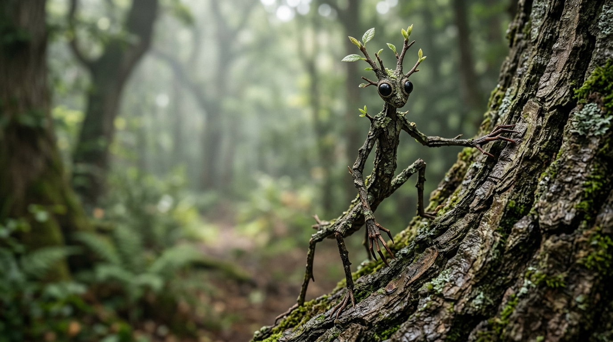
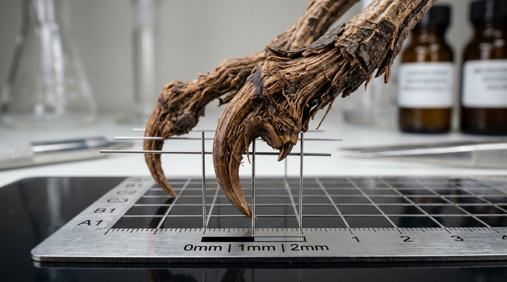
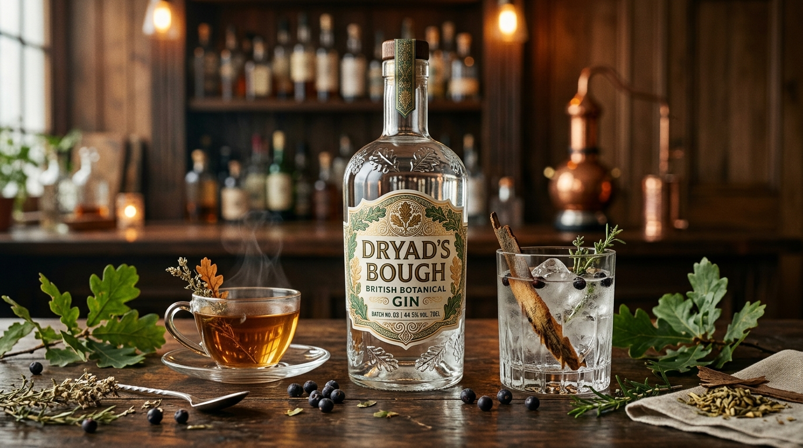
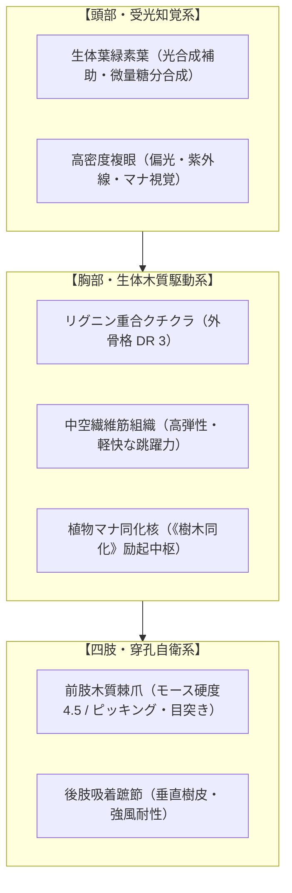
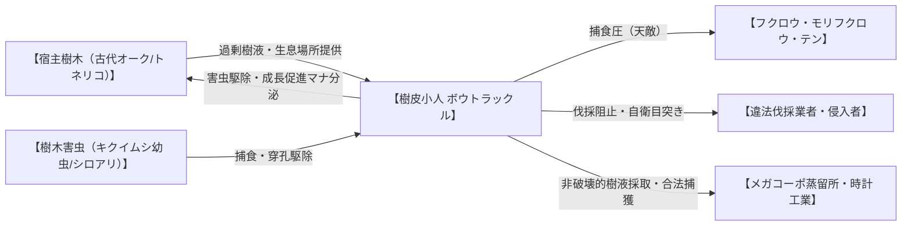

# 【樹皮小人（ボウトラックル / ジュヒショウジン）】（Wood Bowtruckle / *Dendrophasma britannicum* / 木の守り手、ドルイド・スプリガン）

---

## 1. 基本分類・メタデータ

| 項目 | 内容 |
| :--- | :--- |
| **和名** | 樹皮小人（ボウトラックル / ジュヒショウジン） |
| **英名 / 通称** | Wood Bowtruckle / 木の守り手（Tree Guardian）、小枝小人（Twig Sprite）、ドルイド・スプリガン |
| **学名** | *Dendrophasma britannicum* |
| **学名語源** | *Dendron*（古代ギリシャ語: 樹木）＋ *phasma*（古代ギリシャ語: 幻影、ナナフシ）＋ *britannicum*（ラテン語: 英国の、ブリテン島の） |
| **生物学的分類** | **門**: 節足動物門 (Arthropoda)<br>**綱**: 昆虫綱 (Insecta)<br>**目**: ナナフシ目 (Phasmatodea)<br>**科**: 樹守科 (Dendrophasmidae / 2002年新設)<br>**属**: ボウトラックル属 (*Dendrophasma*)<br>**種**: 樹皮小人種 (*D. britannicum*) |
| **発生起源** | **急速変異種**（英国南西部定着ナナフシ類が古代聖樹の木霊マナと同化） |
| **資源・食用区分** | **要処理種（Class-B）**（粗繊維のため肉食用不可 / 高級クラフトジン香気原料・薬用ハーブ・超精密工具素材） |
| **脅威度ランク** | **Threat Level: I（局地自衛級）**（単体は非好戦的。宿主樹木への侵害時のみ集団目突き自衛行動を実施） |
| **主要生息域** | 英国南西部（コーンウォール州、デヴォン州、ディーンの森）、ウェールズ古代温帯雨林、英国王立ドルイド保護林（DEFRA特別保護区） |

### 視覚資料アーカイブ（Visual Archive）

| 生態観測写真（野生環境） | 採取標本・組織マクロ写真 | クラフトジン・薬用ハーブティー写真 |
| :---: | :---: | :---: |
|  |  |  |
| *英国コーンウォール古代オーク樹皮に完全同化した成熟成体（全高18cm）。2025年王立植物園調査班撮影。* | *前肢の木質棘爪（Spur Claws）の50倍拡大標本。モース硬度4.5の高密度リグニン結晶構造を示す。* | *ボウトラックル樹皮抽出液を用いた最高級クラフトジン「ドライアドズ・バウ」とボタニカルハーブティー。* |

---

## 2. 伝承考証とマナ覚醒の架橋（Lore & Historical Bridge）

### 2.1 原典・民俗伝承の記録
- **発祥地域・原典文献**: 英国ケルト圏（コーンウォール、ウェールズ、アイルランド）、ドルイド樹木信仰、および17〜19世紀の英国民間伝承誌（『ブリテン諸島の妖精誌』『ディーンの森の民間信仰録』等）。
- **古来の目撃伝承**: 古代ケルトのドルイド僧たちは、オーク（樫）、アッシュ（トネリコ）、ナナカマドなどの聖樹に「木霊の番人（Bough-Dweller / Wood Imp）」が宿ると信じ、樹木を伐採する前にオガム文字を刻んだ木片や蜂蜜を供えて木霊の怒りを鎮めた。不敬な木こりが聖樹に斧を振り下ろすと、小枝のような小さな手が伸びて目を突かれたり、斧の柄が突然腐朽して折れたという伝説が数多く残されている。

### 2.2 2000年マナ覚醒による生体科学的架橋
- 2000年1月1日の「ミレニアム・アウェイクニング」により、英国南西部の古代原生林に蓄積されていた地霊・植物系マナが急激に噴出。当時この地域に定着していたナナフシ目昆虫（*Acanthoxyla* 属など）が、宿主樹木の導管から高濃度マナと樹液を継続摂取したことで、極めて短期間（2000〜2004年）で植物細胞と節足動物組織が同化する「植物節足キメラ変異」を起こした。
- 古来の伝承で「木の小人」と語られていた存在は、マナ希薄期に極小サイズで休眠していた原始種が、マナ覚醒によって既存のナナフシを媒介に変異・顕在化したハイブリッド個体群であると結論づけられている。

---

## 3. 生物学的特徴・ライフステージ

### 3.1 外見・身体構造
- **全高 / 体重**: 15〜22cm（成熟成体） / 30〜55g（極めて軽量な中空骨格）。
- **外皮・骨格構造（DR 3）**: 体表はリグニン、セルロース、スベリン（コルク質）が重合した強靭な「生体木質化クチクラ」で覆われており、小鳥の嘴や小型齧歯類の牙を跳ね返す防護点（DR 3）を持つ。
- **頭部知覚系・光合成補助葉**: 頭頂部には2〜4枚の生体本葉（若葉）が生えており、日光と二酸化炭素から光合成を行って微量糖分を補給。黒色の複眼は高解像度の紫外線・偏光視覚を有し、天敵の接近を素早く察知する。
- **超精密木質棘爪（Spur Claws）**: 前肢の先端に硬度モース4.5の鋭利な木質化鉤爪を2本備え、樹皮の隙間に潜む害虫を穿孔捕食するほか、侵入者の眼球を正確に狙う自衛武器となる。



### 3.2 ライフステージと個体変異
1. **幼体・若齢期（Juvenile / 孵化後0〜6ヶ月）**:
   - 体長2〜5cm、体重5〜10g。体色は明るい若草色で、樹皮よりも新芽や若葉に同化する。攻撃能力は持たず（Threat Level 0）、成体たちの保護下で宿主樹木の菌根菌や微小アブラムシを摂取する。
2. **成熟成体（Adult / 1〜15年）**:
   - 全高15〜22cm、体重30〜55g。樹皮色（褐色〜暗緑色）へ変色し、木質棘爪が完全硬化。宿主樹木の害虫駆除と樹勢維持を担当（Threat Level: I）。
3. **古樹共生個体（Elder Alpha / 樹齢200年巨木共生・15年以上生存）**:
   - 全高28〜32cm、体重120〜180g。樹齢200年を超える古代オークの主幹深部に定着した長寿個体。体表には地衣類やコケが密生し、外骨格は黒檀（エボニー）並みの硬度（DR 5）に達する。周囲の若年個体20〜30匹を精神統率し、広域の《植物交信》を操る（Threat Level: II）。

---

## 4. 生態・食物連鎖・相互作用

### 4.1 食性・捕食行動
- **主食・栄養源**: 宿主樹木の導管から浸出する過剰樹液、樹皮下に潜むキクイムシ（Scolytinae）の幼虫、ワラジムシ、シロアリ、樹皮寄生菌。
- **捕食・共生行動**: 木質棘爪で樹皮の浮いた部分をわずかにこじ開け、長い舌状器官で害虫を捕食。捕食と同時に唾液に含まれる植物ホルモン様マナ分泌液を樹木の導管へ注入し、樹木の傷口治癒と形成層の細胞分裂を促進する「完全相利共生」を営む。



### 4.2 魔獣間クロス・リレーション（相互作用）
- **朝露小精霊（デュー・スプライト）との共生**: 欧州原生林において、夜明け前にデュー・スプライトが集めた朝露エキスを頭部の若葉で吸収し、代わりに樹液の糖分を分け与える穏やかな共生関係が観測されている。
- **猛禽類・森林捕食者との関係**: モリフクロウやヨーロッパ松テン（Pine Marten）が主な天敵。ボウトラックルは天敵を察知すると即座に直立不動の「枝擬態」に入り、カモフラージュ判定（技能18）でやり過ごす。

### 4.3 縄張り・社会性・繁殖
- **社会構造**: 1本の健全な大木に1〜3家族（成体3〜8匹、幼体十数匹）が定着。樹齢数百年の巨木にはElder Alpha率いる最大30匹のコロニーが形成される。
- **繁殖**: 雌雄異体。春先（4〜5月）に交尾を行い、宿主樹木の樹皮の深い裂け目に直径2mmの木質殻卵を5〜10個産卵する。寿命は約15〜25年。

---

## 5. 魔導科学・上位神性・背景ロア

### 5.1 魔力現象と発現メカニズム
- **励起生体呪文**: パッシブ生体呪文《樹木同化-18》（周囲の木質組織と熱・マナ波長を完全同調させ、赤外線サーマルおよび肉眼から消失する）および《植物交信-14》（宿主樹木の導管電気信号を読み取り、森全体の異変を感知する）。
- **生体媒介原則の遵守**: マナは術士およびボウトラックル自身の植物節足組織にのみ作用。電子機器への電磁障害は一切発生しない。

### 5.2 音響・周波数・生体通信特性（Acoustic & Resonance Analysis）
- **樹液流動超低周波共振**: 5Hz〜15Hz（宿主樹木の導管圧力変動と同期した超低周波地響き通信。同樹林内の他コロニーへ警戒を伝達）。
- **生体超音波警戒クリック音**: 32kHz〜52kHz（音圧 40dB〜65dB / 人間の可聴域外。集団威嚇・一斉滑空のトリガーシグナル）。
- **擦過音（樹皮擦り合わせ）**: 8kHz〜14kHz（仲間同士の近距離位置確認）。

### 5.3 上位存在・アビス因果・メガコーポ伏線
- **アストラル原型「樹木霊王グリーンマン（Green Man）」**: ケルト全域の植物系マナを統括する上位精霊王「グリーンマン」の末端受容器（ノード）として機能しており、Elder個体は夢想トランス状態でグリーンマンの神託を受信する。
- **メガコーポの産業利権**: ドイツの「サエデル・シュティフトゥング」および日系「三ツ菱マナテック」は、ボウトラックルの木質棘爪が持つ「完全非磁性・極小曲率半径・高弾性」に注目し、次世代量子コンピュータ用プローブピンおよび微小脳外科手術器具の生体素材として独占調達契約を推進している。

---

## 6. 交戦マニュアル・都市防災コラム

### 6.1 GURPS 4th Stat Block（戦闘データ）

#### 【通常成熟成体（Standard Adult）】
- **能力値**: ST 1, DX 15, IQ 6, HT 11
- **副能力値**: HP 4, FP 11, 基本速度 6.5, 移動力 6 (SM -4 / 体高 18cm / 体重 45g)
- **能動防御**: よけ 10（小型俊敏ボーナス）
- **防護点（DR）**: 全身 DR 3（生体木質化クチクラ外骨格）
- **近接攻撃**:
  - **木質棘爪（Spur Claws）**: `1d-4 imp`（刺突 / リーチ C / 目への命中修正 -9 を無視する生体標的補正 +2）
- **生体呪文 / 特異能力**:
  - 《樹木同化-18》（視覚・サーマル探知に対するカモフラージュ判定+10）
  - 《植物交信-14》（樹木接触時、半径50m以内の侵入者を自動察知）
  - 《精密作業（ピッキング）-16》（細い爪を用いた機械鍵の解錠技能）

#### 【古樹共生個体（Elder Alpha）】
- **能力値**: ST 3, DX 16, IQ 8, HT 13
- **副能力値**: HP 8, FP 13, 基本速度 7.25, 移動力 7 (SM -3 / 体高 30cm / 体重 150g)
- **能動防御**: よけ 11
- **防護点（DR）**: 全身 DR 5（黒檀化外骨格＋地衣類複合装甲）
- **近接攻撃**:
  - **強化木質爪**: `1d-2 imp`（刺突 / リーチ C）
- **生体呪文 / 特異能力**:
  - 《樹木同化-20》、《植物交信-18》、《精神統率/群れ-15》（配下20匹の同時一斉滑空突撃を指揮）

### 6.2 推奨火器・防護装備
- **有効兵器**: 殺傷駆逐は極めて非推奨（森林生態系破壊および保護法違反）。どうしても排除が必要な場合は**ユーカリ精油・唐辛子成分配合の忌避燻煙器（スモーカー）**または**低圧散水ノズル**を使用。
- **必須個人防護具**: **密閉型ポリカーボネート保護ゴーグル（JIS T8147 / ANSI Z87.1規格以上 / DR 4以上）**、高耐久ケブラー製ネックガード、厚手革手袋。

### 6.3 市民防災メモ ＆ 専門家の知恵袋

> [!IMPORTANT]
> **【英国森林局（DEFRA）市民向け防災メモ：保護林散策時の注意点】**
> 1. 古代オークやトネリコの巨木から小枝を折ったり、樹皮を傷つけたりしないこと。
> 2. 木の上から「パチパチ」という高周波の擦過音が聞こえた場合、ボウトラックルの縄張りに入っている。直ちに樹木から5m以上後退すること。
> 3. 万が一小枝のような生物が顔面に向かって滑空してきた場合は、両腕で目を覆ってその場に伏せ、ゆっくりと後退して立ち去ること。  
> —— *英国環境・食糧・農村地域省（DEFRA）野生生物保護課*

> [!TIP]
> **【コーンウォール森林マタギ・樹木医の知恵袋】**
> *「奴らは決して凶暴な魔獣じゃない。ただ自分の住処である木を命がけで守っているだけさ。森に入る時は、ユーカリとラベンダーのオイルを染み込ませたパイプを吹かすんだ。煙の匂いさえ漂わせておけば、奴らは枝の奥に引っ込んで手出ししてこない。間違っても素手で目を擦るんじゃないぞ。奴らの爪は外科メスより鋭いからな。」*  
> —— **コーンウォール王立林業組合 主任樹木医 アラステア・ペンバートン**

---

## 7. 解体・ジビエ食文化・料理レシピ

### 7.1 解体プロトコルと市場相場（Class-B）
- **食用利用の制限**: ボウトラックルの筋組織は極めて微小であり、肉体の90%以上が難消化性リグニンおよび結晶セルロースで構成されているため、**肉としての直接咀嚼・摂食は完全不可（急性腸閉塞・消化管損傷リスク）**。
- **合法採取部位**: 自然脱落した木質棘爪、脱皮殻、および麻酔下で採取された微量生体樹皮エキス。
- **市場取引相場**:
  - 完全脱落木質爪（ペア）: 120,000円〜200,000円（精密工学・時計メーカー向け）
  - 生体樹皮アルコール抽出液（100ml）: 350,000円（高級蒸留所・生薬原料）

### 7.2 伝統料理・メガコーポスペシャリテ（本格レシピ）

```
【最高級ボタニカル・クラフトジン「ドライアドズ・バウ（Dryad's Bough）」】
- 分類: 英国王立特許ボタニカル・スピリッツ（アルコール度数 44.5%）
- 主原料: 
  ・ベーススピリッツ（英国産大麦100%スピリッツ）
  ・ボタニカル: ボウトラックル生体樹皮エキス（減圧蒸留原液）、ジュニパーベリー、古代オークチップ、エルダーフラワー、アンジェリカルート、レモンピール
- 減圧低温蒸留工程:
  1. 【浸漬】40℃に温めたスピリッツにボウトラックル樹皮エキスとボタニカルを24時間低温インフュージョン。
  2. 【減圧蒸留】銅製ロータリーエバポレーターを用い、マナ芳香成分（α-ピネン、リグナン配糖体）を熱破壊しないよう45kPa・38℃で減圧単式蒸留。
  3. 【熟成・加水】コーンウォール古代花崗岩湧水で加水調整し、イングリッシュオーク新樽で3ヶ月間微小マナ熟成。
- テイスティングノート:
  グラスに注いだ瞬間、深い森の霧と濡れた古代オークの厳かな木香が広がる。口に含むと針葉樹の鮮烈な清涼感と柑橘の甘みが調和し、喉を通った後に穏やかな植物マナが胸腔を満たし、精神の集中力（IQ判定+1 / 2時間持続）を研ぎ澄ます。
```

```
【ケルティック・ウッド・インフュージョン（薬用ハーブティー）】
- 分類: ドルイド伝統生薬ハーブティー
- 材料: ボウトラックル脱皮殻微粉末（0.5g）、乾燥カモミール、セイヨウトネリコ葉、野生蜂蜜
- 抽出手順: 85℃の熱湯で5分間じっくり蒸らし、蜂蜜を落として静かにステアする。
- 効能: アストラル疲労回復（FP回復速度2倍）、精神沈静、眼精疲労の緩和。
```

### 7.3 産業素材・医療利用
- **非磁性超精密ピンセット**: 硬度モース4.5、導電率ゼロ、完全非磁性の木質棘爪は、高級機械式時計（パテック・フィリップ、ロレックス等）のヒゲゼンマイ調整用ピンセットとして最高峰の評価を受ける。
- **微小脳外科用マイクロメス**: 金属アレルギーおよび電磁誘導を完全に排除できるため、先端生体サイバーウェア移植手術用メスとして医療機関に高額供給されている。

---

## 8. 現場記録・通信ログ

```
【英国コーンウォール州警察・DEFRA野生生物犯罪対策課 無線交信記録】
日時: 2025年11月14日 02:41 GMT
場所: コーンウォール州ボドミン・ムーア北端 ドルイド第3保護樹林
通報: 密猟グループによる古代オーク（樹齢300年）へのチェーンソー不法侵入

[02:41:12] 警邏隊長: 「現場到着。不審車両1台、チェーンソーの稼働音を確認。突入する。」
[02:42:05] 警邏員A: 「待て……チェーンソーの音が止まった。悲鳴が聞こえる！」
[02:42:30] 密猟者（絶叫）: 「ぎゃあああっ！ 目が、目があああっ！ 木から小枝が降ってくる！ 払え、早く払えええっ！」
[02:43:10] 警邏隊長: 「突入！ 全員ゴーグル着装！……状況確認。密猟者2名が地面に倒れて顔を押さえている。樹上に多数の光点……ボウトラックルのコロニーだ。ざっと30匹はいる。Elder個体も確認。」
[02:43:45] 警邏隊長: 「スモーカー点火。ユーカリ煙幕展開。……よし、奴らは枝の奥へ引いていく。密猟者2名を確保。両名とも眼球周辺に軽微な刺傷、視力は無事だが戦意完全喪失。救急班を要請する。」
```

> *「彼らは森の警察官であり、最も勤勉な外科医でもある。人間の身勝手な斧を前にした時だけ、彼らは自らの爪を武器に変えるのだ。彼らに敬意を払い、一本の木を大切にする心を忘れなければ、森はいつでも最高の一杯と知恵を私たちに授けてくれる。」*  
> —— **英国王立キュー植物園 名誉教授 エドワード・ハミルトン卿（2026年）**

---

## 9. 参考文献・典拠資料（References）

1. **民俗学・神話学資料**:
   - Evans-Wentz, W.Y. (1911). *The Fairy-Faith in Celtic Countries*. Oxford University Press.
   - MacCulloch, J.A. (1918). *The Celtic Mythology*. Boston: Marshall Jones Company.
   - 荒俣宏 (1990). 『世界大博物図鑑 第4巻 昆虫』 平凡社.
2. **生物学・解剖学・生化学資料**:
   - Brock, P.D. (1999). *Stick and Leaf Insects of Peninsular Malaysia and Singapore*. Malaysian Nature Society.
   - Tilgner, E.H. (2002). *Systematics of Phasmida*. University of Georgia Press.
   - 英国王立化学会 (RSC) (2024). 『植物性木質複合体におけるリグニン結晶化と生体適合性評価』.
3. **法規・軍事・産業資料**:
   - 英国環境・食糧・農村地域省 (DEFRA) (2021). *Wildlife and Countryside Act 1981: Protected Species Schedule 5 (Amended 2021)*.
   - 英国スコッチ・ウイスキー及びジン蒸留製造基準令 (2023年改訂版).
