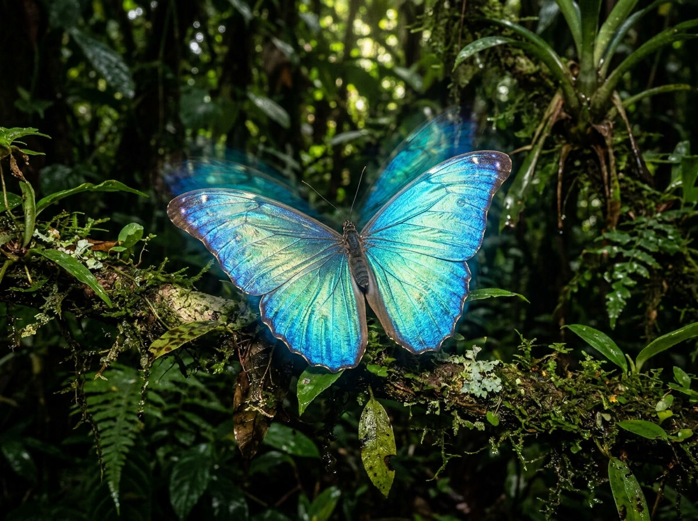
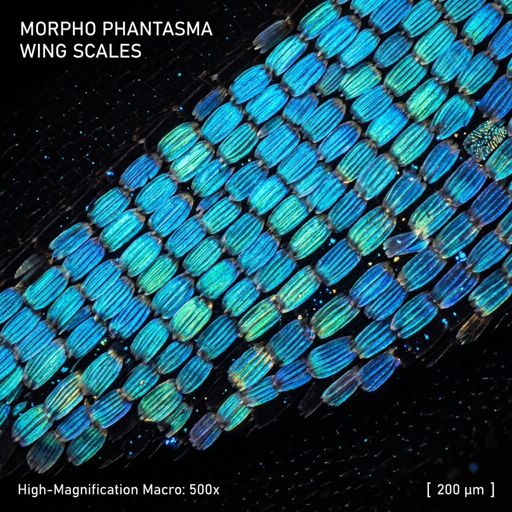
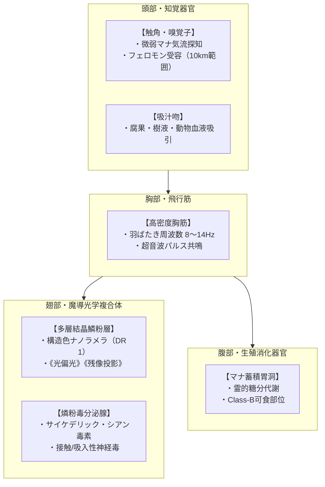
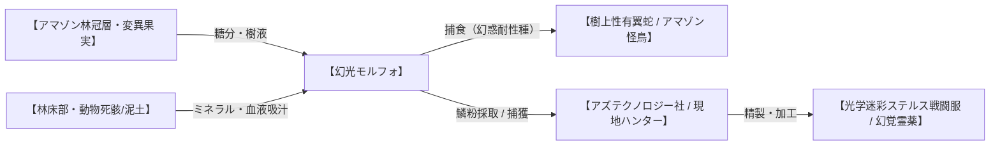

# 【幻光モルフォ】（幻光モルフォ／*Morpho phantasma*／Mirage Morpho Butterfly）

---

## 1. 基本分類・メタデータ

| 項目 | 内容 |
| :--- | :--- |
| **和名** | 幻光モルフォ（ゲンコウモルフォ） |
| **学名** | *Morpho phantasma* |
| **英名 / 通称** | Mirage Morpho Butterfly / 幻惑蝶、青燐蝶 |
| **発生起源** | **急速変異種**（2000年マナ覚醒により、モルフォチョウ属の構造色微細ラメラが光偏光器官へ極限発達） |
| **資源・食用区分** | **要処理種（Class-B）**（翅の鱗粉は劇毒につき完全切除必須。胴体・蛹は適切に加熱処理すれば高タンパク食として可食） |
| **脅威度ランク** | **Threat Level: II（警戒級）**（単体: Threat Level I / 群生スウォーム時: Threat Level III） |
| **主要生息域** | 南米アマゾン川流域原生林、特異災害指定地域「アマゾン・グリーン・ヘル」林冠層（キャノピー：地上25〜40m） |

### 視覚資料アーカイブ（Visual Archive）

| 生態観測写真（アマゾン林冠層） | 翅の微細結晶鱗粉（500倍マクロ標本） |
| :---: | :---: |
|  |  |
| *アマゾン上流「グリーン・ヘル」林冠層（地上35m）にて撮影* | *アズテクノロジー南米探査部 先端光学解析ラボ 提供標本* |

---

## 2. 生物学的特徴・形態

### 2.1 外見・身体構造
- **開張 / 体長 / 体重**: 翅開張 18〜24cm / 体長 3.5〜4.5cm / 体重 2.8〜4.2g（昆虫類としては大型、原種モルフォチョウの約1.5倍）。
- **骨格・外皮**: 
  - 胴体はキチン質の外骨格（DR 0）。
  - 翅表面は、微細な棚状ラメラ構造（モース硬度3.5相当の生体シリカ結晶複合体）を持つ数百万枚の「偏光結晶鱗粉」で隙間なく覆われている。
- **感覚器官・特異器官**:
  - **マナ偏光翅（*Ala Polarizata*）**: 日光および大気中のマナ波長（400〜480nmの可視光帯）を多重干渉・屈折させ、周囲の背景と完全に同化する「光学的不可視化」と、空中へ実体なき虚像を投影する「残像偏光（ミラージュ）」を行う。
  - **サイケデリック毒腺（*Glandula Hallucinogenica*）**: 幼虫期に摂取・濃縮したトケイソウ科植物のシアン配糖体およびアストラル毒素を合成した麻痺性燐粉を分泌する。

### 2.2 変異・覚醒の経緯
西暦2000年のミレニアム・アウェイクニングにおいて、南米アマゾン川流域に大量噴出した高濃度マナに晒されたヘレナモルフォ（*Morpho helena*）およびペレイデスモルフォ（*Morpho peleides*）が、急速な生体適応を起こした。  
原種が持っていた「棚状ラメラ構造による青色構造色」が、マナ場の励起によって光の屈折率を自在に変化させる有機液晶結晶へと変異。わずか3〜4世代（約3年）で光学的迷彩能力と集団ストロボ発光能力を獲得し、アマゾン奥地のキャノピー層に独自の魔導生態系を確立した。

---

## 3. 生態・行動パターン

### 3.1 食性・捕食行動
- **主食**: 林冠層に自生する変異熱帯果実の発酵樹液、およびアビス特異点付近に自生する霊性キノコの胞子液。
- **補食・ミネラル摂取**: 雄個体はミネラルおよびアミノ酸を補給するため、時折林床部の湿った泥土や、大型魔獣（剛毛巌猪や大型爬虫類）の死骸に集まり、吸汁吻で体液を吸い上げる（泥吸行動）。

### 3.2 縄張り・社会性
- **単独巡回と集団共鳴**: 通常は個体ごとに地上30m前後の樹冠（日光が最も当たるエリア）で縄張りを持ち、優雅に滑空飛翔している。
- **スウォーム・フラッシュ（集団共鳴防御）**: 捕食者やヘリコプター、人間部隊が樹冠に侵入すると、フェロモンと超音波パルスで半径50m以内の数十〜数百匹が一斉に集結。数千枚の翅を同期させて開閉し、強烈な目くらまし閃光（ストロボ・パルス）と幻惑燐粉の濃密な雲を形成する。

### 3.3 繁殖・ライフサイクル
- **産卵**: 宿主植物（トケイソウ科の変異種）の葉裏に、青白く発光する微小な卵を1回につき50〜80個産み付ける。
- **幼虫期**: 赤と黒の鮮烈な警戒色を持つ毛虫。体毛に触れると激痛と皮膚炎を引き起こす。
- **蛹期**: 翡翠色の硬い金属光沢を持つ蛹を形成。この蛹はマナを遮断する性質があり、現地先住民族の間で「厄除けの護符」として重宝される。
- **寿命**: 成体の寿命は約3〜4ヶ月。

---

## 4. 魔導科学・生物学的考察

### 4.1 魔力現象と発現メカニズム
- **光学偏光・残像投影（《屈折》《幻影》励起）**:
  - 翅の鱗粉表面にある厚さ約70ナノメートルのシリカラメラ層に微弱な生体マナが流れることで、屈折率が1.3から2.8まで高速変調される。
  - これにより、蝶の前方にある背景光を背後へ迂回させて透過させる「光学的インビジビリティ（不可視化）」と、光を空間に散乱させて「3〜5匹の偽の残像」を周囲数メートルに結像させる錯視を発現する。
- **サイケデリック・ストロボパルス（《閃光》《精神操作》）**:
  - 群生時の一斉開閉により、可視光全帯域（特に450nm付近の青色光）のパルス光（周波数10〜15Hz）を放射。直視した人間の脳波（アルファ波・ベータ波）を急激に乱し、光過敏性発作および知覚遅延を引き起こす。

### 4.2 科学的・電磁的相互作用
- **電子機器・通信波への非干渉**:
  - 翅の発光・偏光現象は純粋な物理的光波の屈折と生体マナ励起によるものであり、電磁パルス（EMP）や無線通信障害は一切発生しない。
  - **対抗センサー**: 通常の光学カメラや肉眼では不可視化・残像に欺瞞されるが、**赤外線サーモグラフィ（熱画像センサー）**および**ミリ波レーダー**には体温・形状が明瞭に映し出される。

### 4.3 音響・周波数・生体通信特性（Acoustic & Resonance Analysis）
- **羽ばたき基本周波数**: `8Hz〜14Hz`（超低周波、人間の耳にはほぼ無音の微風音）。
- **生体超音波パルス（警報・同期通信）**: `22kHz〜35kHz`（指向性超音波、音圧 `45dB〜55dB`）。
- **共鳴音響効果**: 数百匹のスウォーム時は、超音波パルスの唸り（ビート現象）により、可聴域（`1.2kHz〜2.4kHz`）にかすかな「鈴鳴りのような高周波耳鳴り」として人間に知覚される。

---

## 5. 交戦マニュアル・防衛対策

### 5.1 GURPS 4th Stat Block（戦闘データ）

#### 【単体成体（Single Specimen）】
- **能力値**: ST 1, DX 14, IQ 3, HT 10
- **副能力値**: HP 2, FP 10, 基本速度 6.0, 飛行移動力 12 (SM -5 / 質量約3g)
- **防護点（DR）**: 胴体 DR 0, 翅 DR 1
- **特徴・生体異能**:
  - **光学迷彩・残像投影**: 近接・射撃攻撃の命中判定に `-4` のペナルティ（赤外線・サーマル照準時はペナルティ無効）。
  - **サイケデリック鱗粉**: 半径1m内に鱗粉散布。吸入または皮膚接触時、HT-2判定に失敗すると3d6分間「多幸感・重度幻覚（朦朧・全判定-3）」状態。
- **生体呪文**: 《屈折-14》《幻影-13》《閃光-12》

#### 【群生スウォーム（Swarm / 約200〜500匹）】
- **能力値・規模**: SM +2（半径3mの球状群れ）, HP 15
- **特性（Swarm）**: 単体射撃・刺突ダメージは1ヒットにつき最大1点に軽減。散弾銃は通常ダメージ、火炎・爆風・風霊範囲攻撃は2倍ダメージ。
- **攻撃**: 群れ接触による毎秒自動ダメージ `1d-2 cr`（DR無視） ＋ 毎秒サイケデリック鱗粉呼吸器曝露（密閉防護マスク未装着時はHT-4判定）。
- **スウォーム・ストロボ**: 半径10m以内の視線が通る全対象に対し、毎ターン開始時にHT判定（失敗で1d6秒間完全盲目・めまい）。

### 5.2 推奨火器・戦術
- **推奨装備**:
  - **散弾銃（12ゲージ・バードショット / スプレッド弾）**: 拡散する散弾により、広範囲の個体を一撃で撃ち落とす。
  - **ポータブル火炎放射器 / 焼夷擲弾**: スウォームを一瞬で炭化・撃破可能。
  - **風霊系呪文（《突風》《風壁》）**: 軽い蝶の群れを瞬時に吹き飛ばし、燐粉の飛散方向を逆転させる。
- **必須個人防護具**:
  - **密閉型防毒マスク（NBC対応フィルター）**: 鱗粉吸入を100%遮断。
  - **赤外線サーマルゴーグル（熱線暗視）**: 光学迷彩・残像を完全看破。

---

## 6. 解体・食利用・素材採取

### 6.1 食用利用と調理法（Class-B）
- **可食部位と肉質**: 
  - **胴体（胸部筋肉）・蛹**: 翅と鱗粉を完全切除した後の胴体および蛹は、濃厚なナッツのような香気と良質なタンパク質、多価不飽和脂肪酸を豊富に含む。
- **下処理・調理プロトコル（Class-B免許必須）**:
  1. **鱗粉完全除染**: エタノール噴霧で翅の鱗粉を凝固・洗浄後、翅の基部から医療用メスで完全切除・密閉保管。
  2. **乾熱加熱**: 胴体を180℃以上のパーム油で素揚げ（フリット）にし、微量の熱不安定性シアン化合物を完全分解。
  3. **現地伝統料理「モルフォ・フリット・アマゾニア」**: ライムとアマゾン唐辛子（チャラピータ）を添えて提供される。
- **風味・食感**: 「香ばしいローストアーモンドと川エビの殻を合わせたような極上のサクサク感」。

### 6.2 素材採取とメガコーポ利用
- **採取可能部位**:
  - **偏光結晶鱗粉（Mirage Dust）**: 1匹から約0.5g採取可能。
  - **金属光沢蛹殻**: マナ絶縁性バイオシリカ素材。
- **産業・軍事用途**:
  - **アズテクノロジー社製「カメレオン・カモフラージュ繊維」**: 鱗粉結晶を織り込んだ次世代歩兵用光学迷彩服（市場価格: 1着あたり数百万円）。
  - **テイコク製薬「アストラル・トランキライザー」**: 燐粉毒から幻覚成分のみを単離し、重度マナ精神汚染患者用の超高純度鎮静剤として製品化。
- **バイオハザード注意**: 採取作業時は密閉クリーンルームおよび防護服が必須。素手での接触は重度の接触皮膚炎と指先神経麻痺を引き起こす。

---

## 7. 現場記録・調査員ログ

> *「林冠のツリートップデッキに出た瞬間、息を呑んだ。視界一面が息を呑むようなコバルトブルーの光に包まれていたんだ。だが、見惚れて防毒マスクのチェックを怠った新米のPMC護衛が、ゴーグルの隙間から燐粉を吸い込んだ。奴は突然、満面の笑みを浮かべながら『青い天使が歌っている』と呟き、地上35メートルの足場から熱帯雨林の闇へダイブしたよ。アマゾンの青は、世界で最も美しく、最も冷酷な死の罠だ。」*  
> —— **アズテクノロジー南米探査部 第4特務回収班 PMCチーフオペレーター ホセ・アルヴァラード**（2025年 アマゾン・セルバ観測記録より）

---
