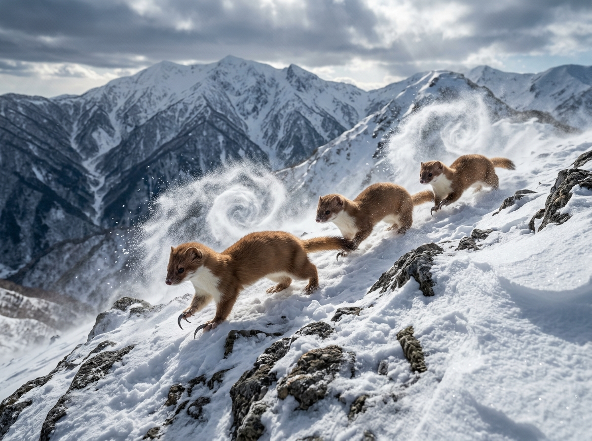
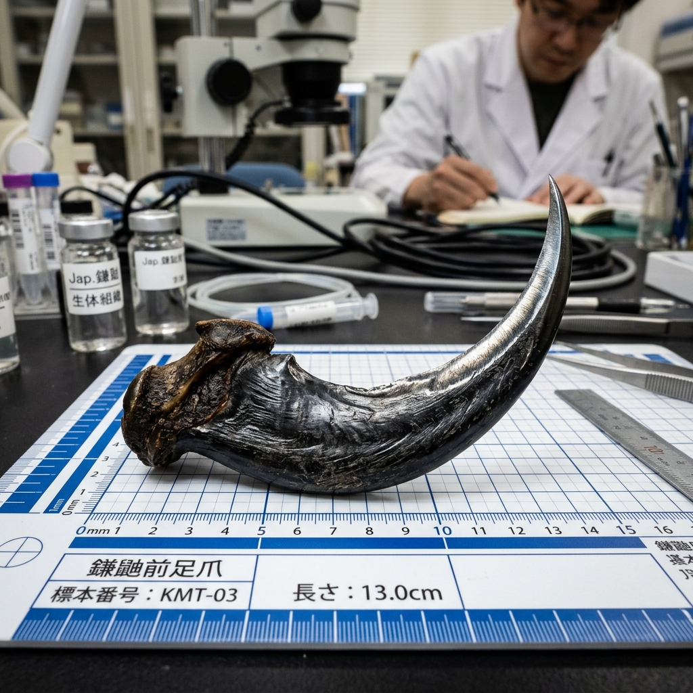
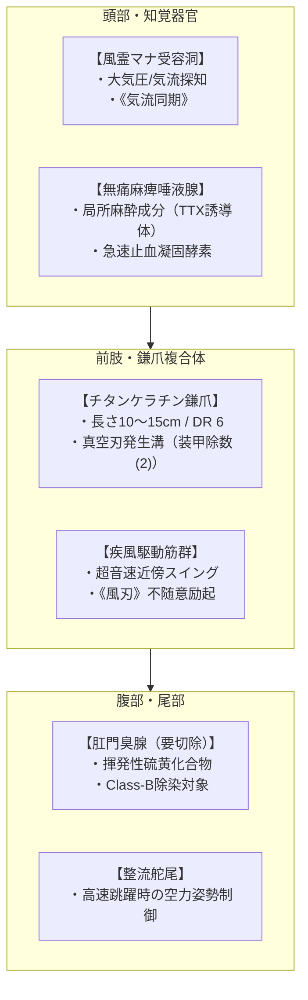
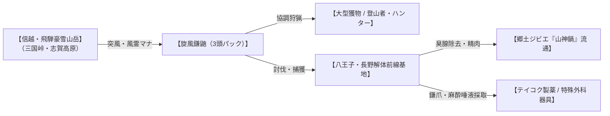

# 【旋風鎌鼬】（旋風鎌鼬／*Mustela itatsi falcata*／Whirlwind Kamaitachi）

---

## 1. 基本分類・メタデータ

| 項目 | 内容 |
| :--- | :--- |
| **和名** | 旋風鎌鼬（ツムジカマイタチ） |
| **学名** | *Mustela itatsi falcata* |
| **英名 / 通称** | Whirlwind Kamaitachi / 鎌鼬（かまいたち）、風鎌（かざがま）、雪嶺の切り裂き魔 |
| **発生起源** | **急速変異種**（2000年のマナ覚醒により、信越・飛騨の豪雪山岳地帯に生息するニホンイタチが風霊マナに適応し、前肢鉤爪の鎌化と3頭協調狩猟能を獲得） |
| **資源・食用区分** | **要処理種（Class-B）**（イタチ科特有の肛門臭腺は強烈な悪臭を放つため完全切除必須。適切に下処理された赤身肉は滋養強壮のジビエ「山神鍋」として可食） |
| **脅威度ランク** | **Threat Level: II（警戒級）**（単体: Threat Level I / 3頭連携パック時: Threat Level II〜III） |
| **主要生息域** | **信越・飛騨・北陸山岳魔境区**（新潟県越後山脈・魚沼・三国峠、長野県志賀高原・北アルプス、岐阜県飛騨高地） ※一部個体群が上信越山系を経て関東奥多摩・秩父高標高尾根筋へ越境出没 |

### 視覚資料アーカイブ（Visual Archive）

| 生態観測写真（新潟県三国峠・雪嶺） | 前肢のチタンケラチン鎌爪（13.0cm標本） |
| :---: | :---: |
|  |  |
| *越後・三国峠アウトランド雪原にて望遠観測（2026年）* | *八王子解体前線基地・魔導生体研究所 提供標本（KMT-03）* |

---

## 2. 生物学的特徴・形態

### 2.1 外見・身体構造
- **頭胴長 / 尾長 / 体重**: 頭胴長 32〜42cm / 尾長 15〜20cm / 体重 1.2〜2.2kg（原種ニホンイタチの約2倍。冬季は純白と褐色の冬毛に換毛）。
- **骨格・筋肉系**: 
  - 脊椎骨が極めて柔軟かつ強靭に発達しており、体幹をS字に屈曲させて時速70km/h以上の超高速ダッシュと急旋回を行う。
  - 前肢の第2〜第4指が融合・硬質化し、**長さ10〜15cmの三日月状「チタンケラチン鎌爪」（モース硬度6.5 / DR 6）**を形成している。
- **感覚器官・特異分泌腺**:
  - **風霊マナ受容洞（*Cavum Aeromanticum*）**: 頭頂部と肩甲骨の間に微細な気流感知洞を持ち、大気の気圧変化と風霊マナの濃度勾配を瞬時に把握する。
  - **無痛麻痺唾液腺（*Glandula Analgesica*）**: 「塗り手」個体に発達した唾液腺。強烈な局所麻酔性神経毒（テトロドトキシン誘導体）と強力な止血凝固プロテアーゼを含み、傷口に塗布することで出血死させずに獲物を完全沈黙・無力化する。

### 2.2 変異・覚醒の経緯
西暦2000年のマナ覚醒時、日本屈指の豪雪と局所風（谷風・フェーン風）が吹き荒れる越後山脈・飛騨高地に滞留していた風霊マナ溜まりにニホンイタチが曝露された。  
過酷な冬山環境で獲物を確実に仕留めるため、**「1匹では倒せない大型獲物（カモシカや人間）を3匹で役割分担して狩る」という高度な集団知能**と、風霊マナによって前肢鉤爪が鎌状に巨大化した。古来の「かまいたち伝承」は、マナ希薄期に小型化していたこの古代変異種が局所的に目撃された記録であったと現代魔導生物学では結論づけられている。

---

## 3. 生態・行動パターン

### 3.1 食性・三位一体協調狩猟（トライアングル・ハント）
- **主食**: ノウサギ、ライチョウ、キジ、および中型哺乳類（ニホンカモシカ幼獣）。
- **3頭連携の行動フロー**:
  1. **【先駆け（1匹目）】**: 獲物の前方へ突風（《突風》）とともに飛び込み、足元をすくって転倒させる。
  2. **【切り手（2匹目）】**: 転倒した獲物の背後から電光石火の勢いで跳躍し、前肢の鎌爪（《風刃》）でアキレス腱や頸動脈を瞬時に切り裂く。
  3. **【塗り手（3匹目）】**: 切り裂かれた傷口に即座に飛びつき、無痛麻痺唾液を擦り込んで出血を止め、獲物に痛みを感じさせずショック死も防いだまま生け捕りにする。

### 3.2 縄張り・社会性
- **同腹の兄弟・血縁パック**: 3頭パックは通常、同腹の雄2頭＋雌1頭、または成熟した血縁個体で形成される。
- **縄張りシグナル**: 樹皮に鎌爪でV字の刻印をつけ、超音波クリック音（38〜50kHz）で互いの位置を常に半径300m以内で把握しながら並走する。

### 3.3 繁殖・ライフサイクル
- **繁殖期**: 早春（雪解けの3〜4月）。
- **産仔**: 岩隙の巣穴で1回につき3〜5頭を出産。生後半年で鎌爪が硬化し、親個体から3頭連携の型を訓練される。
- **寿命**: 野生下で約8〜10年。

---

## 4. 魔導科学・生物学的考察

### 4.1 魔力現象と発現メカニズム
- **真空断裂波（《風刃》励起）**:
  - 前肢のチタンケラチン鎌爪の背側には微細な「微細リブレット溝」が存在し、マナを纏って秒速40m以上の速度で振り下ろされることで、爪の先端から薄さ0.1mm以下の局所的真空波（低気圧断裂波）が前方1〜2m射出される。
  - これにより、物理装甲（ケブラーや革鎧）を容易に切り裂く**装甲除数(2)**の切断力学が成立する。
- **局所気流操作（《突風》《上昇気流》）**:
  - 3頭が周囲を高速旋回することで、中心部に小さな旋風（竜巻）を形成し、最大瞬間風速25m/sの局所突風を生み出して人間を転倒させる。

### 4.2 科学的・電磁的相互作用
- **電子機器への非干渉**:
  - 風霊マナ現象は純粋な大気流体力学および生体反射であり、電磁機器へのEMP干渉や通信遮断は一切起こらない。
  - **対抗センサー**: 俊敏な動きと雪煙により肉眼照準は困難だが、**赤外線サーマル暗視装置**を用いればイタチ特有の活発な高体温（39〜40℃）が鮮明に補足可能。

### 4.3 音響・周波数・生体通信特性（Acoustic & Resonance Analysis）
- **生体超音波警戒・同期クリック**: `38kHz〜50kHz`（3頭間のミリ秒単位の狩猟同期パルス）。
- **風切り真空音（鎌刃通過音）**: `6kHz〜12kHz`（鋭利な金属音に似た「ヒュッ」という高周波風切り音、音圧 `75dB〜85dB`）。
- **威嚇声**: 可聴域 `800Hz〜1.5kHz` の激しい「クククッ」「ギャーッ」というイタチ特有の威嚇鳴き。

---

## 5. 交戦マニュアル・防衛対策

### 5.1 GURPS 4th Stat Block（戦闘データ）

#### 【単体成体（Single Specimen / 切り手）】
- **能力値**: ST 4, DX 15, IQ 5, HT 12
- **副能力値**: HP 6, FP 12, 基本速度 7.0, 移動力 14（時速約50km/h / SM -3 / 体重約2kg）
- **能動防御**: よけ 11
- **防護点（DR）**: 胴体 DR 2（柔軟毛皮）, 前肢鎌爪 DR 6
- **近接攻撃（チタン鎌爪）**: `1d-1 cut [装甲除数(2)]`（急所・首狙い修正-5）
- **射撃生体異能（風鎌刃）**: `1d cut [装甲除数(2)]`（射程 2m / 準備時間なし）
- **生体呪文**: 《風刃-14》《疾風-13》《上昇気流-12》

#### 【3頭連携パック戦術（Tri-Pack Coordination）】
- **1ターン目（先駆け）**: 《突風》攻撃（対象はSTまたはDX勝負、失敗で転倒・伏せ状態）。
- **2ターン目（切り手）**: 転倒した無防備な対象の首・腱へ全力攻撃（必中または急所狙い / 命中判定+4）。
- **3ターン目（塗り手）**: 傷口へ無痛麻痺唾液塗布（HT-3判定に失敗すると対象は即座に痛覚喪失＋手足不随・運動麻痺）。

### 5.2 推奨火器・戦術
- **推奨火器**:
  - **散弾銃（12ゲージ・00バックショット / 4号散弾）**: 面制圧により、超高機動のイタチを確実に捉えて撃破可能。
  - **粘着ネットランチャー（捕獲網）**: 動きを拘束すれば単体の膂力（ST 4）では脱出不能。
  - **赤外線サーマル連動オートタレット**: 人間の反射速度を超える跳躍に対し、ミリ秒単位の自動迎撃を行う。
- **推奨防護装備**:
  - **硬質ケブラー製ネックガード＆レッグガード**: 鎌爪の切断から頸動脈・アキレス腱を防護（DR 4以上推奨）。

---

## 6. 解体・食利用・素材採取

### 6.1 食用利用と調理法（Class-B）
- **可食部位と肉質**: 
  - **背ロース・モモ肉**: 非常に引き締まった赤身肉で、イノシシやキジに近い野性味あふれる濃厚な旨味を持つ。
- **下処理・調理プロトコル（Class-B免許必須）**:
  1. **肛門臭腺（スカンク腺）完全切除**: 尾の付け根にある臭腺嚢を絶対に傷つけずに慎重にメスで摘出・密封廃棄。
  2. **冷水放血・酒粕漬け**: 清烈な山水で完全に血抜き後、信州味噌や越後地酒の酒粕に漬け込んで臭みを完全中和。
  3. **郷土鍋「鎌鼬の山神鍋（やまのかみなべ）」**: 根菜、キノコ、生姜、信州味噌とともに煮込む伝統猟師料理。
- **風味・食感**: 「鴨肉のような濃いコクと、噛むほどに溢れる野性的な脂の甘み」。

### 6.2 素材採取と産業利用
- **採取可能部位**:
  - **チタンケラチン鎌爪（2本/個体）**: 高硬度かつ生体親和性に優れた特殊角質。
  - **無痛麻痺唾液（塗り手から採取）**: 局所麻酔ペプチド。
- **産業・医療用途**:
  - **超精密外科用マイクロメス**: 鎌爪を研磨した非金属メス（金属アレルギー患者用・眼科手術用として1本数十万円）。
  - **テイコク製薬製「カマエタチ局所麻酔スプレー」**: 唾液成分から合成された、痛みと出血を同時に瞬時遮断する野戦救急用止血麻酔薬。

---

## 7. 現場記録・調査員ログ

> *「三国峠の旧道をパトロール中、突然の地吹雪に巻かれた。足元を取られて前のめりに倒れた瞬間、右足首のあたりを冷たい風が撫でたような気がしたんだ。痛み配当まったくなかった。だが立ち上がろうとしたら、右足に力が入らない。見ると、防寒パンツが綺麗に裂けて、アキレス腱の皮一枚手前まで切断されていた。血は一滴も出ていない。傷口からは甘いハッカのような匂いがしていた。奴らは肉を食いちぎるんじゃない、完璧な外科手術のように俺たちを解体して生け捕りにするんだ。」*  
> —— **新潟県警 特科山岳警備隊 第2小隊 巡査部長 樋口賢治**（2026年 三国峠巡回記録より）

---
