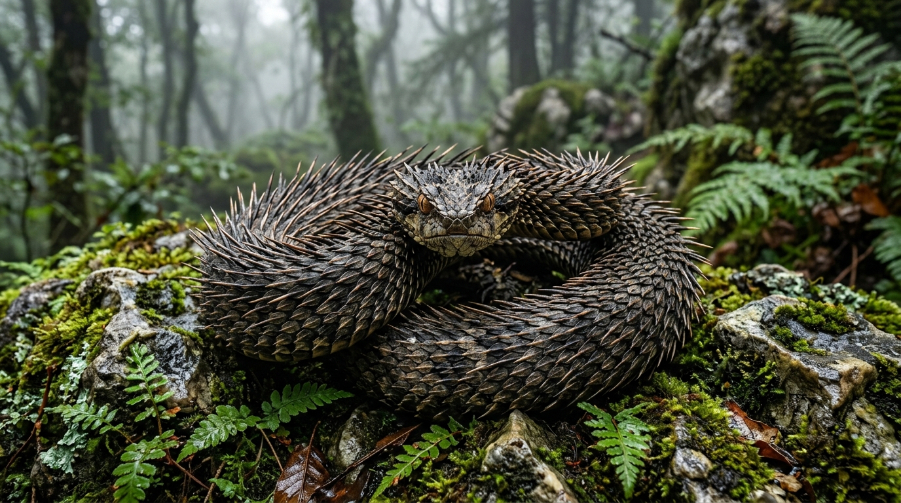
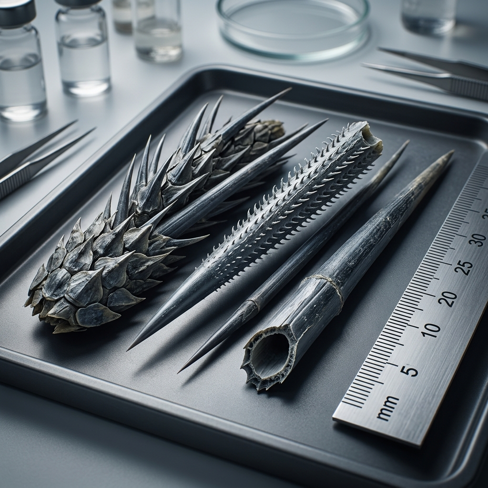
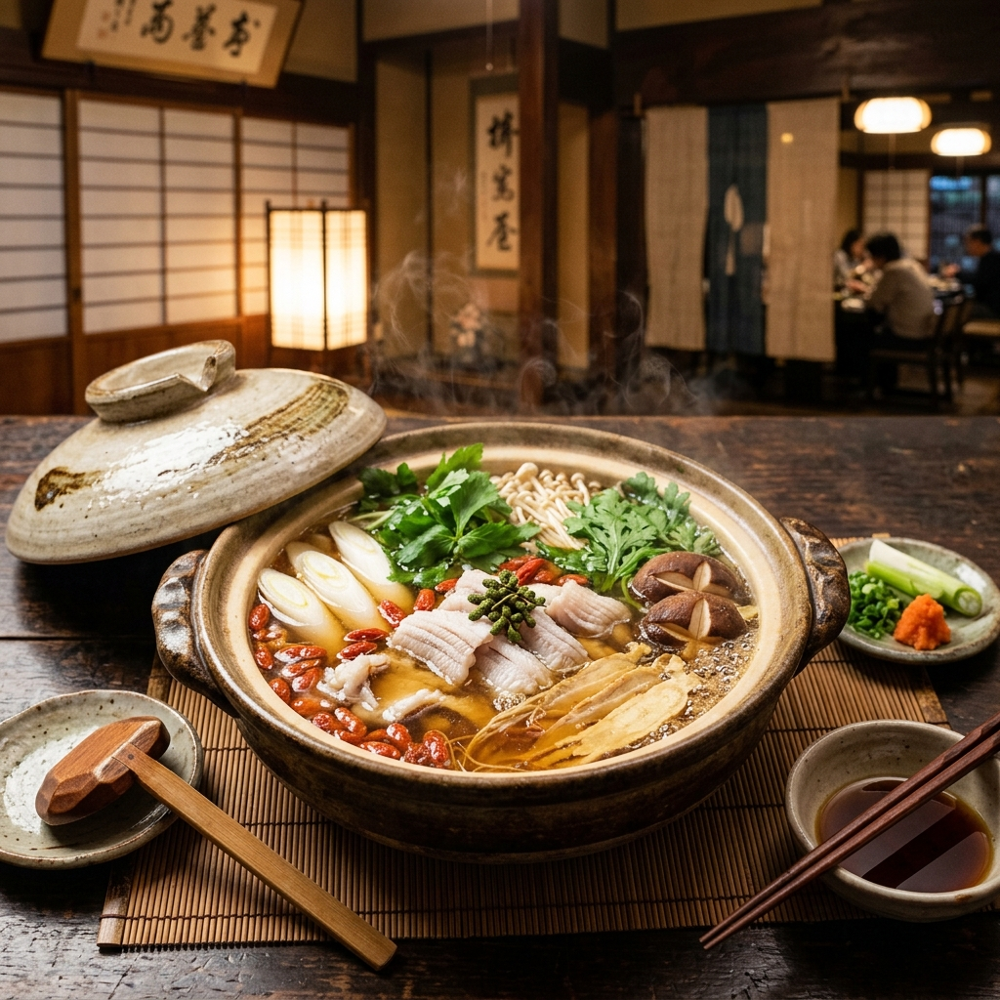
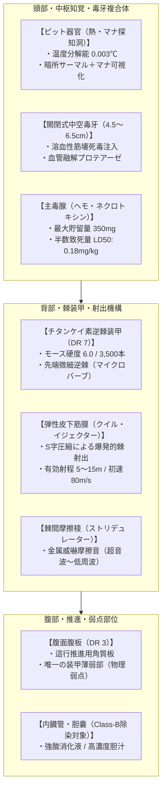
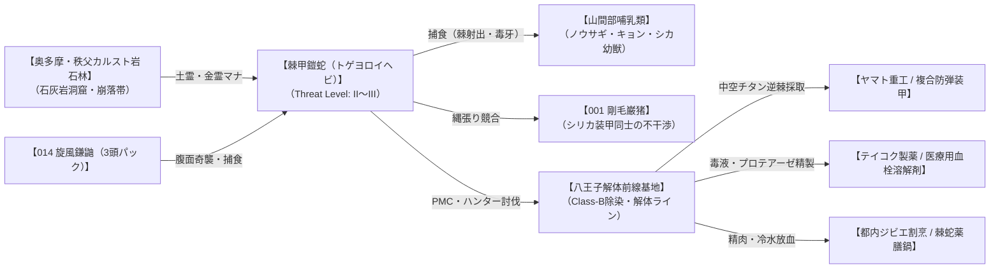
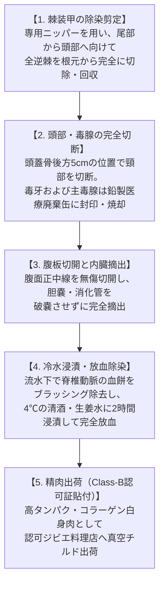

# 【棘甲鎧蛇】（棘甲鎧蛇／*Acanthoserpens echinatus*／Spined Armored Viper）

---

## 1. 基本分類・メタデータ

| 項目 | 内容 |
| :--- | :--- |
| **和名** | 棘甲鎧蛇（トゲヨロイヘビ） |
| **学名** | *Acanthoserpens echinatus* |
| **学名語源** | *Acantho-*（ギリシャ語: 棘・刺）＋ *serpens*（ラテン語: 蛇）＋ *echinatus*（ラテン語: 針だらけの、ウニ・ヤマアラシ状の） |
| **英名 / 通称** | Spined Armored Viper / トゲヘビ、ヤマアラシヘビ、針鎧蛇（ハリヨロイヘビ）、刺鱗大蛇（シリンオロチ）、オドロジャ |
| **生物学的分類** | **門**: 脊索動物門 Chordata<br>**綱**: 爬虫綱 Reptilia<br>**目**: 有鱗目 Squamata<br>**科**: クサリヘビ科 Viperidae<br>**属**: トゲヨロイヘビ属 *Acanthoserpens*<br>**種**: 棘甲鎧蛇 *A. echinatus* |
| **発生起源** | **急速変異種**（2000年のマナ覚醒時、関東・中部のカルスト山岳地帯に生息していたニホンマムシおよびクサリヘビ科変異群が土霊・金霊マナに高濃度曝露され、ケラチン質キール鱗がチタンケイ素化・逆棘クイル装甲化） |
| **資源・食用区分** | **要処理種（Class-B）**（中空棘根部の毒腺および体内溶血毒・筋融解毒の完全切除・放血が必須。適切に解体・除染された白身肉は極めて美味で滋養強壮の薬膳ジビエ「棘蛇鍋」「刺蛇酒」として高値流通） |
| **脅威度ランク** | **Threat Level: II〜III（警戒〜即応級）**（単体成体: Threat Level II / 全長4m超の主級・大蛇変異個体: Threat Level III） |
| **主要生息域** | **関東・中部・近畿山岳魔境区**（奥多摩・丹沢・秩父アウトランド、奥秩父主脈、標高600〜1,400mの石灰岩カルスト帯・崩落岩石林・鍾乳洞窟網） |

### 視覚資料アーカイブ（Visual Archive）

| 生態観測写真（奥多摩・岩石林） | 採取標本・逆棘マクロ写真 | 伝統薬膳ジビエ「棘甲蛇の薬膳滋養鍋」 |
| :---: | :---: | :---: |
|  |  |  |
| *奥多摩・日原鍾乳洞周辺アウトランドにて撮影（2026年）* | *八王子解体前線基地・魔導生体研究所 標本（ASP-15）* | *銀座・高級ジビエ割烹「神楽坂 萬善亭」提供（Class-B認可店）* |

---

## 2. 伝承考証とマナ覚醒の架橋（Lore & Historical Bridge）

### 2.1 原典・民俗伝承の記録
- **発祥地域・原典文献**:
  - 中国明代の薬学書『本草綱目』虫部第四十三巻に記載される「刺蛇（しじゃ / 体表に無数の剛刺を生じ、草木を薙ぎ払い、触るる者に激痛と腐乱をもたらす怪蛇）」。
  - 江戸時代の怪異奇談集『絵本百物語』および関東甲信越山間部の杣人伝承に登場する「棘蛇（オドロジャ）」「針鎧の野槌（ノヅチ）」。
- **古来の目撃伝承**:
  - 「深山幽谷の巨石群に潜み、山犬や猪が近づけば全身の針を逆立てて威嚇し、時に針を吹き飛ばして獲物を射抜く」と伝えられ、古来よりマタギや山伏の間で“神の針帯びし蛇”として畏怖されていた。

### 2.2 2000年マナ覚醒による生体科学的架橋
西暦2000年のミレニアム・アウェイクニングにおいて、奥多摩や秩父の石灰岩層・カルスト地脈から噴出した高濃度の土霊マナ（地属性）および金霊マナ（鉱物共鳴）に、クサリヘビ科の地域個体群が曝露された。  
クサリヘビ科特有の表皮鱗にある隆起線（キール）が、マナ変異シグナルによって細胞分裂の異常亢進と石灰化を起こした。カルシウム、二酸化ケイ素（シリカ）、生体チタンがケラチンタンパク質と強固にキレート結合し、**わずか数世代で「ヤマアラシの針毛と同様の中空・微細逆棘（マイクロバーブ）構造」を持つ硬質クイル装甲へと急進化**した。古文書に散見された「刺蛇」の記録は、マナ希薄期に小型・休眠状態で局所的に残存していた古代変異個体の目撃例であったと現代魔導生物学では結論づけられている。

---

## 3. 生物学的特徴・ライフステージ

### 3.1 外見・身体構造
- **全長 / 胴回り / 体重**: 全長 2.5〜4.2m / 最大胴回り 35〜55cm / 体重 18〜38kg（原種ニホンマムシの約30〜50倍）。
- **骨格・筋肉系・外皮（DR値）**:
  - **チタンケイ素逆棘外皮（DR 7 / モース硬度6.0）**: 全身を覆う約3,500〜5,000本の棘は、長さ3〜12cmの中空硬質棘。ヤマアラシの針毛と同様に先端部へ向けて無数の微細な逆棘（マイクロバーブ）がびっしりと並んでおり、一度刺さると筋肉の収縮によって自動的に生体深部へ潜行する。
  - **弾性皮下筋膜（*Fascia Jaculatoria*）**: 皮膚直下に強力な筋膜層を持ち、胴体を急激にS字圧縮・解放することで、背部および尾部の棘を爆発的に脱落・射出できる。
  - **腹面腹板（DR 3）**: 腹部は這行運動のため柔軟な角質板となっており、装甲が最も薄い構造的弱点となっている。
- **感覚器官・特異マナ器官**:
  - **ピット器官（熱・マナ探知洞）**: 鼻孔と眼の間に位置し、0.003℃の微細な温度差および生体マナの放射熱を感知。暗闇の洞窟内でも獲物の心拍と血管配置を完全に可視化する。
  - **複合溶血壊死毒腺（*Glandula Hemo-Necrotica*）**: 頭部両側および棘根部の皮下小胞に存在。強烈なブラジキニン遊離酵素、溶血ホスホリパーゼA2、筋肉融解金属プロテアーゼを高濃度で含有する。



### 3.2 ライフステージと個体変異
1. **幼体・若齢期（Juvenile / 生後〜2年）**:
   - 全長 60〜120cm、体重 1.5〜3.5kg。棘はまだゴム状の軟質ケラチン（DR 2〜3）であり、棘の射出能力はない。母蛇の岩隙の巣で保護され、小型トカゲや野鼠を捕食。脅威度: **Threat Level I**。
2. **成熟個体（Adult / 生後3〜10年）**:
   - 全長 2.5〜3.5m、体重 18〜28kg。棘が完全石灰化・チタンケイ素化し、DR 7の外殻と棘射出能力を獲得。強固な縄張りを形成。脅威度: **Threat Level II**。
3. **主級・変異個体（Alpha / 針大蛇「豪猪大蛇」/ 樹齢15年以上）**:
   - 全長 4.5〜6.0m超、体重 45〜65kg。カルスト深奥部の高濃度マナ溜まりに長期間君臨した長寿個体。棘は鋼鉄を凌駕する硬度（DR 9 / モース硬度7.0）に達し、棘の射出本数は一度に50本を超える。脅威度: **Threat Level III**。

---

## 4. 生態・食物連鎖・相互作用

### 4.1 食性・捕食行動
- **主食・栄養源**:
  - ノウサギ、タヌキ、ハクビシン、キョン、ニホンジカの幼獣、および中型鳥類。
- **アンブッシュ＆クイル・バースト狩猟戦術**:
  1. **擬態潜伏**: 石灰岩の崩落岩隙や厚い落ち葉層に全身を潜ませ、棘の模様を岩石に同化させて待機。
  2. **金属摩擦威嚇（ストリデュレーション）**: 獲物が接近すると、全身の棘を高速振動させて「シャキシャキシャキ…」という強烈な摩擦音を発生させ、獲物を驚愕・硬直（フリーズ）させる。
  3. **棘射出（クイル・バースト）＋毒牙突撃**: 距離10m以内から胴体をバネのように解放して尾部の棘を斉射。獲物の脚部や胴体に逆棘を突き刺して逃走を阻止した直後、時速40kmの電光石火のダッシュで首筋に毒牙を打ち込む。



### 4.2 魔獣間クロス・リレーション（相互作用）
- **vs 剛毛巌猪（001_crag_boar）**: 生息域が重複するが、剛毛巌猪のシリカ毛皮外殻（DR 8）には棘甲鎧蛇のクイル射出が貫通せず、逆に巌猪の突進もトゲヘビの棘アーマーによって跳ね返されるため、遭遇時は互いに威嚇音を鳴らし合いながら距離を取る「相互不可侵」の関係にある。
- **vs 旋風鎌鼬（014_kamaitachi）**: 旋風鎌鼬の3頭パックは、トゲヘビの唯一の弱点である腹部（DR 3）を狙い、1匹目が突風でトゲヘビを横転させ、2匹目の真空刃で腹部を切り裂くという戦術で捕食を試みる。トゲヘビ側は即座にとぐろを巻いて棘球（スパイニー・ボール）となり防御する。

### 4.3 縄張り・社会性・繁殖
- **単独性**: 繁殖期を除き完全な単独生活。行動圏は約半径800m。
- **繁殖形態（卵胎生）**: 5〜6月に交尾し、8月下旬に雌の体内から卵殻を破った状態で8〜15匹の幼蛇が産み落とされる。幼蛇の棘は出産時に母蛇の産道を傷つけないようゼラチン質の膜に包まれているが、生後数時間で大気中のマナに触れて硬化する。
- **寿命**: 野生下で約12〜18年。

---

## 5. 魔導科学・背景ロア

### 5.1 魔力現象と発現メカニズム
- **《土霊硬化（Stoneskin / Earth Hardening）》の不随意励起**:
  - 皮膚組織内に滞留する土霊マナが生体電位と同期し、外皮にかかる外力（衝撃・圧力）に対して瞬間的に分子間結合を硬化させる。これにより、打撃や弾丸の運動エネルギーを広範囲に分散・吸収する。
- **物理・電磁的相互作用**:
  - 電子機器や送電線への電磁干渉は一切発生しない。ただし、ピット器官の冷却機構に伴う特異な吸熱現象により、赤外線サーマルビジョン上では頭部周辺が局所的な「黒い低温影」として明瞭に観測される。

### 5.2 音響・周波数・生体通信特性（Acoustic & Resonance Analysis）
- **摩擦威嚇音（Stridulation Acoustic Log）**:
  - **周波数帯域**: 35kHz〜52kHz（超音波域）＋ 110Hz〜220Hz（低周波共鳴音）
  - **音圧レベル**: 82〜88dB（前方1m測定）
  - **音響特性**: 棘表面の微細な鋸歯状ヤスリ構造が擦れ合うことで発生。近接した人間や猟犬の三半規管を激しく刺激し、一時的な平衡感覚喪失と眩暈（ディスオリエンテーション）を引き起こす。

```
[Acoustic Waveform Analysis: Stridulation of Acanthoserpens echinatus]
Frequency (kHz)
  60 |                 . : : : : : : : : : : .
  45 |             . : : : : : : : : : : : : : : : .  <-- (35-52kHz: Ultrasonic Dizziness Peak)
  30 |         . : : :
  15 |     . :
   0 +-------------------------------------------------> Time (sec)
     0.0      0.5      1.0      1.5      2.0      2.5
[Base Rumble]: 110-220Hz continuous infrasound hum detected simultaneously.
```

### 5.3 上位次元・メガコーポの暗影
- **ヤマト重工（防衛装備事業部）**:
  - 採取されたチタンケイ素棘をアラミド繊維に織り込んだ「複合生体防弾ベスト（クイル・アラミド・アーマー）」の試作に成功。対7.62mm弾防護プレートとして自衛隊およびPMC向けに高額配備を進めている。
- **テイコク製薬（生物製剤研究所）**:
  - トゲヘビの毒腺から抽出される強力な筋肉融解プロテアーゼから、重度血栓症患者向けの次世代「超急速血栓溶解酵素製剤（TX-Serpase）」を開発中。特許権を巡り、アズテクノロジー社との間で奥多摩特異点での素材回収委託を巡る裏工作が激化している。

---

## 6. 交戦規程・防災ミリタリータクティクス

### 6.1 自衛隊・警察・PMC交戦マニュアル

| 使用火器・弾薬 | 弾道力学特性・運動エネルギー | 貫通・阻止効果判定 | 推奨射撃戦術 |
| :--- | :--- | :--- | :--- |
| **9mm拳銃弾 / 12G散弾** | 9×19mm（約500J）<br>12G 00-Buck（約3,000J） | **完全無効（跳弾・減衰）** | 棘装甲（DR 7）に弾かれ跳弾の危険大。近接遭遇時の緊急発砲は厳禁。 |
| **5.56mm NATO弾（SS109）** | 5.56×45mm（初速930m/s / 約1,750J） | **条件付き有効（要直角着弾）** | 斜弾角では棘の曲面で滑り跳弾する。入射角70度以上の直角着弾、または頭部開口時を狙う。 |
| **7.62mm NATO弾（M80）** | 7.62×51mm（初速830m/s / 約3,500J） | **有効（装甲貫通・粉砕）** | DR 7の棘装甲を破砕し筋肉層まで貫通。胴体中央部への連続点射が最も確実。 |
| **12.7mm重機関銃（.50 BMG）** | 12.7×99mm（初速900m/s / 約18,000J） | **完全粉砕（即時無力化）** | 圧倒的運動エネルギーにより棘装甲ごと胴体を両断・粉砕。主級個体への標準推奨火器。 |

- **戦闘行動要領**:
  1. **間合維持（15mラインの厳守）**: 棘射出（クイル・バースト）の有効射程は最大15m。遭遇時は即座に15m以遠へ後退し、遮蔽物（コンクリート壁、重装甲車両）を確保する。
  2. **弱点射撃（腹面および開口時）**: 蛇が鎌首をもたげた際の「腹面腹板（DR 3）」、または威嚇開口時の「口腔内・毒牙根部」を小銃で精密狙撃する。
  3. **被弾時の応急処置**: 射出された棘が刺さった場合、**決してその場で無理に引き抜いてはならない**。逆棘（マイクロバーブ）が筋肉と血管をズタズタに引き裂くため、棘の根元をニッパー等で切断して体内進行を防ぎ、即座に抗ヘモ・ネクロトキシン血清を筋注して専門医療機関へ搬送する。

### 6.2 現場専門家コラム
> **「山で乾いた金属の擦れる音がしたら、一歩も動かずに目を閉じろ」**  
> ── *八王子解体前線基地 専属ハンター：陣内 龍造（元陸上自衛隊・一等陸曹）*  
> 
> 「奥多摩の岩場を歩いていて、足元から『シャキシャキシャキ…』という金属をやすりで削るような音が聞こえたら、それはトゲヘビが尾部を巻き上げている合図だ。あいつらの針はヤマアラシと一緒で、刺さると筋肉の動きでどんどん体の奥に入り込む。しかも針の芯が中空で、そこから肉を溶かす毒がじわじわ染み出す。  
> 9ミリの拳銃や散弾銃を撃っても、針に当たって跳ね返るだけだ。奴らが首を持ち上げた瞬間、白い腹板に向けて7.62ミリのライフル弾を一撃で叩き込むか、15メートル以上離れて12.7ミリ重機関銃で薙ぎ払うのが定石だ。美味い鍋になる獲物だが、解体できる免許持ちがいなきゃただの歩く地雷原だよ」

---

## 7. 解体・ジビエ食文化・素材利用（Class-B）

### 7.1 Class-B解体・除染プロトコル
本種は強烈な出血性筋壊死毒および逆棘による物理外傷リスクを有するため、**「特定魔獣解体師（爬虫類区分）」および「特別ジビエ調理免状」**の所持者のみが解体を行う。



### 7.2 伝統ジビエ料理レシピ: 【棘甲蛇の薬膳滋養鍋（トゲヘビの薬膳鍋）】
適切に下処理された棘甲鎧蛇の肉は、淡白でありながらフグやスッポンを凌駕する濃厚なゼラチン質と極上のアミノ酸（グルタミン酸・アルギニン）を含む。

- **材料（4人前）**:
  - 棘甲鎧蛇の下処理済み筒切り白身肉: 400g
  - 薬膳出汁（昆布、干し椎茸、生薬［高麗人参、枸杞の実、ナツメ、当帰］）: 1,200ml
  - 笹がき牛蒡、白葱、椎茸、春菊、豆腐
  - 仕上げ: 柚子胡椒、自家製ポン酢
- **調理手順**:
  1. 薬膳生薬と昆布出汁を土鍋で弱火にかけ、香りと滋養成分を抽出する。
  2. 筒切りにしたトゲヘビの肉を投入し、灰汁を丁寧に取りながら中火で15分間煮込む。皮下のコラーゲンが溶け出し、スープが黄金色に白濁する。
  3. 季節の根菜と豆腐を加え、ひと煮立ちさせたら完成。
- **風味・食感レビュー**:
  口に含むと、引き締まった白身肉の弾力ある歯ごたえと、舌の上でとろける濃厚なコラーゲンの甘みが広がる。高麗人参と生姜の風味が蛇肉特有の上品な旨味を引き立て、食後数分で指先から全身がポカポカと温まる極上の薬膳滋養強壮食である。

### 7.3 工業・医療素材価値
- **チタンケイ素逆棘**:
  - 採取された棘は1本あたり3,000〜5,000円で取引され、超精密微小外科手術用の「無結節逆棘縫合糸（バーブド・スーチャー）」や、メガコーポ製の耐刃防護プレートの添加材として高値で買い取られる。
- **刺蛇骨酒**:
  - 脊椎骨を天日干しにして香ばしく焙煎し、高濃度米焼酎に漬け込んだ薬用酒。関節痛や神経痛、マナ疲労に対する伝統的な民間療法薬として珍重される。

---

## 8. 現場記録・インシデントアーカイブ

### 8.1 討伐事案・無線交信記録（Incident Log）
- **日時**: 2025年11月14日 14:22
- **場所**: 東京都西多摩郡奥多摩町 日原鍾乳洞北方1.2km 特異災害境界域（アウトランド）
- **担当部隊**: 八王子警備PMC「ブレイド・セキュリティ」第3小隊（4名編成）

```
[14:22:05] 小隊長（コールサイン: レイヴン1）: 「全員停止。前方岩隙、11時方向……熱源感知。ピット器官の低温影を確認。体長およそ3.5m……トゲヘビの成体だ」
[14:22:18] 隊員2: 「クソッ、金属摩擦音（シャキシャキ音）が始まりました！ こっちを完全に捕捉してます！」
[14:22:23] 小隊長: 「散弾を撃つなよ！ 跳弾で死ぬぞ！ 7.62mm持ちは前へ、距離15mをキープしろ！」
[14:22:31] （無線に激しい金属音と風切り音『シュパパパパッ！』が混入）
[14:22:34] 隊員3: 「うわあっ！ 棘射出（クイル・バースト）！ 盾に直撃！ 2本が防弾シールドを貫通して左肩に……ッ！」
[14:22:38] 小隊長: 「抜くな！ 隊員3、針を絶対に抜くな！ 根元をペンチで切れ！ 隊員2、鎌首を上げたぞ、白い腹板を撃て！ 撃てぇッ！」
[14:22:42] （7.62×51mm小銃の3点バースト射撃音『ズダダン！ ズダダン！』）
[14:22:49] 隊員2: 「着弾確認！ 腹部腹板を貫通、ターゲット痙攣……沈黙しました！」
[14:22:56] 小隊長: 「周囲警戒。隊員3に直ちにネクロトキシン抗毒素血清を打て。八王子の解体班に連絡、Class-B回収班を要請しろ」
```

### 8.2 J-ALERT警報発令事例
- **警報種別**: 特異生体侵入警報（警戒区分: レベル2 / 危険魔獣注意報）
- **対象地域**: 東京都青梅市・西多摩郡・日の出町
- **発令文面**:  
  『国民保護サイレン ── 防災安全庁発表。本日15時40分、奥多摩アウトランド防護壁第4ゲート付近において、棘甲鎧蛇（トゲヘビ）の主級個体（推定全長5m）の越境接近が確認されました。近隣住民は屋外への出歩きを控え、石垣や側溝等の隙間に不用意に近づかないでください。万一、金属質の擦過音を聞いた場合は直ちに15m以上離れ、頑丈な建物内に避難してください。』

---

## 9. 参考文献・調査資料

1. 厚生労働省・環境省 共編『魔獣・幻獣由来ジビエの衛生管理及び調理基準ハンドブック（2024年改訂版）』, 日本食品衛生協会.
2. 防衛装備庁技術研究本部『変異爬虫類におけるケラチン・シリカ複合装甲の弾道貫通限界に関する研究報告書（2025年度）』, 防衛弘済会.
3. 東京都環境局・特異生物対策課『奥多摩・丹沢アウトランド生息魔獣目録（第6版）』, 都庁印刷物.
4. 李時珍 著『本草綱目（新編・現代魔導生物注釈版）』, 東洋医学魔導学術出版（2022年）.
5. 日本魔導薬学研究会『ヘモ・ネクロトキシン類の生化学的特性と血栓溶解剤への応用可能性』, 現代魔医学雑誌 Vol.19, pp.45-58.
