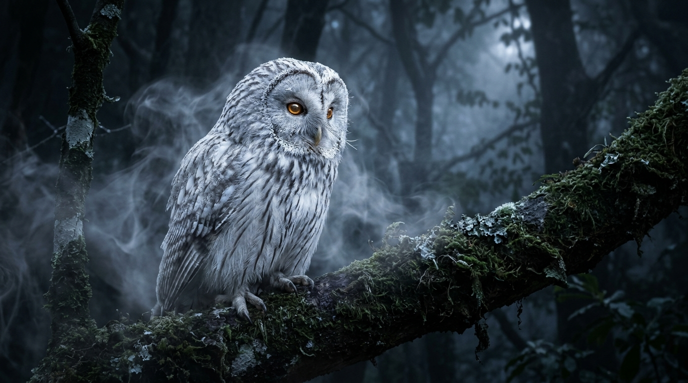
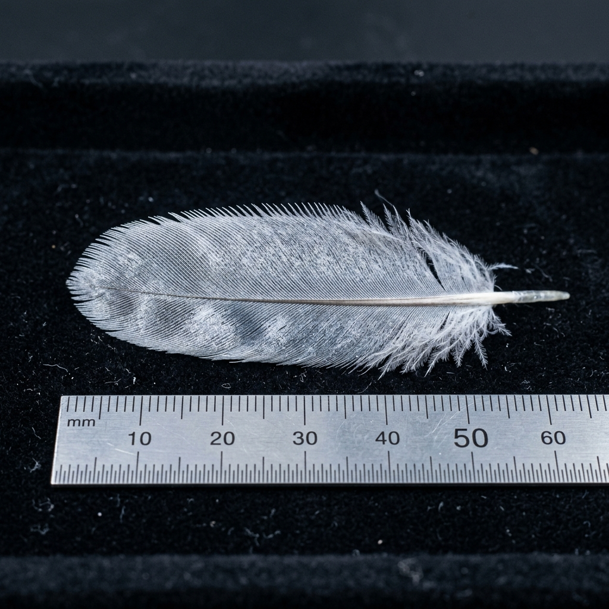
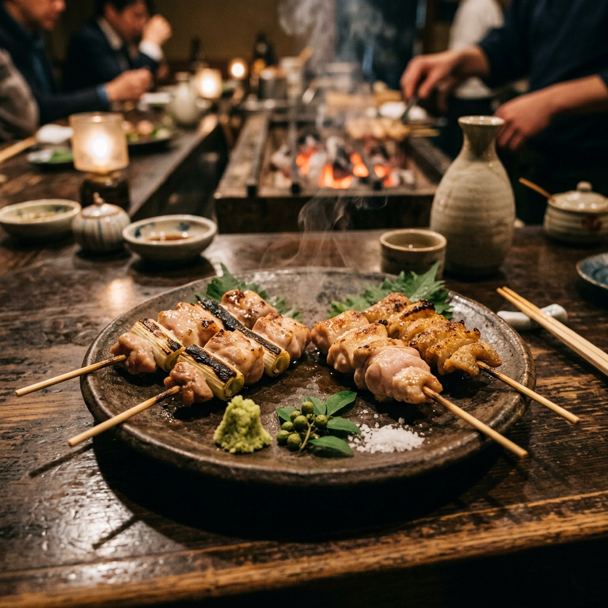
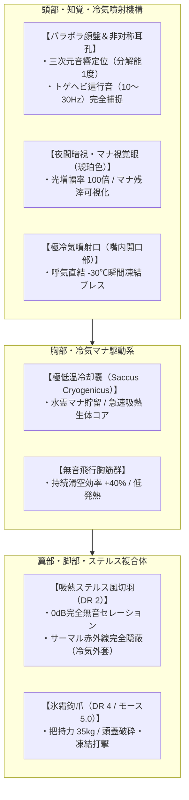
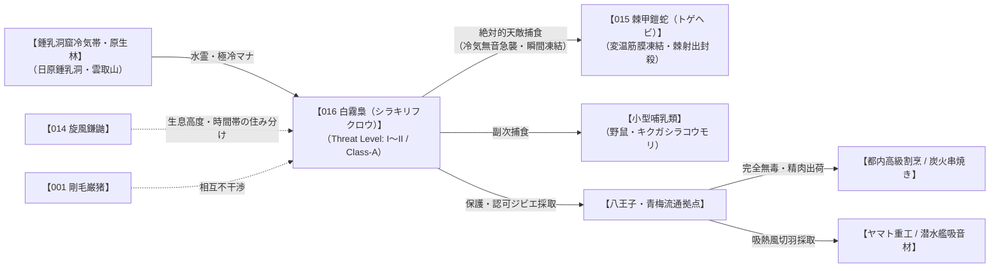
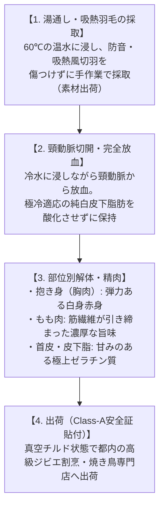

# 【白霧梟】（白霧梟／*Strix cryophilus*／Frost-Mist Owl）

---

## 1. 基本分類・メタデータ

| 項目 | 内容 |
| :--- | :--- |
| **和名** | 白霧梟（シラキリフクロウ） |
| **学名** | *Strix cryophilus* |
| **学名語源** | *Strix*（ギリシャ・ラテン語: 夜のフクロウ）＋ *cryo-*（ギリシャ語: 凍てつく寒さ・極冷）＋ *philos*（ギリシャ語: 〜を愛する者、親和性を持つ者） |
| **英名 / 通称** | Frost-Mist Owl / シラキリ、白霧（しらきり）、霧隠れ梟、フロスト・オウル、霜夜の白翁 |
| **生物学的分類** | **門**: 脊索動物門 Chordata<br>**綱**: 鳥綱 Aves<br>**目**: フクロウ目 Strigiformes<br>**科**: フクロウ科 Strigidae<br>**属**: フクロウ属 *Strix*<br>**種**: 白霧梟 *S. cryophilus* |
| **発生起源** | **急速変異種**（2000年のマナ覚醒時、奥多摩・丹沢・秩父の鍾乳洞冷気湧出帯および標高1,000m超のブナ・針葉樹原生林に生息していたフクロウが、地脈の水霊・極冷マナに曝露され、羽毛の吸熱・防音特性と局所冷却ブレス能力を獲得） |
| **資源・食用区分** | **安全種（Class-A）**（生体毒・呪術的リスク皆無。極寒適応による上質な皮下脂肪と引き締まった野鳥肉は、山岳割烹で紀州備長炭を用いた「白霧梟の炭火串焼き（焼き鳥）」として絶賛される。羽毛は最高級防音・断熱・ステルス素材） |
| **脅威度ランク** | **Threat Level: I〜II（警戒・保護級）**（人間への敵対性は極めて低く、トゲヘビ等の変温魔獣の絶対的ハンター。驚異的な隠密能力を持つ） |
| **主要生息域** | **関東・中部山岳魔境区**（奥多摩・丹沢・秩父アウトランド、日原鍾乳洞周辺、標高800〜1,800mの原生針葉樹林・石灰岩崖壁） |

### 視覚資料アーカイブ（Visual Archive）

| 生態観測写真（奥多摩・夜間原生林） | 採取標本・吸熱風切羽マクロ写真 | 伝統ジビエ「白霧梟の炭火串焼き」 |
| :---: | :---: | :---: |
|  |  |  |
| *奥多摩・雲取山山麓アウトランドにて夜間撮影（2026年）* | *八王子解体前線基地・魔導鳥類学研究室 標本（SKO-16）* | *赤坂・炭火割烹「奥多摩 炭嶺」提供（Class-A認可店）* |

---

## 2. 伝承考証とマナ覚醒の架橋（Lore & Historical Bridge）

### 2.1 原典・民俗伝承の記録
- **発祥地域・原典文献**:
  - 『古事記』および柳田國男『遠野物語』に記録される怪鳥「夜啼鳥（よなきどり / 霜夜に白い冷気を吐き、山神の使いとして深山を治める梟）」。
  - アイヌ民族の口承文芸（ユカﾗ）における「コタンコロカムイ（シマフクロウの村守り神）」の眷属伝承。
  - 関東山地（奥多摩・秩父・丹沢）の杣人やマタギに伝わる「白霧の神使（山中で濃霧が立ち込める夜、白き梟が舞えば毒蛇の祟りが消え去るという民間伝承）」。
- **古来の目撃伝承**:
  - 「厳冬の月に照らされし夜、羽ばたきの音ひとつ立てず、霧のごとく現れて毒蛇を氷漬けにして去る」と恐れ崇められ、山の守護鳥として尊ばれてきた。

### 2.2 2000年マナ覚醒による生体科学的架橋
西暦2000年のミレニアム・アウェイクニングにおいて、奥多摩や秩父の石灰岩層・鍾乳洞窟網から噴出した高濃度の水霊マナ（水・冷気属性）に、地域に定着していたフクロウ（*Strix uralensis*）の個体群が曝露された。  
フクロウ科が本来持つ「鋸歯状風切羽による消音飛行機構」と「羽毛内の微細空気層」が、水霊マナの吸熱変異シグナルと融合した。羽毛ケラチンタンパク質が大気中の熱エネルギーを急速吸収する**「吸熱性多孔質ケラチン（*Keratinum Endothermicum*）」**へと変異し、体表周囲の水分を凝結させて局所的な冷気霧を自生する能力を獲得した。古来の「白霧の神使」伝承は、マナ希薄期にも鍾乳洞の極冷環境で局所的に命脈を保っていた古代冷気変異個体の目撃例であったと現代魔導鳥類学では結論づけられている。

---

## 3. 生物学的特徴・ライフステージ

### 3.1 外見・身体構造
- **全長 / 翼開長 / 体重**: 全長 55〜70cm / 翼開長 125〜150cm / 体重 1.2〜2.4kg（原種フクロウの約1.3〜1.5倍。羽角を持たない丸い頭部と、全身を覆う白銀・霜降り模様の美麗な羽毛）。
- **骨格・筋肉系・外皮（DR値）**:
  - **吸熱ステルス羽毛（DR 2 / 吸音・防熱・防寒）**: 翼の初列風切羽前縁には微細な鋸歯状コーム（セレーション）が発達し、空気の渦を細かく分解して羽ばたき音を**完全な0dB（無音）**にする。羽毛表面は極小の霜状結晶をまとい、周囲の熱を吸収して常に0℃〜-10℃の冷気層を維持する。
  - **氷霜鉤爪（DR 4 / モース硬度5.0）**: 第1趾〜第4趾の強靭な鉤爪は生体チタンとカルシウムが沈着し、トゲヘビの硬質逆棘の隙間をすり抜けて獲物の頭蓋や背骨を確実に把持・粉砕する。
- **感覚器官・特異マナ器官**:
  - **顔盤・左右非対称耳孔（三次元音響レーダー）**: 顔面のパラボラ状顔盤と左右で位置・形状が異なる耳孔により、30m先の落ち葉の下を這うトゲヘビの微細な筋肉運動音（10〜30Hz）を上下・左右角1度以下の精度で三次元定位する。
  - **極低温冷却嚢（*Saccus Cryogenicus*）**: 胸骨直下に位置する水霊マナ受容器官。大気中のマナを励起し、呼気とともに**-30℃〜-50℃の極低温冷気ブレス**を瞬間噴射する。



### 3.2 ライフステージと個体変異
1. **幼鳥期（Fledgling / 孵化〜1年）**:
   - 全長 30〜45cm、体重 0.6〜1.1kg。全身が純白の綿毛に包まれており、冷却嚢は未発達（冷気ブレス不可）。親鳥が運んでくる凍結したトゲヘビの肉片を食べて成長する。脅威度: **Threat Level I**。
2. **成熟成鳥（Adult / 生後2〜10年）**:
   - 全長 55〜70cm、翼開長 135〜150cm、体重 1.5〜2.2kg。吸熱羽毛と冷却嚢が完全成熟し、単独でトゲヘビを狩る奥多摩林冠層の頂点捕食者となる。脅威度: **Threat Level I〜II**。
3. **主級・古樹共生個体（Elder Alpha / 樹齢100年以上の巨木に定住 / 樹齢15年以上）**:
   - 翼開長 2.0〜2.4m超、体重 3.5〜5.0kg。鍾乳洞奥深くの超高濃度水霊マナ溜まりに君臨する長寿個体。周囲半径50mを常時氷点下の吹雪に変える《絶対零度結界》を不随意展開する。脅威度: **Threat Level III**。

---

## 4. 生態・食物連鎖・相互作用

### 4.1 食性・対トゲヘビ捕食アクションフロー
- **主食・栄養源**:
  - **棘甲鎧蛇（トゲヘビ / 015）を専門的に捕食（全体の約60%）**。その他、野鼠、コウモリ、モグラ、小型変異鳥類。
- **冷気無音急襲（フロスト・アンブッシュ）の全プロセス**:
  1. **【1. サーマル完全隠蔽】**: 体表から微細な冷気霧を放出して体温を周囲の気温以下に偽装。トゲヘビのピット器官（熱源探知洞）には背景の冷たい岩石と完全に同化して映る。
  2. **【2. 0dB無音急降下】**: 鋸歯状風切羽により羽ばたき音・風切り音を一切立てず、トゲヘビの背後上空3mまで音もなく接近。
  3. **【3. 《瞬間凍結》ブレス噴射】**: トゲヘビの頭上から-30℃の極冷気ブレスを一気に吹きかける。
  4. **【4. 棘射出機構の完全封殺（フリーズ）】**: 変温動物であるトゲヘビの体温が一瞬で奪われ、皮下筋膜が凍結硬直。**トゲヘビの最大の武器である「棘射出（クイル・バースト）」を1発も撃たせることなく反撃不能（完全フリーズ）に追い込む**。
  5. **【5. 掴み上げ・岩盤落下粉砕＆捕食】**: 凍りついたトゲヘビを氷霜鉤爪で鷲掴みにして上空30mへ舞い上がり、石灰岩の岩盤へ叩き落として頭蓋を破砕。トゲのない柔らかい腹面腹板（DR 3）を嘴で裂いて捕食する。



### 4.2 魔獣間クロス・リレーション（相互作用）
- **vs 棘甲鎧蛇（015_spined_armored_viper）**: 完全な捕食・被食関係。トゲヘビにとって白霧梟は「音も熱も感知できず、一撃で体を凍らされる絶対の天敵」であり、白霧梟の鳴き声を聞いたトゲヘビは直ちに岩隙深奥へと逃走する。
- **vs 旋風鎌鼬（014_kamaitachi）**: 生息域が重なるが、鎌鼬が標高1,000m以上の尾根筋・昼夜問わず活動するのに対し、白霧梟は標高800〜1,400mの森林キャノピー・完全夜行性であるため、競合せず平和的な住み分けが成立している。

### 4.3 縄張り・繁殖・寿命
- **一夫一妻制・終生ペア**: つがいで半径約1.5kmの行動圏を維持。
- **繁殖期**: 早春（2〜3月）。ブナの大木の樹洞や石灰岩崖の洞穴に営巣し、1回に2〜3個の卵を産卵。雌が抱卵し、雄がトゲヘビを狩って巣へ運ぶ。
- **寿命**: 野生下で約18〜25年（長寿種）。

---

## 5. 魔導科学・背景ロア

### 5.1 魔力現象と発現メカニズム
- **《冷気（Cold）》《瞬間凍結（Flash Freeze）》の不随意励起**:
  - 冷却嚢に滞留する水霊マナが生体電位と共鳴し、呼気中の水蒸気のエンタルピーを瞬間的に奪うことで、大気中に氷点下の極冷気分子ジェットを生成する。
- **物理・電磁的相互作用（サーマル赤外線反応）**:
  - 電子機器への直接干渉はないが、赤外線サーマル暗視装置上では**「周囲より5〜15℃低い黒色の冷気シルエット」**として明瞭に映る。これにより、熱源探知に依存するセンサーや変温魔獣に対して完全な光学・熱的ステルスが成立する。

### 5.2 音響・周波数・生体通信特性（Acoustic & Resonance Analysis）
- **完全無音飛行と凍結鳴声（Acoustic Logs）**:
  - **滑空時騒音レベル**: **0〜5dB以下（測定限界以下 / 完全無音）**
  - **急降下時渦周波数**: 5〜12Hz（人間には聴こえない超低周波の冷気気流音）
  - **威嚇・求愛鳴声**: 260〜380Hzの澄んだ二声「ホー……ホッホー……」（冷気マナが乗るため、聴いた人間の首筋に冷涼感を覚えさせる）。

```
[Acoustic Spectrum Analysis: Silent Flight vs Freeze Call of Strix cryophilus]
Sound Pressure (dB)
  60 |                                         . : : .
  40 |                                     . : : : : : : .  <-- (260-380Hz: Freeze Call)
  20 |
   0 +=========================================================> Frequency (kHz)
     0     5    10    15    20    25    30    35    40    45
     ^
     +-- [0-15kHz Flight Noise: < 5dB (Complete Acoustic Silence)]
```

### 5.3 上位次元・メガコーポの暗影
- **ヤマト重工（艦艇ステルス技術研究所）**:
  - 白霧梟の風切羽の微細セレーションおよび吸熱多孔質構造をバイオミメティクス応用し、海上自衛隊向け次世代潜水艦の**「無反響吸音ステルスタイル（シラキリ・スキン）」**を開発。
- **三ツ菱マナテック（先端マナ物性研究部）**:
  - 白霧梟の冷却嚢に存在する特殊な吸熱タンパク質「クライオ・ケラチナーゼ」を解析し、電脳魔術用スーパーコンピュータの**「非電力生体液体冷却システム」**の実用化を進めている。

---

## 6. 交戦規程・防災ミリタリータクティクス

### 6.1 GURPS 4th Stat Block（戦闘データ）

| 能力値 | 値 | 副能力値・戦闘値 | 値 | 技能・魔導異能 | レベル / ダメージ |
| :--- | :---: | :--- | :---: | :--- | :---: |
| **ST（筋力）** | 6 | **HP（生命力）** | 8 | 〈飛行〉 | 15 |
| **DX（敏捷力）** | 14 | **FP（疲労点）** | 14 | 〈隠密 / 無音〉 | 18 |
| **IQ（知力）** | 6 | **意志力（Will）** | 12 | 〈観察 / 聴覚〉 | 17 |
| **HT（生命力）** | 12 | **知覚力（Per）** | 16 | 〈瞬間凍結ブレス〉 | 14（3m範囲 / 2d-1 burn [冷気] / HT-3で凍結麻痺） |
| **基本速度** | 6.5 | **基本移動力** | 2 (飛行 18) | **氷霜鉤爪撃** | 1d-2 cut / imp（DR 4貫通） |
| **防護点（DR）** | **2**（吸熱羽毛） | **サイズ修正（SM）** | 0 | **特性** | 完全無音飛行、サーマル隠蔽、夜間暗視 |

### 6.2 市民防災メモ・猟師遭遇マニュアル
- **人間への敵対性**: **「極めて温厚（非好戦的）」**。東京都環境局および自然保護庁により「第1種指定希少保護魔獣」に指定されており、無認可での捕獲・銃撃は厳罰対象となる。
- **遭遇時の安全プロトコル**:
  - 夜間の奥多摩林道で頭上から急激な冷気を感じた場合、白霧梟が近くで狩りを行っている合図である。静かにその場を立ち去れば攻撃されることはない。
  - 繁殖期の巣穴（3〜5月）に5m以内まで不用意に接近した場合のみ、親鳥が《瞬間凍結》ブレスで威嚇射撃を行うため、厚手の防寒具とゴーグルを着用して速やかに後退すること。

### 6.3 現場専門家コラム
> **「シラキリが頭上を飛ぶ山は、毒蛇の心配がいらない安全な山だ」**  
> ── *奥多摩・日原山岳猟友会 会長：青木 茂雄（マタギ歴45年）*  
> 
> 「夜の山で突然、首筋にヒヤッとした冷たい風が吹き抜けて、あたり一面に白い霧がサッと広がる。それがシラキリのお出ましだ。羽音なんてカケラもしない。気付いたときには、足元でトゲを逆立ててたトゲヘビがカチコチに凍りついて、シラキリの足に掴まれて空へ消えていく。  
> あいつらは山を守る神様みたいなもんだ。トゲヘビが増えすぎないのはシラキリのおかげだし、人間を襲うこともまずない。たまに猟師小屋の軒下に飛んできて、暖炉の煙を物珍しそうに眺めていくこともあるよ。もし山で出会ったら、銃を降ろして静かに見送ってやるのが山の掟さ」

---

## 7. 解体・ジビエ食文化・素材利用（Class-A）

### 7.1 Class-A解体・精肉手順
本種は有害な生体毒や呪術的汚染を一切持たない**「安全種（Class-A）」**である。自然死個体や適正間引き個体は、一般の野鳥解体ラインで安全に精肉・加工できる。



### 7.2 本格ジビエ料理レシピ: 【白霧梟の炭火串焼き（シラキリの焼き鳥）】
冷気適応によって蓄えられた融点の低い上品な皮下脂肪と、野鳥特有の引き締まった筋繊維が、備長炭の強烈な遠赤外線で最高の旨味へと昇華する。

- **材料（2人前 / 盛り合わせ6本）**:
  - 白霧梟の抱き身（胸肉）: 150g
  - 白霧梟のもも肉＆白葱（ねぎま用）: 150g
  - 白霧梟の首皮（皮焼き用）: 80g
  - 薬味: 奥多摩産生本山葵、実山椒塩、長野産粗挽き黒胡椒
  - 秘伝タレ: 熟成醤油、三河みりん、純米酒、梟骨出汁
- **焼きの極意（炭火焼き手順）**:
  1. 紀州備長炭を熾し、強火の遠火で網を温める。
  2. **抱き身（実山椒塩）**: 表面を炭火で一気に焼き固め、中心部をほんのり桜色のミディアムレアに仕上げる。実山椒の爽やかな辛味と粗塩でいただく。
  3. **ねぎま（秘伝タレ）**: 香ばしく焦げ目のついた白葱の甘みと、もも肉から溢れ出す濃厚な肉汁が秘伝タレと絡み合う。
  4. **皮焼き（山葵添え）**: 余分な脂を炭火に落としてカリッと香ばしく焼き上げ、おろしたての本山葵をたっぷり乗せて脂の甘みを引き締める。
- **風味・食感レビュー**:
  備長炭の燻香を纏った抱き身を噛みしめると、地鶏を遥かに凌駕する野性味あふれる弾力とともに、極上の肉汁が口いっぱいに広がる。冷気マナによって育まれた皮下脂肪は全くしつこさがなく、舌の上でフワッと溶けて芳醇な甘みを残す。冷酒（奥多摩の地酒『澤乃井』）との相性は筆舌に尽くしがたい絶品ジビエである。

### 7.3 工業・医療・装備素材価値
- **吸熱ステルス羽毛**:
  - 採取された風切羽は1枚あたり8,000〜15,000円で取引され、特務部隊向け「完全消音防寒ギリースーツ」や超高級オーディオルーム用吸音パネルの最高峰素材として利用される。
- **極低温ダウン（羽毛布団）**:
  - 綿毛は驚異的な断熱係数（フィルパワー 1,100+）を持ち、極地探検隊や高高度航空用防寒装備に採用されている。

---

## 8. 現場記録・インシデントアーカイブ

### 8.1 調査観測記録（Observation Log）
- **日時**: 2026年1月22日 23:40
- **場所**: 東京都西多摩郡奥多摩町 日原鍾乳洞周辺自然保護林（標高1,050m）
- **観測者**: 東京都環境局 特異生物保護課 調査員2名

```
[23:40:12] 調査員A: 「サーマルビジョン起動。気温マイナス4℃……前方15mの岩壁にトゲヘビ（体長約3m）を確認。獲物を探して這行中」
[23:40:28] 調査員B: 「待って、サーマル画面の左上……トゲヘビの真上のブナの枝に、不自然な『真っ黒な低温影』がある。温度マイナス18℃。……シラキリだ！」
[23:40:35] 調査員A: 「集音マイク感度最大……信じられない、羽ばたき音がゼロだ。完全に無音で滑空に入った！」
[23:40:41] （サーマル画面上で、白い冷気の尾を引く影がトゲヘビの背後へ急降下）
[23:40:44] 調査員B: 「冷気ブレス噴射！ トゲヘビの周囲が一瞬で白い結晶に包まれた！ トゲヘビの体温が急降下……筋膜がフリーズ、棘射出が撃ててない！」
[23:40:50] 調査員A: 「シラキリが氷霜爪でトゲヘビをガッチリロック。そのまま上空へ吊り上げて……岩盤へ投下！ ドンッという鈍い破砕音！」
[23:40:58] 調査員B: 「トゲヘビ沈黙。シラキリが着地して腹板をついばみ始めました。トゲヘビの針は1本も刺さっていません。完璧な捕食シーケンスです」
```

### 8.2 自然保護区・指定通達
- **指定区分**: 東京都指定天然記念物・第1種保護魔獣
- **告示文面**:  
  『奥多摩山岳魔境区に生息する白霧梟（シラキリフクロウ）は、危険魔獣である棘甲鎧蛇（トゲヘビ）の個体数調整を担う極めて重要な生態系キーストーン種です。学術調査または特別許可証のない捕獲・銃撃・巣の破壊行為は「魔導生物保護法」第14条に基づき処罰されます。』

---

## 9. 参考文献・調査資料

1. 日本鳥学会 編『日本鳥類目録（第8版・マナ変異鳥類編）』, 日本鳥学会出版（2025年）.
2. 東京都環境局『奥多摩・丹沢アウトランドにおける生態系食物連鎖構造調査報告書』, 都庁印刷物（2026年）.
3. 山田 孝之 著『フクロウ目における無音飛行機構のバイオミメティクス応用』, 航空音響工学 Vol.34, pp.112-128.
4. 柳田 國男『遠野物語・山の怪異考』, 岩波文庫.
5. 日本ジビエ振興協会『特選野鳥ジビエ調理教本（炭火焼き・鍋物編）』, 柴田書店（2024年）.
