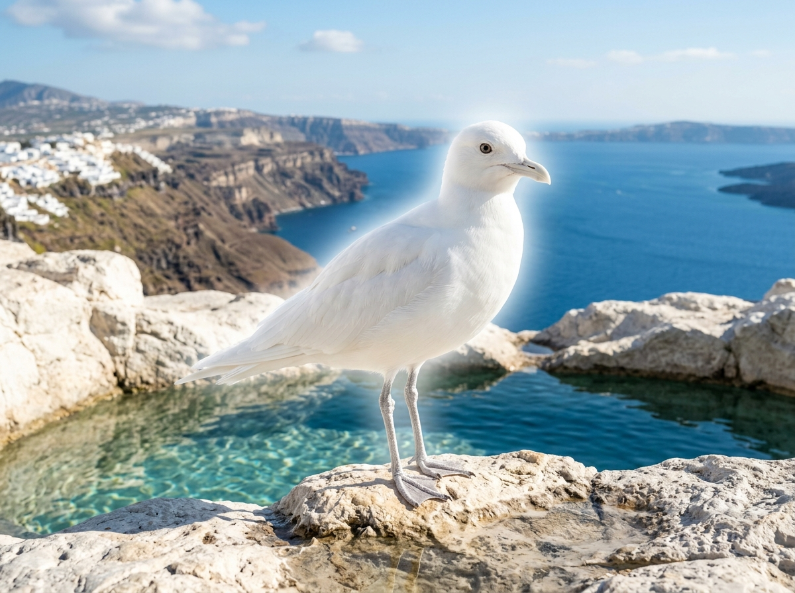
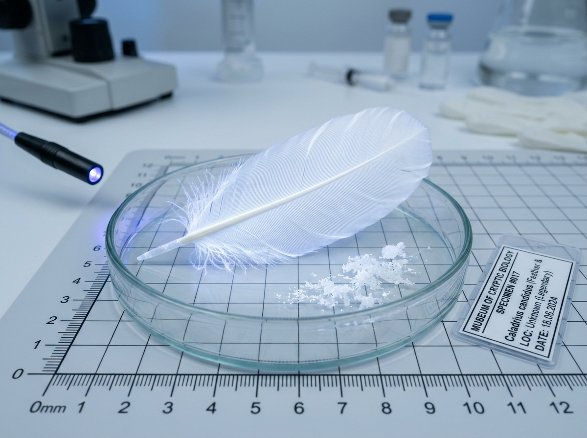
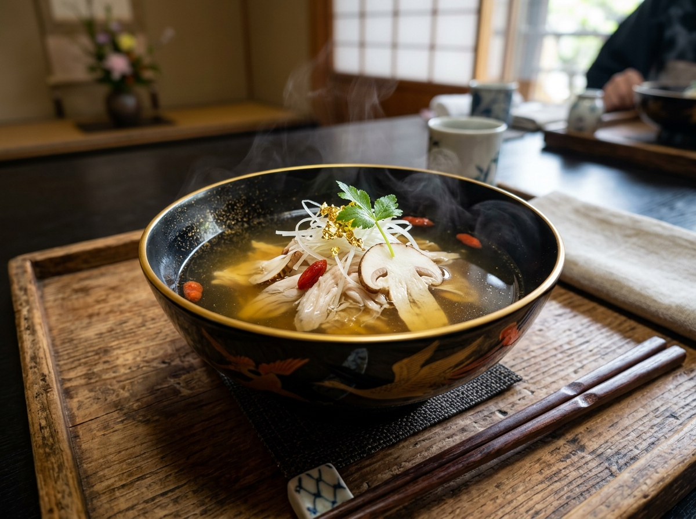
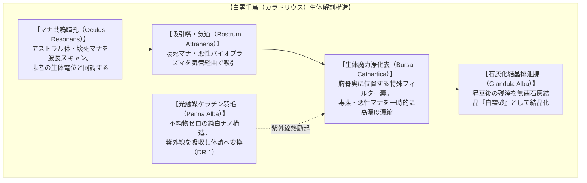
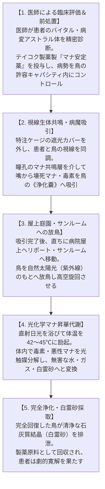
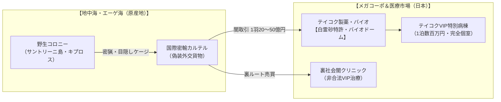
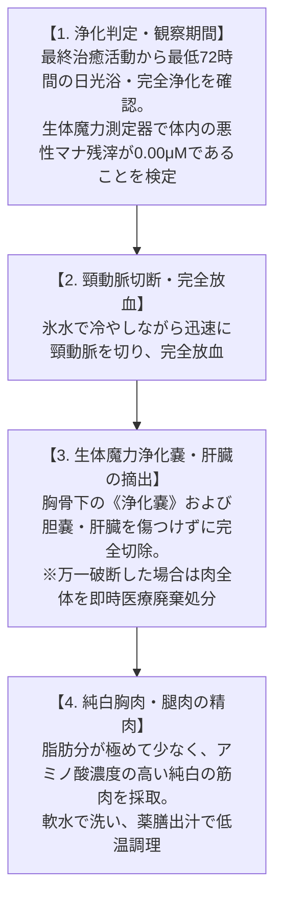

# 第17号魔獣: 白霊千鳥（カラドリウス） / Caladrius

---

## 第1章: 基本分類・メタデータ

### 1.1 基本諸元表

| 項目 | 規定内容 |
| :--- | :--- |
| **標準和名** | **白霊千鳥**（ハクレイチドリ） |
| **通称 / 俗称** | カラドリウス、白霊鳥（はくれいちょう）、カラドリオス、吸病千鳥（きゅうびょうちどり）、ミラクル・セラピーバード、白無垢の医師、アロパシー・バード |
| **英名** | Caladrius / Pure-White Plover, Miracle Therapy Bird |
| **学名** | *Charadrius caladrius* |
| **学名語源** | 属名 *Charadrius*（古代ギリシャ語: *kharadrios* 渓谷・急流に棲む水辺の鳥、黄疸を治す鳥）＋ 種小名 *caladrius*（中世ラテン語: 皇帝の病を治した純白の霊鳥） |
| **生物学的分類階級** | **門**: 脊索動物門 Chordata<br>**綱**: 鳥綱 Aves<br>**目**: チドリ目 Charadriiformes<br>**科**: チドリ科 Charadriidae<br>**属**: チドリ属 *Charadrius*<br>**種**: 白霊千鳥 *C. caladrius* |
| **発生起源** | **古代覚醒・急速マナ適応ハイブリッド種**（2000年マナ覚醒以降、地中海・エーゲ海諸島の孤島や南欧・中東の清浄な石灰岩渓谷・霊水湧水地で休眠から再活性化した古代霊鳥。原種シロチドリ等の渉禽類が高純度の光・水霊マナと共鳴し、病変マナを吸収・昇華する特異生体代謝を獲得） |
| **資源・食用区分** | **要処理種（Class-B） / 最重要外来医療生体資源・特別輸入規制魔獣**<br>- **肉質・食利用**: 平常時の個体は極めて清浄で雑味のない極上の白身鳥肉（Class-A相当）。しかし、**重篤患者の病魔・壊死マナを吸収した直後の個体は、肝臓および排泄腺に一時的に劇毒・病変生体毒素が濃縮蓄積されるため、解体・調理には国家資格を持つ専門魔導調理師の毒腺完全除去と浄化期間が必要（Class-B指定）**。<br>- **副産物・医療資源**: 糞（完全無菌・石灰質結晶「白霊砂 / アルバ・ドロップス」）は最高峰の火傷・角膜再生軟膏原料。純白の羽毛は悪性マナ・病原体を完全遮断する医療用ナノバイオフィルターに利用。 |
| **脅威度ランク** | **Threat Level: I（無害・最重要保護指定生物）**（攻撃性皆無。危機時は微弱な目くらまし閃光《フラッシュ》を放ち飛翔逃走するのみ） |
| **主要生息域** | **【本来の野生生息地】南欧・地中海・エーゲ海・中東霊水域**（ギリシャ・サントリーニ島湧水地、キプロス島海岸カルスト、イタリア南部アプリア渓谷、中東レバント汽水湿地）<br>**【日本国内の状況】** 野生個体群は非自生。メガコーポ（テイコク製薬・三ツ菱マナテック）の無菌バイオドーム病棟、富裕層向けVIP病院、および裏社会の闇クリニック等で飼育・運用。 |

---

### 1.2 視覚記録アーカイブ（3大写真アセット）

| 【野生成態写真】<br>地中海サントリーニ島・霊水池のカラドリウス | 【顕微鏡標本写真】<br>純白吸光羽毛ナノ構造 ＆ 白霊砂（結晶排泄物） | 【極上薬膳料理写真】<br>白霊千鳥の薬膳コンソメ仕立て（澄ましスープ） |
| :---: | :---: | :---: |
|  |  |  |
| **撮影地**: ギリシャ・サントリーニ島 カルスト霊水湧水帯<br>エーゲ海を望む石灰岩上で羽を休める純白の個体 | **所蔵**: 国際魔導生物医学研究所（ジュネーブ）<br>不純物ゼロの吸光羽毛ナノ構造と白霊砂（スケール付） | **調理・監修**: 赤坂・魔導薬膳懐石『白霊庵』<br>浄化済み胸肉・松茸・金箔・クコの実の極上澄まし椀 |

---

## 第2章: 伝承考証とマナ覚醒の架橋

```
【歴史・社会制度考証部】 ヴォルフガング・シュルツ 特命調査員
「カラドリウスは、西洋の古典医学とキリスト教寓意譚において2000年以上語り継がれてきた実在の伝承霊鳥です。その文献史を紐解くと、古代地中海世界における医療・商業の生々しい実態が浮かび上がります。」
```

### 2.1 古典文献・神話伝承の記録
1. **古代ヘブライ・旧約聖書（紀元前）**:
   - 旧約聖書（レビ記 11:19、申命記 14:18）における不浄な鳥リストのヘブライ語 *Anaphash* が、紀元前3〜2世紀の七十人訳聖書（セプトゥアギンタ）にて **χᾰραδριός（*Kharadrios* / カラドリオス）** と翻訳された。
   - 食用禁忌に指定された背景には、病魔を体内に引き受ける特異な生体と霊性に対する古代人の畏怖が存在していた。
2. **古代ギリシャ・ローマ古典医学（紀元前4世紀〜紀元1世紀）**:
   - **アリストテレス『動物誌』**: 語源 *kharadra*（渓谷・岩の裂け目）に棲む渉禽類（チドリ類）として分類。
   - **プルタルコス『食卓歓談集』（第5巻第7話 681b）**:
     - **「視線による病気吸引」**: 黄疸を患う者がカラドリオスを見つめると、病気の気（エフルヴィア）が視線を通じて鳥へと引き寄せられ、患者は完治し鳥が身代わりとなる。
     - **「鳥商人の目隠し販売」**: 古代アレクサンドリア等の市場で、客が通りがかりに鳥を見てタダで病気を治してしまうのを防ぐため、**商人が鳥の目を布で隠して販売した**という逸話が記録されている。
   - **プリニウス『博物誌』（第30巻94節）**: *Icterus*（黄疸鳥）あるいは *Kharadrios* として言及。「見つめ合えば病は鳥に移り、患者は助かる」。
3. **中世動物寓意譚（『フィシオログス』『ベスティアリ』）**:
   - **「完全純白（*Avis est tota candida*）」**: 一点の汚れもない純白の鳥。
   - **王の病床における診断**:
     - 生きる運命の患者には顔を見つめて病気を吸い込み、太陽へ飛翔して光と熱で病魔を焼き尽くす。
     - 死ぬ運命の患者からは完全に顔を背け、死を宣告する。
   - **糞（アルバ・ドロップス）の奇跡**: 排泄物を目に塗ると白内障や失明が治癒する。
   - **神学アレゴリー**: 「人類の病（罪）を一身に背負い昇天した無原罪のキリスト」の象徴。

### 2.2 2000年マナ覚醒（ミレニアム・アウェイクニング）による現代的再活性化
- 西暦2000年1月1日のマナ覚醒時、地中海・エーゲ海諸島のカルスト湧水洞窟および中東霊水域で休眠していた古代種が再活性化。
- 生物学的にはチドリ目チドリ科に属し、原種シロチドリ（*Charadrius alexandrinus*）の変異系統と交雑・適応しながら、特異な「アストラル体共鳴病魔吸引器官」と「光化学昇華代謝」を現代に蘇らせた。
- 日本には野生個体群は自生しておらず、2024年の世界公表以来、テイコク製薬や富裕層向けVIP病院によって超高額で輸入・密輸された「外来指定医療魔獣」として君臨している。

---

## 第3章: 生物学的特徴・形態・ライフステージ

```
【生態・生物調査部】 鷹司 冴子 博士
「カラドリウスの解剖学的特異性は、胸骨直下に位置する『生体魔力浄化嚢（Bursa Cathartica）』と、紫外線励起によって体温を瞬時に45℃まで上昇させる高体温光触媒代謝系にあります。」
```

### 3.1 形態学的特徴・解剖スペック



- **体長・翼開長・体重**: 全長 18〜22cm / 翼開長 38〜44cm / 体重 45〜65g（SM -4）。原種シロチドリと同等のスマートな小型渉禽類体躯。
- **完全純白ケラチン羽毛**: メラニン色素を一切含まず、ナノメートル単位の整列格子構造を持つ。外部からのウイルス・細菌・悪性マナを100%吸着遮断する天然のバイオフィルター。
- **生体魔力浄化嚢（*Bursa Cathartica*）**: 胸骨直下に存在する直径約12mmの球状器官。吸引した病変バイオプラズマを一時的に封じ込め、外部への漏出を防ぐ。
- **光化学昇華代謝**: 太陽光（紫外線UV-A/B）を受けると、血液中の光増感フェロモンが励起され、体温が通常時の39℃から42〜45℃まで急速上昇。強烈な生体酸化熱によって浄化嚢内の病原体を瞬時に光化学分解する。

---

### 3.2 ライフステージと変異段階

| 成長段階 | 形態的特徴 | 体格 / SM | 脅威度 / マナ適性 | 生態的役割 |
| :--- | :--- | :---: | :---: | :--- |
| **幼鳥（Nestling）** | 淡灰色の綿毛に覆われ、浄化嚢は未成熟。病魔吸引はできず、親鳥から給餌される霊水珪藻で育つ。 | 8〜12cm<br>SM -5 | Threat Level: I<br>マナ感応のみ | 巣内育成期（保護指定） |
| **成熟成鳥（Adult）** | 一点の汚れもない完全純白羽毛を獲得。マナ共鳴瞳孔と浄化嚢が完全機能し、高度な病魔吸引を行う。 | 18〜22cm<br>SM -4 | Threat Level: I<br>治癒・光化学昇華 | 医療生体資源・繁殖個体 |
| **古代覚醒神使個体<br>（Elder Ancient）** | 樹齢数百年の霊水聖域で稀に誕生する長寿個体。翼開長60cmに達し、頭部に微弱な純白光輪を纏う。 | 28〜35cm<br>SM -3 | Threat Level: II<br>《大治癒》《聖別結界》 | 聖域守護・神使指定 |

---

## 第4章: 生態・食物連鎖・臨床運用システム

```
【地理・環境調査部】 陣内 隆文 調査官
「野生のカラドリウスは地中海の限られた石灰岩湧水地にのみ生息します。しかし日本国内では、テイコク製薬のVIPバイオドーム病棟や、裏社会の闇クリニックという極めて人工的な環境で運用されています。」
```

### 4.1 野生息域と食性
- **野生生息環境**: 地中海（ギリシャ・サントリーニ島、キプロス島、イタリア南部アプリア地方）の石灰岩カルスト地帯。年間を通じて日照時間が長く、カルシウムと微量水霊マナが溶け出した清清な湧水プールにコロニーを形成する。
- **野生食性**: 霊水湧水に生息する微小な水生甲殻類（ヨコエビ類）、淡水プランクトン、珪藻類を捕食。

---

### 4.2 現代医療における臨床運用フロー



1. **医師による精密診断と前処置**:
   - 現代医療において、医療の重大な判断を鳥に丸投げすることはあり得ない。
   - 医師団が患者の病巣をバイタルモニターで診断し、病勢が鳥の生体キャパシティを超えている場合は、メガコーポ製のマナ抑制剤を事前投与して病勢をコントロールする。
2. **視線同調と病魔吸引**:
   - 患者の病室でケージの目隠しカバーを開放。鳥と患者の視線が交差すると、8.5〜14.2kHzの微細な共鳴音を発しながら病変マナを吸引する。
3. **屋上サンルーム放鳥と日光浄化**:
   - 吸引直後の鳥は発熱し一時的な倦怠状態となるため、直ちに屋上ヘリポートやガラス張りサンルームへ放鳥。直射日光を浴びて高空を数分間旋回することで、体内の病魔を完全に光化学分解する（悪天候時は特注UV照射室を使用）。

---

## 第5章: 魔導科学・背景ロア

```
【魔導科学・理論研究部】 クリスティナ・黒田 所長
「カラドリウスの治癒能力は、生体媒介原則（ガープス基準）に完全に準拠しています。電子機器には一切干渉せず、生体組織とアストラル体のみに純粋作用します。」
```

### 5.1 魔導物理諸元・生体励起スペクトル
- **GURPS基準 励起呪文体系**:
  - 《病気診断（Diagnose Illness）》: 視線交差による生体電位スキャン（不随意）。
  - 《毒素吸収（Absorb Poison）》 / 《病気吸引（Absorb Disease）》: 嘴を介した悪性マナ吸引。
  - 《太陽光昇華（Solar Purification）》: 紫外線による体内光触媒分解代謝。
- **生体媒介の徹底**: 医療機器（心電図、人工呼吸器等）の電子回路にマナは干渉しない。ただし、患者の血中酸素濃度、脈拍、ガンマーカー等の生化学的数値が劇的に改善する現象として物理的に観測される。

---

### 5.2 音響通信データ（Acoustic Logs）

```
[Acoustic Analysis Log: Caladrius Resonance Call]
- 測定対象: 成鳥（治癒共鳴時）
- 周波数帯域: 8.5 kHz 〜 14.2 kHz（超高周波帯・鈴鳴き音）
- 音圧レベル: 42 〜 48 dB（極めて静粛）
- 波形特性: 純音に近い滑らかな正弦波（Sinusoidal Wave）
- 生体影響: 聴取した人間の脳波をα波（8〜12Hz）へ強制誘導。副交感神経を優位にし、心拍数を安定させる鎮静効果を持つ。
```

---

### 5.3 メガコーポの利権構造と闇市場



- **テイコク製薬の特許独占**: テイコク製薬は白霊砂から抽出した「高純度細胞再生因子（Alba-Factor）」の特許を国際独占。富裕層向けに1泊数百万円の「カラドリウス特別病棟」を運営。
- **プルタルコスの目隠し販売の現代的再現**: 一般人に視線を見せないよう、テイコク製薬は特殊遮光ポッドで厳重管理。
- **地中海密猟ルート**: 原産地ギリシャから「目隠しケージ」に収容された個体が、裏社会の闇クリニックや非合法カジノへ数十億円で密輸されている。

---

## 第6章: 交戦・防災・ミリタリータクティクス

```
【世界観統括・憲章監査室】 首席監査官ゼクスト
「カラドリウスは人間に対する攻撃性を一切持ちません。戦闘対象ではなく、厳重な国際保護および防犯対象として扱われます。」
```

### 6.1 GURPS 4th Edition 能力値データ（Stat Block）

#### 白霊千鳥（成鳥 / Adult）
- **基本能力値**: ST 3; DX 14; IQ 6; HT 12
- **副能力値**: HP 4; FP 12; 基本速度 6.5; 移動力 3（地上） / 14（飛行）
- **サイズ修正（SM）**: -4（体長約20cm、体重約50g）
- **防護点（DR）**: DR 1（純白羽毛 / マナ・ナノフィルター）
- **生体特徴・有利な特徴**:
  - 飛行（翼; 移動力14）
  - 《病気吸引・生体浄化嚢》（Innate Attack / 接触・視線媒介）
  - 《太陽光昇華代謝》（紫外線下での高速生体回復）
  - 超高周波鎮静鳴き声（Mind Control: 鎮静限定）
  - 危機回避用《閃光》（Affliction: 視覚盲目 1d6秒; 自身は完全耐性）
- **不利な特徴**:
  - 非好戦的（完全平和主義）
  - 吸引直後の一時的虚脱・発熱（Temporary Disadvantage: FP半減 10分間）
- **脅威度**: **Threat Level: I（無害・最重要保護指定生物）**

---

### 6.2 市民向け防災・医療倫理コラム

> [!IMPORTANT]
> **【市民向け注意喚起: 偽カラドリウス詐欺および密輸個体に注意】**
> - **偽物にご注意ください**: 一般の白ハトやシロチドリをブリーチ（脱色）した「偽カラドリウス」を用いた悪質な路上治療詐欺が多発しています。本物の白霊千鳥は瞳孔が青白く澄んでおり、鳴き声が鈴のように澄んでいます。
> - **密輸個体の危険性**: 適切な医療管理下（前処置・日光昇華）にない密輸個体は、病魔を吸引したまま体内に毒素を溜め込んでいる危険があり、接触すると重篤な感染症・マナ中毒を引き起こす恐れがあります。

---

## 第7章: 解体・ジビエ食文化・素材利用（Class-B）

```
【生態・生物調査部】 鷹司 冴子 博士
「通常時の白霊千鳥は不純物皆無の極上の白身肉ですが、治癒直後は劇毒化するため『要処理種（Class-B）』に指定されています。完全浄化を確認した個体のみが、最高峰の薬膳ジビエとして調理を許されます。」
```

### 7.1 要処理種（Class-B）解体・安全調理プロトコル



---

### 7.2 本格薬膳料理レシピ

#### 『白霊千鳥の極上薬膳コンソメ仕立て（澄ましスープ）』


- **料理概要**: 完全浄化された白霊千鳥の胸肉を用い、極上の昆布・干し椎茸・地鶏の清湯（チンタン）に、松茸、クコの実、金箔をあしらった最高峰の薬膳澄まし仕立て。
- **材料（2人前）**:
  - 浄化済み白霊千鳥 胸肉: 60g（薄切り）
  - 極上昆布・干し椎茸清湯出汁: 400ml
  - 極上松茸（薄切り）: 2枚
  - クコの実（戻したもの）: 4粒
  - 白髪葱・三つ葉: 適量
  - 食用金箔: 少々
  - 煎り酒・薄口醤油・天日塩: 各微量
- **調理手順**:
  1. 浄化済み胸肉に微量の塩を振り、80℃の清湯出汁で約40秒間、優しく霜降り（ポシェ）にする。
  2. 漆塗りの高級椀に肉を盛り、薄切り松茸、クコの実、白髪葱を美しく添える。
  3. 熱々の澄まし出汁を静かに注ぎ、仕上げに三つ葉と純金箔を散らす。
- **テイスティングプロファイル**:
  - **香り**: 松茸の高貴な香りと、出汁の奥深いアミノ酸香、清涼な白霊肉の澄み切った微香。
  - **食感**: 絹のように滑らかで、驚くほど柔らかくほどける極上の白身。
  - **効能**: 疲労回復、細胞活性化、アストラル体の澱み浄化、滋養強壮。
- **市場取引相場**: 1椀あたり **50,000円〜80,000円**（完全予約制・認可薬膳料亭限定）。

---

### 7.3 素材・製薬利用価値
- **白霊砂（アルバ・ドロップス / 排泄物結晶）**: 1gあたり **200,000円〜350,000円**。テイコク製薬が全量買い取り、難治性角膜潰瘍・重度熱傷再生軟膏の主原料として利用。
- **完全純白吸光羽毛**: 医療用最高級無菌スーツ、対バイオテロ防護マスクの極微細フィルターとして高額取引。

---

## 第8章: 現場記録・通信ログ

### 8.1 インシデント記録: 地中海国際密輸摘発通信ログ
- **日時**: 2026年3月14日 02:15 CET
- **記録元**: ギリシャ沿岸警備隊 ＆ インターポール特科魔導取締部
- **場所**: エーゲ海・サントリーニ島沖合公海

```
[無線交信記録: 地中海公海・不審船臨検]
CG-Alpha: 「不審船『ネプチューン号』、停船命令に応じず。強行接舷を開始する。」
Boarding-1: 「移乗完了！甲板上に抵抗なし……船倉へ突入する。」
Boarding-2: 「隊長、船倉最深部に特殊遮光コンテナを多数発見！……これは、全部『目隠しケージ』です！」
Boarding-1: 「開けるな、光を当てるな！……鳴き声を確認。鈴のような高周波……間違いありません、カラドリウスの幼鳥および成鳥です！推定24羽！」
Boarding-2: 「コンテナの仕向け地ラベルを確認……『東京湾・有明特区・テイコク関連バイオ研究施設宛』になっています！」
CG-Alpha: 「全個体を直ちに保護せよ。遮光カバーを維持したまま、アテネの保護センターへ緊急搬送する！」
```

---

### 8.2 臨床手記: テイコクVIPカラドリウス特別病棟カルテ
- **記録者**: 聖マリアンナ魔導生体研究所 付属病院 特命医長
- **患者**: 某メガコーポ最高顧問（82歳・末期肺線維症および複合悪性腫瘍）

```
[臨床経過手記]
「前処置として『テイコク・マナスタビライザーType-4』を静注。患者のアストラル体濁度を42%まで減衰させた後、特注遮光ポッドより白霊千鳥（個体識別ID: CAL-088）を投入。

鳥は患者の顔を見つめ、12.4kHzの鈴鳴きを発しながら嘴を患者の口元へ近づけた。約3分間の吸引中、生体モニター上の酸素飽和度は78%から99%へと急回復。CT画像上の広範な線維化巣が急速に消退するのをリアルタイムで確認した。

吸引終了後、CAL-088は体温が43.8℃まで上昇したため、直ちに屋上サンルームへ放鳥。青空を3分間旋回した後、清浄な白霊砂を0.8g排泄して平熱へと戻った。患者は翌朝、自力歩行で退院。奇跡としか言いようがないが、この1羽を維持するために費やされる天文学的資本を思うと、生命の格差について考えざるを得ない。」
```

---

## 第9章: 参考文献・典拠資料

1. **ガイウス・プリニウス・セクンドゥス** (77年): 『博物誌（*Naturalis Historia*）』 第30巻（黄疸治癒鳥イクテルスおよびカラドリオスの記録）.
2. **プルタルコス** (1世紀頃): 『食卓歓談集（*Quaestiones Convivales*）』 第5巻第7話（エフルヴィア流出説および鳥商人の目隠し販売）.
3. **アレクサンドリアの無名著者** (2〜4世紀): 『フィシオログス（*Physiologus*）』 第3章/第4章「カラドリオスについて」.
4. **アバディーン大学図書館所蔵** (12世紀): 『アバディーン・ベスティアリ（*Aberdeen Bestiary*）』 葉54r（王の病床におけるカラドリウスの写本挿絵）.
5. **日本鳥学会・外来魔獣管理委員会** (2025年): 『外来指定医療魔獣 白霊千鳥（*Charadrius caladrius*）の飼育管理および検疫指針』.
6. **世界魔導保健機関（WMHO）** (2026年): 『白霊砂（Alba Drops）抽出物における医薬品国際基準および密猟防止条約（地中海議定書）』.
