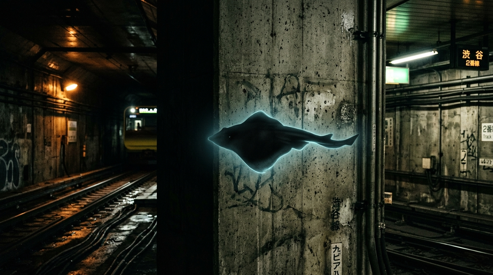
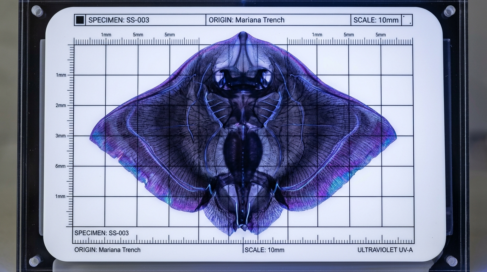
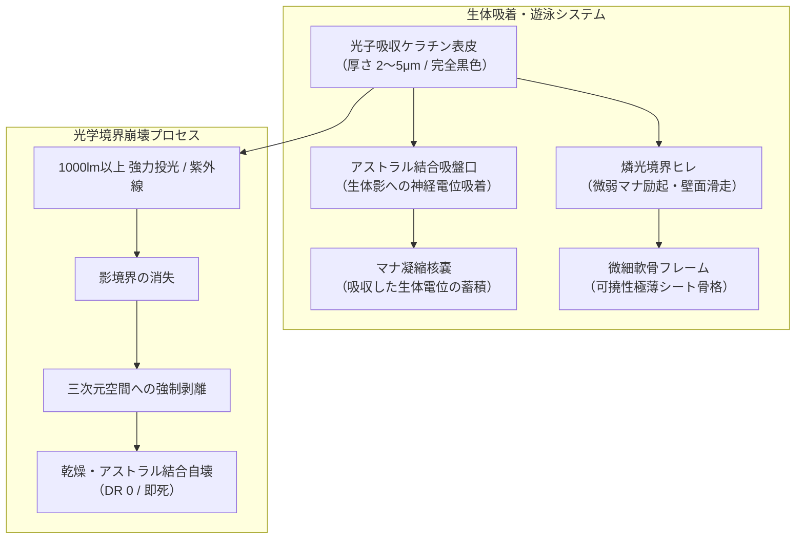
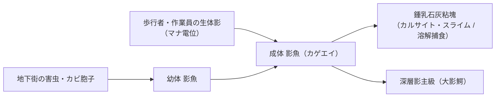

# 第18号魔獣: 影魚（カゲウオ / カゲエイ） / Shadow Skate

---

## 第1章: 基本分類・メタデータ

### 1.1 基本諸元表

| 項目 | 規定内容 |
| :--- | :--- |
| **標準和名** | **影魚**（カゲウオ） |
| **通称 / 俗称** | カゲエイ、壁泳ぎ（かべおよぎ）、影鰐（カゲワニ）、二次元魚、シャドウ・スケート、フラット・スリッカー、影喰い |
| **英名** | Shadow-skate / Wall-swimming Shadowfish, Two-Dimensional Ray |
| **学名** | *Umbrabatis plana* |
| **学名語源** | 属名 *Umbrabatis*（ラテン語: *umbra* 影・亡霊 ＋ *batis* エイ・トビエイ）＋ 種小名 *plana*（ラテン語: *planus* 平面な、厚みのない、2次元の） |
| **生物学的分類階級** | **門**: 脊索動物門 Chordata<br>**綱**: 軟骨魚綱 Chondrichthyes<br>**目**: トビエイ目 Myliobatiformes<br>**科**: カゲエイ科 Umbrabatidae<br>**属**: カゲウオ属 *Umbrabatis*<br>**種**: 影魚 *U. plana* |
| **発生起源** | **古代覚醒・異界平面投影ハイブリッド種**（2000年マナ覚醒時、日本海沿岸の暗黒海食洞や潮だまりの暗がりに休眠していた古代軟骨魚類がアビス変異。光と影の境界面に形成される極薄マナ凝縮膜に自らの質量と生体電位を2次元投影・適応させ、壁面や路面の影の中を泳ぐ特異な平面生態系を確立した） |
| **資源・食用区分** | **汚染・非実体種（Class-C / 食用完全不可・バイオハザード指定）**<br>- **非可食の理由**: 本種は3次元の筋繊維を持たず、光子欠落領域（影）に吸着した極薄マナ膜（厚さ数マイクロメートル）として存在する。実体化させても瞬時に乾燥・崩壊し、万一摂取した場合は**消化管内で強烈なアストラル解離と神経麻痺（SAN値低下・重篤な腹痛・虚脱）**を引き起こすため、食品衛生法および魔獣資源法により**完全食用禁止（Class-C）**に指定されている。<br>- **先端素材・軍事利用**: 剥離残滓から抽出される光子吸収粘液「シャドウ・ムチン」は、三ツ菱マナテック製「光学迷彩ステルス塗料」および次世代暗視迷彩コーティング剤として高額取引される。 |
| **脅威度ランク** | **Threat Level: I〜II（要注意種 / 局所集団形成時）**（単体では攻撃力は低いが、地下道や暗渠で集団潜伏し、歩行者の影を捕食して虚脱・事故を誘発する） |
| **主要生息域** | **【本来の野生生息地（一次発祥地）】日本海沿岸の海食洞・暗黒岩礁帯**（島根県出雲日御碕、隠岐諸島、鳥取県浦富海岸、福井県若狭湾の暗黒洞窟）<br>**【都市適応域（二次生息地）】結界都市・東京の地下インフラ網**（都営大江戸線・東京メトロ丸ノ内線の深部トンネル壁面、環七地下調節池、首都高速高架下の常時日陰エリア、廃ビルの受水槽ピット） |

---

### 1.2 視覚記録アーカイブ（2大写真アセット）

> [!NOTE]
> 本種は生体構造が極薄の非実体膜であり、食用利用が法的に厳禁（Class-C）とされているため、料理写真はアーカイブされず、野生成態写真および研究所標本写真の2点構成となっています。

| 【野生成態ドキュメンタリー写真】<br>都営地下鉄構内・コンクリート壁の影を泳ぐ影魚 | 【学術顕微鏡標本写真】<br>紫外線照射により強制剥離・実体化された極薄軟骨標本 |
| :---: | :---: |
|  |  |
| **撮影地**: 東京都営地下鉄・深部トンネル連絡坑道壁面<br>照明の柱が落とす暗い影の中を、青白い燐光の輪郭を帯びて滑走する漆黒の魚影 | **所蔵**: 国立魔導生物学研究所・光学生態研究部（筑波）<br>紫外線固定トレイ上の極薄標本（厚さ2mm以下・微細軟骨構造と光子吸収層） |

---

## 第2章: 伝承考証とマナ覚醒の架橋

```
【歴史・社会制度考証部】 ヴォルフガング・シュルツ 特命調査員
「『影を喰う魔物』は、日本の古典怪異譚において最も恐れられた水魔の一つです。出雲や山陰の伝承に残る『影鰐（カゲワニ）』の記述と、19世紀末の二次元幾何学論が、現代の魔導物理学において見事に交差しています。」
```

### 2.1 古典文献・神話伝承の記録
1. **日本古代・中世海魔伝承「影鰐（カゲワニ）」**:
   - **『出雲国風土記』および『伯耆国風土記逸文』**:
     - 山陰沿岸の海中に潜み、水面や岩肌に落ちた「人の影」を呑み込む怪魚・水魔。影を吸われた者は、肉体に傷一つ負うことなく激しい悪寒と発熱に襲われ、数日のうちに衰弱死すると伝えられた。
   - **『太平記』および『奇異雑談集』**:
     - 航海中の船の影を追う影鰐に対し、船頭が**「銅鏡」を海中に投げ入れたところ、鏡に映った自身の影を呑んだ影鰐が狂乱して破裂・退散した**という記録が残されている。
2. **近代二次元幾何学寓意『フラットランド』**:
   - **エドウィン・アボット・アボット『Flatland: A Romance of Many Dimensions』（1884年）**:
     - 3次元空間（Spaceland）の立体が2次元平面世界を通過する際、平面の住人には「厚みを持たない輪郭線の影」としてしか知覚されないという多次元力学の寓意。

### 2.2 2000年マナ覚醒（ミレニアム・アウェイクニング）による現代的架橋
- 2000年のマナ覚醒時、山陰沿岸の潮だまりで休眠していたトビエイ目の原種が、異界アビス特異点から漏れ出た「境界マナ場」に被曝。
- 生物としての実体を3次元空間から「照度勾配の境界面（影）」へと位相転移させ、厚さ数マイクロメートルの極薄生体膜として壁面に吸着・遊泳する能力を獲得した。
- 伝承における「影を呑まれて衰弱する」現象は、**影魚が生体の落とすアストラル・マナ結合境界に噛み付き、神経電位と生体エネルギー（FP）を吸出する生化学的捕食行動**であることが解明された。

---

## 第3章: 生物学的特徴・ライフステージ

### 3.1 ライフサイクルと形態変異

```
【生態・生物調査部】 鷹司 冴子 博士
「影魚は、通常の三次元空間では生きられません。光が遮られた『影の領域』の表面張力とファンデルワールス力に似た微弱なマナ極性吸着力によってのみ、その平滑な形態を維持しています。光を当てると壁から剥がれ落ちて自壊してしまいますのよ。」
```

1. **幼体期（幼魚 / Shadow Fingerling）**:
   - 体長5〜10cm。壁のシミや微小な亀裂の影に潜み、ダニやカビの胞子、微小昆虫の生体マナを吸着捕食する。
2. **成体期（成熟成体 / Shadow Skate）**:
   - 体長30〜60cm。完全なトビエイ型の漆黒のシルエットを形成。外縁部に青白い微弱なチェレンコフ様燐光を放ちながら、時速20〜30km/hでコンクリート壁や床面を滑走する。
3. **深層影主級（Abyssal Alpha / “大影鰐”）**:
   - 地下深部の完全暗黒水路に生息する個体。体長1.5〜2.5mに達し、十数匹の幼体・成体を引き連れて壁面全体を漆黒のカーテンのように覆い尽くす。

### 3.2 解剖学的構造図（Mermaid生体構造図）



---

## 第4章: 生態・食物連鎖・相互作用

### 4.1 捕食・遊泳行動
- **影渡り遊泳**:
  - 影魚は光が当たっている明るい壁面を直接通過することはできない。しかし、電柱、看板、歩行者の足元など、複数の影が一時的に重なり合ったり接触した瞬間、その影の連絡路を「渡り鳥」のように高速で飛び移る。
- **生体影の捕食（影齧り）**:
  - 壁際を歩く人間やネズミが壁に影を落とす、影魚は獲物の影の足元や頭部へ滑走し、口器を密着させて生体マナを吸い上げる。
  - 被害者は「足元に冷水をかけられたような悪寒」と「急激な足の痺れ・脱力感（1d-3 FP喪失）」を感じる。

### 4.2 生態系相互作用図（Mermaid食物連鎖）




---

## 第5章: 魔導科学・上位神性・背景ロア

### 5.1 魔導物理学・音響ログ

```
【魔導科学・理論研究部】 クリスティナ・黒田 所長
「GURPSの魔導体系で言えば、これは身体変化系《影の肉体（Shadow Form）》と光・闇系《闇（Darkness）》《残像（Blur）》の複合生体励起ね。実体弾が効かないのは幽霊だからではなく、弾丸が壁を貫通して魚の厚み（数マイクロメートル）をすり抜けてしまう『均一・非晶質（Diffuse）』の生体位相特性によるものよ。投光器の光子圧で影の境界を破壊するのが最も科学的で確実な戦術だわ。」
```

- **音響周波数データ（Acoustic Logs）**:
  - **滑走摩擦音**: 35〜45kHz（超音波領域の微小な空気・壁面摩擦音。人間の耳には聞こえないが、コウモリや猫が異常警戒を示す）。
  - **光剥離時の破裂音**: 1.2〜2.4kHz / 65dB（強光を浴びて壁から剥がれ落ちる瞬間に、セロハンテープを急激に引き剥がすような「ピチッ」という乾いた破裂音を発する）。


### 5.2 上位神性・精霊王・アビス因果

```
【歴史・社会制度考証部】 ヴォルフガング・シュルツ 特命調査員
「アストラル神学および深淵呪術（アビス・ソーサリー）の観点から見れば、影魚は単なる独立した野生生物ではなく、高次元の影界に座す原初の神格が物質界へ伸ばした『末梢神経の末端』である可能性が極めて濃厚です。」
```

- **深淵水神「常世影鰐（トコヨノカゲワニ）」と影界（シャドウ・プレーン）の神性**:
  - 日本神話において現世と隔絶された異界「常世国」の暗黒水底に眠るとされた古代巨神「常世影鰐」。
  - マリアナ海溝大断層（太平洋アビス）および異次元「影界（Shadow Realm）」の上位神格（プレーン・パクト契約神格）の眷属であり、物質界に投影された影魚の群れは、その上位神性の「視覚受容器（ファントム・センサー）」として機能している。
- **都市暗渠での集団共鳴現象**:
  - 新月の夜や日食時など、物質界の照度勾配が極限に達するタイミングにおいて、地下鉄網や暗渠の数千匹の影魚が一斉に同調し、壁面全体に巨大な「這い寄る影の瞳」を描き出す怪異現象が報告されている。
  - 深淵邪神呪術士（アビス・カルト）は、この影魚の群れを媒介として上位影霊王との交信儀式を執り行う。

### 5.3 メガコーポ暗部と先端軍事利用
- **三ツ菱マナテック vs ヤマト重工の特許戦争**:
  - 三ツ菱マナテックは影魚の表皮粘液から「超黒色・光子吸収生体ポリマー（シャドウ・ムチン）」を単離し、可視光・赤外線レーザーを99.6%吸収する軍事用ステルス塗料『アンブラ・コート』の特許を取得。
  - 一方、ヤマト重工は影魚のチェレンコフ燐光境界を探知する「広帯域紫外線スキャナー型暗視ゴーグル」を開発し、自衛隊および地下鉄警邏隊に独占納入している。


---

## 第6章: 交戦マニュアル・都市防災コラム

### 6.1 GURPS 4th Stat Block

#### 【影魚（カゲウオ / 成熟成体）】
- **能力値**: ST 2 / DX 14 / IQ 3 / HT 11
- **副能力値**: HP 4 / FP 11 / 基本速度 6.25 / 移動力 8（壁面・床面滑走）
- **サイズ修正（SM）**: -2（体長45cm、実質厚み 0）
- **防護点（DR）**: **特殊（突き抜け耐性）**
  - 通常の実体弾（小銃・拳銃・散弾）および打撃に対しては、壁面に密着しているためダメージが全体貫通して実質無効化（DR 50相当）。
  - **光子脆弱性**: 1,000ルーメン以上の直射光、紫外線、または閃光弾（Stun Grenade）の有効範囲内に入ると、DR 0 となり毎秒 1d6 の乾燥ダメージ（即死・自壊）。
- **攻撃**:
  - **影齧り（Shadow Bite）**: 近接（壁面上の影接触） / 命中 14 / ダメージ `1d-3 fat`（疲労ダメージ）＋ 30秒間の局所神経麻痺（DX -2）。
- **特徴・異能**:
  - 2次元位相体（Diffuse特性）、身体変化系《影の肉体》、光・闇系《闇》《暗視》の不随意励起、光子アレルギー（日光・強光で自壊）。


---

### 6.2 都市防災コラム＆現場手記

```
【現場手記】 警視庁地域部・地下鉄道警邏隊 巡査長
「夜間の大江戸線のトンネル点検中、壁に落ちた自分の影の足元がやけに黒く揺らめいているのに気づいたら、絶対に立ち止まっちゃいけない。やつらは影の足元からじわじわ生体電気を吸い取ってくる。膝がガクガク震えて動けなくなる前に、胸元の1,500ルーメン・タクティカルライトを壁に向けてフル照射するんだ。パチパチッと音がして、黒い湯葉みたいなカスが床に落ちたら駆除完了だ。」
```

#### 【市民・地下鉄利用者のための防災メモ】
1. **暗いホームや階段の壁に長時間もたれかからないこと**: 影が固定されると影魚の格好の標的になります。
2. **足元に突然の冷感や脱力感を覚えたら**: スマホのLEDライトや懐中電灯を自分の影に向けて照射してください。
3. **鏡の携帯**: 古代の退散譚の通り、手鏡を影魚と光源の間に挟んで光を反射させると、影の連続性が断たれて即座に逃走します。

---

## 第7章: 解体・非可食バイオハザード指定・素材抽出

### 7.1 非可食・バイオハザード警告

```
【生態・生物調査部】 鷹司 冴子 博士
「改めて警告いたします。影魚は絶対に口にしてはなりません！乾燥させた皮膜がいくら海苔や湯葉に似ているからといって、炙って食べたりすれば、胃壁の生体マナが直接吸い尽くされ、激しい吐血とアストラルショックを引き起こします。本種は完全なClass-C（汚染種）です。」
```

- **消化管アストラル解離リスク**:
  - 本種の生体組織は3次元のタンパク質ではなく、マナ凝縮膜であるため、胃酸で消化されず、消化管の内壁神経に吸着して持続的な生体電位ショート（激痛・嘔吐・昏睡）を引き起こす。
- **廃棄プロトコル**:
  - 駆除した残滓は、密閉容器に回収した上で紫外線殺菌炉にて完全焼却灰化すること。

### 7.2 先端光学素材抽出プロトコル（研究・軍事用）

```
【三ツ菱マナテック 先端材料研究所】 作業手順書（抜粋）
1. 捕獲: 弱光下で壁面から非破壊マナ吸着シートを用いて生きたまま剥離。
2. 抽出: 液体窒素下で極冷凍結後、高純度エタノールを用いて表皮の「シャドウ・ムチン」を抽出・遠心分離。
3. 用途: 次世代ステルス無人機および対テロ特殊部隊用迷彩スーツのコーティング剤として精製（100mlあたり市場価格約45万円）。
```

---

## 第8章: 現場記録・通信ログ

### 8.1 都営地下鉄深部点検隊 無線通信記録

```
【記録日時】: 2026年5月18日 02:43 JST
【通信者】: 警視庁地下警邏第3班（大江戸線六本木〜麻布十番間保守坑道）

[02:43:12] 警邏301: 「こちら301。六本木駅先、KP 14.2付近。壁面の照明死角に黒い揺らぎを多数確認。サイズ約40cm、群生数およそ12。」
[02:43:25] 本部: 「本部了解。影魚（カゲウオ）の群れと思われる。作業員の接近を規制せよ。ライトの準備は？」
[02:43:38] 警邏301: 「各員、シュアファイア1500ルーメン点灯。反射ミラーシールドを展開して前進する……おい、1匹が隊員の影に飛び移った！隊員Bが足の痺れを訴えている！」
[02:43:49] 警邏302: 「ライトを隊員Bの影に集中照射！……パチッ、パチパチッ！よし、剥離した！床に落ちて縮んでいく！」
[02:44:05] 警邏301: 「残余個体、光を嫌って換気ダクト奥の暗渠へ退避。隊員Bのバイタル確認……FP 2点低下、歩行可能。三ツ菱の回収班に連絡を求む。サンプル2個体をシャーレに確保した。」
[02:44:20] 本部: 「了解。回収班を向かわせる。点検を続行せよ。」
```

---

## 第9章: 参考文献・典拠資料

1. 『出雲国風土記』『伯耆国風土記逸文』（古代山陰の水魔・影鰐伝承記録）
2. 『太平記』巻第二十七「影鰐に鏡を投げ入るる事」
3. Abbott, Edwin A. (1884). *Flatland: A Romance of Many Dimensions*. Seeley & Co.
4. 東京都交通局・防衛省合同地下保安白書 (2025年版)『結界都市地下インフラにおける影棲性変異生物の動態と光学的防護プロトコル』
5. 三ツ菱マナテック技術論文誌 (2025).「カゲエイ表皮由来シャドウ・ムチンを用いた広帯域光子吸収コーティングの軍事応用」
