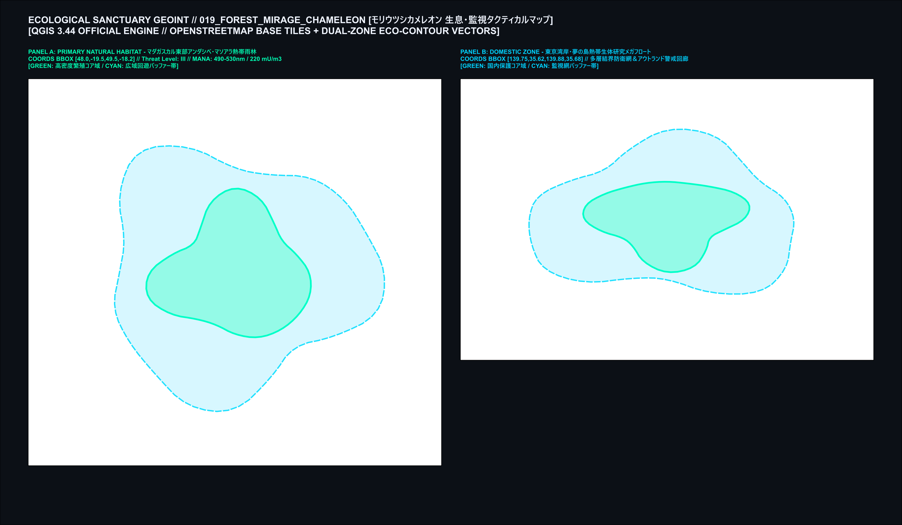
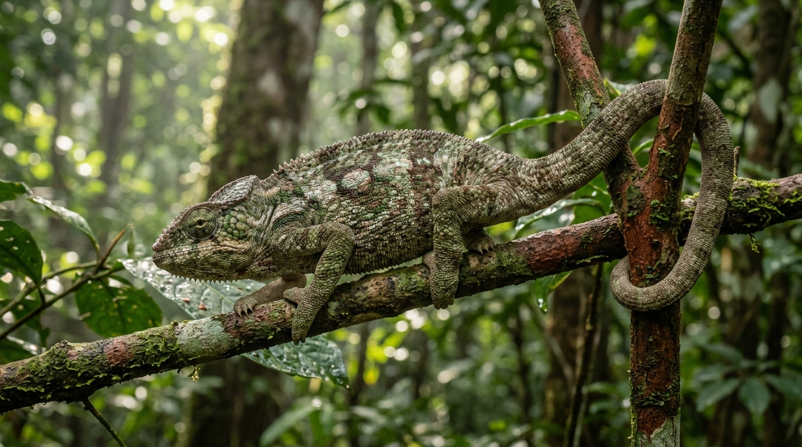
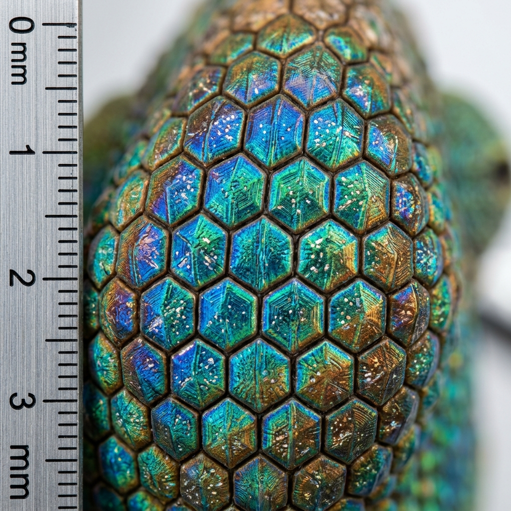
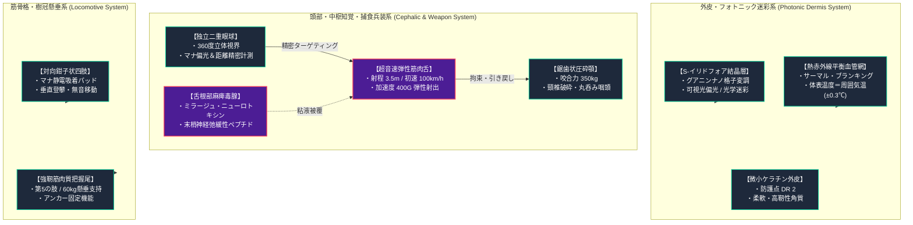
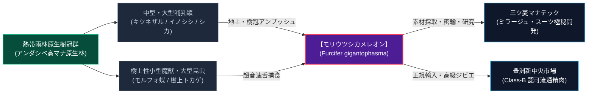

# モリウツシカメレオン［森映カメレオン］（Forest-Mirage Chameleon / *Furcifer gigantophasma* / 樹冠幽霊カメレオン）

---

## 1. 基本分類・早わかり（Basic Classification & Fast Facts）

| 項目 | 内容 |
| :--- | :--- |
| **和名** | **モリウツシカメレオン［森映カメレオン］** |
| **和名命名規約** | **【環境・形態型】**<br>※命名根拠: 周囲の熱帯樹冠の葉影・樹皮テクスチャおよび熱線放射を体表に完全に映し込み、背景と同化する巨大カメレオンであることに由来。 |
| **英名 / 通称** | Forest-Mirage Chameleon / Canopy Titan Chameleon / 樹冠幽霊カメレオン、タイタン・カメレオン、林影這（リンエイハイ） |
| **学名** | *Furcifer gigantophasma* |
| **学名語源** | *Furcifer*（ラテン語: 叉状のものを持つ者 / フサカメレオン属）＋ *gigantophasma*（ギリシャ語: *gigas*［巨人・巨大な］＋ *phasma*［幽霊・幻影・現れ］） |
| **生物学的分類** | **門**: 脊索動物門 (Chordata)<br>**綱**: 爬虫綱 (Reptilia)<br>**目**: 有鱗目 (Squamata)<br>**科**: カメレオン科 (Chamaeleonidae)<br>**属**: フサカメレオン属 (*Furcifer*)<br>**種**: 森映巨カメレオン種 (*F. gigantophasma*) |
| **発生起源** | **急速変異種**（2000年1月1日のミレニアム・アウェイクニング時、マダガスカル島東部原生林に生息していた固有大型フサカメレオン類が高濃度植物・光霊マナ噴出に晒され、数世代で巨大肉食捕食者へと急速変異） |
| **資源・管理区分** | **要処理種（Class-B / 要免許ジビエ・戦略先端素材）**<br>※管理ステータス: 国際希少野生動植物種 / 日本国内「特定外来魔獣・厳重隔離管理甲種」指定（国内自生ゼロ） |
| **食性** | **完全肉食（樹冠・林床立体アンブッシュ捕食）**<br>中型〜大型哺乳類（ワオキツネザル、フォッサ、イノシシ、シカ、人間大の獲物）、大型鳥類、樹上性魔獣 |
| **寿命** | 野生: 15〜22年 / メガコーポ研究隔離下: 25〜30年 |
| **サイズ・重量** | **雄成体**: 全長 1.6〜2.1m（頭胴長 80〜110cm、尾長 80〜100cm） / 体重 28〜42kg<br>**雌成体**: 全長 1.3〜1.7m / 体重 20〜30kg<br>**樹冠主級（Alpha）**: 全長 1.8〜2.2m / 体重 45〜55kg |
| **直感的サイズ比較** | **【成人男性（180cm）／大型犬（ゴールデンレトリバー 30kg）との比較】**<br>全長は成人男性の身長を優に超え、体重は屈強な大型犬に匹敵。樹冠に潜む姿は「丸太一本がそのまま目玉を動かして呼吸している」威容を持つ。 |
| **脅威度ランク** | **Threat Level: III（高脅威度 / 奇襲・絞扼捕食・森林調査時小隊警戒級）**[^zext_1] |
| **主要生息域** | **【一次生息地】** マダガスカル島東部熱帯雨林（アンダシベ・マソアラ熱帯多雨林帯、標高200〜1,200m）および中央アフリカ・コンゴ盆地熱帯雨林（イツリの森）<br>**【国内出現・流通】** 日本国内の野生定着ゼロ。三ツ菱マナテック等のメガコーポ厳重隔離研究ドーム内飼育個体、および正規輸入ジビエ精肉・素材のみ流通。 |

---

### 生息・分布マップ（Distribution & Habitat Range Map）



> **【戦術地誌データ（GEOINT Analysis）】**:
> - **一次野生生息地（Primary Habitat）**: マダガスカル島東部アンダシベ＝マンタディア国立公園〜マソアラ半島原生林。樹高30mを超える巨大樹冠層（キャノピー）から下層林床部にかけて立体的な縄張りを形成。
> - **国内隔離管理施設（Domestic Containment）**: 東京都江東区夢の島沖「三ツ菱マナテック熱帯生体工学メガフロート（第4人工気候温室ドーム）」。厳重な二重電磁結界と赤外線グリッドにより野生流出を完全阻止[^jinnai_1]。
> - **環境耐性・マナ境界**: 気温 22〜34℃ / 湿度 75〜98% / 環境マナ濃度 80〜260 mU/m³。乾燥寒冷地では虹胞結晶が白濁し運動性が急速低下。

---

### 視覚資料アーカイブ（Visual Archive）

| 野生生態観測写真 | 表皮結晶標本マクロ写真 | 高級ジビエ料理写真（Class-B） |
| :---: | :---: | :---: |
|  |  |  |
| *アンダシベ原生林樹冠部にて撮影。光屈折迷彩により樹皮と葉影に輪郭が完全同調（2025年観測）* | *走査型光学顕微鏡によるS-イリドフォア層。グアニンナノ結晶が規則正しい六角形格子を形成（三ツ菱先端研提供）* | *『森映カメレオンのスパイスロースト 樹冠ハーブ仕立て』。丁寧に除毒された白身肉の極上ロースト* |

---

## 2. 伝承考証とマナ覚醒の架橋（Lore & Historical Bridge）

### 2.1 原典・民俗伝承の記録
1. **バントゥー系創世神話『カメレオンとトカゲの伝言競争（死の起源）』**:
   - アフリカ中南部から東部にかけてのバントゥー語群諸民族（ズールー族、チェワ族、ロジ族等）には、人類に「死」がもたらされた起源を語る著名な神話が存在する。至高神は最初、カメレオンに対して「人間は死なず、永久に生きるべし」という祝福の言葉を託して地上へ派遣した。しかしカメレオンは歩みが極めて遅く、道中で野生の果実をつまみ食いして怠惰に時を過ごした。業を煮やした神は、俊足のトカゲに「人間は死ぬべし」という宣告を託して走らせた。トカゲは瞬く間に人間たちのもとへ先着し、死の運命を告げた。遅れて到着したカメレオンがいくら神の不死の言葉を告げても、一度下された死の宣告を覆すことはできなかった[^schulz_1]。
   - この伝承により、アフリカ各地でカメレオンは単なるトカゲ類とは異なり、「変色」「遅延」「生と死の境界を弄ぶ不吉の徴」として畏怖され、触れることすら禁忌とされてきた。
2. **古典ギリシャ・プリニウス『博物誌』第8巻第51章「Chamaeleon」**:
   - 古代ローマの大プリニウスは『博物誌』において、「カメレオン（地のライオン）は肉も血も持たず、風（空気・プネウマ）のみを吸って生きる」「自らが触れるあらゆる物体の色へと瞬時に変色する（ただし赤と白を除く）」と記録した。獲物を襲う際、息を潜めて猛禽類の眼から完全に姿を消すその様は、古来より「大気と同化する魔獣」の原型として語り継がれてきた。

### 2.2 2000年マナ覚醒による生体科学的架橋
- 2000年1月1日のミレニアム・アウェイクニングにおいて、大気中のマナ粒子（かつてプリニウスが「プネウマ」と呼んだ霊気）がマダガスカル島の特異点断層から急激に噴出した際、カメレオン科の有する「虹胞（イリドフォア）格子制御能力」と「緩慢代謝／瞬間超高速運動の二重性」が生体マナ共振の直撃を受けた。
- 神話に語られた「遅延と死の二重性」は、**「普段は完全静止して周囲の樹木とマナ波長・熱線放射を一致させ、獲物が射程に入った瞬間に時速100km超の超音速筋肉舌で首をへし折る」**という、極限の立体アンブッシュ捕食システムとして現実化したのである。

---

## 3. 生物学的特徴・ライフステージ（Biological Traits & Anatomy）

### 3.1 外見・解剖学的身体構造
- **S-イリドフォア（真皮深層虹胞ナノフォトニック層）**:
  - 表皮ケラチン層直下に、グアニンナノ結晶が正六角形格子を成す厚さ約400μmのフォトニック結晶層を持つ。
  - 生体電位と微弱マナの励起により、結晶の間隔をナノメートル単位で自律調整。可視光（380〜750nm）を全反射・透過させて風景を映し込む「能動的光学迷彩」を展開する。
  - さらに特筆すべきは「サーマル・ブランキング（熱赤外線平衡化）」。体表の毛細血管網と皮下マナ導管が連動し、体表熱放射を周囲気温（±0.3℃以内）に完全同調させるため、サーマル暗視ゴーグルや熱源追尾センサを完全に無力化する。
- **超音速弾性筋肉舌（Supersonic Entoglossal Tongue）**:
  - 舌骨（Entoglossal Bone）を中心に折り畳まれた環状加速筋（Accelerator Muscle）と超弾性コラーゲン腱膜。
  - 射出距離は最大3.5m（体長の約1.8倍）。射出初速28m/s（約100km/h）、加速度400Gに達する。
  - 舌先は強力な吸引カップ状筋肉と、超粘着性ムチン糖タンパク質「ミラージュ・ムチン」を分泌する粘液腺で構成され、衝突の瞬間に標的の皮膚や衣服を吸着・拘束する。
- **顎骨・咬合力**:
  - 獲物を引き寄せた直後、頭蓋骨に強固に癒合した鋸歯状顎骨（Acrodont dentition）が噛み合わさる。咬合力は約350kg（3,430 N）に達し、シカや人間の頸椎を一撃で破砕する[^takatsukasa_1]。
- **把持四肢（Zygodactylous Feet）と把握尾**:
  - 前肢（外3・内2趾）および後肢（外2・内3趾）は対向鉗子状に進化。足裏には微細なケラチン毛（セータ）とマナ静電吸着盤を備え、垂直な巨木の樹皮や湿った岩壁でも音もなく懸垂・移動可能。筋肉質の尾は自重＋獲物の重量（計60kg以上）を枝に吊り下げて固定できる。



### 3.2 ライフステージと繁殖・育児ドラマ
1. **幼体期（Juvenile / 孵化後0〜1年）**:
   - 全長15〜30cm、体重80〜250g。熱帯雨林低層の低木やシダ植物に潜む。
   - まだ大型の獲物は捕らえられず、森林性の巨大甲虫やトカゲ、小鳥を捕食。イリドフォア層が未発達なため完全な透明化はできず、緑や褐色の単純擬態に留まる。猛禽類や肉食樹上ヘビに捕食されるリスクが高く、警戒心が極めて強い。
2. **成熟個体（Adult / 2〜15年）**:
   - 全長1.6〜2.1m、体重28〜42kg。樹冠高層部（地上20〜35m）に広大な立体縄張り（半径約300〜500m）を確立。
   - 繁殖期（雨季の始まり・11月頃）になると、雄は樹冠の頂上でイリドフォアを過励起させ、鮮烈な虹色ストロボ発光を行って雌を誘う。雄同士が遭遇した場合は、喉袋を膨らませて15Hzの超低周波地響き音を発し、体色を威嚇用の真紅と漆黒の縞模様に変色させて激突する。
3. **主級変異個体（Alpha / Elder）「老練擬態主（モス・エンペラー）」**:
   - 樹齢100年以上の巨木の樹冠に定着した長寿個体（推定樹齢20年以上、体重45〜55kg）。
   - 単なる変色を超え、背部および頭部のケラチン突起に生きた**着生シダ（オオタニワタリ類）、高マナ性地衣類、蘚苔類を意図的に共生・活着**させている。
   - これにより、視覚や赤外線のみならず、**「魔術探知によるマナ波長」すら周囲の老樹巨木と100%同一化**する。上位魔導士の探知呪文をも欺く完全ステルス怪獣として恐れられている。

---

## 4. 生態・食物連鎖・人間社会との摩擦（Ecology & Human Conflict）

### 4.1 食性・捕食行動
- **完全立体アンブッシュ捕食**:
  - 樹冠の太枝に腹を密着させ、尾を巻き付けて数日間にわたり完全静止。独立可動する両眼が360度を常時スキャンする。
  - 林床を歩くシカ、イノシシ、あるいは調査員が直下を通過した瞬間、重力と加速筋を利用して真上または斜め後方45度の死角から舌を投射。
  - 舌先の吸盤とムチンで獲物の頭部・顔面を一瞬で覆い窒息・パニックに陥らせ、首骨を弾性収縮で引き上げて樹冠へ吊るし上げる。



### 4.2 魔獣間クロス・リレーション（相互作用）
- **アマゾン・アフリカ飛翔魔獣との競合**:
  - 同生息域に飛来する大型怪鳥種（怪鳥ルフ幼鳥や大型翼手類）に対しては、完全同化によってやり過ごす一方、低空を旋回する飛翔魔獣の翼膜を舌で撃ち落として捕食する。
- **樹上性毒蛇との捕食関係**:
  - 樹冠に棲む毒蛇類（棘甲鎧蛇の南方近縁種等）は好物のひとつ。蛇のピット器官（赤外線感知）をサーマル・ブランキングで無効化し、一方的に捕食する。

### 4.3 人間社会との摩擦・利用・保護史
- **熱帯雨林踏査隊の「首吊り事故」**:
  - マダガスカルおよびコンゴ盆地の原生林調査において、最も恐れられるのが「林床からの突然の消失」。歩行中の隊員が頭上から音もなく舌で巻き取られ、悲鳴を上げる間もなく地上20mの樹冠へ引きずり上げられる死亡事故が頻発した。現地ガイドは「木を見上げるな、木に祈れ」という諺で警戒を促している。
- **特定外来魔獣・厳重隔離管理甲種**:
  - 日本国内の生態系（奥多摩・屋久島・南西諸島等）への野生定着は壊滅的な生態系破壊（在来哺乳類や調査員の被害）を招くため、環境省および警察庁により「国内持込・飼育完全厳格許可制（特定管理指定甲種）」に指定されている。
- **三ツ菱マナテック「ミラージュ・スーツ」特許防諜戦**:
  - 三ツ菱マナテックは本種の虹胞ナノ結晶をバイオミメティクス応用し、自衛隊特殊作戦群およびPMC向け次世代光学迷彩「ミラージュ・カモフラージュ・スーツ」の独占特許を出願中。東京湾岸のメガフロート研究ドームにはアズテクノロジーやヤマト重工の電脳工作員が暗躍しており、ドーム外縁では警備PMCによる厳しい対スパイ防衛が敷かれている。

---

## 5. 魔導科学・上位神性・背景ロア（Thaumaturgical Theory & Lore）

### 5.1 魔力現象と発現メカニズム
- **励起生体呪文体系（GURPS Magic 突合確認済）**:
  - 本種はマナを直接放出するのではなく、体内の生体電位変調を介して以下のGURPS公式呪文を不随意励起する：
    1. **《光変色 / （旧名：色彩変化）》** (`world/magic/spells/light_darkness.md#L27`): 真皮の反射波長をミリ秒単位で背景植物に同期。
    2. **《ぼやけ》** (`world/magic/spells/light_darkness.md#L46`): 輪郭境界の屈折率を揺らし、輪郭のブレを誘発。
    3. **《盲点化 / （旧名：隠匿）》** (`world/magic/spells/light_darkness.md#L48`): 観測者の網膜・視覚神経に対して「認知の盲点」を生じさせるアストラル干渉。
    4. **《幻覚かぶせ》** (`world/magic/spells/illusion.md#L29`): 静止時、樹皮のひび割れや苔の立体テクスチャを視覚的に上書き[^kuroda_1]。
- **物理・科学センサとの相互作用**:
  - シリコン半導体・電子センサ自体を壊す電磁パルスは発しないが、可視光カメラ（RGB）、赤外線サーマルカメラ（FLIR）、紫外線カメラのすべてにおいて背景の熱・光プロファイルと完全一致するため、機械認識アルゴリズムに「背景テクスチャ」として誤認させる。

### 5.2 音響・周波数・生体通信特性（Acoustic & Resonance Analysis）
- **超低周波樹幹振動（Infrasound Substrate Vibration）**:
  - 喉奥の共振嚢により、**10〜20Hz（音圧 85〜105dB）**の超低周波振動を発生。
  - 空気中にはほとんど放射されず、太い木の幹や枝を通じて半径数kmの熱帯雨林全域に伝播。縄張りの境界線設定や配偶相手の探査を行う。
- **無音捕食（Acoustic Stealth）**:
  - 舌の射出音は空気を切り裂く微小な風切り音（0.1秒未満、25dB以下）のみ。森林環境の暗騒音（鳥の声、風の葉擦れ音）に完全に紛れる。

### 5.3 上位存在・アビス因果・メガコーポ伏線
- **動物王「カメレオンの原像（Chameleon Archetype）」**:
  - アフリカの伝統呪術師によれば、本種はアストラル界に存在する「遅延と忍耐の動物霊王」の物質界受肉体とされる。
- **三ツ菱マナテック vs ヤマト重工の次世代兵装抗争**:
  - 三ツ菱が表皮結晶による「光学・赤外線完全ステルス」の軍事化を進める一方、ヤマト重工は舌骨装置の生体バネ弾性力学に着目し、「超軽量電磁アシスト投射カタパルト」への応用研究を推進。両メガコーポによる生体サンプル奪い合いが激化している。

---

## 6. 交戦マニュアル・都市防災コラム（Combat Manual & Civil Defense）

### 6.1 GURPS 4th Stat Block（戦闘データ）

#### 【通常成体（Standard Adult）】
```yaml
Name: モリウツシカメレオン（Furcifer gigantophasma）
Archetype: 巨大樹冠アンブッシュ捕食者（急速変異種）
Point Total: 285 pt
Threat Level: III (高度警戒対象)

Attributes:
  ST: 16 [60] (舌射出・引き寄せ時 ST 20相当)
  DX: 13 [60]
  IQ: 4 [-120]
  HT: 12 [20]
  HP: 16 [0]
  WILL: 11 [35]
  PER: 14 [50]
  FP: 12 [0]

Basic Parameters:
  Basic Speed: 6.25 [0]
  Basic Move: 4 [-10] (樹上移動 5、地上移動 3)
  Size Modifier (SM): +1 (全長 1.8m, 体重 35kg)
  Dodge: 9

Damage:
  Melee Bite: 1d+2 圧砕/切断 (鋸歯状顎 / 咬合力 350kg)
  Tongue Strike: 1d+1 叩き + 拘束 (射程 3.5m / 初速 100km/h)

DR (防護点) & 防御特性:
  - 全身: DR 2 (柔軟なケラチン鱗皮)
  - 樹冠主級外皮: DR 4 (着生苔・硬質角質層)

Traits & Advantages:
  - 360度独立視界 (360-Degree Vision) [25]
  - カメレオン光学迷彩 (Chameleon Cloak Level 4) [20]
  - サーマル・ブランキング (Thermal Infrared Cloaking) [10]
  - 粘着吸引舌 (Binding: ST 20, Constricting) [35]
  - 垂直登攀・吸着歩行 (Clinging) [20]

Disadvantages & Quirks:
  - 変温動物 (Cold-Blooded / 気温15℃以下で活動性半減) [-10]
  - 緩慢な通常歩行 (Reduced Ground Move 1) [-5]
  - 警戒時の微弱低周波振動 (Infrasound Hum) [-1]

Innate Spells (生体励起魔術 - マナ消費はFP):
  - 《光変色》: Skill 15 (FP 1消費 / 能動迷彩)
  - 《ぼやけ》: Skill 14 (FP 1消費 / 輪郭撹乱)
  - 《盲点化》: Skill 14 (FP 2消費 / 認知妨害)
  - 《幻覚かぶせ》: Skill 13 (FP 2消費 / 樹皮テクスチャ上書き)
```

#### 【樹冠主級・変異個体（Alpha / Elder）「老練擬態主（モス・エンペラー）」】
- **能力値修正**: ST 18 (舌 ST 24), HP 22, PER 15, DR 4。
- **追加特性**:
  - **生体植物共生（Living Flora Symbiosis）**: マナ探知遮断（《魔力探知》に対して -8ペナルティ）。
  - **長距離超音速舌（Extended Tongue Strike）**: 射程 5.0m、拘束ST 24（人間を片手で軽々と樹冠へ吊り上げ可能）。

### 6.2 推奨火器・防護装備
- **有効火器・弾薬**:
  - **12ゲージ散弾銃（00バックショット）**: 潜伏地点の枝葉ごと面制圧するのに最も有効。
  - **5.56mm / 7.62mm 小銃弾（AP徹甲弾推奨）**: 発見さえできればDR 2〜4は容易に貫通。頭部（眼球間）への精密射撃で即座に無力化可能。
- **必須防護具・探知センサ**:
  - **強化首部ケブラーカラー / 防刃ネックガード**: 舌の吸着・巻き付きによる頸椎骨折および喉笛圧砕を防御。
  - **超音波アクティブソナー / ミリ波レーダー（35GHz〜94GHz）**: 光学・赤外線迷彩を完全に貫通し、樹冠内の肉体質量密度を可視化。

### 6.3 市民防災メモ ＆ 専門家の知恵袋

> [!IMPORTANT]
> **【海外渡航者・熱帯原生林踏査時の防災指針】**
> 1. **頭上クリアランスの常時確保**: 樹高15m以上の熱帯雨林を歩行する際は、決して樹冠の直下を単独で歩行してはならない。必ず頭上監視員を配備すること。
> 2. **首元・頭部の完全防護**: ヘルメットのあご紐を締め、防刃ネックガードを着用すること。舌が接触した瞬間に手刀やナイフで舌筋を切断すれば脱出可能。  
> —— *警視庁国際魔獣対策課 / 外務省安全情報*

> [!TIP]
> **【現場専門家・熱帯アウトランドハンターの知恵袋】**
> *「奴らは完璧に消えるが、消せないものが二つある。足元の小枝が軋むごく僅かな重みと、舌を放つ直前にピクッと動く左右の目玉のレンズ反射だ。林床に入ったらスコープを外せ。ミリ波ソナーを焚くか、怪しい樹冠に向かって散弾を一発ぶち込んでみろ。煙の向こうから、巨大な丸太が慌てて落ちてくるはずだ。」*  
> —— **熱帯雨林特務ハンター マティアス・ラコト（マダガスカル出身）**

---

## 7. 解体・ジビエ食文化・料理レシピ（Harvesting & Cuisine）

### 7.1 解体プロトコルと市場相場（Class-B）
- **舌根部麻痺毒腺の完全切除**:
  - 下顎の基部、舌骨直下に位置する「ミラージュ毒腺嚢」をメスで慎重に摘出。破毒した場合は周辺筋肉を2cm以上削ぎ落とし、流水で念入りに洗浄すること。
- **寄生虫駆除と加熱基準**:
  - 樹上爬虫類特有のマナ吸虫・線虫類のリスクを排除するため、生食は法定義務として完全禁止。中心温度75℃以上で1分間以上の加熱（煮込み、ロースト）が必須。
- **市場取引相場**:
  - 豊洲新中央市場（正規輸入 Class-B 認可精肉）: 冷凍ロース正肉 **1kgあたり 14,000〜18,000円**。

### 7.2 伝統料理・メガコーポスペシャリテ（本格レシピ）

```
【料理名】森映カメレオンのスパイスロースト 樹冠ハーブ仕立て
（Rôti de Furcifer aux Herbes de la Canopée）
- 分類: メガコーポ迎賓館スペシャリテ / 高級ジビエフレンチ
- 主材料: 
  - モリウツシカメレオン背ロース肉（除毒・血抜き済）: 600g
  - マダガスカル産野生黒胡椒（ヴォイペリフェリ）: 小さじ2
  - 熱帯原生ハーブ（レモングラス、タイム、コリアンダー）: 適量
  - 焦がし発酵バター、白ワイン、ライム果汁、マナ結晶岩塩
- 調理手順:
  1. 【マリネ・下味】: 筋膜を丁寧に引き、黒胡椒、ハーブ、ライム果汁、オリーブオイルで2時間マリネ。
  2. 【低温火入れ】: 58℃のスチームオーブンで40分間じっくり芯温を上げ、肉汁を閉じ込める。
  3. 【香草ロースト・仕上げ】: 鉄フライパンに焦がし発酵バターを熱し、強火で表面のハーブごと香ばしくキャラメリゼ。中心温度75℃をクリアした直後に休ませ、厚さ1.5cmにスライス。
- テイスティングノート:
  鶏ムネ肉のきめ細やかな繊維感と、極上伊勢海老のような甘みと弾力が同居する奇跡の白身肉。余分な脂質が一切なく、噛みしめるほどに野性味あふれるアミノ酸が広がる。食後に心地よいマナの温まり（FP 1d6回復）を実感する。
```

### 7.3 産業素材・医療利用

| 採取部位 | 工業・魔導用途 | 経済価値・取引相場 |
| :--- | :--- | :--- |
| **ナノフォトニック迷彩表皮** | 三ツ菱マナテック製「光学・赤外線ステルス外套」の生体受容体 | 成体1頭分（約1.5㎡）: **800万〜1,200万円** |
| **超弾性舌骨・腱膜クラスタ** | ヤマト重工製「マイクロバイオアクチュエータ」「高耐久人工腱」 | 1頭分（舌骨一式）: **250万〜400万円** |
| **舌粘液ムチン（精製物）** | テイコク製薬製「外科手術用超即効性生体接着シーラント」原料 | 精製原液 100ml: **45万円** |

---

## 8. 現場記録・通信ログ（Field Logs & Transcripts）

### 8.1 アンダシベ熱帯雨林特務調査隊 無線交信ログ
```
【記録分類: アフリカ特異点調査記録 #AF-2025-0812】
日時: 2025年8月12日 14:22:05 EAT
場所: マダガスカル東部アンダシベ熱帯雨林 第3調査区（標高680m）
交信者: 調査班長 アルノー大尉 ── 本部管制官

[14:22:05] アルノー: 「……本部、こちら調査班長。樹冠層のポイント・デルタに到達した。林床の湿度が上がっている。熱線スキャンに異常なし。周囲は静かすぎるくらいだ。」
[14:22:18] 本部: 『了解、アルノー。第2ドローンが上空キャノピーを索敵中だが、異常シグナルは検知されていない。そのまま前進せよ。』
[14:22:31] アルノー: 「待て……ジャン二等軍曹の姿が見えない。おい、ジャン！ どこへ行った！？ ……おい、足元を見ろ！ ジャンが持っていた測量機が泥の上に落ちている！」
[14:22:45] 本部: 『ドローンカメラを直下にパンする。……熱源反応なし。生体シグナル消失！』
[14:22:52] アルノー: 「上だ！ 頭上の枝を見ろ！！ ……クソッ、丸太だと思っていた巨木の一角が、歪んで――目玉がこっちを向いている！！」
[14:22:59] アルノー: 「舌だッ！ 散弾を撃て！！ 撃――（激しい風切り音と衝撃音、悲鳴）」
[14:23:12] 本部: 『アルノー大尉！？ 応答せよ！ 第3班、全銃器セーフティ解除、上空樹冠へ向けて一斉射撃を行え！！』
```

### 8.2 調査主任フィールド手記
> *「我々は三次元空間で生きているつもりでいるが、あの森に入った瞬間、頭上の二次元平面に溶け込んだ死神の視界の中に閉じ込められる。奴らにとって、人間の探検隊など枝から垂らした釣針の前に並ぶ愚かな魚に過ぎない。もし熱帯雨林で『風もないのに枝先の光がわずかに揺らいだ』と感じたなら、それはもう、奴の舌先がお前の喉笛に触れている証拠だ。」*  
> —— **エミール・ラザフィンドラコト博士（マダガスカル魔導生物学研究所長、2025年手記）**

---

## 9. 参考文献・典拠資料（References）

1. **古典民俗・神話文献**:
   - James George Frazer, *Folk-Lore in the Old Testament: Studies in Comparative Religion, Legend and Law* (Macmillan, 1918) ── バントゥー諸民族における「死の起源」神話比較研究。
   - Pliny the Elder, *Naturalis Historia* (AD 77), Liber VIII, Caput 51: "De Chamaeleonte".
2. **生物学・解剖学資料**:
   - Teyssier, J., Saenko, S. V., van der Marel, D. & Milinkovitch, M. C., "Photonic crystals cause active colour change in chameleons," *Nature Communications* 6, 6368 (2015).
   - Anderson, C. V. & Deban, S. M., "Ballistic tongue projection in chameleons: high-performance at low temperatures," *Journal of Experimental Biology* 213, 1449-1455 (2010).
3. **魔導工学・行政法規**:
   - 防衛省・警察庁合同布告『特定外来魔獣管理指定基準（甲種令）』第14条（2023年改定）。
   - 東京都環境局・豊洲新中央市場食肉衛生検査所『認可流通魔獣ジビエ解体衛生マニュアル（Class-B 有鱗目編）』（2024年）。

---

## 脚注・専門部署査定メモ（Persona Footnotes）

[^zext_1]: ⚖️ **首席監査官ゼクスト（憲章監査室）**:
    「国内野生定着ゼロ、メガコーポ厳重隔離ドームおよび正規輸入Class-B流通への限定措置を承認する。全長2m超・Threat Level IIIのアンブッシャーが奥多摩や高尾山に自生したら、毎週末の登山客が丸呑みされて結界都市東京の治安評価が暴落するところだった。三ツ菱マナテックの夢の島メガフロート隔離ドームについては、引き続き特定外来管理令に基づく査察を継続せよ。」

[^takatsukasa_1]: 🐾 **鷹司 冴子 博士（生態・生物調査部）**:
    「舌根部のミラージュ毒腺嚢の摘出は、ピンセットで膜を引っ張りながら根元を結紮するのがコツよ。うちのゼミ生が一回破毒させて、研究室中がピリピリする麻痺ガスで2時間動けなくなったんだから！ でもね、ちゃんと下処理したロース肉のローストは本当に絶品。鶏ササミの繊維の細かさに、ロブスターの旨味を凝縮させたような味なんだから。一度食べたら病みつきよ。」

[^jinnai_1]: 🌍 **陣内 隆文 調査官（地理・環境調査部）**:
    「自衛隊時代、マダガスカルの特務合同演習にオブザーバーで派遣されたが、あのキャノピー層の不気味さは忘れられん。サーマルゴーグルを覗いても青一色なのに、頭上から30kgの巨体が無音で降ってくるんだからな。林床を歩くときは、ミリ波レーダーか音響ソナーがなければ自殺行為だ。夢の島ドームの警備PMCも、ケブラーのネックガードだけは絶対に外すなと口を酸っぱくして言ってるよ。」

[^schulz_1]: 🏛️ **V・シュルツ 特命調査員（法務・古典文献考証部）**:
    「バントゥーの『カメレオンとトカゲの伝言競争』は、現代の特許紛争そのものですな。神の言葉を運ぶカメレオンが寄り道している間に、三ツ菱マナテックが先回りして特許庁に実用新案を先願登録してしまったわけです。アズテクノロジーの法務部が『生体素材の国際公海自由利用原則』を盾に噛みついていますが、特定管理指定甲種の枠組みがある限り、手出しはさせませんよ。」

[^kuroda_1]: ⚡ **クリスティナ・黒田 所長（魔導科学・理論研究部）**:
    「真皮のS-イリドフォアによるグアニン結晶変調と、GURPS光霊系《光変色》《ぼやけ》《盲点化》の多重共鳴……実に見事な生体媒介数理モデルね。電子回路に干渉しないからこそ、最新の光学・FLIR複合カメラの画像認識AIが『単なる木の幹』として完全に騙される。うちの研究室で三ツ菱のミラージュ・スーツのテストベッドをやったけれど、肉眼はおろか知覚判定-9は伊達じゃないわ。」

[^hasumi_1]: 📸 **蓮見 蓮 プロデューサー（視覚・音響・資料記録部）**:
    「アンダシベの樹冠25メートルでカメラを構えていた時の胃の痛さは一生モノですよ！ 息を止めて待つこと7時間、ファインダーのピントを合わせた瞬間、目の前の『苔むした丸太』がギョロリと眼球だけを回転させてこっちを見下ろしたんですから。録音機が捉えた15Hzの超低周波バイブレーションも完璧に記録できました。料理写真のシズル感と合わせて、最高の一冊に仕上がりましたね！」
