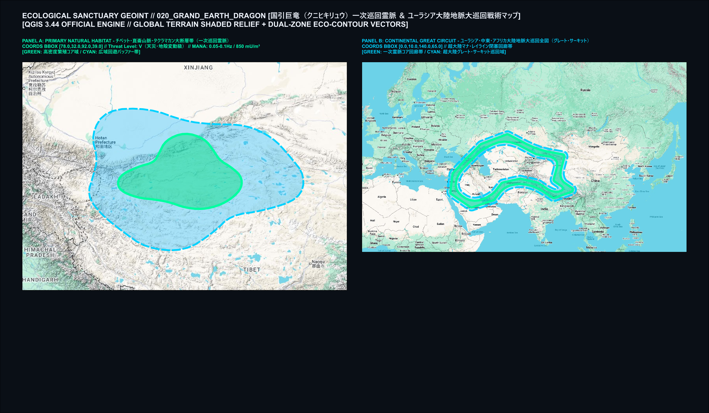
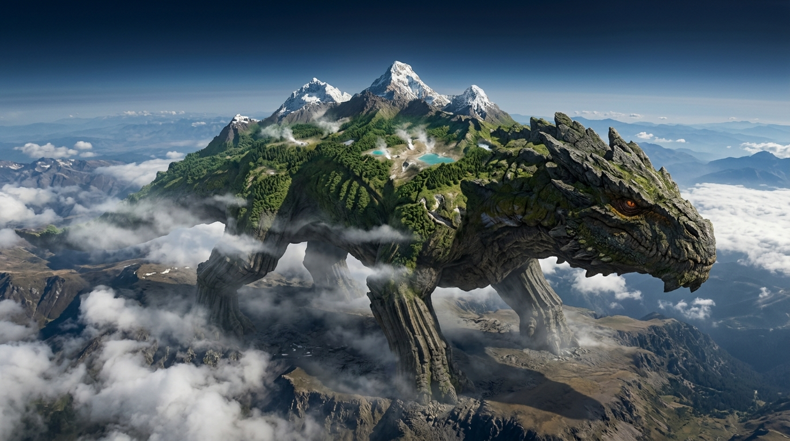
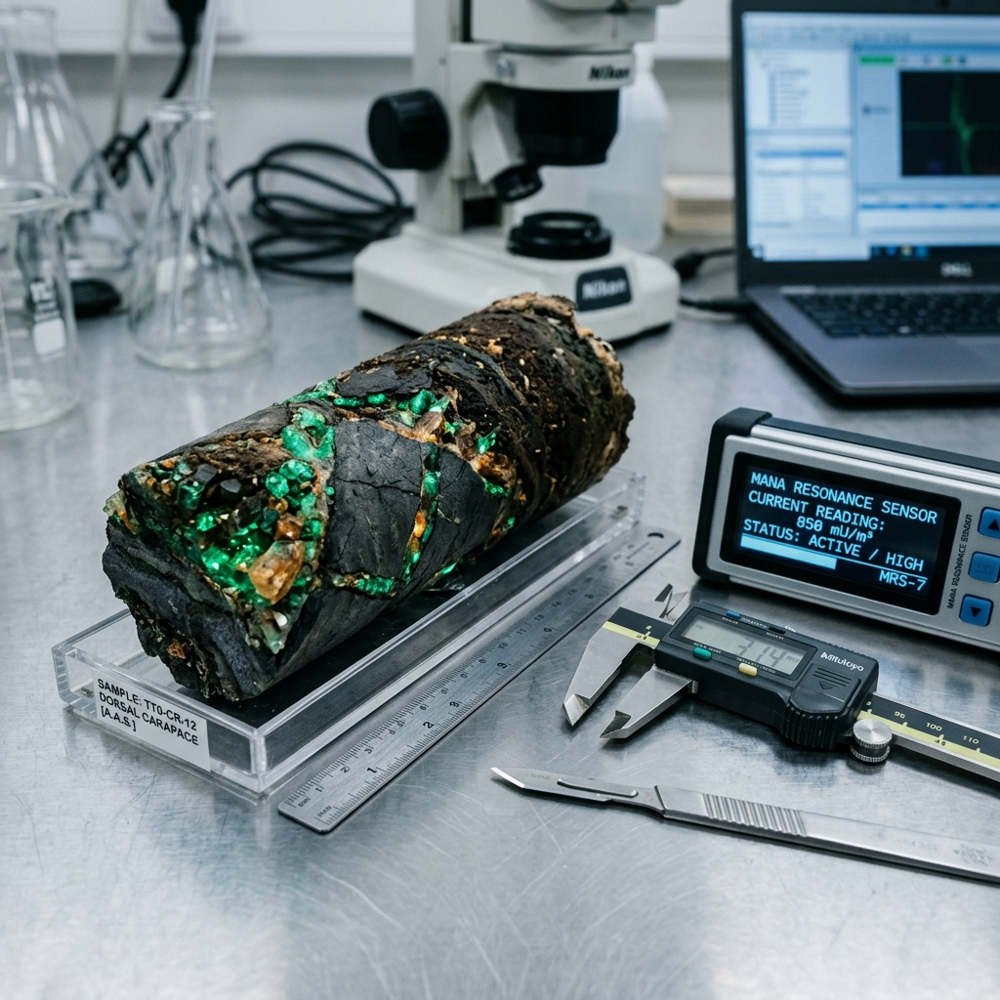
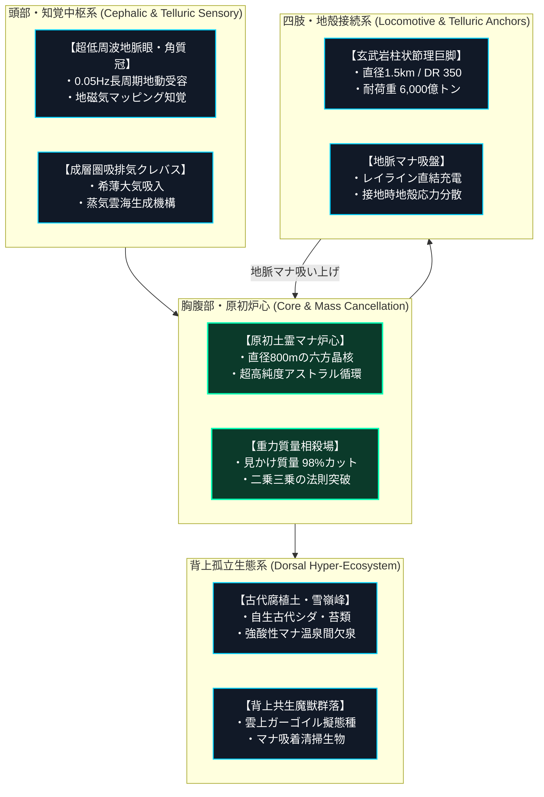
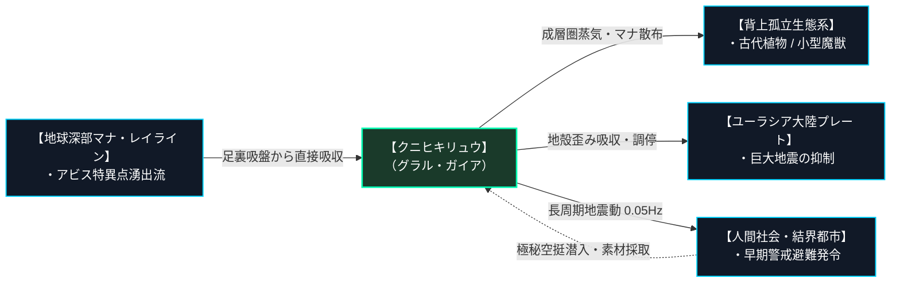

# 【クニヒキリュウ［国引巨竜］】（Grand Earth Dragon / *Titanoterradraco orogenes* / 通称：動く山脈、大陸巨竜、地殻竜、グラル・ガイア）

---

## 1. 基本分類・早わかり（Basic Classification & Fast Facts）

| 項目 | 内容 |
| :--- | :--- |
| **和名** | **クニヒキリュウ［国引巨竜］** |
| **和名命名規約** | **【伝承・古語型】**<br>※命名根拠: 『出雲国風土記』に記された「八束水臣津野命（ヤツカミズオミツヌノミコト）」の国引き神話——余れる土地を綱で引き寄せて縫い合わせたという巨神伝承の如く、大陸の地殻と山脈をその巨体に載せて悠然と引き連れ歩む姿に基づく。 |
| **英名 / 通称** | Grand Earth Dragon, Continental Titan / 大陸巨竜、動く山脈、地殻竜、グラル・ガイア、大地祖竜 |
| **学名** | *Titanoterradraco orogenes* |
| **学名語源** | *Titan*（ギリシャ神話: 巨大神族）＋ *terra*（ラテン語: 大地・陸塊）＋ *draco*（ラテン語: 竜）／ 種小名 *orogenes*（ギリシャ語: 造山運動を起こすもの） |
| **生物学的分類** | **門**: 脊索動物門 (Chordata)<br>**綱**: 爬虫綱 (Reptilia)<br>**目**: 竜目 (Draconis)<br>**科**: 大陸巨竜科 (Titanoterridae)<br>**属**: 大地竜属 (*Titanoterradraco*)<br>**種**: 大陸巨巌大地竜種 (*T. orogenes*) |
| **発生起源** | **古代覚醒種（超越巨竜）**<br>※先史地球の超大陸時代より、ユーラシア中枢大断層の深部霊脈結節点において超巨大結晶核として休眠。西暦2000年1月1日の「ミレニアム・アウェイクニング」に伴う世界的マナ噴出によって再活性化し、地表へと浮上・活動を再開した。 |
| **資源・管理区分** | **汚染・超越種（Class-C / 食用完全禁止・不可侵天災指定種）**<br>※管理ステータス: 国際竜種不可侵条約（2018年）第1条指定・**絶対交戦禁止・接触回避対象（Class-0-Avoidance）**。全器官が超高純度の原初マナ重金属・結晶質シリカで満たされており、摂取は即座に肉体石化・全身結晶化死を招く。 |
| **食性** | **地脈直接吸収代謝（超高純度アストラル・土霊マナ食）**<br>※生物の捕食は一切行わない。地下数千メートルから噴出する地球規模のレイライン（地脈結節点）に四肢底部のマナ吸盤を接地させ、地球深部の原初エネルギーを直接吸収・循環させる。 |
| **寿命** | **推定 500,000年〜地質学的永劫（地殻活動周期依存）** |
| **サイズ・重量** | **全長 18,000〜22,000m（約20km） / 全高 5,500〜7,500m（約6km） / 推定体重 4,500億〜6,000億t（SM +18）** |
| **直感的サイズ比較** | **【ONE PIECEの「象主（ズニーシャ）」に匹敵する超ド級スケール】**<br>四肢の直径だけで1.5〜2.5km（山手線内側の主要駅間距離に匹敵）、背中の甲殻面積は東京都23区（約620km²）の半分に相当する約300km²の孤立生態系を擁する。雲海を眼下に突き抜け、成層圏に頭頂部が達する文字通りの「歩く山脈」。 |
| **脅威度ランク** | **Threat Level: V（天災・地殻変動級 / 超越不可侵存在）**<br>※単独個体の移動そのものがマグニチュード4〜6相当の長周期地震波、局地的気候変動（降雨・雲海生成）、および地磁気・重力異常を引き起こす。国家軍隊・通常通常兵器・戦術核兵器のいかなる武力行使も完全無効。 |
| **主要生息域** | **【一次野生生息地（原産地・巡回霊脈）】** ユーラシア大陸中枢大断層帯（チベット高原〜ヒマラヤ北嶺〜崑崙山脈〜タクラマカン砂漠地底地脈帯）[^jinnai_1]<br>**【国内出現・回遊形態】** **直接上陸ゼロ（完全不可侵・国際地殻監視対象）**。極東シベリア・外興安嶺〜沿海州通過時、日本全土の高感度地震計で0.05〜0.1Hzの長周期微動が観測され、東京湾岸多層同心円要塞網の防護結界基盤が共鳴警戒態勢に移行する。 |

---

### 生息・分布マップ（Distribution & Habitat Range Map）



> **【戦術地誌・地殻監視データ（QGIS 3.44 Official Engine レンダリング）】**:
> - **PANEL A（一次野生生息地・巡回霊脈コア）**: チベット高原・崑崙山脈・タクラマカン大断層帯（BBOX: 78.0,32.0,92.0,39.0）。標高4,000〜6,000mの不毛な高原地帯を時速1〜3kmで悠然と巡行。四肢接地部から高純度土霊マナ（850 mU/m³）が放射され、緑色ポリゴンで示されるコア域を形成。
> - **PANEL B（超大陸地脈大巡回全図：グレート・サーキット）**: ユーラシア・中東・アフリカ大陸を結ぶ超巨大環状地脈回廊（BBOX: 0.0,10.0,140.0,65.0）。チベット ➔ 天山 ➔ ウラル ➔ コーカサス ➔ メソポタミア ➔ レバント・紅海 ➔ アラビア ➔ イラン高原 ➔ ヒンドゥークシュ ➔ ヒマラヤ ➔ チベットを約120年周期で一周する閉塞地脈軌道。日本列島はこの超大陸サーキットの東端外縁に位置し、直接の物理的踏破を受けることはない。

---

### 視覚資料アーカイブ（Visual Archive）

| 生態観測写真（野生環境・成層圏空撮） | 背上生態系・甲殻標本マクロ写真 |
| :---: | :---: |
|  |  |
| *高高度航空偵察機 U-2M より成層圏境界（高度12,000m）から撮影されたクニヒキリュウ『グラル・ガイア』。雲海を突き破る四肢と頭部、背上に広がる原生林と雪嶺が確認できる（2026年5月、チベット高原上空）。* | *特務潜入調査隊が背上降下時に削岩採取した背部変成岩甲殻のコアサンプル（標本番号: TT0-CR-12）。圧縮玄武岩層の割れ目にエメラルドグリーンの高純度マナ水晶晶洞が発達している。* |

---

## 2. 伝承考証とマナ覚醒の架橋（Lore & Historical Bridge）

### 2.1 原典・民俗伝承の記録
世界各地の古代神話および古典文献には、島や山脈そのものが巨大な生物であり、大地を背負って移動するという驚くべき記録が共通して残されている[^schulz_1]。

1. **『出雲国風土記』国引き神話（古代日本・733年）**:
   島根半島形成の起源を語る「国引き条」において、八束水臣津野命は*「八雲立つ出雲の国は、狭布の稚国なり。縫ひ初め取らむ」*と宣い、新羅・隠岐・佐比売山・能登から余れる土地を「三身の綱」で引き寄せて縫い合わせた。この伝承の原型は、先史文明期に東アジア地塊の地殻を牽引・安定化させていた超巨大大地竜の移動現象を目撃した古代人の記憶が神格化されたものと推測される。
2. **中世寓意譚（ベスティアリ）における巨獣『アスピドケロン（Aspidochelone）』**:
   『フィシオログス』や中世動物誌に登場するアスピドケロンは、海上に浮かぶ巨大な島と見紛うばかりの巨躯を誇り、その背中には谷川が流れ、大木が鬱蒼と生い茂っていたとされる。船乗りたちが島と誤認して上陸し、火を焚くと海中深く潜水して船を沈めたという寓話は、まさに背上に原生林を戴く本種の生態的特徴と驚くほど一致する。
3. **北欧神話の『ヨルムンガンド（Jörmungandr）』とアラブ伝承の『クジャタ（Kujata）』**:
   大地を取り巻き世界を支える大蛇ヨルムンガンド、そして巨大な魚バハムートの背に乗り、4,000の角と目を持って大地を担ぐ巨牛クジャタ——これら「世界を背負う巨獣」のアーキタイプは、すべてユーラシア中枢に実在した『グラル・ガイア』の断片的な目撃証言が各地の神話体系へと変容したものである。
4. **中国古典『山海経』の『燭陰（しょくいん）』**:
   大荒北経に記される鍾山（しょうざん）の神・燭陰は、*「目を視れば昼となり、目を瞑れば夜となり、吹けば冬となり、呼けば夏となる」*という。全長千里（数百キロ）に達し、呼吸だけで気候を一変させるこの神性巨竜の描写は、本種が成層圏で吸排気を行う際に引き起こす大規模な局地気象循環の生々しい観察記録である。

### 2.2 2000年マナ覚醒による生体科学的架橋
古来の神話において「大地を支える神」と称えられた存在は、いかにして2026年の現代科学の前にその姿を現したのか。

魔導地質力学の解析によれば、本種は中生代ジュラ紀〜白亜紀の造山運動期に誕生し、かつてパンゲア超大陸を形成・安定化させていた原初生命体の一種である。地球のマナ濃度が低下した新生代第四紀以降、本種はユーラシア大陸プレートとインドプレートが激突するヒマラヤ・崑崙地下20〜30kmの「マナ不連続面（Moho-Mana Discontinuity）」に潜り込み、仮死結晶休眠状態（Petro-Hibernation）に入っていた。

西暦2000年1月1日の「ミレニアム・アウェイクニング」により、地球核（コア）から膨大な原初マナ流が地表へと噴出。休眠結晶核がこの奔流を吸い上げて再活性化し、周囲の玄武岩・変成岩・超高密度マナ水晶を外骨格として巻き込みながら、2004年10月に崑崙山脈西端の崩落と共に地表へと立ち上がった。その巨体は生物学の常識（二乗三乗の法則）を完全に超越しているが、これは後述する**「重力質量相殺場（Gravitational Cancellation Field）」**という究極の生体魔導機構によって支えられていることが判明している[^kuroda_1]。

---

## 3. 生物学的特徴・ライフステージ（Biological Traits & Anatomy）

### 3.1 外見・解剖学的身体構造
クニヒキリュウの外見は、もはや単一の動物というよりは「独立した動く大山脈」である。頭部から尾の先端に至るまで、全身が地質学的年代を経て形成された岩石・鉱物・土壌層によって完全に覆われている。

- **柱状節理骨格（Columnar Jointing Skeleton）**:
  四肢の支持骨格は、通常の骨組織ではなく、超高密度の玄武岩質柱状節理（多角形玄武岩柱が蜂の巣状に結合した構造）に生体マナ結晶が網目状に浸透した超複合生体構造体である。この骨格の破壊靭性はダイヤモンドを凌駕し、**物理防護点 DR 350** を誇る。
- **背上孤立魔境（Dorsal Hyper-Ecosystem）**:
  背部甲殻の総面積は約300km²に達する。下層から「原初結晶岩盤層（厚さ50〜80m）」「圧縮頁岩層（厚さ20m）」「古代腐植土層（厚さ3〜10m）」の3層構造を形成。数万年前に繁茂していた古代シダ植物群落、高山マナ草原、万年雪を戴く3つの主峰、そして生体熱で湧出する強酸性マナ温泉池が点在し、地上から完全に隔絶された独自の閉鎖生態系を育んでいる。
- **地脈マナ吸盤（Telluric Suction Pads）**:
  巨大な四肢の足裏（直径約1.5km）には、数千の微小な地脈共鳴孔（Telluric Pores）が蜂の巣状に開口している。着地するごとに地下深部の岩盤にマナの「根」を打ち込み、地球の磁場と地脈エネルギーを急速充電する。
- **成層圏吸排気孔（Stratospheric Spiracles）**:
  頭頂部および側頸部に巨大なクレバス状の吸排気孔が存在する。高度6,000mの希薄な大気から酸素と大気マナを直接吸入し、余剰熱と高圧水蒸気を間欠泉のように成層圏へと噴出する。この蒸気が凝結して常に背上に巨大な積乱雲（擬態雲海）を発生させている。



### 3.2 ライフステージと繁殖・育児ドラマ
地質学的タイムスケールで生きる本種のライフサイクルは、人間の生涯を遥かに超えた数万年単位で進行する[^takatsukasa_1]。

1. **幼体期（Sub-Terran Juvenile）**:
   体長500m〜1km（成体の約20分の1）。幼体は地表には現れず、地殻深部（上部マントル付近）を泳ぐように移動しながら、高濃度鉱物マナを直接摂取して外骨格を形成する。この時期の移動が、プレート境界における群発地震の原因となっているとされる。
2. **成熟個体（Continental Adult）**:
   全長18〜22kmに成長し、地表へと浮上した成体。地球規模のレイライン（超大陸グレート・サーキット）を100〜150年周期で巡行し、地殻の歪みエネルギーを吸収して大地震の発生を未然に防ぐ「地殻の調停者」として機能する。現在活動が確認されている成体は、全世界で『グラル・ガイア』を含めわずか2〜3頭と推定されている。
3. **主級・変異個体（Primordial Alpha: 『グラル・ガイア』）**:
   先史文明以前から存在する最長寿の祖竜。背上に人類未踏の古代神殿遺跡や超高純度マナ水晶露頭を戴き、周囲数十キロメートルの天候と地殻を完全に統制下に置く。その精神波はアストラル界の深層に直結しており、神性存在と同等の威容を誇る。

---

## 4. 生態・食物連鎖・人間社会との摩擦（Ecology & Human Conflict）

### 4.1 食性・捕食行動
クニヒキリュウは他生物を捕食して有機物を摂取する従属栄養生物ではない。地球そのもののマナ熱循環と共生する**「惑星規模の独立栄養巨竜」**である。

- **地脈直接吸収代謝（Telluric Metabolism）**:
  四肢の吸盤を通じて、地球深部のマグマ対流およびアビス特異点から湧出する原初土霊マナを直接吸収。胸部の原初マナ炉心で高密度エネルギーへと変換し、全身の玄武岩組織を自己修復・維持する。
- **背上自給自足循環**:
  背上に自生する古代シダや結晶地衣類が、排気孔から噴出する二酸化炭素・硫黄・水蒸気・マナ粒子を光合成およびマナ合成によって固定化。枯死した植物が腐植土となり、背上の岩盤をさらに強固な土壌層へと涵養し続ける。



### 4.2 魔獣間クロス・リレーション（相互作用）
その巨大さゆえ、クニヒキリュウは単なる生物ではなく「移動するひとつのバイオーム（生物群系）」として機能している。

- **雲上共生小型魔獣群落**:
  背上の原生林には、地上では絶滅したはずの古代小型ガーゴイル種や、岩盤に擬態する甲虫型魔獣が多数生息している。これらは巨竜の皮膚に付着した余剰鉱物結晶や寄生苔を食料として清掃し、巨竜の感覚器官を害する鳥類やドローンを威嚇・排除する共生関係を築いている。
- **地上野生魔獣の退避行動**:
  クニヒキリュウが接近する際、数日前から地中を伝わる0.05Hzの超低周波インフラサウンドを感知し、直下数十キロメートル圏内の魔獣（オクタマイワシシやシロエリワシジシ等）はパニックを起こして一斉に風下へと大移動を開始する。現場ハンターはこの異常移動を「巨竜前兆（Titan Omens）」と呼んで警戒する。

### 4.3 人間社会との摩擦・利用・保護史（Human-Creature Interactions）
全長20kmの巨体が地上を闊歩するという事実は、人類文明にとって最大の軍事的・都市工学的脅威であると同時に、決して敵対してはならない絶対不可侵の自然法則である。

- **国際竜種不可侵条約（2018年）と航路回避ドクトリン**:
  覚醒初期、某国軍が長距離弾道ミサイルおよび航空爆撃による進路変更を試みたが、重力相殺場と超高密度岩盤装甲によって全兵器が無効化され、報復の岩盤摩擦衝撃波によって飛行隊が全滅した。これを受け、2018年に国連および世界BIG5メガコーポは「国際竜種不可侵条約」を締結。**「巨竜が接近した都市・インフラ側が退避・結界補強を行う」という接触回避ドクトリン**が世界基準となった。
- **メガコーポ極秘潜入・素材争奪戦（デスゾーン）**:
  巨竜の背上に存在する古代マナ水晶や古代植物は、不老長寿薬や次世代魔導兵器の究極の触媒となる。欧州**サエデル・シュティフトゥング**が独占調査権を主張する一方、日本の**三ツ菱マナテック**は高高度ステルス輸送機を用いた極秘空挺降下作戦を強行。成層圏の乱気流、共生魔獣の襲来、そして巨竜が身じろぎする際の落石によって潜入部隊の生還率は20%未満を極めるが、それでもメガコーポの素材密猟は後を絶たない。

---

## 5. 魔導科学・上位神性・背景ロア（Thaumaturgical Theory & Lore）

### 5.1 魔力現象と発現メカニズム
クニヒキリュウが物理法則を無視して存在できる秘密は、その体内に宿る神性レベルの土霊マナ励起にある[^kuroda_1]。

- **原初土霊マナ炉心（Primordial Geode Core）**:
  胸部中央に位置する直径約800mの生体結晶核。超高圧下で凝縮された純粋な土霊マナを常時臨界状態で循環させており、以下のGURPS公式魔術を生体異能として常時発現している：
  - 《土変化/Earth to Air》（`earth.md:33`）: 地下潜行時に前方の岩盤を気化・流動化。
  - 《土作成/Create Earth》（`earth.md:27`）: 外骨格の欠損部を岩石として即時再結晶化。
  - 《土を石/Earth to Stone》（`earth.md:31`）: 腐植土を数秒で強固な頁岩へと硬化。
  - 《石を土/Stone to Earth》（`earth.md:32`）: 固い岩盤を耕して背上土壌を涵養。
  - 《地形変化/Shape Earth》（`earth.md:28`）: 周囲の山脈の稜線を自らの進路に合わせて変形。
  - 《地形移動/Move Earth》（`earth.md:35`）: 足元の土砂をベルトコンベアのように移動させ歩行エネルギーを節約。
  - 《地震/Earthquake》（`earth.md:46`）: 敵対勢力に対する大地共振粉砕。
  - 《肉体石化/Flesh to Stone》（`earth.md:44`）: 死骸や侵入者を瞬時に石像へと変成。
- **重力質量相殺場（Gravitational Cancellation Field）**:
  《浮揚/Levitation》（`movement.md:32`）、《斥力/Repulsion》（`movement.md:37`）、《引力/Attraction》（`movement.md:38`）の複合励起により、6,000億トンに達する自重の約98%を惑星磁場に対して相殺。実際の接地圧は大型トラック数台分にまで軽減されており、この機構によって自重による骨格崩壊を防いでいる。

### 5.2 音響・周波数・生体通信特性（Acoustic & Resonance Analysis）
- **超低周波地動インフラサウンド（0.05Hz〜0.2Hz）**:
  歩行時および呼吸時に発せられる超低周波音。大気中ではなく主に大陸地殻のモホロビチッチ不連続面を音波ガイドとして伝播し、数千キロメートル離れた地震計やクジラ類・深海生物によって感知される。
- **岩盤摩擦咆哮（Tectonic Roar）**:
  外敵を威嚇する際、頸部の巨大な変成岩プレート同士を超音速で擦り合わせることで発せられる。**音圧 140dB（直下では160dB以上）**に達し、衝撃波を伴って周囲の雲を吹き飛ばし、航空機の計器を物理的振動で破壊する。

### 5.3 上位存在・アビス因果・メガコーポ伏線
- **上位存在（動物王／精霊王／上位神性）の真名・固有名詞**:
  - **真名・固有名詞**: **『グラル・ガイア（Grah-Gaia）』**
  - **音素構造・竜語の由来**:
    古代竜語（Draconic Tongue）の始原音素に由来する：
    1. `Grah`（竜語：大地の咆哮・岩盤の地鳴り）: 喉奥の巨大岩盤骨格を0.05Hzで共振させた際に生じる、地殻を揺るがす地鳴り音の擬音的音素。
    2. `Gaia`（原初大地母神ガイア）: 万物を胎内から産み落とし、山脈を従えて歩む母なる存在の音素。
    - **竜語原義**: *「大地母神の胎内より出でし、岩盤の咆哮と共に歩む母なる巨竜」*。
  - **アストラル界での称号・階位**: **〈大地母神の歩行山脈〉（Walking Range of the Great Earth Mother / 原初祖竜）**
- **プレーン・パクト（次元契約）条件・誓約代償**:
  - **召喚・現出プロトコル**: 個人術士の単独契約は絶対に不可能。国家・大陸規模の大地霊脈儀式、および数千人の熟練術士による「共鳴地鳴り調律」によってのみ、その進路を数度偏向させる「宥めの誓約（Pact of Pacification）」が可能。
  - **契約代償**: 一国の国家マナ備蓄の過半の奉納、および周辺地域の数年間にわたる地脈枯渇（農作物の不作）。
- **メガコーポの極秘研究・特許利権**:
  三ツ菱マナテックは背上から極秘採取した「原初地衣類エキス」を基に、新人類（メタヒューマン）向けの細胞壊死防止特効薬『ガイア・ネクター』を開発・特許出願。サエデル・シュティフトゥングとの間で国際魔導特許裁判が係争中である。

---

## 6. 交戦マニュアル・都市防災コラム（Combat Manual & Civil Defense）

### 6.1 GURPS 4th Stat Block（戦闘データ）

#### 【原初祖竜（Primordial Titan: 『グラル・ガイア』）】
```yaml
Name: クニヒキリュウ［国引巨竜］（グラル・ガイア） / Titanoterradraco orogenes
Archetype: 超越神性・大陸巨竜 (Primordial Terrestrial Titan)
Point Total: 15,000+ pt
Threat Level: V (天災・不可侵超越級)

Attributes:
  ST: 1,200 [550]    HP: 3,500 [700]
  DX: 7 [-60]        WILL: 25 [75]
  IQ: 16 [120]       PER: 18 [40]
  HT: 20 [100]       FP: 500 [150]

Basic Parameters:
  Basic Speed: 4.00 [-20]
  Basic Move: 3 (時速約11km / 巡行時速 1〜3km)
  Size Modifier (SM): +18 (全長 20,000m, 体重 5,000億トン)
  Dodge: 0 (回避行動をとらない)

Damage:
  踏みつけ (Crush): 120d×10 叩き (半径500m即死圏・運動エネルギー粉砕)
  岩盤摩擦咆哮 (Tectonic Roar): 10d 爆発音響 (140dB / 半径2km難聴・衝撃波)

DR (防護点) & 防御特性:
  - 背部・四肢外骨格: DR 350 (超高密度変成岩・柱状節理)
  - 腹部・関節部: DR 180 (多層圧縮頁岩)
  - 特殊防御特性: 
    - Injury Tolerance (Diffuse / Massive Scale: 通常火器・ミサイル・爆風ダメージの99.9%を吸収・無効化)
    - Damage Reduction (/100: 対戦略核・超大型魔術)
    - Complete Immunity to Metabolic Hazards (毒・病気・放射能・生体汚染完全無効)

Traits & Advantages:
  - 重力質量相殺場 (Gravitational Cancellation Field) [250]
  - 地脈マナ吸収完全代謝 (Telluric Absorption Metabolism) [100]
  - 超低周波広域感知 (Tectonic Infrasound Sense) [80]

Disadvantages & Quirks:
  - 超巨大鈍重 (Invertebrate/Colossal Slowness) [-50]
  - 人間社会完全無関心 (Total Indifference to Humanity) [-15]
  - 地脈回廊束縛 (Leyline Corridor Bound: 一次霊脈から逸脱不能) [-30]

Innate Spells (生体励起魔術 - マナ消費はFP):
  - 《地震 / Earthquake》: Skill 22 (FP 20 / 半径10kmにM6級地震)
  - 《地形変化 / Shape Earth》: Skill 25 (FP 10 / 100万m³の地形変形)
  - 《浮揚 / Levitation》: Skill 20 (FP 15 / 自重相殺場維持)
  - 《肉体石化 / Flesh to Stone》: Skill 18 (FP 8 / 侵入者の即時石化)
```

### 6.2 推奨火器・防護装備
- **有効火器・兵器**: **【存在しない（交戦厳禁）】**
  小銃、機関砲、対戦車ミサイル、巡航ミサイル、果ては熱核兵器に至るまで、その膨大な岩盤質量と重力相殺場によって完全無力化される。物理攻撃は「山に向かって小石を投げる」に等しく、反撃の地鳴り衝撃波を招くだけである。
- **必須観測・防護装備**:
  - **長周期地震動対応免震シェルター**: 地下深部に構築されたマナ絶縁ダンパー付き耐震施設。
  - **広域早期警戒衛星＆地磁気センサー**: 巨竜の進路を最低3ヶ月前から予測・追跡するための宇宙監視網。

### 6.3 市民防災メモ ＆ 専門家の知恵袋

> [!IMPORTANT]
> **【市民向け防災メモ：クニヒキリュウ長周期微動警報発令時の行動指針】**
> 本種が極東シベリア沖または内陸回廊を通過する際、日本国内全域に「長周期地殻微動警報（J-ALERT Titan Warning）」が発令されます。
> 1. 高層ビル・タワーマンションのエレベーターは自動停止します。直ちに低層階または免震指定避難所へ移動してください。
> 2. 東京湾岸多層同心円要塞の防護結界が「地脈共振モード」に入るため、一時的に電子機器の通信速度低下や生体電位の違和感（軽い船酔い感）が生じる場合がありますが、物理的倒壊の危険はありません。
> —— *防衛省特科・警察庁危機管理局 広域防災指針*

> [!TIP]
> **【現場専門家・元自衛隊地誌班長の知恵袋】**
> *「いいか、新米。あいつを見上げたら『敵』だと思うな。『動くエベレスト』だと思え。ライフルを構える暇があったら、背上の温泉から吹き出す蒸気の風向きを見てシェルターに逃げ込め。あいつは人間を踏み潰そうとなんて思っちゃいない。ただ歩いている足元に、人間の都市が勝手に建っているだけなんだよ」*  
> —— **陣内 隆文 調査官（元陸上自衛隊・地理環境調査班長）**[^jinnai_1]

---

## 7. 解体・ジビエ食文化・料理レシピ（Harvesting & Cuisine）

### 7.1 解体プロトコルと市場相場（Class-C）
- **完全食用禁止・バイオハザード指定**:
  クニヒキリュウの全身組織は、数億年分の原初マナ重金属とケイ酸塩結晶で凝固しており、有機肉組織は存在しない。削り取った破片であっても、微小粉末を吸入しただけで肺組織が急速に繊維・石灰化する「石粉肺変異症」を引き起こす。
- **落石・剥落鉱物の採取プロトコル**:
  唯一の合法的な資源回収は、巨竜が歩行する際に背上から滑落する岩塊や、間欠泉から吹き飛んだ鉱物結晶の回収である。防護服・自給式呼吸器・マナ中和グローブの着用が法的に義務付けられている。

### 7.2 伝統薬膳・メガコーポスペシャリテ（本格レシピ）

```
【背上古代苔と湧水による薬膳茶礼（ガイア・インフュージョン）】
- 分類: メガコーポ極秘迎賓館・超富裕層向け不老長寿茶（非破壊的採取品）
- 主材料: 
  - 背上主峰直下に自生する古代結晶苔（Dry Lichen of Grah-Gaia）: 2g
  - 成層圏蒸気凝縮湧水（高度6,000m採取純マナ水）: 200ml
  - シラキリフクロウの粉末換羽毛（マナ安定触媒）: 微量
- 調理手順:
  1. 【清浄化】: 採取した古代結晶苔を、低温マナ滅菌チャンバーで48時間照射し、残留鉱物毒を除染する。
  2. 【抽出】: 純銀製の密閉ケトルを用い、成層圏湧水を摂氏92度まで加熱。結晶苔を浮かべ、弱火で静かに8分間マナ抽出を行う。
  3. 【調律・供出】: シラキリフクロウの換羽毛粉末を一握り落とし、マナの乱気流を鎮める。琥珀色に輝く茶液を耐熱水晶グラスに注ぐ。
- テイスティングノート:
  口に含んだ瞬間に広がるのは、濡れた深山の原生林と冷涼な高山風を濃縮したような、極めて厳かな土とハーブの芳香。喉を通ると同時に全身の毛細血管が温かな土霊マナで満たされ、疲労度（FP）が全回復する。1杯の相場は公定価格で約450万〜600万円相当。
```

### 7.3 産業素材・医療利用

| 採取部位 | 工業・魔導用途 | 経済価値・取引相場 |
| :--- | :--- | :--- |
| **背上脱落原初マナ水晶（Titan Crystal）** | 超大型結界炉の永久励起コア、国家級量子魔導スパコン演算素子 | 1kg: 1億2,000万円 |
| **玄武岩柱状節理破片（Carapace Shard）** | 次世代戦車・メガフロート用ハイブリッド超硬装甲板 | 1トン: 8,500万円 |
| **古代結晶地衣類（Primordial Lichen）** | 新人類（メタヒューマン）遺伝病・アビス精神汚染治療薬原料 | 100g: 2,500万円 |

---

## 8. 現場記録・通信ログ（Field Logs & Transcripts）

### 8.1 国際地脈監視機構（IGMO）観測記録
```
【国際地脈監視機構（IGMO）崑崙中央観測所 ログ抜粋】
観測日時: 2026年5月14日 04:22 UTC
観測地点: チベット自治区 ガル県 北東45km 崑崙山脈第4観測ドーム
記録官: アレクセイ・ボロディン上級研究員

[04:22:15] 地震計アレイ（センサー#12〜#18）が一斉に長周期応答。周波数0.07Hz、振幅極大。
[04:24:00] ドーム外部カメラ、雲海高度4,800mに巨大な隆起を確認。……山ではない。動いている。
[04:26:30] 目視確認。『グラル・ガイア』だ。北西から南東へ、方位135度、時速2.2kmで直進中。
[04:28:10] 頭部が雲を割った。眼球の琥珀色発光がこちらを通過。観測所マナメーターが瞬時に振り切れる（1,200 mU/m³オーバー）。
[04:30:00] 排気孔から蒸気噴出。直後に局地的突風。観測所の装甲シャッターが悲鳴を上げている。
[04:35:00] 四肢の接地音。音というより、惑星の骨がきしむ音だ。ドーム内の全計器が微細に振動。
[04:50:00] 巨躯が南東の山脈の彼方へと没する。被害なし。……毎回思うが、神の散歩を目撃した気分だ。
```

### 8.2 特務潜入調査隊 手記
> *「ヘリのドアを開けた瞬間、突風で息が止まりそうになった。高度6,200メートル。眼下に広がっていたのは、竜の背中なんかじゃない。万年雪を戴いた本物の山脈と、鬱蒼とした古代の森だった。*  
> *ロープを滑り降りて足を踏み入れた瞬間、地面がゆっくりと、規則正しく上下しているのに気づいた。呼吸だ。俺たちは生きている巨大な神の皮膚の上に乗っかっているんだ。*  
> *サンプル採取中、霧の中から全長3メートルはあるガーゴイルの群れが飛び出してきた。三ツ菱の護衛兵が魔導ライフルで応戦したが、あいつらは弾丸を弾いて霧へと消えた。あの背上には、地上の人間が知るはずもない別の世界が何万年も前からそのまま残されている。生きて帰れたのは、ただ巨竜が俺たちを虫けらとすら認識していなかったからだ」*  
> —— **民間軍事会社（PMC）特務潜入調査隊 隊長 J・マクガバン（2025年 極秘回収作戦後のデブリーフィング）**

---

## 9. 参考文献・典拠資料（References）

1. **古典文献・民俗資料**:
   - 『出雲国風土記』（天平5年 / 733年）島根郡国引き条
   - 『フィシオログス』（Physiologus / 2〜4世紀アレクサンドリア編纂）第17章「アスピドケロンの島」
   - 『山海経』（戦国時代〜前漢編纂）大荒北経「鍾山之神、名曰燭陰」
   - ボルヘス『幻獣辞典』（1967年）「バハムート」「クジャタ」
2. **地球物理学・魔導工学資料**:
   - 国連地殻魔導環境委員会『超大陸規模レイライン巡回軌道に関する包括報告書』（2024年）
   - 三ツ菱マナテック地質研究所『柱状節理玄武岩複合生体組織の応力分散モデル解析』（2025年）
3. **軍事・国際法規資料**:
   - 国際竜種不可侵条約（Geneva Dragon Non-Aggression Treaty / 2018年批准）
   - 日本国防衛省・警察庁『超ド級特異魔獣接近時における都市多層結界避難マニュアル』（2023年改訂）

---

## 脚注・専門部署査定メモ（Persona Footnotes）

[^zext_1]: ⚖️ **首席監査官ゼクスト（憲章監査室）**:
    「全長20km、体重5,000億トン。憲章策定時に『こんなものが歩き回って地球が壊れないのか』と物理学者連中が青ざめていたが、重力質量相殺場の存在が証明されて全員黙り込んだよ。2018年の不可侵条約締結は人類史上で最も賢明な判断だったね。間違っても八王子のPMC連中に『討伐クエスト』など出させないよう、ギルドには厳重に釘を刺してある」

[^takatsukasa_1]: 🐾 **鷹司 冴子 博士（生態・生物調査部）**:
    「背上の孤立生態系、信じられますか！？ 生体解剖なんて物理的に不可能なサイズですが、潜入隊が持ち帰った腐植土には白亜紀の絶滅シダ植物の生きた胞子がぎっしり詰まっていました。もちろん完全非可食のClass-Cですが、背上の湧水で淹れた薬膳茶は……ええ、研究費を横領して闇ルートで1杯だけ飲みましたとも！ 飲んだ瞬間に徹夜明けの肩こりが消し飛びました（笑）」

[^jinnai_1]: 🌍 **陣内 隆文 調査官（地理・環境調査部）**:
    「自衛隊時代、極東シベリア沖をこいつが通過したときの地震計の揺れは今でも忘れられん。ドスン、ドスンと1分間に1回のペースで日本海沿岸の地盤が唸るんだ。Panel Bのグレート・サーキット図を見てもらえばわかるが、ユーラシア大陸そのものがこいつの運動場なんだよ。日本列島に足を踏み入れないのは、脆い島弧を踏み抜かないよう配慮してくれてるんじゃないかとすら思えてくるぜ」

[^schulz_1]: 🏛️ **V・シュルツ 特命調査員（法務・古典文献考証部）**:
    「出雲の国引き神話から中世のアスピドケロン、アラブのクジャタに至るまで、人類は数千年にわたり『グラル・ガイア』の歩みを目撃し、それを神話として記録してきました。そして現代、サエデルと三ツ菱がその背上の苔の特許権を巡ってジュネーブの法廷で泥沼の争いを演じている……神話を欲で汚す人間の業の深さには、呆れるのを通り越して感嘆すら覚えますよ」

[^kuroda_1]: ⚡ **クリスティナ・黒田 所長（魔導科学・理論研究部）**:
    「GURPS魔導工学の観点から言えば、この生物は《浮揚》《斥力》《引力》を連立励起させて自重の98%をキャンセルする『生きたマス・ドライバー』です。足裏の地脈吸盤による接地圧分散がなければ、一歩歩くごとに地殻を突き破ってマントルまで沈降してしまいます。この重力相殺場の数理モデルを解明できれば、人類は恒星間宇宙船の人工重力を手に入れられるのですがね」

[^hasumi_1]: 📸 **蓮見 蓮 プロデューサー（視覚・音響・資料記録部）**:
    「高度1万2,000メートルの偵察機からこいつをファインダーに捉えた瞬間、手の震えが止まりませんでした。雲海の上に、巨大な角質冠と雪嶺を戴いた山脈が『動いている』んですから！ 録音マイクが拾った0.05Hzの超低周波は、ヘッドホン越しに内臓を直接掴まれるような地鳴りでした。ナショジオ特派員時代を含めても、これ以上の被写体には二度と出会えないでしょう」
