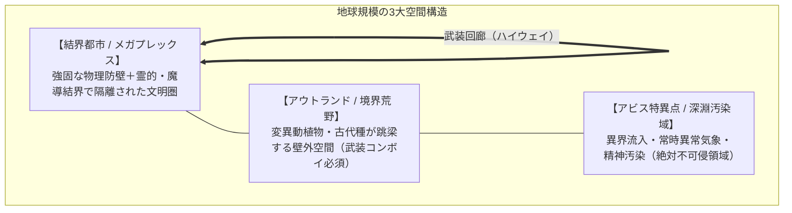
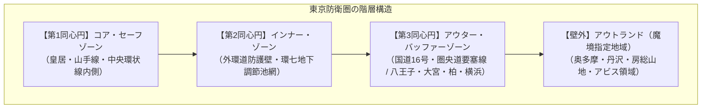
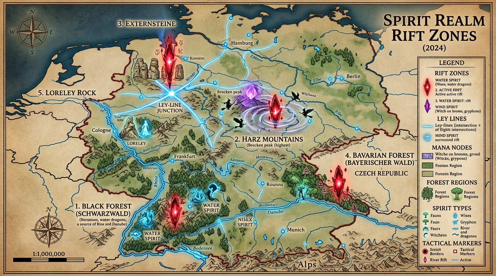

```mermaid
graph TD
    subgraph "北部・中央レイライン交差点"
        E["【③ エクスターンシュタイネ】<br>13本巨石砂岩柱・古代ゲルマン神域<br>（夏至祭に次元ゲート一時開口）"]
        B["【② ハルツ・ブロッケン山】<br>標高1,141m・ワルプルギスの夜<br>（風霊・夜想精霊・アストラル投影）"]
    end

    subgraph "西部水系・共鳴回廊"
        L["【⑤ ライン峡谷・ローレライ】<br>水霊（ウンディーネ・セイレーン）<br>（船舶ソナー・電磁センサー幻惑）"]
    end

    subgraph "南部・古代原生林保護区（精霊界最深聖域）"
        S["【① シュヴァルツヴァルト（黒い森）】<br>ムンメル湖・フェルトベルク<br>（朝露小精霊・木精・ドルイド第1保護区）"]
        W["【④ バイエルンの森（Bayerischer Wald）】<br>ドイツ・チェコ国境原生林<br>（地霊ノーム・古代獣霊・未踏査魔境）"]
    end

    subgraph "メガコーポ統治・結界都市網"
        BER["新ベルリン要塞都市"]
        FRA["フランクフルト魔導金融区"]
        MUN["ミュンヘン・サエデル研究拠点"]
    end

    E <==>|"地脈（エルベ＝ウェーザー線）"| B
    E <==>|"地脈（ライン北上線）"| L
    L <==>|"ライン川水霊回廊"| S
    S <==>|"ドナウ川上流地脈"| W
    B <==>|"中部マナグリッド"| FRA
    W <==>|"南東防衛ライン"| MUN
    B <==>|"東部回廊"| BER

    style S fill:#1c4532,stroke:#48bb78,stroke-width:3px;
    style B fill:#322659,stroke:#9f7aea,stroke-width:3px;
    style E fill:#742a2a,stroke:#e53e3e,stroke-width:3px;
    style W fill:#234e52,stroke:#38b2ac,stroke-width:2px;
    style L fill:#1a365d,stroke:#3182ce,stroke-width:2px;
    style BER fill:#1a202c,stroke:#718096,stroke-width:2px;
    style FRA fill:#1a202c,stroke:#718096,stroke-width:2px;
    style MUN fill:#1a202c,stroke:#718096,stroke-width:2px;
```

# 地理・環境設定資料 (Geographical & Environmental Division)

**主管部署**: 地理・環境調査部  
**準拠憲章**: `AGENTS.md` (結界都市・アウトランド・アビス特異点・完全並行世界)

---

## 1. 世界の地理構造（グローバル・ジオグラフィー）

2000年のミレニアム・アウェイクニング以降、地球上の地理区分は「**結界都市（セーフゾーン）**」「**アウトランド（魔境・荒野）**」「**アビス特異点（特異災害指定地域）**」の3領域に再編された。



### 1.1 世界の主要結界都市連合（メガプレックス）
- **北米メガプレックス（UCAS要塞都市連合）**: 
  - シアトル、ボストン、シカゴ等の多国籍メガコーポ（アレス、ボーイング等）本社要塞が立ち並ぶ巨大結界都市網。
  - **カスケード山脈アウトランド（レーニア山〜セント・ヘレンズ山）**: 風霊・雷霊マナストームが吹き荒れ、空の頂点捕食者【雷鳴グリフォン（Thunder Gryphon / Threat Level: III）】が支配する高危険空域。航空コンボイには20mm対空バルカン装備の重武装護衛機が必須。
- **欧州防護同盟（ユーロ・ウォール）**: ロンドン、新ベルリン、パリ。古代ドルイド結界と最先端魔導シールドを融合させた重装甲都市網。
- **東アジア要塞都市圏**: 新東京、上海防護区、ソウル要塞都市。高密度人口と高度情報インフラを多層防護壁で維持。

### 1.2 世界のグローバル・アビス特異点（特異災害指定地域）
世界各地の大断層・深海・秘境に発生した、異界生態系と高濃度マナの流出源。
1. **マリアナ海溝・深海大断層（Pacific Abyss Rift）**: 
   - 太平洋底1万メートルの裂け目。超巨大異界水棲種や古代海竜が湧出する最大の海洋特異点。太平洋航路は壊滅し、重武装潜水艦・護衛空母艦隊のみが航行可能。
2. **ツングースカ・シベリア断層（Tunguska Singularity）**: 
   - 永久凍土の崩壊とともに覚醒した古代氷結幻獣と極低温マナストームが吹き荒れる極北の死地。
3. **サハラ・ヴォイドゾーン（Sahara Void）**: 
   - 砂漠中央に生じた空間歪曲地帯。古代神性生物の残滓と死霊系魔獣が跳梁する。
4. **バミューダ・トライアングル次元歪曲海域**: 
   - 空間転送ゲート（Gate Spells現象）が自然発生し、航空機・船舶が別次元へ消失する立ち入り禁止海域。

---

## 2. 日本列島の全体構造

日本列島は、四方をアビス海洋に囲まれ、中央山脈が高濃度マナの発生源（アウトランド）となった要塞島国である。

| 地域区分 | 主要防衛拠点 | 特徴・魔境環境 |
| :--- | :--- | :--- |
| **関東防護圏** | 新東京多層要塞都市 | 政治・経済・魔導工学の中枢。国道16号・外環の多層同心円防衛。 |
| **関西結界圏** | 京都霊的絶対結界 / 大阪要塞港 | 京都は千年の風水・神社仏閣結界で守られた伝統術式の中枢。大阪は経済・重工業・湾岸防衛拠点。 |
| **極北・北海道圏** | 札幌要塞都市 / 知床大森林 | 知床・大雪山は古代覚醒種と巨大変異ヒグマが支配する原生魔境。 |
| **九州・南西諸島圏** | 福岡防衛特区 / 阿蘇マナ火山 | 阿蘇カルデラは国内最大級の地霊・火霊系マナ噴出孔。西日本防衛の最前線。 |

---

## 3. 首都圏・関東防護圏の地理構造（多層同心円要塞システム）

東京は、古代からの風水・霊的結界と、高速道路網を転用した物理防護壁（ウォール）が融合した「多層同心円要塞都市」として再編されている。



### 3.1 【第1同心円】コア・セーフゾーン（都心中枢結界区）
- **範囲**: 皇居を中心に、山手線および首都高中央環状線の内側（半径約8km圏）。千代田・中央・港・新宿・渋谷等。
- **特徴**: 徳川幕府以来の風水・霊的支柱（神田明神、日枝神社、明治神宮、増上寺等）に近代魔導結界発生機をリンクさせた**国内最高強度のセーフゾーン**。魔獣の侵入・発生率はほぼゼロ。
- **都市機能**: 国家中枢（霞が関・永田町）、メガコーポ本社街（丸の内・新宿・大手町）、魔導サイバー研究区（臨海副都心）。

### 3.2 【第2同心円】インナー・ゾーン（外環結界防護壁 / 外環ウォール）
- **範囲**: 東京外かく環状道路（外環道・半径約15km圏）に沿って建設された高さ10mのコンクリート・複合装甲防護壁。
- **特徴**: 一般市民の主要住宅地（練馬、杉並、世田谷、足立、葛飾、市川等）。検問ゲート（チェックポイント）が各高速・幹線道路に配置され、車両や物資の生体反応・マナ汚染を厳重スキャンする。
- **地下インフラの防衛利用**: 「神田川・環七地下調節池」などの地下治水空間は、地下水脈からの小型変異種の侵入を防ぐため、警視庁特科魔法隊とドローンによる常時哨戒網が敷かれている。

### 3.3 【第3同心円】アウター・バッファーゾーン（国道16号・圏央道要塞線）
- **範囲**: 国道16号（横浜〜八王子〜川越〜大宮〜春日部〜柏〜千葉）および圏央道（半径40〜60km圏）。
- **特徴**: かつての首都圏ベッドタウンが**「対魔獣前線補給基地・防衛要塞都市」**へと変貌。
  - **要塞都市・八王子**: 西部山岳地帯（奥多摩）からの魔獣進攻を阻止する陸上自衛隊・大型PMCの最前線基地。
  - **物流・取引拠点・大宮＆柏**: 壁外から帰還したプロハンターの拠点、素材解体場、闇市場が隣接。
  - **春日部・首都圏外郭放水路（地下要塞神殿）**: 国道16号地下50mの巨大調圧水槽は、利根川・江戸川水系の変異水棲魔獣の遡上を阻止する「対魔水門兼地下防衛要塞」として軍事利用。

- **奥多摩・秩父山岳魔境区**: 
  - 雲取山・奥多摩深部（Sector-A）から旧五日市街道廃墟群（Sector-B）にかけて、ニホンイノシシが急速変異した大型剛毛種（剛毛巌猪／Crag Boar等）や古代怪鳥が生息する高危険地帯。
  - 秋川渓谷・旧街道沿いが魔獣の採餌・突進回廊となっており、圏央道あきる野検問線および八王子前線要塞基地が直近の防衛・迎撃壁として機能している。
- **東京湾・海底断層特異点（アビス・ベイ）**: 東京湾口（浦賀水道付近）の海底に生じたマナ特異点。異界種や狂乱した変異サメ・深海甲殻類が出没。東京湾アクアラインは海上要塞化され、海堡（かいほう）とともに防衛ラインを形成。
- **富士山麓・青木ヶ原特異災害指定地域**: 国内最大級のアビス汚染域。空間の歪みと精神汚染（SAN値低下）を引き起こす異界生態系が流入する立ち入り禁止の絶対魔境。

---

## 4. 欧州・ドイツの精霊境界特異点ネットワーク (German Spirit Realm Zones)

ヨーロッパ中央部（ドイツ連邦共和国および周辺地域）は、西暦2000年のミレニアム・アウェイクニング以降、世界最大のメガコーポ**サエデル・シュティフトゥング（Saeder-Krupp / 黄金竜ロフヴィルCEO統括）**の重工業・電脳要塞都市網と、古来の自然信仰を継ぐ**ドルイド修道会（Druidic Circles）の聖域保護林**が共存・せめぎ合う独特の地脈構造を持つ。

```
【ドイツ・精霊界（フェイ・プレーン）境界特異点および地脈（レイライン）作戦図】
```


### 4.1 ドイツ国内の精霊境界作戦マップ（ASCII Cartographic Map）

```
                     【 北 海 (North Sea) 】                     【 バルト海 (Baltic Sea) 】
                                │                                           │
 ┌──────────────────────────────┼───────────────────────────────────────────┼──────────┐
 │                              ▼ [ハンブルク港要塞]                        ▼          │
 │                                                                                     │
 │  [北西部: トイトブルクの森]                                   [東部: 新ベルリン要塞都市]    │
 │  ┌─────────────────────────────────┐                         ┌───────────────────┐  │
 │  │ ★ ③ エクスターンシュタイネ      │═════════════════════════│ コア・セーフゾーン │  │
 │  │  - 13本の巨石砂岩柱            │      [エルベ川地脈]      │ サエデル本社ビル  │  │
 │  │  - 東西・南北レイライン交差点  │                         └─────────┬─────────┘  │
 │  └────────────────┬────────────────┘                                   │            │
 │                   │                                                   ▼            │
 │                   │ [ウェーザー川回廊]            [中部: ハルツ山地]                │
 │                   │                              ┌────────────────────────────────┐ │
 │                   │                              │ ★ ② ブロッケン山 (標高1,141m)  │ │
 │                   │                              │  - ワルプルギスの夜・風霊集結  │ │
 │                   │                              │  - アストラル幻象（幽霊現象）  │ │
 │                   │                              └────────────────┬───────────────┘ │
 │                   ▼                                               │                │
 │  [西部: ライン川峡谷]                                             │                │
 │  ┌─────────────────────────────────┐                             │ [ザーレ川地脈] │
 │  │ ★ ⑤ ローレライの岩            │                             │                │
 │  │  - 水霊（ウンディーネ/セイレーン）│                             │                │
 │  │  - 船舶センサー・ソナー幻惑海峡│                             ▼                │
 │  └────────────────┬────────────────┘                    [フランクフルト金融結界網]  │
 │                   │                                             │                  │
 │                   ▼ [ライン川本流]                              ▼ [マイン川回廊]   │
 │  [南西部: シュヴァルツヴァルト黒い森]                   [南東部: バイエルンの森]    │
 │  ┌─────────────────────────────────┐           ┌─────────────────────────────────┐ │
 │  │ ★ ① ムンメル湖・フェルトベルク │═══════════│ ★ ④ ベーマーヴァルト境界原生林 │ │
 │  │  - 朝露小精霊（デュー・スプライト）│ [ドナウ川地脈]│  - 中欧最大原生林・地霊ノーム群 │ │
 │  │  - ドルイド第1聖域・木精生息地  │           │  - 古代獣霊（ビーストスピリット）│ │
 │  └─────────────────────────────────┘           └─────────────────────────────────┘ │
 │                   │                                             │                  │
 │                   ▼ [ボーデン湖・ライン水源]                   ▼ [ミュンヘン要塞] │
 └───────────────────┼─────────────────────────────────────────────┼──────────────────┘
                     ▼                                             ▼
             【 スイス・アルプス連峰 】                    【 オーストリア国境 】
```



---

### 4.2 ドイツ5大精霊境界特異点の詳細

#### ① シュヴァルツヴァルト深部・ムンメル湖（Schwarzwald / Mummelsee）【南西部】
- **位置**: バーデン＝ヴュルテンベルク州（標高 1,036m〜1,493m フェルトベルク山塊）。
- **精霊界特性**: 水霊・木精（ドライアド）・朝露小精霊（デュー・スプライト）が最も密集する欧州最大の自然精霊聖域。湖水には「ムンメルゼーの湖人（水霊族）」が潜み、夜明け前には数千体の朝露小精霊が球状水滴形態で浮遊する。
- **統治・保護**: ドルイド修道会およびエルフ系フォレスト・レンジャーが常駐。サエデル・シュティフトゥングとの協定により、燃焼機関車輛の乗り入れが全面禁止されている。

#### ② ハルツ山地・ブロッケン山（Harz / Brocken & Hexentanzplatz）【中部】
- **位置**: ニーダーザクセン州／ザクセン＝アンハルト州境界（標高 1,141m）。
- **精霊界特性**: 北ドイツ最高峰であり、古来より「魔女と風精霊の集う山」として知られる。アストラル界との波長同調により、登山者の影が巨大な虹の光輪を纏って投影される「ブロッケン現象」が魔導光学的に多発。4月30日（ワルプルギスの夜）には大規模なアストラル共鳴嵐が発生する。
- **統治・警戒**: ドイツ連邦対魔特科隊およびサエデルの気象魔導観測所が山頂に配置され、暴走風霊の監視を行っている。

#### ③ エクスターンシュタイネ（Externsteine / トイトブルクの森）【北西部】
- **位置**: ノルトライン＝ヴェストファーレン州・ホルン＝バート・マインベルク。
- **精霊界特性**: トイトブルクの森から垂直に突き出た13本の巨大砂岩柱群。中欧を貫く東西レイラインと南北レイラインが交差する**「地脈のグランド・クロス（十字路）」**。夏至祭の正午、中央岩窟の祭壇において精霊界への一時的次元扉（フェイ・ポータル）が数十秒間開口する。
- **統治・儀式**: 欧州ドルイド修道会と新人類メイジ学会が共同で結界維持杭（マナ・アンカー）を管理。

#### ④ バイエルンの森・ベーマーヴァルト境界（Bayerischer Wald）【南東部】
- **位置**: バイエルン州・チェコ国境地帯（中央ヨーロッパ最大の古代原生林地帯）。
- **精霊界特性**: 手つかずの針葉樹原生林が広がり、地霊（ノーム、コボルト）や古代獣霊（ビーストスピリット）が物質界の変異生物（巨大狼、変異オオヤマネコ）と共生する高危険アウトランド。
- **産業・物流**: サエデル傘下の林業・鉱山PMCが武装コンボイで木材・鉱物を搬出する一方、深部は未踏査自然保護区に指定。

#### ⑤ ライン峡谷・ローレライの岩（Loreley / Middle Rhine Valley）【西部】
- **位置**: ラインラント＝プファルツ州・ザンクト・ゴアールスハウゼン近郊。
- **精霊界特性**: 水深25mの急流と高さ132mの玄武岩崖が織りなす音響反響地形。水霊（ウンディーネ）および音響精神体（セイレーン系音波霊）が常駐し、航行する貨物船のソナーやミリ波レーダーを生体電位共鳴で狂わせる。
- **防護対策**: ライン川航行コンボイには、三ツ菱＝サエデル製の「音波魔導キャンセラー装置」の搭載が義務付けられている。

