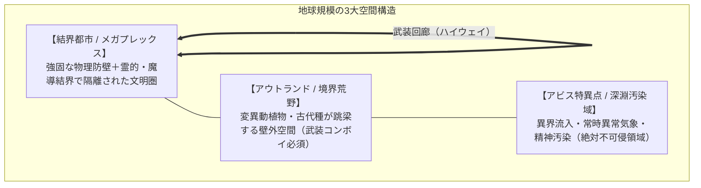
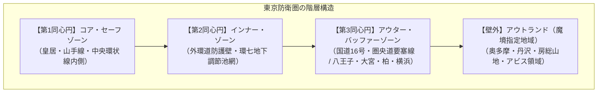

# 地理・環境設定資料 (Geographical & Environmental Division)

**主管部署**: 地理・環境調査部  
**準拠憲章**: `AGENTS.md` (結界都市・アウトランド・アビス特異点・完全並行世界)

---

## 1. 世界の地理構造（グローバル・ジオグラフィー）

2000年のミレニアム・アウェイクニング以降、地球上の地理区分は「**結界都市（セーフゾーン）**」「**アウトランド（魔境・荒野）**」「**アビス特異点（特異災害指定地域）**」の3領域に再編された。

### 1.1 世界の主要結界都市連合（メガプレックス）
- **北米メガプレックス（UCAS要塞都市連合）**: シアトル、ボストン、シカゴ。多国籍メガコーポの本社要塞が立ち並ぶサイバーパンク型巨大結界都市。
- **欧州防護同盟（ユーロ・ウォール）**: ロンドン、新ベルリン、パリ。古代ドルイド結界と最先端魔導シールドを融合させた重装甲都市網。
- **東アジア要塞都市圏**: 新東京、上海防護区、ソウル要塞都市。高密度人口と高度情報インフラを多層防護壁で維持。

### 1.2 世界のグローバル・アビス特異点（特異災害指定地域）
世界各地の大断層・深海・秘境に発生した、異界生態系と高濃度マナの流出源。
1. **マリアナ海溝・深海大断層（Pacific Abyss Rift）**: 
   - 太平洋底1万メートルの裂け目。超巨大異界水棲種や古代海竜が湧出する最大の海洋特異点。太平洋航路は壊滅し、重武装潜水艦・護衛空母艦隊のみが航行可能。
2. **ツングースカ・シベリア断層（Tunguska Singularity）**: 
   - 永久凍土の崩壊とともに覚醒した古代氷結幻獣と極低温マナストームが吹き荒れる極北の死地。
3. **サハラ・ヴォイドゾーン（Sahara Void）**: 
   - 砂漠中央に生じた空間歪曲地帯。古代神性生物の残滓と死霊系魔獣が跳梁する。
4. **バミューダ・トライアングル次元歪曲海域**: 
   - 空間転送ゲート（Gate Spells現象）が自然発生し、航空機・船舶が別次元へ消失する立ち入り禁止海域。

---

## 2. 日本列島の全体構造

日本列島は、四方をアビス海洋に囲まれ、中央山脈が高濃度マナの発生源（アウトランド）となった要塞島国である。

| 地域区分 | 主要防衛拠点 | 特徴・魔境環境 |
| :--- | :--- | :--- |
| **関東防護圏** | 新東京多層要塞都市 | 政治・経済・魔導工学の中枢。国道16号・外環の多層同心円防衛。 |
| **関西結界圏** | 京都霊的絶対結界 / 大阪要塞港 | 京都は千年の風水・神社仏閣結界で守られた伝統術式の中枢。大阪は経済・重工業・湾岸防衛拠点。 |
| **極北・北海道圏** | 札幌要塞都市 / 知床大森林 | 知床・大雪山は古代覚醒種と巨大変異ヒグマが支配する原生魔境。 |
| **九州・南西諸島圏** | 福岡防衛特区 / 阿蘇マナ火山 | 阿蘇カルデラは国内最大級の地霊・火霊系マナ噴出孔。西日本防衛の最前線。 |

---

## 3. 首都圏・関東防護圏の地理構造（多層同心円要塞システム）

東京は、古代からの風水・霊的結界と、高速道路網を転用した物理防護壁（ウォール）が融合した「多層同心円要塞都市」として再編されている。

### 3.1 【第1同心円】コア・セーフゾーン（都心中枢結界区）
- **範囲**: 皇居を中心に、山手線および首都高中央環状線の内側（半径約8km圏）。千代田・中央・港・新宿・渋谷等。
- **特徴**: 徳川幕府以来の風水・霊的支柱（神田明神、日枝神社、明治神宮、増上寺等）に近代魔導結界発生機をリンクさせた**国内最高強度のセーフゾーン**。魔獣の侵入・発生率はほぼゼロ。
- **都市機能**: 国家中枢（霞が関・永田町）、メガコーポ本社街（丸の内・新宿・大手町）、魔導サイバー研究区（臨海副都心）。

### 3.2 【第2同心円】インナー・ゾーン（外環結界防護壁 / 外環ウォール）
- **範囲**: 東京外かく環状道路（外環道・半径約15km圏）に沿って建設された高さ10mのコンクリート・複合装甲防護壁。
- **特徴**: 一般市民の主要住宅地（練馬、杉並、世田谷、足立、葛飾、市川等）。検問ゲート（チェックポイント）が各高速・幹線道路に配置され、車両や物資の生体反応・マナ汚染を厳重スキャンする。
- **地下インフラの防衛利用**: 「神田川・環七地下調節池」などの地下治水空間は、地下水脈からの小型変異種の侵入を防ぐため、警視庁特科魔法隊とドローンによる常時哨戒網が敷かれている。

### 3.3 【第3同心円】アウター・バッファーゾーン（国道16号・圏央道要塞線）
- **範囲**: 国道16号（横浜〜八王子〜川越〜大宮〜春日部〜柏〜千葉）および圏央道（半径40〜60km圏）。
- **特徴**: かつての首都圏ベッドタウンが**「対魔獣前線補給基地・防衛要塞都市」**へと変貌。
  - **要塞都市・八王子**: 西部山岳地帯（奥多摩）からの魔獣進攻を阻止する陸上自衛隊・大型PMCの最前線基地。
  - **物流・取引拠点・大宮＆柏**: 壁外から帰還したプロハンターの拠点、素材解体場、闇市場が隣接。
  - **春日部・首都圏外郭放水路（地下要塞神殿）**: 国道16号地下50mの巨大調圧水槽は、利根川・江戸川水系の変異水棲魔獣の遡上を阻止する「対魔水門兼地下防衛要塞」として軍事利用。

### 3.4 【壁外】アウトランド＆特異災害指定地域（魔境）
- **奥多摩・秩父山岳魔境区**: ニホンイノシシやニホンジカが急速変異した大型剛毛種（クラッグ・ボア等）や古代怪鳥が生息する高危険地帯。
- **東京湾・海底断層特異点（アビス・ベイ）**: 東京湾口（浦賀水道付近）の海底に生じたマナ特異点。異界種や狂乱した変異サメ・深海甲殻類が出没。東京湾アクアラインは海上要塞化され、海堡（かいほう）とともに防衛ラインを形成。
- **富士山麓・青木ヶ原特異災害指定地域**: 国内最大級のアビス汚染域。空間の歪みと精神汚染（SAN値低下）を引き起こす異界生態系が流入する立ち入り禁止の絶対魔境。
