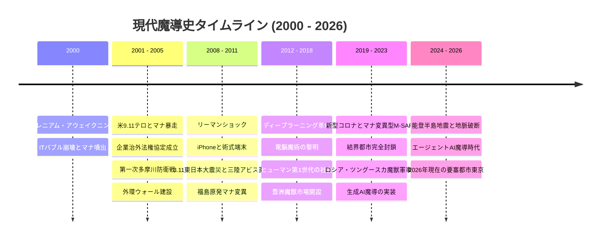

# 歴史・社会制度設定資料 (Historical & Social Division)

**主管部署**: 歴史・社会制度考証部  
**準拠憲章**: `AGENTS.md` (2000年〜2026年年表・メガコーポ治外法権・メタヒューマン社会史)

---

## 1. 現実史×マナ覚醒 包括年代記（2000年〜2026年）

本年表は、現実世界の重要事件（IT革命、9.11、3.11東日本大震災、AI進化、コロナ禍、ウクライナ情勢、日本列島の震災史）と、2000年のマナ覚醒・メタヒューマン・メガコーポの台頭を綿密に擦り合わせて構築された正史タイムラインである。



---

### 【年代別詳細クロニクル】

#### ■ 2000年〜2005年：覚醒の衝撃、9.11テロ、メガコーポ治外法権の誕生
- **2000年1月1日（ミレニアム・アウェイクニング）**:
  - 世界同時多発で高濃度マナが噴出。既存動植物の急速変異、古代種の目覚め、世界4大アビス特異点（マリアナ、ツングースカ等）が開口。
  - 人類にも遺伝子マナ変異が発生し、エルフやドワーフ等の特徴を持つ「新人類（メタヒューマン）」の新生児・急激変異者が世界中で誕生。
  - 日本国内では皇居および主要霊場が共鳴発光。奥多摩・丹沢でニホンイノシシが剛毛巌猪（クラッグ・ボア）等へ変異し首都圏にパニック。
- **2001年（米9.11テロと魔獣複合災害）**:
  - 同時多発テロの混乱に乗じ、各地でマナ特異点からの異界種流入やカルトによるアビス呪術テロが勃発。
  - 各国政府・軍隊が通常テロと魔獣災害の二重苦で統治麻痺に陥る中、軍需・民間警備企業（アレス等）や通信・IT企業（初期GAFAM・レンラク等）が防衛・インフラ復旧を代行。
- **2002年〜2004年（企業治外法権協定と外環ウォール建設）**:
  - 国連において「**超国家企業治外法権協定**」が成立。防衛とインフラを担う多国籍メガコーポに私兵軍（PMC）保有権と領土内法執行権が承認される。
  - 日本では奥多摩から多摩川沿いに南下した変異大型魔獣群に対し、陸上自衛隊（普通科）と神社仏閣の神職・山伏が混成防衛（**第一次多摩川防衛戦**）。日本政府は「首都防護緊急計画」を発令し、外環道に沿って高さ10mのコンクリート防護壁（外環ウォール）を建設開始。

#### ■ 2008年〜2011年：リーマンショック、3.11東日本大震災と「地脈破断」
- **2008年（リーマン・ショックとスマートフォンの魔導化）**:
  - 世界金融危機の中、魔獣素材・新エネルギーを握るメガコーポが既存金融機関を救済・買収して経済の絶対覇権を確立。
  - iPhone発売を契機に、理論魔導（メイジ）の術式展開を補助する携帯演算アプリ（初期の術式フォーミュラOS）が開発され始める。
- **2011年3月11日（東日本大震災・三陸アビス大断層と福島放射性マナ特異点）**:
  - マグニチュード9.0の超巨大地震に伴い、日本列島を支える地脈（レイライン）が太平洋プレート境界で大断裂。
  - 三陸沖海底に「三陸アビス海溝断層」が開口し、巨大津波とともに深海異界魔獣が東北沿岸へ遡上。
  - **福島第一原発とマナの複合汚染**: 高濃度放射性物質と漏出マナが融合し、帰還困難区域は「**放射性マナ変異区域（特異災害地域）**」に指定。耐放射線性を持つ異形変異種が誕生し、自衛隊と専門魔法部隊による恒久封鎖線が敷かれた。
  - **日本の地脈工学の確立**: この震災を機に、古代神道の「要石（かなめいし）信仰」とヤマト重工の近代土木工学が融合。全国の断層帯に人工地脈安定杭（マナ・アンカー）を打ち込む国家防災計画が始動。

#### ■ 2012年〜2018年：ディープラーニングAI革命、新人類社会進出、豊洲市場開設
- **2012年〜2015年（AIによる魔導数理革命と電脳魔術の誕生）**:
  - ディープラーニング（深層学習）の飛躍により、不可知とされていたマナの生体波長パターンがAI解析可能になる。
  - 三ツ菱マナテックやレンラクが「AI魔導演算チップ」を開発。術者の脳波を介して電子機器に介入する**電脳魔術（サイバー・ソーサリー）**の基礎理論が確立。
  - **新人類（メタヒューマン）第1世代の成人**: 2000年生まれのメタヒューマンが社会へ進出。SNS上で種族ヘイトや差別デモが激化。日本では2010年「新人類基本法」が制定され、魔力適性者IDの常時携帯義務と監視体制が敷かれた。
- **2016年〜2018年（国道16号要塞線完成と豊洲市場開設）**:
  - 首都圏外郭防衛線（国道16号・圏央道）が完成し、八王子・大宮が前線要塞都市化。春日部の首都圏外郭放水路が対魔水門として軍事転用。
  - 2018年、豊洲エリアに「**豊洲・新中央魔獣市場**」が開設。国際基準（Class-A/B/C 三段階分類）に基づく魔獣肉・素材の安全流通システムが本格稼働。

#### ■ 2019年〜2023年：コロナ禍（変異型M-SARS）、ウクライナ危機、結界都市の固定化
- **2019年〜2021年（新型コロナ×マナ変異型M-SARSパンデミック）**:
  - アウトランドの変異コウモリ・齧歯類から流出したマナ変異型ウイルス（M-SARS）が世界で大流行。
  - 一般市民だけでなく、エルフやドワーフにも特有の生体変異ショックを引き起こす。
  - **結界都市の不可逆的固定化**: 世界中の結界都市で「外壁検問ゲートのバイオ・マナスキャン義務化」と厳重なロックダウンが実施。東京の外環ウォールも完全閉鎖ゲート化され、平時と魔境の空間的分断が市民の日常として固定化された。
- **2022年〜2023年（ロシア・ウクライナ戦争とツングースカ魔獣軍事化、ChatGPT革命）**:
  - ロシアが「シベリア・ツングースカ断層」の古代氷結魔獣や極低温マナ資源を兵器化し東欧戦線へ投入。西側メガコーポ（アレス等）の重装甲PMC部隊と激しい消耗戦が勃発。
  - **生成AI×魔導コード（LLM術式展開）**: ChatGPT等の生成AIが爆発的普及。難解な術式コードを自然言語でリアルタイム構築・補正する「AIコンパニオン魔導端末」が一般メイジ・軍隊に普及。

#### ■ 2024年〜2026年（現代）：能登半島地震、エージェントAI魔導、新東京の現在
- **2024年（能登半島地震と局所アビス封じ込め）**:
  - 能登半島で震度7の地震が発生。局所的な地脈断裂により地下の古代地霊魔獣が一時覚醒。自衛隊第1対魔特科群と民間ハンターが即時展開し、ヤマト重工の移動式結界杭によって封鎖成功。
- **2026年（現代）**:
  - 覚醒から26年。結界都市東京の内側では、高度AI・電脳魔術・サイバーインフラが織りなすハイテクな日常が営まれる一方、外環・16号線の外側には過酷なアウトランドとアビス領域が広がる。
  - 市民は豊洲経由の魔獣ジビエを口にし、湾岸スラムではメタヒューマンが差別と貧困に抗いながら生きる、現代魔導社会の均衡が定着している。

---

## 2. メガコーポ（超国家企業体）の産業支配構造

### 2.1 世界のメガコーポ（GLOBAL BIG 5）
2002年の国連協定により治外法権（自前軍隊・領土・法執行権）を獲得した多国籍コングロマリット。
1. **アレス・マクロテクノロジー（Ares Macrotechnology / 米）**: 
   - 9.11以降の対テロ・魔獣軍需で急成長。重火器（12.7mm・機関砲）、対魔装甲車、大型PMC「ナイトズ」を保有する軍事・防衛の絶対王者。
2. **アズテクノロジー（Aztechnology / 中南米）**: 
   - 生体バイオ、食品流通、農業マナ肥料の巨人。裏で中南米の古代血脈呪術や非人道的人体実験を行う黒い噂が絶えない。
3. **サエデル・シュティフトゥング（Saeder-Krupp / 独）**: 
   - 覚醒した黄金竜ロフヴィルがCEOを務める重工業・エネルギー・素材の超巨大企業。欧州防護壁（ユーロ・ウォール）の建材を独占。
4. **レンラク・コンピュータ・システムズ（Renraku / 日系多国籍）**: 
   - GAFAMを統合・再編したサイバー魔導の巨人。電脳魔術AI、サイバーマナインターフェース、AI魔導OSの特許を寡占。
5. **ヤマト・インダストリアル（Yamato Industrial Group / 日本）**: 
   - 結界インフラ・防護壁建材・自衛隊防衛装備・都市風水地脈工学の独占体。

### 2.2 日本国内のメガコーポと産業構造
| 企業名 | 主要事業・管轄分野 | 世界観における役割・暗部 |
| :--- | :--- | :--- |
| **ヤマト重工 (Yamato Heavy Industries)** | 首都防護壁・防護ゲート施工、対魔装甲車・車載12.7mmシステム、地脈安定杭（マナ・アンカー）。 | 結界都市の物理的「壁」と地脈インフラを牛耳る防衛の覇者。政府予算の最大受注先。 |
| **テイコク製薬・バイオ (Teikoku Bio-Pharm)** | 魔獣生体組織由来の新薬開発、生体マナ安定剤、M-SARS特効ワクチン、メタヒューマン抑制薬。 | 表向きは医療のパイオニアだが、裏で新人類や変異者を対象とした極秘の生体キメラ・人体実験を遂行。 |
| **三ツ菱マナテック (Mitsubishi ManaTech)** | 理論メイジ用AI演算端末、電脳魔術防壁、警察・自衛隊向け魔導アビオニクス。 | 理論魔導士の育成アカデミーを運営。生成AI魔導フォーミュラの国内特許を独占。 |
| **豊洲中央流通ホールディングス** | Class-A/B魔獣肉、剛毛・外殻素材の全国流通網、認可解体センター（八王子・大宮）の運営。 | 日本全国の魔獣ジビエ・素材相場を統制する流通コングロマリット。 |

---

## 3. 地震大国日本と「地脈（レイライン）・風水工学」の歴史

日本列島は4つのプレートがひしめく世界有数の変動帯であり、マナ覚醒以降、**「地震＝大地のマナの激震（地脈破断）」**として国家安全保障の最重要課題となった。

```
【日本の対震・対魔防衛システム】
 [地下深部プレート断層] ── (地震・地脈破断) ──> [高濃度地霊マナ噴出・古代種覚醒]
                                                       │
                                                       ▼
 [ヤマト重工製 人工地脈安定杭 (マナ・アンカー)] ──> [鹿島・皇居・富士を結ぶ風水結界網で減衰・封じ込め]
```

1. **要石信仰と近代地脈工学**: 
   - 鹿島神宮・香取神宮の要石伝説に基づき、全国の主要断層（中央構造線、糸魚川-静岡構造線等）に巨大な人工マナ・アンカーを埋設。
2. **皇居・都心風水結界網のハイブリッド化**: 
   - 江戸城以来の風水ライン（富士山〜秩父〜皇居〜日光）に、三ツ菱マナテックのAI魔導励起装置をリンクさせ、首都直下地震時の魔獣暴走を抑止する常時結界を維持。

---

## 4. 新人類（メタヒューマン）の歴史と日本社会の動態

### 4.1 メタヒューマンの分類と生体特異性
2000年のマナ覚醒以降、人間（ホモ・サピエンス）の高濃度マナ被曝または遺伝子変異によって誕生した変異人類種。
- **エルフ系（ホモ・サピエンス・ノビリス）**: 尖った耳、高いマナ親和性と魔術適性、長寿傾向。メガコーポの魔導アナリストや政財界に進出する者が多い一方、選民思想や排他性が警戒される。
- **ドワーフ系（ホモ・サピエンス・プミルス）**: 小柄ながら強靭な筋骨、高い生体毒耐性・魔力抵抗、精密作業適性。重工業、魔獣解体、精密機器製造で重宝される。
- **変異形質種（角・強靭骨格・トロール/オルク系変異）**: 巨体、異常筋力、皮膚の硬質化。軍事PMCや前線ハンターとして高い戦闘力を誇るが、外見の異形性から激しい偏見・差別に晒される。

### 4.2 日本におけるメタヒューマンの歴史・法的地位の変遷
- **2000年代前半（発症パニックと強制隔離期）**: 覚醒初期、変異者は「未知のマナ感染症」と誤認され、国立感染症研究所等で強制隔離・人権侵害が横行した。
- **2010年（新人類基本法と「魔力適性者登録制度」）**: 人権は法的に保障されたものの、公安・警察による「魔力適性者ID」の常時携帯が義務付けられ、潜在的危険人物としての監視下に置かれた。
- **2015年〜現在（居住区の分断とスラム化）**: 結界都市東京の内側であっても、湾岸埋立地（夢の島・有明スラム）や城東地区にメタヒューマン集住地区（サブディストリクト）が形成。一般市民からの差別感情、就職差別が根強く、危険な壁外アウトランドでのPMC戦闘員や素材密猟者に身を投じる者が多い。
