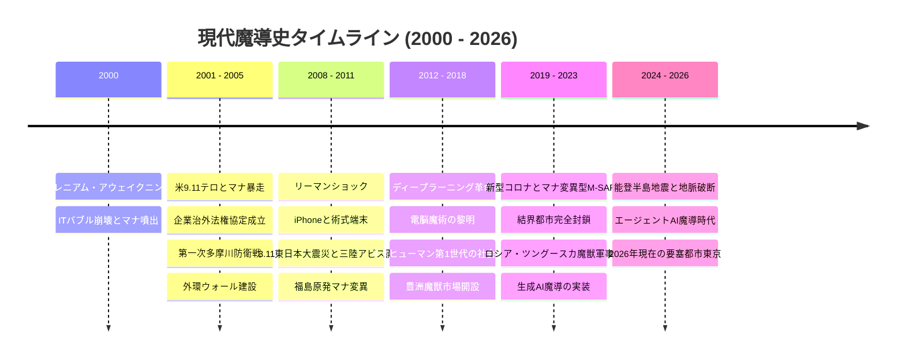
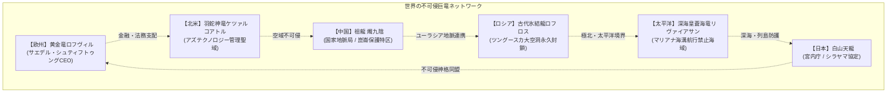

# 歴史・社会制度設定資料 (Historical & Social Division)

**主管部署**: 歴史・社会制度考証部  
**準拠憲章**: `AGENTS.md` (2000年〜2026年年表・メガコーポ治外法権・メタヒューマン社会史)

---

## 1. 現実史×マナ覚醒 包括年代記（2000年〜2026年）

本年表は、現実世界の重要事件（IT革命、9.11、3.11東日本大震災、AI進化、コロナ禍、ウクライナ情勢、日本列島の震災史）と、2000年のマナ覚醒・メタヒューマン・メガコーポの台頭を綿密に擦り合わせて構築された正史タイムラインである。



---

### 【年代別詳細クロニクル】

#### ■ 2000年〜2005年：覚醒の衝撃、9.11テロ、巨竜出現とメガコーポ治外法権の誕生
- **2000年1月1日（ミレニアム・アウェイクニング初動史）** [詳細: `world/history/stories/2000_awakening/`, `world/history/stories/great_dragons/`]:
  - **1月1日（Y2K危機と生体媒介原則の確立 / STO-01）**: 世界中で懸念された電子インフラの崩壊（Y2K）が起きなかった裏で、生体神経系・魂のみに霊的狂乱波が直撃。内閣安全保障室（桂木謙三審議官）は正常稼働する通信網を駆使して自衛隊・警察の超法規的出動を指示。「マナは電子回路と非干渉であり生体組織にのみ作用する」という憲章1.2原則が世界で初めて確定され、皇居臨時結界（第1同心円構想）が発動。
  - **1月1日（崑崙の祖龍 燭九陰の極夜覚醒と中国地脈局設立 / STO-03）**: チベット高原・崑崙山脈断層から古代祖龍・燭九陰が覚醒し、西域全域を極夜と猛烈なブリザードで閉鎖。軍部の核攻撃計画を張徳明技監が阻止し、中国政府は「天道自然保護特区」と「国家地脈局」を創設して地脈不可侵体制を確立。
  - **1月1日（霊峰白山天龍降臨とシラヤマ協定 / STO-06）**: 霊峰白山山頂に白銀の白山天龍が降臨。宮内庁掌典長・鷹司兼嗣が神祇対話を交わし、自衛隊・米軍機の飛行禁止と特別保護区指定を条件とする国家秘匿協定「シラヤマ協定」が成立。
  - **3月31日（有珠山噴火と通常兵器弾道力学の実証 / STO-02）**: 有珠山噴火に伴い火口地下空洞から高熱爬虫類変異種（ヨウガンヒトカゲ近縁種）が出現。第7師団対戦車小隊（坂東3曹）が89式5.56mm小銃の徹甲弾および84mm無反動砲（カール・グスタフ）を集中斉射し、物理運動エネルギーで怪異を破砕・撃破。「魔獣に対しても現代通常火器が有効」という憲章1.3原則が実証される。
  - **6月26日（ヒトゲノムドラフト宣言と新人類M-コドン特許 / STO-03）**: 国際ヒトゲノム計画の裏で、ミレニアム以降の新生児および一部成人の第23染色体に未知のマナ受容塩基対（M-コドン）が特定される。テイコク製薬（桐生晶主任）が世界に先駆けて産業特許を出願・囲い込み、新人類（メタヒューマン）管理制度と社会的差別の端緒となる。
  - **8月12日（露原潜クルスク沈没とツングースカ氷結龍ロフロス / STO-04）**: バレンツ海海底大断層にアビス特異点が開口し露原潜クルスク沈没。同時にシベリア・ツングースカ大空洞特異点から古代氷結龍ロフロスが活動を活発化。ロシア軍爆撃機編隊の巡航ミサイル斉射が半径50kmの絶対零度結界により分子運動ごと凍結・粉砕され、シベリア中央部4万平方キロの永久不可侵魔境化が決定。
  - 人類にも遺伝子マナ変異が発生し、エルフやドワーフ等の特徴を持つ「新人類（メタヒューマン）」の新生児・急激変異者が世界中で誕生。
  - 日本国内では皇居および主要霊場が共鳴発光。奥多摩・丹沢でニホンイノシシが剛毛巌猪（クラッグ・ボア）等へ変異し首都圏にパニック。
- **2001年（米9.11テロと羽蛇神竜ケツァルコアトルの米空軍制圧 / STO-02）**:
  - 同時多発テロの混乱下、コロラド高原断層から羽蛇神竜ケツァルコアトルが覚醒。米空軍F-22迎撃編隊のAIM-120誘導ミサイルが超臨界プラズマ熱波により空中自爆、全機アビオニクス停止で惨敗。国防総省はコード「フェザーサン」を発令し、急成長中のメガコーポ「アズテクノロジー」へ聖域管理権を委譲。
  - 各地でマナ特異点からの異界種流入やカルトによるアビス呪術テロが勃発。各国政府・軍隊が通常テロと魔獣災害の二重苦で統治麻痺に陥る中、軍需・民間警備企業（アレス等）や通信・IT企業（レンラク等）が防衛・インフラ復旧を代行。
- **2002年〜2004年（企業治外法権協定とスマトラ沖地震・深海皇蒼海竜リヴァイアサン浮上 / STO-05）**:
  - 2002年、国連において「**超国家企業治外法権協定**」が成立。多国籍メガコーポに私兵軍（PMC）保有権と領土内法執行権が承認される。
  - 2004年12月26日のスマトラ島沖超巨大地震（M9.3）に連動し、マリアナ海溝大断層アビスから全長200mの蒼海竜リヴァイアサンが浮上。8Hzの生体超低周波インフラサウンドにより米第7艦隊（空母キティホーク）の乗員が急性精神錯乱に倒れ戦闘不能に。国際海事機関（IMO）によりマリアナ海溝半径300海里が「永久航行禁止海域」に指定。
  - 日本では奥多摩から多摩川沿いに南下した変異大型魔獣群に対し、陸上自衛隊（普通科）と神社仏閣の神職・山伏が混成防衛（**第一次多摩川防衛戦**）。日本政府は「首都防護緊急計画」を発令し、外環道に沿って高さ10mのコンクリート防護壁（外環ウォール）を建設開始。

#### ■ 2008年〜2011年：リーマンショックと黄金竜ロフヴィル、3.11東日本大震災と「地脈破断」
- **2008年（リーマン・ショックと黄金竜ロフヴィルの資本掌握 / STO-01）**:
  - リーマン・ブラザーズ破綻に伴う世界金融危機の中、アルプス地下に潜んでいた黄金竜ロフヴィルが数百トンのバイオゴールド結晶を現物担保としてフランクフルト市場に投入。欧州重工業・素材・魔導部門の全株を買い叩き、超国家メガコーポ「サエデル・シュティフトゥング」を設立して自らCEOに君臨。武力ではなく金融資本と特許による世界支配モデルを確立。
  - iPhone発売を契機に、理論魔導（メイジ）の術式展開を補助する携帯演算アプリ（初期の術式フォーミュラOS）が開発され始める。
- **2011年3月11日（東日本大震災・三陸アビス大断層と福島放射性マナ特異点）**:
  - マグニチュード9.0の超巨大地震に伴い、日本列島を支える地脈（レイライン）が太平洋プレート境界で大断裂。
  - 三陸沖海底に「三陸アビス海溝断層」が開口し、巨大津波とともに深海異界魔獣が東北沿岸へ遡上。
  - **福島第一原発とマナの複合汚染**: 高濃度放射性物質と漏出マナが融合し、帰還困難区域は「**放射性マナ変異区域（特異災害地域）**」に指定。耐放射線性を持つ異形変異種が誕生し、自衛隊と専門魔法部隊による恒久封鎖線が敷かれた。
  - **日本の地脈工学の確立**: この震災を機に、古代神道の「要石（かなめいし）信仰」とヤマト重工の近代土木工学が融合。全国の断層帯に人工地脈安定杭（マナ・アンカー）を打ち込む国家防災計画が始動。

#### ■ 2012年〜2018年：ディープラーニングAI革命、新人類社会進出、豊洲市場開設
- **2012年〜2015年（AIによる魔導数理革命と電脳魔術の誕生）**:
  - ディープラーニング（深層学習）の飛躍により、不可知とされていたマナの生体波長パターンがAI解析可能になる。
  - 三ツ菱マナテックやレンラクが「AI魔導演算チップ」を開発。術者の脳波を介して電子機器に介入する**電脳魔術（サイバー・ソーサリー）**の基礎理論が確立。
  - **新人類（メタヒューマン）第1世代の成人**: 2000年生まれのメタヒューマンが社会へ進出。SNS上で種族ヘイトや差別デモが激化。日本では2010年「新人類基本法」が制定され、魔力適性者IDの常時携帯義務と監視体制が敷かれた。
- **2016年〜2018年（国道16号要塞線完成と豊洲市場開設）**:
  - 首都圏外郭防衛線（国道16号・圏央道）が完成し、八王子・大宮が前線要塞都市化。春日部の首都圏外郭放水路が対魔水門として軍事転用。
  - 2018年、豊洲エリアに「**豊洲・新中央魔獣市場**」が開設。国際基準（Class-A/B/C 三段階分類）に基づく魔獣肉・素材の安全流通システムが本格稼働。

#### ■ 2019年〜2023年：コロナ禍（変異型M-SARS）、ウクライナ危機、結界都市の固定化
- **2019年〜2021年（新型コロナ×マナ変異型M-SARSパンデミック）**:
  - アウトランドの変異コウモリ・齧歯類から流出したマナ変異型ウイルス（M-SARS）が世界で大流行。
  - 一般市民だけでなく、エルフやドワーフにも特有の生体変異ショックを引き起こす。
  - **結界都市の不可逆的固定化**: 世界中の結界都市で「外壁検問ゲートのバイオ・マナスキャン義務化」と厳重なロックダウンが実施。東京の外環ウォールも完全閉鎖ゲート化され、平時と魔境の空間的分断が市民の日常として固定化された。
- **2022年〜2023年（ロシア・ウクライナ戦争とツングースカ魔獣軍事化、ChatGPT革命）**:
  - ロシアが「シベリア・ツングースカ断層」の古代氷結魔獣や極低温マナ資源を兵器化し東欧戦線へ投入。西側メガコーポ（アレス等）の重装甲PMC部隊と激しい消耗戦が勃発。
  - **生成AI×魔導コード（LLM術式展開）**: ChatGPT等の生成AIが爆発的普及。難解な術式コードを自然言語でリアルタイム構築・補正する「AIコンパニオン魔導端末」が一般メイジ・軍隊に普及。

#### ■ 2024年〜2026年（現代）：能登半島地震、エージェントAI魔導、新東京の現在
- **2024年（能登半島地震と局所アビス封じ込め）**:
  - 能登半島で震度7の地震が発生。局所的な地脈断裂により地下の古代地霊魔獣が一時覚醒。自衛隊第1対魔特科群と民間ハンターが即時展開し、ヤマト重工の移動式結界杭によって封鎖成功。
- **2026年（現代）**:
  - 覚醒から26年。結界都市東京の内側では、高度AI・電脳魔術・サイバーインフラが織りなすハイテクな日常が営まれる一方、外環・16号線の外側には過酷なアウトランドとアビス領域が広がる。
  - 市民は豊洲経由の魔獣ジビエを口にし、湾岸スラムではメタヒューマンが差別と貧困に抗いながら生きる、現代魔導社会の均衡が定着している。

---

## 2. メガコーポ（超国家企業体）の産業支配構造

### 2.1 世界のメガコーポ（GLOBAL BIG 5）
2002年の国連協定により治外法権（自前軍隊・領土・法執行権）を獲得した多国籍コングロマリット。
1. **アレス・マクロテクノロジー（Ares Macrotechnology / 米）**: 
   - 9.11以降の対テロ・魔獣軍需で急成長。重火器（12.7mm・機関砲）、対魔装甲車、大型PMC「ナイトズ」を保有する軍事・防衛の絶対王者。
2. **アズテクノロジー（Aztechnology / 中南米）**: 
   - 生体バイオ、食品流通、農業マナ肥料の巨人。裏で中南米の古代血脈呪術や非人道的人体実験を行う黒い噂が絶えない。
3. **サエデル・シュティフトゥング（Saeder-Krupp / 独）**: 
   - 覚醒した黄金竜ロフヴィルがCEOを務める重工業・エネルギー・素材の超巨大企業。欧州防護壁（ユーロ・ウォール）の建材を独占。
4. **レンラク・コンピュータ・システムズ（Renraku / 日系多国籍）**: 
   - GAFAMを統合・再編したサイバー魔導の巨人。電脳魔術AI、サイバーマナインターフェース、AI魔導OSの特許を寡占。
5. **ヤマト・インダストリアル（Yamato Industrial Group / 日本）**: 
   - 結界インフラ・防護壁建材・自衛隊防衛装備・都市風水地脈工学の独占体。

### 2.2 日本国内のメガコーポと産業構造
| 企業名 | 主要事業・管轄分野 | 世界観における役割・暗部 |
| :--- | :--- | :--- |
| **ヤマト重工 (Yamato Heavy Industries)** | 首都防護壁・防護ゲート施工、対魔装甲車・車載12.7mmシステム、地脈安定杭（マナ・アンカー）。 | 結界都市の物理的「壁」と地脈インフラを牛耳る防衛の覇者。政府予算の最大受注先。 |
| **テイコク製薬・バイオ (Teikoku Bio-Pharm)** | 魔獣生体組織由来の新薬開発、生体マナ安定剤、M-SARS特効ワクチン、メタヒューマン抑制薬。 | 表向きは医療のパイオニアだが、裏で新人類や変異者を対象とした極秘の生体キメラ・人体実験を遂行。 |
| **三ツ菱マナテック (Mitsubishi ManaTech)** | 理論メイジ用AI演算端末、電脳魔術防壁、警察・自衛隊向け魔導アビオニクス。 | 理論魔導士の育成アカデミーを運営。生成AI魔導フォーミュラの国内特許を独占。 |
| **豊洲中央流通ホールディングス** | Class-A/B魔獣肉、剛毛・外殻素材の全国流通網、認可解体センター（八王子・大宮）の運営。 | 日本全国の魔獣ジビエ・素材相場を統制する流通コングロマリット。 |

---

## 3. 地震大国日本と「地脈（レイライン）・風水工学」の歴史

日本列島は4つのプレートがひしめく世界有数の変動帯であり、マナ覚醒以降、**「地震＝大地のマナの激震（地脈破断）」**として国家安全保障の最重要課題となった。

```
【日本の対震・対魔防衛システム】
 [地下深部プレート断層] ── (地震・地脈破断) ──> [高濃度地霊マナ噴出・古代種覚醒]
                                                       │
                                                       ▼
 [ヤマト重工製 人工地脈安定杭 (マナ・アンカー)] ──> [鹿島・皇居・富士を結ぶ風水結界網で減衰・封じ込め]
```

1. **要石信仰と近代地脈工学**: 
   - 鹿島神宮・香取神宮の要石伝説に基づき、全国の主要断層（中央構造線、糸魚川-静岡構造線等）に巨大な人工マナ・アンカーを埋設。
2. **皇居・都心風水結界網のハイブリッド化**: 
   - 江戸城以来の風水ライン（富士山〜秩父〜皇居〜日光）に、三ツ菱マナテックのAI魔導励起装置をリンクさせ、首都直下地震時の魔獣暴走を抑止する常時結界を維持。

---

## 4. 新人類（メタヒューマン）の歴史と日本社会の動態

### 4.1 メタヒューマンの分類と生体特異性
2000年のマナ覚醒以降、人間（ホモ・サピエンス）の高濃度マナ被曝または遺伝子変異によって誕生した変異人類種。
- **エルフ系（ホモ・サピエンス・ノビリス）**: 尖った耳、高いマナ親和性と魔術適性、長寿傾向。メガコーポの魔導アナリストや政財界に進出する者が多い一方、選民思想や排他性が警戒される。
- **ドワーフ系（ホモ・サピエンス・プミルス）**: 小柄ながら強靭な筋骨、高い生体毒耐性・魔力抵抗、精密作業適性。重工業、魔獣解体、精密機器製造で重宝される。
- **変異形質種（角・強靭骨格・トロール/オルク系変異）**: 巨体、異常筋力、皮膚の硬質化。軍事PMCや前線ハンターとして高い戦闘力を誇るが、外見の異形性から激しい偏見・差別に晒される。

### 4.2 日本におけるメタヒューマンの歴史・法的地位の変遷
- **2000年代前半（発症パニックと強制隔離期）**: 覚醒初期、変異者は「未知のマナ感染症」と誤認され、国立感染症研究所等で強制隔離・人権侵害が横行した。
- **2015年〜現在（居住区の分断とスラム化）**: 結界都市東京の内側であっても、湾岸埋立地（夢の島・有明スラム）や城東地区にメタヒューマン集住地区（サブディストリクト）が形成。一般市民からの差別感情、就職差別が根強く、危険な壁外アウトランドでのPMC戦闘員や素材密猟者に身を投じる者が多い。

---

## 5. 欧州精霊保護史と精霊界流入種（朝露小精霊の歴史）

### 5.1 精霊界（フェイ・プレーン）からの越境と定着（2000年〜2008年）
- **2000年（ミレニアム・アウェイクニングと次元境界希薄化）**:
  - マナ覚醒時、ドイツのシュヴァルツヴァルト（黒い森）やフランスのブロセリアンド樹林などの欧州深部原生林において、高次元「精霊界（フェイ・プレーン）」との境界が局所的に融解。
  - 朝露小精霊（デュー・スプライト）をはじめとする微小自然精霊が物質界へ越境。森林の豊かな植物蒸散水分および朝霧の物理的結露マナと共生代謝を確立し、定着した。
- **2001年〜2007年（「森の真珠」乱獲と密閉死の悲劇）**:
  - 滴下する朝露に驚異的な滋養強壮・美肌効果があることが判明し、初期の密猟ブローカーが殺到。
  - ガラス瓶等に捕獲された精霊が「生きた森林の蒸散循環」を断たれて数時間で乾燥死・霧散する事態が多発。
  - ハイデルベルク大学魔導生物学部等により、人工飼育不能性と森林生態系との共生代謝メカニズムが立証された。

### 5.2 ベルリン協定とドルイド修道会の聖域統治（2009年〜2018年）
- **2010年（ベルリン精霊界生物保護協定の締結）**:
  - EUおよび欧州メガコーポ同盟は、原生林マナ枯渇を防ぐため朝露小精霊を「国際最優先保護種（Threat Level: I / Class-A非破壊採取対象）」に指定。捕獲・殺傷・密輸を国際重罪化。
- **ドルイド修道会と新人類エルフの管理体制**:
  - ケルト・ゲルマンの伝統信仰を継ぐドルイド修道会とエルフ系メタヒューマンが公式保護官（フォレスト・レンジャー）に就任。
  - 夜明けの舞踏後に葉上に残された分泌液「朝露エキス（Dewdrop Nectar）」のみを極細ガラスピペットで回収する「非破壊採取法」が法制化・標準化された。

### 5.3 M-SARSパンデミックの救世主とメガコーポ経済（2019年〜2026年現代）
- **2019年〜2021年（マナ変異型M-SARSパンデミックでの特効薬化）**:
  - アウトランド流出ウイルス（M-SARS）による重篤な肺胞マナ汚染・線維化に対し、朝露エキスの水霊系《清浄化》《小治癒》成分が劇的な治療効果を示すことが判明。
  - サエデル・シュティフトゥング（Saeder-Krupp）およびテイコク製薬が欧州保護林の環境保全ファンドへ巨額投資を実施。
- **2026年（現代における共生と産業利用）**:
  - 朝露小精霊のコロニー規模が大気・マナ純度を測る絶対的「環境指標生物」として定着。
  - 回収された朝露エキスはアビス精神汚染治療薬・高級皮膚再生液として流通し、脱皮水膜は最先端電脳魔導スコープの超解像度コーティング剤として欧州ハイテク産業を支えている。

---

## 6. 世界5大列強巨竜（高知能竜種）の不可侵史と地政学

本章は、最上位憲章 1.3「高知能竜種（ドラゴン）・神性存在への絶対不可侵・天災指定」に基づき、ミレニアム・アウェイクニング以降に覚醒・顕現した世界の超越種巨竜と、各大国・メガコーポの主権妥協史を体系化した正史記録である（AIDLC詳細記録: `world/history/stories/great_dragons/`）。



### 6.1 世界6大巨竜の生態・地脈・不可侵体制一覧

| 地域・管轄 | 巨竜の尊称・学名 | 主たる生息域・地脈特異点 | 顕現トリガー・軍事対峙 | 不可侵協定・現代の統治形態 |
| :--- | :--- | :--- | :--- | :--- |
| **【欧　州】** | **黄金竜ロフヴィル**<br>*(Lofwyr the Golden)* | アルプス山脈地下ヴォルト〜ドイツ・ルール工業地帯 | 2008年 リーマン・ショック（欧州金融危機） | **サエデル・シュティフトゥングCEO**。<br>巨額バイオゴールドを市場投入し欧州重工業を単独掌握。法と資本で人間を支配する超国家メガコーポ。 |
| **【北　米】** | **羽蛇神竜ケツァルコアトル**<br>*(Quetzalcoatl)* | コロラド高原〜グランドキャニオン大断層 | 2001年 9.11米本土同時多発テロ直後 | **アズテクノロジー特別管理聖域**。<br>米空軍F-22編隊をプラズマ熱波で撃退。国防総省コード「フェザーサン」発令、アズテクへ空域聖域委譲。 |
| **【中　国】** | **崑崙の祖龍 燭九陰**<br>*(Zhulong / ジョククイン)* | チベット高原北縁〜崑崙山脈大断層 | 2000年1月1日 ミレニアム・アウェイクニング | **中国国家地脈局「天道自然保護特区」**。<br>極夜結界で西域を閉鎖。軍部の核攻撃を阻止した張徳明技監の進言により、国家主権不可侵条約を締結。 |
| **【ロシア】** | **古代氷結龍ロフロス**<br>*(Roflos the Rime-Heart)* | シベリア中央部・ツングースカ大空洞特異点 | 2000年8月 露原潜クルスク事故・極北激動 | **シベリア中央部4万km² 永久不可侵魔境**。<br>Tu-160超音速爆撃機のKh-101ミサイル斉射を絶対零度結界で凍結破砕。ロシア軍は全面後退し永久封鎖。 |
| **【太　平】** | **深海皇蒼海竜リヴァイアサン**<br>*(Leviathan the Abyssal)* | 太平洋マリアナ海溝大断層アビス（水深11,000m） | 2004年12月 スマトラ島沖巨大地震（M9.3） | **IMO指定 マリアナ半径300海里 永久航行禁止海域**。<br>8Hz超低周波マナインフラサウンドで米第7艦隊（空母キティホーク）の乗員を急性精神錯乱させ航路断絶。 |
| **【日　本】** | **白山天龍**<br>*(Hakusan Celestial Dragon)* | 中部山岳白山・立山連峰（標高2,702m御前峰上空） | 2000年1月1日 午前0時マナ覚醒 | **国家秘匿協定「シラヤマ協定」**。<br>宮内庁掌典長・鷹司兼嗣との精神感応対話により締結。白山上空の全軍用機飛行禁止と引き換えに列島地脈安定を供与。 |

### 6.2 巨竜の魔導力学と人類の不可侵教訓（対竜軍事教義）
1. **通常兵器・戦術核兵器の完全無力化**:
   - 竜種は単なる巨大生物ではなく、高次元マナ炉心を体内に宿す天災的存在である。
   - 熱プラズマ対流（ケツァルコアトル）、絶対零度相転移（ロフロス）、精神破壊インフラサウンド（リヴァイアサン）など、現代物理兵器の信管・誘導・推進系および搭乗員の神経系を根本から破綻させるため、軍事打撃による討伐は物理的に不可能と結論づけられた。
2. **「共存・妥協・主権委任」の地政学**:
   - 人類社会が26年間存続できた理由は、竜種を軍事的に屈服させたからではなく、**「竜が望む統治（資本掌握、聖域画定、神祇盟約）」を受け入れたから**である。
   - 欧州のロフヴィルによる企業買収、北米のアズテクノロジー聖域、日本のシラヤマ協定はいずれも、国家が主権の一部を竜に差し出すことで結界都市の日常を買い取っている現実を示している。


