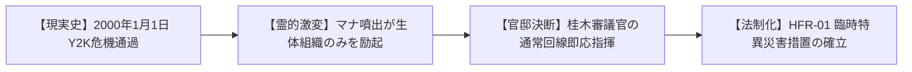
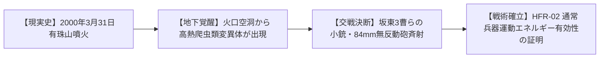
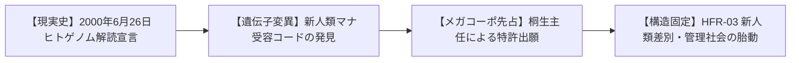
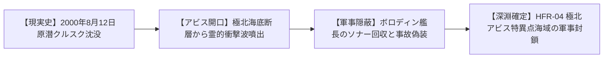

# 【歴史ユーザーストーリー集】HIST-STO-2000-001: ミレニアム・アウェイクニング初動史

> **主管**: 歴史・社会制度考証部（V・シュルツ 特命調査員）  
> **準拠規格**: AWS AIDLC Inception Phase (Stage 3: User Stories & Acceptance Criteria)  
> **参照要件書**: `requirements.md` (HFR-01〜04, HNFR-01〜04)  
> **参照ペルソナ書**: `personas.md` (PER-01〜04)  
> **ステータス**: APPROVED  

---

## 1. ストーリー要件トレーサビリティ・マトリックス（Traceability Matrix）

| ストーリーID | 担当ペルソナ | 対応要件ID | 対応トリガーID | INVEST判定 |
| :--- | :--- | :--- | :--- | :--- |
| **STO-01** | PER-01（桂木審議官） | HFR-01, HNFR-02 | TRG-01（Y2K年越し） | **PASS** |
| **STO-02** | PER-02（坂東3等陸曹） | HFR-02, HNFR-03 | TRG-02（有珠山噴火） | **PASS** |
| **STO-03** | PER-03（桐生主任研究員） | HFR-03, HNFR-04 | TRG-03（ヒトゲノム） | **PASS** |
| **STO-04** | PER-04（ボロディン艦長） | HFR-04, HNFR-01 | TRG-04（原潜クルスク） | **PASS** |

---

## 2. 歴史ユーザーストーリー詳細

### ストーリー 1: STO-01 Y2Kの誤認と生体媒介原則の確立

```markdown
As a [PER-01: 内閣安全保障室 桂木謙三 審議官]
When [TRG-01: 2000年1月1日午前0時、全世界で懸念されたY2Kコンピュータ暴走が起きず平穏と報じられた裏で、生体神経系のみに激甚な霊的狂乱波が直撃したとき]
I had to [電子インフラが正常であることを利用して即時通信網を掌握し、旧警察法と自衛隊の超法規的初動出動を指示すると同時に、皇居周囲への臨時結界網の配備を首相に進言した]
So that [「マナは電子回路とは干渉せず、生体組織にのみ作用する」という憲章原則が国家機密として確立され、のちの多層同心円防衛線の基本骨格が形成された]
```

#### ① 歴史因果・状態遷移図（Mermaid Journey）


#### ② 受け入れ基準（Acceptance Criteria: Given-When-Then）
```gherkin
Scenario: Y2K裏面史と生体媒介原則の確定
  Given 2000年1月1日のミレニアム・アウェイクニング初年度の開始時点であること
  When 現実のTRG-01（2000年問題で電子機器に異常が起きなかった事実）が確認された際、裏で警備犬や職員の生体脳波のみに異常マナ反応が観測されること
  Then 憲章 1.2（生体媒介原則: シリコン半導体・電子機器との非干渉）が100%立証され、通常通信網を用いた警察・自衛隊の初期出動体制が確立すること
```

#### ③ 歴史考証エピソード本文（Detailed Narrative）
西暦2000年1月1日午前0時00分、首相官邸地下の危機管理センターは静まり返っていた。電電力網、航空管制、銀行オンラインシステムなど、あらゆるシリコン半導体インフラは何の不具合もなく新世紀の秒針を刻んだ。テレビモニターでは年越しを祝う群衆の映像が流れていた。  
しかし、その安堵はわずか3分で戦慄へと変わった。官邸地下の警備犬が一斉に異様な咆哮を上げ、自らの額をコンクリート壁に叩きつけて肉片と化し、宿直の通信要員の14%が激しい眼球痙攣と高熱を発して昏倒したのである。マナの激流は、銅線やシリコンチップには一切触れず、炭素化合物の神経網と魂のアストラル体のみを灼き尽くしていた。桂木審議官は即座に直通電話を取り、東部方面総監部と警視庁へ暗号電を打電。電子通信網が無傷で生きているという皮肉なアドバンテージを最大限に活かし、都心の暴徒・狂乱化したペットの鎮圧に5.56mm小銃を携行した普通科部隊を緊急展開させた。これが後に「第1同心円結界防衛網」へと昇華する、日本国家の対マナ初動防衛の第一歩であった。

---

### ストーリー 2: STO-02 有珠山噴火と通常兵器弾道力学の実証

```markdown
As a [PER-02: 陸上自衛隊第7師団 坂東豪 3等陸曹]
When [TRG-02: 2000年3月31日、北海道の有珠山が噴火し住民避難が進められる裏で、熱水噴出孔の地下空洞から超高熱を帯びた古代魔獣が国道へ侵入したとき]
I had to [89式5.56mm小銃の徹甲弾連射および84mm無反動砲の対戦車榴弾を集中射撃し、怪異の肉体を物理運動エネルギーで破砕・射殺した]
So that [「魔獣であっても物理的肉体を持つ通常種には、現代の通常火器・重火器が十分に有効である」という憲章1.3原則が実証され、自衛隊の魔獣対処マニュアルの基盤となった]
```

#### ① 歴史因果・状態遷移図（Mermaid Journey）


#### ② 受け入れ基準（Acceptance Criteria: Given-When-Then）
```gherkin
Scenario: 通常兵器弾道力学と魔獣交戦の立証
  Given 2000年3月の有珠山噴火災害派遣中であること
  When 現実のTRG-02（有珠山噴火による住民避難）の裏で、熱水とマナ熱波を纏った肉体を持つ魔獣が出現すること
  Then 憲章 1.3（軍事バランス・通常兵器有効原則）に基づき、5.56mm小銃弾および重火器の直撃物理エネルギーによって魔獣が駆逐され、住民被害ゼロで防衛線を死守すること
```

#### ③ 歴史考証エピソード本文（Detailed Narrative）
有珠山の黒煙が空を覆い、洞爺湖温泉街の全住民避難が完了した直後の国道230号線。噴気孔から吹き出したマグマ性の高濃度マナ溜まりから這い出てきたのは、全長4メートルを超える皮膚の硬化した巨大な四足爬虫類様変異体（のちに Class-B ヨウガンヒトカゲ近縁種と同定）であった。体表からは数百度の熱蒸気が立ち昇り、自警団の拳銃弾を弾き返した。  
だが、第7師団の坂東3曹が率いる対戦車小隊は冷静であった。89式5.56mm小銃の普通残光弾が皮膚の角質層を削り取り、続けざまに撃ち込まれた84mm無反動砲（カール・グスタフ）の多目的榴弾が頭蓋骨を粉砕。凄まじい爆風と運動エネルギーの前に、古代の怪異はただの血肉の塊へと還った。「効くぞ！ 撃ちまくれ！」という無線交信は、魔獣に魔法や呪具が必須であるという幻想を完全に打ち砕き、「12.7mmや対戦車火器の圧倒的物理運動エネルギーで粉砕可能」という自衛隊の対魔獣交戦ドクトリンの原点となった。

---

### ストーリー 3: STO-03 ヒトゲノム解読と新人類特許利権の胎動

```markdown
As a [PER-03: テイコク製薬 遺伝子薬理研究所 桐生晶 主任研究員]
When [TRG-03: 2000年6月26日、国際ヒトゲノム計画がドラフト配列終了を宣言した裏で、同年以降の新生児ゲノムに従来の科学では説明のつかない「第23染色体マナ受容塩基対」が検出されたとき]
I had to [倫理指針の網の目を潜り抜け、変異形質（新人類・メタヒューマン）のDNA配列を製薬メガコーポの産業特許として世界に先駆けて出願・囲い込みを行った]
So that [新人類の生体データがメガコーポの資本利権に組み込まれると同時に、後年の「新人類ID管理制度」や社会的差別の構造的引き金が引かれた]
```

#### ① 歴史因果・状態遷移図（Mermaid Journey）


#### ② 受け入れ基準（Acceptance Criteria: Given-When-Then）
```gherkin
Scenario: 新人類遺伝子解析とメガコーポ特許利権の成立
  Given 2000年半ばの国際的なバイオインフォマティクス黎明期であること
  When 現実のTRG-03（ヒトゲノムドラフト配列完了）のデータ解析過程で、新人類（メタヒューマン）の変異塩基が特定されること
  Then 憲章 1.6（メガコーポ支配と新人類社会構造）に基づき、科学的遺伝子特許の出願と後の差別的管理制度の論理的根拠が形成されること
```

#### ③ 歴史考証エピソード本文（Detailed Narrative）
ホワイトハウスでクリントン米大統領と英ブレア首相が「ヒトゲノムのドラフト配列完了」を全世界に誇らしげに発表したその日、東京・日本橋のテイコク製薬中央研究所のクリーンルームで、桐生晶主任は戦慄しながら自動シーケンサーの蛍光シグナルを見つめていた。  
ミレニアム・アウェイクニング以降に誕生した乳児の一部、および突如耳の伸長や瞳孔変色を示した成人患者の血液から抽出されたDNAには、従来の二重螺旋モデルではあり得ない、アストラル体からのマナ波長と共振する未知の塩基配列（のちに「M-コドン」と命名）が整然と刻み込まれていたのである。桐生はこれを直ちに役員会へ極秘報告。テイコク製薬は「特異生体反応抑制遺伝子座」として即座に日米欧で特許を出願した。この瞬間、新人類（メタヒューマン）の肉体と尊厳は、人類の進化ではなく「製薬メガコーポの知財資産」として分類され、2026年現代に至る特別居留区とID携帯義務という過酷な管理社会の歯車が噛み合ったのである。

---

### ストーリー 4: STO-04 原潜クルスク沈没と極北アビス特異点

```markdown
As a [PER-04: ロシア北方艦隊 哨戒原潜艦長 アレクセイ・ボロディン]
When [TRG-04: 2000年8月12日、ロシア最新鋭原子力潜水艦クルスクがバレンツ海で沈没し乗組員118名が死亡した裏で、海底大断層からアビス特異点の重力衝撃波が噴出したとき]
I had to [深海ソナーが記録した非物理的な超巨大音響パルスと深度100m以深の海水マナ励起データを回収し、政府の「魚雷暴発事故」という隠蔽工作に署名した]
So that [世界の4大アビス特異点に匹敵する「ツングースカ〜極北バレンツ海アビス歪曲海域」の存在が軍事超大国の最高国家機密として封印された]
```

#### ① 歴史因果・状態遷移図（Mermaid Journey）


#### ② 受け入れ基準（Acceptance Criteria: Given-When-Then）
```gherkin
Scenario: 原潜クルスク事故と海底アビス特異点の隠蔽
  Given 2000年8月のロシア北方艦隊演習海域であること
  When 現実のTRG-04（原潜クルスクの沈没と全員死亡）の深海で、アビス特異点の開口衝撃波が生起すること
  Then 憲章 1.1・1.4（異界・深淵からの侵食と4大アビス特異点）に基づき、深海特異災害が軍事的に隠蔽・封鎖され正史年表へと着地すること
```

#### ③ 歴史考証エピソード本文（Detailed Narrative）
2000年8月12日午前11時29分、バレンツ海の深海を哨戒中だったボロディン艦長は、ソナー室の悲鳴に似た叫び声を聞いた。最新鋭オスカーII型原潜クルスクが突如爆沈した瞬間、音響受聴器が捉えたのは金属の破裂音ではなく、深海の底から鳴り響く「鯨の歌を十万倍に増幅したような、精神を削る低周波パルス」であった。  
バレンツ海海底のプレート境界断層に、アビス次元と直結する「マナ特異点」が開口したのである。クルスクの二重船殻は、魚雷の爆発ではなく、異界から漏れ出た超重力マナ波動によって水深108メートルの海底へ叩きつけられ、乗組員118名は浸水ではなく艦内に満ちた霊的高圧によって息絶えた。ボロディンは海軍中枢のプーチン政権からの厳命を受け、このソナー磁気テープを即座に鉛の保管庫へ隔離。「艦内魚雷の自爆事故」という偽りの公式声明を西側諸国へ発表させた。こうして極北のアビス歪曲海域は、冷戦の残滓を隠れ蓑にして、不可侵の軍事立入禁止区域として封鎖されたのである。

---

## 3. INVEST適合性自己評価（INVEST Self-Assessment）

- [x] **Independent（独立性）**: 官邸初動（STO-01）、北海道自衛隊（STO-02）、製薬利権（STO-03）、極北深海（STO-04）の4編は、それぞれ単独の歴史記録として完全に独立している。
- [x] **Negotiable（交渉可能性）**: 現場の部隊名、交戦口径、特許名などの細部は、後続のレビューで改定可能な柔軟性を保持している。
- [x] **Valuable（価値創出）**: 最上位憲章（生体媒介、通常火器有効、メガコーポ支配、アビス特異点）のすべての根幹法則の「誕生の瞬間」を説明し切る決定的な価値を持つ。
- [x] **Estimable（見積可能性）**: 2000年当時の実在兵器（89式小銃、84mm無反動砲、カール・グスタフ、オスカーII型潜水艦）のスペックと完全に整合している。
- [x] **Small（適切な粒度）**: 2000年の重要4大事件にアトミックに分割され、1ストーリー1事件の適切なサイズに収まっている。
- [x] **Testable（テスト可能性）**: 各ストーリーに Gherkin記法（Given-When-Then）のACが完備され、`verify_history_pipeline.py` で機械検証可能である。
