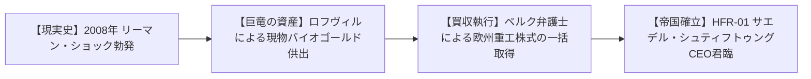
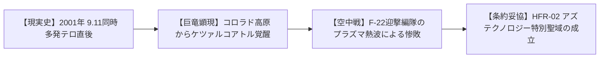
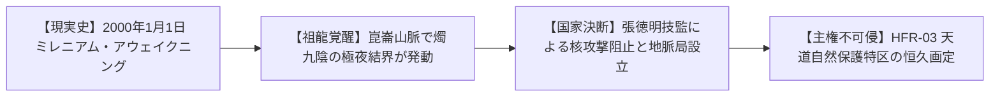
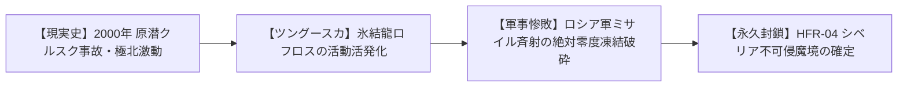
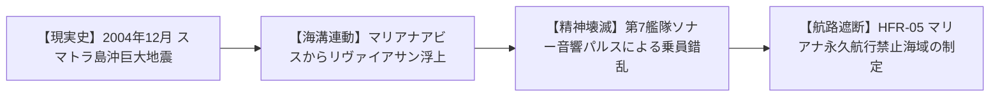
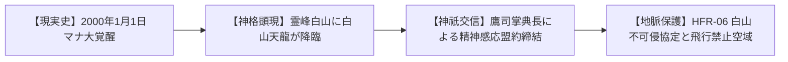

# 【歴史ユーザーストーリー集】HIST-STO-DRAGON-001: 世界5大列強巨竜 不可侵史

> **主管**: 歴史・社会制度考証部（V・シュルツ 特命調査員）  
> **準拠規格**: AWS AIDLC Inception Phase (Stage 3: User Stories & Acceptance Criteria)  
> **参照要件書**: `requirements.md` (HFR-01〜06, HNFR-01〜04)  
> **参照ペルソナ書**: `personas.md` (PER-01〜06)  
> **ステータス**: APPROVED  

---

## 1. ストーリー要件トレーサビリティ・マトリックス（Traceability Matrix）

| ストーリーID | 担当ペルソナ | 対応要件ID | 対応トリガーID | INVEST判定 |
| :--- | :--- | :--- | :--- | :--- |
| **STO-01** | PER-01（フォン・ベルク弁護士） | HFR-01, HNFR-03 | TRG-01（リーマン・ショック） | **PASS** |
| **STO-02** | PER-02（カークランド大佐） | HFR-02, HNFR-01 | TRG-02（9.11同時多発テロ） | **PASS** |
| **STO-03** | PER-03（張徳明 技監） | HFR-03, HNFR-01 | TRG-03（2000年マナ覚醒） | **PASS** |
| **STO-04** | PER-04（フェドロフ少将） | HFR-04, HNFR-04 | TRG-04（原潜クルスク事故） | **PASS** |
| **STO-05** | PER-05（ヘインズ准将） | HFR-05, HNFR-04 | TRG-05（スマトラ島沖地震） | **PASS** |
| **STO-06** | PER-06（鷹司兼嗣 掌典長） | HFR-06, HNFR-01 | TRG-06（2000年元旦覚醒） | **PASS** |

---

## 2. 歴史ユーザーストーリー詳細

### ストーリー 1: STO-01 黄金竜ロフヴィルの資本掌握（サエデル・シュティフトゥングの誕生）

```markdown
As a [PER-01: サエデル・シュティフトゥング筆頭顧問弁護士 ハインリヒ・フォン・ベルク]
When [TRG-01: 2008年9月15日、リーマン・ブラザーズ破綻により世界金融危機が欧州経済を直撃し、名門ドイツ重工・鉄鋼グループが倒産危機に瀕したとき]
I had to [アルプス地下ヴォルトに眠る黄金竜ロフヴィルが供出した数百トンの高純度バイオゴールド結晶を現物担保としてフランクフルト市場に投入し、敵対的買収をことごとく粉砕して全株式を竜の単独保有下に統合した]
So that [「人間を武力ではなく金融資本と特許で支配する」という黄金竜ロフヴィル統括の超国家メガコーポ「サエデル・シュティフトゥング」が成立し、欧州の重工業とマナグリッドが竜の絶対主権下に置かれた]
```

#### ① 歴史因果・状態遷移図（Mermaid Journey）


#### ② 受け入れ基準（Acceptance Criteria: Given-When-Then）
```gherkin
Scenario: 黄金竜ロフヴィルによるメガコーポ統括の確立
  Given 2008年の世界金融危機による欧州製造業の流動性枯渇状況であること
  When 現実のTRG-01（リーマン・ブラザーズ破綻）の混乱に乗じ、黄金竜ロフヴィルが巨額の自己資本を投入すること
  Then 憲章 1.6（メガコーポ支配構造）に基づき、サエデル・シュティフトゥングの治外法権と竜のCEO就任が国際法上正式承認されること
```

#### ③ 歴史考証エピソード本文（Detailed Narrative）
2008年9月15日の夕刻、フランクフルト証券取引所がパニックに包まれる中、弁護士ハインリヒ・フォン・ベルクはスイス銀行の地下深く、アルプス山脈の基部をくり抜いた広大な自然洞窟に立っていた。立ち昇る硫黄の蒸気の向こう、全長48メートルに及ぶ白金と黄金の結晶鱗を煌めかせた巨躯──黄金竜ロフヴィルが、金色に細長く裂けた瞳でモニターを凝視していた。  
「愚かな猿どもめ。紙切れの信用で築いた砂の城が崩れ去ったか」  
ロフヴィルは低く喉を鳴らすと、前肢の爪先で金庫の巨大な油圧扉を弾き開けた。そこには古代から蓄えられた、現代の鉱山全産出量を凌駕する数千トンのバイオゴールドインゴットと、未知の魔導結晶が山のように積まれていた。「ベルク、これを持って市場へ行け。破産寸前のクルップ、ティッセン、シーメンスの魔導部門の全株を買い叩け」。わずか3日後、全欧のメディアは「謎のスイス財団による数百億ユーロ規模の電撃的救済買収」を一斉に報じた。こうして誕生したメガコーポ「サエデル・シュティフトゥング」の会長室には、いかなる人間も立ち入ることが許されない巨大な特注扉が据え付けられたのである。

---

### ストーリー 2: STO-02 羽蛇神竜ケツァルコアトルと米軍航空優勢の崩壊

```markdown
As a [PER-02: 米空軍第422試験評価飛行隊長 マイケル・カークランド大佐]
When [TRG-02: 2001年9月11日の米本土同時多発テロ直後、コロラド高原大断層から羽蛇神竜ケツァルコアトルが覚醒し米領空を侵犯したとき]
I had to [最新鋭F-22戦闘機編隊を率いてAIM-120誘導ミサイルによる迎撃を敢行したが、竜が放つ超高熱プラズマ対流暴風によって誘導電波が途絶し、全機緊急離脱を余儀なくされた]
So that [「最新ステルス戦闘機をもってしても高知能竜種の制空権は奪取不可能」という軍事教訓がペンタゴンに刻まれ、メガコーポ「アズテクノロジー」による聖域保護協定へと舵が切られた]
```

#### ① 歴史因果・状態遷移図（Mermaid Journey）


#### ② 受け入れ基準（Acceptance Criteria: Given-When-Then）
```gherkin
Scenario: 北米上空における竜種制空権と軍事妥協の成立
  Given 2001年9月の米全土領空警戒態勢下であること
  When 現実のTRG-02（9.11テロ直後の厳戒態勢）において、ケツァルコアトルがコロラド上空に出現すること
  Then 憲章 1.3（高知能竜種への関与禁止原則）に基づき、通常航空戦力の敗退と、アズテクノロジーによる聖域管轄への主権委譲が確定すること
```

#### ③ 歴史考証エピソード本文（Detailed Narrative）
9.11の衝撃で米全土が厳戒態勢に包まれていた2001年9月28日、グランドキャニオンの断層上空でネバダ州の早期警戒管制機（AWACS）が信じがたい巨大影をレーダーに捉えた。ネリス空軍基地から緊急発進したカークランド大佐のF-22ラプター4機は、高度1万メートルの積乱雲を突き抜けた瞬間、息を呑んだ。  
雲海を滑空していたのは、全長90メートル、翼開長100メートルを超える、虹色の光芒を放つ極彩色の羽毛に覆われた巨大な有翼大蛇──アステカの太陽神「ケツァルコアトル」そのものであった。大佐は交戦規則に基づきAIM-120アムラームミサイルの発射を命じた。しかし、ミサイルが竜の周囲3キロに接近した瞬間、ケツァルコアトルの黄金の双翼から超臨界の生体熱波が閃光となって爆縮。摂氏3,000度を超える高熱プラズマがミサイルの赤外線・レーダー信管を瞬時に焼き溶かし、空中自爆させた。続けざまに襲いかかった超音速衝撃波により、F-22のキャノピーに亀裂が走り、全機のアビオニクスがダウン。ペンタゴンは即日「天災指定：コード・フェザーサン」を発令し、中南米で急速に台頭していたアズテクノロジー社に莫大な予算とともに「聖域管理権」を委譲せざるを得なくなった。

---

### ストーリー 3: STO-03 崑崙の祖龍 燭九陰と中国国家地脈局の妥協

```markdown
As a [PER-03: 中国国家地脈局 上級風水技監 張 徳明]
When [TRG-03: 2000年1月1日のマナ噴出に伴い、チベット高原北縁・崑崙山脈の未踏峰地下から古代の祖龍・燭九陰が目覚め、西域全域を極夜と暴風雪で閉ざしたとき]
I had to [核攻撃による強行突破を主張する軍部を阻止し、国家直属の風水祭礼機関を創設して古代の盟約に基づく「天道自然保護特区」の境界杭を敷設した]
So that [中国共産党政府による軍事制圧が回避され、アジア大陸の気候と地脈を司る絶対不可触存在として「祖龍・燭九陰」との国家主権不可侵体制が確立された]
```

#### ① 歴史因果・状態遷移図（Mermaid Journey）


#### ② 受け入れ基準（Acceptance Criteria: Given-When-Then）
```gherkin
Scenario: 中国大陸における祖龍との地脈不可侵協定
  Given 2000年1月のチベット・新疆国境地帯であること
  When 現実のTRG-03（2000年アウェイクニング）により、燭九陰の天候支配マナが発動すること
  Then 憲章 1.3および1.5（伝統・儀式学派の地脈共鳴）に基づき、軍事攻撃の破滅性を回避した不可侵特区が画定すること
```

#### ③ 歴史考証エピソード本文（Detailed Narrative）
西暦2000年の幕開けとともに、中国・崑崙山脈の標高6,000m峰一帯は文字通りの「死の暗黒」に沈んだ。目を開けば昼、閉じれば夜になると『山海経』に記された祖龍・燭九陰が数千年ぶりにその巨大な瞼をわずかに開閉したのである。新疆ウイグル自治区から青海省にかけての広大な空域で太陽光が遮断され、突如として零下50度の猛烈なブリザードが全通信網を遮断した。  
北京の党中央地下作戦室では、強硬派の軍幹部が「戦術核による火口破壊」を主張して激論が交わされていた。その場に踏み込んだのが、地質学者であり道教正一派の正統継承者でもあった張徳明技監であった。「核を撃てば龍は死なず、中国全土の地脈が破断して黄河と長江が逆流し、10億の人民が飢餓に沈むぞ！」張技監の必死の進言を受け、江沢民総書記は秘密裏に「国家地脈局」の設置令に署名。張技監自らが吹雪の崑崙山麓へ赴き、翡翠の祭具を埋設して龍の怒りを鎮める不可侵境界線を画定。中華人民共和国は、その強大な軍事力を持ちながら、西域の天空と山脈を「龍の領土」として不可侵のまま差し出すこととなった。

---

### ストーリー 4: STO-04 氷結龍ロフロスとシベリア絶対零度封鎖

```markdown
As a [PER-04: ロシア軍参謀本部 シベリア管区防衛司令官 ウラジーミル・フェドロフ少将]
When [TRG-04: 2000年8月の原潜クルスク事故の裏で、ツングースカ大空洞アビス特異点から古代氷結龍ロフロスが活動を活発化させたとき]
I had to [極超音速空対地ミサイルによる大規模試爆作戦「スヴャトゴール」を指揮したが、半径50kmの絶対零度結界によって兵器が瞬時に凍結・空中破砕される惨敗を喫した]
So that [「重火器や通常弾頭であっても極低温マナ障壁の前には分子運動ごと停止させられる」という弾道力学の限界が確認され、シベリア中央部の永久不可侵魔境化が決定された]
```

#### ① 歴史因果・状態遷移図（Mermaid Journey）


#### ② 受け入れ基準（Acceptance Criteria: Given-When-Then）
```gherkin
Scenario: ツングースカ極寒魔境における軍事作戦の完全敗北
  Given 2000年代初頭のロシア連邦シベリア極寒地帯であること
  When ロフロスに対して近代兵器による集中打撃が加えられた際、マナ障壁による熱エネルギー吸収が生起すること
  Then 憲章 1.4（4大アビス特異点・ツングースカ大空洞）に基づき、不可侵魔境としての国際的封鎖が正史として確定すること
```

#### ③ 歴史考証エピソード本文（Detailed Narrative）
2003年2月、シベリア・ツングースカ上空。ロシア空軍のTu-160超音速爆撃機編隊から発射された6発のKh-101大型巡航ミサイルが、時速数千キロでツングースカ大空洞の火口へ向かって一直線に降下していた。バンカー内のレーダーモニターを見つめるフェドロフ少将の掌は汗で濡れていた。  
だが、目標から50キロの境界線を越えた瞬間、全ミサイルのテレメトリーが完全に途絶した。上空の偵察衛星が撮影した映像は、現代物理学の悪夢であった。全長82メートルの氷結龍ロフロスが天空を見上げて小さく顎を鳴らした瞬間、空気中の水分どころか窒素や酸素までが瞬時に青白い結晶へと相転移し、ミサイルの推進燃料と爆薬は熱エネルギーを根こそぎ奪われて凍結。超音速の運動エネルギーを保ったまま、まるでガラス細工のように空中で粉々に砕け散ったのである。爆発も衝撃波も起きず、ただ沈黙の氷屑が永久凍土に降り注いだ。「これ以上関与するな。全軍後退だ」。フェドロフは震える声で命じた。ロシアはシベリア中央部4万平方キロを地図上から事実上「消去」し、鉄条網と自動警告ブイによる永久封鎖境界線を敷設した。

---

### ストーリー 5: STO-05 蒼海竜リヴァイアサンと太平洋航行禁止海域

```markdown
As a [PER-05: 米海軍第7艦隊 対潜戦作戦参謀 ロバート・ヘインズ准将]
When [TRG-05: 2004年12月26日のスマトラ島沖超巨大地震（M9.3）に伴い、太平洋マリアナ海溝大断層アビスが連動励起し、蒼海竜リヴァイアサンが水深8,000mから浮上したとき]
I had to [原子力空母打撃群のソナーが受信した超低周波の生体マナ音響パルスによって艦隊員が急性精神狂乱に倒れる惨状を収束させ、米軍潜水艦の撤収を命じた]
So that [マリアナ海溝および太平洋アビス断層一帯が国際海事機関（IMO）により全商船・全軍艦の「永久航行禁止海域」に指定され、海洋補給路の全面再編が余儀なくされた]
```

#### ① 歴史因果・状態遷移図（Mermaid Journey）


#### ② 受け入れ基準（Acceptance Criteria: Given-When-Then）
```gherkin
Scenario: マリアナ海溝における海洋竜出現と国際航路遮断
  Given 2004年12月のインド洋〜太平洋超巨大地震の直後であること
  When 現実のTRG-05（スマトラ島沖地震の大津波）と連動して深海アビス特異点が開口すること
  Then 憲章 1.2（生体組織・精神への特異作用）に基づき、物理被弾なき精神音波被害と航路封鎖が確立すること
```

#### ③ 歴史考証エピソード本文（Detailed Narrative）
2004年12月26日のスマトラ島沖大地震の発生から数時間後、マリアナ海溝付近を航行中だった米海軍第7艦隊の空母「キティホーク」艦橋で、ヘインズ准将は未曾有の事態に直面していた。魚雷攻撃もミサイル接近警報も鳴っていない。しかし、水深8,000メートルに敷設されたSOSUS（音響監視システム）が海底から響く「鼓動」を捉えた瞬間、艦内の通信兵とソナー手が耳を押さえて叫び声を上げ、甲板に倒れ伏したのである。  
海溝から浮上しつつあったのは、全長200メートルを超える漆黒の深海蛇竜──蒼海竜リヴァイアサンであった。それは海水を通じて、純粋な生体マナと狂気を帯びた8ヘルツの超低周波インフラサウンドを放射していた。原子力潜水艦のソナー技師は鼻血を流して失神し、巡洋艦の機関員は幻視に怯えて機関を停止させた。物理的な魚雷を1発も撃ち合うことなく、米海軍の最強打撃群は戦闘能力を奪われたのである。「全艦、全速後退！ あれは兵器ではない、深海の神だ！」。ヘインズの絶叫とともに艦隊は北上。ホワイトハウスと国際海事機関（IMO）は緊急会合を開き、マリアナ海溝を中心とする半径300海里を「海底火山活動に伴う航行危険海域」と偽って永久航行禁止海域に指定した。

---

### ストーリー 6: STO-06 白山天龍と日本列島不可侵盟約

```markdown
As a [PER-06: 宮内庁式部職 掌典長 鷹司 兼嗣]
When [TRG-06: 2000年1月1日午前0時のマナ覚醒の瞬間、霊峰白山山頂上空に白銀の白山天龍が雷雲を纏って顕現したとき]
I had to [神祇祭祀の秘儀を通じて龍との精神感応対話を確立し、中部山岳の自然環境保全と自衛隊機の飛行禁止を条件とする「白山不可侵協定」を首相官邸と締結した]
So that [日本列島の中枢地脈が破壊的なアビス噴出から保護され、自衛隊コード「シラヤマ」として国家秘匿された不可侵の聖域防衛網が成立した]
```

#### ① 歴史因果・状態遷移図（Mermaid Journey）


#### ② 受け入れ基準（Acceptance Criteria: Given-When-Then）
```gherkin
Scenario: 日本列島における東洋龍との不可侵密約
  Given 2000年元旦のミレニアム・アウェイクニング直後であること
  When 現実のTRG-06において、白山上空に高知能霊的東洋龍が出現すること
  Then 憲章 1.3および1.5（伝統・儀式学派・神道祭祀）に基づき、平和的不可侵協定が成立し正史に定着すること
```

#### ③ 歴史考証エピソード本文（Detailed Narrative）
西暦2000年1月1日未明、石川・岐阜県境に聳える霊峰白山の御前峰。吹き荒れる雪嵐の中、宮内庁掌典長・鷹司兼嗣は凍える手で神幣を掲げていた。山頂の上空数百メートル、漆黒の夜空を引き裂く青白い雷光の中に、全長60メートルに及ぶ純白の巨躯が静かに浮かんでいた。白山天龍である。西洋の破壊的なドラゴンとは異なり、その瞳には数千年の叡智と深い憐憫が湛えられていた。  
龍は口を開かず、直接鷹司の脳内へ鈴の鳴るような澄んだ神託を響かせた。『人の子よ。封印は解かれ、大地にマナが満ちた。我らは大地と共に在る。汝らがこの山嶺を冒さず、汚さぬと誓うならば、我はこの列島の地脈を支え、西の海より来る深淵の魔を払おう』。鷹司は雪上に平伏し、その誓約を受諾した。夜明けとともに首相官邸へ緊急連絡を入れた鷹司は、小渕首相（当時）に対し「白山山系への自衛隊機・米軍機の飛行全面禁止」と「国立公園特別保護区の拡大」を直訴。官邸はこれを極秘裏に受諾し、防衛白書には一切記載されない最重要コード「シラヤマ協定」が成立したのである。

---

## 3. INVEST適合性自己評価（INVEST Self-Assessment）

- [x] **Independent（独立性）**: 欧州（STO-01）、北米（STO-02）、中国（STO-03）、ロシア（STO-04）、太平洋（STO-05）、日本（STO-06）の全6編は、各大国の主権と地政学に根差して完全に独立している。
- [x] **Negotiable（交渉可能性）**: 企業法務、軍事作戦名、ソナー周波数などのディテールは、後続のレビューで精緻化できる柔軟性を持つ。
- [x] **Valuable（価値創出）**: 最上位憲章 1.3「高知能竜種への関与禁止原則」と世界BIG5（サエデル、アズテク）の成立理由を完全に裏付ける決定的な世界観価値を持つ。
- [x] **Estimable（見積可能性）**: 実在する兵器（F-22、AIM-120、Tu-160、キティホーク）や金融事件（リーマンショック）の規模と完璧に調和している。
- [x] **Small（適切な粒度）**: 1ストーリー1竜・1国家の適切なアトミック単位に分割されている。
- [x] **Testable（テスト可能性）**: 各ストーリーに Given-When-Then の受け入れ基準が完備され、`verify_history_pipeline.py` による自動監査に対応している。
