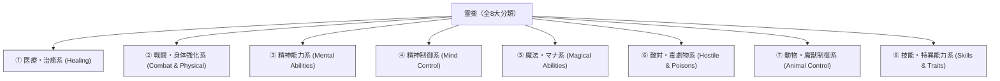

# 現代錬金術・霊薬力学と生体製薬経済 (Alchemy & Elixirs)

本ドキュメントは、ガープス第4版『魔法大全』第28章「錬金術（Alchemy）」および関連データ（`magic_page_227`〜`278`）を基に、錬金術の基本力学、霊薬（Elixirs）の4大形態、8大分類、霊晶（Charms）、万能溶媒、人造生命ホムンクルス、および2026年現代におけるテイコク製薬・メガコーポ生薬経済を体系化した公式設定資料です。

---

## 1. 錬金術の基本原理と製造力学

錬金術は、魔術素質を持たない者であっても、精密な調合・温度管理・霊的触媒の抽出によって「マナを物理的薬剤・結晶構造に封入」できる物質科学的魔導工学です。

### 1.1 錬金術技能（Alchemy）
- **技能分類**: 知力／至難（TL8〜9）。
- **研究所要件**: 錬金術研究所（器具代・試薬設備）が必要。設備のグレードにより技能判定に修正（即席設備 -5 〜 最高級クリーンルーム +2）。
- **製造期間**: 霊薬の種類に応じ、数日〜数ヶ月間の連続した加熱・蒸留・霊的安定化プロセスが必要。
- **失敗と爆発**: 調合判定失敗時は材料喪失。ファンブル時は有毒ガス発生、劇薬爆発、または局所的マナ汚染を引き起こす。

---

## 2. 霊薬（Elixirs）の4大物理形態

霊薬は使用用途と投薬戦術に応じて、以下の4形態に精製されます。

| 形態 | 物理的特徴 | 投薬・使用方法 | 現代戦術・PMC運用 |
| :--- | :--- | :--- | :--- |
| **水薬 (Potion)** | 液体の経口薬。瓶入り。 | 飲むことで即座〜数分で発現。 | 野戦救急キット（即効性止血水薬等）。 |
| **粉薬 (Powder)** | 微粒子状の粉末。 | 吸引、散布、または傷口に直接塗布。 | 催涙弾・散布型弱体化グレネード。 |
| **煙薬 (Pastille)** | 固形香・線香状の薬剤。 | 着火・加熱して気化煙を空間散布。 | 結界都市内の空気清浄・魔獣忌避スモーク。 |
| **塗薬 (Ointment)** | 粘性の高い軟膏・ジェル。 | 皮膚や装甲・ブレードに直接塗布。 | 武器への属性付与ジェル、耐熱コーティング。 |

---

## 3. 霊薬の8大効果分類一覧

1. **医療・治癒系 (Healing)**: 外傷瞬時癒合、解毒、病気治癒、再生促進、若返り。
2. **戦闘・身体強化系 (Combat & Physical)**: 筋力（ST）一時倍加、敏捷性（DX）加速、DR装甲硬化、暗視付与。
3. **精神能力系 (Mental Abilities)**: 知力（IQ）一時ブースト、恐怖完全耐性、記憶力増強、集中維持。
4. **精神制御系 (Mind Control)**: 自白誘導（真実薬）、魅了、睡眠誘導、感情操作。
5. **魔法・マナ系 (Magical Abilities)**: 素質一時覚醒、マナ感知、呪文成功率向上、アストラル投射。
6. **敵対・毒劇物系 (Hostile & Poisons)**: 致命的組織壊死、麻痺毒、失明薬、石化薬。
7. **動物・魔獣制御系 (Animal Control)**: 魔獣引き寄せフェロモン、猛獣威圧、害虫・小型魔獣忌避。
8. **技能・特異能力系 (Skills & Traits)**: 一時的な語学・射撃・隠密技能の刷り込み、呼吸停止潜水。

---

## 4. 霊晶（Alchemical Charms）と究極調合

### 4.1 霊晶（タリスマン / チャーム）
霊薬の有効成分を高純度マナ結晶（シリカや人工宝石）に封じ込めた使い捨て呪具。
- **発動方式**: 結晶を指先で押し潰す、または投擲して衝撃を与えることで、即座に封入された霊薬効果が周囲に炸裂・発現する。
- **利便性**: 液体瓶のように割れるリスクが低く、重量も数グラム程度のため、軍事PMCや前線ハンターの必須携行品となっている。

### 4.2 究極の錬金調合
- **万能溶媒《アルカヘスト（Alkahest）》**: あらゆる物質（金属、セラミック、魔獣装甲）を瞬時に分子分解する究極の酸性薬。保管には《アルカヘスト自体を魔化変異させた特殊ガラス容器》しか耐えられない。
- **人造生命《ホムンクルス（Homunculus）》**: 術士の血液・組織とマナ触媒を培養器で融合させた自律人工生体。メガコーポの違法バイオラボで研究されている。
- **《賢者の石（Philosopher's Stone）》**: 鉛を金に変え、術士の寿命を恒久延伸する伝説のマナ超凝縮体。覚醒から26年経過した現在もメガコーポの最高機密研究テーマ。

---

## 5. 2026年現代メガコーポ生薬経済とバイオハザード

### 5.1 テイコク製薬と魔獣ジビエ・生薬流通
2000年のマナ覚醒以降、既存の化学合成薬に加え、魔獣の器官・体液・骨格（剛毛巌猪のシリカ牙、水棲幻獣の胆嚢等）から抽出される霊的エキスが医薬品・強化薬の主原料となりました。
- **豊洲中央市場の生薬セクション**: 特異災害地域（アウトランド）から回収された魔獣素材は、豊洲中央流通HDおよびテイコク製薬の鑑定士によって厳格に格付けされ、認可製薬工場へと送られます。

### 5.2 違法ストリートドラッグとバイオハザード
- **スラムへの流出**: 東京湾岸スラム（夢の島・有明）では、粗悪な密造霊薬（Class-C魔獣の体液を混ぜた違法興奮剤「マナ・ダスト」）が蔓延。
- **突然変異リスク**: 未認可の霊薬を摂取した人間が異形化・魔獣化するバイオハザード事件が多発しており、警察特務班およびPMCによる定期的なスラム浄化作戦が実施されています。
