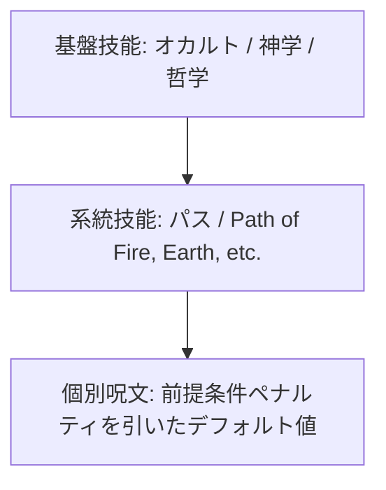

# 代替魔法体系・神聖性と儀式魔術 (Alternate Magic Systems)

本ドキュメントは、ガープス第4版『魔法大全』第4章「さまざまな魔法（Alternate Magic Systems）」および関連データ（`magic_page_186`〜`200`）を基に、僧侶魔法、神聖性（Sanctity）、儀式魔法（パス魔術 / Ritual Magic）、および2026年現代世界における宗教・民族・新人類の魔術体系を構造化した公式設定資料です。

---

## 1. 僧侶魔法と神聖性 (Clerical Magic & Sanctity)

### 1.1 僧侶魔法（Clerical Magic）の定義
神格、自然精霊、または上位霊的存在に対する信仰・誓願を通じて行使される奇跡体系。
- **マナ非依存性**: 通常の魔術が環境中のマナ濃度に依存するのに対し、僧侶魔法は土地や空間の「**神聖性（Sanctity）**」に依存する。マナ枯渇地域であっても神聖性があれば奇跡を発現可能。
- **戒律と恩寵**: 術士は神格の教義・戒律（不殺、清貧、特定儀礼の遵守等）を守らなければならず、教義に反すると恩寵（Power Investigation）を失い、奇跡が発動しなくなる。

### 1.2 神聖性（Sanctity）のレベル分類

| 神聖性レベル | 発動判定修正 | 奇跡・効果への影響 | 現代における代表的地域 |
| :--- | :---: | :--- | :--- |
| **極高（Very High）** | **+5** | 全奇跡の消費エネルギーが半減。即座に奇跡が顕現。 | 皇居最奥（賢所）、伊勢神宮正宮、バチカン聖堂 |
| **高（High）** | **+2** | 奇跡の威力が安定。信徒への加護が強化。 | 明治神宮本殿、主要大社の結界枢軸 |
| **通常（Normal）** | **±0** | 標準的な奇跡の発動が可能。 | 結界都市内の神社仏閣、登録教会 |
| **微弱（Low）** | **-5** | 奇跡の成功率が大幅低下。大掛かりな祈祷が必要。 | 壁外アウトランド（奥多摩・秩父魔境等） |
| **なし（None）** | **発動不可** | 神格との霊的リンクが遮断。奇跡の発動は不可能。 | アビス特異点中心部、旧支配者汚染地域 |

---

## 2. 儀式魔法（パス魔術 / Ritual Magic）

### 2.1 儀式魔法体系の原理
無数の前提呪文ツリーを個別に習得する標準魔術（ハーメチック学派）とは異なり、**体系的な基盤技能（オカルト・神学・哲学）と系統ごとの「道（パス技能）」**を軸に呪文を即興・儀式的に導出する伝統的魔術体系。

### 2.2 技能判定とペナルティ計算
- **基盤技能**: 《儀式魔法（Ritual Magic）》または《オカルト（Occultism）》（知力／至難）。
- **パス技能（Path Skill）**: 各系統（火、地、水、風、治癒、死霊等）ごとの道技能。基盤技能から「-6」等のデフォルトで習得。
- **個別呪文の行使判定**:
  - 標準ツリーにおいて前提呪文が必要な呪文を行使する場合、**「不足している前提呪文の数」ごとに -1 の累積ペナルティ**をパス技能から引いた値で判定する。
  - 高度な呪文であっても、十分な儀式時間、触媒、助力者を集めることで即興発動が可能。

### 2.3 儀式魔法の素質（Ritual Magery）
- 儀式魔法に特化した素質（Ritual Magery）を持つ術士は、儀式の詠唱時間短縮や、複数系統のパスを柔軟に統合するボーナスを得る。
- 日本の伝統・儀式学派（陰陽道・修験道・神道）や、世界各地の先住民族シャーマン（アイヌ、ネイティブ・アメリカン等）の多くがこの体系に属する。

---

## 3. 呪文前提条件の変更と世界観バリアント

### 3.1 呪文前提条件の再編成
キャンペーンや文化圏に応じて、前提条件ツリーを柔軟に再構築するルール。
- **元素四分法**: 火・風・地・水のみを基盤とし、技術系や精神系を四大元素の複合派生として扱う学派。
- **生体・霊性二元論**: 肉体・物質に作用する「生体魔術」と、霊体・魂に作用する「霊導魔術」に二分する体系。

### 3.2 呪文名称の文化別ローカライズ
同一の呪文であっても、学派や文化によって呼称と詠唱プロセスが異なる。

| ガープス標準名称 | ハーメチック学派（理論魔導） | 陰陽道・神道（伝統・儀式学派） | メガコーポ電脳魔術 |
| :--- | :--- | :--- | :--- |
| 《火球（Fireball）》 | 第1種熱量励起弾 | 急々如律令・火焔符 | サーマル・エクスプロージョン・パケット |
| 《霊視（See Invisible）》 | アストラル波長走査 | 霊眼開眼（れい眼の法） | アストラル・スペクトラム・アナライザ |
| 《治癒（Minor Healing）》 | 細胞再生誘導術 | 延命息災の加持祈祷 | バイオ・リペア・プロトコル |

---

## 4. 2026年現代社会における代替魔法体系の実態

### 4.1 伝統・儀式学派と現代防衛体制
- **警察・自衛隊の専門魔法部隊**: 陰陽師や修験僧、神職が専門官として配備され、物理兵器の通じない霊体・悪霊・呪詛災害に対処。
- **多層結界維持**: 皇居および環状防護壁（外環・圏央道）の結界要石は、神道・修験道の大規模な儀礼・儀式魔法によって定期的に再調律・維持されている。

### 4.2 新人類（メタヒューマン）とプレーン・パクト
- **精霊契約（プレーン・パクト）**: 高マナ適性を持つエルフ系新人類や孤立集落の術士は、精霊王や高次元存在と個人的誓約を結び、標準的な消費エネルギーを無視した限定的奇跡を行使する。
- **深淵・邪神呪術（アビス・ソーサリー）の脅威**: アビス特異点近傍で旧支配者の狂気波長を受信した密教カルトが、生贄儀式による破滅的魔術を行使する事件が頻発し、メガコーポPMCおよび警察特務班の最重要警戒対象となっている。
