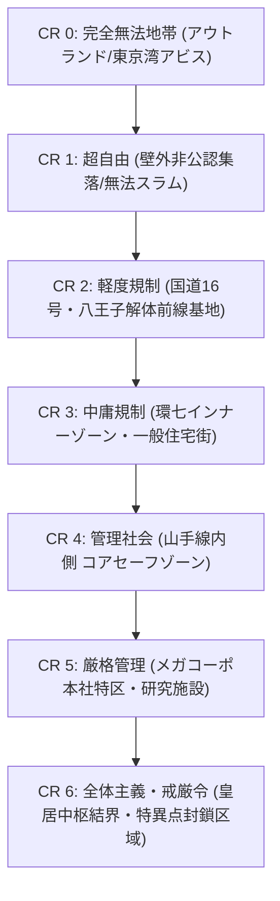

# 規制レベル・法執行・メガコーポ統治力学 (Control Rating, Law Enforcement & Megacorp Governance)

本ドキュメントは、現代（2026年）における首都圏多層要塞網、結界都市、アウトランド、およびメガコーポ特権区域における規制レベル（Control Rating: CR 0〜6）、治安法執行、検問、裁判・処罰、新人類管理法を定めた公式基準書です。

---

## 1. 規制レベル力学 (Control Rating: CR 0 〜 6)

社会・都市・地域における銃火器、魔導行使、移動、および個人の自由に対する規制の厳しさを 0〜6 のスケールで定義する。

### 1.1 各規制レベルの基準と現代社会適用
| 規制レベル | 社会状態・地域例 | 銃火器・武器所持 (LC) | 魔術行使・呪文規制 | 身元認証・ID確認 |
| :--- | :--- | :--- | :--- | :--- |
| **CR 0 (無法)** | 奥多摩・秩父魔境、東京湾アビス・ベイ。 | 規制なし。重機関銃・対戦車ミサイル自由携帯。 | 自由行使。禁忌呪術・アビス契約の行使も野放し。 | なし。完全自己責任。 |
| **CR 1 (超自由)** | 夢の島・有明メガフロートスラム、壁外PMCキャンプ。 | LC1〜4（自動小銃まで可）。重火器は事前登録推奨。 | 攻撃呪文の行使も実質不問。 | ゲート入場時のみ簡易確認。 |
| **CR 2 (軽度)** | 八王子・大宮・柏の解体前線基地（第3同心円）。 | LC2〜4（猟銃・散弾銃・拳銃・ライセンス小銃）。 | 防衛目的の魔術行使許可。 | 基地入場時の検問・魔獣肉検疫。 |
| **CR 3 (中庸)** | 外環・環七インナーゾーン（第2同心円・一般市民街）。 | LC3〜4（登録拳銃・護身テーザー・短剣）。小銃不可。 | 公共空間での攻撃呪文禁止。生活呪文可。 | 一般警察巡回、魔力適性者ID携帯義務。 |
| **CR 4 (管理)** | 山手線内側 コア・セーフゾーン（第1同心円）。 | LC4（非致死性警棒・催涙スプレーのみ。銃火器厳禁）。 | 無認可魔術行使は即時逮捕。探知結界常時稼働。 | 駅・ゲートでの生体スキャン・指紋顔認証。 |
| **CR 5 (厳格)** | 三ツ菱マナテック本社、テイコク製薬治験タワー特区。 | 企業警備員のみ武装。来訪者は全武装解除・預入。 | 電脳魔術・通信魔法の完全ジャミング。 | 網膜スキャン・生体電位DNA照合・手荷物X線。 |
| **CR 6 (戒厳)** | 皇居大結界中枢、春日部地下放水路要塞神殿深部。 | 軍隊・特務魔法部隊のみ。一般人侵入は射殺許可。 | 許可なき詠唱は即座に除霊部隊が武力排除。 | 常時監視・超心理透視スキャン。 |

---

## 2. 法執行・警察・メガコーポ私兵・裁判力学 (Law Enforcement & Justice)

### 2.1 治安機関の階層構造
1. **一般警察 (Metropolitan Police / TL8)**: CR 3〜4 の治安維持、拳銃・ライオットシールド装備、一般犯罪捜査。
2. **警視庁特科魔導隊 (SAT / MPD Magic Unit)**: CR 3〜4 の魔獣侵入・凶悪術士制圧、突撃小銃（5.56mm）・障壁貫通弾・対魔閃光弾。
3. **自衛隊要塞守備隊・防衛省専門魔法部隊**: 壁外要塞線（国道16号・圏央道）の防衛、重火器（12.7mm/155mm榴弾砲）・広域結界維持。
4. **メガコーポ専属PMC (Corporate Security)**: 企業資産・研究所の防衛、治外法権特権。

### 2.2 裁判と処罰 (Trials & Criminal Punishment)
- **一般市民の犯罪**: 警察取調 $\rightarrow$ 司法裁判 $\rightarrow$ 懲役・罰金刑（刑務所収監）。
- **新人類（メタヒューマン）差別裁判**: 陪審員・裁判官の偏見修正（-1〜-3）。魔力暴走・無認可術式行使には重罰（「マナ危険分子」指定）。
- **メガコーポ企業特区での私刑**: 企業法廷により即日判決。重大スパイ・反逆行為には「テイコク製薬生薬治験体への強制転送（実質死刑）」や「記憶消去・電脳ロボトミー」が適用される。

---

## 3. 新人類（メタヒューマン）身元管理法 (Metahuman Identification Act)

- **魔力適性者IDカード (Mana Aptitude ID)**: 魔力適性（Magery）保有者、エルフ・ドワーフ・トロール系新人類に常時携帯が義務付けられている生体チップ内蔵カード。
- **不携帯時の罰則**: 警察・自衛隊の職務質問時に不携帯の場合、即座に最大48時間の身柄拘束および罰金（10万円）。
